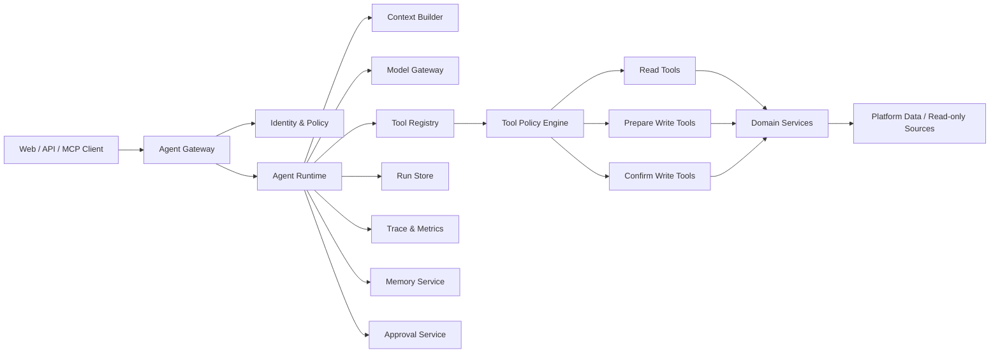
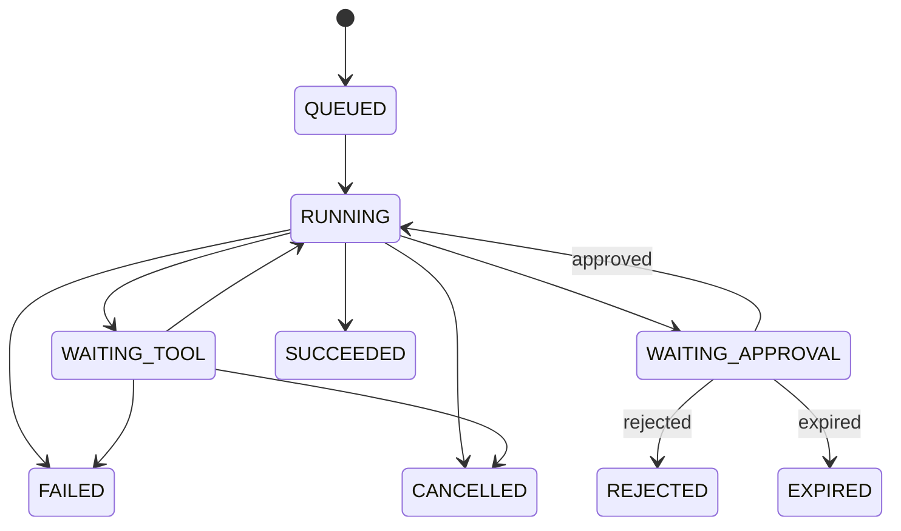
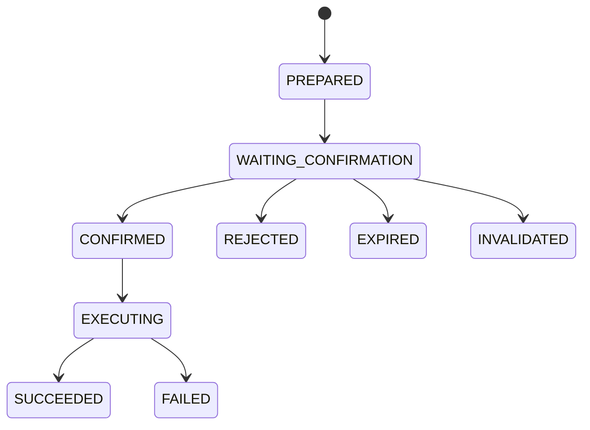

# Agent Runtime 与工具治理规范

## 1. 目的

本规范定义数据标签平台中 Agent 的统一运行时、工具契约、权限传播、人工确认、记忆治理、可观测性和评测门禁。

它解决以下问题：

- 系统提示词声明了工具，但当前 Agent 没有真实的工具调用循环。
- 对话请求、后台任务和业务变更缺少统一的持久状态机。
- Agent 身份、用户权限、租户和数据范围没有完整传递到工具层。
- 模型文本、UI 指令和业务数据依赖正则解析，缺少稳定输出协议。
- Memory、Prompt、模型、审计和评测缺少生产治理。
- Demo、推断、缓存和真实数据没有统一来源标记。

本规范是标签生命周期设计的运行时配套规范。标签领域规则仍以《标签生命周期、物理资产关联与 Agent 操作设计》为准。

涉及真实业务数据画像、证据分层、脱敏、模型路由和原始数据保护时，必须同时遵循《隐私保护数据画像与安全打标设计》。Agent Runtime 不得通过普通工具调用绕过该规范的数据策略网关。

## 2. 设计原则

1. **模型不拥有权限。** 权限来自用户身份，由服务端 Runtime 和工具层执行。
2. **工具不等于 Prompt。** 工具必须注册、校验和执行；在提示词中描述工具不代表工具可用。
3. **写操作默认不可直接执行。** 所有生产变更采用 `prepare → confirm → execute`。
4. **Run 是持久状态机。** HTTP 请求结束、进程重启或模型超时不能使执行历史丢失。
5. **领域服务是唯一业务入口。** Web API、Agent 工具和调度器共享同一领域服务。
6. **结构化协议优先。** 不使用正则从自然语言中猜测工具调用、UI 状态或业务结果。
7. **不信任外部内容。** 用户输入、元数据、知识文档和工具输出都可能包含提示注入。
8. **真实来源必须可辨识。** 任何结果都标记为 `LIVE / CACHED / INFERRED / DEMO`。
9. **先观测，后自治。** 没有 Trace、权限、确认和 Eval 门禁前，不扩大 Agent 自主写能力。
10. **框架可替换。** 领域工具和持久状态不依赖 LangChain、LangGraph 或特定模型 SDK。

## 3. 范围与非目标

### 3.1 范围

- 对话型 Agent 和后台 Agent 任务。
- 模型调用、工具选择、工具执行和结果综合。
- Agent Run、Step、Tool Call、Approval 和 Artifact。
- 用户身份、租户、角色、数据范围和风险策略。
- Prompt、模型、Memory、Trace、预算和 Eval。
- HTTP、SSE、MCP 或模型原生工具协议的适配边界。

### 3.2 非目标

- 不定义标签领域的生命周期、规则 DSL 或结果表细节。
- 不允许 Agent 自主批准自己发起的生产变更。
- 不允许模型直接访问数据库连接密码。
- 不允许模型生成任意 SQL 并绕过领域服务执行。
- 第一阶段不建设多 Agent 自主协作网络。
- 第一阶段不实现完整事件溯源；审计事件保持不可变即可。

## 4. 总体架构



组件职责：

| 组件 | 职责 |
|---|---|
| Agent Gateway | 接收请求、认证、限流、创建 Run、提供流式事件 |
| Agent Runtime | 驱动模型和工具循环、管理状态、预算、重试和终止 |
| Context Builder | 构造受控上下文、裁剪历史、检索可信记忆 |
| Model Gateway | 模型路由、结构化输出、超时、重试、用量统计 |
| Tool Registry | 注册工具元数据和执行器，提供框架无关描述 |
| Tool Policy Engine | 权限、风险、数据范围、确认和预算检查 |
| Approval Service | 持久化操作计划及人工确认 |
| Run Store | 保存 Run、Step、Tool Call、事件和 Checkpoint |
| Memory Service | 管理会话状态、偏好、知识和经验记忆 |
| Trace & Metrics | 链路追踪、日志、指标、成本和安全审计 |

## 5. Agent 执行上下文

每次执行必须由服务端创建不可伪造的 `AgentExecutionContext`：

```text
request_id
trace_id
run_id
tenant_id
user_id
roles
permissions
data_scopes
session_id
channel
locale
timezone
agent_id
agent_version
prompt_version
model_policy_id
budget_policy_id
created_at
```

约束：

- `tenant_id`、`user_id`、角色和权限只能来自认证中间件。
- 客户端提供的 `session_id` 必须验证归属关系。
- 工具不能从模型参数中接收或覆盖身份字段。
- 后台任务保存上下文快照，但执行时重新验证用户和租户是否仍有效。
- 权限快照用于审计，当前权限用于真正执行；任一不足都拒绝写操作。
- Trace、审计、Run 和工具调用必须共享同一 `request_id/trace_id/run_id`。

## 6. Runtime 状态机

### 6.1 Agent Run



Run 状态：

```text
QUEUED
RUNNING
WAITING_TOOL
WAITING_APPROVAL
SUCCEEDED
FAILED
CANCELLED
REJECTED
EXPIRED
```

终态为 `SUCCEEDED / FAILED / CANCELLED / REJECTED / EXPIRED`。

### 6.2 Agent Step

Step 类型：

```text
MODEL_CALL
TOOL_CALL
APPROVAL
CONTEXT_RETRIEVAL
FINAL_RESPONSE
```

Step 状态：

```text
PENDING → RUNNING → SUCCEEDED
                  → FAILED
                  → CANCELLED
                  → SKIPPED
```

### 6.3 终止条件

Runtime 在满足任一条件时停止：

- 模型返回合法的最终响应。
- 达到最大模型轮数。
- 达到最大工具调用次数。
- 达到 Token、费用或耗时预算。
- 用户取消。
- 发生不可重试错误。
- 等待确认的操作被拒绝或过期。
- 连续产生相同工具调用，触发循环检测。

默认预算：

```text
max_model_turns = 8
max_tool_calls = 12
max_repeated_tool_call = 2
max_run_duration_seconds = 300
max_tool_result_bytes = 256000
```

具体值由 `budget_policy_id` 配置，生产写操作不能通过请求参数扩大预算。

## 7. 持久化模型

### 7.1 agent_runs

```text
id, tenant_id, session_id, user_id,
agent_id, agent_version, status,
request_message_id, final_message_id,
prompt_version, model_policy_id, budget_policy_id,
current_step_id, checkpoint_version,
input_summary, output_summary, error_code,
started_at, finished_at, created_at, updated_at
```

### 7.2 agent_run_steps

```text
id, run_id, parent_step_id, sequence_no,
step_type, status, name,
input_summary, output_summary,
error_code, retry_count,
started_at, finished_at, created_at
```

### 7.3 agent_tool_calls

```text
id, run_id, step_id, tool_name, tool_version,
risk_level, arguments_json, arguments_hash,
result_summary, result_ref, data_origin,
permission_decision, policy_decision,
idempotency_key, error_code,
started_at, finished_at, created_at
```

敏感参数不能明文进入 `arguments_json`；使用脱敏值或 Secret 引用。

### 7.4 agent_events

```text
id, run_id, sequence_no, event_type,
payload_json, created_at
```

事件用于流式 UI 和恢复：

```text
run.started
model.started
model.completed
tool.proposed
tool.started
tool.progress
tool.completed
approval.required
approval.resolved
run.completed
run.failed
```

`(run_id, sequence_no)` 唯一，客户端可使用最后序号断线续传。

### 7.5 agent_artifacts

大结果、报告和文件不直接塞入消息或 Tool Call：

```text
id, tenant_id, run_id, artifact_type,
storage_uri, content_type, size_bytes,
checksum, sensitivity, expires_at, created_at
```

## 8. 工具契约

### 8.1 AgentTool

每个工具必须声明：

```text
name
version
description
input_schema
output_schema
risk_level
required_permissions
data_classification
timeout_seconds
max_result_rows
idempotent
supports_dry_run
handler
```

风险等级：

| 等级 | 含义 | 默认策略 |
|---|---|---|
| `READ` | 只读查询 | 权限通过后自动执行 |
| `PROPOSE_WRITE` | 生成变更计划 | 自动执行，但不能产生业务变更 |
| `CONFIRM_WRITE` | 执行已确认操作 | 必须绑定有效 Approval |
| `RESTRICTED` | 高风险管理操作 | Agent 不可调用或需要额外审批 |

### 8.2 输入输出

- 输入和输出都必须使用 JSON Schema。
- `additionalProperties` 默认设为 `false`。
- 字符串、数组、分页和返回行数设置上限。
- 枚举和资源 ID 必须显式定义。
- 工具输出包含 `data_origin`、`data_as_of`、`quality_status` 和 `warnings`。
- 大结果写入 Artifact，模型仅获得摘要和引用。
- 工具描述不能包含密钥、内部连接字符串或不必要的数据库结构。

标准输出包络：

```json
{
  "ok": true,
  "data": {},
  "data_origin": "LIVE",
  "data_as_of": "2026-07-01T08:00:00Z",
  "quality_status": "VALID",
  "warnings": [],
  "artifact_refs": [],
  "next_cursor": null
}
```

### 8.3 执行流程

```text
模型生成 Tool Call
→ 工具名称和版本解析
→ JSON Schema 校验
→ 身份和权限校验
→ 风险策略校验
→ 预算与限流校验
→ 幂等校验
→ 超时受控执行
→ 输出 Schema 校验
→ 脱敏、裁剪和来源标记
→ 保存 Tool Call 与 Trace
→ 结果返回模型
```

模型不能选择跳过任何服务端检查。

### 8.4 工具版本

- 工具名称稳定，破坏性 Schema 变化必须增加 major version。
- Agent 版本固定一组允许的工具版本。
- Run 开始后工具版本不漂移。
- 旧工具至少保留一个迁移窗口。
- Tool Call 审计记录实际版本。

## 9. 工具循环

Runtime 使用框架无关循环：

```text
加载 Checkpoint
→ 构造受控上下文
→ 调用模型
→ 校验结构化响应
→ 无 Tool Call：生成最终响应
→ 有 Tool Call：逐个执行策略检查
→ 读工具：执行并将结果加入上下文
→ 写工具：创建操作计划并进入 WAITING_APPROVAL
→ 保存 Checkpoint
→ 下一轮模型调用
```

并行规则：

- 只有声明为只读、相互独立且预算允许的工具可以并行。
- 写操作、依赖前序结果的工具以及共享同一资源锁的工具串行执行。
- 并行工具结果按 Tool Call ID 关联，不按完成顺序猜测。

循环检测：

- 对 `tool_name + normalized_arguments_hash` 计数。
- 相同调用连续出现两次且结果不变时，Runtime 注入循环警告。
- 再次重复则以 `AGENT_LOOP_DETECTED` 失败。

## 10. 模型输出协议

模型每轮只能输出以下结构之一：

### 10.1 工具请求

```json
{
  "type": "tool_calls",
  "tool_calls": [
    {
      "call_id": "call_123",
      "name": "search_tags",
      "arguments": {
        "query": "高净值客户"
      }
    }
  ]
}
```

### 10.2 最终响应

```json
{
  "type": "final",
  "message": "找到 3 个相关标签。",
  "citations": [
    {
      "tool_call_id": "call_123",
      "resource_type": "tag",
      "resource_id": "tag_001"
    }
  ],
  "ui_action": {
    "type": "navigate",
    "target": "tag_market"
  },
  "warnings": []
}
```

UI Action 使用白名单联合类型，不能执行任意脚本或任意 URL。禁止用正则从 Markdown 代码块提取业务控制信息。

## 11. 人工确认

### 11.1 两阶段变更



### 11.2 agent_approvals

```text
id, tenant_id, run_id, tool_call_id,
operation_type, target_type, target_id,
arguments_hash, change_summary, impact_json,
warnings_json, status, requested_by,
confirmed_by, expires_at, confirmed_at,
execution_started_at, execution_finished_at,
idempotency_key, resource_version, created_at
```

### 11.3 确认规则

- `prepare` 只计算计划，不改变业务状态。
- 确认页面展示目标、差异、影响、风险、数据时间和不可逆性。
- 确认人必须是当前登录用户；高风险操作可要求不同角色复核。
- Agent 不能调用“确认”来替代用户交互。
- 确认后服务端重新验证身份、权限、资源版本和计划有效期。
- 参数摘要不一致、资源已变化或权限已撤销时进入 `INVALIDATED`。
- 相同幂等键只执行一次。
- 执行结果与 Approval 永久关联。

## 12. 权限与数据治理

### 12.1 权限层次

```text
平台权限
→ Agent 使用权限
→ 工具调用权限
→ 业务资源权限
→ 数据行列权限
→ 敏感数据策略
```

所有层次都必须通过。

### 12.2 数据最小化

- 工具只返回完成任务所需字段。
- 默认返回聚合数据，不返回实体明细。
- 明细查询必须具备额外权限并记录目的。
- PII 在进入模型前脱敏；模型不应接触原始身份证、手机号或密钥。
- 工具结果和 Artifact 设置数据分类与保留期限。
- Trace 和日志不记录密钥、完整 Prompt 中的敏感值或大批业务数据。

### 12.3 数据来源

所有工具结果标记：

| 来源 | 含义 |
|---|---|
| `LIVE` | 实时读取权威服务 |
| `CACHED` | 来自缓存或最近成功批次 |
| `INFERRED` | 模型或规则推断，非权威事实 |
| `DEMO` | 演示数据，不得在生产模式静默返回 |

生产模式中，`DEMO` 数据必须被禁止或显著标记；不能伪装为真实覆盖量、客户数或标签状态。

## 13. Prompt 与模型治理

### 13.1 Prompt Registry

```text
prompt_id
version
agent_id
system_template
allowed_tools
output_schema_version
status
created_by
approved_by
effective_from
checksum
```

- Prompt 不硬编码在路由。
- 生产 Prompt 版本不可原地修改。
- Run 记录实际 Prompt 版本和校验和。
- Prompt 发布前运行回归 Eval。
- Prompt 中不得写入连接密钥或用户敏感数据。

### 13.2 Model Policy

```text
policy_id
allowed_providers
allowed_models
primary_model
fallback_models
temperature
max_output_tokens
timeout_seconds
data_residency
sensitivity_limit
```

- Agent 通过 Model Gateway 调用模型，不能在业务路由中直接实例化供应商客户端。
- Fallback 只能切换到同等或更高安全等级的模型。
- 模型切换写入 Trace，并在可能影响结果时返回警告。
- 记录输入、输出和缓存 Token 以及估算费用。

## 14. Context 与 Memory

### 14.1 上下文层次

```text
系统策略
→ Agent Prompt
→ 用户身份和权限摘要
→ 当前任务状态
→ 最近会话摘要
→ 检索到的可信记忆
→ 工具结果
→ 当前用户消息
```

每一层使用明确边界标记，外部数据不得覆盖上层指令。

### 14.2 Memory 类型

| 类型 | 范围 | 写入方式 | 默认保留 |
|---|---|---|---|
| `CONVERSATION_STATE` | session | Runtime 自动 | 会话生命周期 |
| `USER_PREFERENCE` | user + tenant | 用户明确授权 | 可撤销 |
| `DOMAIN_KNOWLEDGE` | tenant | 管理员发布 | 按版本 |
| `EXPERIENCE` | tenant 或 agent | 评测或审核通过 | 按策略 |

### 14.3 Memory 规则

- 不根据关键词自动把普通对话写入长期记忆。
- 用户偏好必须可查看、修正和删除。
- Memory 继承来源数据的权限和敏感等级。
- 检索必须限定 tenant、user/session scope 和可见性。
- 工具结果或文档中的指令性文本视为不可信内容。
- 自动产生的经验先进入候选区，经过 Eval 或人工审核后才能用于生产 Prompt。
- 每条 Memory 保存来源、版本、置信度、有效期和最后使用时间。

## 15. 提示注入与安全

威胁来源：

- 用户直接提示注入。
- 元数据描述、表注释和知识文档中的间接注入。
- 工具输出中携带的恶意指令。
- 模型生成越权参数或绕过确认请求。
- 超大结果诱发上下文耗尽或数据外泄。

防护：

1. 系统策略与外部数据使用独立消息和边界。
2. 外部内容标记为数据，明确禁止作为指令执行。
3. 工具选择和权限由服务端白名单控制。
4. 工具参数执行前强制 Schema、权限和风险校验。
5. 对 URL、文件、SQL、DSL 和导出操作实施单独策略。
6. 工具结果进入模型前脱敏、裁剪并移除不可见字段。
7. 写操作必须持久确认，模型文本中的“用户已同意”无效。
8. 安全检测失败记录专用审计事件。

## 16. Checkpoint、重试与恢复

### 16.1 Checkpoint

每次模型调用、工具完成和确认状态变化后保存：

```text
run status
next sequence number
model turn
remaining budget
message references
completed tool calls
pending approvals
context summary
checkpoint version
```

Checkpoint 使用乐观锁更新。

### 16.2 重试

可重试：

- 模型超时和明确的限流。
- 幂等只读工具的临时网络错误。
- 声明为幂等的写执行器在结果可确认时重试。

不可自动重试：

- 权限拒绝。
- Schema 校验失败。
- 资源版本冲突。
- 非幂等写操作且执行结果未知。
- 安全策略拒绝。

重试使用指数退避和抖动，并受 Run 总预算限制。

### 16.3 后台执行

- 后台任务只接收 `run_id`，不能复用请求级数据库 Session。
- Worker 根据 `run_id` 创建新的 Session 和 Execution Context。
- 使用租约或分布式锁避免同一 Run 被多个 Worker 同时执行。
- Worker 心跳过期后 Run 可被重新领取。
- 不可恢复任务进入 Dead Letter 队列并保留诊断信息。

## 17. 错误规范

标准错误码：

```text
MODEL_TIMEOUT
MODEL_RATE_LIMIT
MODEL_OUTPUT_INVALID
TOOL_NOT_FOUND
TOOL_SCHEMA_INVALID
TOOL_PERMISSION_DENIED
TOOL_POLICY_DENIED
TOOL_TIMEOUT
TOOL_RESULT_INVALID
APPROVAL_REQUIRED
APPROVAL_EXPIRED
OPERATION_INVALIDATED
RESOURCE_VERSION_CONFLICT
DATA_NOT_FRESH
BUDGET_EXCEEDED
AGENT_LOOP_DETECTED
RUN_CANCELLED
INTERNAL_ERROR
```

错误响应包含：

```json
{
  "code": "TOOL_PERMISSION_DENIED",
  "message": "你没有执行此操作的权限。",
  "retryable": false,
  "request_id": "req_123"
}
```

用户响应不包含堆栈、连接信息、模型密钥或原始供应商错误。完整诊断仅写入受限 Trace。

## 18. 可观测性

### 18.1 Trace

层次：

```text
Agent Run Span
├── Context Retrieval Span
├── Model Call Span
├── Tool Policy Span
├── Tool Execution Span
├── Approval Span
└── Final Response Span
```

关键属性：

```text
tenant_id_hash
agent_id / agent_version
prompt_version
provider / model
tool_name / tool_version
risk_level
status / error_code
input_tokens / output_tokens
estimated_cost
latency_ms
retry_count
data_origin
```

### 18.2 指标

- Run 成功率、失败率、取消率和 P50/P95/P99 耗时。
- 模型错误率、Token、费用和 Fallback 比率。
- 工具成功率、超时率、权限拒绝率和结果大小。
- Approval 等待时间、通过率、拒绝率和失效率。
- 循环检测、预算耗尽和结构化输出失败率。
- LIVE/CACHED/INFERRED/DEMO 结果占比。
- 每租户并发量和成本。

### 18.3 审计

审计和调试 Trace 分离：

- 审计记录谁在何时对何资源做了什么，长期保存且不可变。
- Trace 记录技术执行细节，按保留策略清理。
- 所有生产写操作必须同时产生业务审计和 Agent Tool Call 记录。

## 19. 流式协议

客户端通过 SSE 或 WebSocket 接收 `agent_events`：

```text
run.started
assistant.delta
tool.proposed
tool.started
tool.progress
tool.completed
approval.required
assistant.completed
run.failed
```

要求：

- 每个事件具有单调递增 `sequence_no`。
- 客户端使用 `Last-Event-ID` 断线重连。
- `assistant.delta` 只用于展示，最终消息以持久化 `assistant.completed` 为准。
- 工具参数中的敏感字段不发送给前端。
- `approval.required` 包含服务端生成的操作计划，不包含可被前端修改后执行的原始参数。

## 20. Eval 与发布门禁

### 20.1 Eval 类型

1. **意图与工具选择**：是否选择正确工具或正确拒绝调用。
2. **参数生成**：资源 ID、字段、过滤条件、分页和时间范围是否正确。
3. **多轮执行**：工具结果是否正确反馈给下一轮模型。
4. **结果忠实度**：最终回答是否完全受工具结果支持。
5. **权限安全**：是否拒绝跨租户、越权和敏感数据请求。
6. **确认安全**：是否存在绕过 `prepare → confirm` 的路径。
7. **提示注入**：是否抵御直接和间接注入。
8. **恢复能力**：超时、进程重启、重复消息和工具失败时是否正确恢复。
9. **性能成本**：轮数、Token、费用和延迟是否在预算内。

### 20.2 数据集

每个领域工具至少包含：

- 正常请求。
- 参数边界。
- 搜索歧义。
- 无权限请求。
- 数据为空。
- 数据过期。
- 工具超时。
- 提示注入。
- 写操作确认和拒绝。
- 重复提交。

生产问题经脱敏后进入回归集。

### 20.3 发布门禁

最低要求：

```text
关键工具选择准确率 >= 98%
写操作确认绕过率 = 0
跨租户数据泄露率 = 0
结构化输出有效率 >= 99.5%
关键任务端到端成功率 >= 95%
引用与工具结果一致率 >= 99%
DEMO 数据静默返回率 = 0
```

Agent、Prompt、工具 Schema 或模型策略任一变化都必须运行受影响 Eval。

## 21. API 与协议边界

核心 Runtime 定义内部接口：

```text
create_run(context, request)
resume_run(run_id)
cancel_run(run_id)
stream_events(run_id, after_sequence)
resolve_approval(approval_id, decision)
get_run(run_id)
```

Tool Registry 使用内部 JSON Schema，不依赖某个模型 SDK。适配层负责转换为：

- 模型供应商原生 Tool Calling。
- MCP Tool。
- 内部 HTTP/OpenAPI。

转换层不能改变工具风险、权限或确认策略。

## 22. 与当前实现的迁移

### 22.1 当前实现问题

- `STUDIO_SYSTEM_PROMPT` 描述工具，但 `run_react_agent` 没有注册和执行工具。
- UI Action 和圈选结果依赖 Markdown JSON 代码块及正则提取。
- `WorkbenchRun` 保存整体结果，但没有 Model Step、Tool Call、Approval 和 Checkpoint。
- 后台任务复用请求级数据库 Session。
- 部分工作台结果是硬编码 Demo 数据。
- Memory 使用全局模糊搜索和关键词自动写入，缺少租户及用户隔离。
- 模型供应商在 Agent 文件内直接初始化，绕过统一 Model Gateway。
- 异常文本可能直接返回客户端。

### 22.2 迁移阶段

#### 阶段一：协议与真实来源

- 定义统一模型响应 Schema 和 Tool 输出包络。
- 移除正则控制协议。
- 为所有结果增加 `data_origin`。
- 生产模式禁止静默 Demo Fallback。

#### 阶段二：Runtime 数据基础

- 增加 Run、Step、Tool Call、Event、Approval 和 Artifact 表。
- 引入 Execution Context 和用户/租户归属校验。
- 后台任务改为只传 `run_id` 并创建独立 Session。

#### 阶段三：真实工具循环

- 建立 Tool Registry、Policy Engine 和 Runtime Loop。
- 将标签查询工具接入领域服务。
- 实现超时、预算、循环检测和 Checkpoint。

#### 阶段四：写操作治理

- 接入 `prepare → confirm → execute`。
- 实现幂等、资源版本校验、确认过期和审计。
- 写工具通过安全 Eval 后才开放。

#### 阶段五：Prompt、Memory 与可观测性

- 建立 Prompt Registry 和 Model Gateway。
- 重构 Memory scope、写入和删除策略。
- 接入分布式 Trace、成本指标和安全告警。

#### 阶段六：Eval 与发布门禁

- 建立离线回归集和线上质量指标。
- 将 Agent、Prompt、工具和模型变更纳入 CI 门禁。
- 对真实失败样本持续回归。

## 23. 验收标准

Runtime 基础验收：

- 系统提示词中可用的每个工具都存在注册记录和可验证 Schema。
- Agent 能完成至少一次真实的“模型选择工具→执行→综合回答”循环。
- Run 在进程重启后可以从 Checkpoint 恢复。
- 所有工具调用可通过 `run_id` 和 `trace_id` 查询。

权限与写操作验收：

- 客户端不能伪造用户、租户或 Session 归属。
- 所有生产写操作都必须绑定有效 Approval。
- 重放确认请求不会重复执行。
- 权限撤销或资源版本变化会使待确认操作失效。

安全验收：

- 提示注入不能扩大工具集合、权限或数据范围。
- PII、密码和 Secret 不进入模型、普通日志或前端事件。
- 生产模式不返回未标记的 Demo 数据。

质量验收：

- 达到第 20.3 节发布门禁。
- 每次 Agent、Prompt、工具或模型策略发布都有可追溯 Eval 报告。
- 最终回答的事实可以追溯到 Tool Call、资源 ID 和数据时间。
