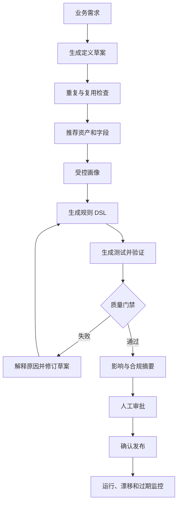

# 银行标签 Agent 业务场景与产品自动化设计

## 1. 目标

本设计定义标签平台中哪些业务环节适合使用 Agent、自动化边界、用户角色和产品交互。Agent 用于检索、解释、生成草案、受控执行和持续治理，不替代银行法定审批人或高风险业务决策者。

本设计必须与以下规范共同执行：

- 《Agent Runtime 与工具治理规范》
- 《标签生命周期、物理资产关联与 Agent 操作设计》
- 《隐私保护数据画像与安全打标设计》
- 《领域 Agent 架构及单体迁移设计》

## 2. 银行真实约束

- 数据分散在核心、支付、卡、信贷、财富、CRM、渠道和监管系统。
- 同一客户可能存在多个客户号、账户号和法人主体。
- 主数据、历史拉链表、日终快照和交易流水语义不同。
- 生产数据包含 PII、账户、交易、资产、风险和合规信息。
- 业务定义需要数据负责人、业务负责人和合规人员共同确认。
- 标签计算通常依赖批量日终数据，部分事件标签要求准实时。
- 监管、审计和模型风险管理要求结论可解释、可追溯、可复现。
- 银行内网可能无互联网，模型和依赖必须支持私有化与离线交付。

## 3. 用户角色

| 角色 | 主要任务 | Agent 权限 |
|---|---|---|
| 业务分析师 | 提出标签需求、圈选客群 | 检索、草案、预估 |
| 数据开发 | 绑定资产、开发规则、验证 | 草案、受控执行 |
| 数据管理员 | 管理元数据、画像和质量 | 查询、画像审批 |
| 数据负责人 | 审批口径和数据使用 | 审批、发布确认 |
| 合规/隐私人员 | 审查敏感数据和模型路由 | 审批、审计 |
| 营销运营 | 使用已发布标签和客群 | 查询、保存、导出审批 |
| 平台运维 | 管理运行、容量和故障 | 诊断、受控运维 |
| 审计人员 | 检查来源、操作和数据去向 | 只读全链路 |

Agent 始终继承当前用户权限，不使用超级管理员身份。

## 4. 产品能力分层

| 层级 | 能力 | 交互 |
|---|---|---|
| L0 | 状态机、权限、画像、脱敏、DSL编译、调度 | 确定性系统 |
| L1 | 检索、解释、摘要、失败诊断 | 自动执行 |
| L2 | 标签定义、规则、测试和影响草案 | 用户确认后保存 |
| L3 | 画像、验证、发布、导出和调度变更 | 操作计划 + 人工确认 |
| L4 | 信贷、AML、制裁、监管和权益决策 | 仅辅助，不执行最终决定 |

## 5. 业务场景矩阵

| 场景 | Agent 输入 | Agent 输出 | 自动化边界 |
|---|---|---|---|
| 数据接入 | 数据库类型、网络和凭据引用 | 扫描计划、错误解释 | 连接保存需确认 |
| 元数据发现 | 表、字段、注释和血缘 | 业务域、语义、敏感候选 | 候选不可直接发布 |
| 数据画像 | 资产和策略 | 统计证据、质量与漂移 | L2/L3证据按策略审批 |
| 标签需求 | 自然语言需求 | 定义、实体、值类型、频率 | 只生成草稿 |
| 重复检查 | 标签目录 | 同义、重复、可组合标签 | 用户决定复用或新建 |
| 证据选择 | 资产目录、血缘、画像 | 表、字段、Join候选 | Join须审批 |
| 规则开发 | 定义与证据 | 结构化DSL和解释 | 禁止任意SQL |
| 样本验证 | 规则、画像、测试数据 | 命中率、边界和异常分析 | 质量门禁确定性执行 |
| 治理审批 | 版本、依赖、敏感级别 | 差异、影响、风险摘要 | Agent不审批 |
| 发布 | 已审批版本 | 发布计划、回滚方案 | 人工确认 |
| 客群圈选 | 标签组合和条件 | 数量、画像、冲突和时效 | 明细与导出需审批 |
| 标签运维 | Run、漂移、成本和SLA | 根因、修复建议 | 生产变更需确认 |
| 下线治理 | 使用率、重复和依赖 | 停用候选、替代标签 | 人工确认 |
| 合规审计 | tag/run/tool/payload记录 | 完整证据链 | 只读自动 |

## 6. 标签开发自动化



### 6.1 需求阶段

Agent 提取：

```text
业务目标
目标实体
业务定义
值类型
更新频率
有效期
使用场景
负责人
敏感性候选
```

信息缺失时逐项询问，不能用模型猜测负责人、法律依据或审批角色。

### 6.2 重复与复用

Agent 同时检索名称、语义、规则和目标实体，输出：

- 完全重复；
- 近义标签；
- 可复用基础标签；
- 可通过组合得到；
- 必须新建。

不能只按名称判断重复。

### 6.3 证据与规则

Agent 推荐物理资产、字段和已审批 Join，说明正向与冲突证据。规则以结构化 DSL 保存；SQL 由编译器生成。

### 6.4 验证

自动生成：

- 正常命中；
- 边界值；
- 空值；
- 枚举外值；
- 重复主体；
- 时间窗口；
- 源数据延迟；
- 历史回归；
- 命中率突变。

### 6.5 审批与发布

Agent 生成版本差异、覆盖变化、敏感数据、依赖、下游影响、成本、回滚和模型可见数据摘要。审批和发布分别由授权用户完成。

## 7. 客群圈选

自然语言先转换为可解释的组合 DSL：

```text
(高净值客户 = true)
AND (近30天活跃 = true)
AND NOT (营销禁联 = true)
```

结果必须展示：

- 标签编码和版本；
- 数据截至时间；
- 结果是否过期或降级；
- 估算或精确计数；
- 排除规则；
- 敏感数据和用途限制；
- 使用的实体身份解析版本。

保存、明细查看、导出和下发是不同风险操作，分别授权。

## 8. 高风险禁区

Agent 不得直接执行：

- 信贷审批、授信额度和风险定价；
- AML可疑交易最终定性；
- 制裁命中处置；
- 监管报送最终确认；
- 客户账户冻结、限制或权益变更；
- 高敏数据跨境；
- 生产标签自主发布或停用；
- 绕过营销同意、禁联和用途限制。

## 9. 产品页面

### 9.1 统一 Agent 工作台

展示对话、当前任务、工具步骤、证据、待确认操作和结果来源。所有事实可展开到 Tool Call 和数据时间。

### 9.2 标签开发 Copilot

Agent 嵌入定义、证据、规则、验证、审批和发布每一步；页面状态由领域工作流决定，不能由模型任意跳步。

### 9.3 运行与治理中心

Agent 汇总失败、漂移、过期、成本、依赖和低使用率标签，支持一键生成修复计划。

### 9.4 审计中心

按用户、标签、资产、模型、工具、Payload和时间检索，区分 LIVE、CACHED、INFERRED和DEMO。

## 10. 业务KPI

- 标签需求到验证通过的中位时间。
- 重复标签拦截率。
- Agent草案一次通过率。
- 人工修改率和驳回原因。
- 生产标签质量异常率。
- 标签覆盖和使用率。
- 无依据回答率。
- 高风险确认绕过率，目标为0。
- 原始用户数据发送模型次数，默认目标为0。

## 11. 验收标准

- 标签开发全流程可由 Agent 辅助，但状态机和审批不可绕过。
- 每个候选结论展示证据和数据时间。
- 所有写操作均形成可审阅计划。
- 银行高风险决策只提供辅助信息。
- 客群结果执行用途、数据和实体权限。
- 产品中不存在未标记的 Demo 结果。

