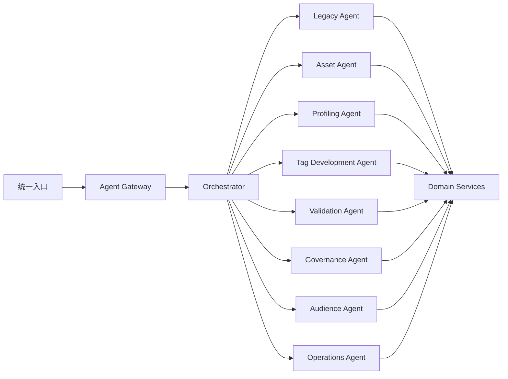

# 领域 Agent 架构及单体迁移设计

## 1. 决策

目标架构采用“统一编排器 + 领域 Agent”。现有单体超级 Agent 作为兼容入口，逐步迁移到领域 Agent，而不是一次性重写。

本设计以《Agent Runtime 与工具治理规范》作为执行基础，以《银行标签 Agent 业务场景与产品自动化设计》定义业务边界，并遵循《隐私保护数据画像与安全打标设计》。

## 2. 三种方案

| 方案 | 优点 | 缺点 | 决策 |
|---|---|---|---|
| 单体超级Agent | 快速、入口统一 | Prompt膨胀、权限和评测困难 | 仅过渡 |
| 编排器+领域Agent | 边界清晰、可治理、可扩容 | 需要统一Runtime和路由 | 目标方案 |
| 事件驱动自治网络 | 自动化和扩展最强 | 审计、循环和一致性复杂 | 后续演进 |

## 3. 逻辑架构



Agent 之间不直接调用；Orchestrator 负责任务分解和结果汇总。跨 Agent 状态保存在 Run/Step/Artifact，不放在自然语言中传递。

## 4. 领域 Agent

| Agent | 职责 | 允许工具 |
|---|---|---|
| Asset | 搜索资产、语义和血缘 | 资产只读、候选关系 |
| Profiling | 画像、敏感检测和漂移 | 受控画像、Payload Manifest |
| Tag Development | 定义、证据和规则草案 | 标签目录、DSL草案 |
| Validation | 测试生成和质量分析 | 预览、验证、回归 |
| Governance | 差异、影响、合规摘要 | 审计、依赖、审批读取 |
| Audience | 标签组合和客群查询 | 规模、画像、保存计划 |
| Operations | Run诊断、过期和成本 | 运行查询、修复计划 |

每个 Agent 固定：

```text
agent_id
agent_version
prompt_version
allowed_tools
risk_policy
model_policy
budget_policy
memory_scope
eval_suite
```

## 5. Orchestrator

职责：

- 识别意图与业务任务；
- 选择一个主 Agent；
- 对明确的跨域任务生成有向无环计划；
- 设置预算和权限上下文；
- 汇总结构化结果；
- 处理等待确认、取消和恢复。

不负责：

- 实现领域规则；
- 直接访问数据库；
- 替代 Tool Policy；
- 自行批准写操作；
- 通过自然语言调用隐藏工具。

路由优先级：

```text
显式页面/任务上下文
→ 确定性意图规则
→ 结构化分类模型
→ 用户消歧
```

低置信度时要求用户选择，不能同时调用多个高成本 Agent 猜测。

## 6. 模块化单体

第一阶段领域 Agent 与 Runtime 在同一代码仓库和进程边界内：

```text
backend/app/agents/
  orchestrator/
  asset/
  profiling/
  tag_development/
  validation/
  governance/
  audience/
  operations/
backend/app/agent_runtime/
backend/app/tools/
backend/app/domain/
```

逻辑隔离先于物理微服务拆分。拆分条件：

- 独立资源类型，如重画像或大批量计算；
- 独立扩缩容；
- 不同安全域；
- 独立发布节奏；
- 故障隔离要求。

## 7. 从单体 Agent 迁移

### 7.1 Strangler 模式

- 统一入口保持不变。
- Capability Router 按 Feature Flag 分流。
- 新功能只进入领域 Agent。
- 已迁移能力从 Legacy Prompt 和旧路由删除。
- 同一工具只有一个权威实现。
- 新旧路径共享领域服务和业务状态。

### 7.2 迁移顺序

```text
Tag Development
→ Validation
→ Asset
→ Profiling
→ Governance
→ Audience
→ Operations
```

标签开发优先，因为它能验证定义、证据、规则、验证、确认和发布全链路。

### 7.3 流量切换

```text
Shadow：新路径执行但不返回
Canary：内部租户或5%流量
Ramp：25% → 50% → 100%
Retire：删除旧能力
```

每阶段比较任务成功率、工具选择、结果一致性、延迟、成本和人工修改率。

### 7.4 回退

回退只允许切换到仍受支持的旧真实路径。禁止回退到硬编码 Demo 结果。新路径产生的业务变更必须由共同领域服务处理，使旧入口仍可读取。

## 8. Agent协作协议

Orchestrator 传递结构化 Task Envelope：

```json
{
  "task_id": "task_123",
  "task_type": "develop_tag",
  "resource_refs": ["tag:draft_1"],
  "constraints": {
    "max_steps": 8,
    "risk_level": "PROPOSE_WRITE"
  },
  "expected_output_schema": "tag_draft.v1"
}
```

领域 Agent 返回：

```json
{
  "status": "SUCCEEDED",
  "result_ref": "artifact:456",
  "citations": [],
  "warnings": [],
  "next_actions": []
}
```

禁止用自由文本解析 Agent 间控制信息。

## 9. 记忆边界

- 对话状态由 Orchestrator 管理。
- 领域 Agent 只读取任务需要的 Memory scope。
- 用户偏好不能变成业务事实。
- 人工修正进入候选经验，评测通过后发布。
- Agent 之间不共享未审核的长期记忆。

## 10. 事件驱动演进

方案二稳定后可以引入：

```text
asset.schema_changed
profile.drift_detected
tag.expiring
tag.run_failed
tag.quality_degraded
```

事件创建治理 Run 或操作建议。任何发布、停用、导出和高风险操作仍需人工确认。

## 11. 测试

- 每个 Agent 独立工具选择和安全 Eval。
- Orchestrator 路由准确率和消歧测试。
- 跨 Agent 计划不形成循环。
- Feature Flag 和租户灰度。
- Shadow 结果一致性比较。
- 写操作在新旧路径中均不能绕过确认。
- Legacy 能力删除后无隐藏入口。

## 12. 验收标准

- Legacy Prompt 不再新增工具。
- 标签开发领域 Agent 完成真实工具闭环。
- Agent工具、权限、模型和评测相互隔离。
- 路由和协作使用结构化协议。
- 新旧路径共享领域服务。
- 迁移可灰度、可观测、可回退。
- 方案二稳定前不启用自治多 Agent 写操作。
