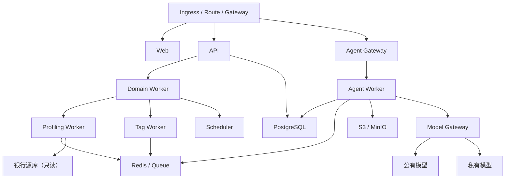

# 多平台容器化部署与运维设计

## 1. 目标

建立一套镜像、一套 Helm Chart、多套环境值的交付体系，支持：

- 公有云 Kubernetes；
- 银行内网 Kubernetes/OpenShift；
- 无互联网离线环境；
- 开发和演示用 Docker Compose。

应用代码不因平台形成分支。

本设计承载《Agent Runtime 与工具治理规范》和《领域 Agent 架构及单体迁移设计》定义的运行组件；网络与模型出口必须满足《隐私保护数据画像与安全打标设计》。

## 2. 部署架构



## 3. Workload

| Workload | 职责 | 扩容 |
|---|---|---|
| web | 静态前端 | HTTP流量 |
| api | REST、认证、领域查询 | QPS |
| agent-gateway | Run、SSE、确认 | 会话数 |
| agent-worker | 模型和工具循环 | 并发Run |
| profiling-worker | 画像、敏感检测、脱敏 | 数据任务 |
| tag-worker | 验证和标签计算 | 计算任务 |
| scheduler | 调度、补偿和恢复 | 单主/主备 |
| model-gateway | 模型路由和DLP | 模型QPS |

PostgreSQL、消息队列和对象存储优先外置。Compose可以使用容器依赖，生产不将数据库与应用绑定在同一生命周期。

## 4. 网络安全域

```text
接入区：Web、API Gateway
应用区：API、Agent Gateway、Agent Worker
数据处理区：Profiling Worker、Tag Worker
数据区：PostgreSQL、Queue、Object Storage
模型出口区：Model Gateway、DLP、Egress Proxy
```

强制 NetworkPolicy：

- 只有 Profiling Worker 和批准的 Tag Worker 可访问源库。
- Agent Worker 不能直连源库。
- 只有 Model Gateway 可以访问外部模型。
- Web 不能访问数据库或队列。
- 数据处理区不能任意访问互联网。
- 管理端口仅对监控和运维命名空间开放。

## 5. 平台适配

| 能力 | 公有云K8s | OpenShift/内网 | Compose |
|---|---|---|---|
| 入口 | Ingress/云网关 | Route/银行网关 | Nginx |
| 镜像 | 云仓库 | Harbor | 本地 |
| Secret | KMS/Secret | Vault/HSM | 开发`.env` |
| 对象存储 | S3兼容 | MinIO/内部存储 | MinIO |
| 数据库 | 托管PG | 银行PG | PG容器 |
| 队列 | 托管服务 | Redis/RabbitMQ/Kafka | Redis |
| 监控 | 云监控/OTel | Prometheus/Grafana | 日志 |
| 模型 | 公有+专有 | 私有/受控出口 | Mock |

## 6. 镜像规范

- 非Root运行，支持OpenShift随机UID。
- 只读根文件系统。
- 不要求 privileged、hostNetwork 或 hostPath。
- 临时文件写入显式 EmptyDir/PVC。
- 配置与镜像分离。
- 镜像不包含 Secret、测试数据或开发凭据。
- 多阶段构建和最小运行时镜像。
- amd64为银行验收基线，同时发布arm64。
- 生成SBOM、漏洞报告、签名和来源证明。
- 离线交付包含镜像清单和校验和。

## 7. 交付结构

```text
deploy/
  docker/
    Dockerfile.api
    Dockerfile.web
    Dockerfile.worker
    compose.yaml
  helm/data-label/
    Chart.yaml
    values.yaml
    values-cloud.yaml
    values-openshift.yaml
    values-airgapped.yaml
    templates/
  policies/
    network-policies/
    pod-security/
    model-egress/
  offline/
    image-manifest.yaml
    install.sh
```

普通环境差异使用 Values；租户权限、审批和模型路由保存在平台策略中，禁止通过环境变量放宽。

## 8. 状态与队列

- Run、Step、Tool Call、Approval和Checkpoint在PostgreSQL。
- Queue只负责投递，不是权威状态。
- Queue丢失后扫描数据库恢复未完成Run。
- Worker只接收`run_id`。
- Worker使用租约和心跳。
- Profiling、Tag和交互Agent使用独立队列。
- 工具执行使用幂等键。
- 大结果进入对象存储，数据库保留引用。

## 9. 可用性

- API、Gateway、Worker多副本。
- Scheduler使用Leader Election。
- Pod有startup、readiness和liveness probe。
- 使用PodDisruptionBudget和反亲和。
- 优雅停机时停止领任务、保存Checkpoint、释放租约。
- 模型、源库和队列分别配置熔断和限流。
- 私有模型不可用时禁止自动降级到公有模型，除非策略明确允许。

目标：

```text
API/Gateway availability >= 99.9%
read-only Agent query P95 < 10s
long-running task submission < 2s
unfinished Run recovery < 5min
RPO <= 5min
RTO <= 30min
```

## 10. 配置与Secret

- ConfigMap：非敏感技术配置。
- Secret/Vault引用：数据库、模型和对象存储凭据。
- Model Policy：供应商、区域、敏感等级和Fallback。
- Tenant Policy：权限、审批、画像和数据范围。
- Secret只挂载给需要的Workload。
- Agent和前端永远不读取数据库明文密码。
- Secret轮换不要求重新构建镜像。

## 11. 可观测性

统一OpenTelemetry：

- HTTP、Run、模型、工具、队列和数据库Trace。
- Agent成功率、Token、成本、工具延迟和确认等待指标。
- Worker积压、租约、重试和Dead Letter。
- Profiling扫描量、数据源压力和策略阻断。
- 数据不写入普通日志；敏感字段默认脱敏。

## 12. 数据库迁移

- 使用expand/migrate/contract。
- 新版本先兼容旧Schema。
- 数据回填使用可恢复后台任务。
- 至少跨一个应用版本再删除旧列。
- Helm升级前执行只读预检。
- 迁移失败不启动不兼容应用。
- 提供数据库备份、恢复和回滚说明。

## 13. 离线与OpenShift

离线包包含：

- 全部镜像及摘要；
- Helm Chart；
- CRD与策略清单；
- SBOM、许可证和漏洞报告；
- 安装、升级、备份和卸载说明；
- Mock模型与连通性诊断工具。

OpenShift验收：

- 随机UID；
- restricted SCC；
- 只读根目录；
- 无hostPath；
- Route；
- NetworkPolicy；
- 内部Registry；
- 无公网依赖。

## 14. CI/CD矩阵

每次发布验证：

1. Compose冒烟。
2. 标准Kubernetes安装、升级和回滚。
3. OpenShift兼容。
4. 无互联网安装。
5. 外置PG/Redis/对象存储。
6. 公有、私有和Mock模型。
7. NetworkPolicy阻断非法访问。
8. 滚动升级中Run恢复。
9. 数据库前后版本兼容。
10. SBOM、签名、漏洞和许可证。

## 15. 灾备与恢复

- PostgreSQL持续备份和时间点恢复。
- 对象存储启用版本和生命周期。
- Prompt、Tool、Agent和策略版本纳入备份。
- Queue不作为恢复依赖。
- 定期执行模型不可用、源库不可用、节点驱逐和区域故障演练。
- 恢复后校验未完成写操作的幂等状态。

## 16. 分阶段

### 阶段0

收口模型网关、持久Run、真实来源标记，停止扩展Legacy Prompt。

### 阶段1

模块化单体、统一Runtime和逻辑领域Agent；Compose与单一K8s Chart。

### 阶段2

拆分Gateway、Agent、Profiling和Tag Worker；加入队列和Checkpoint。

### 阶段3

OpenShift、离线包、NetworkPolicy、SBOM和签名。

### 阶段4

多区域、弹性、灾备和事件驱动治理。

## 17. 验收标准

- 同一镜像和Chart部署到云K8s与OpenShift。
- Compose仅用于开发/演示，不承载生产承诺。
- Worker不复用请求Session，Run可恢复。
- Agent Worker不能直连源库和公网。
- 只有Model Gateway可访问外部模型。
- 无互联网环境可完整安装和升级。
- 镜像满足非Root、只读、签名和SBOM要求。
- 数据库迁移支持滚动升级。
