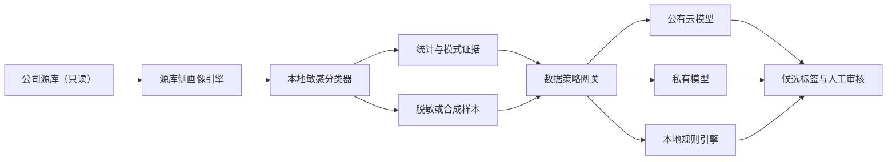
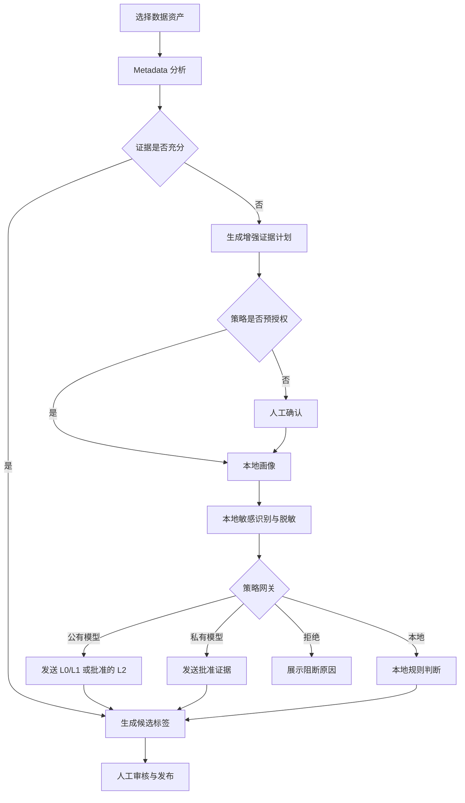

# 隐私保护数据画像与安全打标设计

## 1. 目标

本设计定义标签平台在真实业务数据上进行字段识别和资产打标时，如何在准确率与隐私保护之间取得平衡。

核心结论：

- 只使用表名、字段名、类型和注释，可以产生候选结论，但不足以支撑生产级准确率。
- 平台需要在公司数据安全域内读取受控数据，优先生成不可逆统计画像和模式证据。
- 原始用户记录默认不得发送给任何模型，包括私有模型。
- 公有云和私有模型均由数据策略网关按证据等级与敏感等级路由。
- 用户必须能够看见 Agent 使用了什么证据、什么数据离开了安全域以及结论为何产生。

本设计与以下规范共同生效：

- 《标签生命周期、物理资产关联与 Agent 操作设计》
- 《Agent Runtime 与工具治理规范》

## 2. 准确率边界

### 2.1 Metadata 可以可靠支持

- 初步业务域识别，如客户、账户、交易和产品。
- 根据命名和注释判断字段的候选业务含义。
- 根据字段名和类型识别明显的手机号、证件号、余额、日期等字段。
- 生成候选敏感等级、主键、外键、标签和规则。
- 决定是否需要进一步画像。

### 2.2 Metadata 不能可靠支持

- 字段实际内容是否与名称一致。
- `01/02/A/B` 等编码值的真实含义。
- 实际空值率、唯一性、基数、分布与异常值。
- 混合格式、伪脱敏、测试数据和字段漂移。
- 真实主外键关系和跨表匹配率。
- 标签规则的实际覆盖率和命中质量。
- 自由文本中的真实敏感信息。

因此，Metadata-only 结论只能标记为 `CANDIDATE`，不能自动发布敏感标签或生产标签。

## 3. 方案选择

采用“本地画像与脱敏证据分层”方案。

不采用以下方案：

- **仅 Metadata：** 安全但准确率依赖公司命名规范，无法验证真实内容。
- **原始样本直接发送模型：** 理解能力较强，但无法满足最小化、可审计和防重识别要求。

推荐流程：



原则是把计算送到数据旁边，而不是把数据送给模型。

## 4. 证据等级

| 等级 | 内容 | 默认模型通道 | 用途 |
|---|---|---|---|
| `L0_METADATA` | 表名、字段名、类型、注释、主外键声明 | 公有或私有 | 候选识别 |
| `L1_PROFILE` | 空值率、唯一率、基数、长度、分位数、模式和分桶 | 按策略路由 | 语义和质量判断 |
| `L2_MASKED_SAMPLE` | 不可逆脱敏样本或合成样本 | 私有优先；公有需策略允许 | 枚举和格式判断 |
| `L3_RAW_SAMPLE` | 原始行或原始字段值 | 默认禁止 | 专项诊断 |

强制规则：

- 敏感字段只有 L0 时，不得自动发布标签。
- L1 是生产识别的默认增强证据。
- L2 必须经过本地敏感检测、脱敏和重识别风险检查。
- L3 只能在受控私有环境中使用，并需要专项审批。
- 即使是私有模型，也不得默认获得 L3。
- 模型输出的置信度不能提高证据等级。

## 5. 源库侧画像

### 5.1 画像指标

基础指标：

```text
row_count
sampled_row_count
null_count / null_ratio
distinct_count / distinct_ratio
min / max
mean / standard_deviation
quantiles
min_length / max_length / avg_length
character_classes
regex_patterns
entropy
date_range
```

关系指标：

```text
candidate_key_score
referential_match_ratio
orphan_ratio
join_cardinality
cross_table_overlap
```

分类指标：

```text
top_values
frequency_buckets
rare_value_count
language_distribution
pii_pattern_distribution
```

### 5.2 执行约束

- 使用只读数据库账号。
- 查询只能由画像编译器生成，Agent 不执行任意 SQL。
- 设置最大扫描行数、超时、并发和资源组。
- 优先使用数据库原生聚合，避免抽取完整数据。
- 大表使用可重复的确定性采样。
- 画像任务保存源数据时间点和采样策略。
- 默认不持久化原始行。
- 临时原始数据只存在于受控内存或加密临时区，任务结束即销毁。

### 5.3 画像输出

```json
{
  "asset_urn": "urn:data-asset:postgres:crm:public:customer:column:mobile_no",
  "evidence_level": "L1_PROFILE",
  "profile_version": "v1",
  "source_as_of": "2026-07-01T08:00:00Z",
  "row_count": 1000000,
  "sampled_row_count": 100000,
  "null_ratio": 0.02,
  "distinct_ratio": 0.98,
  "patterns": [
    {
      "pattern": "1[3-9]*********",
      "ratio": 0.96,
      "count": 96000
    }
  ],
  "sensitivity_candidates": ["PHONE_NUMBER", "PII"],
  "raw_values_included": false
}
```

## 6. 敏感数据识别

本地敏感分类器在任何样本进入模型前执行。

检测信号：

- 字段名和注释词典。
- 数据类型和长度。
- 正则模式。
- 校验位算法，如身份证或银行卡校验。
- 高熵 Token 和 Secret 模式。
- 自由文本实体识别。
- 已有数据分类与元数据平台标记。
- 人工维护的禁止字段清单。

敏感等级：

```text
PUBLIC
INTERNAL
SENSITIVE
HIGHLY_SENSITIVE
REGULATED
```

如果多个检测器结论冲突，使用最高敏感等级。不能因为模型判断“看起来不敏感”而降低等级。

## 7. 脱敏与合成

### 7.1 脱敏策略

| 数据类型 | 允许证据 | 禁止内容 |
|---|---|---|
| 姓名 | 长度、字符集、`张**` | 完整姓名 |
| 手机号 | 号段统计、`138****1203` | 完整手机号 |
| 身份证 | 地区/年份等批准特征 | 完整号码、可逆哈希 |
| 邮箱 | 域名统计、遮盖本地部分 | 完整邮箱 |
| 地址 | 省市级聚合 | 详细门牌地址 |
| 银行卡/账户 | 不可逆 Token、长度与校验特征 | 原值 |
| 金额 | 分桶、分位数、统计量 | 与用户身份绑定的单笔明细 |
| 日期 | 年月粒度或相对时间 | 精确日期与身份组合 |
| 枚举 | 满足最小群体阈值的频次 | 稀有值原文 |
| 自由文本 | 本地实体替换后的片段 | 未检测原文 |

### 7.2 哈希限制

低熵数据不能仅通过普通哈希后发送模型。手机号、身份证、邮编和常见枚举可能被字典反推。

允许：

- 使用平台内部 HMAC Token 做等值匹配，但 Token 不发送公有模型。
- 使用不可逆分桶或模式摘要。
- 使用与真实用户无对应关系的合成样本。

### 7.3 合成样本

优先根据 L1 统计生成结构一致但不对应真实用户的样本：

```json
{
  "sample_kind": "SYNTHETIC",
  "values": ["138****1203", "186****4421"],
  "preserved_properties": ["length", "prefix_distribution", "character_class"],
  "maps_to_real_record": false
}
```

合成器不能保留多个可组合准标识符的真实相关关系。

## 8. 防重识别

强制控制：

- Top Value 只有计数达到 `k >= 10` 才能输出。
- 小群体合并为 `OTHER`。
- 不同时输出可组合重识别的精确年龄、地区、职业和时间。
- 分桶边界由策略配置，不能由 Agent 任意缩小。
- 单次任务限制字段数、样本数和返回字节数。
- 多字段样本默认使用分别生成的合成值，不返回真实行。
- 自由文本和 JSON 默认归入 L3。
- 对高敏字段禁止 Top Value，即使满足 k 阈值。
- 画像输出经过二次数据泄漏扫描。

如果证据仍存在重识别风险，策略网关返回 `DENY`，不允许通过更换模型绕过。

## 9. 模型路由

### 9.1 路由矩阵

| 数据等级 | 公有模型 | 私有模型 | 原始样本 |
|---|---:|---:|---:|
| `PUBLIC` | L0/L1/L2 按策略 | 允许 | 按专项策略 |
| `INTERNAL` | L0/L1 | L0/L1/L2 | 禁止 |
| `SENSITIVE` | 脱敏 L0/L1 | L0/L1/L2 | 默认禁止 |
| `HIGHLY_SENSITIVE` | 禁止 | L0/L1，L2 需审批 | 禁止 |
| `REGULATED` | 禁止 | 专项批准的 L0/L1 | 默认禁止 |

### 9.2 路由决策

输入：

```text
tenant policy
asset sensitivity
evidence level
field categories
model deployment type
model region
provider retention policy
user permission
approval status
```

输出：

```text
ALLOW_PUBLIC
ALLOW_PRIVATE
LOCAL_ONLY
REQUIRE_APPROVAL
DENY
```

模型路由由服务端数据策略网关决定。Agent 只能申请所需能力，不能指定一个更宽松的模型通道。

### 9.3 模型 Payload

发送前生成可审计 Payload Manifest：

```json
{
  "request_id": "req_123",
  "asset_urns": ["urn:data-asset:...:mobile_no"],
  "evidence_level": "L1_PROFILE",
  "sensitivity": "SENSITIVE",
  "provider": "approved-provider",
  "deployment": "public",
  "region": "approved-region",
  "raw_values_included": false,
  "masking_policy_version": "mask-v3",
  "payload_hash": "sha256:..."
}
```

审计保存 Manifest 和 Payload 哈希，不保存完整敏感 Payload。

## 10. 准确率模型

不使用单一的“AI 置信度”。候选结论包含：

```text
metadata_score
profile_score
sample_score
rule_consistency_score
historical_feedback_score
final_confidence
evidence_level
```

建议组合原则：

- 缺少某类证据时，该分项为空，不按 0 处理。
- `final_confidence` 由服务端确定性算法计算，模型只返回各证据判断。
- 敏感标签必须满足最低证据等级和人工审核，不能只看分数。
- 不同标签类型使用不同阈值，不能共用一个全局阈值。

默认处置：

| 条件 | 处置 |
|---|---|
| `final_confidence >= 0.90` 且满足证据要求 | 进入自动批准候选队列 |
| `0.70 <= final_confidence < 0.90` | 人工审核 |
| `final_confidence < 0.70` | 请求增强证据或标记未知 |
| 敏感标签只有 L0 | 禁止自动发布 |
| 画像或 Schema 漂移 | 旧结论转为待复核 |

模型结论必须包含正向证据、冲突证据和未确认项。

## 11. 数据模型

### 11.1 profiling_policies

```text
id, tenant_id, name, status,
allowed_schemas, denied_assets,
default_evidence_level, max_scan_rows,
max_duration_seconds, sampling_strategy,
allowed_model_routes, retention_seconds,
approval_policy_id, version,
created_by, approved_by, created_at
```

### 11.2 profiling_runs

```text
id, tenant_id, asset_id, policy_id,
requested_evidence_level, granted_evidence_level,
status, source_as_of, sampled_rows,
data_route, model_route, error_code,
requested_by, approved_by,
started_at, finished_at, created_at
```

### 11.3 column_profiles

```text
id, run_id, asset_id, profile_version,
statistics_json, patterns_json,
sensitivity_json, evidence_level,
profile_hash, expires_at, created_at
```

不保存原始样本。

### 11.4 masked_evidence

```text
id, run_id, asset_id, evidence_kind,
masked_values_json, synthesis_metadata_json,
masking_policy_version, sensitivity,
expires_at, destroyed_at, created_at
```

### 11.5 model_payload_manifests

```text
id, run_id, request_id, provider,
deployment_type, region, evidence_level,
sensitivity, asset_urns_json,
raw_values_included, masking_policy_version,
payload_hash, sent_at, created_at
```

## 12. 工具设计

Agent 只能调用以下领域工具。

只读：

```text
get_asset_metadata(asset_urn)
get_asset_profile(asset_urn, profile_version)
get_labeling_evidence(asset_urn)
explain_label_candidate(candidate_id)
get_payload_manifest(request_id)
```

变更计划：

```text
prepare_profile_asset(asset_urn, requested_evidence_level)
prepare_refresh_profile(asset_urn)
prepare_masked_evidence(asset_urn, purpose)
prepare_raw_sample_access(asset_urn, purpose)
```

确认执行：

```text
confirm_profiling_operation(operation_id)
```

Agent 不具备：

- 读取任意原始行的工具。
- 获取数据库密码的工具。
- 绕过策略网关指定模型的工具。
- 将 L3 内容写入 Memory、Trace 或普通 Artifact 的工具。

## 13. 产品信息架构

### 13.1 数据源接入：扫描策略

配置项：

```text
扫描范围
Metadata 扫描
统计画像
脱敏或合成样本
私有模型原始样本专项授权
最大扫描量
查询超时
模型通道
数据保留期
审批策略
```

交互规则：

- 默认选中 `Metadata + 统计画像`。
- “允许脱敏样本”展示模型实际可见内容示例。
- “原始样本”不是普通开关，点击后进入专项审批流程。
- 禁止字段和高敏分类始终优先于普通扫描配置。

### 13.2 字段证据卡片

卡片展示：

```text
候选标签
最终置信度及分项分数
证据等级
Metadata 依据
统计画像依据
冲突证据
模型通道
数据截至时间
原始数据是否发送
审核状态
```

用户可以查看“模型实际看到的内容”，但该视图只展示脱敏后的 Payload 预览。

### 13.3 增强证据申请

当 L0 不足时，Agent 生成操作计划：

```text
当前结论和置信度
缺失证据
建议读取范围
扫描字段和最大行数
将生成的统计项
是否生成脱敏样本
是否离开公司安全域
目标模型通道
预计时间与资源影响
```

低风险 L1 可以由租户策略预授权；L2 必须遵循敏感等级策略；L3 必须人工专项审批。

### 13.4 隐私与模型路由中心

管理员维护：

- 数据敏感等级与证据等级矩阵。
- 供应商、模型、区域和数据保留政策。
- 脱敏策略及版本。
- k 匿名阈值和分桶策略。
- 禁止字段、禁止资产和禁止数据类型。
- 审批链和双人复核规则。

产品提供策略模拟：

```text
输入资产 + 证据等级 + 模型
→ 展示最终路由、阻断原因和所需审批
```

### 13.5 审计详情

每次画像或模型分析展示：

- 申请人、批准人和执行身份。
- 物理表、字段和数据时间。
- 扫描行数、采样方法和查询耗时。
- 证据等级和敏感等级。
- 脱敏策略版本。
- Payload Manifest。
- 模型供应商、部署类型、区域和版本。
- 数据是否离开安全域。
- 临时证据销毁时间。
- 最终标签、分项分数和人工审核结果。

## 14. 产品主流程



## 15. 错误与降级

| 场景 | 处理 |
|---|---|
| 源库不可用 | 保留 Metadata 结论，标记画像缺失，不伪造证据 |
| 画像查询超时 | 降低扫描范围后重试，仍失败则人工处理 |
| 敏感分类冲突 | 采用最高敏感等级 |
| 脱敏校验失败 | 阻止模型调用并销毁临时 Payload |
| 公有模型不允许 | 路由私有模型或本地规则，不自动降低策略 |
| 私有模型不可用 | 使用已有证据或等待恢复，不转公有模型 |
| k 阈值不足 | 合并为 OTHER 或不输出 |
| Payload 过大 | 继续聚合和裁剪，不增加原始样本 |
| 模型输出与规则冲突 | 降低置信度并要求人工审核 |
| 临时证据销毁失败 | 标记安全事件并阻止任务成功结束 |

## 16. 可观测性与审计

指标：

- L0/L1/L2/L3 使用比例。
- 公有、私有和本地路由比例。
- 被策略阻断的请求数。
- 原始数据发送次数；正常情况下应为 0。
- 脱敏校验失败率。
- 画像任务成功率和耗时。
- Metadata-only 与增强画像的准确率差异。
- 人工纠正率和字段漂移率。

审计事件：

```text
profile.requested
profile.approved
profile.started
profile.completed
evidence.masked
payload.allowed
payload.denied
model.invoked
temporary_data.destroyed
candidate.reviewed
```

## 17. 测试与 Eval

### 17.1 隐私测试

- 手机、身份证、银行卡、邮箱和地址不会以原值进入模型 Payload。
- 低熵哈希不会被误认为安全脱敏。
- k 阈值以下的值不会输出。
- 多字段证据无法组成真实用户行。
- 自由文本未经过本地实体替换时被阻断。
- Payload、Memory、Trace 和普通日志不含原始 PII。
- 私有模型不可用时不会自动降级到公有模型。

### 17.2 准确率 Eval

建立经过授权的金标数据集，对比：

```text
Metadata-only
Metadata + Profile
Metadata + Profile + Masked/Synthetic Sample
```

按标签类型统计 Precision、Recall、F1、人工纠正率和未知率。不能用模型自报置信度代替金标评测。

### 17.3 产品验收

- 用户能在候选标签页面理解每条结论的证据。
- 用户能预览模型实际可见的脱敏内容。
- 用户能明确判断数据是否离开公司安全域。
- 高风险增强证据无法绕过审批。
- 审计员能根据 request ID 追踪完整处理链路。

## 18. 分阶段实施

### 阶段一：Metadata 与 L1 画像

- 建立画像策略、运行和结果模型。
- 实现只读统计画像引擎。
- 实现本地 PII 分类和模式摘要。
- 产品展示证据等级与分项置信度。

### 阶段二：策略网关与模型路由

- 建立敏感等级和模型路由矩阵。
- 生成 Payload Manifest。
- 公有模型只开放批准的 L0/L1。
- 接入路由审计。

### 阶段三：脱敏与合成证据

- 实现类型化脱敏器、合成器和防重识别检查。
- 加入 L2 操作计划与审批。
- 产品支持模型可见 Payload 预览。

### 阶段四：漂移与持续校验

- 定期刷新画像。
- 检测 Schema、模式和分布漂移。
- 自动将受影响标签转为待复核。
- 将人工纠正纳入金标 Eval，而不是直接写入长期 Memory。

### 阶段五：L3 专项能力

只有存在明确业务必要性、私有可信执行环境和审批制度时才建设。L3 不作为平台默认能力，也不能成为提高普通识别准确率的捷径。

## 19. 验收标准

- Metadata-only 结论始终标记为候选证据，不能自动发布敏感标签。
- 原始用户记录默认不会进入任何模型。
- L1 画像在源库安全域内完成，仅输出不可逆统计与模式。
- 每次模型调用都具有可审计 Payload Manifest。
- 模型路由不能被 Agent 或用户请求绕过。
- 公有、私有和本地路径都有明确的数据等级限制。
- 产品能够展示证据、模型可见内容、数据去向和审批状态。
- 临时原始数据任务结束后销毁，并产生销毁审计。
- 准确率通过金标数据集评测，不使用模型自报分数代替。

