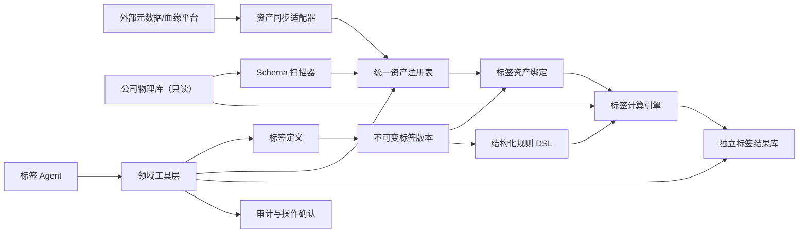
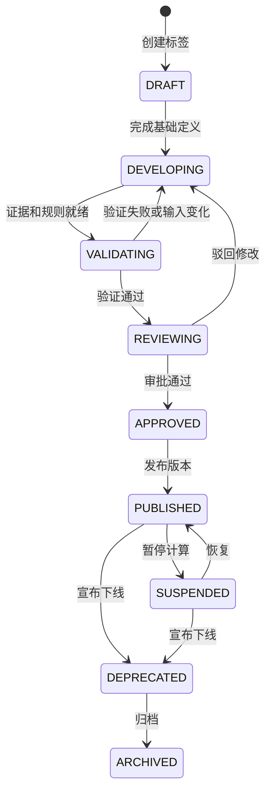

# 标签生命周期、物理资产关联与 Agent 操作设计

## 1. 目标与边界

本设计把当前标签开发能力升级为完整的企业标签平台。平台负责标签定义、规则、版本、审批、发布、计算、结果、查询和下线，是标签领域的权威系统。

外部元数据或血缘平台只提供资产、字段、血缘、负责人和质量信息。平台通过适配器接入 DataHub、Atlas 或公司内部元数据平台，不依赖任何单一产品。公司源库只读；标签计算结果写入独立标签库。

标签计算采用混合模式：

- 离线批量计算是默认方式。
- 少量强实时标签可实时读取源库。
- 实时查询超时或失败时，降级为最近一次有效的离线结果。

Agent 可以自动执行只读查询。创建、发布、停用、归档和触发生产计算等变更必须生成操作计划，并经人工确认。

## 2. 方案选择

采用“渐进增强现有模型”方案：

- 保留现有 `TagDefinition`、`TagVersion` 和开发任务的数据基础。
- 引入统一状态机、不可变版本、资产注册表、版本化绑定、运行批次、标签结果和 Agent 领域工具。
- 所有状态迁移写入不可变审计事件，为未来演进到事件驱动架构保留接口。

暂不采用完整事件溯源，避免当前阶段引入过高的投影、回放和运维复杂度；暂不把标签托管给外部元数据平台，因为本平台必须拥有完整标签生命周期。

## 3. 总体架构



## 4. 标签生命周期

### 4.1 状态机



状态语义：

| 状态 | 含义 | 可用性 |
|---|---|---|
| `DRAFT` | 仅有初始需求或名称 | 不可计算、不可消费 |
| `DEVELOPING` | 定义、资产绑定或规则正在编辑 | 仅开发者可见 |
| `VALIDATING` | 执行样本验证和质量检查 | 不可生产消费 |
| `REVIEWING` | 验证通过，等待业务或合规审批 | 不可生产消费 |
| `APPROVED` | 审批通过，等待发布 | 不可生产消费 |
| `PUBLISHED` | 有且仅有一个生产活动版本 | 可计算、可查询 |
| `SUSPENDED` | 暂停新计算 | 保留并查询已有结果，返回暂停标志 |
| `DEPRECATED` | 已宣布下线 | 允许存量查询，返回替代标签和下线时间 |
| `ARCHIVED` | 生命周期结束 | 默认检索不可见，历史审计可查 |

### 4.2 不变量

- 标签定义是稳定业务身份，标签版本是不可变实现快照。
- 一个 `PUBLISHED` 标签必须且只能有一个活动版本。
- 发布后的规则、证据或绑定不能原地修改，只能创建新版本。
- 规则、绑定或资产元数据版本变化后，关联验证结果立即变为 `stale`。
- 不对正式标签、版本、绑定、运行和结果执行物理删除。
- `SUSPENDED` 停止调度但保留已有结果。
- `DEPRECATED` 必须给出下线时间；存在替代标签时必须记录其 ID。
- 状态迁移必须校验前置条件、操作者权限和乐观锁版本。

### 4.3 审计事件

`tag_lifecycle_events` 保存：

```text
id, tag_id, tag_version_id, event_type,
from_status, to_status, actor_id, actor_type,
reason, request_id, operation_id, payload_json, created_at
```

它是不可变审计记录，不直接作为当前状态的读取来源。当前状态仍保存在标签定义和版本表中，以保持查询简单。

## 5. 核心数据模型

### 5.1 标签定义

`tag_definitions`：

```text
id, tenant_id, code, name, category_id,
description, entity_type, value_type,
owner_id, status, active_version_id,
replacement_tag_id, deprecate_at, archived_at,
lock_version, created_at, updated_at
```

约束：

- `(tenant_id, code)` 唯一。
- `(tenant_id, category_id, name)` 唯一。
- `active_version_id` 只能指向同一标签的已发布版本。
- 使用 `archived_at` 软归档，不提供物理删除接口。

### 5.2 标签版本

`tag_versions`：

```text
id, tag_id, version_no, status,
business_definition, business_use_case,
entity_type, value_type, update_frequency,
validity_period_seconds, rule_dsl_json,
rule_hash, created_by, created_at,
approved_by, approved_at, published_at
```

版本状态使用 `DRAFT / VALIDATING / REVIEWING / APPROVED / ACTIVE / RETIRED`。发布新版本时，旧 `ACTIVE` 版本在同一事务内变为 `RETIRED`。

### 5.3 审批

`tag_approvals` 绑定具体版本，保存审批角色、决策、意见、操作者和时间。敏感标签必须经过数据负责人和合规角色审批；普通标签至少经过数据负责人审批。审批策略由服务端配置，不由 Agent 决定。

## 6. 统一物理资产注册表

### 6.1 数据资产

`data_assets`：

```text
id, tenant_id, source_system, external_id,
connection_id, catalog_name, schema_name, object_name,
asset_type, parent_asset_id, physical_urn,
data_type, nullable, owner, lifecycle_status,
metadata_version, metadata_json,
last_synced_at, created_at, updated_at
```

资产类型至少支持 `TABLE / VIEW / COLUMN`。字段通过 `parent_asset_id` 指向所属表或视图。

`physical_urn` 是平台稳定物理标识：

```text
urn:data-asset:postgres:crm_prod:public:customer
urn:data-asset:postgres:crm_prod:public:customer:column:customer_id
```

`(tenant_id, physical_urn)` 唯一。外部平台 ID 变化时，通过物理 URN 识别同一资产，避免标签绑定漂移。

### 6.2 元数据来源优先级

- 外部平台和本地扫描结果都写入统一资产注册表。
- 物理结构以只读 Schema 扫描结果为准。
- 业务说明、负责人、分类和血缘优先使用外部元数据平台。
- 每个属性记录来源和同步时间；冲突不静默覆盖，写入同步告警。
- 外部元数据不可用时使用最近成功快照，并在查询结果中返回 `metadata_stale=true`。

### 6.3 资产关系

`asset_relationships`：

```text
id, left_asset_id, left_column_id,
right_asset_id, right_column_id,
relation_type, cardinality, join_expression_dsl,
source, confidence, approval_status,
verified_by, verified_at, created_at, updated_at
```

外部血缘、字段命名或采样分析可以生成候选关系，但只有 `APPROVED` 关系能参与生产标签的跨表计算。

## 7. 标签与物理资产绑定

`tag_asset_bindings`：

```text
id, tag_version_id, asset_id, role,
column_path, join_group, binding_status,
asset_metadata_version, verified_by, verified_at,
created_at
```

角色：

- `ENTITY_KEY`：标签主体键，例如客户 ID。
- `SOURCE`：规则依赖的物理表或视图。
- `CONDITION`：规则直接引用的字段。
- `OUTPUT`：实时标签直接读取或返回的字段。

绑定必须指向具体标签版本。发布校验要求：

- 每个版本有且仅有一个主体键定义。
- 所有 DSL 字段都能解析为有效 `CONDITION` 绑定。
- 多表规则使用的每条 Join 路径都已审批。
- 绑定记录的资产元数据版本与当前版本一致；不一致时必须重新验证。

现有 `TagBinding.target_type/target_id` 在迁移期保留只读兼容，新发布路径只写 `tag_asset_bindings`。

## 8. 规则 DSL 与编译

Agent 和用户界面只能产生结构化 DSL，不能把任意 SQL 保存为标签规则：

```json
{
  "entity": "customer",
  "source_asset_urn": "urn:data-asset:postgres:crm:public:customer",
  "entity_key": "customer_id",
  "conditions": [
    {
      "field": "total_assets",
      "operator": ">=",
      "value": 6000000
    }
  ],
  "output": {
    "type": "boolean",
    "value": true
  }
}
```

编译流水线：

```text
JSON Schema 校验
→ 资产和字段解析
→ 数据类型检查
→ 访问权限检查
→ Join 路径验证
→ 方言 SQL 编译
→ 查询成本检查
→ 样本运行
```

SQL 是可重新生成的编译产物，不是标签规则的权威定义。不同数据库通过方言编译器适配。

## 9. 计算运行

### 9.1 运行状态

`tag_runs`：

```text
id, tag_id, tag_version_id, run_type,
status, trigger_type, idempotency_key,
source_snapshot_json, compiled_rule_hash,
started_at, finished_at,
scanned_rows, matched_rows, rejected_rows,
quality_score, error_code, error_detail,
created_by, created_at
```

状态：

```text
QUEUED → COMPILING → RUNNING → VALIDATING → SUCCEEDED
                                     └──→ FAILED
任意未结束状态 → CANCELLED
```

同一标签版本只允许一个全量任务运行。运行开始时冻结标签版本、资产元数据版本、源数据时间点和规则摘要。

### 9.2 原子发布

计算结果先写入运行专属暂存区。质量检查通过后，在事务内：

1. 关闭该标签上一批当前结果的有效期。
2. 将新结果发布到权威结果表。
3. 更新标签最近成功批次。
4. 提交结果事件并异步刷新缓存或宽表。

任何步骤失败都保留上一批成功结果，不向消费者暴露部分结果。

### 9.3 标签结果

`tag_values` 使用长表作为权威结果：

```text
id, tenant_id, entity_type, entity_id,
tag_id, tag_version_id, value_json,
computed_at, effective_from, effective_to,
expires_at, run_id, quality_status, created_at
```

核心唯一约束：

```text
(tenant_id, entity_type, entity_id, tag_id, effective_from)
```

高频查询通过异步宽表、物化视图或缓存加速，长表仍是审计和历史查询的权威数据源。

### 9.4 实时查询

实时标签复用相同 DSL 和资产绑定：

- 仅允许只读、参数化查询。
- 设置严格超时、扫描行数和成本上限。
- 结果写短期缓存，不直接写入历史长表。
- 超时或源库失败时返回最近离线结果，并标记 `fallback=true` 和数据时间。

## 10. 数据质量与故障处理

发布门禁：

- 主体键空值率为 0，并满足预期唯一性。
- 输出值符合标签值类型、精度和枚举范围。
- 命中率、空值率和分布相对历史批次变化未超过配置阈值。
- 所有源资产、字段和 Join 关系有效。
- 源表结构和字段类型未发生未经验证的变化。

故障策略：

| 场景 | 处理 |
|---|---|
| 外部元数据平台不可用 | 使用最近资产快照并标记元数据过期 |
| 公司源库不可用 | 任务失败或按策略重试，不替换旧结果 |
| 字段删除或类型变化 | 绑定失效，标签标记 `IMPACTED`，阻断新计算和发布 |
| DSL 编译失败 | 保留草稿，返回具体规则节点错误 |
| 质量指标异常 | 暂存结果不发布，等待人工处理 |
| 标签结果过期 | 查询返回 `stale=true`，不伪装为最新数据 |
| Agent 重复确认 | 依据幂等键返回第一次执行结果 |
| 并发修改 | 乐观锁失败，废弃操作计划并要求重新生成 |

`IMPACTED` 是健康标志，不是生命周期状态；标签仍保留其生命周期状态，但查询和界面必须显著展示影响原因。

## 11. Agent 查询与操作设计

### 11.1 领域工具

只读工具自动执行：

```text
search_tags(query, filters)
get_tag(tag_id, include_versions, include_bindings)
explain_tag(tag_id)
find_tags_for_asset(asset_urn)
find_assets_for_tag(tag_id)
preview_tag_rule(version_id, sample_limit)
query_entity_tags(entity_type, entity_id, as_of)
query_tag_population(tag_id, filters, as_of)
compare_tag_versions(tag_id, left_version, right_version)
get_tag_impact(tag_id)
```

Agent 不直接读取底层 ORM 表，也不执行任意 SQL。

### 11.2 两阶段变更

变更首先调用：

```text
prepare_create_tag
prepare_update_tag
prepare_publish_tag
prepare_suspend_tag
prepare_deprecate_tag
prepare_run_tag
```

返回不可修改的操作计划：

```json
{
  "operation_id": "op_123",
  "operation": "publish_tag",
  "target": "高净值客户/v3",
  "changes": ["活动版本 v2 切换为 v3", "重建 3 个绑定", "触发全量计算"],
  "impact": {
    "estimated_entities": 2300000,
    "downstream_segments": 12
  },
  "warnings": [],
  "expires_at": "2026-07-01T12:10:00Z"
}
```

人工确认后调用 `confirm_operation(operation_id)`。服务端重新执行身份、权限、前置状态、乐观锁和影响校验，绝不信任 Agent 重传业务参数。

### 11.3 Agent 语义视图

提供稳定的只读领域视图或等价 API：

```text
tag_catalog_view
tag_asset_binding_view
tag_current_version_view
tag_run_health_view
entity_current_tags_view
tag_dependency_view
```

`tag_catalog_view` 每行代表一个标签，至少包含：

```text
tag_id, code, name, category, status, health_status,
owner, active_version, entity_type, value_type,
update_frequency, validity_period,
last_run_status, last_data_at, population, bound_assets
```

Agent 的固定查询顺序：

```text
识别意图
→ 搜索标签或资产目录
→ 解析唯一 ID
→ 调用领域工具
→ 返回结果、版本、数据时间和质量状态
```

搜索不唯一时必须要求用户消歧。回答必须包含标签编码和版本、生命周期状态、结果时间、计算批次、质量状态、物理资产以及敏感数据提示。

### 11.4 安全

- 每个工具标记 `READ`、`PROPOSE_WRITE` 或 `CONFIRM_WRITE` 风险等级。
- Agent 始终使用当前用户身份和权限，不使用平台超级管理员身份。
- 实体标签查询执行行级权限、字段级权限和脱敏策略。
- Agent 无法读取连接密码或生成任意 SQL 执行请求。
- 操作计划短期有效，绑定用户、会话、目标版本和幂等键。
- 每次工具调用记录用户、会话、参数摘要、结果规模、耗时和最终状态。

## 12. API 与服务边界

为避免继续扩大当前集中式标签路由，后端按职责拆分：

- `tag_catalog_service`：标签定义、搜索和详情。
- `tag_lifecycle_service`：状态机、审批、发布、停用和归档。
- `asset_registry_service`：资产同步、URN 解析和绑定。
- `tag_rule_service`：DSL 校验、编译和预览。
- `tag_run_service`：任务创建、执行、质量检查和原子发布。
- `tag_query_service`：实体标签、人群规模和历史查询。
- `tag_operation_service`：Agent 操作计划、确认和幂等控制。

所有 Web API、Agent 工具和后台调度器调用同一领域服务，不能各自实现状态迁移或发布逻辑。

## 13. 测试策略

1. 状态机单元测试覆盖所有合法迁移和非法迁移。
2. DSL 单元测试覆盖类型校验、字段解析、Join 路径、方言编译和注入防护。
3. 数据库集成测试覆盖不可变版本、唯一活动版本、乐观锁和软归档。
4. 运行集成测试覆盖暂存、质量失败、原子切换、幂等和旧结果保留。
5. 元数据适配器契约测试确保不同来源生成相同标准资产模型。
6. Agent 工具契约测试确保查询自动执行、写操作必须确认、过期计划不可执行。
7. 端到端测试覆盖创建、绑定、验证、审批、发布、计算、查询、暂停、恢复和下线。
8. 故障演练覆盖外部元数据中断、源库超时、字段漂移、重复调度和命中率突变。

## 14. 分阶段实施

### 阶段一：生命周期治理

- 引入统一状态机、软归档、乐观锁和审计事件。
- 拆分标签定义与不可变版本。
- 合并现有两个发布路径，统一通过领域服务发布。
- 保持现有页面和 API 的兼容读取。

验收标准：任一标签只有一条发布路径；非法状态迁移被拒绝；发布版本不可原地修改；全链路可审计。

### 阶段二：统一资产关联

- 建立资产注册表、标准 URN 和同步适配器接口。
- 导入现有连接、发现表和发现字段。
- 新建版本化资产绑定和资产关系审批。
- 将旧 `TagBinding` 迁移到新绑定模型。

验收标准：标签可稳定关联到 catalog/schema/table/column；外部 ID 变化不破坏绑定；未经审批的 Join 不能发布。

### 阶段三：计算与结果

- 实现规则 DSL、校验器和首个数据库方言编译器。
- 增加运行批次、暂存区、质量门禁和标签结果长表。
- 接入调度、结果过期和离线查询 API。
- 失败时验证旧结果继续可用。

验收标准：一个标签完成从规则到结果的生产闭环；重复调度幂等；质量失败不污染线上结果。

### 阶段四：Agent 工具层

- 建立 Agent 语义视图和只读工具。
- 实现 `prepare → confirm` 两阶段变更。
- 加入权限、脱敏、影响分析和工具审计。

验收标准：Agent 无需理解底层表即可查询标签；任何生产变更都无法绕过人工确认。

### 阶段五：实时与规模化

- 增加实时编译执行、超时和离线降级。
- 为高频查询生成缓存、物化视图或宽表。
- 发布结果事件，支持下游订阅。
- 建立容量限制、运行优先级和 SLA 监控。

## 15. 迁移原则

- 先增加新表和兼容读取，再迁移数据，最后切换写路径。
- 现有 `TagDefinition.is_active` 映射为 `PUBLISHED` 或 `SUSPENDED`，具体状态由是否存在活动版本和产品规则确定。
- 现有开发任务状态保留为工作流状态，不再充当正式标签生命周期状态。
- 现有 `TagBinding` 转换为版本化资产绑定；无法解析的记录进入人工修复队列。
- 现有 `Annotation` 继续作为数据资产语义注释，不与业务标签结果合并。
- 迁移期间所有新旧记录使用映射表关联，迁移完成后旧模型只读。

## 16. 非目标

本设计暂不包含：

- 完整事件溯源和状态投影重放。
- 把标签生命周期托管给外部元数据平台。
- Agent 自主审批或自主发布生产标签。
- 对公司源库执行 DDL 或写入标签结果。
- 第一阶段同时支持所有数据库方言。

