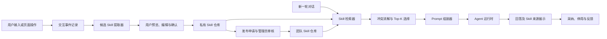

# 用户知识型 Skill 沉淀、复用与版本管理设计

## 1. 背景

当前系统已经具备内置 `BaseSkill`、标注审核后的记忆提取、审计日志与 Agent 对话入口，但现有 Skill 主要是代码实现的执行能力，记忆则面向事实、偏好和单条经验。系统尚不能把用户在对话或业务操作中表达的判断方法沉淀为可管理、可审核、可跨会话复用的知识型 Skill。

本设计引入一种不包含可执行代码的“知识型 Skill”：系统从用户输入、纠正和操作结果中识别可复用规则，生成候选，经用户确认后成为私有 Skill；私有 Skill 可以申请发布，经管理员审核后成为团队 Skill。后续对话自动检索适用 Skill，并将确定版本注入 Agent Prompt。

## 2. 目标与非目标

### 2.1 目标

- 支持系统自动建议和用户主动触发两种 Skill 创建入口。
- 未经用户确认的候选 Skill 不得参与后续推理。
- Skill 默认归创建用户私有，并支持管理员审核后发布到团队。
- 后续对话自动匹配 Skill，并展示本轮实际使用的 Skill 与版本。
- 支持不可变版本、语义化版本号、差异查看、测试、发布、废弃和回滚。
- 每次回答能够追溯至确切的 Skill 版本、匹配原因和使用结果。
- Skill 检索或提取异常时，不影响基础对话能力。

### 2.2 非目标

- 不从用户行为生成或执行 Python、SQL、Shell 等代码。
- 不允许 Skill 绕过系统安全规则、权限检查或工具治理。
- 第一期不要求引入独立向量数据库。
- 不把知识型 Skill 与现有代码型 `BaseSkill` 合并为同一种运行时对象。
- 不把原始业务数据或未脱敏对话全文直接复制到 Skill。

## 3. 关键决策

1. Skill 类型限定为 Prompt/知识型 Skill，不包含可执行代码。
2. 系统可以发现候选，用户也可以主动点击“保存为 Skill”。
3. 自动发现只创建候选；用户确认后才能启用。
4. Skill 默认私有，团队发布需要管理员审核。
5. 后续对话自动匹配，不要求用户显式输入 Skill 名称。
6. 采用“稳定 Skill ID + 不可变版本”的版本模型。
7. 检索采用权限过滤、关键词/标签粗排、语义重排的混合策略。

## 4. 总体架构



系统新增以下边界清晰的组件：

- `InteractionRecorder`：记录对话输入、纠正、审核和页面操作事件。
- `CandidateExtractor`：判断事件是否值得复用，并生成结构化 Skill 草稿。
- `KnowledgeSkillService`：负责确认、编辑、权限、状态和版本管理。
- `SkillRetriever`：检索当前用户可用且适用于本轮输入的 Skill 版本。
- `SkillConflictResolver`：处理多个 Skill 之间以及 Skill 与当前指令之间的冲突。
- `SkillPromptAssembler`：在 token 预算内生成受控 Prompt 区块。
- `SkillPublicationService`：处理团队发布申请、审核、暂停和升级。
- `SkillEvaluationService`：执行固定测试集并统计线上使用效果。
- `ChatOrchestrator`：编排事件记录、Skill 检索、Prompt 构建、Agent 调用和使用审计。

## 5. 领域模型

### 5.1 `conversation_sessions`

用于跨轮次、跨会话追踪上下文。

| 字段 | 类型 | 说明 |
|---|---|---|
| `id` | UUID | 会话标识 |
| `user_id` | UUID/String | 会话所有者 |
| `title` | String | 会话标题 |
| `status` | Enum | `active`、`closed`、`archived` |
| `created_at` | DateTime | 创建时间 |
| `updated_at` | DateTime | 更新时间 |

### 5.2 `interaction_events`

记录可能成为 Skill 证据的用户输入和操作。

| 字段 | 类型 | 说明 |
|---|---|---|
| `id` | UUID | 事件标识 |
| `session_id` | UUID | 所属会话 |
| `user_id` | UUID/String | 操作者 |
| `event_type` | Enum | `message`、`correction`、`annotation_review`、`ui_action`、`explicit_save` |
| `payload_json` | JSON/Text | 脱敏后的结构化事件 |
| `context_json` | JSON/Text | 页面、表、标签等业务上下文 |
| `source_ref` | String | 原始来源引用，不复制原始敏感数据 |
| `created_at` | DateTime | 发生时间 |

### 5.3 `skill_candidates`

保存尚未确认的候选 Skill。

| 字段 | 类型 | 说明 |
|---|---|---|
| `id` | UUID | 候选标识 |
| `owner_id` | UUID/String | 候选所有者 |
| `evidence_ids_json` | JSON/Text | 支撑候选的事件 ID |
| `draft_json` | JSON/Text | 结构化 Skill 草稿 |
| `confidence` | Decimal | 候选质量评分 |
| `reason` | Text | 推荐原因 |
| `status` | Enum | `proposed`、`confirmed`、`dismissed`、`expired` |
| `expires_at` | DateTime | 候选过期时间 |
| `created_at` | DateTime | 创建时间 |

### 5.4 `knowledge_skills`

保存 Skill 稳定身份、归属和当前指针。

| 字段 | 类型 | 说明 |
|---|---|---|
| `id` | UUID | 稳定 Skill 标识 |
| `owner_id` | UUID/String | 创建者 |
| `scope` | Enum | `private`、`team` |
| `status` | Enum | `active`、`disabled`、`suspended`、`deprecated`、`archived`、`needs_review` |
| `current_version_id` | UUID | 私有或管理视角的当前版本 |
| `published_version_id` | UUID/Null | 当前对团队生效的版本 |
| `created_at` | DateTime | 创建时间 |
| `updated_at` | DateTime | 更新时间 |
| `deleted_at` | DateTime/Null | 软删除时间 |

### 5.5 `skill_versions`

版本创建后不可修改。

| 字段 | 类型 | 说明 |
|---|---|---|
| `id` | UUID | 版本标识 |
| `skill_id` | UUID | 稳定 Skill ID |
| `version_major` | Integer | 主版本 |
| `version_minor` | Integer | 次版本 |
| `version_patch` | Integer | 修订版本 |
| `content_json` | JSON/Text | 完整结构化内容 |
| `content_hash` | String | 规范化内容的 SHA-256 |
| `change_type` | Enum | `patch`、`minor`、`major`、`rollback` |
| `change_summary` | Text | 变更摘要 |
| `based_on_version_id` | UUID/Null | 编辑所基于的版本 |
| `created_by` | UUID/String | 创建者 |
| `created_at` | DateTime | 创建时间 |

数据库必须对 `(skill_id, version_major, version_minor, version_patch)` 和 `(skill_id, content_hash)` 建立唯一约束，防止重复版本与重复内容。

### 5.6 `skill_publish_requests`

| 字段 | 类型 | 说明 |
|---|---|---|
| `id` | UUID | 申请标识 |
| `skill_id` | UUID | Skill 标识 |
| `version_id` | UUID | 申请发布的确定版本 |
| `status` | Enum | `pending`、`approved`、`rejected`、`changes_requested` |
| `submitted_by` | UUID/String | 申请人 |
| `reviewed_by` | UUID/String/Null | 审核人 |
| `review_comment` | Text/Null | 审核意见 |
| `created_at` | DateTime | 申请时间 |
| `reviewed_at` | DateTime/Null | 审核时间 |

### 5.7 `skill_usages`

| 字段 | 类型 | 说明 |
|---|---|---|
| `id` | UUID | 使用记录 |
| `session_id` | UUID | 会话 |
| `message_id` | UUID/String | 本轮消息 |
| `skill_version_id` | UUID | 实际注入的确定版本 |
| `match_score` | Decimal | 最终匹配分 |
| `match_reason_json` | JSON/Text | 命中原因 |
| `used` | Boolean | 是否实际注入 |
| `feedback` | Enum/Null | `helpful`、`unhelpful`、`wrong_match` |
| `created_at` | DateTime | 使用时间 |

### 5.8 `skill_test_cases` 与 `skill_test_runs`

固定测试用例属于稳定 Skill，但每次执行结果绑定具体版本。

`skill_test_cases` 保存输入、期望行为、禁止行为和是否阻断发布；`skill_test_runs` 保存版本、测试结果、模型配置摘要、执行时间和失败原因。阻断测试失败时不得批准团队发布，除非管理员填写豁免原因，豁免必须进入审计日志。

## 6. Skill 内容规范

`skill_versions.content_json` 使用以下结构：

```json
{
  "name": "留学客户风险标签判断",
  "description": "判断留学客户材料风险时使用",
  "instruction": "优先检查资金证明时效性和材料完整度。证据不足时标记为待核验。",
  "triggers": ["留学客户", "材料风险", "资金证明"],
  "examples": [
    {
      "input": "资金证明将在两周后过期",
      "expected_behavior": "标记时效风险，并建议补充更新材料"
    }
  ],
  "constraints": [
    "不得根据国籍推断风险",
    "缺少证据时不得直接判为高风险"
  ],
  "business_tags": ["留学", "客户标签", "风险"]
}
```

保存前执行以下校验：

- 名称、描述、指令和至少一个触发条件不能为空。
- 每条约束必须是明确、可执行的自然语言规则。
- 示例不得包含未脱敏个人信息。
- 内容不得试图修改系统规则、获取密钥或绕过权限。
- 内容规范化后若与当前版本哈希相同，不创建新版本。

## 7. 候选 Skill 生成

### 7.1 触发条件

- 用户纠正 Agent 的判断或输出。
- 用户明确补充业务规则或禁用条件。
- 用户在多个相似场景中重复同一种操作。
- 标注审核中发生有业务含义的 `modify` 或带解释的 `approve`。
- 用户主动点击“保存为 Skill”。

普通问候、一次性事实查询、缺少上下文的短输入和包含大量未脱敏数据的内容，不自动生成候选。

### 7.2 候选评分

```text
candidate_score =
  reusability             × 0.30
+ explicit_correction     × 0.25
+ recurrence             × 0.20
+ business_impact        × 0.15
+ information_complete   × 0.10
```

评分达到 `0.65` 才向用户主动展示候选。低于阈值时系统不打扰用户，但用户仍可主动保存。阈值应由配置管理，不硬编码在前端。

### 7.3 生成流程

```text
事件聚合
→ 敏感信息检测与脱敏
→ 可复用性判断
→ 与现有 Skill 去重
→ 生成结构化草稿
→ 规则校验与提示注入扫描
→ 展示推荐原因和证据摘要
→ 用户编辑并确认
→ 创建 Skill 1.0.0
```

候选确认必须在同一数据库事务内创建 `knowledge_skills`、`skill_versions` 并更新候选状态。任一步失败均不得留下半生效 Skill。

## 8. 检索、冲突处理与 Prompt 注入

### 8.1 检索流程

```text
解析当前意图
→ 过滤当前用户可用的私有 Skill 和已发布团队 Skill
→ 过滤禁用、暂停、废弃、归档和待复核 Skill
→ 关键词与业务标签粗排
→ 语义相似度重排
→ 冲突检测
→ 选择 Top 3
→ 按 token 预算组装 Prompt
```

第一期可使用现有数据库完成关键词、触发词和业务标签匹配；语义相似度接口保留抽象，后续可接入 PostgreSQL + pgvector。

### 8.2 匹配评分

```text
match_score =
  semantic_similarity × 0.45
+ trigger_match       × 0.25
+ business_tag_match  × 0.15
+ historical_success  × 0.10
+ freshness           × 0.05
```

最终分数达到 `0.70` 才可自动注入。第一期没有语义向量时，应重新归一化其余分量，不得将语义相似度固定为零后继续沿用同一阈值。

### 8.3 优先级与冲突

规则优先级固定为：

```text
系统安全与治理规则
> 用户本轮明确指令
> 用户私有 Skill
> 已发布团队 Skill
> 普通知识
```

同一优先级的 Skill 冲突时，优先选择匹配分更高且版本状态更新的 Skill；差值小于 `0.05` 且无法合并时，本轮不自动注入冲突 Skill，并在使用记录中标记 `conflict_skipped`。

### 8.4 Prompt 格式

```xml
<applicable_skills>
  <skill id="skill-1" version="1.1.0" scope="private">
    <instruction>优先检查资金证明时效性和材料完整度。</instruction>
    <constraints>
      <item>缺少证据时不得直接判为高风险。</item>
    </constraints>
    <examples>
      <example>资金证明临近过期时，标记时效风险并建议更新材料。</example>
    </examples>
  </skill>
</applicable_skills>
```

Prompt 组装器只接收经过校验的结构化字段，不拼接候选草稿、原始事件或管理员审核意见。token 不足时按匹配分移除低优先级 Skill，并优先保留约束。

## 9. 版本管理

### 9.1 语义化版本

- `PATCH`：修改描述、示例或触发词，不改变核心判断和输出行为。
- `MINOR`：新增兼容的适用场景、约束或业务规则。
- `MAJOR`：判断逻辑、输出含义或适用边界发生不兼容变化。

示例：

```text
1.0.0 创建“留学客户风险标签判断”
1.0.1 补充“存款证明”同义触发词
1.1.0 新增“签证材料完整度”场景
2.0.0 风险等级由三级调整为五级
```

后端根据字段差异给出建议版本类型，最终版本类型由有编辑权限的用户确认。若用户选择的类型低于系统检测出的最低兼容级别，后端返回校验错误。

### 9.2 编辑与并发控制

客户端读取版本时获得 `content_hash`。创建新版本必须携带：

```http
POST /api/knowledge-skills/{id}/versions
If-Match: "sha256:abc..."
```

`If-Match` 必须等于 `current_version` 的哈希，否则返回 `409 Conflict`，响应包含当前版本号和可用于 Diff 的版本链接。系统不执行静默覆盖。

### 9.3 私有版与团队发布版

- 私有 Skill 新版本校验通过后，可以立即成为 `current_version_id`。
- 团队生效内容始终由 `published_version_id` 指向确定版本。
- 私有 Skill 后续编辑不得自动修改已发布团队版本。
- 每个团队升级都必须创建针对新版本的发布申请。
- 审核通过时更新 `published_version_id`，旧发布版本进入 `superseded` 语义状态，但仍可用于历史重放。

### 9.4 回滚

回滚不删除任何版本。系统创建一条 `change_type=rollback` 的审计事件，并将当前指针切换到目标历史版本。

- 私有 Skill 回滚只更新 `current_version_id`。
- 团队 Skill 回滚属于一次发布变更，需要管理员操作。
- 回滚后的新编辑仍基于当前指针创建新版本，版本号必须大于该 Skill 已存在的最大版本号，避免重复版本号。

### 9.5 Diff 与影响分析

版本页面按字段展示 Diff，至少覆盖：

- `instruction`
- `triggers`
- `constraints`
- `examples`
- `business_tags`

发布前展示：

- 新旧版本字段差异。
- 固定测试集结果。
- 过去 30 天旧版本命中次数。
- 可能受影响的业务标签和用户范围。
- 是否存在行为不兼容变化。

### 9.6 状态

版本自身使用：

```text
draft → validating → active
                  ↘ validation_failed
```

发布申请使用：

```text
pending → approved
       ↘ rejected
       ↘ changes_requested
```

Skill 聚合状态使用：

```text
active → disabled
active → suspended
active → deprecated → archived
active → needs_review → active
```

`deprecated` 和 `archived` 版本不匹配新对话，但历史会话仍可解析其内容。

## 10. API 设计

### 10.1 交互与候选

```text
POST /api/interactions/events
POST /api/skill-candidates/extract
GET  /api/skill-candidates
PUT  /api/skill-candidates/{id}
POST /api/skill-candidates/{id}/confirm
POST /api/skill-candidates/{id}/dismiss
```

### 10.2 Skill 与版本

```text
GET  /api/knowledge-skills
POST /api/knowledge-skills
GET  /api/knowledge-skills/{id}
POST /api/knowledge-skills/{id}/versions
GET  /api/knowledge-skills/{id}/versions
GET  /api/knowledge-skills/{id}/versions/{version}
GET  /api/knowledge-skills/{id}/diff?from=1.0.0&to=1.1.0
POST /api/knowledge-skills/{id}/rollback
POST /api/knowledge-skills/{id}/disable
POST /api/knowledge-skills/{id}/enable
```

### 10.3 发布审核

```text
POST /api/knowledge-skills/{id}/publish-requests
GET  /api/admin/skill-publish-requests
POST /api/admin/skill-publish-requests/{id}/approve
POST /api/admin/skill-publish-requests/{id}/reject
POST /api/admin/skill-publish-requests/{id}/request-changes
POST /api/admin/knowledge-skills/{id}/suspend
```

### 10.4 检索与反馈

```text
POST /api/knowledge-skills/match
POST /api/skill-usages/{id}/feedback
```

内部 `match` 接口必须要求认证用户身份，不能接受客户端传入的任意 `user_id` 作为授权依据。

### 10.5 Chat 接口

请求：

```json
{
  "session_id": "session-123",
  "message": "帮我判断这个客户的留学材料风险",
  "disabled_skill_ids": []
}
```

响应：

```json
{
  "reply": "……",
  "used_skills": [
    {
      "id": "skill-1",
      "name": "留学客户风险标签判断",
      "version": "1.1.0",
      "match_score": 0.86,
      "reason": "命中留学、材料风险和资金证明场景"
    }
  ],
  "skill_candidate": null,
  "timestamp": "2026-07-03T10:00:00Z"
}
```

`disabled_skill_ids` 只对本轮有效，不改变 Skill 的持久化状态。

## 11. Chat 编排

现有聊天入口应从直接调用 Agent 改为调用 `ChatOrchestrator.respond`：

```python
result = await chat_orchestrator.respond(
    user_id=current_user.id,
    session_id=req.session_id,
    message=req.message,
    disabled_skill_ids=req.disabled_skill_ids,
)
```

编排顺序：

1. 验证用户对会话的访问权限。
2. 保存用户消息事件。
3. 检索并选择适用 Skill 版本。
4. 在 token 预算内构建受控 Prompt。
5. 调用 Agent 运行时。
6. 保存回复及每个确定版本的使用记录。
7. 返回回答和 Skill 来源。
8. 在不阻塞回答的后台任务中判断是否产生候选。

第 1 至第 6 步发生异常时按异常类型处理；不得因为第 8 步失败而改变已返回的回答。

## 12. 前端体验

### 12.1 对话页

回答上方展示：

```text
本轮已应用：
[留学客户风险判断 v1.1.0] [为什么使用] [本轮停用]
```

发现候选时展示：

```text
你刚才补充了一条可复用规则：
“资金证明不足时应标记为待核验，而不是直接判为高风险”

[保存为 Skill] [编辑后保存] [忽略]
```

### 12.2 我的 Skill

页面包含“私有 Skill”“发布审核中”“团队 Skill”三个页签，列表展示：

- 名称与描述。
- 启用状态与作用域。
- 当前版本和团队发布版本。
- 最近 30 天命中次数。
- 有效反馈率。
- 最近更新时间。

支持编辑、禁用、软删除、发布申请和查看版本历史。

### 12.3 版本详情

- 左侧：版本时间线。
- 中间：字段级 Diff。
- 右侧：固定测试结果、线上指标与影响范围。
- 团队版本额外展示审核人、审核意见、发布时间和替代版本。

## 13. 权限与治理

- 创建者可管理自己的私有 Skill。
- 普通用户不能编辑团队 Skill。
- 发布、暂停、团队回滚和豁免阻断测试仅管理员可操作。
- 所有确认、编辑、发布、驳回、暂停和回滚写入现有审计日志。
- Skill 不得覆盖系统安全 Prompt。
- 保存和发布时均执行提示注入扫描与敏感信息检测。
- 原始证据删除或授权撤回后，关联 Skill 进入 `needs_review`；确认不存在派生敏感信息后才能重新启用。
- 团队 Skill 出现风险时可立即 `suspended`，新请求不再匹配，但历史使用记录保持可读。

## 14. 异常与降级

| 场景 | 行为 |
|---|---|
| 候选提取失败 | 不影响回答，记录错误并允许用户手动保存 |
| Skill 检索超时 | 降级为无 Skill 的基础对话 |
| Skill 内容校验失败 | 候选保持草稿并返回字段级错误 |
| 多 Skill 冲突 | 按优先级处理；无法确定时跳过冲突 Skill |
| Prompt 超预算 | 移除低分 Skill，保留安全约束 |
| 并发编辑冲突 | 返回 `409`，要求用户查看差异后重新提交 |
| 固定测试失败 | 阻止团队发布，管理员可带理由豁免非安全类测试 |
| Agent 调用失败 | 使用现有错误响应机制，保留检索与审计信息 |
| 数据库事务失败 | 不创建半成品 Skill 或孤立版本 |

## 15. 测试策略

### 15.1 单元测试

- 不可复用内容不会产生候选。
- 用户纠正规则能够生成结构化候选。
- 未确认候选不能参与匹配。
- 私有 Skill 只对所有者可见。
- 团队 Skill 仅在审核通过后可见。
- 内容哈希相同时不创建重复版本。
- 版本号根据差异类型正确递增。
- 用户不能用 PATCH 版本提交不兼容变更。
- 历史版本不可修改。
- 并发编辑返回 `409`。
- 回滚只切换指针，不删除版本。
- 团队发布版本不跟随私有版本自动更新。
- 对话记录绑定实际使用的版本。
- 冲突时遵循既定优先级。
- 禁用、暂停、废弃和归档 Skill 不匹配新对话。
- Prompt 超预算时优先保留约束。
- 检索超时能够安全降级。

### 15.2 集成测试

完整链路：

```text
用户纠正 Agent
→ 系统生成候选
→ 用户编辑确认
→ 创建私有 Skill 1.0.0
→ 新会话自动匹配
→ 回答展示 Skill 来源
→ 用户创建 1.1.0
→ 用户申请团队发布
→ 管理员查看 Diff 与测试并审批
→ 另一用户匹配团队 Skill 1.1.0
→ 管理员发布 2.0.0
→ 旧会话仍按 1.1.0 重放
→ 管理员回滚团队指针
```

### 15.3 安全测试

- 原始事件中的身份证、手机号和邮箱不会进入 Skill。
- 恶意指令不能覆盖系统 Prompt。
- 非所有者不能读取私有 Skill。
- 普通用户不能审批、暂停或回滚团队 Skill。
- 删除原始证据后，相关 Skill 正确进入待复核状态。

## 16. 验收指标

- 自动匹配准确率不低于 85%。
- 错误自动注入率不高于 5%。
- 候选建议采纳率不低于 30%。
- Skill 检索 P95 不高于 150 ms。
- Skill 子系统异常时基础对话降级成功率为 100%。
- 所有使用记录均能定位到确切版本。
- 所有团队发布均有审核记录和测试结果。

## 17. 分阶段实施

### 第一阶段：私有闭环

- 会话与交互事件记录。
- 手动和自动候选。
- 用户确认与私有 Skill。
- 关键词、触发词、业务标签匹配。
- Prompt 注入与使用记录。
- 基础不可变版本和并发控制。

### 第二阶段：团队治理

- 发布申请与管理员审核。
- 版本 Diff、固定测试集、影响范围。
- 团队升级、暂停、废弃与回滚。
- 权限和审计完善。

### 第三阶段：效果优化

- 语义向量检索。
- Skill 线上效果评估。
- 基于反馈的触发词和示例优化建议。
- 敏感信息派生追踪与自动待复核。

每一阶段均应产生可独立使用和测试的产品闭环。第一阶段不依赖向量数据库或团队审核模块。

## 18. 与现有代码的集成方向

- 保留 `backend/app/skills/base.py` 及内置代码型 Skill，不改变其执行契约。
- 新增知识型 Skill 模型与服务，避免让自然语言规则继承 `BaseSkill.execute`。
- 扩展现有聊天请求与响应，并在路由和 `run_react_agent` 之间加入 `ChatOrchestrator`。
- 复用现有 `AuditLog` 记录 Skill 生命周期操作。
- 保留现有 `MemoryEntry` 存储事实、偏好和单条经验；知识型 Skill 负责带触发条件、约束、示例和版本的行为规则。
- 复用现有 Agent 配置中的 `auto_extract_memory` 思路，但为候选 Skill 单独提供可配置开关和阈值。

## 19. 成功标准

用户能够在一次对话或业务操作后，把自己的判断方法安全地保存为私有知识型 Skill；在之后的新会话中，系统能够自动、可解释地应用该 Skill。用户能查看、编辑、禁用和回滚历史版本，并能将确定版本提交团队审核。管理员能够基于 Diff、测试和影响范围做发布决策，所有回答和变更均可审计、可重放。
