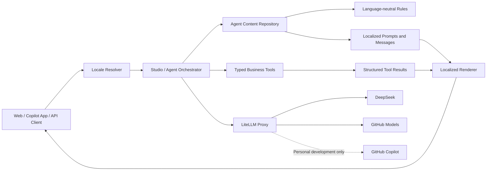

# LiteLLM、多语言 Agent 内容与规则治理设计

**日期：** 2026-07-20  
**状态：** Proposed（硬编码外置第一阶段已实现）  
**适用范围：** Data Label Platform 后端、Studio 对话、Agent、标签规则、知识分析、模型调用与前端动态文案

## 1. 背景

当前平台存在三类相互关联的问题：

1. 模型调用分散。DeepSeek、GitHub Copilot 及 LangChain 调用存在独立配置和直接调用，上游凭据、模型名称、重试与审计缺少统一入口。
2. 对话内容与业务规则大量硬编码在 Python 中，包括 System Prompt、Planner Prompt、回复文案、推荐问题、关键词、正则表达式、标签分类规则、阈值、工作流步骤和演示结果。
3. 平台需要同时面向中文和英文用户，但现有 Prompt、意图识别、标签分类名称和回复文案主要为中文，业务标识也在部分场景中直接使用中文名称。

本设计将上述问题统一为两个平台能力：

- **模型网关层：** LiteLLM Proxy 负责统一模型接入、认证、路由、重试、预算和审计。
- **Agent 内容治理层：** 负责语言无关规则、多语言 Prompt、多语言文案、版本发布、回滚和运行期解析。

## 2. 目标

### 2.1 功能目标

- 后端只通过 OpenAI-compatible 接口访问模型。
- DeepSeek、GitHub Models 和可选的 GitHub Copilot 开发者接入统一经过 LiteLLM。
- Python 代码中不再保存大段 Prompt、意图关键词表、正则词典、业务阈值和演示结果。
- 中文、英文执行同一套业务逻辑，仅自然语言表达和识别词典不同。
- 标签、分类、工作流、工具与意图使用稳定的语言无关 ID。
- Prompt、规则和文案具有版本、审批、审计、灰度和回滚能力。
- 每次 Agent Run 可追踪模型、Prompt 版本、规则版本、语言和工具版本。

### 2.2 非目标

- 本阶段不建设完整翻译管理系统。
- 本阶段不允许模型自由修改生产规则。
- 不将个人 GitHub Copilot 订阅作为多人生产服务的默认推理来源。
- 不把业务事实、客户数量、覆盖率或评分交给模型凭空生成。

## 3. 总体架构



### 3.1 分层职责

| 层 | 职责 | 不应承担的职责 |
|---|---|---|
| Locale Resolver | 决定会话语言和回退链 | 业务意图判断 |
| Agent Content Repository | 加载、校验、缓存和解析配置 | 执行业务查询 |
| Rule Engine | 执行意图、标签、阈值和工作流规则 | 生成自然语言文案 |
| Prompt Repository | 返回指定语言和版本的 Prompt | 保存上游模型密钥 |
| Business Tools | 查询真实数据并返回结构化结果 | 返回写死的中文段落 |
| Localized Renderer | 根据 locale 渲染结果与文案 | 修改业务结果 |
| LiteLLM Proxy | 模型路由、认证、预算、重试和审计 | 保存业务 Prompt 的产品版本 |

## 4. 当前实现基线

硬编码外置第一阶段已经建立：

- 默认配置：`backend/config/agent_content.toml`
- 配置仓库：`backend/app/content/repository.py`
- 可通过 `AGENT_CONTENT_CONFIG` 指定外部配置文件。
- 配置支持必填段校验、类型校验、模板变量校验、缓存和文件变更检测。
- 已外置的主要内容包括：
  - 模型别名、温度和默认地址；
  - Studio、ReAct、Planner、知识分析、数据源分析和标签分析 Prompt；
  - Demo Agent 意图、回复和推荐问题；
  - 标签敏感度、数据域、质量阈值和证据文案；
  - Workbench 意图正则、步骤、标题和演示结果；
  - 内置 PII、Domain、Quality Skill 规则；
  - 客户画像、产品类别、价值层级、行为信号规则；
  - 标签开发工作流字段、步骤和标签；
  - 圈选演示结果与启发式参数。

该实现解决了 Python 硬编码问题，但单文件和中文键值不适合作为最终双语方案，需要按本设计继续拆分。

## 5. LiteLLM Proxy 设计

### 5.1 推荐拓扑

```text
Data Label Backend
    → LiteLLM /v1
        → DeepSeek
        → GitHub Models
        → Other approved OpenAI-compatible providers
```

GitHub Copilot 有两种不同方向：

1. LiteLLM 将 Copilot 订阅作为上游：仅用于个人开发环境，认证依赖 OAuth Device Flow 和本地凭据目录。
2. GitHub Copilot App 将 LiteLLM 作为 BYOK OpenAI-compatible Provider：适合让 Copilot App 使用平台批准的模型。

生产应用优先使用 GitHub Models 的公开推理 API，而不是项目当前直接调用的 `api.githubcopilot.com/v1`。

### 5.2 LiteLLM 模型配置示例

```yaml
model_list:
  - model_name: deepseek-chat
    litellm_params:
      model: deepseek/deepseek-chat
      api_key: os.environ/DEEPSEEK_API_KEY

  - model_name: deepseek-reasoner
    litellm_params:
      model: deepseek/deepseek-reasoner
      api_key: os.environ/DEEPSEEK_API_KEY

  - model_name: github-gpt-4.1
    litellm_params:
      model: github/gpt-4.1
      api_key: os.environ/GITHUB_MODELS_TOKEN

  - model_name: text-embedding-3-small
    model_info:
      mode: embedding
    litellm_params:
      model: github/text-embedding-3-small
      api_key: os.environ/GITHUB_MODELS_TOKEN

router_settings:
  num_retries: 2
  timeout: 60
  fallbacks:
    - deepseek-chat:
        - github-gpt-4.1

general_settings:
  master_key: os.environ/LITELLM_MASTER_KEY
```

### 5.3 后端配置

```env
LLM={"deepseek":{"api_key":"${LITELLM_APP_KEY}","base_url":"http://litellm:4000/v1"}}
EMBEDDING={"api_key":"${LITELLM_APP_KEY}","base_url":"http://litellm:4000/v1","model":"text-embedding-3-small","dimension":1536}
```

第一阶段保留 `deepseek-chat` 别名以兼容现有调用。后续改为统一的 `OpenAICompatibleProvider`，业务代码只认识：

```text
base_url
api_key
default_model
timeout
```

### 5.4 密钥与预算

- 上游密钥只存放在 LiteLLM 环境或 Secret Manager。
- 后端使用 LiteLLM Virtual Key，不使用 Master Key。
- Virtual Key 限制允许模型、RPM、TPM、预算、有效期和所属团队。
- LiteLLM 使用独立数据库保存密钥、预算和调用账本，不与业务表混用。
- 生产镜像必须固定审核过的版本和 digest，不使用浮动 `main-latest`。

## 6. 多语言设计原则

### 6.1 Locale 标准

首期支持：

- `zh-CN`
- `en-US`

后续可扩展 `zh-HK`、`en-GB` 等 BCP 47 语言代码。

语言解析优先级：

```text
request.locale
→ session.locale
→ user.locale
→ tenant.default_locale
→ system.default_locale
```

HTTP 同时支持：

```http
Accept-Language: en-US
```

如果首轮未指定语言，可以做一次语言检测，并把结果写入会话；不得每轮重新检测导致语言跳变。

### 6.2 语言无关与语言相关内容

| 内容 | 是否区分语言 |
|---|---:|
| 工具名、意图 ID、状态 ID | 否 |
| 模型、超时、温度、预算 | 否 |
| 业务阈值、评分公式 | 否 |
| 工作流顺序 | 否 |
| 数据字段 PII/Domain 多语言匹配词典 | 始终全部启用 |
| 自然语言意图关键词和语法正则 | 是 |
| Prompt | 是 |
| 回复、错误和推荐文案 | 是 |
| 标签、分类和工作流显示名称 | 是 |

数据库字段名语言与用户界面语言没有必然关系。因此 PII 和字段识别规则必须同时包含中英文别名，不能按会话 locale 二选一。

## 7. 文件存储设计

### 7.1 目标目录

```text
backend/config/agent/
├── manifest.toml
├── rules/
│   ├── intents.toml
│   ├── tagging.toml
│   ├── workflows.toml
│   ├── segmentation.toml
│   └── business-intelligence.toml
├── locales/
│   ├── zh-CN/
│   │   ├── messages.toml
│   │   ├── suggestions.toml
│   │   ├── taxonomy.toml
│   │   └── errors.toml
│   └── en-US/
│       ├── messages.toml
│       ├── suggestions.toml
│       ├── taxonomy.toml
│       └── errors.toml
├── prompts/
│   ├── zh-CN/
│   │   ├── studio-system.md
│   │   ├── planner.md
│   │   ├── knowledge-analysis.md
│   │   └── data-source-analysis.md
│   └── en-US/
│       ├── studio-system.md
│       ├── planner.md
│       ├── knowledge-analysis.md
│       └── data-source-analysis.md
├── fixtures/
│   ├── demo-segment.json
│   └── demo-workbench.json
└── schemas/
    ├── planner-output.schema.json
    ├── annotation-output.schema.json
    └── segment-result.schema.json
```

### 7.2 文件职责

| 当前 `agent_content.toml` 内容 | 目标位置 |
|---|---|
| `models` | 部署配置或模型连接配置 |
| `prompts` | `prompts/{locale}/*.md` |
| `demo` 回复文案 | `locales/{locale}/messages.toml` |
| `demo.intents` | `rules/intents.toml` |
| `requirements.categories` | 稳定分类 ID + locale 词典 |
| `tagging` | `rules/tagging.toml` |
| `workbench.actions` | `rules/intents.toml` 和 `rules/workflows.toml` |
| `workbench.demo_results` | `fixtures/demo-workbench.json` |
| `react` 文案和推荐 | locale 文案与 suggestions 文件 |
| `skills` | 对应业务规则文件 |
| `business_intelligence` | `rules/business-intelligence.toml` |
| `workflow` | `rules/workflows.toml` + 本地化标签 |
| `segments` | `rules/segmentation.toml` + fixture |

### 7.3 Prompt Manifest

```toml
[prompts.data_source_analysis]
schema = "schemas/annotation-output.schema.json"
variables = ["existing_tags", "source_text"]
default_locale = "zh-CN"

[prompts.data_source_analysis.files]
zh-CN = "prompts/zh-CN/data-source-analysis.md"
en-US = "prompts/en-US/data-source-analysis.md"
```

双语 Prompt 必须具有相同的模板变量、输出 Schema、工具名和业务约束，只允许自然语言表达不同。

## 8. 稳定业务 ID 设计

不得使用中文名称作为业务主键，例如：

```toml
"行为意向" = ["留学", "移民"]
```

应改为：

```toml
[[requirement_categories]]
id = "behavior_intent"
label_key = "taxonomy.behavior_intent"

[requirement_categories.keywords]
zh-CN = ["留学", "移民", "跨境", "汇款"]
en-US = ["study abroad", "immigration", "cross-border", "remittance"]
```

业务层输出：

```json
{"category":"behavior_intent"}
```

渲染层输出：

```text
zh-CN: 行为意向
en-US: Behavioral Intent
```

适用对象包括：

- intent ID；
- tool ID；
- tag code；
- category code；
- workflow step ID；
- error/result code；
- suggestion ID；
- active view ID。

## 9. 意图识别规则

意图及动作定义一次，自然语言 matcher 按 locale 管理：

```toml
[[intents]]
id = "tag_discovery"
action = "search_tags"
title_key = "workbench.tag_discovery"

[intents.matchers]
zh-CN = [
  "搜索.*标签",
  "有哪些.*标签",
  "标签市场"
]
en-US = [
  "search.*tags?",
  "find.*tags?",
  "what tags are available",
  "tag marketplace"
]
```

识别结果保持结构化：

```json
{
  "intent": "tag_discovery",
  "action": "search_tags",
  "parameters": {"keyword": "study abroad"}
}
```

## 10. Prompt 与输出 Schema

中文 Prompt 示例：

```markdown
你是一个数据标注专家。请分析以下数据源描述。

现有标签：
${existing_tags}

数据源描述：
${source_text}

只输出符合指定 Schema 的 JSON。
```

英文 Prompt 示例：

```markdown
You are a data labeling specialist. Analyze the following data source.

Existing tags:
${existing_tags}

Data source:
${source_text}

Return only JSON conforming to the specified schema.
```

模型输出必须通过 JSON Schema 或 Pydantic 校验。无效输出不得进入工具执行层。

## 11. 工具返回值与本地化 Renderer

当前工具中直接返回中文字符串的方式应逐步淘汰：

```python
return f"未找到包含「{query}」的标签。"
```

目标方式：

```python
return {
    "result_code": "tags.not_found",
    "data": {
        "query": query,
        "items": [],
        "count": 0,
    },
}
```

中文文案：

```toml
"tags.not_found" = "未找到包含「${query}」的标签。"
```

英文文案：

```toml
"tags.not_found" = "No tags containing ‘${query}’ were found."
```

工具层只负责事实，Renderer 只负责表达。LLM 只能解释已验证的结构化工具结果。

## 12. 标签与分类双语数据模型

标签不得为每种语言分别创建一条业务记录。

### 12.1 标签主表

```text
tag_definitions
  id
  code
  category_code
  value_type
  rules
  status
  source_locale
```

### 12.2 标签翻译表

```text
tag_translations
  id
  tag_id
  locale
  name
  description
  business_definition
  translation_status
  updated_by
  updated_at
```

`translation_status`：

- `draft`
- `machine`
- `reviewed`
- `approved`

分类使用同样方式：

```text
tag_category_translations
  category_id
  locale
  name
  description
```

示例：

```text
code: STUDY_ABROAD_INTENT
zh-CN: 有留学需求
en-US: Study Abroad Intent
```

## 13. 会话、消息与 Run 数据模型

### 13.1 会话

为 `studio_sessions` 增加：

```text
locale
locale_source        -- request/user/tenant/detected/default
content_bundle_id
```

### 13.2 消息

为 `chat_messages` 增加：

```text
input_locale
output_locale
result_code
structured_payload
```

### 13.3 Run 上下文

每次 Run 记录：

```text
mode
locale
provider
requested_model
actual_model
prompt_key
prompt_version
rule_bundle_version
content_bundle_version
tool_versions
fallback_used
input_tokens
output_tokens
latency_ms
```

## 14. API 设计

### 14.1 聊天请求

```json
{
  "message": "Find high-net-worth customer tags",
  "session_id": "session-id",
  "locale": "en-US"
}
```

### 14.2 聊天响应

```json
{
  "reply": "Found 3 matching tags.",
  "locale": "en-US",
  "content_version": "2026.07.20.3",
  "prompt_version": "planner@2.1.0",
  "suggestions": [
    {
      "id": "view_tag_market",
      "label": "View tag marketplace"
    }
  ]
}
```

推荐问题必须返回稳定 ID 和本地化 label，不能只返回裸字符串。

## 15. Locale Resolver

```python
class LocaleResolver:
    def resolve(
        self,
        request_locale: str | None,
        session_locale: str | None,
        user_locale: str | None,
        tenant_locale: str | None,
    ) -> str:
        ...
```

回退链：

```text
zh-CN → zh → default_locale
en-US → en → default_locale
```

开发和测试环境缺少翻译时直接失败；生产环境回退默认语言并记录告警，不得把配置 key 原样显示给用户。

## 16. 内容仓库接口

```python
class LocalizedContentRepository:
    def text(self, key: str, locale: str, **variables) -> str:
        ...

    def prompt(self, key: str, locale: str, **variables) -> str:
        ...

    def rule(self, key: str) -> dict:
        ...

    def fixture(self, key: str) -> dict:
        ...
```

配置解析优先级：

```text
Tenant DB published config
→ Global DB published config
→ Mounted file config
→ Packaged default config
```

## 17. 生产配置中心数据模型

第一阶段继续采用 Git 文件配置。需要在线编辑、审批、灰度和回滚后，增加以下表。

### 17.1 `config_artifacts`

```text
id
key
artifact_type       -- prompt/message/rule/workflow/fixture
scope               -- global/tenant
tenant_id
active_version_id
created_at
```

### 17.2 `config_versions`

```text
id
artifact_id
version
status              -- draft/review/approved/published/retired
schema_version
language_neutral_payload
checksum
created_by
approved_by
created_at
published_at
```

### 17.3 `config_localizations`

```text
id
version_id
locale
content
template_variables
translation_status
updated_by
updated_at
```

### 17.4 `config_audit_logs`

```text
artifact_id
from_version
to_version
action
operator
change_summary
created_at
```

发布操作必须原子切换 `active_version_id`，旧版本保留以支持快速回滚。

## 18. 前端国际化边界

- React 静态 UI 使用前端 i18n 资源。
- 后端动态业务结果、Agent 回复、工具错误和推荐问题由后端本地化。
- 前后端共享稳定 key 命名规范，但不要求共享同一个物理文件。
- API 枚举和状态使用稳定英文 code，前端根据 locale 显示 label。
- 前端不得根据中文字符串判断业务状态。

## 19. 安全与治理

- Prompt 和规则配置中禁止保存 API Key、Token 和数据库密码。
- 所有 Prompt/规则发布必须经过 Schema 校验和审批。
- 正则在发布前编译校验，并限制高风险回溯表达式和输入长度。
- 模板变量必须显式声明，禁止任意表达式执行。
- 模型输出必须通过 Schema 校验。
- 生产修改记录操作者、变更摘要、版本和 checksum。
- 敏感工具结果在进入 LLM 前执行脱敏和最小化。
- Demo fixture 与真实业务数据严格分离。

## 20. 测试策略

### 20.1 配置测试

- 所有 TOML、JSON、Markdown Manifest 可加载。
- 所有必填 artifact 存在。
- `zh-CN` 和 `en-US` 必填 key 完整。
- 两种语言 Prompt 的模板变量一致。
- Prompt 输出 Schema 一致。
- 正则均可编译且通过安全检查。

### 20.2 行为对等测试

以下输入应触发相同意图和工具：

```text
搜索留学标签
Find study-abroad tags
```

预期：

```text
intent = tag_discovery
action = search_tags
```

### 20.3 回退测试

- 指定 locale 存在时使用指定语言。
- 缺少地区变体时回退基础语言。
- 缺少全部翻译时生产回退默认语言并告警。
- 会话确定语言后不会因单条混合语言输入自动跳变。

### 20.4 模型与工具测试

- DeepSeek 和 GitHub Models 普通/流式调用。
- 429、超时和 fallback。
- JSON Schema 校验失败时不执行工具。
- 中英文 Prompt 得到相同结构的工具计划。
- Run 正确记录 locale、Prompt、规则和模型版本。

### 20.5 静态检查

CI 扫描核心 Python 目录，阻止新增：

- 大段 System Prompt；
- 意图关键词列表；
- PII/Domain 正则字典；
- 业务阈值；
- 演示客户数量、覆盖率和评分；
- 依赖中文文案的状态判断。

允许保留日志、异常类名、开发注释和不可本地化的协议常量。

## 21. 可观测性

监控维度：

- locale 请求分布；
- locale 回退次数；
- 缺失翻译次数；
- 中英文意图识别准确率；
- Prompt 版本成功率；
- 模型、语言、工具维度的延迟和错误率；
- fallback 次数；
- 每语言 Token 和费用；
- 无效结构化输出比例。

日志不得记录模型密钥、原始敏感字段或完整客户数据。

## 22. 迁移计划

### Phase 1：硬编码外置（已完成首轮）

- 建立 TOML 配置仓库。
- 外置主要 Prompt、文案、意图、正则、阈值、工作流和 fixture。
- 增加配置路径覆盖、校验和测试。

### Phase 2：双语文件结构

- 拆分单一 `agent_content.toml`。
- 增加 `zh-CN`、`en-US` locale 包。
- 长 Prompt 迁移到 Markdown。
- 引入 Prompt Manifest 和 JSON Schema。
- 将中文业务键迁移为稳定 ID。

### Phase 3：会话与结构化工具

- 增加 Session locale 和 Locale Resolver。
- 工具由字符串返回改为 Typed Result DTO。
- 增加 Localized Renderer。
- 推荐问题改为 `id + label`。
- Run 记录 locale 和内容版本。

### Phase 4：LiteLLM 网关统一

- 部署固定版本 LiteLLM。
- DeepSeek、GitHub Models 和 Embedding 接入。
- 后端统一 OpenAI-compatible Provider。
- 配置 Virtual Key、预算、重试、fallback 和审计。
- 移除业务应用直接 Copilot endpoint。

### Phase 5：数据库配置中心

- 增加 artifact/version/localization/audit 表。
- 建设草稿、审核、发布、灰度和回滚 API。
- 增加管理后台和翻译审核流程。
- 文件配置保留为 bootstrap 和灾备默认值。

## 23. 验收标准

- Python 核心运行路径不包含可配置的大段 Prompt、意图词典、业务正则和阈值。
- 中文、英文相同意图触发相同 action 和 tool。
- 所有工具返回结构化结果，动态文案通过 Renderer 生成。
- 标签、分类、状态、意图和工作流均使用稳定 ID。
- 标签具有 `zh-CN` 和 `en-US` 翻译，不重复创建业务标签。
- LiteLLM 成为后端唯一外部模型出口。
- 上游密钥不进入业务应用配置、日志和 API 响应。
- 每次 Run 可追溯 locale、模型、Prompt、规则和工具版本。
- 配置可校验、审计、发布和回滚。
- Demo 模式不调用外部模型；真实模式不使用写死的业务事实。

## 24. 关键决策总结

1. 业务规则只维护一份，多语言只负责识别和表达。
2. 所有业务实体使用稳定 ID，不使用中文名称作为主键或判断条件。
3. 数据字段识别规则始终同时支持中英文，不随会话语言切换。
4. 工具返回结构化事实，Renderer 负责本地化，LLM 负责解释而非创造业务事实。
5. Git 文件配置是第一阶段事实来源，数据库配置中心是后续治理层。
6. LiteLLM 统一模型出口，GitHub Models 是应用接入首选，个人 Copilot 上游仅用于开发。
7. Prompt、规则、翻译、模型和工具版本必须写入 Run 审计上下文。

