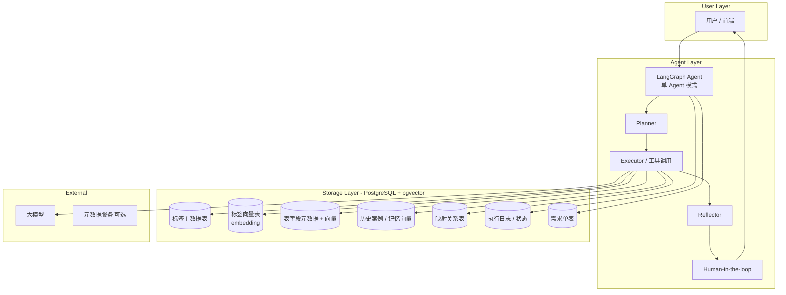

# 自动打标签 AI Agent 与 Workflow 设计（基于 pgvector 存储）

**版本**：v1.0  
**日期**：2026-08-15  
**存储核心**：PostgreSQL + pgvector  
**框架**：LangGraph（单 Agent） + LangChain  
**目标**：完整定义 Agent 架构、Workflow 状态机，以及如何使用 pgvector 支撑记忆、检索、相似度匹配等能力。

---

## 1. 总体架构



**核心思想**：
- 业务结构化数据（标签定义、映射、需求、日志）存在普通 PostgreSQL 表。
- 需要语义检索的内容（标签、字段、历史案例）使用 **pgvector** 存储 embedding，支持高效相似度搜索。
- Agent 通过工具调用访问这些数据，实现「查重、推荐映射、记忆召回」等能力。

---

## 2. pgvector 存储设计

### 2.1 推荐扩展与基础配置

```sql
CREATE EXTENSION IF NOT EXISTS vector;
```

建议使用 `vector(1536)` 或根据实际 Embedding 模型维度调整（OpenAI text-embedding-3-small 为 1536，bge-m3 等可按模型设置）。

### 2.2 核心表结构设计

#### （1）标签主数据表 + 向量表

```sql
-- 标签主数据
CREATE TABLE tag_definition (
    tag_id          BIGSERIAL PRIMARY KEY,
    tag_code        VARCHAR(64) UNIQUE NOT NULL,
    tag_name        VARCHAR(128) NOT NULL,
    tag_type        VARCHAR(32) NOT NULL,          -- location / audience / product / activity ...
    value_type      VARCHAR(32),                   -- enum / boolean / string / number / rule
    description     TEXT,
    status          VARCHAR(16) DEFAULT 'draft',   -- draft / active / deprecated
    source_req_id   VARCHAR(64),
    created_by      VARCHAR(64),
    created_at      TIMESTAMPTZ DEFAULT NOW(),
    updated_at      TIMESTAMPTZ DEFAULT NOW()
);

-- 标签向量（支持语义查重与推荐）
CREATE TABLE tag_embedding (
    tag_id          BIGINT PRIMARY KEY REFERENCES tag_definition(tag_id) ON DELETE CASCADE,
    embedding       vector(1536) NOT NULL,
    model_name      VARCHAR(64) NOT NULL,          -- 记录使用的 embedding 模型
    updated_at      TIMESTAMPTZ DEFAULT NOW()
);

-- 向量索引（IVFFlat 或 HNSW，按数据量选择）
CREATE INDEX ON tag_embedding 
USING hnsw (embedding vector_cosine_ops)
WITH (m = 16, ef_construction = 64);
```

#### （2）表字段元数据 + 向量

```sql
CREATE TABLE schema_field (
    field_id        BIGSERIAL PRIMARY KEY,
    db_name         VARCHAR(64),
    table_name      VARCHAR(128) NOT NULL,
    field_name      VARCHAR(128) NOT NULL,
    field_type      VARCHAR(64),
    description     TEXT,
    is_sensitive    BOOLEAN DEFAULT FALSE,
    status          VARCHAR(16) DEFAULT 'active',
    updated_at      TIMESTAMPTZ DEFAULT NOW(),
    UNIQUE(db_name, table_name, field_name)
);

CREATE TABLE schema_field_embedding (
    field_id        BIGINT PRIMARY KEY REFERENCES schema_field(field_id) ON DELETE CASCADE,
    embedding       vector(1536) NOT NULL,
    model_name      VARCHAR(64) NOT NULL,
    updated_at      TIMESTAMPTZ DEFAULT NOW()
);

CREATE INDEX ON schema_field_embedding 
USING hnsw (embedding vector_cosine_ops);
```

#### （3）历史案例 / 长期记忆向量

```sql
CREATE TABLE agent_memory (
    memory_id       BIGSERIAL PRIMARY KEY,
    memory_type     VARCHAR(32) NOT NULL,          -- case / rule / feedback / mapping_example
    content         TEXT NOT NULL,                 -- 原始文本或摘要
    metadata        JSONB,                         -- 结构化附加信息
    embedding       vector(1536) NOT NULL,
    model_name      VARCHAR(64) NOT NULL,
    created_at      TIMESTAMPTZ DEFAULT NOW()
);

CREATE INDEX ON agent_memory 
USING hnsw (embedding vector_cosine_ops);
```

#### （4）其他业务表（普通表）

```sql
-- 需求单
CREATE TABLE tag_requirement (
    req_id          VARCHAR(64) PRIMARY KEY,
    title           VARCHAR(256),
    description     TEXT NOT NULL,
    status          VARCHAR(32) DEFAULT 'draft',
    creator         VARCHAR(64),
    assignee        VARCHAR(64),
    created_at      TIMESTAMPTZ DEFAULT NOW(),
    updated_at      TIMESTAMPTZ DEFAULT NOW()
);

-- 标签-字段映射
CREATE TABLE tag_field_mapping (
    mapping_id      BIGSERIAL PRIMARY KEY,
    tag_id          BIGINT REFERENCES tag_definition(tag_id),
    field_id        BIGINT REFERENCES schema_field(field_id),
    mapping_rule    TEXT,
    confidence      REAL,
    status          VARCHAR(16) DEFAULT 'active',
    created_at      TIMESTAMPTZ DEFAULT NOW()
);

-- Agent 执行日志 / 状态快照（可选）
CREATE TABLE agent_execution_log (
    log_id          BIGSERIAL PRIMARY KEY,
    thread_id       VARCHAR(64) NOT NULL,
    req_id          VARCHAR(64),
    step_name       VARCHAR(64),
    state_snapshot  JSONB,
    stop_reason     VARCHAR(64),
    created_at      TIMESTAMPTZ DEFAULT NOW()
);
```

---

## 3. Agent 设计（单 Agent + LangGraph）

### 3.1 状态定义（增加 pgvector 相关字段）

```python
from typing import TypedDict, List, Dict, Optional, Annotated
from langgraph.graph.message import add_messages

class TagAgentState(TypedDict):
    messages: Annotated[List, add_messages]
    user_requirement: str
    req_id: str
    
    # 规划与控制
    plan: List[str]
    current_step: int
    step_count: int
    retry_count: int
    stop_reason: Optional[str]
    
    # 标签相关
    extracted_tags: List[Dict]
    existing_tags: List[Dict]          # 从 pgvector 相似度检索回来的
    new_tags: List[Dict]
    final_tags: List[Dict]
    
    # 字段与映射
    discovered_schemas: List[Dict]     # 语义检索到的字段
    recommended_mappings: List[Dict]
    confirmed_mappings: List[Dict]
    
    # 记忆召回
    retrieved_memories: List[Dict]     # 从 agent_memory 召回的历史案例
    
    # 控制
    confidence: float
    need_human_confirm: bool
    human_feedback: Optional[str]
    execution_result: Optional[Dict]
    error: Optional[str]
```

### 3.2 核心节点与 pgvector 的关系

| 节点                  | 主要动作                                   | 使用的 pgvector 能力                     |
|-----------------------|--------------------------------------------|------------------------------------------|
| planner               | 生成计划                                   | 可选召回相似历史需求案例                 |
| extract_tags          | 从需求中抽取标签                           | -                                        |
| query_tag_library     | 标签查重                                   | **tag_embedding 向量相似度搜索**         |
| discover_schema       | 发现相关字段                               | **schema_field_embedding 向量搜索**      |
| recommend_mapping     | 推荐映射                                   | 结合标签向量 + 字段向量 + 历史映射案例   |
| retrieve_memory       | 召回历史成功/失败案例                      | **agent_memory 向量搜索**                |
| validate              | 冲突与规范检查                             | 可再次使用向量做相似标签检测             |
| human_confirm         | 人工确认                                   | -                                        |
| execute               | 创建标签 + 写映射 + 写入向量                 | 写入 tag_definition + tag_embedding      |
| reflect / finalize    | 反思与结束                                 | 可选将本次成功案例写入 agent_memory      |

---

## 4. Workflow 状态机设计（LangGraph）

```python
from langgraph.graph import StateGraph, END
from langgraph.types import interrupt

workflow = StateGraph(TagAgentState)

# 添加节点
workflow.add_node("planner", planner_node)
workflow.add_node("extract_tags", extract_tags_node)
workflow.add_node("retrieve_memory", retrieve_memory_node)      # 新增：记忆召回
workflow.add_node("query_tag_library", query_tag_library_node)
workflow.add_node("discover_schema", discover_schema_node)
workflow.add_node("recommend_mapping", recommend_mapping_node)
workflow.add_node("validate", validate_node)
workflow.add_node("human_confirm", human_confirm_node)
workflow.add_node("execute", execute_node)
workflow.add_node("reflect", reflect_node)
workflow.add_node("finalize", finalize_node)

workflow.set_entry_point("planner")

# 主流程
workflow.add_edge("planner", "extract_tags")
workflow.add_edge("extract_tags", "retrieve_memory")
workflow.add_edge("retrieve_memory", "query_tag_library")
workflow.add_edge("query_tag_library", "discover_schema")
workflow.add_edge("discover_schema", "recommend_mapping")
workflow.add_edge("recommend_mapping", "validate")

# 条件：是否需要人工确认
workflow.add_conditional_edges(
    "validate",
    should_human_confirm,
    {
        "human_confirm": "human_confirm",
        "execute": "execute"
    }
)

workflow.add_edge("human_confirm", "execute")
workflow.add_edge("execute", "reflect")

workflow.add_conditional_edges(
    "reflect",
    should_continue,
    {
        "continue": "planner",
        "end": "finalize"
    }
)

workflow.add_edge("finalize", END)

app = workflow.compile(checkpointer=postgres_checkpointer)  # 可用 Postgres 做 checkpointer
```

---

## 5. 关键工具实现要点（与 pgvector 强相关）

### 5.1 标签语义查重工具

```python
def query_tag_library(tags: List[Dict], top_k: int = 5) -> Dict:
    """
    对每个候选标签生成 embedding，到 tag_embedding 表做余弦相似度搜索
    """
    results = []
    for tag in tags:
        emb = embedding_model.embed_query(tag["name"] + " " + tag.get("description", ""))
        # SQL 示例
        # SELECT t.*, 1 - (e.embedding <=> %s) AS similarity
        # FROM tag_embedding e
        # JOIN tag_definition t ON e.tag_id = t.tag_id
        # WHERE t.status = 'active'
        # ORDER BY e.embedding <=> %s
        # LIMIT %s
        similar = vector_search_tags(emb, top_k)
        results.append({
            "candidate": tag,
            "matches": similar
        })
    return {"existing": ..., "need_create": ...}
```

### 5.2 字段语义发现工具

```python
def discover_schema(tags: List[Dict], requirement: str) -> Dict:
    query_text = requirement + " " + " ".join([t["name"] for t in tags])
    emb = embedding_model.embed_query(query_text)
    
    # 到 schema_field_embedding 做相似度搜索
    fields = vector_search_fields(emb, top_k=20)
    return {"schemas": fields}
```

### 5.3 历史记忆召回工具

```python
def retrieve_memory(requirement: str, memory_type: str = "case") -> Dict:
    emb = embedding_model.embed_query(requirement)
    memories = vector_search_memory(emb, memory_type=memory_type, top_k=5)
    return {"retrieved_memories": memories}
```

### 5.4 执行写入时同步更新向量

```python
def create_tag(tags: List[Dict]) -> Dict:
    for tag in tags:
        # 1. 写入 tag_definition
        tag_id = insert_tag_definition(tag)
        
        # 2. 生成 embedding 并写入 tag_embedding
        emb = embedding_model.embed_query(tag["name"] + " " + tag.get("description", ""))
        insert_tag_embedding(tag_id, emb, model_name="text-embedding-3-small")
        
    return {"created": ...}
```

---

## 6. Workflow 执行流程（结合 pgvector）

1. **用户输入需求** → 创建 req_id，写入 tag_requirement
2. **Planner** → 生成计划，可选从 agent_memory 召回相似历史需求
3. **Extract Tags** → LLM 抽取结构化标签
4. **Retrieve Memory** → 用需求文本向量检索历史成功案例与映射示例
5. **Query Tag Library** → 对每个标签做 pgvector 相似度搜索，判断复用还是新建
6. **Discover Schema** → 用需求+标签文本向量检索相关字段
7. **Recommend Mapping** → 结合向量结果 + 历史映射案例生成推荐
8. **Validate** → 规则 + 向量冲突检测
9. **Human Confirm**（如需要）→ 暂停等待确认
10. **Execute** → 写入标签主数据 + 生成并存储 embedding + 写入映射关系
11. **Reflect / Finalize** → 成功案例可写回 agent_memory，生成报告并结束

---

## 7. 关键实现建议

1. **Embedding 模型选择**  
   - 中文场景优先考虑 bge-m3、jina-embeddings-v3、text-embedding-3-large 等  
   - 维度与 pgvector 表定义保持一致

2. **索引选择**  
   - 数据量 < 10 万：HNSW 通常效果更好  
   - 数据量很大：考虑 IVFFlat 并做好 lists 调参

3. **一致性**  
   - 标签或字段描述发生变更时，必须同步更新对应 embedding

4. **Checkpointer**  
   - LangGraph 可直接使用 PostgresSaver，把 Agent 状态也存在同一个 PostgreSQL 中，便于运维

5. **性能**  
   - 高频查询可加缓存（Redis）  
   - 批量写入 embedding 时注意事务与性能

---

## 8. 与之前设计文档的关系

| 文档                                   | 关系说明                                   |
|----------------------------------------|--------------------------------------------|
| 自动打标签AI_Agent设计文档.md          | 本设计是其在存储层的具体化落地             |
| AI_Agent停止控制设计文档.md            | 停止逻辑保持不变，本设计补充了数据落地点   |
| 手动标签开发完整流程设计.md            | 业务流程对齐，pgvector 支撑自动化查重与推荐|
| AI_Agent剩余设计清单与优先级.md        | 本设计覆盖了「记忆」中的向量存储部分       |

---

## 9. 总结

本设计将 **pgvector** 作为 Agent 的核心语义存储引擎，主要解决：

- 标签语义查重（替代纯关键词搜索）
- 字段语义发现与推荐
- 历史案例 / 长期记忆召回
- 成功经验沉淀与复用

结构化数据仍使用普通 PostgreSQL 表管理，向量与结构化数据通过 ID 关联，既保证业务一致性，又具备强大的语义检索能力。

---

**文档结束**
