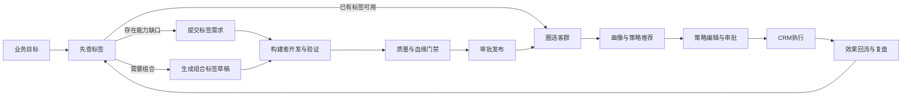
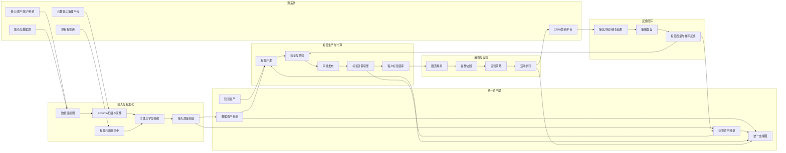
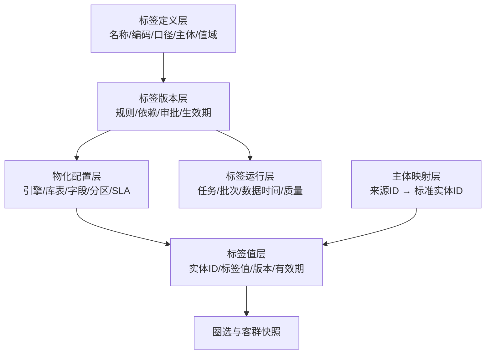
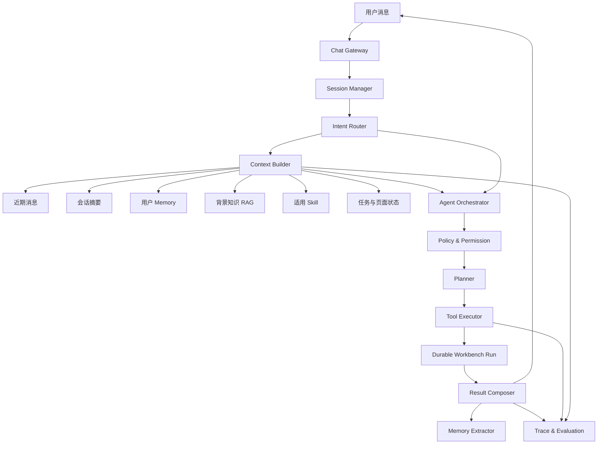
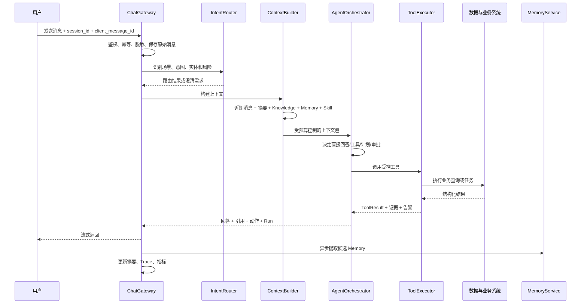
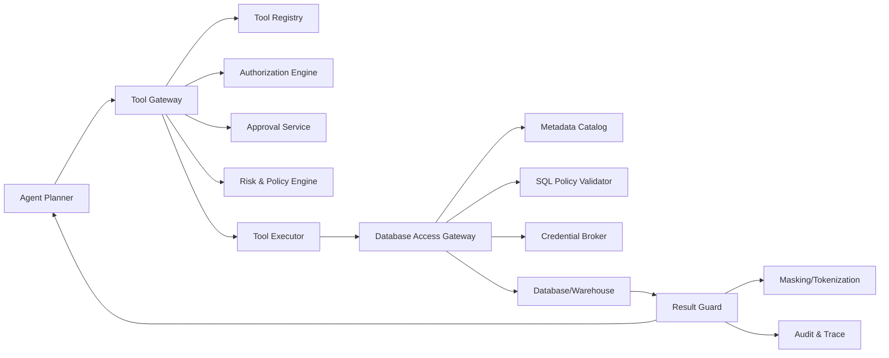

# 银行智能标签平台增强版产品设计

**版本：** v2.0  
**日期：** 2026-07-13  
**状态：** Design Review  
**适用产品：** data-label 银行智能标签平台

---

## 1. 文档目的

本文基于当前项目已有的标签开发、标签市场、标签分析、知识管理、AI 工作台、数据治理和审计能力，对下一阶段需求进行产品评审与重构设计。

本轮设计重点回答五个问题：

1. 标签库接入、元数据、AI 生产、消费运营和 CRM 集成是否构成合理的产品闭环。
2. 哪些功能应合并，避免产品入口和对象模型碎片化。
3. 标签构建者和标签使用者应分别经历怎样的核心旅程。
4. 如何让两个角色在同一平台协作，但不被对方的复杂功能干扰。
5. 如何基于当前项目逐步演进，而不是推翻重建。

本文将主要用户收敛为两类：

- **标签构建者：** IT BA、数据分析师、数据工程师、标签负责人和治理人员。
- **标签使用者：** 业务分析师、营销运营、客户经理运营人员和策略人员。

数据治理员、审批人和集成管理员作为横向协作角色进入流程，但不单独建立一套割裂的主旅程。

---

## 2. 当前产品评估

### 2.1 已有能力

当前项目已经具备以下基础：

- 自然语言需求解析与标签草稿。
- 定义、证据、规则、验证、发布五步标签开发流程。
- 标签分类、标签定义、标签草稿版本、正式版本、审批和发布记录。
- 标签与表、字段及知识证据绑定。
- 数据连接、表字段扫描、质量评分、PII 检测和脱敏样本。
- 标签市场、标签包、组合圈选、画像分析和画像对比。
- 知识文档、实体、关系三元组及知识到标签候选。
- AI 工作台、会话、后台 Workbench Run 和结构化结果展示。
- 数据治理总览、审计日志和基础合规能力。

这些能力说明平台已经具备“单标签生产 MVP”，下一阶段应该扩展为“标签资产生产与消费闭环”，不宜再以演示页面数量作为主要目标。

### 2.2 当前关键缺口

| 领域 | 当前状态 | 主要缺口 |
| --- | --- | --- |
| 标签目录 | 标签市场可浏览 | 元数据薄、外部来源不统一、缺少认证和质量状态 |
| 标签接入 | 支持数据连接 | 尚无外部标签目录同步、映射、冲突和游标管理 |
| 标签生产 | 五步流程已实现 | 验证仍偏演示、AI 规则能力弱、缺少组合标签正式模型 |
| 标签质检 | 有数据质量和 PII Skill | 没有针对标签的规则、运行、问题、修复和复检闭环 |
| 标签血缘 | 有 TagBinding | 只到表字段绑定，缺少组合标签、客群、策略和 CRM 下游 |
| 标签消费 | 有圈选和画像 | 缺少真实执行、快照、策略、审批、投放和效果回流 |
| 外部集成 | 无标准连接器 | CRM 对接会侵入业务代码，缺少幂等、补偿和映射版本 |
| AI Agent | 对话和关键词意图 | 缺少受控工具、操作分级、证据链和评测体系 |

### 2.3 对原始增强方案的评审

原始增强方向总体合理，已经覆盖银行标签平台的关键价值链：

```text
资产接入 → 标签生产 → 质量与血缘 → 标签消费 → 策略执行 → 效果回流
```

但如果按照功能名称逐一建设，会出现以下问题：

1. 页面过多，用户需要先理解平台模块，才能完成业务任务。
2. AI 智搜、标签市场和标签目录的能力高度重叠。
3. 生产端组合标签与消费端组合标签可能形成两套对象和两套编辑器。
4. 质检、血缘、审批被设计成独立终点，而不是嵌入发布和使用决策。
5. 智能圈客、策略推荐、策略运营、CRM 投放容易割裂成四段流程。
6. 标签构建者和使用者共用所有导航，会让业务用户看到过多技术概念。

因此，增强版产品应由“功能中心”调整为“角色任务中心”。

---

## 3. 产品定位与核心原则

### 3.1 产品定位

银行智能标签平台不是标签字典，也不是单纯的 SQL 开发工具，而是：

> 面向银行数据与业务团队的标签资产生产、治理、消费和运营平台。

标签资产必须具备：

- 明确业务定义。
- 明确目标实体和值域。
- 可执行技术规则。
- 可复现验证结果。
- 可追溯上下游血缘。
- 可衡量质量和新鲜度。
- 可版本化和审批。
- 可用于圈客、策略和外部系统。

### 3.2 产品原则

1. **按任务组织，而非按技术对象组织。**
2. **先查再建。** 所有标签开发和圈客前都先检索已有资产。
3. **AI 生成草稿，人在关键节点确认。**
4. **一次定义，多处复用。** 生产端和消费端共用同一标签资产。
5. **默认可追溯。** 证据、规则、版本、客群、策略和外发自动形成血缘。
6. **治理嵌入流程。** 质量、合规和血缘状态在用户决策点出现。
7. **对象分清。** 标签、客群、策略和活动不能混为一谈。
8. **结果可复现。** 历史圈选和投放必须绑定标签版本及客群快照。

---

## 4. 功能合并与产品收敛

### 4.1 合并后的五大产品域

| 合并后产品域 | 合并的原始需求 | 核心用户 |
| --- | --- | --- |
| 标签资产中心 | 现有标签库接入、标签元数据、AI 智搜、标签市场 | 构建者、使用者 |
| 标签生产工作台 | AI 单标签生产、AI 组合标签、消费侧组合标签创建 | 构建者，部分高级使用者 |
| 标签治理中心 | AI 标签质检、AI 标签血缘、审批、影响分析 | 构建者、治理角色 |
| 客群与策略中心 | 智能圈客、客群策略推荐、标签策略运营 | 使用者 |
| 集成运营中心 | CRM、营销平台、CDP、元数据平台集成 | 使用者、集成管理员 |

### 4.2 AI 智搜与标签市场合并

不建设独立的“AI 智搜标签”页面。标签市场升级为“标签资产中心”，同时支持：

- 传统关键词搜索。
- 自然语言智能搜索。
- 分类和元数据筛选。
- 标签比较。
- 推荐组合。
- 缺口分析。
- 收藏和最近使用。

用户只需理解一个入口：“找标签”。

### 4.3 标签接入与标签元数据合并

“标签库接入”不应成为标签使用者看到的独立主模块。它是标签资产中心的管理能力：

```text
标签资产中心
├── 标签目录
├── 标签详情
├── 标签源管理（管理员/构建者）
├── 同步任务
└── 冲突处理
```

外部接入标签和平台自产标签在目录中使用相同展示结构，只通过来源标识区分。

### 4.4 生产端和消费端组合标签合并

平台只保留一种“组合标签”资产和一套表达式模型。

入口可以不同：

- 构建者从标签生产工作台创建。
- 使用者从圈客规则点击“沉淀为组合标签”。

但两者最终进入同一个组合标签草稿、验证、审批和发布流程。

需要严格区分：

| 对象 | 含义 | 是否可重复计算 | 是否可直接投放 |
| --- | --- | ---: | ---: |
| 标签 | 客户或账户的稳定属性 | 是 | 否 |
| 组合标签 | 由多个标签计算出的新属性 | 是 | 否 |
| 客群 | 满足某组条件的客户集合 | 是 | 是，生成快照后 |
| 客群快照 | 某一时点的固定客户名单 | 否 | 是 |
| 策略 | 对某客群采用何种运营动作 | 是 | 经审批后 |
| 活动 | 一次具体执行实例 | 否 | 已执行对象 |

### 4.5 质检与血缘合并为治理中心

质检和血缘是两个视角，但共享同一治理对象：

- 质检回答“这个标签是否健康、可信、可用”。
- 血缘回答“它从哪里来、被谁使用、变化影响谁”。

两者合并到“标签治理中心”，并嵌入三个关键节点：

1. 开发时：证据质量和血缘完整度提示。
2. 发布时：质量门禁、合规门禁和影响分析。
3. 运行时：新鲜度、漂移、失败和下游影响告警。

### 4.6 圈客、推荐、策略运营和 CRM 合并为连续旅程

不让用户在四个模块之间重复选择同一客群。产品上设计为：

```text
定义客群
→ 查看画像
→ 获取策略建议
→ 编辑运营策略
→ 审批与排期
→ 推送 CRM
→ 回收结果
→ 效果复盘
```

页面可以分步，但上下文必须由同一个 `strategy_workspace_id` 串联。

---

## 5. 核心用户与工作模式

## 5.1 标签构建者

### 用户目标

- 接入或发现已有标签。
- 把业务需求转为标签资产。
- 找到可信数据证据。
- 构建规则或组合逻辑。
- 验证、审批和发布。
- 处理质量问题和变更影响。

### 默认首页

标签构建者进入“生产工作台”，首页优先展示：

- 我的开发任务。
- 待处理质检问题。
- 待审批或被驳回任务。
- 外部标签同步异常。
- 受上游变更影响的标签。
- 最近发布和被复用的标签。

不默认展示营销活动和 CRM 执行数据。

## 5.2 标签使用者

### 用户目标

- 快速找到可信标签。
- 用自然语言创建目标客群。
- 理解客群特征和规模。
- 获取可解释的策略建议。
- 保存、审批和执行策略。
- 查看触达与转化结果。

### 默认首页

标签使用者进入“客群与策略”，首页优先展示：

- 最近使用的标签和客群。
- 我的策略草稿和进行中活动。
- AI 推荐的可复用客群模板。
- 待审批或执行失败任务。
- 活动效果和异常提醒。

不默认展示表字段、SQL、调度和同步游标。

## 5.3 角色协作原则

- 使用者可以提出标签需求，但不必进入技术开发页面。
- 构建者收到结构化需求，而非聊天或邮件转述。
- 构建者发布标签后，请求方自动收到通知并可继续圈客。
- 使用者可以从圈选规则发起组合标签申请。
- 构建者负责把申请转为可治理的正式资产。
- 治理角色在审批和异常处理时进入，不干扰普通操作。

---

## 6. 总体用户旅程



这个旅程形成两个闭环：

- 资产闭环：需求 → 构建 → 发布 → 复用 → 反馈 → 优化。
- 运营闭环：客群 → 策略 → 执行 → 效果 → 推荐优化。

---

## 7. 标签构建者 User Journey

## 7.1 Journey A：接入现有标签库

### 场景

银行已有数仓标签宽表、旧标签平台或 CRM 客户属性，希望纳入统一目录。

### 步骤

1. 进入“标签资产中心—标签源管理”。
2. 选择来源模板：数据库、标签平台 API、元数据平台、CRM 或文件。
3. 填写连接信息并测试连接。
4. 系统读取远端标签目录和字段结构。
5. 用户选择字段映射模板。
6. 系统执行标签身份匹配和重复检测。
7. 用户只处理高风险冲突，普通新增自动预览。
8. 确认首次同步。
9. 平台生成同步报告和质量报告。
10. 同步标签进入统一目录，并显示“外部来源”。

### 关键体验

- 提供厂商和常见标签表模板，避免每次手工映射。
- 清晰区分“新增、更新、疑似重复、来源已删除”。
- 同步前展示影响预览。
- 冲突按风险排序，而不是要求用户逐条处理。
- 外部标签不可被平台静默覆盖。

### 成功标准

- 首次 1,000 个标签接入可在半天内完成。
- 字段映射可复用。
- 增量同步可追踪、可重试。
- 同名异义标签不会被自动错误合并。

## 7.2 Journey B：构建单标签

### 入口

- 构建者主动新建。
- 使用者提交标签需求。
- 知识库生成候选。
- 数据扫描生成候选。
- 圈客过程中发现标签缺口。

### 优化后的七步流程

现有五步流程扩展为七个业务阶段，但界面仍可采用五步导航，避免步骤过多：

```text
需求与查重
→ 定义标签
→ 选择证据
→ 构建规则
→ 验证与质检
→ 审批
→ 发布与通知
```

页面映射：

| UI 步骤 | 内部阶段 |
| --- | --- |
| 1. 需求定义 | 需求与查重、定义标签 |
| 2. 数据证据 | 选择证据 |
| 3. 计算规则 | 构建规则 |
| 4. 验证质检 | 验证与质检 |
| 5. 发布 | 审批、发布与通知 |

### AI 介入点

- 解析业务目标。
- 检索重复和相似标签。
- 推荐数据证据。
- 生成结构化规则草稿。
- 解释命中、未命中和边界样本。
- 发现口径、质量、合规和血缘问题。
- 生成审批摘要。

### 人工确认点

- 业务定义和值域。
- 数据证据。
- 技术规则。
- 验证结果。
- 质检豁免。
- 发布版本。

### 完成反馈

发布后系统应自动：

- 将标签加入资产目录。
- 通知需求发起人。
- 记录字段级血缘。
- 建立定时质检。
- 提供“立即使用该标签圈客”入口。

## 7.3 Journey C：构建组合标签

### 场景

构建者需要把多个原子标签沉淀成稳定业务概念，例如“高潜留学家庭”。

### 步骤

1. 输入业务目标或从圈选规则导入。
2. AI 搜索可用标签并给出组合草案。
3. 用户在规则树中调整 AND、OR、NOT、窗口和权重。
4. 系统检查值域兼容、标签互斥、重复条件和版本依赖。
5. 执行覆盖预估。
6. 查看子标签贡献和重叠情况。
7. 选择版本依赖策略。
8. 执行验证和质检。
9. 审批发布。

### 体验原则

- 使用同一个规则树组件，不另建第二套组合编辑器。
- 默认锁定已发布子标签版本。
- 子标签变更时自动执行影响分析。
- 发现缺失原子标签时，可一键拆出开发任务。

## 7.4 Journey D：处理标签质量问题

### 入口

- 发布前门禁。
- 定时质检。
- 上游字段变更。
- 覆盖率或分布漂移。
- 下游用户反馈。
- CRM 活动效果异常。

### 步骤

1. 构建者在首页看到问题摘要和严重级别。
2. 打开问题查看证据、影响标签和下游策略。
3. AI 解释原因并提供修复建议。
4. 用户选择修复、豁免、转交或下线。
5. 修复后创建新版本并复检。
6. 复检通过后恢复健康状态。
7. 受影响使用者收到变更通知。

### 关键体验

- 问题页面必须显示业务影响，不只显示技术指标。
- 对高风险问题提供“暂停新使用”，而不是立即删除标签。
- 豁免必须设置到期时间。
- 修复过程自动关联问题、版本和复检结果。

---

## 8. 标签使用者 User Journey

## 8.1 Journey E：查找并理解标签

### 场景

业务用户希望找到“有留学需求且资产能力较强”的相关标签。

### 步骤

1. 进入“标签资产中心”。
2. 输入自然语言业务目标。
3. 系统返回可直接使用标签、建议组合和标签缺口。
4. 用户查看标签口径、值域、质量、新鲜度和来源。
5. 对相似标签进行比较。
6. 收藏、加入圈选或发起标签需求。

### 搜索结果分组

- 最佳匹配。
- 可组合标签。
- 相似但口径不同。
- 受限或不推荐使用。
- 当前缺失、建议开发。

### 关键体验

- 业务用户默认不看 SQL、表名和字段名。
- 质量状态用“推荐使用、谨慎使用、暂停使用”表达。
- 显示“为什么推荐”和“与需求的差异”。
- 无权限标签可以显示存在性和申请入口，但不得泄露敏感定义和值域。

## 8.2 Journey F：智能圈客

### 步骤

1. 用户描述目标客群。
2. AI 将需求转成结构化规则。
3. 用户查看系统选择的标签和解释。
4. 系统检查权限、敏感使用和合规限制。
5. 执行人数预估。
6. 用户调整条件和排除项。
7. 执行正式圈选。
8. 查看画像、重叠、贡献和风险提示。
9. 保存为客群定义或固定快照。

### 圈选工作台布局

- 左侧：标签搜索和推荐。
- 中间：自然语言需求和可视化规则树。
- 右侧：人数预估、画像摘要、质量和合规提示。
- 底部：保存客群、创建组合标签、进入策略设计。

### 容错体验

- 某标签过期时，明确提示受影响人数。
- 某条件无权限时，提供替代标签建议。
- 预估失败时保留规则草稿。
- 正式执行异步化并展示进度。

## 8.3 Journey G：获取策略推荐

### 步骤

1. 从圈选结果点击“设计运营策略”。
2. 系统带入客群定义、画像和业务目标。
3. AI 生成 2–3 个策略方向，而不是唯一答案。
4. 每个方案展示产品、渠道、时间、频控、排除条件和预期效果。
5. 用户比较方案并选择一个作为草稿。
6. 用户补充预算、权益、目标和执行周期。
7. 系统检查策略冲突、客户疲劳度和合规限制。
8. 生成 A/B 测试或对照组建议。

### 推荐解释

必须区分：

- 已知事实。
- 历史统计。
- 模型预测。
- AI 策略建议。

不得把预测转化率包装成确定结果。

## 8.4 Journey H：策略执行与 CRM 投放

### 步骤

1. 用户确认策略版本和客群快照。
2. 选择 CRM、营销自动化或客户经理任务系统。
3. 系统校验字段映射、名单规模、敏感标签和审批要求。
4. 用户提交审批。
5. 审批通过后创建外发任务。
6. 平台分批推送并展示成功、失败和重试状态。
7. CRM 返回外部活动 ID。
8. 平台定时拉取触达和转化结果。
9. 用户进入复盘页面查看实际效果。

### 关键体验

- 用户不需要理解接口游标和重试队列。
- 系统用业务语言展示“已推送 98,200 人，失败 120 人”。
- 失败项支持重试，不重复发送成功项。
- 外发前明确显示客户数和敏感字段。
- 所有投放使用固定客群快照。

## 8.5 Journey I：策略复盘与复用

### 步骤

1. 查看触达、响应、转化、成本、投诉和增量提升。
2. AI 解释表现差异，但引用真实指标。
3. 对比推荐预期和实际结果。
4. 识别效果好的标签和规则。
5. 保存策略模板或创建新版本。
6. 将反馈写回标签质量和策略推荐系统。

复盘结果可触发：

- 调整标签规则。
- 调整客群条件。
- 调整渠道或频控。
- 下线低质量标签。
- 形成可复用业务 Skill。

---

## 9. 跨角色协作旅程

## 9.1 使用者提出标签需求

业务用户在搜索或圈选时点击“没有合适标签”：

1. 系统自动带入原始业务目标。
2. 保存已搜索和尝试组合的标签。
3. AI 生成需求草稿和业务示例。
4. 使用者确认需求定义和期望完成时间。
5. 系统分派到对应业务域的构建者。
6. 构建者在开发任务中看到完整上下文。
7. 开发中需要业务确认时，通过任务评论和结构化问题沟通。
8. 发布后自动通知使用者，并提供“继续圈客”按钮。

这条旅程替代 Excel、邮件和口头转述。

## 9.2 构建者变更已使用标签

1. 构建者提交新版本。
2. 系统自动计算下游客群、策略和 CRM 活动影响。
3. 根据兼容性分为无感升级、需确认升级和禁止自动升级。
4. 使用者收到业务语言的变化说明。
5. 进行中的活动默认锁定旧版本。
6. 新活动使用新版本。
7. 高风险变更需要下游负责人确认。

## 9.3 使用反馈回流

使用者可反馈：

- 搜索结果不相关。
- 标签口径难理解。
- 圈选人数异常。
- 客群质量不佳。
- 活动效果低于预期。

反馈关联标签版本、客群快照和活动，进入质量问题或优化建议队列。

---

## 10. 信息架构

### 10.1 标签构建者导航

```text
工作台

标签资产
├── 标签目录
├── 标签源与同步
└── 我的收藏

标签生产
├── 开发任务
├── 组合标签
└── 候选需求

标签治理
├── 质量问题
├── 血缘与影响
└── 审批中心

知识与能力
├── 我的 Skill
└── 知识库

系统管理
├── 数据连接
├── 外部集成
└── 审计日志
```

### 10.2 标签使用者导航

```text
业务首页

找标签
├── 标签目录
└── 收藏与最近使用

找客群
├── 智能圈客
├── 我的客群
└── 客群模板

做策略
├── 策略推荐
├── 我的策略
├── 执行中活动
└── 效果复盘

需求协作
├── 我的标签需求
└── 待我确认
```

### 10.3 导航实现原则

- 同一路由根据角色显示不同入口和默认首页。
- 高级用户可以切换“生产视图”和“业务视图”。
- 搜索、详情和通知中心跨视图共享。
- 技术字段放在详情页高级区域，不占用业务用户主视图。

---

## 11. 核心页面设计

## 11.1 标签资产中心

统一承载标签目录、AI 搜索、传统筛选和标签详情。

页面区域：

- 全局搜索框。
- “自然语言搜索/精确搜索”自动识别，不要求用户切换模式。
- 分类、来源、主体、值类型、质量、认证、更新时间筛选。
- 最近使用和推荐标签。
- 搜索结果及建议组合。
- 标签对比栏。

标签详情分为业务视图和技术视图：

- 业务视图：口径、值域、场景、质量、更新时间、负责人。
- 技术视图：规则、字段、SQL、调度、版本和完整血缘。

## 11.2 标签生产工作台

保留当前五步式结构，增加：

- 顶部需求和协作上下文。
- 右侧 AI 助手。
- 每一步的完成条件和阻断原因。
- 自动保存和版本草稿。
- 发布前质检摘要。
- 下游影响预览。

AI 助手只能操作当前步骤允许的字段，不直接跨步骤发布。

## 11.3 标签治理中心

默认按“需要处理”组织，而不是按质检类型组织：

- 发布阻断。
- 严重运行异常。
- 上游变更影响。
- 血缘缺失。
- 重复和口径冲突。
- 待复检。
- 即将到期豁免。

详情中同时展示质量证据和血缘影响。

## 11.4 智能圈客工作台

核心不是聊天，而是“自然语言 + 规则树 + 实时预估”的协同编辑器。

自然语言负责快速生成初稿；规则树负责确定性确认；预估负责建立信任。

关键操作：

- 保存客群定义。
- 生成客群快照。
- 保存为组合标签申请。
- 进入策略推荐。
- 导出或推送需权限控制。

## 11.5 策略工作区

一个策略工作区包含：

- 业务目标。
- 客群定义和快照。
- 画像洞察。
- 推荐方案。
- 用户选择的策略版本。
- 审批记录。
- 外部执行任务。
- 效果指标和复盘。

所有步骤共享上下文，避免用户重复选择客群。

---

## 12. AI 体验设计

### 12.1 AI 的四种角色

| AI 角色 | 能力 | 是否自动执行 |
| --- | --- | --- |
| 搜索助手 | 理解业务语言并检索标签 | 是，仅读取 |
| 构建助手 | 生成定义、证据和规则草稿 | 生成草稿，需确认 |
| 治理助手 | 解释质量和血缘问题 | 解释和建议，修复需确认 |
| 策略助手 | 推荐客群和运营方案 | 生成方案，执行需审批 |

### 12.2 统一 AI 输出结构

每次 AI 输出必须包含：

- 结论。
- 推荐原因。
- 使用的数据和标签。
- 置信度。
- 风险和限制。
- 可执行下一步。
- 是否需要用户确认。

### 12.3 信任设计

- 展示证据，而不展示冗长思维过程。
- 明确区分事实、统计、预测和建议。
- 允许用户查看生成前后的差异。
- 保存用户采纳、修改和拒绝反馈。
- 高风险动作永远不通过自然语言一句话直接执行。

---

## 13. 统一对象与状态设计

### 13.1 标签生命周期

```text
候选 → 草稿 → 验证中 → 待审批 → 已发布
                    ↘ 驳回
已发布 → 变更中 → 新版本发布
已发布 → 暂停使用 → 废弃 → 归档
```

### 13.2 客群生命周期

```text
草稿 → 预估 → 可执行 → 已执行 → 已生成快照 → 归档
```

### 13.3 策略生命周期

```text
草稿 → 待评估 → 待审批 → 已排期 → 执行中 → 已完成 → 已复盘 → 归档
```

### 13.4 质量问题生命周期

```text
发现 → 已确认 → 修复中 → 待复检 → 已关闭
              ↘ 已豁免 → 到期重开
```

### 13.5 集成任务生命周期

```text
待校验 → 发送中 → 成功
              ↘ 部分失败 → 重试中 → 成功
              ↘ 失败 → 死信 → 人工重放
```

---

## 14. 功能优先级重排

### P0：统一资产地基

- 扩展标签元数据。
- 标签源和同步任务。
- 统一标签身份与来源。
- 标签别名、重复检测和冲突处理。
- 标签资产中心和智能搜索。
- 权限和审计基础。

如果不先完成这一阶段，后续组合标签、圈客、CRM 和血缘会引用不稳定对象。

### P1：生产与治理闭环

- AI 辅助现有五步开发。
- 正式组合标签模型。
- 发布前标签质检。
- 字段—规则—标签—组合标签血缘。
- 标签审批和版本影响分析。

### P2：消费闭环

- 真实圈选执行和预估。
- 客群定义、版本和快照。
- 画像和标签贡献分析。
- 策略推荐和策略工作区。
- 从圈选沉淀组合标签。

### P3：执行和反馈闭环

- CRM 连接器。
- 客群推送和活动创建。
- 结果回流。
- 策略复盘。
- 标签质量与活动效果关联。
- 完整端到端血缘。

---

## 15. MVP 边界建议

增强版第一期不要同时建设所有页面。推荐 MVP：

1. 接入一种外部标签源：数据库标签宽表或 REST 标签目录二选一。
2. 扩展标签元数据和统一目录。
3. AI 智搜并给出组合建议。
4. 正式组合标签及版本依赖。
5. 发布前基础质检。
6. 字段到组合标签的基础血缘。
7. 真实客群预估和快照。
8. 一个 CRM 的客群推送，不做完整活动编排。

暂缓：

- 多 CRM 厂商适配。
- 自动化策略优化。
- 实时流式标签。
- 复杂机器学习模型训练。
- 图数据库迁移。
- 全自动标签发布。

---

## 16. 关键指标

### 标签构建者指标

- 首个标签完成时间。
- 标签开发完成率。
- AI 草稿采纳率。
- 证据发现耗时。
- 规则一次验证通过率。
- 发布前质检拦截率。
- 标签元数据完整率。
- 字段级血缘覆盖率。
- 重复标签新增率。

### 标签使用者指标

- 标签搜索成功率。
- 搜索到使用的转化率。
- 自助圈选完成率。
- 圈选规则修改次数。
- 客群保存率。
- 策略推荐采纳率。
- 策略提交执行率。
- CRM 推送成功率。
- 策略复用率。

### 跨角色指标

- 标签需求平均交付时间。
- 需求往返确认次数。
- 发布标签 30 天内被使用比例。
- 标签变更通知确认率。
- 使用反馈转质量问题比例。

### 北极星指标

建议从原来的“月活跃标签发布数”升级为：

> 月度被有效使用的标签资产数。

“有效使用”包括：

- 被客群规则引用。
- 被组合标签引用。
- 被策略引用。
- 被 CRM 活动实际执行。

这个指标同时覆盖生产质量和消费价值，避免团队只追求发布数量。

---

## 17. 风险与产品决策

| 风险 | 影响 | 产品决策 |
| --- | --- | --- |
| 外部标签元数据质量差 | 统一目录被污染 | 接入后先进入待认证状态 |
| AI 搜索泄露敏感标签 | 合规风险 | 权限过滤必须在语义召回前完成 |
| AI 生成错误规则 | 错误客户判断 | 结构化规则、样本验证和人工确认 |
| 组合标签依赖漂移 | 结果不可复现 | 默认锁定已发布子标签版本 |
| 圈选人数不断变化 | 投放无法审计 | 外发必须绑定客群快照 |
| CRM 重复推送 | 客户被重复触达 | 幂等键、分片状态和成功项去重 |
| 页面和模块过多 | 用户迷失 | 按角色展示导航，按旅程串联上下文 |
| 质检告警过多 | 用户忽略告警 | 按业务影响和严重度排序 |
| 策略推荐无法解释 | 用户不信任 | 显示事实、预测、建议和依据 |

---

## 18. 最终产品蓝图

### 标签构建者的核心体验

```text
收到需求或发现候选
→ 先查已有标签
→ 定义标签
→ 找数据证据
→ AI生成规则草稿
→ 验证和质检
→ 审批发布
→ 监控质量和影响
```

### 标签使用者的核心体验

```text
描述业务目标
→ AI找标签或推荐组合
→ 圈选并查看画像
→ 获取策略建议
→ 编辑和审批策略
→ 推送CRM
→ 查看效果并复用
```

### 两类用户的协作体验

```text
使用者发现标签缺口
→ 结构化提交需求
→ 构建者完成标签
→ 使用者收到通知继续圈客
→ 投放反馈回流
→ 构建者优化标签质量
```

---

## 19. 评审结论

上一版增强方案的业务方向正确，已经覆盖银行标签平台应有的生产、治理、消费和集成链路。需要调整的重点不是删掉能力，而是减少产品概念和入口：

1. AI 智搜、标签市场和标签目录合并为标签资产中心。
2. 接入与元数据作为标签资产中心的管理能力。
3. 生产和消费侧组合标签使用同一资产模型和编辑器。
4. 质检与血缘合并为治理中心，并嵌入开发、发布和运行阶段。
5. 圈客、策略推荐、策略运营和 CRM 串成连续业务工作区。
6. 标签构建者与标签使用者采用不同默认首页和导航，但共享资产、搜索、通知和协作流程。

最终产品不应让用户理解所有模块，而应让用户始终知道下一步：

- 构建者下一步是完善、验证、发布或修复标签。
- 使用者下一步是找标签、圈客、定策略、执行或复盘。

这套设计能够基于当前项目渐进实现：保留现有五步开发、标签市场、WorkBench Run、知识管理、治理审计和标签分析，优先重构统一标签资产模型、角色化信息架构、真实圈选快照和标准连接器框架。

---

## 20. 端到端数据流转设计

## 20.1 设计目标

数据流转设计需要完整覆盖：

```text
接入业务数据与标签元数据
→ 形成统一数据和标签资产
→ 构建并发布标签规则
→ 执行标签计算
→ 生成客户标签值
→ 使用标签圈选客群
→ 构建并执行运营活动
→ 回收触达与转化结果
→ 反哺标签质量和策略推荐
```

这条链路中存在四种性质不同的数据，不能混在同一个数据库或同一种同步任务中：

| 数据流 | 主要内容 | 数据规模 | 推荐存储 |
| --- | --- | ---: | --- |
| 资产元数据流 | 数据库、表、字段、标签定义、值域、负责人、血缘 | 小 | PostgreSQL |
| 标签规则与流程流 | 标签版本、规则树、验证、审批、质检、发布 | 小 | PostgreSQL |
| 客户标签值流 | customer_id、tag_id、tag_value、计算时间 | 大 | 数仓、湖仓或 ClickHouse |
| 运营执行与结果流 | 客群快照、活动、触达、响应、转化 | 中到大 | 数仓 + PostgreSQL 摘要 |

基本原则：

- 平台管理标签，不默认复制银行全部客户明细。
- 大规模客户数据和标签值尽量留在银行现有数仓或标签计算平台。
- 平台保存元数据、规则、任务、快照引用、摘要指标和审计。
- 客群正式外发必须基于不可变快照。
- 每次计算和外发都绑定明确的数据时间点与标签版本。

## 20.2 总体数据流



## 20.3 数据流转阶段

### 阶段一：接入数据库和业务数据

#### 接入对象

- 客户主数据。
- 账户和产品持有数据。
- 交易流水。
- 渠道行为。
- 营销触达记录。
- 风险、投诉和授权数据。
- 数仓汇总表和主题宽表。

#### 接入模式

| 模式 | 适用场景 | 平台行为 |
| --- | --- | --- |
| 元数据扫描 | 初次接入和周期盘点 | 读取库、表、字段、类型、注释和分区 |
| 数据画像 | 标签证据评估 | 计算空值率、唯一率、分布和样本 |
| 批量读取 | 标签验证和离线计算 | 按分区或水位读取 |
| CDC/事件流 | 实时标签 | 消费增量变更或业务事件 |
| 查询下推 | 客群预估和圈选 | 将规则编译为目标引擎 SQL |

#### 数据连接建立流程

```text
创建连接
→ 配置网络与凭证
→ 测试连接
→ 选择可访问 Schema
→ 扫描表字段
→ 配置主体键
→ 配置数据分级与脱敏
→ 执行数据画像
→ 资产认证
→ 开放给标签开发使用
```

#### 主体键映射

银行不同系统可能使用 `customer_no`、`cust_id`、`party_id`、手机号或账户号。圈客前必须统一到标准主体：

```text
source_customer_key
→ identity_mapping
→ canonical_customer_id
```

新增 `identity_mappings`：

- 来源系统。
- 来源主体类型。
- 来源主键字段。
- 标准主体类型。
- 标准主体 ID。
- 映射规则或映射表。
- 生效时间。
- 映射版本。
- 冲突处理策略。

标签只能声明绑定的标准主体，例如 customer、account、card、merchant。不同主体标签不能直接组合，必须通过明确的主体关系转换。

#### 数据落地策略

平台默认只持久化：

- 连接信息。
- 表字段元数据。
- 脱敏样本。
- 数据画像摘要。
- 数据质量指标。
- 查询模板和任务状态。

客户明细数据仍保留在原数据库或数仓，避免平台形成新的敏感数据副本。

### 阶段二：接入现有标签元数据

#### 标签元数据来源

- 旧标签平台 API。
- 数仓标签定义表。
- 标签宽表字段及字段注释。
- 元数据平台的数据目录。
- CRM 客户属性。
- Excel/CSV 标签字典。

#### 同步分层

标签接入分为两个层次：

1. **定义同步：** 标签名称、编码、口径、值域、负责人和状态。
2. **值访问配置：** 标签值位于哪张表、哪个字段、主体键和分区字段。

第一期优先同步定义与值位置，不把历史标签值复制进平台。

#### 标签映射流程

```text
读取来源目录
→ 识别来源标签ID
→ 映射平台标准字段
→ 识别目标主体和值类型
→ 检查值域
→ 查重和别名判断
→ 配置值访问位置
→ 质量校验
→ 进入待认证标签目录
```

#### 标签宽表接入示例

来源表：`dws_customer_tag_di`

| 字段 | 含义 | 平台映射 |
| --- | --- | --- |
| `customer_id` | 客户主体键 | `entity_key` |
| `is_study_abroad` | 留学意向 | 布尔标签定义 |
| `asset_level` | 资产等级 | 枚举标签定义和值域 |
| `risk_score` | 风险评分 | 数值标签定义、范围和单位 |
| `dt` | 数据分区 | `snapshot_date` |

平台扫描后生成标签候选，但必须由构建者确认业务定义、值域、负责人和可用场景后认证。

### 阶段三：形成统一数据与标签资产

数据资产和标签资产在统一资产层建立关联：

```text
数据源 → 表 → 字段 → 标签定义 → 标签版本
```

每个标签在可用前必须具备：

- 稳定标签 ID。
- 标签编码。
- 来源系统和外部 ID。
- 目标主体。
- 值类型和值域。
- 业务定义。
- 技术访问位置或计算规则。
- 负责人。
- 更新频率和 SLA。
- 敏感等级。
- 质量状态。
- 当前可用版本。

外部标签的初始状态为 `imported_unverified`。完成元数据补齐、值域验证、抽样检查和负责人确认后进入 `certified`。

### 阶段四：标签构建与规则发布

标签构建分为三类：

| 类型 | 计算方式 | 示例 |
| --- | --- | --- |
| 映射标签 | 直接读取来源字段 | 客户等级、地区 |
| 规则标签 | 字段条件和聚合计算 | 近30天跨境交易活跃 |
| 组合标签 | 依赖已有标签计算 | 高潜留学家庭 |

规则标签数据流：

```text
业务需求
→ 标签定义
→ 选择表字段证据
→ 结构化规则树
→ SQL/执行计划编译
→ 样本验证
→ 标签质检
→ 审批发布
→ 创建调度任务
```

组合标签数据流：

```text
业务目标或圈选规则
→ 选择已发布标签版本
→ 组合表达式
→ 值域和主体一致性检查
→ 覆盖预估
→ 验证质检
→ 发布组合标签版本
```

发布结果包括：

- 标签定义版本。
- 结构化规则版本。
- 编译后的执行计划。
- 输入数据和子标签依赖。
- 调度配置。
- 验证记录。
- 质量门禁结果。
- 审批记录。
- 发布记录。
- 血缘边。

### 阶段五：执行打标签

#### 离线标签计算

```text
调度触发
→ 检查上游数据就绪
→ 加载标签发布版本
→ 解析规则和依赖
→ 编译目标引擎 SQL
→ 执行计算
→ 写入标签值表
→ 执行结果质检
→ 更新运行状态和新鲜度
→ 发布可消费版本
```

统一标签值记录建议包含：

```text
canonical_customer_id
tag_id
tag_version_id
tag_value
value_type
effective_from
effective_to
calculated_at
data_snapshot_at
run_id
quality_status
```

物理存储可以采用宽表、窄表或混合方式：

- 高频核心标签使用宽表，提升圈选性能。
- 长尾和多值标签使用窄表，提升扩展性。
- 平台目录记录标签的实际物化位置。

#### 实时标签计算

实时标签作为后续能力：

```text
业务事件
→ 事件标准化
→ 实时规则计算
→ 更新状态存储
→ 生成标签变更事件
→ 消费系统订阅
```

实时标签必须额外维护：

- 事件时间和处理时间。
- 窗口状态。
- 迟到事件策略。
- 状态过期时间。
- 重放和去重键。

#### 运行后质检

每次标签计算完成后检查：

- 总记录数。
- 有效值数量。
- 覆盖率。
- 空值率。
- 值域非法率。
- 与上次运行的变化。
- 分布漂移。
- 上游数据时间。
- 执行耗时和资源消耗。

重大异常时不覆盖当前可消费版本，保留上一成功版本，并将新运行标记为 `quarantined`。

### 阶段六：标签消费与智能圈选

#### 圈选输入

用户可以通过：

- 自然语言描述。
- 标签搜索选择。
- 客群模板。
- 历史客群复制。
- 策略推荐反推客群。

形成结构化圈选定义：

```json
{
  "entity": "customer",
  "operator": "AND",
  "children": [
    {
      "tag_id": "study_intent",
      "version_policy": "published",
      "operator": "=",
      "value": true
    },
    {
      "tag_id": "asset_level",
      "operator": "IN",
      "value": ["A", "B"]
    }
  ],
  "exclusions": [
    {"tag_id": "marketing_opt_out", "operator": "=", "value": true}
  ]
}
```

#### 客群预估数据流

```text
圈选规则
→ 标签权限检查
→ 标签健康度检查
→ 标签版本解析
→ 查询计划生成
→ 近似或缓存预估
→ 返回人数、画像和风险
```

预估不保存客户明细，只保存规则、标签版本、数据时间点和统计摘要。

#### 正式圈选数据流

```text
用户确认规则
→ 合规检查
→ 创建圈选任务
→ 在标签值库执行查询
→ 生成客群成员
→ 计算画像
→ 创建客群快照
→ 保存快照校验和与存储位置
```

客群快照必须记录：

- 圈选定义版本。
- 使用的标签及版本。
- 数据快照时间。
- 执行引擎和查询计划哈希。
- 客户数量。
- 成员存储位置。
- 校验和。
- 过期时间。
- 敏感等级。
- 审批状态。

### 阶段七：从客群到活动

活动构建流程：

```text
客群快照
→ 客群画像
→ 策略推荐
→ 用户选择并编辑策略
→ 配置产品/权益/渠道/时间/频控
→ 增加排除名单和对照组
→ 估算成本与预期效果
→ 审批
→ 创建活动版本
```

活动必须引用：

- 固定客群快照。
- 策略版本。
- 产品或权益版本。
- 渠道配置版本。
- CRM 字段映射版本。

活动创建后，不允许直接修改已审批版本。调整需要创建新版本或子批次。

### 阶段八：推送 CRM 或营销系统

#### 外发前校验

- 快照是否有效。
- 用户是否拥有外发权限。
- 敏感标签是否允许用于当前场景。
- 客户是否具有营销授权。
- 排除名单和频控是否生效。
- CRM 字段映射是否完整。
- 外部系统连接是否健康。
- 是否已经使用相同幂等键推送。

#### CRM 外发数据流

```text
活动已审批
→ 生成 integration_job
→ 按批次读取快照成员
→ 将 canonical_customer_id 映射到 CRM contact_id
→ 应用字段映射和脱敏规则
→ 分批推送
→ 保存每批外部响应
→ 汇总成功和失败
→ 创建外部活动关联
```

平台不得默认把标签计算使用的全部原始字段发送给 CRM。外发内容只包含：

- CRM 客户标识。
- 活动需要的少量标签或分组结果。
- 策略要求的任务参数。
- 审批允许的扩展字段。

#### 失败补偿

- 成功批次不重复发送。
- 失败批次自动指数退避重试。
- 字段校验失败进入人工修复队列。
- 超过重试次数进入死信。
- 支持从失败游标继续。
- 用户可查看失败原因和影响人数。

### 阶段九：活动结果回流

CRM 或营销平台回流：

- 是否送达。
- 是否打开或点击。
- 是否响应。
- 是否购买或转化。
- 转化金额。
- 投诉、退订和拒绝。
- 客户经理任务完成情况。

结果回流流程：

```text
按游标拉取或接收Webhook
→ 外部事件去重
→ 映射活动和客户主体
→ 标准化事件类型
→ 写入运营结果明细
→ 汇总活动指标
→ 生成策略复盘
→ 更新推荐特征和标签反馈
```

反馈分为三类：

- 标签反馈：某标签对转化是否有区分度。
- 客群反馈：圈选规则是否准确覆盖目标客户。
- 策略反馈：产品、渠道、时间和频控是否有效。

反馈不能自动修改生产标签规则，只能生成优化建议或质量问题。

## 20.4 三条关键数据链

### 元数据控制链

```text
数据源元数据
→ 标签定义
→ 标签版本
→ 客群定义
→ 策略版本
→ 活动版本
```

用途：配置、权限、审批、审计和可追溯。

### 大数据执行链

```text
业务明细
→ 标签计算
→ 标签值库
→ 客群查询
→ 客群成员快照
→ CRM名单
```

用途：大规模计算和名单执行，尽量在数仓内完成。

### 效果反馈链

```text
CRM触达事件
→ 活动指标
→ 策略复盘
→ 标签贡献分析
→ 标签质量反馈
```

用途：形成运营学习闭环。

## 20.5 数据契约

每个跨系统流转都必须有版本化数据契约。

### 标签定义契约

```json
{
  "tag_code": "STUDY_INTENT",
  "name": "留学意向",
  "entity_type": "customer",
  "value_type": "boolean",
  "source": {
    "system": "tag_platform",
    "external_id": "T10023"
  },
  "version": "2.1.0",
  "update_frequency": "daily",
  "sensitivity_level": "internal"
}
```

### 标签值契约

```json
{
  "entity_id": "tokenized-customer-id",
  "tag_code": "STUDY_INTENT",
  "tag_version": "2.1.0",
  "value": true,
  "effective_from": "2026-07-13T00:00:00Z",
  "calculated_at": "2026-07-13T02:10:00Z",
  "data_snapshot_at": "2026-07-12T23:59:59Z",
  "run_id": "run-uuid"
}
```

### 客群快照契约

```json
{
  "snapshot_id": "segment-snapshot-uuid",
  "segment_version": "1.3.0",
  "entity_type": "customer",
  "member_count": 12847,
  "data_snapshot_at": "2026-07-13T00:00:00Z",
  "storage_uri": "warehouse://audience/snapshot_id",
  "checksum": "sha256:...",
  "expires_at": "2026-08-13T00:00:00Z"
}
```

### 活动结果契约

```json
{
  "external_event_id": "crm-event-uuid",
  "campaign_id": "campaign-uuid",
  "entity_id": "tokenized-customer-id",
  "event_type": "converted",
  "event_time": "2026-07-18T10:20:00Z",
  "value": 1,
  "amount": 50000,
  "source_system": "crm"
}
```

## 20.6 调度与依赖管理

标签任务不能只按固定时间运行，还要检查数据依赖。

```text
上游分区就绪
→ 数据质量通过
→ 原子标签完成
→ 组合标签完成
→ 标签值版本发布
→ 圈选任务可运行
→ 活动名单可生成
```

新增运行依赖：

- `data_ready`：上游数据就绪。
- `tag_ready`：依赖标签值版本可用。
- `quality_passed`：质量门禁通过。
- `approval_granted`：敏感使用审批通过。
- `snapshot_ready`：客群快照生成完成。
- `connector_healthy`：外部连接器可用。

任务等待依赖时应显示具体原因，不统一显示“处理中”。

## 20.7 数据时间语义

所有页面和 API 必须区分：

- `source_event_time`：业务事件发生时间。
- `data_snapshot_at`：本次使用的数据截止时间。
- `calculated_at`：标签计算时间。
- `published_at`：标签值对消费者可见时间。
- `segment_executed_at`：圈选执行时间。
- `campaign_sent_at`：活动外发时间。

业务用户看到“当前人数”时，必须同时看到“数据截至时间”，避免把昨日数据误认为实时数据。

## 20.8 数据安全与合规控制点

| 流转阶段 | 控制点 |
| --- | --- |
| 数据库接入 | 最小权限、网络白名单、凭证加密 |
| 数据画像 | 样本脱敏、限制行数、禁止下载原始样本 |
| 标签构建 | 敏感推断识别、用途限制、证据审计 |
| 标签计算 | 生产账号隔离、执行资源限制、结果质检 |
| 圈选 | 标签权限、客户授权、敏感组合识别 |
| 快照 | 加密、有效期、访问审计、自动删除 |
| CRM外发 | 审批、字段白名单、令牌化、幂等 |
| 结果回流 | 事件去重、数据最小化、保留期限 |

敏感标签的组合可能产生新的敏感推断。例如“高资产 + 特定医疗消费”即使两个标签分别可用，组合使用也需要重新进行场景合规检查。

## 20.9 数据可观测性

平台应建立四类监控：

### 接入监控

- 连接成功率。
- Schema 扫描延迟。
- 标签元数据同步延迟。
- 同步冲突数量。
- 游标停滞时间。

### 标签计算监控

- 任务成功率。
- 运行时长。
- 数据扫描量。
- 标签覆盖率变化。
- 值域非法率。
- 数据新鲜度。

### 圈选监控

- 预估和实际人数偏差。
- 查询耗时。
- 快照生成耗时。
- 快照存储量。
- 敏感标签使用次数。

### 集成监控

- CRM 推送成功率。
- 单批次耗时。
- 重试和死信数量。
- 回流延迟。
- 外部活动映射失败数量。

## 20.10 典型业务实例：留学金融活动

### 数据接入

1. 接入客户主数据、账户、资产、跨境交易和营销授权表。
2. 接入旧标签库中的年龄段、资产等级和跨境活跃标签。
3. 扫描标签宽表并建立主体键和分区映射。

### 标签构建

1. 构建“留学意向”规则标签。
2. 使用跨境汇款、教育类商户消费和留学知识证据。
3. 验证覆盖率、边界样本和敏感推断风险。
4. 发布标签并每日离线计算。
5. 构建组合标签“高潜留学家庭”：留学意向 + 资产等级 A/B - 已办理跨境留学服务。

### 圈选

1. 业务用户输入“找近期有留学准备、资产较高、尚未购买跨境服务的客户”。
2. AI 生成组合规则。
3. 系统预估人数、显示画像和数据截至时间。
4. 用户确认后生成 12,847 人客群快照。
5. 自动排除未授权营销和近期已高频触达客户。

### 活动构建

1. AI 推荐“跨境汇款优惠 + 留学金融顾问”策略。
2. 用户选择企微客户经理和短信双渠道。
3. 配置 A/B 组、频控、预算和活动周期。
4. 经过业务和合规审批。

### CRM执行和回流

1. 快照成员映射为 CRM contact_id。
2. 分批创建客户经理任务和短信活动名单。
3. CRM 返回触达、咨询预约和产品办理结果。
4. 平台比较两组转化率和投诉率。
5. 结果用于评估“留学意向”和“高潜留学家庭”的区分度。
6. 低区分度只生成优化建议，不自动修改生产标签。

## 20.11 数据流转验收标准

- 数据连接只需最小只读权限即可完成元数据扫描和画像。
- 外部标签定义和标签值位置可以分别同步和验证。
- 每个已发布标签能定位到来源字段、规则、运行和物化位置。
- 每次标签计算都有明确数据截止时间、标签版本和质量结果。
- 标签计算失败时不覆盖上一成功可用版本。
- 每次正式圈选都能还原所用标签版本和数据时间点。
- 每次 CRM 外发都绑定不可变客群快照、策略版本和映射版本。
- 外发成功项不会因重试重复发送。
- CRM 回流事件可追溯到活动、客群快照和标签版本。
- 运营反馈只能生成质量问题或优化建议，不能直接篡改生产标签。

---

## 21. 标签最终存储与实际数据关联设计

## 21.1 需要解决的问题

标签发布后必须从“定义和规则”转化为可以被查询、圈选和外发的实际标签值。例如：

```text
客户 100001
在 2026-07-13
留学意向 = true
资产等级 = A
高潜留学家庭 = true
```

完整设计必须回答：

1. 标签定义存在哪里。
2. 标签规则和版本存在哪里。
3. 每个客户的标签值存在哪里。
4. 标签值如何关联客户、账户、银行卡、商户等真实实体。
5. 标签更新后如何保留历史。
6. 圈选时如何高效读取大量标签。
7. 外部标签值如何接入而不复制全部数据。
8. 客户合并、销户和删除时如何同步处理标签。

核心设计是将四个概念分开：

```text
标签定义 Tag Definition
≠ 标签版本 Tag Version
≠ 标签值 Tag Value
≠ 标签物化位置 Tag Materialization
```

## 21.2 分层存储模型



### 管理层

存储在平台 PostgreSQL：

- 标签定义。
- 标签版本。
- 组合依赖。
- 规则树和编译产物。
- 物化位置。
- 运行记录。
- 质量摘要。
- 血缘和审计。

### 数据层

存储在数仓、湖仓或 ClickHouse：

- 大规模客户标签值。
- 历史标签值。
- 客群快照成员。
- 运营事件明细。

平台 PostgreSQL 不应承担亿级客户标签明细查询。

## 21.3 标签定义存储

建议将现有 `tag_definitions` 扩展为稳定身份表：

```sql
CREATE TABLE tag_definitions (
    id                  UUID PRIMARY KEY,
    tenant_id           UUID NOT NULL,
    tag_code            VARCHAR(128) NOT NULL,
    tag_name            VARCHAR(256) NOT NULL,
    normalized_name     VARCHAR(256) NOT NULL,
    category_id         UUID,
    entity_type         VARCHAR(64) NOT NULL,
    value_type          VARCHAR(32) NOT NULL,
    business_definition TEXT NOT NULL,
    description         TEXT,
    source_type         VARCHAR(32) NOT NULL,
    source_id           UUID,
    external_id         VARCHAR(256),
    owner_id            UUID NOT NULL,
    steward_id          UUID,
    sensitivity_level   VARCHAR(32) NOT NULL,
    lifecycle_status    VARCHAR(32) NOT NULL,
    current_version_id  UUID,
    published_version_id UUID,
    created_at          TIMESTAMP NOT NULL,
    updated_at          TIMESTAMP NOT NULL,
    deleted_at          TIMESTAMP,
    UNIQUE (tenant_id, tag_code),
    UNIQUE (source_id, external_id)
);
```

`tag_code` 是跨系统稳定编码，不因名称调整而变化。业务系统、CRM 和报表引用标签时优先使用标签 ID 或编码，不能以中文名称作为关联键。

## 21.4 标签版本存储

```sql
CREATE TABLE tag_versions (
    id                   UUID PRIMARY KEY,
    tag_id               UUID NOT NULL,
    version_no           VARCHAR(32) NOT NULL,
    version_type         VARCHAR(16) NOT NULL,
    rule_type            VARCHAR(32) NOT NULL,
    rule_json            JSONB NOT NULL,
    compiled_sql         TEXT,
    dependency_snapshot  JSONB NOT NULL,
    value_domain_snapshot JSONB NOT NULL,
    status               VARCHAR(32) NOT NULL,
    effective_from       TIMESTAMP,
    effective_to         TIMESTAMP,
    created_by           UUID NOT NULL,
    created_at           TIMESTAMP NOT NULL,
    UNIQUE (tag_id, version_no)
);
```

版本需要保存完整快照，而不是只保存差异：

- 业务定义快照。
- 值域快照。
- 规则树。
- 编译 SQL 或执行计划。
- 输入字段和子标签依赖。
- 质量门禁配置。
- 生效时间。

这样历史圈选可以准确还原当时的标签含义。

## 21.5 主体模型与实际数据关联

标签值不能直接假设全部使用 `customer_id`。银行常见主体包括：

- customer：客户。
- account：账户。
- card：银行卡。
- contract：合同。
- transaction：交易。
- merchant：商户。
- household：家庭。
- device：设备。
- organization：机构客户。

每个标签定义必须声明 `entity_type`。

### 标准实体表

```sql
CREATE TABLE canonical_entities (
    tenant_id       UUID NOT NULL,
    entity_type     VARCHAR(64) NOT NULL,
    canonical_id    VARCHAR(128) NOT NULL,
    status          VARCHAR(32) NOT NULL,
    effective_from  TIMESTAMP NOT NULL,
    effective_to    TIMESTAMP,
    PRIMARY KEY (tenant_id, entity_type, canonical_id)
);
```

标准实体表可以是逻辑模型，不要求平台复制客户主数据。实际部署中可以由主数据系统或数仓维表提供。

### 来源身份映射

```sql
CREATE TABLE entity_identity_mappings (
    id                 UUID PRIMARY KEY,
    tenant_id          UUID NOT NULL,
    source_system      VARCHAR(128) NOT NULL,
    source_entity_type VARCHAR(64) NOT NULL,
    source_entity_id   VARCHAR(256) NOT NULL,
    canonical_type     VARCHAR(64) NOT NULL,
    canonical_id       VARCHAR(128) NOT NULL,
    mapping_version    VARCHAR(32) NOT NULL,
    confidence         DECIMAL(5,4),
    effective_from     TIMESTAMP NOT NULL,
    effective_to       TIMESTAMP,
    UNIQUE (
      tenant_id,
      source_system,
      source_entity_type,
      source_entity_id,
      effective_from
    )
);
```

实际数据关联方式：

```text
核心系统 cust_no
→ entity_identity_mappings
→ canonical customer_id
→ customer 标签值
```

```text
信用卡系统 card_no_token
→ canonical card_id
→ card 标签值
→ card_customer_relationship
→ customer 圈选
```

严禁把手机号、身份证号等明文敏感字段作为标签值表的主键。应使用银行内部统一客户号或令牌化 ID。

## 21.6 标签物化配置

新增 `tag_materializations`，记录标签值在哪里以及如何读取：

```sql
CREATE TABLE tag_materializations (
    id                  UUID PRIMARY KEY,
    tag_id              UUID NOT NULL,
    tag_version_id      UUID NOT NULL,
    environment         VARCHAR(32) NOT NULL,
    storage_type        VARCHAR(32) NOT NULL,
    connection_id       UUID NOT NULL,
    database_name       VARCHAR(128),
    schema_name         VARCHAR(128),
    table_name          VARCHAR(256) NOT NULL,
    entity_key_column   VARCHAR(128) NOT NULL,
    tag_value_column    VARCHAR(128),
    tag_code_column     VARCHAR(128),
    snapshot_column     VARCHAR(128),
    effective_from_column VARCHAR(128),
    effective_to_column VARCHAR(128),
    partition_expression VARCHAR(512),
    read_template       TEXT,
    write_mode          VARCHAR(32) NOT NULL,
    status              VARCHAR(32) NOT NULL,
    created_at          TIMESTAMP NOT NULL
);
```

支持四种物化模式：

| 模式 | 说明 | 适用场景 |
| --- | --- | --- |
| external_reference | 值留在外部标签库，平台只记录读取位置 | 接入旧标签库 |
| narrow_table | 一行一个实体标签值 | 长尾、多值、快速扩展 |
| wide_table | 一行一个实体，多列标签 | 高频核心标签、圈选性能 |
| realtime_state | 当前实时状态和窗口值 | 实时行为标签 |

同一标签可以同时存在多个环境或多个读取副本，但任一时刻只能有一个生产主物化位置。

## 21.7 窄表标签值模型

推荐作为统一逻辑模型：

```sql
CREATE TABLE customer_tag_values (
    tenant_id        UUID NOT NULL,
    entity_type      VARCHAR(64) NOT NULL,
    entity_id        VARCHAR(128) NOT NULL,
    tag_id           UUID NOT NULL,
    tag_version_id   UUID NOT NULL,
    value_boolean    BOOLEAN,
    value_number     DECIMAL(38,10),
    value_string     VARCHAR(1024),
    value_json       JSONB,
    effective_from   TIMESTAMP NOT NULL,
    effective_to     TIMESTAMP,
    data_snapshot_at TIMESTAMP NOT NULL,
    calculated_at    TIMESTAMP NOT NULL,
    run_id           UUID NOT NULL,
    quality_status   VARCHAR(32) NOT NULL,
    is_current       BOOLEAN NOT NULL,
    PRIMARY KEY (
      tenant_id,
      entity_type,
      entity_id,
      tag_id,
      effective_from
    )
);
```

每条记录只允许一个 `value_*` 字段非空，由标签 `value_type` 决定。

### 优点

- 新增标签不需要修改表结构。
- 支持标签历史和值有效期。
- 适合长尾标签和组合标签。
- 数据治理和统一交换简单。

### 缺点

- 多标签圈选需要多次 Join 或聚合。
- 超大规模下查询成本高。

### 索引和分区

建议：

- 按 `data_snapshot_at` 或业务日期分区。
- 对 `(tag_id, is_current, value_*)` 建圈选索引。
- 对 `(entity_id, is_current)` 建客户画像索引。
- ClickHouse 使用 `MergeTree`，排序键优先 `(tag_id, value, entity_id)`。

## 21.8 宽表标签值模型

```sql
CREATE TABLE customer_tag_snapshot_wide (
    tenant_id             UUID NOT NULL,
    customer_id           VARCHAR(128) NOT NULL,
    snapshot_date         DATE NOT NULL,
    study_intent          BOOLEAN,
    asset_level           VARCHAR(32),
    cross_border_active   BOOLEAN,
    high_potential_family BOOLEAN,
    generated_at          TIMESTAMP NOT NULL,
    PRIMARY KEY (tenant_id, customer_id, snapshot_date)
);
```

### 优点

- 圈选 SQL 简单。
- 多标签组合性能高。
- 易于接入 BI 和 CRM。

### 缺点

- 每次新增标签可能需要改表。
- 列数过多后维护困难。
- 多值标签和动态标签不友好。
- 字段名容易与稳定标签编码脱节。

### 使用建议

宽表只承载：

- 高频使用标签。
- 已认证核心标签。
- 圈选 SLA 要求高的标签。
- CRM 和报表常用标签。

宽表字段必须通过 `tag_materializations` 映射到稳定 `tag_id`，不能把字段名当作标签身份。

## 21.9 混合存储策略

生产环境推荐采用混合模式：

```text
统一目录和规则：PostgreSQL

原始标签值：数仓窄表
  ↓
按使用热度和业务域物化
  ↓
高频标签主题宽表 / ClickHouse服务表
  ↓
圈选与画像
```

标签使用热度可以决定是否进入服务宽表：

```text
materialization_score =
  近30天圈选次数 × 30%
+ 下游策略数量     × 20%
+ 查询数据量       × 20%
+ SLA等级          × 20%
+ CRM使用频率      × 10%
```

达到阈值时建议物化，不应由 AI 自动修改生产表结构。

## 21.10 标签历史与时态模型

需要同时区分：

- 标签定义版本历史。
- 标签值随时间变化历史。
- 某次计算使用的数据时间点。

标签值推荐采用 SCD Type 2：

```text
customer_1, asset_level=A,
effective_from=2026-01-01,
effective_to=2026-05-31,
is_current=false

customer_1, asset_level=B,
effective_from=2026-06-01,
effective_to=null,
is_current=true
```

布尔和枚举标签均不应只覆盖当前值，否则无法回答：

- 客户在活动执行时属于哪个等级。
- 新标签版本是否改变了历史客群。
- 某策略使用的标签结果能否重放。

对于无需历史的高频实时状态标签，可以只保留当前值，但标签元数据必须声明 `history_policy=current_only`。

## 21.11 标签计算写入流程

```text
创建 tag_run
→ 确定标签版本和数据快照时间
→ 执行计算到临时表
→ 校验主体键唯一性
→ 校验值域
→ 计算覆盖率和漂移
→ 与上一成功版本比较
→ 质量通过
→ 关闭旧 current 记录
→ 写入或交换新分区
→ 更新 materialization 当前批次
→ 发布 tag_value_ready 事件
```

关键要求：

- 不直接覆盖生产分区。
- 先写临时分区并质检。
- 通过分区交换或原子指针切换发布。
- 失败批次隔离，继续服务上一成功批次。
- `tag_run` 保存行数、覆盖率、快照时间和校验和。

## 21.12 外部标签值关联

外部标签库已有标签值时，平台优先采用引用模式：

```text
平台 TagDefinition
→ tag_materializations.external_reference
→ 外部标签表
→ entity_identity_mapping
→ 标准主体
```

示例读取模板：

```sql
SELECT
  m.canonical_id AS entity_id,
  t.asset_level AS tag_value,
  t.dt AS data_snapshot_at
FROM external_tag_db.dws_customer_tag_di t
JOIN identity_mapping m
  ON m.source_system = 'legacy_tag_platform'
 AND m.source_entity_id = t.customer_id
WHERE t.dt = :snapshot_date;
```

平台不应该把外部标签值写入本地 PostgreSQL。只有以下情况才复制或缓存：

- 外部系统查询 SLA 无法满足圈选。
- 外部系统不允许下推复杂查询。
- 需要统一历史快照。
- 外部系统稳定性不足。
- 跨多个来源组合需要统一服务层。

复制时必须记录来源批次、来源快照时间和校验和。

## 21.13 标签与实际业务表字段的关联

标签规则中的每个字段引用要保存为结构化绑定：

```sql
CREATE TABLE tag_data_bindings (
    id              UUID PRIMARY KEY,
    tag_version_id  UUID NOT NULL,
    binding_role    VARCHAR(32) NOT NULL,
    connection_id   UUID NOT NULL,
    table_id        UUID NOT NULL,
    column_id       UUID,
    field_path      VARCHAR(512),
    transform_json  JSONB,
    join_path_json  JSONB,
    required        BOOLEAN NOT NULL,
    created_at      TIMESTAMP NOT NULL
);
```

`binding_role` 包括：

- entity_key：主体键。
- feature：计算特征。
- filter：基础过滤字段。
- event_time：事件时间。
- partition：数据分区。
- output：外部映射标签值字段。

例如“近 30 天跨境交易活跃”标签关联：

```text
customer.customer_id        → entity_key
transaction.customer_id     → join key
transaction.txn_time        → event_time
transaction.is_cross_border → filter
transaction.amount          → feature
transaction.dt              → partition
```

`join_path_json` 明确客户表如何关联交易表，避免 SQL 文本成为唯一血缘来源。

## 21.14 不同主体标签的转换

账户标签不能直接作为客户标签使用。例如“高余额账户”属于 account，但圈选主体是 customer。

必须显式配置聚合关系：

```json
{
  "source_entity": "account",
  "target_entity": "customer",
  "relationship": "customer_owns_account",
  "aggregation": "ANY",
  "condition": {
    "tag": "high_balance_account",
    "operator": "=",
    "value": true
  }
}
```

支持：

- ANY：任一子实体满足。
- ALL：全部子实体满足。
- COUNT：满足的子实体数量。
- SUM/AVG/MAX/MIN：子实体数值聚合。
- LATEST：使用最近一条关系或事件。

主体转换本身应成为血缘节点和版本化规则。

## 21.15 标签值查询服务

圈选和详情页不应直接知道每个标签在哪张表。建立统一查询服务：

```python
class TagValueResolver:
    async def resolve_materialization(tag_id, version, as_of): ...
    async def compile_predicate(tag, operator, value): ...
    async def fetch_entity_tags(entity_type, entity_id, as_of): ...
    async def estimate_segment(expression, as_of): ...
    async def execute_segment(expression, snapshot_at): ...
```

查询服务负责：

- 解析标签版本。
- 选择物化位置。
- 处理宽表或窄表差异。
- 处理主体转换。
- 应用数据时间点。
- 注入权限和租户过滤。
- 生成目标执行引擎 SQL。
- 返回统一结果。

前端和 Agent 只使用稳定标签 ID，不拼接物理表字段。

## 21.16 圈选查询示例

业务规则：

```text
留学意向 = true
AND 资产等级 IN (A, B)
AND 营销授权 = true
```

宽表执行：

```sql
SELECT customer_id
FROM customer_tag_snapshot_wide
WHERE snapshot_date = :snapshot_date
  AND study_intent = TRUE
  AND asset_level IN ('A', 'B')
  AND marketing_consent = TRUE;
```

窄表逻辑执行：

```sql
SELECT entity_id
FROM customer_tag_values
WHERE is_current = TRUE
  AND tag_id IN (:study_intent, :asset_level, :marketing_consent)
GROUP BY entity_id
HAVING MAX(CASE WHEN tag_id = :study_intent
                 AND value_boolean = TRUE THEN 1 ELSE 0 END) = 1
   AND MAX(CASE WHEN tag_id = :asset_level
                 AND value_string IN ('A', 'B') THEN 1 ELSE 0 END) = 1
   AND MAX(CASE WHEN tag_id = :marketing_consent
                 AND value_boolean = TRUE THEN 1 ELSE 0 END) = 1;
```

查询服务根据物化配置生成执行计划，业务用户不感知物理差异。

## 21.17 客户标签画像查询

客户详情页需要按客户查询全部当前标签：

```text
canonical_customer_id
→ 查询当前标签值
→ 关联标签目录
→ 按业务分类和权限过滤
→ 返回标签名称、值、更新时间、来源和可信度
```

返回结构：

```json
{
  "entity_id": "tokenized-id",
  "entity_type": "customer",
  "as_of": "2026-07-13T00:00:00Z",
  "tags": [
    {
      "tag_id": "uuid",
      "tag_code": "STUDY_INTENT",
      "name": "留学意向",
      "value": true,
      "value_label": "有留学意向",
      "tag_version": "2.1.0",
      "data_snapshot_at": "2026-07-12T23:59:59Z",
      "quality_status": "healthy"
    }
  ]
}
```

敏感标签需要字段级权限。无权限用户不能通过客户详情接口推断标签是否存在。

## 21.18 客户合并、拆分和删除

### 客户合并

当主数据系统将客户 A、B 合并为 C：

1. 更新主体映射。
2. 原标签历史仍保留 A、B 的旧 canonical ID。
3. 新计算写入 C。
4. 当前标签根据标签策略重新计算或聚合。
5. 已生成客群快照不修改。

### 客户拆分

拆分不能简单复制全部标签。需要：

- 来源属性标签按主数据重新映射。
- 行为标签按事件归属重新计算。
- 人工标签进入待确认。

### 删除和遗忘

当客户要求删除或合规要求清除：

- 主体映射标记删除。
- 标签当前值删除或匿名化。
- 历史值按法规执行删除、匿名化或限制访问。
- 未执行活动快照移除该成员。
- 已执行活动保留必要审计摘要，不保留可识别明细。
- 删除任务记录范围、数量和执行证明。

## 21.19 一致性和发布语义

标签消费者只读取“已发布的标签值批次”。

新增 `tag_value_releases`：

```text
release_id
tag_id
tag_version_id
run_id
data_snapshot_at
materialization_id
partition_id
row_count
checksum
quality_status
published_at
superseded_at
```

查询过程：

```text
tag_id
→ published tag version
→ latest healthy value release <= as_of
→ materialization and partition
→ execute query
```

这能避免标签定义已经升级，但标签值尚未计算完成时出现版本错配。

## 21.20 存储容量与保留策略

不同标签需要声明保留策略：

| 类型 | 当前值 | 历史值 | 建议保留 |
| --- | --- | --- | --- |
| 核心客户属性 | 保留 | SCD2 | 5–10 年或按制度 |
| 行为活跃标签 | 保留 | 周/月快照 | 12–24 个月 |
| 实时状态标签 | 保留 | 可选 | 7–90 天 |
| 营销意向标签 | 保留 | 版本历史 | 12–24 个月 |
| 敏感推断标签 | 最小化 | 严格限制 | 按审批用途 |
| 临时活动标签 | 活动期内 | 通常不保留 | 活动结束后清理 |

物理清理由存储引擎执行，平台保存保留策略、清理任务和审计结果。

## 21.21 当前项目的演进建议

基于现有代码，建议按以下顺序落地：

### 第一步：扩展标签身份与元数据

- 扩展 `TagDefinition`。
- 增加稳定 `tag_code`、`entity_type`、`value_type` 和来源身份。
- 扩展 `TagVersion` 为完整快照。

### 第二步：扩展数据绑定

- 将现有 `TagBinding` 从 table/column 扩展为 `tag_data_bindings`。
- 保存字段角色、转换和 Join 路径。
- 发布时自动从规则树生成绑定和血缘。

### 第三步：增加物化和运行模型

- `tag_materializations`。
- `tag_runs`。
- `tag_value_releases`。
- 外部引用和本地窄表两种模式。

### 第四步：实现查询解析层

- `TagValueResolver`。
- 标签版本解析。
- 物化位置解析。
- 宽窄表查询编译。
- 主体转换。

### 第五步：接入真实圈选

- 圈选规则引用稳定标签 ID。
- 查询下推到数仓。
- 生成客群快照。
- 保存标签值发布批次和数据时间点。

### 第六步：服务化和性能优化

- 高频标签宽表物化。
- ClickHouse 或查询加速层。
- 查询缓存。
- 分区裁剪和统计预估。

## 21.22 标签存储验收标准

- 标签名称修改后，历史圈选和外部引用不受影响。
- 每个标签值都能定位到标签版本、计算批次和数据时间点。
- 每个规则标签都能定位到实际表、字段和 Join 路径。
- 外部标签可以只引用其物理位置，不强制复制明细。
- 窄表和宽表标签通过统一查询接口对消费者透明。
- 不同主体的标签必须通过显式关系和聚合规则转换。
- 标签计算失败不会替换上一成功发布批次。
- 历史标签值可以按 `as_of` 时间查询。
- 客群快照可以还原使用的标签值发布批次。
- 敏感标签值受字段级权限控制。
- 客户合并、拆分和删除有明确的数据处理策略。
- 平台 PostgreSQL 不承担亿级标签值明细存储和圈选扫描。

---

## 22. AI 工作台 Chat 与 Agent Runtime 增强设计

## 22.1 当前实现评估

当前工作台已经具备会话、消息、Agent 回复、结构化结果和异步 `WorkbenchRun`，但仍属于 MVP 编排：

| 能力 | 当前实现 | 主要问题 |
| --- | --- | --- |
| 对话上下文 | 读取最近 5 条消息并拼接文本 | 长会话信息丢失，重复内容浪费 Token |
| 会话隔离 | 前端保存 session_id | LangGraph 使用固定 `thread_id=default`，存在会话串扰风险 |
| 消息存储 | 保存 user/agent 文本和部分 UI 字段 | 未保存工具调用、引用、模型、Token、状态和内容版本 |
| 意图识别 | 正则和关键词 `classify_workbench_action` | 多意图、上下文依赖和否定表达识别弱 |
| Memory 写入 | 标签/用户/数据关键词 + 长度判断 | 会写入大量低价值、错误和敏感内容 |
| Memory 检索 | 对整句消息执行 `ILIKE` | 同义表达召回弱，整句匹配几乎难命中 |
| 背景知识 | MemoryEntry 与会话历史混合拼接 | 知识、事实、偏好、经验没有来源和优先级 |
| Skill 调用 | 有 SkillRegistry 和 Pipeline | 尚未与工作台意图、权限和上下文统一编排 |
| 工具执行 | ReAct、Plan Agent、WorkbenchRun 并存 | 三套路径职责重叠，结果格式和恢复逻辑不统一 |
| 后台任务 | BackgroundTasks 执行 WorkbenchRun | 请求级 DB Session 不适合交给后台长期复用 |
| 可观测性 | 保存 WorkbenchRun 和消息 | 缺少完整 Trace、检索命中和 Prompt 版本 |

增强目标不是简单增加更多 Prompt，而是建立一个可恢复、可审计、可评测的 Agent Runtime。

## 22.2 目标架构



核心组件：

- `ChatGateway`：鉴权、限流、幂等、消息落库和流式响应。
- `SessionManager`：会话状态、标题、摘要、归档和并发控制。
- `IntentRouter`：识别场景、动作、实体、风险和是否需要澄清。
- `ContextBuilder`：按 Token 预算组装消息、摘要、知识、Memory 和 Skill。
- `KnowledgeRetriever`：检索制度、产品、标签、元数据和血缘知识。
- `MemoryService`：用户级长期记忆的提取、确认、检索和失效。
- `SkillRetriever`：查找可复用的用户/团队行为规则。
- `AgentOrchestrator`：决定直接回答、澄清、单工具、计划执行或转人工。
- `ToolExecutor`：参数校验、权限检查、幂等、超时、重试和结果规范化。
- `RunEngine`：持久化长任务，支持暂停、恢复、取消和重试。
- `ResultComposer`：将事实、工具结果、引用和下一步组装为回答。
- `TraceService`：保存本轮完整执行链用于审计和评测。

## 22.3 一轮对话的标准处理流程



处理阶段：

1. 接收并保存用户消息。
2. 识别消息类型、意图、业务实体和风险。
3. 判断是否需要澄清。
4. 检索本轮所需上下文。
5. 选择执行模式。
6. 调用工具或创建持久化任务。
7. 生成带证据的回答。
8. 保存 Agent 消息、工具记录和 Trace。
9. 异步更新摘要和 Memory 候选。

## 22.4 对话内容存储

### 消息存什么

现有 `chat_messages` 建议扩展为：

```text
id
tenant_id
session_id
turn_id
parent_message_id
client_message_id
role
message_type
content_text
content_json
content_redacted
status
model_provider
model_name
prompt_version
input_tokens
output_tokens
latency_ms
finish_reason
error_code
created_by
created_at
```

`role` 支持：

- user。
- assistant。
- system_event。
- tool。

`message_type` 支持：

- text。
- structured_result。
- tool_request。
- tool_result。
- clarification。
- approval_request。
- progress_event。
- error。

### 原始消息与展示消息分离

- `content_text`：用户看到的内容。
- `content_json`：结构化卡片、引用和动作。
- `content_redacted`：供外部模型使用的脱敏版本。
- 原始敏感内容如必须保留，应加密并限制访问。

### 一轮 Turn

新增 `conversation_turns`：

```text
turn_id
session_id
user_message_id
assistant_message_id
intent_id
trace_id
run_id
status
started_at
completed_at
```

一个 Turn 可以包含多个工具调用和多个流式事件，但只对应一次用户请求。

### 不应只存最终回答

为了审计和问题复现，还应保存：

- 本轮识别出的意图。
- 采用的上下文来源 ID。
- Skill 及版本。
- Knowledge 文档及片段。
- Memory ID。
- 工具名称、输入摘要和输出摘要。
- 模型、Prompt 版本和 Token。
- 用户确认或审批动作。

敏感工具参数保存哈希或脱敏摘要，不保存凭证明文和完整客户名单。

## 22.5 会话模型

扩展 `studio_sessions`：

```text
id
tenant_id
user_id
title
scenario_type
primary_intent
mode
status
active_workspace_type
active_workspace_id
summary_version
latest_summary_id
last_turn_id
message_count
total_tokens
created_at
updated_at
archived_at
```

`active_workspace` 用于让 Chat 与业务任务保持关联，例如：

- 当前正在开发的标签任务。
- 当前圈选的客群定义。
- 当前策略工作区。
- 当前质检问题。

用户说“把覆盖率条件改成 5%”时，系统通过 Workspace 判断修改哪个对象，而不是只依赖最近一句消息。

### 会话隔离

- LangGraph `thread_id` 必须使用真实 `tenant_id:user_id:session_id`。
- 禁止使用固定 `default`。
- Checkpoint 必须持久化到数据库或 Redis，不使用进程内 `MemorySaver` 作为生产状态。
- 同一会话的并发消息使用版本号或锁，避免两个 Turn 覆盖状态。

## 22.6 意图识别设计

### 分层意图

意图不只是一种 `action_type`，建议分为五层：

```text
Domain：标签资产 / 标签生产 / 标签治理 / 客群 / 策略 / 集成 / 通用问答
Intent：搜索 / 创建 / 修改 / 验证 / 发布 / 执行 / 分析 / 解释
Entity：tag / segment / strategy / connection / quality_issue
Risk：read / draft_write / execute / publish / external_send
Mode：answer / clarify / single_tool / plan_execute / approval
```

示例：

```json
{
  "domain": "audience",
  "intent": "create_segment",
  "entities": [
    {"type": "tag", "name": "留学意向"},
    {"type": "tag", "name": "高资产"}
  ],
  "risk": "execute",
  "mode": "plan_execute",
  "confidence": 0.91,
  "missing_slots": ["data_snapshot_at"]
}
```

### 识别流程

```text
确定性快捷规则
→ 轻量分类模型/LLM结构化分类
→ 实体链接
→ 上下文补全
→ 权限与风险识别
→ 置信度门控
```

确定性规则只处理明确命令，例如 `/help`、取消任务、确认审批；复杂业务意图交给结构化分类器。

### 多意图

用户可能说：

> 帮我找留学相关标签，组合后估算人数，如果不超过两万人就保存客群。

应识别为有依赖的三个步骤：

1. 搜索标签。
2. 构建和预估客群。
3. 条件满足时创建客群草稿。

不能只因包含“标签”而路由到标签搜索。

### 澄清策略

仅在缺失内容会实质改变结果时提问：

- 圈选主体不明确。
- 同名标签存在多种口径。
- 正式执行缺少数据时间点。
- 外发目标系统不明确。
- 高风险操作缺少确认。

可从用户偏好、Workspace 或安全默认值确定的内容不重复询问。

## 22.7 上下文构建与压缩

### 上下文分层

按优先级组装：

```text
P0 系统规则、权限和安全策略
P1 当前用户消息和明确指令
P2 当前 Workspace 状态与待处理任务
P3 最近原始消息
P4 会话滚动摘要
P5 适用 Skill
P6 检索到的背景知识
P7 用户长期 Memory
P8 低优先级示例和历史结果
```

低优先级内容可以裁剪，P0–P2 不能被摘要覆盖。

### Token 预算示例

假设模型上下文预算 32K：

| 内容 | 预算 |
| --- | ---: |
| 系统、安全与工具 Schema | 6K |
| 当前消息和近期消息 | 5K |
| Workspace 状态 | 3K |
| 会话摘要 | 3K |
| Skill | 3K |
| Knowledge | 6K |
| Memory | 2K |
| 工具输出与生成余量 | 4K |

预算由 `ContextBudgetPolicy` 配置，不能在 Router 中散落硬编码。

### 近期消息窗口

不固定“最近 5 条”，而按 Token 反向加载完整 Turn：

- 保证 user/tool/assistant 的工具调用链不被截断。
- 优先保留最近未完成任务相关 Turn。
- 超出预算后使用摘要代替。

### 滚动摘要

新增 `conversation_summaries`：

```text
id
session_id
from_turn_id
to_turn_id
summary_type
summary_json
source_hash
model_name
prompt_version
created_at
```

摘要使用结构化格式：

```json
{
  "user_goal": "构建高潜留学客户客群",
  "confirmed_facts": [],
  "decisions": [],
  "constraints": [],
  "referenced_assets": [],
  "completed_actions": [],
  "open_questions": [],
  "active_workspace": {},
  "warnings": []
}
```

摘要原则：

- 只总结已发生和已确认内容。
- 区分用户原话、工具事实和 Agent 推断。
- 不把失败工具结果总结成成功事实。
- 保存来源 Turn 范围和哈希。
- 新摘要覆盖范围只能前进，不能造成对话历史空洞。

### 触发压缩

- 当前上下文预计超过预算的 70%。
- 会话累计新增 8–12 个 Turn。
- 一个 Workbench Run 完成。
- Workspace 阶段发生变化。
- 用户主动切换主题。

### 压缩后校验

摘要生成后执行：

- 引用资产 ID 是否存在。
- 未完成事项是否被保留。
- 用户约束是否遗漏。
- 工具失败是否被误标成功。
- 摘要是否包含敏感明细。

## 22.8 背景知识调用

### Knowledge 与 Memory 的区别

| 内容 | Knowledge | Memory |
| --- | --- | --- |
| 所属 | 组织/业务域 | 用户或团队 |
| 示例 | 产品制度、标签定义、数据字典 | 用户偏好、历史决定、常用流程 |
| 权威性 | 可认证、可版本化 | 用户上下文，不作为全局事实 |
| 检索过滤 | 权限、业务域、生效期 | user/team、适用范围、有效期 |
| 更新方式 | 文档同步、人工发布 | 对话提取、用户确认、反馈 |

不能把用户在一次对话中的说法写成组织级知识。

### 知识分区

- 标签资产知识。
- 数据元数据和字段知识。
- 产品和业务制度。
- 合规和营销规则。
- 操作手册。
- 历史质检与血缘说明。

### 检索流程

```text
意图和实体
→ 确定知识域
→ 权限与生效期过滤
→ 关键词/BM25召回
→ 向量召回
→ 业务实体和元数据加权
→ 重排
→ 片段去重
→ Token预算裁剪
```

### Knowledge Chunk 元数据

```text
document_id
document_version
chunk_id
knowledge_type
business_domain
entity_refs
permission_scope
effective_from / effective_to
source_authority
content_hash
embedding_version
```

回答需要返回引用：

- 来源名称。
- 版本或生效日期。
- 片段 ID。
- 是否认证。

工具查询到的实时数据优先于静态知识；静态知识优先于用户 Memory。

## 22.9 Memory 设计

### Memory 存什么

建议分五类：

#### 用户偏好 Preference

- 常用业务域。
- 默认圈选主体。
- 偏好的展示方式。
- 常用但非敏感的策略偏好。

示例：

> 用户查看圈选结果时偏好先看人数和重叠率。

#### 长期事实 Profile Fact

- 用户所属部门和角色。
- 负责业务域。
- 已授权的默认环境。

身份和权限事实优先来自 IAM，不通过对话自行推断。

#### 经验与纠正 Learned Experience

- 用户对标签口径的明确纠正。
- 某业务域的判断经验。
- 对 Agent 输出的稳定反馈。

经验需要来源证据和置信度，必要时形成 Skill 候选。

#### 任务记忆 Task State

- 未完成的标签任务。
- 最近编辑的客群。
- 等待用户确认的策略。

任务状态主要从业务对象读取，不重复复制为自然语言 Memory。

#### 情景事件 Episodic

- 某次重要决策及其结果。
- 用户明确要求未来参考的历史案例。

情景记忆有有效期，不保存普通对话流水。

### Memory 不存什么

- 问候和闲聊。
- Agent 自己生成但用户未确认的结论。
- 一次性查询结果。
- 完整客户名单和客户敏感明细。
- 密码、Token、连接串。
- 可从业务数据库实时获得的任务状态。
- 组织制度和公共知识。
- 已经存在于标签、客群或策略对象中的完整副本。

### Memory 数据模型

```text
memory_entries
- id
- tenant_id
- owner_type: user/team
- owner_id
- memory_type
- title
- content_json
- normalized_text
- source_type
- source_session_id
- source_turn_ids
- source_message_ids
- evidence_json
- confidence
- sensitivity_level
- status
- valid_from
- expires_at
- last_verified_at
- embedding
- embedding_version
- hit_count
- helpful_count
- harmful_count
- created_at / updated_at
```

状态：

```text
candidate → confirmed → active → stale → archived
                  ↘ rejected
```

### Memory 写入策略

Memory 不在 Chat 主事务中按关键词直接写入。

```text
Turn完成
→ 提取 Memory 候选
→ 分类和敏感检查
→ 与已有 Memory 去重/合并
→ 计算可复用性和置信度
→ 根据风险决定自动激活或用户确认
```

可自动保存：

- 用户明确表达且低风险的界面偏好。
- 明确要求“以后记住”的非敏感内容。
- 可由结构化业务对象验证的工作上下文引用。

必须确认：

- 业务判断规则。
- 跨会话持续使用的策略偏好。
- 可能影响标签、圈客和推荐结果的经验。
- 团队共享 Memory。

禁止保存：

- 凭证。
- 客户敏感明细。
- 未经授权的部门或权限信息。

### Memory 评分

```text
write_score =
  explicitness       × 0.25
+ future_reusability × 0.25
+ stability          × 0.20
+ user_confirmation  × 0.15
+ evidence_quality   × 0.15
- sensitivity_risk
```

### Memory 检索

```text
当前意图和实体
→ owner与权限过滤
→ 类型过滤
→ 有效期和状态过滤
→ 关键词 + 向量召回
→ 场景适配重排
→ 冲突检测
→ Top-K注入
```

评分：

```text
memory_score =
  semantic_similarity × 0.35
+ intent_fit          × 0.20
+ entity_overlap      × 0.15
+ confidence          × 0.10
+ recency             × 0.08
+ historical_helpful  × 0.07
+ explicit_priority   × 0.05
```

### Memory 冲突

- 新 Memory 与旧 Memory 冲突时，不自动覆盖。
- 用户本轮明确指令优先于 Memory。
- 已验证业务对象优先于自然语言 Memory。
- 团队规则与个人偏好冲突时，强制规则优先。
- 冲突 Memory 可提示用户更新或停用。

### Memory 管理体验

用户可以：

- 查看系统记住了什么。
- 查看来源。
- 编辑或删除。
- 停止某类自动提取。
- 设置有效期。
- 将经验提升为 Skill。
- 反馈本轮 Memory 是否有帮助。

## 22.10 Skill 调用设计

### Skill 与 Tool 的区别

| 对象 | 作用 | 示例 |
| --- | --- | --- |
| Skill | 指导 Agent 如何完成某类任务 | 留学客户风险标签判断方法 |
| Tool | 实际读取或修改系统数据 | 搜索标签、执行圈选、发布标签 |
| Knowledge | 提供背景事实 | 留学金融产品制度 |
| Memory | 提供用户长期上下文 | 用户偏好先看覆盖率 |

Skill 可以编排 Tool，但不能绕过 Tool 的权限和审批。

### Skill 来源

- 内置系统 Skill。
- 业务团队发布 Skill。
- 用户私有 Skill。
- 从用户纠正中确认生成的 Skill。

### Skill 检索

```text
IntentRouter输出
→ 按业务域和动作过滤
→ 按用户/团队/系统作用域过滤
→ 按触发条件和语义相似度排序
→ 检查版本、状态、依赖和权限
→ 冲突消解
→ 注入最多 Top 3
```

优先级：

```text
安全与合规规则
> 当前用户明确指令
> 系统强制 Skill
> 用户私有 Skill
> 团队 Skill
> 普通背景知识
```

### Skill 执行记录

新增 `skill_usages`：

- turn_id。
- skill_id。
- skill_version_id。
- match_score。
- match_reason。
- injected_tokens。
- invoked_tools。
- outcome。
- user_feedback。

前端显示“本轮使用了哪些 Skill”，允许本轮停用非强制 Skill。

## 22.11 Agent 执行模式

### Direct Answer

适用于：

- 产品说明。
- 已有上下文内的解释。
- 无需实时数据的操作指引。

### Clarify

适用于缺少关键槽位或存在歧义。

### Single Tool

适用于一个明确只读工具，例如搜索标签、查询任务状态。

### Plan and Execute

适用于多步骤任务，例如：

```text
找标签
→ 构建圈选规则
→ 预估人数
→ 用户确认
→ 创建客群草稿
```

### Durable Workflow

适用于：

- 标签验证。
- 标签计算。
- 正式圈选。
- CRM 外发。
- 标签质检和血缘扫描。

必须使用持久化任务引擎，不依赖 HTTP 请求生命周期。

### Human Approval

适用于：

- 标签发布。
- 敏感标签使用。
- 正式客群快照。
- CRM 外发。
- 质检豁免。

## 22.12 Planner 设计

Planner 输出结构化计划：

```json
{
  "goal": "创建高潜留学客户客群草稿",
  "steps": [
    {
      "id": "s1",
      "tool": "search_tags",
      "depends_on": [],
      "risk": "read",
      "status": "pending"
    },
    {
      "id": "s2",
      "tool": "estimate_segment",
      "depends_on": ["s1"],
      "risk": "execute",
      "status": "pending"
    },
    {
      "id": "s3",
      "tool": "create_segment_draft",
      "depends_on": ["s2"],
      "condition": "estimated_count <= 20000",
      "risk": "draft_write",
      "status": "pending"
    }
  ],
  "requires_confirmation": false
}
```

计划校验：

- 工具是否存在。
- 参数 Schema 是否满足。
- 用户是否有权限。
- 依赖是否有环。
- 是否包含未经审批的高风险操作。
- 预计成本是否超限。
- 工具输出是否可作为下一步输入。

模型不能通过自由文本指定任意 Python 函数或 URL。

## 22.13 Tool 设计

### Tool 注册信息

```text
name
version
description
business_domain
input_schema
output_schema
risk_level
required_permissions
idempotent
timeout_seconds
retry_policy
approval_policy
data_classification
```

### ToolResult

```json
{
  "status": "success",
  "data": {},
  "summary": "找到 12 个相关标签",
  "evidence": [],
  "warnings": [],
  "next_actions": [],
  "retryable": false,
  "audit_id": "uuid"
}
```

工具不能只返回给模型看的字符串。结构化结果供：

- 下一工具消费。
- 前端卡片展示。
- 审计。
- 重试恢复。
- 自动化测试。

### 工具风险分级

| 级别 | 示例 | 执行策略 |
| --- | --- | --- |
| read | 搜索标签、查询血缘 | 可自动执行 |
| draft_write | 创建标签或客群草稿 | 用户授权范围内自动 |
| execute | 验证、预估、正式圈选 | 可能需要确认 |
| publish | 发布标签、策略审批 | 必须审批 |
| external_send | CRM外发、导出客户 | 必须审批和二次确认 |

## 22.14 Workbench Run 增强

扩展 `workbench_runs`：

```text
id
tenant_id
session_id
turn_id
intent_id
plan_json
plan_version
workspace_type
workspace_id
status
current_step_id
progress
result_type
result_data
checkpoint_json
approval_state
retry_count
error_code
started_at
heartbeat_at
completed_at
```

新增 `workbench_run_steps`：

- run_id。
- step_id。
- tool_name/version。
- input_json 或脱敏摘要。
- output_json 或对象引用。
- status。
- attempts。
- idempotency_key。
- started_at/completed_at。

状态：

```text
pending → planning → waiting_confirmation → running
running → waiting_approval → running
running → succeeded
running → failed_retryable → running
running → failed
running → canceled
```

### 后台执行

- 后台 Worker 每次自行创建数据库 Session。
- 不能将 FastAPI 请求级 Session 传给 BackgroundTask。
- 长任务使用任务队列或持久化 Worker。
- 每步完成后写 Checkpoint。
- 服务重启后可从最新 Checkpoint 恢复。
- 工具必须使用幂等键。

## 22.15 Prompt 构建与安全

Prompt 使用模块化模板：

```text
System Policy
Agent Role
Current Intent
Workspace State
Applicable Skills
Conversation Summary
Recent Turns
Retrieved Knowledge
Retrieved Memory
Available Tools
Current User Message
```

每个模块记录版本和 Token 数。

### Prompt 注入防护

- 外部文档、工具输出、Memory 全部视为非可信数据。
- 使用明确 XML/JSON 边界。
- 禁止知识内容修改系统规则。
- 工具名称只能来自注册表。
- URL、SQL 和对象 ID 通过 Schema 校验。
- 检索文档中的“忽略之前指令”等内容标记风险。
- 高风险动作由 Policy Engine 判定，不由模型自行决定。

## 22.16 回答与前端体验

### 回答结构

```text
直接结论
→ 关键依据
→ 已执行动作或结果
→ 风险与限制
→ 建议下一步
```

前端消息可展示：

- 引用的标签、知识和数据时间。
- 本轮使用的 Skill。
- 执行计划和当前步骤。
- 工具失败和重试。
- 需要用户确认的参数。
- 审批状态。
- 结构化结果卡片。

### 不展示内容

- 模型内部长推理过程。
- 连接凭证。
- 未授权客户明细。
- 原始系统 Prompt。
- 未脱敏工具参数。

### 中断与恢复

- 用户可以取消正在运行的任务。
- 用户关闭页面后任务继续。
- 返回会话时恢复 Run 状态。
- 失败步骤可以从该步骤重试。
- 用户修改计划参数后创建计划新版本。

## 22.17 API 设计

### Chat

```text
POST /api/studio/chat/turns
GET  /api/studio/chat/turns/{turn_id}
GET  /api/studio/chat/turns/{turn_id}/events
POST /api/studio/chat/turns/{turn_id}/cancel
POST /api/studio/chat/turns/{turn_id}/confirm
```

请求：

```json
{
  "session_id": "uuid",
  "client_message_id": "uuid",
  "message": "帮我找留学标签并估算目标人数",
  "workspace": {
    "type": "segment",
    "id": "optional-uuid"
  },
  "attachments": []
}
```

响应先返回：

```json
{
  "turn_id": "uuid",
  "status": "accepted",
  "stream_url": "/api/studio/chat/turns/uuid/events"
}
```

事件流：

```text
turn.accepted
intent.detected
context.retrieved
plan.created
tool.started
tool.completed
approval.required
answer.delta
answer.completed
turn.failed
```

### Session

```text
POST   /api/studio/sessions
GET    /api/studio/sessions
GET    /api/studio/sessions/{id}
PATCH  /api/studio/sessions/{id}
POST   /api/studio/sessions/{id}/archive
POST   /api/studio/sessions/{id}/fork
GET    /api/studio/sessions/{id}/summary
POST   /api/studio/sessions/{id}/summarize
```

### Memory

```text
GET    /api/memories
GET    /api/memories/candidates
POST   /api/memories/candidates/{id}/confirm
POST   /api/memories/candidates/{id}/reject
PATCH  /api/memories/{id}
DELETE /api/memories/{id}
POST   /api/memories/{id}/feedback
```

### Trace

```text
GET /api/agent-traces/{trace_id}
GET /api/agent-traces/{trace_id}/context
GET /api/agent-traces/{trace_id}/tools
POST /api/agent-traces/{trace_id}/feedback
```

Trace 接口只向管理员和授权排障人员开放。

## 22.18 Agent 数据模型

新增：

```text
conversation_turns
conversation_summaries
intent_records
context_snapshots
context_references
tool_invocations
agent_traces
agent_trace_events
memory_candidates
memory_entries
memory_feedback
skill_usages
prompt_versions
model_invocations
approval_requests
```

`context_snapshots` 保存引用 ID 和版本，不默认复制全部知识正文：

```text
turn_id
context_type
source_id
source_version
rank
score
token_count
content_hash
included
exclusion_reason
```

## 22.19 可观测性与评测

### 运行指标

- 首 Token 延迟。
- 总响应时间。
- 意图识别耗时。
- 检索耗时。
- 工具成功率。
- Run 恢复率。
- 输入/输出 Token。
- 上下文各模块 Token 占比。
- Memory 和 Skill 命中率。
- 外部模型错误率。

### 产品指标

- 用户问题一次解决率。
- 澄清次数。
- 工具执行后完成率。
- AI 建议采纳率。
- 取消和重试率。
- Memory 候选确认率。
- Memory 错误使用率。
- Skill 有效率。
- 引用点击率。

### 离线评测集

按业务场景建立固定集：

- 标签搜索。
- 标签开发。
- 组合标签。
- 标签质检。
- 血缘影响。
- 智能圈客。
- 策略推荐。
- CRM 外发。
- 权限拒绝。
- Prompt 注入攻击。

每条用例包含：

- 用户输入。
- 会话上下文。
- 期望意图。
- 必须或禁止调用的工具。
- 期望证据。
- 允许的答案范围。
- 安全要求。

## 22.20 故障降级

| 故障 | 降级策略 |
| --- | --- |
| LLM不可用 | 保留关键词搜索和手工工作流 |
| 向量检索不可用 | 降级到关键词和元数据检索 |
| Memory服务失败 | 不注入长期记忆，继续当前会话 |
| Skill检索失败 | 使用系统基础流程，不注入自定义Skill |
| 单个工具失败 | 判断可重试或返回局部结果 |
| 长任务Worker失败 | 从Checkpoint恢复 |
| 摘要失败 | 暂时扩大近期消息窗口或提示新会话 |
| 知识引用失效 | 不作为事实注入，提示来源已过期 |

Memory、Skill、知识增强失败均不能让基础 Chat 完全不可用。

## 22.21 分阶段实施

### Phase A：统一 Chat 数据与会话隔离

- 扩展消息和 Turn 模型。
- 真实 session thread_id。
- 保存模型和 Token 信息。
- 工具调用结构化存储。
- 修复后台任务 Session 生命周期。
- 增加 Trace ID。

### Phase B：Intent Router 与统一 Orchestrator

- 分层意图 Schema。
- 多意图计划。
- 澄清槽位。
- 统一 Direct/Tool/Plan/Workflow 模式。
- Tool Registry 和 Policy Engine。
- 统一 ToolResult。

### Phase C：上下文与知识检索

- Token 预算器。
- 完整 Turn 窗口。
- 滚动结构化摘要。
- Knowledge 混合检索。
- 引用展示。
- 上下文快照。

### Phase D：Memory 与 Skill

- Memory 候选和确认机制。
- Memory 类型、检索、冲突和反馈。
- Skill 检索、注入、调用记录和本轮停用。
- Memory 到 Skill 的提升流程。

### Phase E：持久化执行与评测

- 长任务队列。
- Checkpoint、恢复和取消。
- 审批等待节点。
- Agent Trace 页面。
- 离线评测和回归门禁。
- 成本、延迟和质量看板。

## 22.22 当前代码演进建议

建议将 `studio_chat.py` 从业务编排文件收敛为薄 Router：

```text
routers/studio_chat.py
→ ChatGateway.accept_turn()
→ AgentRuntime.execute_turn()
```

新增目录：

```text
backend/app/agent_runtime/
├── gateway.py
├── session_manager.py
├── intent_router.py
├── context_builder.py
├── context_budget.py
├── summarizer.py
├── orchestrator.py
├── planner.py
├── policy.py
├── result_composer.py
├── trace_service.py
├── knowledge_retriever.py
├── memory_service.py
├── skill_retriever.py
└── tools/
```

现有代码迁移：

- `classify_workbench_action` 保留为确定性低成本召回规则，不再作为最终 Router。
- `WorkbenchRun` 升级为持久化执行对象。
- `MemoryEntry` 迁移到结构化 Memory 模型。
- `SkillRegistry` 负责 Tool/执行 Skill 注册，知识型 Skill 由 SkillRetriever 管理。
- `plan_agent.py` 的自由 JSON 计划替换为 Pydantic Schema 校验计划。
- `langgraph_agent.py` 使用真实 session thread_id 和持久化 Checkpointer。
- `STUDIO_SYSTEM_PROMPT` 拆分为版本化模块。
- 前端使用 SSE 或 WebSocket 展示 Turn 和工具进度。

## 22.23 验收标准

- 不同 session 的 Agent 状态完全隔离。
- 任一回答可以追溯到消息、摘要、Memory、Knowledge、Skill、工具和模型版本。
- 长会话超过 100 个 Turn 后仍能保留目标、决定和未完成事项。
- 摘要不会把失败工具结果记录为成功事实。
- Memory 不再通过关键词和消息长度直接写入。
- 用户可以查看、确认、编辑和删除长期 Memory。
- Skill 调用保存确切版本和匹配原因。
- 组织知识、用户 Memory 和当前工具事实具有明确优先级。
- 多意图请求可以生成依赖计划并按条件执行。
- 高风险操作在 Tool 层强制审批，无法通过 Prompt 绕过。
- 后台任务不复用请求级数据库 Session。
- 服务重启后可恢复未完成的长任务。
- Context Builder 在预算内保留系统规则、当前指令和 Workspace 状态。
- 所有外部知识片段均按非可信内容处理。
- Memory、Skill 或向量检索失败时基础 Chat 能安全降级。
- 工作台前端能展示引用、Skill、工具进度、确认和错误恢复。

---

## 23. 身份、权限、审批与 PII 安全设计

## 23.1 目标与原则

平台权限必须覆盖“页面、业务对象、数据内容、使用目的和执行动作”五个层次，而不是只控制菜单可见性。

```text
身份认证
→ 用户与组织同步
→ RBAC基础能力
→ ABAC资源和场景约束
→ 数据用途授权
→ 动态审批
→ 执行时二次鉴权
→ 审计和异常检测
```

基本原则：

- 默认拒绝和最小权限。
- 开发、审批、发布、导出和外发职责分离。
- 前端隐藏不等于授权，所有业务 API 和 Agent Tool 必须后端鉴权。
- 有权查看标签不等于有权查看客户标签值或用于营销。
- 开发、测试、生产环境分别授权。
- 审批绑定资源版本和内容哈希，资源变化后原审批失效。
- Agent 不拥有独立权限，只能使用当前用户的委托权限。
- PII 默认最小化、令牌化、脱敏并完整审计。

## 23.2 企业身份认证

生产环境接入银行统一身份体系：

- OIDC/OAuth 2.0。
- SAML 2.0。
- LDAP/Active Directory。
- 企业统一门户 SSO。

后端从已验证令牌解析：

```text
user_id
employee_id
tenant_id
organization_id
department_id
position_id
groups
authentication_level
mfa_verified
identity_session_id
issued_at / expires_at
```

不得信任前端请求中自行传入的 `user_id`、部门、角色或审批状态。

以下操作要求近期 MFA Step-up：

- 查看高敏客户明细。
- 导出客群名单。
- 发布敏感标签。
- 质检豁免。
- CRM 外发。
- 修改连接器凭证。
- 应急授权。

定时任务、计算引擎和连接器使用独立 Service Account，禁止共用个人账号。服务身份具有独立权限、凭证轮换和审计记录。

## 23.3 用户和组织模型

新增：

```text
tenants
organizations
departments
positions
users
user_identities
user_group_memberships
service_principals
```

用户记录包括：

```text
id
tenant_id
employee_id
display_name
organization_id
department_id
position_id
manager_id
employment_status
identity_source
status
last_login_at
```

用户离职或身份失效后：

- 立即阻止新登录并撤销 Token。
- 取消未开始的个人高风险任务。
- 转交标签、客群和策略所有权。
- 停止其个人调度。
- 保留历史审计。
- 重新检查其创建的共享授权。

## 23.4 RBAC 与 ABAC 混合授权

最终授权建议为：

```text
RBAC基础能力
∩ ABAC对象和环境约束
∩ 数据用途授权
∩ 有效审批或临时授权
∩ 当前资源状态
```

### RBAC 角色

| 角色 | 核心能力 |
| --- | --- |
| 业务使用者 | 搜索标签、创建客群草稿、查看授权画像 |
| 业务运营 | 创建策略、提交活动、查看效果 |
| 标签构建者 | 创建标签、配置证据和规则、执行验证 |
| 标签负责人 | 管理标签版本、提交发布、处理质量问题 |
| 数据 Owner | 审批字段使用和数据用途 |
| 数据治理员 | 认证标签、管理元数据和质量规则 |
| 合规审核员 | 审批敏感标签、客群、导出和外发 |
| 策略审批人 | 审批运营策略、预算和渠道 |
| 集成管理员 | 管理连接器、字段映射和同步任务 |
| 平台管理员 | 管理系统配置，不默认拥有业务数据权限 |
| 审计员 | 只读审计和合规报告 |

平台管理员和数据库管理员不能因技术管理身份自动获得客户明细权限。

### ABAC 属性

主体属性：组织、部门、岗位、区域、安全级别、MFA 和在职状态。

资源属性：业务域、Owner 部门、主体类型、敏感等级、PII 类型、环境、状态、来源和认证状态。

环境属性：时间、网络区域、设备可信度、访问渠道、业务用途和审批单。

示例：

```text
允许零售营销分析师使用“留学意向”圈选，
条件：purpose=customer_marketing，
标签状态=certified，
敏感等级不高于 L3，
且只返回聚合结果和令牌化客户ID。
```

## 23.5 权限资源和动作

资源层级：

```text
tenant
→ business_domain
→ data_source
→ schema/table/column
→ tag/category/version/value
→ segment/snapshot
→ strategy/campaign
→ integration
```

标准动作：

```text
discover
read_metadata
read_definition
read_rule
read_aggregate
read_values
read_samples
create
edit
validate
approve
publish
execute
export
external_send
waive
archive
admin
```

标签权限至少区分：

1. 知道标签存在。
2. 查看业务定义和值域。
3. 查看技术规则和字段血缘。
4. 查看聚合分布。
5. 查看单客户标签值。
6. 用于圈选。
7. 查看客群成员。
8. 导出或推送外部系统。

不能用一个通用 `read` 权限覆盖全部能力。

## 23.6 权限数据模型

```text
roles
permissions
role_permissions
user_role_assignments
group_role_assignments
resource_policies
policy_bindings
data_use_purposes
user_purpose_grants
temporary_access_grants
access_decisions
```

角色分配必须带作用域和有效期：

```text
user_id
role_id
scope_type
scope_id
environment
valid_from
valid_to
granted_by
approval_request_id
```

第一期 Policy 使用结构化 JSON：

```json
{
  "effect": "allow",
  "actions": ["read_definition", "execute"],
  "resource": {
    "type": "tag",
    "business_domain": ["retail_marketing"],
    "max_sensitivity": "L3"
  },
  "conditions": {
    "purpose": ["customer_marketing"],
    "network_zone": ["internal"]
  }
}
```

显式 Deny 优先于 Allow。

## 23.7 数据用途授权

新增标准用途：

- customer_service。
- customer_marketing。
- risk_management。
- fraud_detection。
- regulatory_reporting。
- model_development。
- internal_analysis。

标签、字段和客群声明：

- `allowed_purposes`。
- `prohibited_purposes`。
- `required_approvals`。
- `external_sharing_allowed`。
- `retention_policy`。

圈选、导出和 CRM 外发必须携带 `purpose_code`。用户即使拥有标签读取权限，如果目的不被允许，也不能执行。

## 23.8 职责分离 SoD

| 创建或修改动作 | 审批或执行动作 | 控制规则 |
| --- | --- | --- |
| 创建敏感标签版本 | 最终发布审批 | 不得同一人 |
| 修改质检规则 | 豁免该规则问题 | 不得同一人 |
| 创建 CRM 连接器 | 启用生产连接 | 不得同一人 |
| 创建高敏客群 | 批准名单外发 | 不得同一人 |
| 修改字段映射 | 首次生产同步 | 至少双人复核 |
| 平台管理 | 修改或删除审计 | 审计不可由管理员删除 |

低风险内部标签可使用简化流程，高风险数据和外发操作必须职责分离。

## 23.9 通用审批中心

审批对象：

- 标签和组合标签发布。
- 敏感字段作为标签证据。
- 质检豁免。
- 标签暂停或废弃。
- 正式客群快照。
- 客群成员查看和导出。
- 策略发布。
- CRM 外发。
- 权限申请和应急授权。
- 连接器生产启用。

### 动态审批链

风险评分：

```text
sensitivity        × 25%
+ audience_size    × 15%
+ external_send    × 20%
+ purpose_risk     × 15%
+ lineage_impact   × 10%
+ quality_exception× 10%
+ novelty          × 5%
```

示例：

| 场景 | 审批链 |
| --- | --- |
| 普通内部标签 | 标签负责人 |
| 使用个人信息字段 | 标签负责人 → 数据 Owner |
| 敏感推断标签 | 标签负责人 → 数据 Owner → 合规 |
| 内部客群分析 | 业务负责人 |
| 客群导出 | 业务负责人 → 数据 Owner |
| CRM 营销外发 | 业务负责人 → 合规 → 渠道负责人 |
| 大规模高敏外发 | 上述审批 + 部门负责人和双人复核 |

### 审批模型

```text
approval_requests
- request_type
- resource_type/id/version
- requester_id
- purpose_code
- risk_level
- risk_factors_json
- snapshot_json
- content_hash
- status
- expires_at
```

```text
approval_steps
- sequence
- approver_type
- approver_id/group_id
- required_count
- status
- comments
- decided_by
- decided_at
```

状态：

```text
draft → submitted → in_review → approved
                         ↘ rejected
                         ↘ changes_requested
approved → expired / revoked
```

支持会签、或签、至少 N 人复核和条件分支。代理审批必须有有效期并满足职责分离，高敏外发可以禁止代理审批。

## 23.10 权限申请体验

用户访问受限资源时，不只返回 403，应展示：

- 缺少的权限类型。
- 可申请的资源范围。
- 业务用途。
- 建议有效期。
- 推荐审批人。
- 当前任务和申请理由。

```text
选择资源与动作
→ 选择用途
→ 填写理由和有效期
→ 风险评估
→ 审批
→ 自动授权
→ 到期自动撤销
```

一次性分析优先授予任务级临时权限，不默认发放长期权限。

## 23.11 PII 分类体系

| 等级 | 示例 | 默认控制 |
| --- | --- | --- |
| L1 公开/低敏 | 公开机构和产品信息 | 一般权限 |
| L2 内部个人信息 | 年龄段、地区、客户等级 | 内部授权、聚合优先 |
| L3 敏感个人信息 | 身份证、手机号、账户、资产、交易 | 严格权限、脱敏和审计 |
| L4 高敏与敏感推断 | 生物识别、健康、精确位置、特殊风险推断 | 专项审批、用途限制、默认禁止外发 |

PII 类别：

```text
identity
contact
account
financial
location
device
biometric
health
employment
relationship
behavior
inferred_sensitive
```

## 23.12 PII 发现和确认

```text
字段名与注释规则
→ 数据类型与格式规则
→ 脱敏样本模式识别
→ 元数据平台已有分类
→ AI语义分类
→ 人工确认
```

检测结果保存：

- 数据源、表和字段。
- PII 类型和等级。
- 检测方法与置信度。
- 脱敏证据摘要。
- 确认状态、确认人和策略。

AI 只创建候选，L3/L4 分类变化必须由治理人员确认。

## 23.13 标签隐私元数据

标签本身可能构成个人信息或敏感推断：

```text
tag_privacy_metadata
- tag_id / tag_version_id
- pii_categories
- sensitivity_level
- inference_type
- allowed_purposes
- prohibited_purposes
- individual_visibility
- export_policy
- retention_policy
- required_approvals
```

隐私等级同时考虑输出含义、输入证据和推断逻辑。例如“高净值客户”属于金融敏感推断，即使输出只是布尔值。

## 23.14 敏感组合推断

单个低敏标签组合后可能形成高敏结论。组合标签和圈选执行前计算：

```text
输入标签敏感等级
+ 组合逻辑
+ 业务用途
+ 客群规模
+ 是否外发
→ 组合风险等级
```

示例：

- 地区 + 医疗商户消费 → 健康推断。
- 高资产 + 精确位置 → 人身和财产风险。
- 家庭关系 + 教育消费 → 未成年人相关推断。
- 投诉行为 + 风险等级 → 不当差别对待风险。

AI 用于解释，最终风险判定由确定性合规规则完成。

## 23.15 脱敏、令牌化和结果控制

### 动态脱敏

脱敏依据：用户角色、敏感等级、用途、网络环境、审批状态和结果粒度。

| 数据 | 示例 |
| --- | --- |
| 姓名 | 张** |
| 手机号 | 138****1234 |
| 身份证 | 310***********1234 |
| 银行卡 | **** **** **** 1234 |
| 地址 | 上海市浦东新区*** |
| 金额 | 区间或按权限展示 |

圈选和快照使用 `canonical_customer_id` 或 Tokenized ID。普通业务接口不能通过 Token 反查明文身份。

### 行级控制

- 组织和分支机构范围。
- 客户经理负责范围。
- 地域范围。
- 开发、测试和生产隔离。

### 列级控制

- PII 字段和高敏标签值。
- 技术规则和 SQL。
- 联系方式和转化金额。

### 结果级控制

- 小客群抑制。
- 客群人数可见但成员不可见。
- 下载数量限制。
- 明细查询限速。
- 文件水印和用途标识。

建议设置 `minimum_group_size`，例如敏感画像少于 20 人时只展示人数范围，防止差分推断。

## 23.16 圈选、快照和外发权限

圈选权限分四级：

1. 查看标签并编辑规则。
2. 预估聚合人数。
3. 生成正式客群快照。
4. 查看、导出或外发成员。

执行前检查：

- 标签使用权限和用途许可。
- 主体和组织范围。
- 数据环境和时间。
- 客群最小人数。
- 敏感组合风险。
- 营销授权和排除名单。
- 审批和 MFA。

客群快照继承使用标签中的最高敏感等级，并根据人数、用途和外发字段进一步提升风险。

导出和 CRM 外发要求：

- 引用已审批不可变快照。
- 明确用途和目标系统。
- 使用字段白名单。
- 文件加密、有效期和下载水印。
- 记录下载人、IP、设备和校验和。
- 超量导出二次审批。
- 外发前重新鉴权，不能仅依赖策略创建时的权限。

## 23.17 Agent 与 Tool 授权

Agent 每次调用工具携带：

```text
用户身份
+ 租户和组织
+ 角色与资源范围
+ 当前用途
+ 审批授权
+ Session风险上下文
→ delegated execution context
```

Tool 执行前必须：

1. 验证动作权限。
2. 验证资源和数据范围。
3. 验证用途、环境和时间。
4. 验证审批、MFA 和资源当前状态。
5. 应用行列级过滤及脱敏。
6. 保存授权决策。

模型声称“管理员已批准”不能生效；审批只能从审批服务读取。Memory 和 Knowledge 也不能授予权限。

`ToolResult` 增加：

```json
{
  "authorization": {
    "decision_id": "uuid",
    "effect": "allow",
    "masked_fields": ["mobile"],
    "row_scope": "department:retail",
    "purpose": "customer_marketing"
  }
}
```

## 23.18 审计和异常检测

审计范围：

- 登录、MFA 和身份变化。
- 权限申请、授予、撤销和到期。
- 标签、字段、规则和样本查看。
- 标签验证、发布、暂停和废弃。
- 质检豁免。
- 圈选、快照、明细查看和导出。
- 策略审批和 CRM 外发。
- Agent 意图、Tool 调用和授权决策。
- 管理员配置变化。

审计事件包含：

```text
actor/delegated_user
session_id/trace_id
action
resource_type/id/version
purpose_code
authorization_decision_id
approval_request_id
result/risk_level
IP/device
request_hash
before_hash/after_hash
created_at
```

审计日志只追加写入，不提供业务删除接口。敏感参数只保存哈希和摘要。

异常检测：

- 短时间大量搜索敏感标签。
- 多次小客群查询，疑似差分推断。
- 非工作时间访问高敏数据。
- 异常设备或网络区域。
- 频繁越权、导出失败和重复外发。
- 管理员为自己授予高权限。
- Agent Tool 调用模式异常。

响应包括重新 MFA、降级为聚合结果、暂停导出、通知安全人员或终止 Session。

## 23.19 应急访问和权限撤销

Break Glass 要求：

- 关联工单和理由。
- 最短有效期。
- 强制 MFA。
- 限定资源和动作。
- 实时通知安全人员。
- 到期自动撤销。
- 事后强制复核。

权限撤销后：

- 新请求立即拒绝。
- 未开始的高风险任务取消。
- 执行中的导出和外发在下一批次前重新鉴权。
- 下载链接失效。
- 用户从共享客群和策略协作人中移除。
- 历史审计保留。

## 23.20 API 与后端模块

核心 API：

```text
GET  /api/me
GET  /api/me/permissions
POST /api/authorization/check
POST /api/authorization/batch-check

GET  /api/roles
POST /api/role-assignments
DELETE /api/role-assignments/{id}

POST /api/access-requests
GET  /api/access-requests
POST /api/access-requests/{id}/approve
POST /api/access-requests/{id}/reject
POST /api/access-grants/{id}/revoke

POST /api/approvals
GET  /api/approvals/inbox
GET  /api/approvals/{id}
POST /api/approvals/{id}/approve
POST /api/approvals/{id}/reject
POST /api/approvals/{id}/request-changes
POST /api/approvals/{id}/revoke

POST /api/privacy/classifications/scan
POST /api/privacy/classifications/{id}/confirm
GET  /api/privacy/policies
POST /api/privacy/risk-evaluation
```

业务 API 自身必须再次授权，不能依赖前端提前调用 Check API。

建议目录：

```text
backend/app/security/
├── identity.py
├── authentication.py
├── authorization.py
├── policy_engine.py
├── resource_scope.py
├── purpose_service.py
├── masking.py
├── tokenization.py
├── pii_classifier.py
├── risk_engine.py
└── audit_service.py

backend/app/approvals/
├── models.py
├── policy.py
├── workflow.py
├── service.py
└── router.py
```

所有业务 Service 通过统一 `authorization.authorize()` 接口鉴权，禁止在各 Router 中复制角色和部门判断。

## 23.21 前端体验

- 根据角色展示导航，但不依赖导航实现安全。
- 可申请权限的操作显示申请入口；完全不可发现的高敏资源不泄露名称。
- 拒绝时说明缺少的动作、用途或审批，而不是只显示 403。
- 审批待办显示风险、用途、客群人数、敏感标签和下游系统。
- 审批人查看业务摘要和风险证据，无需阅读完整 SQL。
- 用户可查看临时权限的范围、来源和到期时间。

示例：

```text
你可以查看该标签的业务定义，
但当前没有“营销用途圈选”权限。
可申请零售营销域 30 天临时使用权限。
```

## 23.22 测试设计

权限矩阵测试覆盖：

- 无角色拒绝和正确角色允许。
- 错误业务域、环境、用途和过期授权拒绝。
- 缺 MFA 拒绝。
- 审批通过后允许。
- 显式 Deny 覆盖 Allow。

职责分离测试覆盖：

- 创建者不能审批自己的高敏标签。
- 连接器创建者不能独自启用生产连接。
- 质检规则修改者不能豁免同一问题。
- 管理员不能为自己静默授予高敏权限。

PII 测试覆盖：

- 字段名、内容模式、元数据和 AI 分类。
- 动态脱敏和令牌化。
- 小客群结果抑制。
- 敏感组合升级。
- 导出白名单。
- 日志不包含 PII 明文。

Agent 安全测试覆盖：

- Prompt 伪造审批不能绕过授权。
- Agent 不能调用未授权 Tool。
- Memory 中的权限描述不生效。
- Tool 重试和长任务恢复时重新鉴权。

## 23.23 分阶段实施

### Phase 1：身份、基础 RBAC 和审计

- 企业 SSO。
- 用户、组织和角色同步。
- 基础资源权限。
- 统一 API 鉴权依赖。
- 审计事件标准。
- 移除对前端 user_id 的信任。

### Phase 2：数据权限和 PII

- 数据源、表、字段和标签敏感分类。
- 动态脱敏和令牌化。
- 数据用途权限。
- 圈选结果级控制。
- PII 候选和人工确认。

### Phase 3：动态审批与职责分离

- 通用审批中心。
- 标签发布、导出和 CRM 外发审批。
- 动态审批链。
- 临时授权和自动到期。
- MFA Step-up。

### Phase 4：高级 ABAC 和异常检测

- 业务域、用途、环境和时间条件。
- 敏感组合推断。
- 异常访问检测。
- Break Glass。
- PostgreSQL RLS 纵深防御。

## 23.24 验收标准

- 所有生产 API 从服务端身份上下文解析用户。
- 用户只能访问被授权业务域、环境、资源和动作。
- 标签定义、技术规则、聚合指标和客户标签值独立授权。
- 圈选预估、正式快照、成员查看、导出和外发分级授权。
- 高风险 Tool 每次执行和恢复时重新鉴权。
- 审批绑定确切资源版本和哈希。
- 高敏对象创建者不能完成最终审批。
- PII 分类覆盖字段规则、样本模式、元数据和人工确认。
- 标签声明敏感推断、允许用途和禁止用途。
- 组合标签和客群自动评估组合隐私风险。
- 客户明细默认令牌化，脱敏按权限和用途动态执行。
- 小客群和高敏画像具备结果抑制。
- 导出和 CRM 外发具备白名单、审批、幂等和完整审计。
- 权限撤销后，未执行任务和下载链接立即失效。
- 平台管理员不因系统管理角色自动获得客户敏感数据权限。

---

## 24. Agent Tool 与数据库访问权限及执行门禁

## 24.1 风险边界

Agent 访问工具和数据库存在五类风险：

1. 模型选择了用户无权调用的工具。
2. 合法工具被传入越权资源 ID、恶意 SQL 或过大查询范围。
3. 用户具备元数据权限，但 Agent 借工具读取了客户明细。
4. Prompt、Knowledge、Memory 或 Tool 输出诱导 Agent 绕过审批。
5. 查询结果合法产生，但返回给用户时泄露了 PII 或过细客群。

因此，Agent 调用不能只做一次“用户是否有角色”的检查，而要建立三段门禁：

```text
调用前门禁 Pre-execution Gate
→ 执行中门禁 Runtime Gate
→ 结果门禁 Post-execution Gate
```

## 24.2 总体安全架构



核心约束：

- Agent 只调用 Tool Gateway，不直接访问数据库驱动。
- Tool 只调用 Database Access Gateway，不读取连接凭证明文。
- 凭证由 Credential Broker 按任务短时下发给执行器。
- 权限判定在 Tool 入口和数据库入口各执行一次。
- 结果返回模型和用户前再次执行隐私及粒度控制。

## 24.3 用户委托执行上下文

每轮 Chat 生成不可伪造的 `ExecutionPrincipal`：

```json
{
  "tenant_id": "tenant-uuid",
  "user_id": "user-uuid",
  "organization_id": "retail-bank",
  "roles": ["tag_builder"],
  "scopes": ["domain:retail_marketing"],
  "purpose_code": "customer_marketing",
  "environment": "production",
  "mfa_level": 2,
  "approval_grants": ["approval-uuid"],
  "session_id": "session-uuid",
  "turn_id": "turn-uuid",
  "trace_id": "trace-uuid",
  "expires_at": "2026-07-13T10:30:00Z"
}
```

该上下文由服务端签发，模型、前端和工具参数都不能修改。

长任务在恢复和重试时重新加载用户当前权限，不无限沿用创建任务时的权限。若权限已撤销：

- 只读长查询取消或终止。
- 未开始的写操作拒绝。
- 外发任务在下一批次前停止。
- 已完成结果进入受限状态，不能继续下载。

## 24.4 Tool 注册与权限声明

所有可被 Agent 调用的工具必须在 Tool Registry 注册：

```text
tool_name
tool_version
business_domain
description
input_schema
output_schema
risk_level
required_permissions
allowed_resource_types
allowed_purposes
supported_environments
data_classification
read_or_write
idempotent
approval_policy
timeout_seconds
max_result_rows
max_result_bytes
rate_limit
retry_policy
owner
status
```

示例：

```json
{
  "tool_name": "estimate_segment",
  "risk_level": "execute",
  "required_permissions": ["segment.estimate", "tag.use"],
  "allowed_purposes": ["customer_marketing", "internal_analysis"],
  "read_or_write": "read",
  "max_result_rows": 1,
  "approval_policy": "conditional",
  "idempotent": true
}
```

未注册工具、停用版本和实验工具不能由生产 Agent 调用。

## 24.5 Tool 风险分级

| 级别 | 示例 | 门禁策略 |
| --- | --- | --- |
| R0 Public Read | 产品帮助、公共知识 | 基础鉴权和审计 |
| R1 Metadata Read | 搜索标签、查字段元数据 | 资源权限、用途过滤 |
| R2 Aggregate Read | 覆盖率、客群预估、质量指标 | 数据权限、最小群体、结果门禁 |
| R3 Sensitive Read | 样本、客户标签值、客群成员 | MFA、审批、脱敏、限量 |
| R4 Draft Write | 创建标签/客群/策略草稿 | 对象权限、幂等和内容校验 |
| R5 Execute | 验证、正式圈选、标签计算 | 资源配额、数据快照和运行审批 |
| R6 Publish | 发布标签、启用策略 | 版本审批、职责分离 |
| R7 External Send | 导出、CRM外发 | 强制审批、MFA、白名单、二次确认 |
| R8 Administrative | 权限、连接器、策略配置 | 管理权限、双人复核、强化审计 |

风险等级由 Tool 注册表确定，模型不能自行降低。

## 24.6 Tool 调用前门禁

Planner 生成 ToolCall 后，Tool Gateway 依次执行：

### 1. 工具真实性门禁

- 工具是否注册。
- 版本是否启用。
- 是否允许当前 Agent 使用。
- Input Schema 是否有效。
- 参数中是否包含未声明字段。

### 2. 身份和会话门禁

- 身份令牌是否有效。
- 用户是否在职和未冻结。
- Session 是否属于该用户。
- ExecutionPrincipal 是否过期。
- 高风险动作是否完成 MFA。

### 3. 动作权限门禁

- 用户是否拥有 Tool 所需动作权限。
- 权限作用域是否包含目标业务域和环境。
- Service Account 是否具备对应后端权限。

### 4. 资源权限门禁

- 参数中的标签、表、字段、客群、策略是否可访问。
- 对象版本是否已发布或允许草稿访问。
- 上下游资源中是否存在未授权依赖。

### 5. 用途门禁

- 当前 `purpose_code` 是否允许使用这些标签和字段。
- 标签是否禁止营销、外发或模型训练。
- 是否存在用途对应的客户授权和排除规则。

### 6. 审批门禁

- 是否需要审批。
- 审批是否通过、未过期、未撤销。
- 审批绑定的资源版本和内容哈希是否与当前请求一致。
- 当前用户是否满足职责分离。

### 7. 成本和范围门禁

- 预计扫描数据量。
- 最大查询行数。
- 最大客群规模。
- 最大运行时长。
- 用户、部门和租户配额。
- 当前并发任务数量。

任何门禁失败均返回结构化拒绝原因，不进入执行器。

## 24.7 ToolCall 安全模型

ToolCall 使用结构化对象，不允许模型构造自由函数调用：

```json
{
  "tool": "search_tags",
  "version": "1.2.0",
  "arguments": {
    "query": "留学意向",
    "business_domain": "retail_marketing"
  },
  "requested_by": {
    "turn_id": "uuid",
    "plan_step_id": "step-1"
  }
}
```

Tool Gateway 重新绑定服务端身份和用途，忽略参数中任何伪造的用户、角色、审批或租户字段。

## 24.8 数据库访问分层

Agent 不获得通用 `execute_sql` 工具。数据库能力分为：

### 元数据查询工具

- 查询表字段。
- 查询数据质量摘要。
- 查询标签物化位置。
- 查询血缘。

默认不读取业务数据明细。

### 受控数据查询工具

- 执行标签样本验证。
- 计算聚合指标。
- 预估客群人数。
- 执行已确认圈选规则。

输入是结构化规则或受控 QuerySpec，不是任意 SQL。

### 管理和写入工具

- 创建临时结果分区。
- 发布标签值批次。
- 写入客群快照。

只能由特定 Workflow 调用，不能由普通 Chat 自由触发。

## 24.9 Database Access Gateway

统一数据库入口负责：

```text
QuerySpec校验
→ 资源授权
→ 标签/字段解析
→ 行列级策略注入
→ SQL编译
→ SQL安全检查
→ 查询计划预估
→ 成本和超时控制
→ 使用短时凭证执行
→ 结果脱敏和审计
```

接口示例：

```python
result = await database_gateway.execute(
    principal=execution_principal,
    query_spec=query_spec,
    purpose="customer_marketing",
    limits=execution_limits,
)
```

业务 Tool 不直接创建 SQLAlchemy Engine 或数据库连接。

## 24.10 QuerySpec 设计

受控查询使用结构化 QuerySpec：

```json
{
  "source": {
    "connection_id": "uuid",
    "table_id": "uuid"
  },
  "select": [
    {"field_id": "customer_id", "aggregation": null},
    {"field_id": "amount", "aggregation": "SUM", "alias": "total_amount"}
  ],
  "filters": [
    {"field_id": "txn_date", "operator": ">=", "value": "2026-06-01"}
  ],
  "group_by": ["customer_id"],
  "limit": 100,
  "result_mode": "aggregate"
}
```

规则：

- 表和字段必须使用资产 ID，不允许自由输入物理名称。
- 字段由元数据目录解析。
- 操作符使用白名单。
- 禁止任意函数、子查询和数据库特有命令。
- 参数全部绑定，禁止字符串拼接。
- Join 只允许使用认证的 `join_path`。
- 查询必须声明 `result_mode`：aggregate、masked_sample、entity_ids 或 materialization_write。

## 24.11 SQL 安全门禁

若平台需要接受专家提交的 SQL，必须经过独立 SQL Gateway：

### 语法和 AST 检查

- 只允许单条语句。
- 默认只允许 SELECT。
- 禁止注释绕过、动态 SQL 和多语句。
- 禁止 `COPY TO`、`UNLOAD`、外部函数和网络扩展。
- 禁止访问系统表、凭证表和未注册 Schema。
- 禁止 `SELECT *` 读取敏感表。

### 写操作检查

普通 Agent 永远不能直接执行：

```text
DROP
TRUNCATE
ALTER
GRANT/REVOKE
CREATE USER
DELETE生产数据
UPDATE业务源表
```

允许的写入仅限受控临时 Schema、标签结果分区和客群快照区，并由专用 Workflow Tool 执行。

### 查询计划检查

执行 `EXPLAIN` 或引擎等价预估：

- 扫描分区数量。
- 预计扫描字节。
- 预计输出行数。
- 是否全表扫描。
- Join 类型和笛卡尔积风险。
- 预计执行时间。

超过阈值时拒绝、要求缩小范围或转异步任务。

## 24.12 数据库凭证控制

### Credential Broker

- Agent 和 Tool 看不到数据库密码。
- 执行器通过 `connection_id` 请求短时凭证。
- 凭证绑定环境、数据库角色、任务 ID 和有效期。
- 查询完成后立即失效。
- 凭证不得写入 Prompt、消息、ToolResult 或普通日志。

### 数据库角色

建议独立账号：

| 角色 | 权限 |
| --- | --- |
| metadata_reader | 读取系统目录和元数据 |
| profile_reader | 读取受控样本并计算画像 |
| aggregate_reader | 只执行聚合和圈选预估 |
| tag_executor | 读取证据并写标签结果临时区 |
| segment_executor | 读取标签值并写客群快照区 |
| integration_writer | 读取已审批快照，不访问原始业务表 |

不能使用数据库 Owner 或 DBA 超级账号运行 Agent 查询。

## 24.13 行级和列级策略注入

Database Gateway 根据授权决策自动注入：

- tenant 过滤。
- 组织和分支机构过滤。
- 客户经理归属过滤。
- 数据环境过滤。
- 仅已授权字段投影。
- PII 脱敏表达式。
- 数据用途限制。

示例：

```sql
SELECT
  customer_token,
  age_band,
  CASE
    WHEN :can_view_exact_asset = TRUE THEN asset_amount
    ELSE NULL
  END AS asset_amount
FROM authorized_customer_view
WHERE tenant_id = :tenant_id
  AND branch_id IN (:allowed_branches);
```

优先使用安全视图和数据库 RLS 作为纵深防御。

## 24.14 执行中门禁

查询开始后继续控制：

- Statement timeout。
- 最大扫描字节和 CPU 时间。
- 最大内存和临时空间。
- 最大并发查询数。
- 最大返回行数和字节数。
- 心跳和取消令牌。
- 权限撤销检查。
- 审批撤销检查。
- 数据源健康和熔断。

长查询每个阶段写入 `tool_invocation` 和 `workbench_run_step`。取消操作向数据库发送查询取消，而不是只更新前端状态。

## 24.15 查询结果门禁

数据库结果返回 Agent 前执行：

1. Output Schema 校验。
2. PII 和敏感字段检测。
3. 动态脱敏或令牌化。
4. 行数和大小裁剪。
5. 小群体抑制。
6. 用途不允许字段剔除。
7. 数据时间和质量状态附加。
8. 是否允许进入模型上下文判断。

Agent 通常只接收：

- 聚合统计。
- 脱敏样本。
- 令牌化 ID 的数量摘要。
- 存储对象引用。

完整客群成员不进入 LLM 上下文。外发工具直接从审批快照读取成员，模型只看到数量和任务状态。

## 24.16 面向模型和面向用户的结果分离

ToolResult 分为：

```text
model_payload：模型生成回答所需的最小结果
ui_payload：前端结构化卡片数据
secure_reference：受控明细对象引用
audit_payload：审计摘要和哈希
```

示例：

```json
{
  "model_payload": {
    "count": 12847,
    "coverage": 0.032,
    "data_snapshot_at": "2026-07-12T23:59:59Z"
  },
  "ui_payload": {
    "chart_ref": "result-object-uuid"
  },
  "secure_reference": {
    "snapshot_id": "snapshot-uuid",
    "member_access": "approval_required"
  }
}
```

## 24.17 写工具门禁

创建或修改标签、客群和策略草稿时：

- 校验对象 Owner 和业务域。
- 使用乐观锁和 `If-Match`。
- ToolCall 带幂等键。
- 保存 before/after 哈希。
- 草稿写入不能自动变成发布状态。

发布和外发时：

- 必须通过审批服务获取 Grant。
- 校验 Grant 绑定版本、哈希和目的。
- 校验审批未过期或撤销。
- 校验创建者与审批人职责分离。
- 执行后消费或标记审批 Grant，防止重复使用。

## 24.18 门禁决策模型

新增 `execution_gate_decisions`：

```text
id
tenant_id
trace_id
turn_id
run_id
tool_invocation_id
gate_stage
decision
reason_codes
policy_versions
principal_snapshot_hash
resource_snapshot_hash
approval_id
limits_json
masking_policy_json
created_at
```

`gate_stage`：

- tool_preflight。
- database_preflight。
- runtime_check。
- result_guard。
- publish_guard。
- external_send_guard。

拒绝 Reason Code 使用稳定编码，例如：

```text
TOOL_NOT_ALLOWED
RESOURCE_OUT_OF_SCOPE
PURPOSE_NOT_ALLOWED
MFA_REQUIRED
APPROVAL_REQUIRED
APPROVAL_STALE
QUERY_TOO_EXPENSIVE
PII_RESULT_BLOCKED
MIN_GROUP_SIZE_NOT_MET
ENVIRONMENT_MISMATCH
```

## 24.19 门禁状态机

```text
proposed
→ validating_tool
→ authorizing_resource
→ checking_purpose
→ checking_approval
→ estimating_cost
→ approved_for_execution
→ running
→ guarding_result
→ completed
```

任一阶段可进入：

```text
denied
waiting_mfa
waiting_user_confirmation
waiting_approval
rate_limited
failed_retryable
failed_terminal
```

等待确认或审批后不能直接从中断位置无条件继续，必须重新执行时效性相关门禁。

## 24.20 Agent 数据库操作矩阵

| Agent 场景 | 数据库操作 | 默认门禁 |
| --- | --- | --- |
| 搜索标签 | 元数据 SELECT | R1，标签目录权限 |
| 查看字段 | 元数据 SELECT | R1，数据源范围 |
| 推荐证据 | 元数据 + 质量摘要 | R1/R2，不返回原始样本 |
| 标签样本验证 | 受控明细 SELECT | R3/R5，脱敏、限量、可能需审批 |
| 标签覆盖率 | 聚合 SELECT | R2，结果级门禁 |
| 客群预估 | 标签值聚合 SELECT | R2，最小群体控制 |
| 正式圈选 | 标签值 SELECT + 快照写入 | R5，审批和配额 |
| 标签计算 | 证据读取 + 临时区写入 | R5，Workflow专用账号 |
| 标签发布 | 元数据写入 + 结果指针切换 | R6，版本审批 |
| CRM外发 | 读取审批快照 | R7，不访问原始表 |
| 权限管理 | 安全配置写入 | R8，双人复核 |

## 24.21 与 Workbench Run 的结合

每个步骤保存：

- Tool 版本。
- 用户委托身份快照哈希。
- 授权决策 ID。
- 审批 Grant ID。
- QuerySpec 或 SQL AST 哈希。
- 查询计划摘要。
- 数据库角色。
- 执行限制。
- 返回行数和字节数。
- 脱敏策略。
- 结果对象引用。

服务重启恢复时：

1. 读取 Checkpoint。
2. 重新加载当前权限。
3. 重新检查审批和资源状态。
4. 检查幂等键和已执行副作用。
5. 决定继续、重新审批或终止。

## 24.22 用户确认与审批的区别

- 用户确认：确认参数和业务意图，例如“使用截至昨日数据圈选”。
- 审批：具备组织授权效力，例如“允许将 12,847 名客户推送 CRM”。

用户确认不能代替审批，Agent 也不能把自然语言“好的，执行吧”解释为合规审批。

确认记录包括参数快照；审批记录包括风险、资源版本、用途和审批人。

## 24.23 门禁前端体验

执行卡片显示：

- 准备调用的工具。
- 将访问的数据范围。
- 是否读取明细。
- 预计扫描量和耗时。
- 返回结果粒度。
- 需要的确认、MFA 或审批。

拒绝示例：

```text
该操作需要读取客户级标签值。
你目前只有聚合分析权限，可以继续查看人数和画像；
如需生成成员快照，请申请“客群执行”权限。
```

高风险执行前显示确认摘要，不展示凭证、内部 SQL 或系统策略细节。

## 24.24 审计和安全告警

每次 Tool/数据库调用记录：

- 用户、Session、Turn、Trace 和 Run。
- Tool 名称和版本。
- 资源和用途。
- 授权与审批决策。
- QuerySpec/SQL 哈希。
- 扫描量、返回量、耗时。
- 数据库角色和连接 ID。
- 脱敏策略。
- 成功、拒绝、取消或失败。

告警场景：

- Agent 连续请求未授权工具。
- 同一 Session 频繁变换用途。
- 查询扫描量突然放大。
- 多次接近最小群体阈值查询。
- 尝试访问系统表或未注册 Schema。
- 外发任务绕过快照读取原始表。
- Tool 输出包含未声明 PII 字段。

## 24.25 测试设计

### Tool 门禁测试

- 未注册或停用 Tool 拒绝。
- 参数中的伪造用户和角色被忽略。
- 无动作权限、错误业务域和错误环境拒绝。
- 审批版本或哈希不匹配拒绝。
- MFA 过期拒绝。
- 幂等 Tool 重试不重复产生副作用。

### 数据库门禁测试

- Agent 无法获取数据库凭证明文。
- 未授权表、字段和 Schema 拒绝。
- QuerySpec 不能引用自由物理名称。
- SQL 注入、多语句、DDL、DCL 和外部导出拒绝。
- 笛卡尔积和超大扫描被计划门禁阻止。
- 行级范围和脱敏表达式正确注入。
- 查询超时和取消确实终止数据库任务。

### 结果门禁测试

- 未声明 PII 自动阻断并告警。
- 无明细权限只返回聚合结果。
- 小客群结果被抑制。
- 客群成员不进入 LLM 上下文。
- 数据时间和质量状态始终返回。

### 恢复和撤权测试

- 长任务恢复时权限已撤销则终止。
- 审批撤销后外发下一批次停止。
- 下载 Grant 过期后链接失效。
- Checkpoint 重试不重复写入快照或 CRM。

## 24.26 分阶段实施

### Phase 1：Tool Gateway

- Tool Registry。
- 统一 ToolCall/ToolResult。
- ExecutionPrincipal。
- 动作和资源鉴权。
- 风险分级、幂等和审计。

### Phase 2：Database Access Gateway

- QuerySpec。
- 元数据 ID 解析。
- 参数化 SQL 编译。
- SQL AST 和查询计划门禁。
- 独立数据库角色和短时凭证。

### Phase 3：数据与结果安全

- 行列级策略注入。
- 动态脱敏和令牌化。
- 结果粒度控制。
- 小群体抑制。
- Model/UI/Secure Result 分离。

### Phase 4：高风险执行门禁

- 标签发布和快照写入门禁。
- CRM 外发 Grant。
- 任务恢复重新鉴权。
- 异常访问检测和自动阻断。

## 24.27 验收标准

- Agent 和模型无法访问数据库凭证明文。
- Agent 不能执行未注册 Tool 或任意数据库函数。
- 所有 Tool 调用使用服务端签发的用户委托上下文。
- Tool 权限和数据库资源权限分别校验。
- 数据库查询使用资产 ID 和结构化 QuerySpec，默认不接受任意 SQL。
- 专家 SQL 必须经过 AST、资源、计划和成本门禁。
- 普通 Agent 不能执行 DDL、DCL 或修改业务源表。
- 数据库使用最小权限角色和短时凭证。
- 查询执行中具备超时、配额、取消和权限撤销控制。
- 查询结果在进入 LLM 和前端前完成 PII、粒度和用途检查。
- 完整客户名单不进入模型上下文。
- 写入、发布和外发 Tool 具备幂等、审批和职责分离。
- 长任务恢复时重新执行权限和审批门禁。
- 每次门禁决策拥有稳定 Reason Code 和审计记录。
- 用户能够理解操作被允许、降级、等待审批或拒绝的原因。
