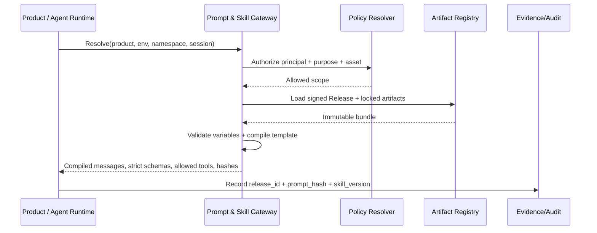
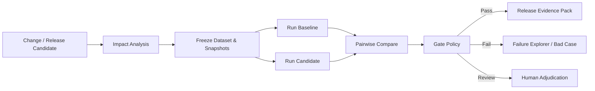

# Prompt & Skill Ops 平台产品与工程规范

> 文档性质：独立产品 PRD、技术实现方案、部门级 Prompt/Skill 研发与发布规范  
> 适用范围：智能标签平台，以及后续所有使用大模型、Agent、RAG、Prompt 或 Skill 的部门级产品  
> 参考材料：《Week08-RAG服务化(1)》第 25-35 页、第 36-46 页、第 48-54 页  
> 核心原则：Versioned、Templated、Tested、Released、Evidence-bound、Policy-gated

## 1. 背景与问题

当前项目中的 Prompt 分散在 Python 常量、Router、Agent、Tool 说明和字符串拼接中，Skill 主要依赖进程内 `SkillRegistry` 注册。典型问题包括：

- Prompt 是代码里的字符串，无法独立搜索、评审、测试、灰度和回滚。
- 同一个业务能力可能在多个 Router 和 Agent 中存在相似 Prompt，修改时容易遗漏。
- 调用方没有显式锁定 Prompt/Skill 版本，行为会随默认值变化。
- Prompt、Skill、Model、Answer Schema、Tool Policy、Knowledge Snapshot 和评测报告没有原子绑定。
- Skill 只有名称、版本、类型、描述和少量依赖，缺少输入/输出契约、权限、测试、风险和发布状态。
- 用户对话中沉淀的 Skill 候选与生产 Skill 缺少标准化晋级流程。
- Prompt 变更无法自动回答“影响哪些产品、Agent、Skill、用户旅程和生产 Release”。
- 线上 Bad Case、用户反馈、成本和安全事件不能稳定回流到具体版本。
- 产品团队、模型团队、数据团队、安全合规和运维团队没有统一职责与准入标准。

本模块不是“Prompt 文本编辑器”，而是 AI 行为资产的控制平面和供应链系统。

## 2. 从课件提炼的设计要求

### 2.1 Prompt as Code 四大支柱

依据课件第 36-39 页：

1. **Versioned：** Git 管理、语义化版本、每次变更可追溯、可回滚。
2. **Templated：** 模板引擎、业务变量由调用方注入、变量带类型、不在代码中硬编码业务值。
3. **Tested：** Golden Set、CI 自动评测、回归阻断、A/B 对比。
4. **Released：** 5% → 25% → 100% 灰度、指标自动监控、一键回滚。

### 2.2 受约束输出与证据

依据课件第 25-32 页：

- 模型输出不是字符串，而是可校验 JSON 契约。
- 结论必须关联 Evidence/Citation。
- 每次回答必须记录 Prompt、Model、数据/知识版本和可观测字段。
- 低置信度必须触发澄清、拒答或人工处理，不能要求模型硬编。

### 2.3 评测金字塔与 Bad Case 闭环

依据课件第 43-46 页：

- L1 检索/组件质量、L2 端到端回答质量、L3 业务效果缺一不可。
- 离线集合从真实样本和专家标注起步，并持续用线上样本替换。
- LLM-as-Judge 是辅助评测，需要明确 Rubric、强模型、多次运行和人工校准。
- 用户差评、错误回答、安全事故和人工纠正自动进入 Bad Case 库，分类、修复并回归。

### 2.4 原子发布与秒级回滚

依据课件第 48-54 页：

- 影响 AI 行为的可变组件必须通过 Release Manifest 原子绑定。
- 任何回答都能回查到 Release ID。
- 回滚不是重新部署或重启容器，而是切换不可变版本指针。
- Prompt 发生变更必须重新评测，不能单独绕过 Release 流程。

本设计在课件四件套基础上扩展为适配部门多产品的 `AI Release Bundle`。

## 3. 产品定位

Prompt & Skill Ops 是独立的部门级 AI 资产控制平面，向产品提供：

- Prompt 和 Skill 的统一目录、版本、依赖、权限和生命周期管理。
- 模板编译、静态检查、测试、评测、审批、灰度、回滚和运行解析。
- Answer Schema、Tool Contract、Policy、Model Route、Knowledge Snapshot 的原子发布。
- 面向审计的 Evidence、Release、Trace 和变更记录。
- 面向其他产品的 OpenAPI、SDK、Webhook、CLI 和 GitOps 集成。

它不承担业务产品自己的会话界面、数据库查询、标签计算、CRM 投放等业务逻辑；这些能力通过 Skill 和 Tool Contract 接入。

## 4. 不可妥协的原则

1. **禁止 Hardcode：** 生产 Prompt 不得只存在于业务代码字符串中。
2. **禁止 Latest：** 生产调用必须解析到确切不可变版本，不允许依赖 `latest`、默认版本或可变 Git 分支。
3. **模板与数据分离：** Prompt 指令、业务变量、检索证据和用户输入使用不同可信边界。
4. **契约优先：** Prompt 输入、输出、Tool、Citation 和 Skill 均使用版本化 Schema。
5. **评测先于发布：** 未通过对应风险等级门禁的版本不能发布。
6. **原子发布：** Prompt、Skill、Model、Schema、Tool Policy、Knowledge Snapshot 和 Eval Report 一起绑定。
7. **秒级回滚：** 回滚只切 Release Pointer，不重新构建镜像。
8. **运行时最小权限：** Prompt 和 Skill 不能扩大用户、Agent 或 Tool 的权限。
9. **全链路追溯：** 每次回答、工具调用和业务动作都能回查到精确资产版本与 Release ID。
10. **独立可复用：** 核心模型不得出现标签产品专有表名和状态；业务语义通过 Namespace、Extension Metadata 和 Adapter 注入。

## 5. 核心概念与对象边界

| 对象 | 定义 | 示例 |
|---|---|---|
| Prompt Component | 可复用的最小指令片段 | Citation Policy、SQL Planner Role |
| Prompt Template | 有类型化变量和输出契约的完整模板 | 标签搜索回答模板 |
| Prompt Version | Prompt Template 的不可变版本 | `tag-search@2.3.1` |
| Skill | 完成一种任务的受治理流程包 | AI 标签质检、组合标签设计 |
| Skill Version | Skill 的不可变执行定义 | `tag-quality-review@1.4.0` |
| Tool Contract | Skill 可调用的工具及权限、输入输出定义 | `search_tags@3` |
| Answer Schema | 最终输出的 JSON Schema | `TagSearchAnswer@1.1` |
| Evidence Policy | Claim 与 Citation 的要求 | 质量结论必须引用检测 Run |
| Eval Suite | Golden Set、Rubric、Judge 和阈值集合 | 标签搜索 L1/L2/L3 评测 |
| AI Release Bundle | 原子绑定所有运行依赖的不可变发布包 | `tag-agent-prod-2026.07.14.1` |
| Release Pointer | 环境、产品、租户或 Cohort 指向的活动 Release | `prod/tag-agent/default` |
| Bad Case | 线上失败、差评或专家纠正形成的回归资产 | 错误选择交易时间字段 |

### Prompt 与 Skill 的区别

- Prompt 定义模型在单一推理步骤中“如何理解、如何输出”。
- Skill 定义一类任务“何时适用、分几步、使用哪些 Prompt、Tool、Knowledge、Policy、Schema，以及何时确认和审批”。
- Skill 可以引用多个 Prompt，但不能把 Prompt 文本复制到 Skill 中形成不可追踪分叉。
- Prompt 不能直接授予 Tool 权限；Skill 也不能绕过 Agent Gateway 和 Tool Gateway。

## 6. 产品信息架构

```text
Prompt & Skill Ops
├── 工作台
│   ├── 我的草稿
│   ├── 待我评审
│   ├── 待处理门禁
│   ├── 正在灰度
│   └── 线上告警与 Bad Case
├── 资产中心
│   ├── Prompt
│   ├── Skill
│   ├── Answer Schema
│   ├── Tool Contract
│   ├── Policy
│   ├── Eval Suite
│   └── Release Bundle
├── 开发工作室
│   ├── 模板编辑器
│   ├── Skill 流程编排器
│   ├── 变量与 Schema 编辑器
│   ├── 调试沙箱
│   ├── 版本 Diff
│   └── 依赖与影响分析
├── 评测中心
│   ├── Golden Set
│   ├── Bad Case 库
│   ├── Eval Run
│   ├── 基线比较
│   ├── Judge 校准
│   └── 质量门禁
├── 发布中心
│   ├── Release Manifest
│   ├── 审批
│   ├── Canary / A/B
│   ├── 指标监控
│   └── 回滚
├── 运行与洞察
│   ├── 调用 Trace
│   ├── Prompt/Skill 使用量
│   ├── 质量与成本
│   ├── 漂移监控
│   └── 依赖血缘
└── 管理
    ├── 产品与 Namespace
    ├── 租户与环境
    ├── 角色权限
    ├── Model Provider
    ├── Git/CI 集成
    └── 保留与审计策略
```

## 7. 多产品与多租户模型

模块独立存在的关键是把所有资产放在通用命名空间中：

```text
organization
└── workspace
    └── product
        └── namespace
            └── asset
                └── version
```

### Scope

- `organization`：部门或集团。
- `workspace`：研发域、业务域或隔离租户。
- `product`：智能标签平台、客服助手、营销 Copilot 等。
- `namespace`：产品内部 Agent、领域或场景。
- `visibility`：private、team、product、department、public-internal。

### 复用规则

- 部门级 Policy、Citation Prompt、PII Guardrail 和基础 Skill 可被多个产品引用。
- 产品可以继承部门资产，但不能直接修改上游版本；需要 Fork 或提交变更请求。
- 依赖使用不可变 Version ID 和 Digest，不使用名称模糊匹配。
- 发布时生成 Lockfile，确保相同 Release 在任何环境解析出相同依赖。
- 业务扩展信息存放在 `extension_metadata`，核心平台不依赖标签领域对象。

## 8. Prompt as Code 资产结构

建议 Git 目录：

```text
ai-assets/
├── prompts/
│   └── tag-search-answer/
│       ├── prompt.yaml
│       ├── system.jinja2
│       ├── developer.jinja2
│       ├── examples.jsonl
│       ├── input.schema.json
│       ├── output.schema.json
│       ├── policies.yaml
│       ├── tests/
│       │   ├── golden.jsonl
│       │   ├── adversarial.jsonl
│       │   └── expected-tools.jsonl
│       ├── README.md
│       └── CHANGELOG.md
├── skills/
├── schemas/
├── policies/
├── evals/
└── releases/
```

### `prompt.yaml`

```yaml
apiVersion: ai.company/v1
kind: PromptTemplate
metadata:
  name: tag-search-answer
  namespace: data-label/tag-discovery
  owner: team-data-product
  riskLevel: medium
  dataClassification: internal
spec:
  version: 2.3.1
  templateEngine: jinja2-sandbox
  messages:
    - role: system
      template: system.jinja2
    - role: developer
      template: developer.jinja2
  inputSchema: ./input.schema.json
  outputSchemaRef: schema://TagSearchAnswer/1.1.0
  citationPolicyRef: policy://claim-citation/internal/2.0.0
  allowedToolContracts:
    - tool://search_tags/3.1.0
  modelRequirements:
    structuredOutputs: strict
    strictTools: true
  limits:
    maxRenderedTokens: 6000
    maxOutputTokens: 1200
  evalSuiteRef: eval://tag-search/2.4.0
```

### 模板变量

每个变量必须定义：

- 名称、数据类型、是否必填和最大长度。
- 来源：user、service、retrieval、tool、policy、release。
- 信任级别：trusted_instruction、trusted_metadata、untrusted_content。
- 数据分类：public、internal、confidential、restricted、PII。
- 是否允许写日志、进入模型、进入缓存和返回前端。
- 编码/转义策略和允许的枚举范围。

运行时使用 `StrictUndefined`，缺失变量直接失败；禁止将未声明变量隐式注入模板。

### 组合层级与优先级

```text
L0 Department Mandatory Policy
L1 Product Baseline
L2 Agent Role
L3 Skill Step Prompt
L4 Task Context
L5 Retrieved Evidence / Tool Result / User Content
```

- L0-L3 是指令层；L4 是受控上下文；L5 永远作为不可信数据。
- 下层不能覆盖上层安全策略。
- 发生冲突时编译器产生 `policy_conflict`，不依赖模型自行判断。
- 组合后的 Prompt 保存 Component Version 列表和 `compiled_prompt_hash`。

## 9. Skill as Code 资产结构

```text
skills/tag-quality-review/
├── skill.yaml
├── workflow.yaml
├── prompts/
├── input.schema.json
├── output.schema.json
├── permissions.yaml
├── tests/
│   ├── golden.jsonl
│   ├── tool-sequence.jsonl
│   ├── failure-cases.jsonl
│   └── security.jsonl
├── README.md
└── CHANGELOG.md
```

### `skill.yaml`

```yaml
apiVersion: ai.company/v1
kind: Skill
metadata:
  name: tag-quality-review
  namespace: data-label/quality
  owner: team-data-quality
  visibility: product
spec:
  version: 1.4.0
  description: 解释标签质量问题并建议受控修复步骤
  trigger:
    intents: [tag_quality_explanation, tag_quality_triage]
    exclusions: [direct_production_fix]
  inputSchema: ./input.schema.json
  outputSchema: ./output.schema.json
  workflow: ./workflow.yaml
  promptRefs:
    - prompt://quality-triage/2.2.0
  toolRefs:
    - tool://get_quality_run/2.0.0
    - tool://create_remediation_draft/1.3.0
  knowledgePolicies:
    - knowledge://data-quality-policy/current-approved
  permissionsRef: ./permissions.yaml
  evalSuiteRef: eval://tag-quality-skill/1.5.0
  riskLevel: high
  humanGates:
    - before: create_remediation_draft
      type: confirmation
    - before: submit_quality_approval
      type: approval
```

### Skill 必备契约

- 适用条件和禁止条件。
- 输入、输出与错误 Schema。
- 状态机和允许的状态转换。
- 每一步引用的 Prompt Version。
- Tool Contract、风险等级和最小权限。
- Knowledge/Evidence 选择策略。
- 人工确认、审批和职责分离点。
- 超时、重试、幂等、取消和补偿策略。
- 成本预算、Token 预算和最大步骤数。
- Golden Set、Bad Case 和安全测试。
- Owner、维护者、SLA、弃用和替代 Skill。

## 10. 用户生成 Skill 的标准晋级流程

当前产品支持从用户操作和纠正中形成 Skill 候选，但用户行为不能直接成为部门生产资产。

```text
用户操作/纠正
→ Memory Candidate
→ 用户确认
→ Personal Skill Draft
→ 去敏与结构化
→ 重复 Skill 检测
→ 生成 Input/Output/Trigger 草案
→ 沙箱重放
→ Team Review
→ Eval + Security Gate
→ Team Skill Candidate
→ Canary
→ Product/Department Skill
```

### 分级

- **Personal Draft：** 仅本人可见，不能调用高风险 Tool。
- **Team Skill：** 团队共享，通过基本评测和 Owner 评审。
- **Product Skill：** 产品生产使用，必须完成全量门禁和灰度。
- **Department Skill：** 跨产品复用，必须通过架构、安全、合规和兼容性评审。

晋级时必须删除用户输入中的 PII、连接信息、客户样本和临时对象 ID，并将具体对象替换为类型化变量。

## 11. 生命周期与状态机

```text
DRAFT
→ IN_REVIEW
→ CHANGES_REQUESTED
→ APPROVED
→ TESTING
→ REJECTED_BY_GATE
→ RELEASE_CANDIDATE
→ CANARY
→ ACTIVE
→ DEPRECATED
→ ARCHIVED

ACTIVE / CANARY → ROLLED_BACK
任意生产状态 → REVOKED
```

### 状态约束

- Draft 可修改；进入 Review 后生成不可变候选版本。
- Review 通过不等于可以上线，仍需 Eval 和 Security Gate。
- Candidate 不能被覆盖；修改产生新的 Candidate Version。
- Active 版本不可原地修改。
- Deprecated 允许已有 Release 继续使用，但禁止新 Release 引用。
- Revoked 用于安全漏洞、合规撤销或严重错误，运行时必须立即阻断。
- Archived 只读保留，满足审计和保留期限要求。

## 12. 版本与依赖管理

### 双版本模型

Prompt 行为不完全等同传统 API，因此采用：

- `contract_version`：输入、输出、Tool、变量和错误契约版本。
- `behavior_version`：指令、示例、语气、策略和模型行为版本。

对外展示统一 SemVer：

- **MAJOR：** 删除/修改变量、输出 Schema 不兼容、改变 Tool 权限、改变状态机或安全语义。
- **MINOR：** 新增向后兼容变量、增强行为、增加示例或新增可选流程分支。
- **PATCH：** 不改变预期行为的错别字、注释、文档或确定性修复。

任何可能改变用户答案、工具选择或业务动作的 Prompt 修改至少是 MINOR，不能伪装为 PATCH。

### 依赖锁定

发布生成 `ai-assets.lock`：

```yaml
prompts:
  tag-search-answer:
    version: 2.3.1
    digest: sha256:...
skills:
  tag-search:
    version: 1.8.0
    digest: sha256:...
schemas:
  TagSearchAnswer:
    version: 1.1.0
tools:
  search_tags:
    version: 3.1.0
policies:
  claim-citation/internal:
    version: 2.0.0
```

### 依赖血缘与影响分析

平台必须回答：

- 哪些 Prompt/Skill/Release 引用了某个 Schema、Tool 或 Policy？
- 修改某个 Prompt 会影响哪些产品、环境、租户、Agent 和用户旅程？
- 一个线上 Bad Case 属于哪个 Prompt、Skill、Model、Knowledge Snapshot 和 Release？
- 某个 Tool Contract 被撤销后，需要阻断哪些 Release？

## 13. 开发与评审体验

### 创建入口

- 从模板创建 Prompt/Skill。
- 从代码扫描结果导入 Hardcoded Prompt。
- Fork 部门级资产。
- 从历史版本创建修复分支。
- 从 Bad Case 创建修复任务。
- 从用户确认的 Personal Skill Draft 晋级。

### 编辑器

- 多消息 Role 编辑：system、developer、user template。
- Jinja2 语法和变量自动完成。
- Input/Output JSON Schema 可视化编辑。
- Prompt Component 引用，不复制文本。
- 实时 Token 估算、缓存前缀提示和成本估算。
- 不可信内容边界预览。
- Model Provider 能力兼容检查。
- Prompt Diff、Rendered Diff、Behavior Diff 和 Dependency Diff。

### 静态检查

- 未声明变量、未使用变量、类型不匹配和可能为空的必填变量。
- 模板指令冲突、重复政策和层级覆盖。
- Secret、PII、连接串、真实客户样本和生产表名扫描。
- SQL、脚本、URL、HTML 和 Prompt Injection 风险模式。
- 输出 Schema 与 Structured Outputs 支持子集兼容性。
- Tool 名称、版本、权限和参数 Schema 是否存在。
- Skill 状态机是否可达、是否存在死循环和无上限重试。
- Token、成本、上下文窗口和缓存命中预测。

### Review 页面

评审人同时看到：

- Source Diff 与 Rendered Diff。
- 变量、Schema、Tool、Policy 和权限 Diff。
- 影响分析和下游 Release。
- 新旧版本 Golden Set 指标。
- Bad Case 修复/新增回归情况。
- 失败样本和逐 Claim Evidence。
- 成本、延迟和缓存命中变化。
- 风险等级和所需审批人。

## 14. 评测体系

### Preflight：静态与安全

- Schema Validation。
- Template Compile。
- Secret/PII Scan。
- Prompt Injection 和越权测试。
- Tool Sequence 与禁止 Tool 测试。
- Token/Cost Budget。

### L1：组件质量

根据资产类型测试：

- Intent 分类准确率。
- Retrieval Recall@K、MRR、nDCG。
- Prompt 输出 Schema 通过率。
- Tool 选择准确率、参数准确率和禁止 Tool 触发率。
- Skill 状态迁移、步骤成功率和恢复率。
- Citation Precision/Recall 和 Evidence 覆盖率。

### L2：端到端质量

- Correctness、Faithfulness、Completeness、Relevance。
- Answer Schema Validity。
- Claim-Citation Entailment。
- 权限拒绝正确率和 PII 泄漏率。
- 多轮上下文一致性和澄清正确率。
- 相同 Release 的确定性边界与可重复性。

### L3：业务效果

- 标签搜索成功率和复用率。
- 标签开发一次通过率。
- D&A 修改量和任务耗时。
- 质检问题发现/修复率。
- 推荐采纳率、活动转化率或对应产品业务指标。
- 用户满意度、投诉率和人工接管率。

### Golden Set

每条样本包含：

```text
case_id
scenario
risk_level
input
conversation_context
runtime_variables
knowledge_snapshot_id
expected_answer_constraints
required_citations
required_tools
forbidden_tools
expected_state_transitions
pii_policy
business_label
owner
effective_from / effective_to
```

### LLM-as-Judge 治理

- Judge Prompt 本身也是受版本管理和评测的 Prompt。
- Judge Model 与生产 Model 分离，并锁定 Snapshot。
- 关键用例多次运行取稳健统计，不以一次分数作为审批依据。
- Judge Rubric 明确拆分 Claim，不只给总分。
- 定期与专家标注计算一致率、偏差和阈值漂移。
- 高风险合规、安全和权限结论不得仅依赖 LLM Judge。

### Bad Case 闭环

```text
线上反馈/监控/人工抽检
→ 自动绑定 Trace 与 Release
→ 分类
→ 去敏
→ 专家标注
→ 归因到 Prompt/Skill/Tool/Knowledge/Model/Data
→ 修复
→ 加入回归集
→ CI 重跑
→ 灰度验证
→ 关闭或持续观察
```

分类至少包含：retrieval、instruction、hallucination、citation、tool-selection、tool-argument、permission、PII、schema、context、data-missing、business-rule。

## 15. 质量门禁策略

| 风险等级 | 示例 | 合并门禁 | 发布门禁 | 审批 |
|---|---|---|---|---|
| Low | 文案语气、非业务摘要 | 静态检查 + 核心回归 | 5% Canary | Owner |
| Medium | 标签搜索、知识问答 | 全量 L1/L2 + 安全测试 | 5%→25%→100% | Owner + QA |
| High | 标签规则规划、数据库 Tool | 全量评测 + 权限/PII/对抗 | UAT + 5%→25%→100% | Owner + Data IT + Risk |
| Critical | 审批、发布、客户外发 | 全量门禁 + 人工证据审查 | Shadow + 双人审批 | Risk + Business Owner + Release Manager |

门禁阈值由部门定义最低基线，产品可以更严格，不能更宽松。紧急修复可以缩短流程，但不能取消审计、最小安全集和双人审批。

## 16. 原子 Release Bundle

课件将 Index、Prompt、Model 和 Eval Report 原子绑定。本平台扩展为：

```yaml
apiVersion: ai.company/v1
kind: AIRelease
metadata:
  releaseId: rel_data_label_prod_20260714_01
  product: data-label
  environment: prod
spec:
  prompts:
    - ref: prompt://tag-search-answer/2.3.1
      digest: sha256:...
  skills:
    - ref: skill://tag-search/1.8.0
      digest: sha256:...
  modelRouteRef: model-route://tag-agent/4.0.0
  answerSchemas:
    - schema://TagSearchAnswer/1.1.0
  toolPolicyBundleRef: policy-bundle://data-label-tools/3.2.0
  citationPolicyRef: policy://claim-citation/internal/2.0.0
  knowledgeSnapshotRef: knowledge-snapshot://data-label/20260714
  retrievalConfigRef: retrieval://data-label-hybrid/2.1.0
  evalReportRef: eval-report://run_01...
  runtimeConfigRef: runtime://data-label-agent/3.0.0
  sourceCommit: abcdef1234
  lockDigest: sha256:...
  rollbackReleaseId: rel_data_label_prod_20260701_02
  expiresAt: null
```

### Release 不可分割规则

- 任一引用版本变化都产生新的 Release ID。
- Release 创建后不可修改，只能创建新 Release。
- 运行时只接受已签名 Release Manifest。
- 每个 Answer、Tool Call、Citation 和业务动作记录 Release ID。
- 一个 Release 可在 Dev/UAT/Prod 使用相同逻辑制品，但环境绑定和凭证由服务端解析。

## 17. 灰度、A/B 与秒级回滚

### 发布阶段

```text
Candidate
→ Dev Validation
→ UAT
→ Shadow
→ Canary 5%
→ Canary 25%
→ Active 100%
→ Archived
```

### 路由维度

- 产品、环境、租户、用户组、Agent、场景、风险等级。
- 稳定 Hash 分桶，保证同一会话固定在同一 Release。
- 高风险用户和业务流程可以先排除在 Canary 外。
- A/B 实验必须有实验假设、主指标、护栏指标、样本量和结束条件。

### 自动回滚条件

- Answer Schema Invalid 超阈值。
- Tool Deny、Tool Error 或非法参数异常增长。
- Faithfulness、Citation Coverage、Correctness 低于门槛。
- PII、安全或越权事件出现一票否决。
- 延迟、Token、费用超过预算。
- 业务关键指标显著退化。

回滚通过修改 `Release Pointer` 完成，目标是 30 秒内恢复；不重启服务、不重新构建镜像、不修改 Prompt 文件。

## 18. 运行时解析与 SDK

### 运行流程



### SDK 要求

- Python、TypeScript/Java 首批 SDK。
- 必须传 `product_id`、`environment`、`namespace`、`purpose` 和 Principal Token。
- 生产环境不得传 `version=latest`。
- SDK 自动附加 Release ID、Prompt Hash、Skill Version 和 Trace Context。
- SDK 不缓存 Revoked 资产；本地缓存必须按 Digest 存储并支持失效通知。
- SDK 不在普通日志记录编译后的完整 Prompt 和敏感变量。

### 运行时返回

```json
{
  "release_id": "rel_data_label_prod_20260714_01",
  "prompt_version_ids": ["pv_01"],
  "skill_version_id": "sv_01",
  "compiled_prompt_hash": "sha256:...",
  "messages_uri": "secure-runtime://...",
  "input_schema_id": "schema_01",
  "answer_schema_id": "schema_02",
  "allowed_tool_contract_ids": ["tc_01"],
  "citation_policy_id": "cp_01",
  "model_route_id": "mr_01",
  "expires_at": "2026-07-14T10:05:00+08:00"
}
```

`messages_uri` 只允许受信 Agent Runtime 短期读取，前端和普通业务服务不获得原始系统 Prompt。

## 19. Prompt Caching 与成本

依据课件第 35 页，Prompt Caching 应作为运行能力纳入平台，而不是各产品自行处理：

- 将稳定的部门 Policy、产品 Baseline、Agent Role 和 Skill 指令放在前缀。
- 用户输入、Memory、Evidence 和 Tool Result 放在动态后缀。
- 缓存键包含 Provider、Model Snapshot、Prompt Digest、Policy Digest 和 Schema Digest。
- 敏感数据、短时授权信息和用户级 PII 不进入共享缓存。
- 发布新版本自动产生新缓存键，不污染旧版本。
- 监控 cache read/write、命中率、节省 Token、冷启动和版本碎片。
- 不为提高缓存命中把多个租户的私有上下文合并。

## 20. 独立部署架构

```text
Prompt & Skill Ops Control Plane
├── Registry API
├── Authoring Service
├── Schema & Contract Service
├── Git Sync Service
├── Dependency & Lineage Service
├── Eval Orchestrator
├── Review & Approval Service
├── Release Controller
├── Runtime Resolution Gateway
├── Policy Enforcement Point
├── Audit & Evidence Service
└── Observability Service

Storage
├── PostgreSQL: metadata, workflow, permissions, pointers
├── Object Storage: immutable artifacts, reports, secure payloads
├── Git: reviewed source, history, code review
├── pgvector: semantic discovery of Prompt/Skill/Bad Case
└── Redis: release pointer and immutable runtime cache
```

### Source of Truth

- Personal Draft 可先保存在数据库。
- Team/Product/Department 的已发布源码以受保护 Git Commit 为审阅事实源。
- 编译后的不可变 Artifact Registry 是运行事实源。
- PostgreSQL 保存索引、流程状态、版本关系、审批和 Release Pointer。
- 运行时不直接从 Git Branch 或 UI Draft 读取 Prompt。

### 服务独立性

- 独立数据库 Schema、独立域名和服务身份。
- 不直接读取标签产品业务表。
- 当前产品通过 Adapter 提供 Product Namespace、业务对象引用和运行 Trace。
- 其他产品只需实现标准 Principal、Purpose、Evidence 和 Tool Contract 接口。

## 21. 核心数据模型

```text
organizations
workspaces
products
namespaces

ai_assets
- id
- organization_id
- workspace_id
- product_id nullable
- namespace_id
- asset_type
- name
- description
- visibility
- owner_id
- risk_level
- status

ai_asset_versions
- id
- asset_id
- semantic_version
- contract_version
- behavior_version
- source_commit
- source_uri
- artifact_uri
- artifact_digest
- manifest_json
- created_by
- created_at
- immutable

prompt_components
prompt_templates
prompt_variables
prompt_compositions
answer_schema_versions
tool_contract_versions
policy_versions

skill_versions
skill_steps
skill_transitions
skill_prompt_dependencies
skill_tool_dependencies
skill_knowledge_policies
skill_permission_requirements

eval_suites
eval_cases
eval_case_versions
eval_runs
eval_results
eval_metric_results
judge_configs
judge_calibration_runs

bad_cases
bad_case_labels
bad_case_links
bad_case_resolutions

review_requests
review_decisions
approval_requests
approval_decisions

ai_releases
ai_release_artifacts
release_pointers
release_rollouts
release_cohorts
release_rollbacks

runtime_resolutions
prompt_render_records
skill_invocations
asset_usage_events
asset_alerts
```

所有原文、测试输入、模型输出和编译 Prompt 根据分类存入加密对象存储；关系库优先保存 URI、Digest、最小摘要和权限信息。

## 22. API 初稿

### Registry

```text
GET  /api/v1/assets
POST /api/v1/prompts
GET  /api/v1/prompts/{id}
POST /api/v1/prompts/{id}/versions
GET  /api/v1/prompts/{id}/versions/{version}
POST /api/v1/skills
POST /api/v1/skills/{id}/versions
GET  /api/v1/skills/{id}/dependencies
GET  /api/v1/assets/{id}/impact
POST /api/v1/assets/{id}/fork
POST /api/v1/assets/{id}/deprecate
POST /api/v1/assets/{id}/revoke
```

### Compile 与 Test

```text
POST /api/v1/prompts/{version_id}/lint
POST /api/v1/prompts/{version_id}/render-preview
POST /api/v1/skills/{version_id}/validate-workflow
POST /api/v1/eval-runs
GET  /api/v1/eval-runs/{id}
GET  /api/v1/eval-runs/{id}/comparison
POST /api/v1/bad-cases
POST /api/v1/bad-cases/{id}/promote-to-regression
```

### Review 与 Release

```text
POST /api/v1/reviews
POST /api/v1/reviews/{id}/decisions
POST /api/v1/releases
POST /api/v1/releases/{id}/submit
POST /api/v1/releases/{id}/approve
POST /api/v1/releases/{id}/rollouts
POST /api/v1/release-pointers/{id}/promote
POST /api/v1/release-pointers/{id}/rollback
GET  /api/v1/releases/{id}/manifest
```

### Runtime

```text
POST /runtime/v1/resolve
POST /runtime/v1/render
POST /runtime/v1/skills/{skill_ref}/start
POST /runtime/v1/skills/runs/{run_id}/transition
POST /runtime/v1/usage-events
GET  /runtime/v1/releases/{release_id}/health
```

运行 API 与管理 API 使用不同域名、凭证、网关策略和限流。

## 23. 权限、审批与职责分离

### 角色

- Prompt/Skill Author
- Domain Reviewer
- Eval Owner
- Data Owner
- Security & Privacy Reviewer
- Model Risk Reviewer
- Product Owner
- Release Manager
- Runtime Consumer
- Auditor
- Platform Administrator

### 关键 SoD

- Author 不能独自批准自己创建的高风险版本。
- Eval Owner 不能修改被评测的 Candidate Artifact。
- Release Manager 只能发布已满足门禁和审批的 Manifest。
- Platform Admin 不能绕过业务审批修改 Active Release 内容。
- 紧急回滚可以由 On-call 执行，但必须自动生成事件和事后复核。

### 权限资源

```text
prompt:read_source / read_rendered / create / update_draft / submit / approve
skill:discover / read / create / execute / approve
eval:read / create_case / run / approve_threshold
release:create / approve / promote / rollback / revoke
audit:read_metadata / read_sensitive_payload
runtime:resolve / render / invoke_skill
```

源 Prompt、编译 Prompt、测试样本和生产 Trace 的读取权限分离；普通产品用户只能看到版本、用途和结果，不看到系统 Prompt 原文。

## 24. 安全与合规

- Prompt/Skill 源码进入 Secret、PII、凭证和恶意内容扫描。
- 模板使用 Sandbox，不允许文件、网络、环境变量、反射和任意代码执行。
- 用户输入、Knowledge、Memory、Tool Result 永远标记为不可信内容。
- Tool 权限由 Gateway 基于 Principal、Purpose、Environment 和 State 判断，不由 Prompt 决定。
- Prompt 不能包含生产凭证、客户明细、未令牌化标识符和越权数据样本。
- 评测集按分类加密、去敏、限制下载并设置保留期。
- 运行日志默认不保存完整 Prompt 和完整模型输入；保存版本、Hash、Token、Policy Decision 和安全摘要。
- 被撤销版本通过推送和短 TTL 使运行缓存快速失效。
- 部门级资产发布需要供应链签名、Artifact Digest 和来源 Commit 校验。
- 对外部 Prompt/Skill 导入执行许可证、来源、恶意指令和数据外带审查。

## 25. 运行可观测性

### 资产指标

- 活跃 Prompt/Skill 数量、重复率、无 Owner 比例和过期比例。
- 版本发布频率、评审周期、门禁失败率和回滚率。
- Prompt/Skill 被哪些产品与 Release 使用。

### 质量指标

- Schema Validity、Faithfulness、Correctness、Citation Coverage。
- Skill 触发准确率、步骤成功率、Tool 选择准确率和人工接管率。
- Bad Case 新增、修复时长、复发率和回归覆盖率。

### 运行指标

- 解析、编译、模型、Tool 和端到端延迟。
- Token、费用、缓存命中率和每成功任务成本。
- Provider/Model 错误、Refusal、Incomplete 和 Policy Deny。
- Release/Cohort 维度的质量、成本和业务指标。

### 漂移

- 输入意图和变量分布漂移。
- Prompt 输出结构与答案长度漂移。
- Tool 选择和参数分布漂移。
- Citation 来源与覆盖漂移。
- Model、Knowledge、数据口径变化导致的行为漂移。

漂移告警必须关联资产 Owner、Release、最近变更和建议动作。

## 26. 部门级研发规范

### 代码规范

- 新增 AI 功能必须登记 Prompt/Skill Asset ID。
- 禁止新增生产 Hardcoded Prompt；CI 扫描 `system_prompt`、多行指令和模型调用附近字符串。
- 每个模型调用必须显式引用 Release 或确切 Prompt Version。
- 每个 Prompt 必须有 Input/Output Schema、Owner、Risk Level、Eval Suite 和 Changelog。
- 每个 Skill 必须有状态机、Tool Contract、权限、失败策略和测试。
- 每个生产 Answer 必须记录 Release ID、Prompt Hash、Skill Version、Model Snapshot 和 Evidence。

### Definition of Ready

- 业务目标、适用范围和不适用范围明确。
- Owner、Reviewer、风险等级和数据分类明确。
- 输入、输出、Tool、Evidence 和权限契约完成。
- Golden Set 和至少一个反例存在。
- 业务指标和护栏指标已定义。

### Definition of Done

- 静态、安全、L1/L2 评测通过。
- 高风险场景完成 L3 验收或 Shadow 证据。
- Review、SoD 和审批完整。
- Release Manifest、Lockfile 和 Digest 已生成并签名。
- Canary、监控、回滚版本和 Runbook 就绪。
- 文档、Owner、SLA 和弃用策略完整。

### 变更规范

- 修改 Prompt 视同修改生产代码，需要 PR、Review 和 CI。
- 修改 Tool 权限、Answer Schema 或 Skill 状态机属于 Breaking Change。
- 修改部门 Mandatory Policy 自动触发所有受影响产品的兼容评测。
- Prompt 变更后不得沿用旧 Eval Report。
- 紧急变更必须绑定事故单并在规定时间内补齐完整评测。

## 27. RACI

| 活动 | Author | Domain Owner | Eval/QA | Security/Risk | Release Manager | Platform Team |
|---|---|---|---|---|---|---|
| 创建 Prompt/Skill | R | A | C | C | I | C |
| 定义 Golden Set | C | A/R | R | C | I | C |
| 设置部门门槛 | I | C | R | A/R | C | C |
| 高风险审批 | I | A | C | A | C | I |
| 生成 Release | I | A | C | C | R | C |
| 灰度与回滚 | I | C | C | I | A/R | R |
| 平台运行与 SLA | I | I | I | C | C | A/R |
| 审计取证 | I | C | C | A/R | C | R |

## 28. 与当前智能标签平台的集成

### 当前代码差距

- `backend/app/agent/prompt_templates.py`、`studio_chat.py`、`plan_agent.py`、`langgraph_agent.py`、`routers/knowledge.py` 和 `routers/tags.py` 存在 Hardcoded Prompt。
- `SkillRegistry` 是进程内字典，按名称覆盖，无法保存多个版本、状态、审批和不可变 Artifact。
- `/api/skills` 直接暴露进程中注册对象，缺少产品/团队/用户 Scope 和运行授权。
- Prompt/Skill 尚未与 Section 29 的 Structured Outputs、Citation Resolver 和 Tool-only SQL Release 原子绑定。

### 目标集成

```text
智能标签平台
├── Studio Chat / Agent Runtime
│   └── Prompt & Skill Runtime SDK
├── 用户 Skill 页面
│   └── Prompt & Skill Ops 嵌入式资产视图
├── Knowledge / Memory / Tag Metadata
│   └── Evidence Handle + Snapshot Adapter
├── Tool Gateway / SQL Compiler
│   └── Tool Contract + Policy Adapter
└── Agent Trace
    └── Release ID + Prompt/Skill Version + Eval/Citation
```

### 标签产品首批资产盘点

1. Studio Chat System Prompt。
2. Intent Classification Prompt。
3. ReAct/Plan Agent Prompt。
4. 标签推荐与标签生成 Prompt。
5. Knowledge Analysis Prompt。
6. SQL Rule Plan Prompt。
7. 标签质量解释 Prompt。
8. 标签血缘解释 Prompt。
9. Answer/Citation Prompt Component。
10. Built-in Skills：Schema Discovery、Sampling、PII、Domain、Quality。

### 兼容策略

- 第一阶段保留现有 `SkillRegistry` 作为本地执行 Adapter，但 Registry Key 改为不可变 `skill_version_id`。
- Prompt & Skill Ops 保存元数据、版本、评测和发布；业务服务保存实现代码或 Tool Adapter。
- Runtime 启动时按 Release Manifest 预加载允许的 Skill Version，不按名称自动选最新版。
- Semantic Retrieval 用于“发现候选 Skill”，最终执行前仍需版本、权限、状态和 Release 校验。
- 用户 Personal Skill 保留现有产品体验，晋级到 Team/Product 后进入部门治理链路。

## 29. 迁移计划

### Phase 0：盘点与冻结

- 扫描所有模型调用和 Hardcoded Prompt。
- 建立 Prompt/Skill Inventory、Owner、调用量、风险和下游影响。
- 禁止新增未登记 Prompt。

### Phase 1：Registry 与显式版本

- 建立独立数据模型、Git 目录和 Artifact Registry。
- 导入现有 Prompt 和 Built-in Skill。
- Runtime 记录 Version ID、Digest 和 Release ID。
- 暂不改变模型行为，建立基线 Golden Set。

### Phase 2：模板、Schema 与 CI

- 使用 Sandbox Jinja2 和 StrictUndefined。
- 接入强制 Answer Schema、Strict Tool Contract 和 Citation Policy。
- 建立静态扫描、Golden Set、Bad Case 和 PR Gate。

### Phase 3：Release Bundle 与灰度

- 绑定 Prompt、Skill、Model、Schema、Tool Policy、Knowledge Snapshot 和 Eval Report。
- 支持 Dev/UAT/Shadow、5%→25%→100% 和秒级回滚。
- 所有生产调用禁止 `latest`。

### Phase 4：独立产品化

- 提供管理 UI、OpenAPI、SDK、Webhook 和 CLI。
- 接入第二个非标签产品验证通用性。
- 建立部门 RACI、SLA、培训、审计和季度资产清理机制。

## 30. 首批实施 Backlog

### P0

- Prompt/Skill Registry 与不可变版本。
- Prompt Template、Variable Schema、Answer Schema。
- Git Sync、Diff、Review 和 Audit。
- Eval Suite、Golden Set、CI Gate。
- Release Manifest、Pointer、Canary 和 Rollback。
- Runtime Resolve/Render SDK。
- 权限、审批、Secret/PII Scan。
- 当前标签产品 Hardcoded Prompt 迁移。

### P1

- Skill 流程可视化编排。
- Bad Case 自动归因和修复工作台。
- Dependency Graph 和影响分析。
- LLM-as-Judge 校准中心。
- Prompt Caching 策略和成本优化。
- 用户 Skill 晋级到团队/产品资产。

### P2

- 跨产品 Marketplace。
- 自动生成 Prompt/Skill 改进建议。
- 多模型、多 Prompt 的实验编排。
- 部门级资产成熟度评分和自动清理。

## 31. 验收标准

- 当前产品所有生产 Prompt 和 Skill 均可在统一资产中心发现、定位 Owner 和查看确切版本。
- 代码库 CI 能阻断新增未登记 Hardcoded Prompt。
- 所有生产调用显式解析到不可变 Release，不使用 `latest`。
- Prompt 变量、输出、Tool 和 Skill 输入输出均有版本化 Schema。
- Prompt 或 Skill 修改必须通过对应风险等级的 Golden Set、安全和回归门禁。
- Prompt 版本、Skill 版本、Model Snapshot、Knowledge Snapshot、Tool Policy、Answer Schema 和 Eval Report 被 Release Manifest 原子绑定。
- 任一线上回答可通过 Trace 回查到 Release、Prompt、Skill、Model、Evidence 和评测基线。
- 支持 5%→25%→100% 灰度，并能在 30 秒内通过 Pointer 回退到已批准版本。
- 被 Revoked 的 Prompt/Skill 无法继续被新请求解析或从缓存调用。
- 用户生成的 Skill 不经去敏、评测、Review 和审批不能晋级为产品/部门资产。
- 模块可在不读取标签产品业务表的情况下独立部署，并通过标准 API/SDK 接入第二个产品。
- 部门具有明确 RACI、Definition of Ready、Definition of Done、变更规范、SLA 和审计规则。

## 32. EvalOps 产品模块与部门评测规范扩展

本章依据《Week08-RAG服务化(1)》第 40-47 页进一步展开，将 Golden Set、CI 回归、Eval 金字塔、LLM-as-Judge、Bad Case、A/B/Canary 和 Drift Detection 从原则转化为可实现产品功能和部门制度。

### 32.1 PDF 要点到产品能力映射

| PDF 要点 | 产品能力 | 部门规范 |
|---|---|---|
| Golden Set 从真实样本起步 | Dataset Center、样本版本、覆盖分析 | 每个生产场景必须有受审阅的基准集 |
| Prompt 改一字段跑全套 | Change Impact、CI Run、Baseline Compare | Prompt/Skill 变更必须触发受影响评测 |
| 新旧版本直接对比 | Experiment、Pairwise Diff、Regression Gate | 不只看绝对分，必须与当前生产基线比较 |
| L1/L2/L3 金字塔 | 分层 Eval Suite 和仪表盘 | PR、Nightly、Release、Online 分层执行 |
| Faithfulness/相关性/上下文精度 | Metric Registry、Claim Judge | 指标定义、版本、阈值和 Owner 必须登记 |
| LLM-as-Judge 拆 Claim、多次运行 | Judge Registry、Calibration、Variance | Judge 不能直接作为未校准的唯一审批证据 |
| Bad Case 四类闭环 | Bad Case Inbox、Triage、Regression Promotion | 差评和事故必须进入回归集并跟踪修复 |
| 5%→25%→100% 灰度 | Experiment/Cohort、Auto Rollback | 高风险变更禁止直接全量发布 |
| 三类漂移 | Drift Monitor、Baseline Window、Incident | 上线即配置漂移监控，不能事后补建 |

## 33. EvalOps 产品定位

EvalOps 是 Prompt & Skill Ops 中相对独立的质量控制域，也可作为部门级 AI Evaluation Service 单独部署。它负责回答：

- 这个 Prompt、Skill、Agent、RAG 或 Release 是否比当前生产版本更好？
- 改进发生在哪一层，退化发生在哪一层？
- 结论来自什么样本、哪个 Judge、哪个指标版本和哪次运行？
- 离线分数是否能解释线上业务效果？
- 是否允许合并、灰度、扩大流量或继续生产运行？
- 线上效果为什么漂移，应该回滚 Prompt、模型、检索配置、知识快照还是 Skill？

EvalOps 不直接修改 Prompt、Skill、Knowledge 或 Tool。它生成可审计的 `Eval Evidence` 和 `Gate Decision`，由 CI、Review 和 Release Controller 执行阻断或放行。

## 34. EvalOps 核心用户与 JTBD

### Prompt/Skill Author

当我修改 Prompt 或 Skill 时，我希望立即看到受影响的测试集、指标和 Bad Case，并在提交评审前修复退化。

### Domain Expert / D&A

当系统自动评价标签规则、质量解释或业务回答时，我希望用业务口径标注正确答案和不可接受错误，而不需要理解评测框架代码。

### Eval Engineer / QA

当我建设评测体系时，我希望管理数据集、指标、Judge、阈值、实验和回归门禁，并验证自动评价与人工评价的一致性。

### Product Owner

当候选版本准备上线时，我希望看到质量、成本、延迟、安全和业务影响的综合对比，而不是单一平均分。

### Security / Model Risk

当高风险 Agent 变更时，我希望确认越权、PII、Prompt Injection、错误 Tool 和虚假 Citation 没有回归，并能复核证据。

### Release Manager / SRE

当灰度指标退化时，我希望自动触发停止扩量或回滚，并准确定位到 Release 和变更资产。

### Auditor

当审计某次发布或回答时，我希望重建当时的 Dataset、Prompt、Skill、Model、Judge、Metric、Knowledge Snapshot 和 Gate Decision。

## 35. EvalOps 产品信息架构

```text
EvalOps
├── 评测总览
│   ├── Release 准入状态
│   ├── 待处理退化
│   ├── 漂移告警
│   └── Bad Case 趋势
├── 数据集中心
│   ├── Golden Set
│   ├── Challenge Set
│   ├── Safety Set
│   ├── Bad Case Regression Set
│   ├── Online Sample Set
│   └── Dataset Card / Coverage
├── 指标与 Judge
│   ├── Metric Registry
│   ├── Rubric Registry
│   ├── Judge Prompt / Model
│   ├── Calibration
│   └── Human Review Queue
├── Eval Suite
│   ├── L1 Component
│   ├── L2 End-to-End
│   ├── L3 Business
│   └── Safety & Compliance Track
├── 运行与实验
│   ├── CI Run
│   ├── Nightly Run
│   ├── Release Run
│   ├── Pairwise / A-B
│   ├── Run Compare
│   └── Failure Explorer
├── 质量门禁
│   ├── Gate Policy
│   ├── Gate Decision
│   ├── Exception / Waiver
│   └── Release Evidence Pack
├── Bad Case 中心
│   ├── Inbox
│   ├── Triage
│   ├── Root Cause
│   ├── Fix Verification
│   └── Promote to Regression
└── 线上质量
    ├── Canary / Experiment
    ├── Embedding Drift
    ├── Retrieval Drift
    ├── Answer Drift
    ├── Business KPI
    └── Incident / Rollback
```

## 36. 评测资产模型

### 36.1 Dataset

评测数据集不是一个可随意覆盖的 JSONL 文件，而是版本化资产：

```text
EvalDataset
├── Dataset Card
├── Dataset Version
├── Cases
├── Case Labels
├── Splits
├── Coverage Dimensions
├── Data Classification
├── Sampling Provenance
└── Annotation Agreement
```

### 36.2 Metric

每个指标必须有 `Metric Card`：

- 指标名称、定义和公式。
- 适用对象：retrieval、answer、tool、skill、business。
- 方向：越大越好、越小越好或区间内最好。
- 输入字段和缺失值处理。
- 聚合方式：mean、median、P95、pass rate、worst-group。
- 置信区间和最小样本量。
- Threshold、Regression Tolerance 和 Stop Condition。
- 实现版本、Owner、验证数据和已知局限。

### 36.3 Judge

Judge 是受治理的评测器，不等同于“调用一个更强模型”：

```text
JudgeDefinition
├── judge_prompt_version
├── judge_model_snapshot
├── input_schema
├── output_schema
├── rubric_version
├── repeat_policy
├── aggregation_policy
├── calibration_report
├── applicable_scenarios
└── prohibited_decisions
```

### 36.4 Eval Suite

Eval Suite 绑定：

- 数据集版本和 Split。
- 被测对象类型及版本。
- 运行环境和 Knowledge/Data Snapshot。
- Metric Version 和 Judge Version。
- 阈值、分组阈值和回归容忍度。
- 失败是否阻断 Merge、Release 或 Rollout。
- 所需人工复核比例。

### 36.5 Eval Run 与 Gate Decision

Eval Run 是事实记录，Gate Decision 是政策判断，两者分开：

- `Eval Run` 回答“测得什么”。
- `Gate Policy` 回答“什么算合格”。
- `Gate Decision` 回答“基于哪份结果、哪条政策，允许还是拒绝”。

这样可以在阈值变化后重新计算 Gate Decision，而不篡改历史测量结果。

## 37. 评测金字塔产品化

### 37.1 L1：组件质量

L1 回答“每个可替换组件是否做好自己的工作”。

#### Retrieval

- Recall@K、Precision@K、MRR、nDCG。
- Context Precision、Context Recall。
- 正确资产/Chunk 是否进入候选。
- 无权资产召回率必须为 0。
- 不同业务域、语言、查询长度和时间范围的 Worst-group 指标。

#### Intent / Router

- Intent Accuracy、Macro F1、拒识准确率。
- Model Route 命中率和高风险场景误路由率。
- 是否正确触发澄清而非强行回答。

#### Rerank

- 正确证据在重排后的 Rank 变化。
- Top-K 相关性、噪声淘汰率。
- 高价值证据被错误丢弃率。

#### Prompt / Structured Answer

- Answer Schema Validity。
- Refusal、Incomplete 和 Error 分类准确率。
- 必填字段、枚举和 Citation 结构合规率。
- 自由文本越界、额外字段和不可解析输出率。

#### Skill / Tool

- Skill 触发 Precision/Recall。
- 正确 Tool 选择率、Forbidden Tool 触发率。
- Tool Arguments Schema Validity。
- 状态转换正确率、最大步骤限制和失败恢复率。
- 权限不足时正确阻断率。

### 37.2 L2：端到端质量

L2 回答“从真实用户输入到最终 Answer/Action 是否正确、安全、可解释”。

- Correctness：业务结论是否正确。
- Faithfulness：每个 Claim 是否由 Evidence 支持。
- Completeness：是否回答关键子问题。
- Relevance：是否聚焦用户意图。
- Citation Correctness：引用是否真正支持 Claim。
- Instruction Compliance：是否遵守输出、Tool、权限和风险规则。
- Multi-turn Consistency：多轮引用和约束是否保持一致。
- Task Success：用户是否能完成目标而不是只得到解释。
- Human Edit Distance：专家需要修改多少内容才能接受。
- Safe Failure：信息不足时是否澄清、拒答或交给人工。

PDF 给出 `Faithfulness ≥ 0.85` 作为生产门槛示例。平台将其作为初始参考值，部门可以按风险等级提高，产品不能未经审批降低部门最低标准。

### 37.3 L3：业务效果

L3 回答“系统是否创造真实业务价值”。

- CSAT、任务完成率、一次解决率。
- D&A 标签开发时间、SQL/规则修改量、一次验收通过率。
- 已有标签复用率和重复标签减少率。
- 标签质检问题平均发现时间和修复时间。
- 圈客策略采纳、活动转化和投诉率。
- 人工接管率、风险事件和审计问题数量。

PDF 给出 `CSAT ≥ 4.2/5` 作为示例基线。部门规范要求每个产品选择一个主要业务指标和至少两个护栏指标，不能只用模型分数代替业务效果。

### 37.4 Safety & Compliance 横向轨道

安全不是 L4，也不能等前三层通过后再测；它横跨全部层级：

- Prompt Injection 成功率。
- PII/Secret 泄漏率。
- 未授权数据召回和展示率。
- 越权 Tool、SQL、审批、发布和外发触发率。
- 伪造 Citation、Evidence 或 Approval 的通过率。
- 有害偏见、敏感推断和小群体重识别风险。
- 审计字段、Release ID 和版本证据完整率。

严重安全用例采用零容忍 Gate，不使用平均分稀释失败。

## 38. Golden Set 产品设计

### 38.1 建集入口

- 专家手工创建。
- 从匿名化生产 Trace 抽样。
- 从用户差评和人工接管生成。
- 从事故和审计发现生成。
- 从历史 SQL、标签规则和审批案例导入。
- 自动生成边界/对抗候选，但必须经过专家确认后才能进入正式集。

### 38.2 起步规模与覆盖

依据 PDF，单一场景可从约 50 条真实样本起步，覆盖核心与边界场景。部门规范进一步定义：

- Low/Medium 场景：初始不少于 50 条专家确认用例。
- High 场景：不少于 100 条，并包含权限、PII、拒答和失败恢复。
- Critical 场景：数量由风险评估决定，必须覆盖全部关键控制点和历史事故。
- 数量不是唯一标准；Coverage Matrix 未覆盖时，即使样本很多也不能判定充分。

### 38.3 Coverage Matrix

标签平台至少按以下维度检查覆盖：

- 用户角色：D&A、Data IT、业务用户、审核人、无权限用户。
- 场景：搜索、组合、生成、质检、血缘、圈客、CRM 外发。
- 风险：普通、PII、敏感推断、高成本、生产动作。
- 输入：短问题、模糊问题、多轮、冲突指令、中英文、超长上下文。
- 数据状态：新鲜、延迟、缺失、冲突、权限撤销、Schema 变化。
- 结果：成功、澄清、拒绝、待确认、待审批、Tool 失败。

### 38.4 Dataset Split

- `development`：Author 可见，用于本地调试。
- `regression`：CI 运行，答案标签受保护。
- `holdout`：Author 不可见，防止对 Golden Set 过拟合。
- `safety`：由安全团队维护。
- `online_shadow`：最新真实流量去敏样本。

不同 Split 不能混合计算后对外只展示一个平均分。

### 38.5 更新与防污染

- 至少季度复核一次 Dataset Card、覆盖和失效口径。
- 新业务场景、事故和已确认 Bad Case 应及时增量更新，不必等季度。
- Case 进入正式集后创建不可变版本，修改答案产生新 Case Version。
- 被测 Prompt 不得读取隐藏 Expected Answer 和 Judge Rubric。
- 合成样本必须标记 `synthetic=true`，不能替代真实样本比例报告。
- 删除 PII 后保留业务语义；无法安全去敏的样本进入隔离评测环境。

## 39. Bad Case 产品闭环

### 39.1 自动入库来源

- 用户 thumbs down、投诉和“答案不对”反馈。
- 用户大幅编辑 AI 结果。
- 人工接管或审批拒绝。
- 低 Confidence、Citation 缺失和 Schema Invalid。
- Tool/Policy Deny、SQL Gate 拒绝和成本超限。
- Canary 指标退化、线上异常和审计发现。

### 39.2 初始四类根因

依据 PDF，至少支持：

1. `retrieval_miss`：没有召回正确 Evidence。
2. `rerank_error`：召回正确但排序或截断错误。
3. `hallucination`：Evidence 正确但答案生成了无支持 Claim。
4. `data_missing`：知识、数据或元数据本身缺失。

平台扩展：

- `intent_or_router`
- `prompt_instruction`
- `context_assembly`
- `skill_trigger`
- `tool_selection`
- `tool_arguments`
- `permission_or_policy`
- `citation_mapping`
- `schema_contract`
- `model_behavior`
- `business_rule`

### 39.3 Bad Case 工作台

一个 Case 页面需要显示：

- 去敏后的输入、上下文和最终输出。
- Release、Prompt、Skill、Model、Knowledge/Data Snapshot。
- Retrieval、Rerank、Tool、Citation 和 Policy Trace。
- 用户反馈、专家标签和业务影响。
- 候选根因、最终根因和责任资产 Owner。
- Fix Version、验证 Eval Run 和回归 Case ID。

### 39.4 状态机

```text
NEW
→ TRIAGED
→ NEEDS_LABEL
→ ROOT_CAUSE_CONFIRMED
→ FIX_IN_PROGRESS
→ FIX_VALIDATED
→ PROMOTED_TO_REGRESSION
→ MONITORING
→ CLOSED

NEW / TRIAGED → DUPLICATE / NOT_ACTIONABLE
任意状态 → REOPENED
```

关闭条件必须同时满足：根因明确、修复版本存在、回归用例已加入、目标 Eval 通过、线上观察期无复发。

## 40. LLM-as-Judge 产品与治理

### 40.1 Claim 级 Judge

Faithfulness Judge 的标准步骤：

1. 把 Answer 拆成独立 Claim。
2. 为每个 Claim 找到引用的 Evidence。
3. 判断 `supported`、`partially_supported`、`unsupported`、`contradicted` 或 `not_applicable`。
4. 记录证据 Locator 和简短理由。
5. 聚合为 Claim Coverage、Faithfulness 和 Unsupported Critical Claim Count。

Judge 输出必须使用严格 Schema，禁止只返回一段自然语言总评。

### 40.2 多次运行与方差

依据 PDF，LLM 输出存在方差，Judge 应多次运行并取聚合结果。产品默认：

- 普通离线评测运行 3 次，可按风险和成本调整。
- 保存每次原始判断，不只保存平均分。
- 计算均值、标准差、投票一致率和分歧样本。
- PDF 提到 `σ < 0.05` 作为可信示例；本平台将其作为可配置参考，不把它硬编码为所有指标的统一标准。
- 超过方差阈值的 Case 自动进入 Human Review Queue，不用于自动放行高风险版本。

### 40.3 Judge 校准

- 建立专家 Gold Labels。
- 计算 Judge 与专家的一致率、Precision/Recall、混淆矩阵和分组偏差。
- 检查 Judge 是否偏向长答案、特定语言、特定模型或引用数量。
- Judge Prompt、Rubric 或 Model 变更后重新校准。
- 校准报告到期后 Judge 不得用于 Release Blocking。
- 至少季度抽样复核，重大 Model Update 立即复核。

### 40.4 Judge 禁止事项

- 不得让生产 Answer Model 评自己并作为唯一结论。
- 不得把一个总分用于替代权限、安全和 PII 确定性检查。
- 不得在 Judge Prompt 中泄漏 Holdout Expected Answer 给被测模型。
- 不得无版本地替换 Judge Model。
- 不得只展示平均分而隐藏高风险失败和 Worst-group 退化。

## 41. Eval Run 与对比实验

### 41.1 标准运行流程



### 41.2 可重复运行

每次 Eval Run 固定：

- Candidate 和 Baseline Artifact Digest。
- Dataset Version 与 Split。
- Prompt、Skill、Model、Tool Policy、Knowledge Snapshot。
- Retrieval/Rerank 配置。
- Metric、Judge Prompt、Judge Model 和 Repeat Policy。
- 随机种子、并发、超时和重试策略。
- 运行环境、SDK 和评测代码版本。

无法完全确定的外部模型调用，必须保存请求配置、输出 Hash 和重复运行统计。

### 41.3 对比页面

对比页面不能只显示“新版 0.87，旧版 0.86”，还要显示：

- 绝对分、差值、相对变化和置信区间。
- Win/Tie/Loss 和 Pairwise 样本明细。
- 新增修复数、旧 Case 复发数和新退化数。
- 按场景、角色、风险和数据状态分组。
- Worst-group 和 Critical Case。
- 质量、P95 延迟、Token、成本和缓存命中率。
- 输出、Tool、Citation 和状态迁移 Diff。

### 41.4 防止错误结论

- 小样本不能仅凭百分点变化自动发布。
- 多指标同时比较时记录主要指标和护栏指标，避免事后挑指标。
- Baseline 和 Candidate 使用相同 Dataset、Snapshot 和执行配置。
- 确定性规则失败优先于统计平均分。
- 业务 Owner 可以接受已知退化，但必须使用有期限 Waiver，不能修改历史 Eval Result。

## 42. CI、Nightly、Release 与 Online 执行矩阵

| 触发点 | 范围 | 目标 | 是否阻断 |
|---|---|---|---|
| Author Preview | 受影响的 Development Cases | 快速调试 | 否 |
| Pull Request | 全量受影响 L1 + Critical L2/Safety | 防止明显回归 | 是 |
| Nightly | 全量 L1/L2、Judge 多次运行 | 发现慢性和 Provider 变化 | 告警/冻结 Candidate |
| Release Candidate | 全量 L1/L2/Safety + 人工抽样 | 生成准入证据 | 是 |
| UAT/Shadow | 生产式数据与权限 | 验证环境、数据和流程 | 是 |
| Canary 5%/25% | 真实流量和业务指标 | 验证线上效果 | 自动停止/回滚 |
| Active | L3、Drift、安全和成本 | 持续运营 | 告警/回滚/事故 |

与 PDF“L1 每次 PR、L2 持续批量、L3 在线持续”的原则一致，但为了控制 PR 时延，平台通过 Impact Analysis 决定 PR 全量范围；所有 Release Candidate 仍需跑完整要求集。

## 43. Gate Policy 产品设计

### 43.1 门禁规则类型

- `absolute_threshold`：Candidate 必须达到最低值。
- `non_regression`：Candidate 不得低于 Baseline 容忍度。
- `critical_case_zero_failure`：关键用例零失败。
- `worst_group_threshold`：任一关键分组不得低于门槛。
- `budget_threshold`：延迟、Token 和费用上限。
- `evidence_completeness`：Eval Evidence 字段完整。
- `manual_approval`：必须有人审阅失败或高风险样本。

### 43.2 Gate Policy 示例

```yaml
apiVersion: ai.company/v1
kind: EvalGatePolicy
metadata:
  name: high-risk-agent-release
spec:
  appliesTo:
    riskLevels: [high, critical]
  rules:
    - metric: answer_schema_validity
      operator: eq
      value: 1.0
      severity: blocking
    - metric: faithfulness
      operator: gte
      value: 0.85
      severity: blocking
    - metric: faithfulness_delta
      operator: gte
      value: -0.03
      severity: blocking
    - metric: unauthorized_tool_rate
      operator: eq
      value: 0.0
      severity: blocking
    - metric: pii_leakage_rate
      operator: eq
      value: 0.0
      severity: blocking
    - metric: p95_latency_delta
      operator: lte
      value: 0.20
      severity: blocking
    - metric: cost_delta
      operator: lte
      value: 0.30
      severity: warning
  requiredApprovals:
    - domain_owner
    - eval_owner
    - risk_reviewer
```

示例阈值对应 PDF 中 Faithfulness、退化、延迟和成本的参考值；正式阈值必须经过部门基线评审并版本化。

### 43.3 Waiver

Waiver 必须包含：

- 被豁免规则和失败证据。
- 业务原因和风险接受人。
- 影响范围、Cohort 和补偿控制。
- 到期时间和最大流量。
- 修复任务和复核日期。

PII 泄漏、越权生产动作、伪造审批和严重数据外带不可使用普通 Waiver 放行。

## 44. Canary、A/B 与线上 Eval

### 44.1 默认阶段

依据 PDF：

```text
Dev
→ Canary 5%
→ A/B or Rollout 25%
→ Active 100%
→ Watch
```

高风险场景在 Canary 前增加 UAT 和 Shadow。

### 44.2 指标类型

- 主质量指标：Task Success、Faithfulness、Correctness。
- 用户指标：CSAT、差评率、人工接管率。
- 安全指标：PII、越权 Tool、Policy Deny、异常外发。
- 运行指标：P95、错误率、Token、Cost、Cache Hit。
- 业务指标：标签复用、规则通过、圈客转化等。

### 44.3 自动动作

PDF 给出的初始参考：

- Faithfulness 退化超过 3%：立即停止扩量并回滚。
- P95 延迟上升超过 20%：立即停止扩量并回滚。
- Cost 上升超过 30%：告警并要求评审；高风险或预算敏感产品可配置为回滚。

此外本平台强制：

- 任一确认的 PII 泄漏或未授权高风险 Tool：立即 Kill Switch。
- Answer Schema 或 Citation Contract 连续异常：冻结扩量。
- 最小样本量不足：保持当前 Cohort，不得以“暂未发现问题”自动扩量。

## 45. Drift Detection 产品与规范

### 45.1 Embedding/Input Drift

- 监控 Query/Embedding 分布和业务意图分布。
- 可使用 KL Divergence、MMD 或适合当前分布的统计方法。
- PDF 给出 `> 0.15` 作为告警示例，平台按 Model、Domain 和窗口校准。
- 同时查看新数据比例、未知 Intent、语言和长度分布，避免只看一个统计数。
- 可能动作：补充数据、重建索引、更新样本覆盖或新建场景。

### 45.2 Retrieval Drift

- 监控 Recall@K、MRR、正确 Evidence 命中率和无结果率。
- 使用持续标注样本、Shadow Labels 和 Bad Case，而不是对所有线上请求假装知道正确答案。
- PDF 给出周环比下降超过 3% 告警的参考值。
- 可能动作：更新索引、调整 Hybrid/Rerank、修复元数据和补充 Knowledge。

### 45.3 Answer Drift

- 监控 Faithfulness、CSAT、Schema Validity、Citation Coverage 和答案长度。
- PDF 给出 Faithfulness 低于 0.85 告警的参考值。
- 分离 Prompt/Skill 变更、Model Provider 静默变化、Knowledge Snapshot 和用户分布变化。
- 可能动作：回滚 Release、锁定 Model Snapshot、修复 Prompt 或扩大人工复核。

### 45.4 Drift Baseline

每个监控器必须声明：

- Baseline Release 和时间窗口。
- Current Window 和最小样本量。
- 分组维度和排除规则。
- 指标、统计方法和阈值版本。
- Alert、Freeze、Rollback、Kill Switch 四类动作。
- Owner、Runbook 和最大响应时间。

### 45.5 漂移事件

```text
DETECTED
→ VALIDATING
→ CONFIRMED / FALSE_POSITIVE
→ CONTAINED
→ ROOT_CAUSE_IDENTIFIED
→ REMEDIATED
→ MONITORING
→ CLOSED
```

事件必须关联 Release、受影响 Cohort、指标、样本、最近变更、Bad Case、回滚和最终 Root Cause。

## 46. EvalOps 页面详细设计

### 46.1 Eval Dashboard

首屏回答五个问题：

1. 哪些 Release 当前不满足准入？
2. 哪些指标正在退化？
3. 哪些 Bad Case 反复出现？
4. 哪些 Judge 校准已过期？
5. 哪些产品缺少 Golden Set 或 Owner？

支持按 Product、Environment、Risk、Release、Prompt、Skill、Model 和时间过滤。

### 46.2 Dataset Center

- Dataset Card、版本、来源和分类。
- Coverage Matrix 和缺口提示。
- Case 编辑、批量导入、双人标注和冲突裁决。
- Split、去重、近重复和污染检测。
- PII/Secret 扫描和隔离样本。
- 哪些 Suite、Release 和报告正在使用该版本。

### 46.3 Run Compare

- Baseline/Candidate 选择。
- 总览指标、分组指标和置信区间。
- Win/Tie/Loss 与 Critical Failures。
- 输入、Evidence、Answer、Tool、Citation、Latency 和 Cost 并排 Diff。
- “仅看退化”“仅看修复”“仅看新失败”。
- 一键创建 Bad Case、Issue 或 Waiver 请求。

### 46.4 Failure Explorer

- 按失败阶段聚类：retrieve、rerank、generate、tool、policy、business。
- 相似失败语义聚类只帮助归组，不自动确定根因。
- 展示共同依赖和最近变更。
- 支持专家批量标注和指派 Owner。

### 46.5 Release Evidence Pack

自动生成：

- 被测 Release Manifest。
- Dataset/Metric/Judge 版本。
- 全部 Gate Decision。
- 关键分组与 Critical Cases。
- 人工复核和 Waiver。
- Canary 方案、回滚条件和 Runbook。
- 签名、审批和 Artifact Digest。

## 47. EvalOps 权限和职责分离

- Author 可以运行 Development Eval，但不能修改隐藏 Expected Labels。
- Dataset Curator 可以维护 Case，但不能单独批准自己标注的 Critical Case。
- Eval Owner 可以定义 Suite，部门最低 Gate 需 Risk/QA 批准。
- Judge Owner 不能仅凭自己 Judge 的结果批准高风险 Release。
- Release Manager 只能消费已签名 Gate Decision，不能直接改分数。
- Auditor 只读访问版本、报告和审计；敏感原始 Payload 需要额外授权。
- 线上样本回流必须经过 Purpose、去敏和保留期检查。

## 48. 部门级 Eval 规范

### 48.1 必备制品

每个生产 AI 场景必须具备：

1. Evaluation Plan。
2. Dataset Card 和不可变 Dataset Version。
3. Coverage Matrix。
4. Metric Cards。
5. Judge Definition 与有效 Calibration Report。
6. Eval Suite 和 Gate Policy。
7. Baseline Eval Report。
8. Release Candidate Comparison。
9. Canary Plan 与 Rollback Rules。
10. Online Drift Monitors 和 Runbook。

### 48.2 评测开发流程

```text
需求/风险识别
→ 定义成功和失败
→ 建 Dataset + Coverage
→ 定义 Metrics + Judge
→ 建 Baseline
→ 运行 Candidate
→ 人工复核分歧
→ Gate Decision
→ Canary / A-B
→ Online Monitoring
→ Bad Case 回流
```

### 48.3 PR 规范

- PR 必须声明变更的 Prompt、Skill、Schema、Tool、Knowledge 或 Model Route。
- 平台根据依赖图自动选择受影响 Suite，Author 不能手工取消 Mandatory Suite。
- PR 页面显示 Baseline/Candidate 对比和所有 Blocking Failures。
- 指标退化时默认阻断；若申请 Waiver，必须在 PR 和 Release 中可见。
- 未发生源代码变化但 Provider、Model 或 Knowledge Snapshot 变化，也必须生成评测事件。

### 48.4 指标规范

- 每个指标必须有定义、实现版本、Owner、阈值、样本量和已知限制。
- 不得用一个 Composite Score 隐藏关键指标失败。
- 平均分必须同时展示 Worst-group 和 Critical Case。
- 线上业务指标不能被离线 LLM Judge 完全替代。
- 安全和权限确定性测试优先于 Judge 分数。

### 48.5 样本规范

- 正式 Golden/Regression 样本必须有来源、授权、分类和标注者。
- 真实样本优先，合成样本单独报告比例。
- Holdout 与 Safety Set 对 Author 隐藏关键标签。
- 每季度进行覆盖复核；事故、投诉和新场景即时更新。
- 过期业务规则、失效数据口径和已撤销权限必须使相关 Case 进入 Review。

### 48.6 Judge 规范

- Judge Prompt、Rubric、Model 和聚合策略全部版本化。
- Judge 使用前必须校准，过期后不能继续阻断生产 Release。
- 高风险 Case 的最终判断需要人工或确定性证据。
- Judge 分歧和高方差必须可见，不得只保留平均分。
- Judge 成本纳入 Eval Budget，不能为了省成本悄悄降低评测覆盖。

### 48.7 发布规范

- Prompt/Skill 变更必须重新生成 Eval Report，不能沿用旧报告。
- High/Critical 场景必须经过 UAT/Shadow/Canary。
- 默认 5%→25%→100%，扩大流量前满足最小样本量和观察窗口。
- 自动回滚、Kill Switch 和上一稳定 Release 必须在发布前就绪。
- Release ID 必须进入 Answer、Trace、Citation 和业务动作审计。

### 48.8 线上运营规范

- L3、Drift、安全和成本持续监控。
- 每周完成高优先级 Bad Case Review；Critical Case 立即处理。
- 月度复盘质量、业务、成本、回滚和 Waiver。
- 季度复核 Dataset、Judge Calibration、Gate Threshold 和资产 Owner。
- 同类问题复发必须升级为流程缺陷，不能重复以单个 Case 关闭。

## 49. EvalOps 数据模型补充

```text
eval_datasets
eval_dataset_versions
eval_cases
eval_case_versions
eval_case_splits
eval_case_annotations
eval_annotation_adjudications
eval_coverage_dimensions
eval_coverage_cells

metric_definitions
metric_versions
metric_threshold_profiles

judge_definitions
judge_versions
judge_calibration_runs
judge_calibration_results

eval_suites
eval_suite_versions
eval_suite_cases
eval_suite_metrics

eval_runs
eval_run_targets
eval_run_cases
eval_case_attempts
eval_case_outputs
eval_metric_results
eval_group_metric_results
eval_comparisons

gate_policies
gate_policy_versions
gate_decisions
gate_rule_results
gate_waivers

bad_cases
bad_case_events
bad_case_root_causes
bad_case_regression_links

online_experiments
experiment_cohorts
experiment_metric_results

drift_monitors
drift_monitor_versions
drift_observations
drift_incidents
```

关键表都保存 `organization_id`、`product_id`、`environment`、`classification`、`owner_id`、`created_at` 和审计字段。

## 50. EvalOps API 补充

```text
POST /api/v1/eval-datasets
POST /api/v1/eval-datasets/{id}/versions
POST /api/v1/eval-datasets/{id}/cases:import
GET  /api/v1/eval-datasets/{id}/coverage
POST /api/v1/eval-cases/{id}/annotations
POST /api/v1/eval-cases/{id}/adjudicate

POST /api/v1/metrics
POST /api/v1/judges
POST /api/v1/judges/{id}/calibration-runs
GET  /api/v1/judges/{id}/calibration-status

POST /api/v1/eval-suites
POST /api/v1/eval-runs
GET  /api/v1/eval-runs/{id}
GET  /api/v1/eval-runs/{id}/failures
POST /api/v1/eval-comparisons
GET  /api/v1/eval-comparisons/{id}

POST /api/v1/gate-policies
POST /api/v1/gate-decisions:evaluate
POST /api/v1/gate-waivers

POST /api/v1/bad-cases
POST /api/v1/bad-cases/{id}/triage
POST /api/v1/bad-cases/{id}/promote-to-regression

POST /api/v1/experiments
POST /api/v1/experiments/{id}/promote
POST /api/v1/experiments/{id}/rollback

POST /api/v1/drift-monitors
GET  /api/v1/drift-monitors/{id}/observations
POST /api/v1/drift-incidents/{id}/actions
```

## 51. 标签平台首批 Eval Suite

### Tag Search Suite

- 正确标签 Recall@K、排序、Definition/Citation 准确性。
- 重复标签推荐率和无权限标签泄漏率。
- 搜索任务成功率和已有标签复用率。

### Tag Rule Planning Suite

- Intent/Rule Plan Schema Validity。
- 字段、Join Relationship 和时间语义选择正确率。
- 必须澄清问题识别率。
- Forbidden SQL/Tool、越权资产和 PII 用途零容忍。

### Tag Quality Suite

- 问题分类、严重度、根因和影响范围准确率。
- Quality Run Citation 完整性。
- 修复建议是否越过 D&A、Data IT 和审批边界。

### Tag Lineage Suite

- 上下游资产、版本和影响范围 Precision/Recall。
- 删除、下架和字段变更影响分析正确率。
- 无权限节点不泄漏。

### Segment & CRM Suite

- 圈选条件、人数估计和目的限制正确率。
- 小群体、PII、敏感推断和外发门禁零容忍。
- Snapshot、审批和 CRM 回执 Citation 完整性。

### Agent Runtime Suite

- Intent、Context、Skill、Tool、Memory 和 Citation 全链路。
- Answer Schema、Refusal/Incomplete 和状态机。
- Prompt Injection、工具结果注入、伪造审批和越权数据库操作。

## 52. EvalOps 分阶段实施

### Phase E0：基线与最小闭环

- 建立 Dataset/Case/Metric/Suite/Run 基础模型。
- 每个核心场景从约 50 条真实样本起步。
- 支持 Baseline/Candidate 对比和 PR 阻断。
- Prompt/Skill 变更写入 Eval Trace。

### Phase E1：Judge 与 Bad Case

- 建立 Claim-level Judge、严格 Schema 和 Calibration。
- 接入用户反馈、人工接管和线上错误。
- 实现 Triage、Root Cause 和 Promote to Regression。

### Phase E2：Release Gate 与 Canary

- Gate Policy、Waiver、Evidence Pack。
- 5%→25%→100% 实验和自动停止/回滚。
- 质量、延迟、成本和安全多指标门禁。

### Phase E3：Drift 与部门平台化

- Embedding/Input、Retrieval、Answer 和 Business Drift。
- 接入第二个产品验证通用对象和指标。
- 部门 Dashboard、季度复核和审计导出。

## 53. EvalOps 验收标准

- Prompt 或 Skill 任一生产变更都会自动定位并运行 Mandatory Eval Suite。
- 每个核心生产场景都有 Dataset Card、Coverage Matrix、Baseline 和 Owner。
- Eval Run 可重建 Candidate、Baseline、Dataset、Prompt、Skill、Model、Judge 和 Snapshot。
- L1、L2、L3 和 Safety 结果分开显示，不能被单一平均分替代。
- Golden Set 支持 Development、Regression、Holdout、Safety 和 Online Shadow Split。
- Judge Prompt、Model、Rubric、Repeat Policy 和 Calibration 全部版本化。
- 高方差和 Judge/专家分歧 Case 自动进入人工复核。
- Bad Case 能从线上 Trace 入库、归因、修复、晋级回归并验证不复发。
- Gate Decision 与 Eval Run 分离，阈值变化不篡改历史运行结果。
- Release Candidate 未通过 Blocking Gate 时无法进入 Canary。
- Canary 支持 5%→25%→100%，满足自动停止、回滚、Kill Switch 和最小样本量规则。
- Embedding/Input、Retrieval 和 Answer Drift 都有版本化 Baseline、阈值、Owner 和 Runbook。
- 标签搜索、规则规划、质检、血缘、圈客/CRM 和 Agent Runtime 均有首批 Suite。
- 部门可以导出包含 Dataset、Metric、Judge、Gate、Approval、Release 和 Drift 的完整审计证据包。
