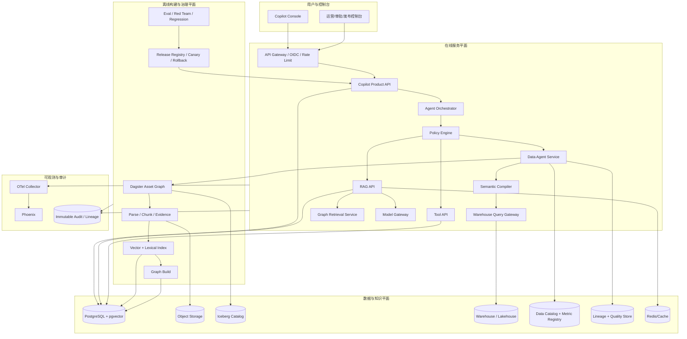
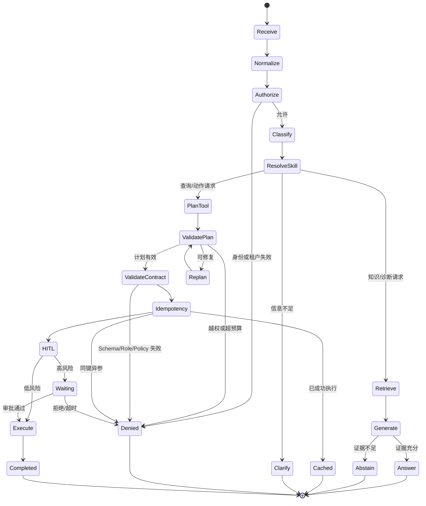
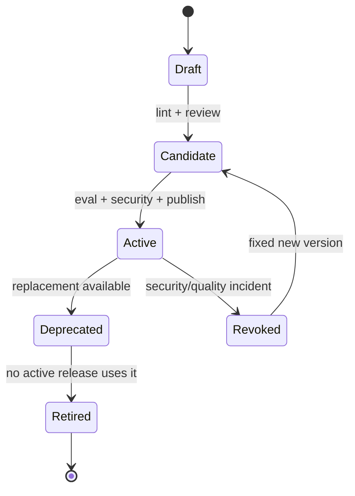
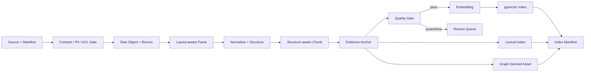
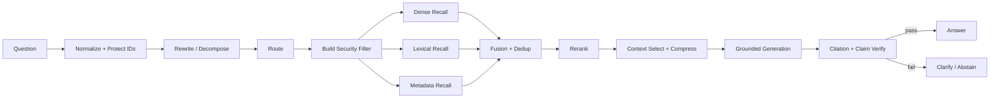
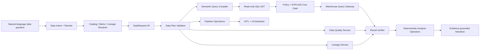

# OmniSupport Copilot Data Agent + RAG 完整设计方案

> 版本：v2.0  
> 日期：2026-08-11  
> 文档类型：目标系统详细设计  
> 定位：企业级 Data Agent、Skill、RAG、GraphRAG 与治理发布的一体化实施蓝图

# 第一部分：目标系统详细设计

## 1. 结论与设计原则

OmniSupport Copilot 不应被设计成“聊天框 + 大模型”，而应是客服坐席的证据与动作控制面：

1. **回答受证据约束**：先检索、后生成；证据不足时拒答，引用必须能回到原始资产。
2. **动作受代码约束**：模型可以提出意图，不能绕过 Tool Contract、权限、幂等和 HITL。
3. **数据是版本化产品**：原始数据、结构化资产、索引、Prompt、模型、Skill、图谱共同组成发布单元。
4. **质量可量化**：离线评测、线上 SLI/SLO、业务结果和安全红线共同决定是否发布。
5. **全链路可追责**：每个回答和动作都绑定 `trace_id`、证据、版本、审批与血缘。
6. **GraphRAG 只做补位**：事实问答默认走混合检索；跨文档关系、全局归纳和多跳问题才进入图路径。
7. **能力按风险分级**：读操作、低风险写操作和高风险写操作采用不同的策略、审批和恢复机制。

目标系统应实现两个闭环：

- **在线闭环**：业务/数据问题 → 意图与 Rewrite → Data/RAG/Tool → 分析/引用/审批 → 审计与反馈。
- **离线闭环**：数据变更 → 语义层/质量/解析/索引/图谱 → 评测 → 灰度 → 发布/回滚 → Bad Case 回灌。

## 2. 需求与边界

### 2.1 产品目标

- 面向 Northstar Systems 客服坐席、数据分析师、数据工程师、审批人和运营管理员。
- 核心形态是受治理 Data Agent：支持数据发现、指标查询、趋势/拆分/对比、异常解释、质量与血缘诊断以及受控回填。
- 同时支持文档问答、故障定位、跨文档归纳和工单查询/创建/更新。
- 支持 PDF、HTML、图片、音频、视频等多模态知识资产。
- 所有答案携带证据；所有写动作可审批、可恢复、可追责。
- 数据、索引和 AI 组件可以按统一版本灰度与原子回滚。

### 2.2 非目标

- 不构建无限自主、可任意规划和调用外部系统的 Agent。
- 不让 LLM 直接生成 SQL、直接更新工单或决定权限。
- 不用 GraphRAG 替代全部向量/关键词检索。
- 不允许无版本的 Prompt、模型、Skill、索引或图谱直接进入运行环境。
- 不允许用“模型自行判断”替代认证、授权、审批、事务和审计。

### 2.3 关键角色

| 角色 | 主要能力 | 强制约束 |
|---|---|---|
| 客服坐席 `agent` | 查工单、问知识、加内部备注、提交高风险动作 | 只能访问所属租户和授权产品线 |
| 审批人 `admin` | 审批/拒绝高风险动作、查看运营与审计 | 不能审批自己发起的生产高风险请求 |
| 运营 `support_ops` | 查询注册指标、查看质量与 SLO | 不允许提交任意 SQL；组织范围由服务端解析 |
| 数据分析师 `data_analyst` | 数据发现、受控分析、导出和分析提案 | 只读 Query Gateway；敏感数据和大导出受限 |
| 数据工程师 `data_engineer` | 质量/血缘诊断、回填计划、数据变更提案 | 生产执行需 HITL；不能绕过契约和资产检查 |
| AI 工程师 | 构建模型、Prompt、Skill、RAG/图谱和评测版本 | 无权绕过发布门禁直接切生产指针 |
| 发布审批人 | 四眼审批、灰度决策、回滚 | 创建人和审批人必须分离 |

## 3. 目标总体架构



架构按四种职责解耦：

- **产品控制面**负责身份、会话、租户、用户反馈和 UI 所需聚合。
- **AI 决策面**负责意图、RAG/Tool 路由、计划和策略判断，但不直接持久化外部副作用。
- **数据知识面**负责 Catalog、Metric/Semantic Layer、受控查询、质量、血缘、可复现数据、证据、索引和图谱。
- **治理面**负责评测、观测、审计、发布和回滚。

## 4. Agent 详细设计

### 4.1 Agent 组件边界

Agent 采用“模型负责理解与提议，控制面负责决定与执行”的分层结构。一个请求在运行时经过以下组件：

| 组件 | 职责 | 禁止事项 |
|---|---|---|
| Request Normalizer | 生成 request/trace ID，绑定用户、租户、语言、会话和当前发布版本 | 不改变用户意图 |
| Intent Classifier | 识别问答、诊断、查询、写动作、审批、闲聊等意图并给出置信度 | 不直接调用工具 |
| Context Builder | 读取工单、会话摘要、用户授权范围和短期记忆 | 不加载无关或越权数据 |
| Skill Resolver | 按意图和能力声明选择候选 Skill，渐进加载说明与资源 | 不把 Skill 当作权限凭证 |
| Planner | 生成有上限的步骤计划或单步工具提议 | 不生成任意代码、SQL 或未注册工具 |
| Policy Engine | 校验身份、角色、资源范围、风险、预算、HITL 和版本 | 不接受模型覆盖策略 |
| Tool Gateway | 加载 Tool Contract、校验参数、幂等、超时、重试、熔断和执行 | 不接收浏览器直接调用写工具 |
| RAG Gateway | 执行受权限约束的知识检索和引用生成 | 不允许模型自造 evidence |
| Checkpoint Store | 持久化运行状态、审批请求、步骤输出和恢复条件 | 不保存明文 Secret |
| Response Composer | 组织答案、动作结果、引用、审批状态和下一步建议 | 不隐藏降级或失败状态 |
| Audit/Lineage | 记录版本、决策、证据、工具、审批和结果摘要 | 不记录不必要的敏感正文 |

### 4.2 运行上下文模型

每次 Agent Run 创建不可变的 `RunContext`，后续步骤只能追加状态，不允许静默覆盖身份和版本字段：

```json
{
  "run_id": "run_...",
  "request_id": "req_...",
  "trace_id": "trace_...",
  "tenant_id": "tenant_...",
  "actor": {
    "user_id": "user_...",
    "roles": ["agent"],
    "org_ids": ["org_..."],
    "product_scopes": ["workspace"],
    "visibility_scopes": ["public", "internal"]
  },
  "conversation_id": "conv_...",
  "ticket_id": "TKT-...",
  "release": {
    "release_id": "release_...",
    "prompt_release_id": "prompt_...",
    "model_release_id": "model_...",
    "skill_release_id": "skills_...",
    "tool_release_id": "tools_...",
    "metric_registry_version": "metrics_...",
    "semantic_model_version": "semantic_...",
    "data_release_id": "data_...",
    "index_release_id": "index_...",
    "graph_release_id": "graph_..."
  },
  "budgets": {
    "max_steps": 6,
    "max_tool_calls": 4,
    "max_llm_calls": 5,
    "max_input_tokens": 24000,
    "max_output_tokens": 3000,
    "deadline_ms": 15000,
    "max_cost_usd": 0.10,
    "max_scan_bytes": 1000000000,
    "max_result_rows": 1000
  }
}
```

`RunContext` 在入口处根据可信身份和 Release Pointer 生成。客户端只能提供业务输入，不能指定角色、租户、模型、工具版本或数据版本。

### 4.3 Agent 状态机



所有状态变化都写入 `agent_run_event`。等待审批、外部异步任务或用户补充信息时必须持久化 checkpoint，进程重启后通过 `run_id + checkpoint_version` 恢复。

### 4.4 单次请求的逐步实现

#### 步骤 1：接收与标准化

1. API Gateway 完成 OIDC token 验证、限流和请求体大小检查。
2. Product API 生成 `request_id`、`trace_id` 和 `run_id`。
3. 服务端解析 tenant、role、org、product 和 visibility scope。
4. 读取当前环境 Release Pointer，一次性锁定所有运行组件版本。
5. 对输入执行 Unicode 规范化、长度限制、语言识别、明显 Secret/PII 检测。
6. 保存原始用户消息；后续模型调用使用经过最小化处理的工作副本。

#### 步骤 2：构建业务上下文

1. 如果请求绑定工单，按 tenant + ticket ID 查询工单摘要、状态、产品、错误码和最近事件。
2. 从会话存储读取最近 N 轮；更早内容只读取经过验证的会话摘要。
3. 按用户作用域裁剪上下文，任何跨租户或不可见记录直接在查询层排除。
4. 计算 context fingerprint，写入 audit，避免保存完整敏感上下文。

#### 步骤 3：意图识别

采用“确定性规则优先、模型分类补充、低置信度澄清”的三级策略：

1. 错误码、工单 ID、显式动作词等高确定性模式先由规则识别。
2. 其余输入由分类模型输出 `{intent, confidence, entities, missing_fields}`。
3. 意图必须属于版本化 allowlist；置信度低于阈值或多个高风险意图冲突时进入澄清。
4. 分类结果不决定权限，只决定后续候选路径。

完整意图采用第 4.5 节的分层 taxonomy；入口不允许动态创造 taxonomy 外的意图。

#### 步骤 4：Skill 解析

Skill Resolver 先只读取注册表中的名称、描述、触发条件、能力标签和权限声明，按以下顺序筛选：

1. `status=active` 且版本属于当前 `skill_release_id`。
2. `tenant/product/role` 与运行上下文匹配。
3. Skill 声明的 required tools 均存在于当前 Tool Release。
4. 意图、实体类型和场景标签匹配。
5. 按精确匹配、优先级、历史成功率和成本排序。
6. 最多选择一个主 Skill 和两个辅助 Skill；冲突时由确定性优先级解决。
7. 选定后才加载完整 `SKILL.md`、必要 references、模板和脚本清单。

#### 步骤 5：计划生成

计划器根据风险采用三种模式：

| 模式 | 场景 | 实现方式 |
|---|---|---|
| Direct | 单次知识问答、单个只读工具 | 固定工作流，不调用规划模型 |
| Template Plan | 标准故障排查、指标查询、工单更新 | Skill 中的步骤模板填参 |
| Bounded Dynamic Plan | 多证据诊断、需要 2-4 个只读/受控工具协作 | 模型生成结构化 DAG，随后确定性校验 |

计划对象只能包含注册步骤类型：`retrieve`、`call_tool`、`transform`、`ask_user`、`request_approval`、`compose_answer`。示例：

```json
{
  "goal": "诊断工单中的 E-204 错误并建议处理步骤",
  "steps": [
    {"id": "s1", "type": "call_tool", "name": "get_ticket", "depends_on": []},
    {"id": "s2", "type": "retrieve", "name": "knowledge_search", "depends_on": ["s1"]},
    {"id": "s3", "type": "compose_answer", "depends_on": ["s1", "s2"]}
  ],
  "stop_conditions": ["evidence_insufficient", "budget_exhausted"]
}
```

#### 步骤 6：计划校验

Plan Validator 不调用模型，逐项检查：

- DAG 无环、依赖存在、步骤数和调用数不超预算。
- 工具和 Skill 版本存在且未撤销。
- 每个步骤的角色、tenant、资源范围和数据分类满足策略。
- 写步骤不能并行执行；高风险写步骤前必须存在审批节点。
- 计划不包含任意代码、SQL、URL 或未注册副作用。
- 预计 token、延迟和成本不超预算。

可修复的 schema/缺参错误只允许 replan 一次；越权、版本撤销和预算红线直接终止。

#### 步骤 7：执行循环

执行器按拓扑顺序运行 ready steps：

1. 为每个步骤创建 child span 和 `step_execution_id`。
2. 在执行前再次读取资源状态并执行 Policy Check，避免计划后权限或工单状态变化。
3. 只读且互不依赖的步骤可以并发；共享 rate limit 和总预算。
4. 步骤输出必须通过 output schema，随后写入 checkpoint；后续步骤只引用结构化字段。
5. 模型只能看到完成当前步骤所需的最小输出，不自动继承所有历史工具响应。
6. 每步结束重新计算剩余时间、token、成本和调用次数。
7. 达到 stop condition 时停止，不为了“完成计划”继续调用。

#### 步骤 8：结果验证与响应

1. 对知识答案执行 evidence coverage 和 citation 校验。
2. 对工具结果执行状态、资源版本和业务后置条件校验。
3. 对外响应明确区分 `answered`、`completed`、`awaiting_approval`、`clarification_required`、`abstained` 和 `failed`。
4. 返回下一步建议，但不把“建议”伪装成已执行动作。
5. 写入 run summary、audit、lineage、反馈入口和最终预算消耗。

核心编排伪代码：

```python
async def run_agent(user_input, trusted_principal):
    context = create_run_context(user_input, trusted_principal, active_release())
    await checkpoint(context, state="received")

    business_context = await load_authorized_context(context)
    intent = await classify_with_safe_fallback(user_input, business_context)
    skills = await resolve_skills(intent, context)
    plan = await build_bounded_plan(intent, skills, business_context, context.budgets)
    validated_plan = validate_plan(plan, context)

    for step in topological_steps(validated_plan):
        enforce_remaining_budget(context)
        decision = policy_engine.evaluate(context, step)
        if decision.is_denied:
            return finish_denied(context, decision)
        if decision.requires_approval:
            return await persist_approval_checkpoint(context, step, decision)

        result = await execute_with_contract(step, context, decision.obligations)
        validate_step_output(step, result)
        await checkpoint(context, step=step, result=result)

        if should_stop(context, result):
            break

    response = await compose_and_verify_response(context)
    return await finish_run(context, response)
```

任何异常都先转换为已定义失败类别并写 checkpoint/audit；不能因为模型或工具抛异常而跳过 run 终态更新。

### 4.5 意图识别详细实现

#### 4.5.1 分层意图体系

意图采用三层 taxonomy，避免一个扁平标签同时承担业务、风险和执行方式：

```text
Domain Intent
├── knowledge
│   ├── factual_qa / procedure_qa / troubleshoot / compare_documents
├── support
│   ├── ticket_read / ticket_create / ticket_update / approval_review
├── data
│   ├── metric_query / dimensional_breakdown / trend_analysis
│   ├── comparison / contribution_analysis / anomaly_explain
│   ├── data_quality_check / lineage_analysis / pipeline_operation
│   └── backfill_request / data_change_request
└── conversation
    ├── clarify / explain_previous / summarize / unsupported
```

每次分类同时产生三个正交字段：

- `intent`：用户想完成的业务目标。
- `operation_kind`：`read / analyze / write / execute / approve`。
- `risk_level`：`low / medium / high / critical`。

这样“查看回填状态”和“发起回填”不会因为都包含“回填”而进入同一路径。

#### 4.5.2 特征提取

分类前由确定性 Feature Extractor 生成：

| 特征 | 示例 | 用途 |
|---|---|---|
| Action verbs | 查询、对比、解释、创建、更新、回填、删除 | 区分 read/analyze/write |
| Data nouns | 指标、维度、表、字段、血缘、分区、任务 | 识别 Data Agent 意图 |
| Identifiers | 工单 ID、错误码、表名、资产 key、run ID | 精确路由和标识保护 |
| Time expression | 最近 7 天、同比、截至昨天 | 构建时间窗口和比较基线 |
| Aggregation | 平均、总数、占比、Top 10、分组 | 数据查询 IR |
| Risk phrase | 执行、重跑、发布、回滚、全量 | 风险升级和 HITL |
| Conversation reference | 它、上一个、同样条件、换成上海 | 会话补全和 rewrite |
| Negation/constraint | 不包含、只看、除了、不要执行 | 防止重写改变语义 |

Feature Extractor 不决定最终意图，但其 exact terms、否定词、数值和时间约束进入 protected set，后续模型不得修改。

#### 4.5.3 规则候选层

规则只处理高精度场景：

1. 显式 `run_id/asset_key/backfill/重跑` + 执行动词 → `pipeline_operation/backfill_request`。
2. 指标注册表命中 + 时间/维度词 → `metric_query` 或 `dimensional_breakdown`。
3. “为什么异常/下降/激增” + 指标 → `anomaly_explain`。
4. “来源/下游/影响哪些” + 表/字段/指标 → `lineage_analysis`。
5. “检查空值/重复/延迟/新鲜度” → `data_quality_check`。
6. 写动作词存在但对象或范围缺失 → 不推断对象，标记 `missing_slots` 并澄清。

规则输出多个带分数候选而非直接执行：`[{intent, score, matched_rules, extracted_slots}]`。

#### 4.5.4 模型分类层

分类模型接收最小化文本、规则候选、当前会话目标和允许的 intent schema，使用 temperature=0 的结构化输出：

```json
{
  "primary_intent": "dimensional_breakdown",
  "secondary_intents": ["comparison"],
  "operation_kind": "analyze",
  "risk_level": "low",
  "confidence": 0.92,
  "entities": {
    "metrics": ["sla_breach_rate"],
    "dimensions": ["product_line"],
    "time_range": {"kind": "relative", "value": "last_30_days"},
    "comparison": "previous_period"
  },
  "missing_slots": [],
  "ambiguities": [],
  "reason_codes": ["metric_alias_match", "breakdown_phrase"]
}
```

模型不能输出 taxonomy 外标签。实体值必须来自用户文本、会话中已确认事实或 Catalog/Metric Registry 的候选，不允许凭空创造表、字段和指标。

#### 4.5.5 融合与置信度校准

最终分数不直接采用模型自报：

```text
intent_score = 0.35*rule_score
             + 0.35*classifier_calibrated_probability
             + 0.15*entity_coverage
             + 0.10*conversation_consistency
             + 0.05*catalog_match
             - ambiguity_penalty
             - risk_conflict_penalty
```

分类器概率使用 held-out 数据做 temperature scaling/isotonic calibration。决策建议：

- `score >= 0.85` 且 top1-top2 ≥ 0.20：直接进入后续解析。
- `0.65 <= score < 0.85`：允许只读探索；写/执行意图仍必须澄清。
- `score < 0.65` 或 top1-top2 < 0.10：提出一个最小澄清问题。
- 任何 write/execute/approve 候选与 read 候选冲突：按高风险处理并要求用户确认。

阈值由意图级评测校准，不使用一个全局固定阈值覆盖所有类别。

实现伪代码：

```python
async def recognize_intent(text, conversation, principal, release):
    features = extract_protected_features(text, conversation)
    rule_candidates = rule_engine.match(features, release.intent_rules)
    allowed_taxonomy = taxonomy.for_principal(principal)

    model_result = await classifier.complete_json(
        text=redact_for_model(text),
        features=features.safe_view(),
        candidates=rule_candidates,
        schema=allowed_taxonomy.output_schema,
    )
    validated = validate_entities_against_catalog(model_result, principal)
    fused = calibrator.fuse(rule_candidates, validated, conversation)

    if fused.has_read_write_conflict or fused.high_risk_below_threshold:
        return IntentResult.clarify(build_minimal_question(fused))
    if fused.score < threshold_for(fused.intent):
        return IntentResult.clarify(build_minimal_question(fused))
    return fused
```

#### 4.5.6 多意图与对话承接

“查过去一周 SLA 违约率，按产品拆分，并把异常产品建工单”拆为有依赖的子目标：

1. `metric_query`；
2. `dimensional_breakdown`；
3. `anomaly_detection`；
4. `ticket_create`（写动作，独立 Policy/HITL）。

对话中的“换成最近 90 天”“只看 Workspace”“把这个导出”先解析为 patch，不重新生成全新意图：

```json
{"base_request_id": "drq_...", "patch": {"time_range": "last_90_days", "filters.product_line": ["workspace"]}}
```

Patch 应用后重新执行 scope、成本和权限校验。

#### 4.5.7 意图识别评测

按意图分别报告 precision、recall、F1、top-2 accuracy、calibration error、clarification rate、high-risk false-negative 和跨租户/注入测试。安全门禁重点不是总体准确率，而是：写意图识别召回率、read→write 错路由为零、未知意图正确拒绝、Data Agent 指标/维度/时间槽位准确率。

### 4.6 Agent Rewrite 详细流程

Agent Rewrite 的目标不是“润色用户问题”，而是将自然语言转换成语义等价、可验证的 `CanonicalRequest`。它位于意图识别之后、Skill/Plan 之前，与 RAG Query Rewrite 分离。

#### 4.6.1 Rewrite 分层

1. **Normalization Rewrite**：控制字符、空白、语言、日期格式和单位规范化。
2. **Reference Resolution Rewrite**：把“它、上次、这个指标”解析为已确认对象。
3. **Domain Rewrite**：把业务别名映射到 Metric/Asset/Tool Registry 的 canonical ID。
4. **Constraint Rewrite**：把“最近一个月、同比、Top 5、只看 P1”转换成结构化约束。
5. **Goal Rewrite**：将复合句拆成有依赖的子目标。
6. **Plan Rewrite**：计划校验或步骤失败后，在不扩大目标和权限的前提下修改剩余计划。

#### 4.6.2 CanonicalRequest

```json
{
  "request_id": "crq_...",
  "original_text_digest": "sha256:...",
  "intent": "dimensional_breakdown",
  "operation_kind": "analyze",
  "goal": "比较最近30天各产品线的SLA违约率与前一周期",
  "objects": {
    "metrics": ["sla_breach_rate"],
    "assets": [],
    "tools": []
  },
  "constraints": {
    "time_range": {"start": "...", "end": "...", "timezone": "Asia/Shanghai"},
    "comparison": "previous_period",
    "dimensions": ["product_line"],
    "filters": {},
    "order_by": [{"field": "metric_value", "direction": "desc"}],
    "limit": 20
  },
  "protected_terms": ["sla_breach_rate", "30天", "同比"],
  "assumptions": [],
  "missing_slots": [],
  "rewrite_version": "agent_rewrite_v1"
}
```

#### 4.6.3 Rewrite 执行算法

1. 从原文本提取 protected terms：ID、数值、时间、单位、否定词、比较词、显式范围。
2. 读取 Catalog/Metric/Tool Registry 候选，只向模型提供用户有权看到的名称与别名。
3. 先执行确定性日期/单位/别名解析，生成 baseline request。
4. 仅对歧义、代词和复合目标调用 rewrite model，输出 JSON Patch 而不是整段自由文本。
5. 将 patch 应用于 baseline，随后进行 schema、protected term、权限、时间范围、语义和成本校验。
6. 计算 original vs canonical semantic diff；任何 scope expansion、write escalation、数字/否定变化直接拒绝 patch。
7. 可自动修复一次 schema 错误；第二次失败回退 baseline 或要求澄清。
8. 保存 rewrite reason、changed fields、validator results 和版本，不保存不必要的原始敏感内容。

实现伪代码：

```python
async def rewrite_request(text, intent, context):
    protected = extract_protected_terms(text)
    catalog = await authorized_catalog_candidates(text, intent, context.actor)
    baseline = deterministic_rewrite(text, intent, catalog, context.timezone)

    if not baseline.has_ambiguity and not baseline.has_compound_goal:
        return validate_canonical_request(baseline, protected, context)

    patch = await rewrite_model.complete_json_patch(
        baseline=baseline.safe_view(),
        ambiguities=baseline.ambiguities,
        catalog=catalog,
    )
    candidate = apply_allowed_patch(baseline, patch)
    validate_no_scope_or_risk_expansion(baseline, candidate)
    validate_protected_terms(protected, candidate)
    return validate_canonical_request(candidate, protected, context)
```

#### 4.6.4 Data Request Rewrite 特殊规则

- “上月”必须结合 tenant timezone 和自然月定义，不能简单减 30 天。
- “同比/环比”必须生成显式 baseline range 和对齐 grain。
- “平均值”必须绑定注册 metric 的 aggregation/weight，不能直接 `avg(avg_value)`。
- “用户数/客户数/工单数”必须解析 grain 和去重键。
- “截至目前”要记录 query execution time 和 data freshness cutoff。
- “Top N”必须有排序指标；没有则澄清。
- 指标别名多义时返回候选定义和 owner，不凭模型选择。
- 表/字段名只能从已授权 Catalog 解析，禁止把用户输入直接当 SQL identifier。

#### 4.6.5 Plan Rewrite 与失败恢复

计划只在以下场景重写：缺少可补充参数、只读依赖超时且存在等价 fallback、结果为空需调整合法检索策略、估算成本超限需缩小范围。流程为：

```text
failure event
  -> classify retriable/rewriteable/fatal
  -> freeze completed side effects
  -> build remaining-plan snapshot
  -> generate constrained JSON Patch
  -> validate no goal/scope/risk expansion
  -> increment plan_revision
  -> checkpoint
  -> resume remaining steps
```

禁止在 Policy deny、权限不足、审批拒绝、工具 revoked、幂等冲突或数据合规失败后通过 rewrite 绕路。每个 Run 最多一次 model-driven plan rewrite；继续失败则人工接管。

#### 4.6.6 Rewrite 评测

评测 protected-term preservation、slot exact match、date-range correctness、negation preservation、scope expansion rate、write escalation rate、catalog grounding、semantic equivalence 和 downstream task success。`scope_expansion`、`read_to_write_escalation`、`invented_metric/table/tool` 必须为零。

### 4.7 决策职责

| 环节 | 可以由模型完成 | 必须由确定性代码完成 |
|---|---|---|
| 意图理解 | 候选意图、参数草案、澄清问题 | 意图 allowlist、风险等级、路由阈值 |
| 工具选择 | 从已授权工具中提出候选 | 角色/租户/资源权限、工具版本锁定 |
| 参数生成 | 结构化草案 | JSON Schema、业务规则、字段范围校验 |
| 写动作 | 解释原因、生成操作摘要 | 幂等、事务、HITL、审批分离、执行、补偿和状态验证 |
| 回答 | 基于上下文组织自然语言 | Evidence allowlist、citation、敏感信息过滤、拒答 |

### 4.8 Tool Registry 与 Tool Contract

Tool Registry 是所有可执行能力的唯一目录。工具注册采用 `namespace/name@semver`，同一 Tool Release 中一个逻辑名称只能解析到一个不可变版本。

Tool Contract 最小字段：

- `name`、`version`、`description`。
- `input_schema`、`output_schema`、`failure_codes`。
- `allowed_roles`、租户/资源作用域、数据分类。
- `idempotency`：key 字段、TTL、相同 key 异参冲突规则。
- `risk_level`、`hitl_conditions`、审批角色、超时和拒绝语义。
- `timeout_ms`、`retry_policy`、`fallback_policy`、熔断策略。
- `audit_fields`、`lineage_bindings`、`release_id`。

注册流程：提交 Contract → schema lint → 权限/风险审查 → contract tests → sandbox 集成测试 → 签名 → 注册 candidate → 绑定 Tool Release → 灰度 → active。撤销工具时将版本标为 `revoked`，所有新运行拒绝解析；正在等待审批的运行恢复时也必须重新检查撤销状态。

### 4.9 Policy Engine

Policy Engine 输入为 `actor + resource + action + environment + risk + release`，输出统一为：

```json
{
  "decision": "allow | deny | require_approval | require_clarification",
  "reason_codes": ["..."],
  "obligations": {
    "mask_fields": ["customer_email"],
    "max_amount_cents": 5000,
    "approval_role": "admin",
    "audit_level": "high"
  },
  "policy_version": "policy_2026_08"
}
```

策略优先级为：安全/合规 deny → 资源级 deny → HITL obligation → allow。任何模型输出、Skill 指令或用户 Prompt 都不能降低策略要求。

### 4.10 幂等、事务与一致性

- 幂等唯一键：`tenant_id + tool_name + tool_version + idempotency_key`。
- 存储 canonical args digest；同键同参返回原结果，同键异参返回冲突。
- 幂等锁与业务写操作处于同一数据库事务，避免“双写成功但结果未记住”。
- 外部系统调用使用 Outbox/Saga：先持久化 intent，再异步投递；回调以 provider event ID 去重。
- 每个写工具声明 postcondition 和 compensation tool；补偿动作本身也是受控工具，必要时再次审批。
- 不对非幂等写操作自动重试；网络不确定时先查询 provider 状态再决定恢复。

### 4.11 HITL 与长时运行

- `refund_payment`、`grant_service_credit`、批量更新、外部通知默认审批。
- 审批 checkpoint 持久化请求 payload 的 canonical digest，恢复时重新校验权限、版本和资源状态。
- 生产环境强制“发起人与审批人分离”；审批必须有原因和有效期。
- 审批后执行仍需幂等锁，防止重复点击或消息重放。
- 状态变化导致前置条件失效时，旧审批作废并重新申请。

审批记录至少包含：请求摘要、风险原因、受影响资源、金额/范围、证据、计划版本、发起人、审批角色、有效期和 payload digest。审批页面显示“将发生什么”和“为什么需要审批”，不能只显示模型生成的自然语言。

恢复流程：CAS 锁定 pending checkpoint → 验证审批签名/角色/有效期 → 重新解析 Release 与 Tool 版本 → 重新执行 Policy → 校验资源 precondition → 获取幂等锁 → 执行 → 写 audit/lineage → 原子更新 checkpoint。

### 4.12 记忆设计

| 记忆类型 | 内容 | 生命周期 | 写入规则 |
|---|---|---|---|
| Turn Memory | 当前请求的中间步骤和结构化输出 | 单次 run | 每步 checkpoint |
| Conversation Memory | 最近对话、已确认事实、未解决问题 | 会话级 | 原消息追加；摘要需带来源消息 ID |
| Case Memory | 工单事实、已执行动作、审批与结果 | 工单生命周期 | 只从业务库/工具结果生成 |
| User Preference | 语言、展示偏好、通知选择 | 用户级 | 用户明确设置，可删除 |
| Organizational Knowledge | SOP、Skill、知识文档 | 发布级 | 走 RAG/Skill 发布，不从聊天自动学习 |

记忆中区分 `fact`、`preference`、`hypothesis` 和 `summary`。模型推测不得写成事实；任何长期记忆都必须有来源、创建者、TTL、可见性和删除机制。

### 4.13 多 Agent 协作边界

默认采用单 Orchestrator + 专用执行器，不使用自由对话式 Agent 群。确需并行专家时，只允许注册角色：`retrieval_specialist`、`ticket_specialist`、`analytics_specialist`、`safety_reviewer`。它们共享同一 RunContext 和预算，只能返回结构化结果，不能互相授予工具或扩大权限。Orchestrator 负责合并冲突，Policy Engine 仍是唯一裁决者。

### 4.14 Fallback 与失败语义

顺序建议为 `primary → bounded retry → cache → read-only degraded result → human handoff`。写操作不能通过 fallback 偷偷改成另一种副作用；不确定时停止并转人工。

失败分类统一为：`validation_error`、`permission_denied`、`policy_denied`、`approval_required`、`conflict`、`dependency_timeout`、`dependency_unavailable`、`budget_exhausted`、`evidence_insufficient`、`internal_error`。对用户返回稳定错误码和可行动建议，对内部记录原始异常类别但不泄漏 Secret/堆栈。

### 4.15 Prompt 与 Model Gateway

Agent 不共用一个万能 Prompt，而是拆为版本化的分类、计划、参数提取、结果总结和安全复核 Prompt。每个 Prompt 声明输入 schema、输出 schema、适用模型、最大 token、temperature、超时和 fallback。

Model Gateway 根据任务类型选模型：分类/抽取优先低延迟小模型，复杂计划和多证据综合使用能力更强的模型；高风险决策不能通过切换更强模型绕过 Policy。Gateway 统一提供 provider 适配、结构化输出、速率限制、token/cost 预算、超时、重试、熔断、内容安全和调用审计。

模型输出必须满足以下准入规则：

- JSON/schema 解析成功；否则只允许一次带错误反馈的 repair。
- 引用的 Skill/Tool/step 均在本次 allowlist。
- 不包含 Secret、未授权资源、任意代码/SQL/URL 或隐藏指令。
- 计划和参数通过确定性 validator；模型自报 confidence 只作辅助信号。
- provider 降级时记录实际 model snapshot，禁止响应仍标记主模型版本。

### 4.16 Agent Runtime Harness

Runtime Harness 是包围 Agent Loop 的确定性运行容器，统一解决生命周期、依赖、状态、预算、重试、权限、观测和复现。业务 Agent 只实现 `classify/rewrite/plan/compose`，不能各自重复实现控制能力。

#### 4.16.1 Harness 接口

```python
class AgentHarness(Protocol):
    async def start(self, request: AgentRequest, principal: Principal) -> AgentRun: ...
    async def resume(self, run_id: str, signal: ResumeSignal) -> AgentRun: ...
    async def cancel(self, run_id: str, reason: str) -> None: ...
    async def replay(self, run_id: str, overrides: ReplayOverrides) -> ReplayResult: ...

class AgentDefinition(Protocol):
    async def classify(self, ctx: RunContext) -> IntentResult: ...
    async def rewrite(self, ctx: RunContext, intent: IntentResult) -> CanonicalRequest: ...
    async def plan(self, ctx: RunContext, request: CanonicalRequest) -> AgentPlan: ...
    async def compose(self, ctx: RunContext, results: list[StepResult]) -> AgentResponse: ...
```

Harness 通过依赖注入获得 `ModelGateway`、`ToolGateway`、`SkillRegistry`、`RAGGateway`、`PolicyEngine`、`StateStore`、`BudgetManager`、`Clock`、`EventBus` 和 `Telemetry`。测试环境可替换为 deterministic fake，生产环境使用真实 adapter。

#### 4.16.2 Middleware 链

每个生命周期钩子按固定顺序执行：

```text
request_id/trace
  -> authentication context
  -> release pinning
  -> input DLP/normalization
  -> budget admission
  -> intent/rewrite/plan
  -> policy guard
  -> tool/RAG execution
  -> output schema/claim/DLP guard
  -> checkpoint/audit/lineage
  -> response
```

Middleware 只能添加 obligation 或拒绝，不能静默放宽上一层限制。每个中间件声明 order、input/output schema、failure code 和是否可重试。

#### 4.16.3 状态与并发

- `agent_run` 使用乐观锁 `run_version`，每次状态转换执行 compare-and-swap。
- 同一个 run 同一时刻只有一个 lease owner；worker 心跳超时后可被另一 worker 接管。
- 每个 step 使用确定性 `step_execution_id = hash(run_id + plan_revision + step_id + attempt)`。
- 完成的副作用步骤不可在 resume/replay 中自动重放；Harness 从 checkpoint 注入原结果。
- cancel 是状态信号：停止未开始的步骤，等待不可中断调用返回，随后执行声明的清理/补偿策略。

#### 4.16.4 预算管理

Budget Manager 在 run、step、provider 三层记账：LLM token/费用、Tool 调用、数据库扫描字节、返回行数、墙钟时间和并发槽位。执行前做 reservation，结束后 settle；超预算前主动缩小候选、跳过可选 rerank/分析或转异步，不能等 provider 账单返回后才发现超限。

#### 4.16.5 Record/Replay

Harness 为每次外部交互保存可脱敏 replay envelope：adapter name/version、request digest、response digest、结构化响应、latency、error、release IDs 和 deterministic seed。Replay 模式禁止真实副作用，工具由录制响应或 contract-aware fake 代替；可以只替换一个模型/Prompt/Skill 运行 counterfactual 对比。

#### 4.16.6 Harness 失败处理

- Harness 自身异常与业务步骤失败分开统计。
- checkpoint 写失败时不得继续产生新副作用。
- audit/lineage 暂时不可用时，高风险写操作 fail closed；只读操作可按策略返回但进入本地 durable outbox。
- worker 崩溃恢复时先核对幂等记录和外部 provider 状态，再决定 resume。
- Harness 版本进入 Release Manifest，避免相同 Agent 定义在不同运行容器产生不同行为。

### 4.17 Agent Evaluation Harness

Evaluation Harness 使用和 Runtime Harness 相同的 AgentDefinition/Contract，但替换外部依赖并增加断言、数据集和比较器。

#### 4.17.1 Eval Case

```json
{
  "case_id": "data_metric_001",
  "input": "最近30天各产品的SLA违约率，和前30天比较",
  "principal_fixture": "support_ops_workspace",
  "state_fixture": "metrics_snapshot_v3",
  "expected": {
    "intent": "dimensional_breakdown",
    "required_slots": {
      "metric": "sla_breach_rate",
      "dimension": "product_line",
      "comparison": "previous_period"
    },
    "allowed_tools": ["query_metrics"],
    "forbidden_tools": ["execute_sql", "run_backfill"],
    "max_tool_calls": 1,
    "must_cite_data_release": true
  }
}
```

#### 4.17.2 测试层级

| 层级 | 验证内容 |
|---|---|
| Unit | rule、slot/date parser、validator、policy、compiler、idempotency |
| Contract | Model/Tool/Skill/RAG 输入输出 schema 与失败码 |
| Scenario | 完整 Agent Run、澄清、HITL、恢复、fallback、补偿 |
| Safety | 越权、注入、数据泄漏、read→write escalation、恶意工具输出 |
| Replay | 历史 trace 在新 model/prompt/skill/harness 上的差异 |
| Load/Chaos | 并发、超时、依赖故障、checkpoint 接管、预算控制 |

#### 4.17.3 Deterministic Fake

Fake Model 按输入 fixture 返回 schema 响应；Fake Tool 实现 contract、幂等、延迟和可注入错误；Fake Clock 控制 TTL/审批过期；Fake State Store 支持冲突和失败注入；Fake Catalog/Warehouse 固定 schema、统计和查询结果。这样控制面测试不依赖随机在线模型。

#### 4.17.4 断言与评分

- Hard assertions：无越权工具、无 forbidden transition、HITL 必触发、版本一致、预算不超、SQL policy 通过、citation/evidence 存在。
- Exact assertions：intent、slots、date range、metric ID、tool args、plan DAG。
- Behavioral assertions：澄清是否最小、fallback 是否符合策略、恢复是否不重复副作用。
- Model-based score：仅用于答案质量、解释清晰度等软指标；Judge 本身版本化、校准并抽样人工复核。

#### 4.17.5 报告与回归门禁

报告按 intent、risk、Skill、Tool、模型、数据域分层，包含成功率、policy violation、计划步数、token/成本、延迟、澄清率和与 baseline 的 delta。任何安全 hard assertion 失败直接阻断；总体平均提升不能掩盖 Data write、HITL 或跨租户类别退化。

## 5. Skill 管理详细设计

### 5.1 Skill、Tool、Prompt 与 Workflow 的边界

| 对象 | 回答的问题 | 是否能产生副作用 | 管理重点 |
|---|---|---|---|
| Skill | “这类任务应该如何做？” | 不能直接产生；只能引用 Tool | 工艺、触发、资源、版本、评测 |
| Tool | “系统允许执行什么动作？” | 可以，受 Contract 和 Policy 控制 | 权限、幂等、HITL、审计 |
| Prompt | “某次模型调用如何表达指令？” | 不能直接产生 | 模板、变量、模型兼容、评测 |
| Workflow | “固定步骤按什么顺序运行？” | 通过 Tool 间接产生 | DAG、状态、重试、补偿 |

Skill 不是权限容器。Skill 写着“调用退款工具”不代表运行者有退款权限；所有动作仍要通过 Tool Gateway。

### 5.2 Skill Package 结构

```text
skill-name/
├── SKILL.md                  # 必需：元数据、适用场景、步骤和边界
├── manifest.json             # 必需：机器可读依赖、权限、版本与哈希
├── references/               # 可选：只在需要时加载的规则、领域说明
├── templates/                # 可选：计划、回复、报告、审批摘要模板
├── scripts/                  # 可选：沙箱内可执行的确定性脚本
├── schemas/                  # 可选：Skill 输入、输出和中间对象 schema
├── evals/                    # 必需：正向、边界、对抗和回归样本
└── CHANGELOG.md              # 必需：语义化版本变更
```

`SKILL.md` 包含：名称、简述、触发条件、不适用条件、前置条件、输入/输出、步骤、停止条件、所需 Tool、风险点、HITL 提示、失败恢复和示例。它只保留运行时必须理解的内容；大段领域资料放入 references，避免每次加载占满上下文。

`manifest.json` 示例：

```json
{
  "name": "ticket-troubleshooting",
  "version": "2.1.0",
  "description": "基于工单和知识证据生成排障建议",
  "intents": ["troubleshoot"],
  "required_tools": ["support/get_ticket@^2", "knowledge/search@^3"],
  "optional_tools": ["support/add_note@^1"],
  "required_roles": ["agent", "admin"],
  "data_classes": ["internal"],
  "risk_level": "medium",
  "max_steps": 5,
  "entrypoint": "SKILL.md",
  "content_digest": "sha256:..."
}
```

### 5.3 Skill Registry 数据模型

| 字段 | 说明 |
|---|---|
| `skill_id` | 稳定逻辑 ID |
| `name/version/digest` | 名称、SemVer 和不可变内容哈希 |
| `status` | draft/candidate/active/deprecated/revoked |
| `owner/reviewer` | 责任人和审查人 |
| `intents/tags` | 检索和触发元数据 |
| `required_tools` | 工具及版本范围 |
| `roles/scopes` | 可使用角色和数据作用域声明 |
| `risk_level` | low/medium/high/critical |
| `eval_report_id` | 最近通过的评测证据 |
| `created_at/activated_at` | 生命周期时间 |
| `replacement_skill_id` | 废弃后的替代 Skill |

Registry 提供两层接口：Discover API 只返回轻量元数据；Load API 在权限和版本校验后返回完整 Skill 内容及所需资源的签名 URL/内容。

### 5.4 Skill 发现与渐进加载

1. **Catalog 阶段**：启动时只加载 `name + description + intents + tags + risk + digest`。
2. **Resolve 阶段**：根据意图、实体、角色、租户和 Tool 可用性筛选 Top-K。
3. **Instruction 阶段**：选定后加载完整 `SKILL.md`。
4. **Reference 阶段**：只有步骤显式需要某个 reference 时才读取。
5. **Asset 阶段**：模板和脚本按需加载；脚本运行前校验 digest 和沙箱策略。

Resolver 不能仅靠向量相似度触发高风险 Skill。高风险 Skill 必须同时满足确定性 intent、角色、产品线和显式用户动作信号。

候选排序可使用可解释分数：

```text
score = 0.35*intent_match
      + 0.20*entity_match
      + 0.15*product_scope_match
      + 0.10*role_specificity
      + 0.10*offline_success_rate
      + 0.10*configured_priority
      - risk_mismatch_penalty
      - deprecated_penalty
```

分数只用于已通过确定性权限/依赖过滤的候选，不能用高相似度抵消权限失败。

### 5.5 依赖与冲突处理

- Tool 依赖使用 SemVer 范围，但 Skill Release 构建时必须解析为精确版本并写入 lockfile。
- Skill 可以引用其他 Skill，但最大嵌套深度为 2，依赖图必须无环。
- 多个 Skill 同时命中时依次比较：精确场景 > 产品专属 > 通用；更窄权限 > 更宽权限；active > deprecated；配置优先级 > 相似度。
- 两个 Skill 对同一意图和作用域优先级相同则注册失败，要求 owner 明确冲突策略。
- 运行中不热替换 Skill；新请求读取新 Release，旧运行继续使用锁定版本，除非该版本被紧急 revoked。

### 5.6 脚本与资源安全

- Skill 脚本只能在无网络或网络 allowlist 的沙箱中运行，使用只读工作目录和临时输出目录。
- 禁止读取环境 Secret、宿主机目录和任意用户路径；依赖由批准镜像预装。
- 输入/输出必须通过 schema，限制 CPU、内存、磁盘、进程数和执行时间。
- 模板渲染默认自动转义；外部 URL、命令和 SQL 不允许由模型动态拼接执行。
- 每次执行记录 script digest、输入 digest、退出码和资源消耗。

### 5.7 Skill 生命周期



发布流程：作者提交 → schema/lint → Tool 依赖解析 → 安全扫描 → 离线评测 → 人工审查 → candidate → 影子运行 → canary → active。Skill 不单独漂移上线，而是被 Skill Release 和统一 Release Manifest 锁定。

版本规则：

- PATCH：错别字、解释或不改变行为的修复。
- MINOR：新增兼容步骤、模板或可选 Tool。
- MAJOR：触发条件、输出、所需权限、风险或必需 Tool 发生不兼容变化。
- 任何权限扩大或新增写工具，即使格式兼容也至少升 MAJOR 并重新安全审查。

### 5.8 Skill 评测

每个 Skill 必须提供：

- 正向样本：能正确触发并完成目标。
- 负向样本：不适用场景不能误触发。
- 参数样本：必填字段提取和 schema 正确。
- 权限样本：低权限角色不能借 Skill 越权。
- 对抗样本：Prompt Injection、诱导跳过审批、伪造工具结果。
- 失败样本：工具超时、无数据、冲突、预算不足时按规定停止。
- 回归样本：历史 Bad Case 必须永久进入对应版本评测集。

门禁至少检查 trigger precision/recall、plan validity、tool selection accuracy、task success、policy violation=0、平均步骤/成本和人工接管率。

### 5.9 Skill 运营与治理

- Dashboard 展示调用量、成功率、误触发率、平均步骤、成本、fallback、HITL 和用户反馈。
- 连续超出错误预算自动从 auto-trigger 降为 manual-only；安全事件立即 revoke。
- 每个 Skill 有 owner、维护 SLA、review 周期和 replacement/retirement 计划。
- 用户会话不能自动修改 Skill；线上经验先进入 Bad Case 和变更提案，再经过评测发布。

## 6. RAG 详细设计

### 6.1 RAG 子系统边界

RAG 分为离线构建和在线查询两个平面：

- 离线平面负责把原始内容转换成可检索、可引用、可版本化的知识资产。
- 在线平面负责在权限和预算内找到证据、组织上下文、生成答案并决定回答或拒答。
- 两个平面通过不可变的 `data_release_id + index_release_id + graph_release_id` 对齐，在线服务不得检索“正在构建”的半成品。

### 6.2 离线知识构建链



每个节点都是独立可重跑资产，并输出输入版本、输出版本、行数/对象数、质量报告和错误清单。只有全部门禁通过的 Index Manifest 才能进入候选 Release。

### 6.3 数据源注册与采集

每个知识源先注册 `SourceContract`：

| 字段 | 说明 |
|---|---|
| Identity | `source_id`、source type、canonical URI、owner、tenant |
| Freshness | 采集模式、SLA、watermark、时区、允许延迟 |
| Version | provider revision、ETag、content hash、schema version |
| Security | visibility、ACL、org/product scope、PII class、retention |
| Ingestion | dedupe key、batch size、retry、DLQ、delete semantics |
| Parsing | parser profile、语言、OCR/VLM 策略、文件限制 |

采集步骤：

1. Connector 拉取目录/事件，先保存 source cursor，不直接覆盖当前知识。
2. 对每个对象计算 SHA-256、MIME sniffing、大小和恶意文件扫描。
3. 以 `source_id + provider_revision/content_hash` 去重；内容未变只更新 freshness 证据。
4. 原始字节写入内容寻址对象存储，元数据写 Bronze。
5. 读取源 ACL 并转换成统一 `AccessDescriptor`；无法解析权限的对象进入 quarantine。
6. 删除事件写 tombstone，不物理删除历史发布；后续构建从新 release 中撤回。
7. 完成后提交 watermark/checkpoint，失败对象进入 DLQ 并保留可重放信息。

### 6.4 文件类型识别与安全预处理

扩展名仅作提示，实际类型由 magic bytes、MIME 和内容探测共同决定。预处理执行：

- 解压缩炸弹、超大页数、加密文件、宏和嵌入对象检查。
- 病毒扫描和文件哈希 allow/deny list。
- PDF 是否扫描件、文本层覆盖率、页面旋转和字体异常检测。
- HTML 移除脚本、样式、导航和跟踪参数；保留语义 DOM。
- Office 文档解析母版、备注、表格、图像关系和页序。
- 音视频提取 codec、时长、声道、帧率和关键帧候选。

不支持、损坏或需要密码的文件不进入 fallback 假数据路径，而是明确标记 `unsupported/corrupt/encrypted` 并进入人工处理队列。

### 6.5 Layout-aware 解析

解析器采用 Adapter 接口：

```text
parse(raw_object, parse_profile) -> ParsedDocument
```

`ParsedDocument` 包含 document metadata、page/slide/scene、block、reading order、bbox、style、table、figure、code、formula 和 media reference。具体实现：

- 数字 PDF：提取字符坐标，按版面模型恢复栏、段落、标题和阅读顺序。
- 扫描 PDF/图片：先做方向/去噪/版面检测，再按 block OCR；低置信度字符保留置信度。
- 表格：保留 cell row/column/span/header 关系，同时生成 Markdown/HTML 和自然语言摘要投影。
- 图表：保存图像 crop、标题、图注、OCR 标签；必要时通过受控 VLM 生成描述并标记 `machine_generated`。
- 音频：ASR 分段、时间戳、说话人分离、语言和置信度。
- 视频：音频转写 + 场景切分 + 关键帧 OCR/VLM，按时间轴对齐。

解析器不得只返回纯文本。每个 block 必须保留 `source page/time + bbox + parser confidence`，为引用和质量检查提供依据。

### 6.6 规范化与结构重建

1. Unicode、空白、连字符、编号和语言标记规范化，但保留原文投影。
2. 识别并剔除重复页眉页脚、水印和导航噪声。
3. 根据字号、样式、编号和版面关系重建标题树 `section_path`。
4. 合并跨页段落和跨页表格；无法确定时保留边界并标记 ambiguity。
5. 代码块、公式、警告、步骤、FAQ、表格等转为明确 `section_type`。
6. 对 OCR/VLM 生成内容保留 provenance，不与原文混为一谈。
7. 规范化产物通过 schema 后写 Silver；原始 block 和标准 block 建立双向映射。

### 6.7 Chunk 生成算法

Chunker 接收结构树而不是字符串，按文档类型选择策略：

| 内容类型 | 切分单位 | 特殊处理 |
|---|---|---|
| 操作手册 | 标题 + 完整步骤组 | 前置条件、警告和步骤不可拆散 |
| FAQ | 问题 + 完整答案 | 问题作为检索前缀 |
| 故障手册 | 错误码/症状/原因/处理 | 保留字段标签，错误码进入 keyword 字段 |
| 表格 | header + 行组 | 每块重复必要表头，保留 cell 坐标 |
| API/代码 | 符号/AST 节点 | 保留签名、模块路径和依赖符号 |
| 会议/音视频 | 主题段 + 时间范围 | 保留说话人和关键帧 |
| 长叙述文档 | section 内语义段 | 在句子边界满足 token budget |

通用算法：

1. 先按不可拆原子块构造 token 长度。
2. 在同一 section 内用贪心合并，目标 450-650 tokens，上限 800。
3. 小于 120 tokens 的孤立块优先与相邻同主题块合并。
4. overlap 只复制边界句或必要上下文，不机械复制固定字符。
5. 为每个 chunk 生成 `context_prefix = 文档标题 + section_path + 产品/版本`。
6. 保存包含的 block IDs、页码范围、时间范围和 bbox 列表。
7. ID 使用 `hash(doc_version + strategy_version + ordered_block_ids)`，保证确定性。

Chunk 参数不是固定真理；每一种策略都作为 `chunk_strategy_version` 用离线检索评测选择。

### 6.8 Evidence Anchor 与引用基础

每个 chunk 至少有一个 Evidence Anchor：

```json
{
  "evidence_id": "ev_...",
  "source_id": "src_...",
  "doc_id": "doc_...",
  "chunk_id": "chunk_...",
  "source_version": "...",
  "page_start": 12,
  "page_end": 13,
  "time_start_ms": null,
  "time_end_ms": null,
  "bboxes": [{"page": 12, "x": 0.1, "y": 0.2, "w": 0.7, "h": 0.15}],
  "quote_hash": "sha256:...",
  "visibility": "internal",
  "acl_digest": "sha256:..."
}
```

引用点击时根据 evidence 定位原文件页码/时间戳并高亮 bbox。返回前重新检查 evidence ACL 和 source status，防止旧缓存泄漏已撤权内容。

### 6.9 知识质量门禁

门禁按 document 和 chunk 两级执行：

| 检查 | 示例规则 | 失败动作 |
|---|---|---|
| Parse coverage | 可识别文本/块覆盖率达到阈值 | quarantine document |
| Reading order | 多栏顺序异常率不能超阈值 | 使用备用 parser 或人工复核 |
| OCR confidence | 关键段落低置信度字符过多 | 不允许索引关键事实 |
| Structure | 标题树断裂、表格 header 缺失 | 修复/隔离 section |
| Chunk size | 超上限、过短、截断步骤 | 重新切分 |
| Evidence | 无 page/time/bbox/source mapping | 阻断 chunk |
| Security | ACL 缺失、PII 未分类、恶意指令 | 阻断并告警 |
| Duplication | 相同/近重复 chunk 比例异常 | 去重并生成报告 |

结果分为 `pass`、`warn`、`quarantine`、`reject`。只有 pass 和经过显式批准的 warn 才允许构建生产索引。

### 6.10 统一知识对象

| 对象 | 关键字段 |
|---|---|
| Source Asset | `source_id`、URI、content hash、owner、tenant、ACL、PII class、source version |
| Knowledge Doc | `doc_id`、title、product line、status、data release、parser version |
| Section/Chunk | `chunk_id`、content、section path/type、page/time range、bbox、strategy version |
| Evidence Anchor | `evidence_id`、source/chunk、页码/坐标/时间戳、原文 hash、可见性 |
| Index Manifest | data/index release、embedding、维度、chunk strategy、stats、build time |
| Graph Release | data release、schema、extractor、entity/edge/community counts、quality report |

所有 ID 都应稳定、可重建；同一源版本和同一构建配置重复运行应得到相同逻辑 ID。

### 6.11 索引构建

索引由三类投影组成：

1. **Dense index**：`embedding_text = context_prefix + normalized_content`；批量调用固定 embedding snapshot，记录向量维度、模型 digest、tokenizer 和失败项。
2. **Lexical index**：标题、section path、error code、产品版本和正文使用不同权重；中英文使用对应 tokenizer/字典，同义词表版本化。
3. **Metadata index**：tenant、ACL、product、doc type、language、status、quality、data release 等建立可过滤索引。

构建采用 shadow index：写入新 `index_release_id` → 校验数量/维度/抽样召回 → 离线评测 → 标记 ready。禁止在 active index 上原地批量更新。增量构建按 source version 比较新增、修改、删除，并生成 reconciliation report，确保知识表、向量、FTS 和 evidence 数量一致。

### 6.12 Index Manifest

Manifest 至少记录：上游 data release、chunk strategy、parser、embedding snapshot、向量维度、lexical config、synonym version、构建时间、对象/文档/chunk/向量数量、失败/隔离数量、质量报告、评测报告和完整性 digest。

### 6.13 在线查询总流程



### 6.14 查询标准化与标识保护

1. 规范化 Unicode、空白和大小写，保留原始 query。
2. 提取工单 ID、错误码、产品版本、日期、组织名等 exact identifiers。
3. 对 email、电话、token、密钥等敏感项做 redact/tokenize；权限过滤仍使用可信业务上下文。
4. 识别语言和是否需要跨语言检索。
5. 生成 `query_fingerprint` 用于缓存/审计，不能用明文敏感 query 作 cache key。

标识保护原则：Query Rewrite 不得更改或删除错误码、工单 ID、型号、版本号、金额和否定词。重写后进行 lossless validation，不通过则回退原 query。

### 6.15 Query Rewrite、扩展与分解

按 query 类型选择，不默认全开：

- 纠错/规范化：只修正高置信度拼写和已注册别名。
- 多查询扩展：生成 2-3 个互补检索表达，保留原 query 权重最高。
- HyDE：仅用于概念性问题，生成“可能的答案文档”作为 dense query；不得当作证据。
- 多跳分解：把关系问题拆为有依赖的子问题，每个子问题独立检索并保留路径。
- 会话补全：将“它怎么修”改写成带显式实体的问题；实体必须来自已授权会话事实。

Rewrite 输出包含 `semantic_query`、`lexical_query`、`exact_terms`、`filters_hint`、`subqueries`、`reason` 和 `confidence`。低置信度或超时回退确定性标准化结果。

### 6.16 检索路由

路由器综合规则特征和分类器输出：

| Query 类型 | 默认路径 | 例子 |
|---|---|---|
| 精确事实/步骤/错误码 | Hybrid RAG | “E-204 如何处理？” |
| 模糊概念/自然语言描述 | Dense + lexical fusion | “设备频繁掉线怎么办？” |
| 强 metadata 条件 | Metadata filter + hybrid | “Workspace 3.2 的管理员文档” |
| 单实体关联问题 | Graph Local + Hybrid evidence | “该故障有哪些症状和修复？” |
| 跨文档全局归纳 | Graph Global | “过去半年 P0 故障的共同模式是什么？” |
| 显式关系链 | Graph Multi-hop | “A 依赖什么，失败影响谁？” |
| 分类低置信度 | Hybrid RAG | 保守回退 |

路由结果带 confidence/reasons，并设置各通道候选数和成本预算。用户显式选择 Graph 模式仍需通过题型和权限检查。

### 6.17 安全过滤器

检索前由服务端生成不可被模型修改的 Filter AST：

```text
tenant_id = actor.tenant_id
AND visibility IN actor.visibility_scopes
AND product_line IN actor.product_scopes
AND (org_scope IS NULL OR org_scope OVERLAPS actor.org_ids)
AND data_release_id = active.data_release_id
AND index_release_id = active.index_release_id
AND status = 'active'
AND quality_status = 'pass'
```

向量、FTS、Graph 和缓存都使用同一访问描述符。检索结果合并后再次校验 ACL，形成 defense in depth。

### 6.18 多路召回

#### Dense Recall

- query embedding 必须与 index 的模型和维度一致。
- 使用 cosine distance/HNSW；先做 metadata pre-filter 或分区过滤。
- 每个 subquery 取 Top-K，并保留 distance、query variant 和 rank。
- embedding 服务失败时跳过 dense，但不能返回伪向量。

#### Lexical Recall

- exact identifiers 使用 phrase/keyword query 并提高权重。
- 标题、section path、error code、正文分别加权。
- 中英文 tokenizer 分开配置；同义词只扩展已审核词表。
- lexical query 解析失败时回退安全的 token OR，不拼接原始 SQL。

#### Metadata/Rule Recall

- 工单 ID、错误码、文章 ID、产品版本等可直接命中结构化字段。
- 高精度 rule hit 仍要返回 Evidence Anchor，不能绕过引用链。

候选集统一为 `Candidate{chunk_id, channel, rank, raw_score, query_variant, evidence_id}`。

### 6.19 融合、去重和多样性

默认使用 RRF，避免不同通道分数不可比：

```text
rrf_score(d) = Σ_channel weight(channel) / (k + rank_channel(d))
```

`k`、channel weight 和候选数写入 retrieval policy version。Exact error-code hit 可以配置有限 boost，但不能覆盖 ACL/quality filter。

融合后：

1. 按 chunk ID 去重并合并命中原因。
2. 对相同文档高度重叠 chunk 做 near-duplicate collapse。
3. 使用 MMR 或每文档上限确保来源多样性。
4. 保留最低来源数；单一来源问题则允许集中但标记 source diversity。
5. 输出 Top-N 给 reranker，并保存完整 score breakdown 供调试。

### 6.20 Rerank

Reranker 输入原问题、候选内容、标题和 section path，输出相关性分数。实现要求：

- 只 rerank Top 30-80，避免全库模型调用。
- 使用固定模型 snapshot 和最大输入长度；超长 chunk 截取时保留关键标识附近窗口。
- 超时或不可用时保留 RRF 顺序，并记录 `rerank_degraded`。
- 最终分数可为 `α * normalized_rerank + β * normalized_rrf + identifier_boost`，参数经评测锁定。
- Rerank 只判断相关性，不能改变权限、evidence 或 source metadata。

### 6.21 上下文选择与压缩

Context Builder 在总 token budget 内选择证据：

1. 先保留必须命中的 exact identifier chunk。
2. 按 rerank 分数、来源多样性、时间有效性和证据完整性选择。
3. 合并相邻且同 section 的 chunk，消除 overlap 重复句。
4. 对长内容做 extractive compression，只保留与 query 相关的原文句；生成式摘要必须与原文并存且不能作为唯一证据。
5. 每段上下文加稳定标签 `[E1]`、`[E2]`，包含标题、版本、页码和内容。
6. 计算 coverage：关键子问题是否各有证据、是否存在来源冲突、是否达到最低来源要求。

### 6.22 Grounded Generation

生成器使用严格结构化输入：system policy、用户问题、已确认会话事实、evidence blocks、输出 schema。Prompt 要求：

- 每个事实性 claim 后引用一个或多个 evidence 标签。
- 不使用模型预训练记忆补充企业事实。
- 证据冲突时分别陈述来源、版本和差异，不自行裁决。
- 操作步骤按前置条件、步骤、验证、回滚和升级路径组织。
- 缺少关键信息时提出一个最小澄清问题或拒答。
- 工具建议和已执行动作使用不同字段表达。

模型输出先进入 JSON/schema constrained decoding，再由 Response Composer 渲染，不直接把自由文本作为 API 响应。

### 6.23 Claim、引用与答案校验

1. 解析输出中的 claims 和 evidence labels。
2. 检查标签存在于本次 selected evidence allowlist。
3. 检查每个事实 claim 至少有引用；纯建议/过渡语可以不引。
4. 可选使用 NLI/LLM judge 判断 evidence 是否支持 claim，但安全红线不依赖 judge 单独决定。
5. 对数字、日期、错误码和版本做 deterministic substring/结构化字段校验。
6. 删除未支持 claim 或触发一次受限 regenerate；最多一次，仍失败则 abstain。
7. 服务端用 Evidence Anchor 构造最终 citation URL/page/bbox，忽略模型生成的 URL。

### 6.24 置信度、澄清与拒答

置信度由可解释信号计算，不直接采用模型自报：

```text
confidence = w1*retrieval_strength
           + w2*evidence_coverage
           + w3*citation_support
           + w4*source_agreement
           - w5*staleness_penalty
           - w6*degradation_penalty
```

需要澄清：问题缺少产品/版本/错误码且补充信息能显著改善检索。必须拒答：权限过滤后无证据、关键 claim 无支持、来源严重冲突、知识已过期/撤回、模型/检索核心依赖失败且无安全降级。拒答返回稳定 `abstain_reason`、已检查范围和建议下一步。

### 6.25 缓存

- Query rewrite cache：key 包含 tenant、语言、query fingerprint、prompt/model release。
- Retrieval cache：必须包含完整 ACL digest、data/index release、filters 和 query variants。
- Answer cache：仅用于低风险公共知识；key 包含 evidence digest 和所有 release IDs。
- 权限变化、source revoke 或 release pointer 切换立即通过版本键自然失效。
- 缓存内容加密并设置短 TTL；高敏感 query 和个性化工单上下文默认不缓存答案。

### 6.26 增量更新与删除传播

源变更触发：新 raw version → 解析差异 → 只重建受影响 chunks → 新 shadow index → 受影响图实体/边重建 → 增量评测 → 发布。源删除/撤权触发 tombstone，候选 release 中移除所有 chunk/vector/FTS/graph projection；紧急撤权通过 denylist 在在线查询层立即阻断，不等待下一个发布。

### 6.27 RAG 审计与反馈回灌

每次请求记录 query fingerprint、rewrite、route、filters digest、候选/选中 evidence IDs、score breakdown、context token、生成模式、claims/citations、abstain reason、版本、延迟和成本。用户反馈关联 `trace_id + response_id`，经脱敏和人工分类后进入：知识修复、解析修复、chunk 策略、检索评测、Prompt 评测或权限事件队列。

## 7. GraphRAG 详细设计

### 7.1 适用条件与路由门槛

只有满足以下至少一类需求才进入 GraphRAG：跨文档聚合、关系链、多实体影响分析、事件模式归纳或焦点实体与全局趋势结合。单文档事实、标准操作步骤和错误码查询保持 Hybrid RAG。分类低置信度、图 freshness 不满足、graph release 与 data release 不一致时回退 Hybrid。

### 7.2 图 Schema

Schema 版本化定义允许的实体、关系和端点，例如：

- 实体：`PRODUCT`、`COMPONENT`、`ERROR_CODE`、`SYMPTOM`、`ROOT_CAUSE`、`RESOLUTION`、`INCIDENT`、`CUSTOMER_SEGMENT`、`VERSION`。
- 关系：`HAS_COMPONENT`、`EMITS_ERROR`、`HAS_SYMPTOM`、`CAUSED_BY`、`RESOLVED_BY`、`AFFECTS`、`DEPENDS_ON`、`SUPERSEDES`。

每种关系声明 source/target 类型、是否有向、时间字段、置信度下限和是否要求人工复核。未知类型和非法端点在构建期拒绝。

### 7.3 实体与关系抽取

1. 从通过质量门禁的 chunk 读取结构化字段和原文。
2. 先使用错误码、产品字典、版本模式等确定性抽取。
3. 对剩余候选使用受控 NER/LLM，以 schema constrained JSON 输出。
4. 每个实体/关系保存原始 surface form、chunk/evidence ID、span、extractor version 和 confidence。
5. 低置信度、关系缺 evidence、类型未知或互相矛盾的记录进入 quarantine。
6. 抽取结果不直接成为 active graph，先进入 staging 并执行对齐。

### 7.4 实体对齐

按顺序执行：标准化大小写/符号 → 精确 canonical key → 已审核 alias → 领域唯一 ID → 保守相似匹配。模糊匹配必须同时满足类型、产品范围和上下文一致；一对多候选不自动合并。人工决策写入 alias registry，后续版本可复用并保留 reviewer/audit。

### 7.5 图构建与持久化

- Entity ID 基于 `type + canonical key + scope` 确定性生成。
- Edge ID 基于 `relation type + source + target + time/scope` 生成；多个 evidence 合并到 evidence set。
- 每条边至少一个 evidence，且 evidence 属于同一 data release。
- 在单事务/临时 schema 中写入完整 graph release，通过约束和统计后再标记 ready。
- 保存 graph evidence projection，冻结当时用于引用的内容和 metadata，避免未来 chunk 更新改写历史图。

### 7.6 Community 与全局摘要

对图按 product/tenant scope 分区后运行社区发现。每个 community 保存成员、核心实体、内部边、代表 evidence 和结构统计。社区摘要通过“先抽取事实表，再由模型组织文本”生成；所有摘要句绑定 evidence IDs。无法支持的总结不入库。社区算法、参数和摘要 Prompt 都进入 graph release。

### 7.7 增量图更新

根据 chunk diff 识别受影响实体/边：新增 evidence 可追加，修改/删除 evidence 重新计算边和实体存活性；受影响社区重新聚类/摘要。为保持发布一致性，增量结果仍生成新 `graph_release_id`，不修改 active graph。若变化比例超过阈值则执行全量重建。

### 7.8 图检索模式

| 模式 | 实现 |
|---|---|
| Local | 实体链接得到 seeds；按关系 allowlist 做 1-hop 扩展；按相关性、边置信度和 evidence freshness 排序 |
| Multi-hop | 对显式关系链执行最多 3-hop 的有向遍历；约束关系类型、禁止循环、限制每层分支 |
| Global | 检索与 query 相关的 community summaries，再回取代表实体、边和原始 evidence |
| DRIFT | 先 Local 获得焦点子图，再用相关 community 补全全局模式，最后去重合并 |

实体链接低置信度时，不直接扩大图遍历；先返回澄清问题或回退 Hybrid。

### 7.9 图结果序列化

模型不直接接收原始节点/边表。Serializer 输出受 token budget 控制的事实结构：

```text
[PATH P1] Component A --DEPENDS_ON--> Service B --AFFECTS--> Product C
Evidence: E3, E7
[COMMUNITY C2] 12 incidents share Error E-204 and RootCause R1
Evidence: E8, E9, E12
```

序列化时删除无 evidence 路径、重复路径和越权节点；每条路径附 graph release、hop count 和 confidence。Graph 上下文与 Hybrid 原文 evidence 一起进入生成器，最终引用仍指向原始文档而不是图数据库。

### 7.10 GraphRAG 生成与拒答

Prompt 区分“路径事实”和“社区归纳”，要求模型说明样本范围，禁止把图中未覆盖的文档推断成全局结论。多跳答案必须逐跳引用；全局归纳至少覆盖配置的最小文档/事件数。路径断裂、社区证据过少、时间范围不完整或图/数据版本不一致时返回局部结论和限制，不能声称完成全局分析。

### 7.11 GraphRAG 评测与启用

按 local/global/multi-hop/DRIFT 分开评测：实体链接准确率、edge evidence rate、path precision、answer faithfulness、coverage、延迟和成本。与 Hybrid 基线逐题型 A/B；只有指定题型质量提升超过门槛且安全、延迟、成本守住预算，路由策略才为该题型启用 GraphRAG。

## 8. Data Agent 详细设计

### 8.1 Data Agent 定位

Data Agent 面向“找数、理解、分析、诊断和受控运维”，不是允许模型自由连接数据库的 SQL Bot。它提供五类能力：

1. **数据发现**：找数据产品、表、字段、指标、Owner、定义和示例。
2. **指标分析**：按受治理语义层执行趋势、拆分、对比、贡献和异常分析。
3. **数据诊断**：检查新鲜度、空值、重复、分布漂移、任务失败和血缘影响。
4. **数据运维**：查看任务、生成回填/重跑计划、经审批执行和验证。
5. **数据解释**：把查询结果转为带口径、范围、版本和限制的业务叙述。

禁止直接由模型执行任意 SQL、DDL、DML、删除数据、改变指标定义或启动无边界全量回填。

### 8.2 Data Agent 运行架构



Data Agent 只通过 Catalog、Metric Service、Warehouse Query Gateway、Data Quality、Lineage 和 Orchestrator Tool 访问数据系统。数据库连接、凭证和 SQL 执行不暴露给模型。

### 8.3 Data Intent 与风险分级

| Intent | Operation | 风险 | 默认执行方式 |
|---|---|---:|---|
| `catalog_search` | read | low | Catalog API |
| `metric_query` | read | low | Metric Registry + semantic compiler |
| `dimensional_breakdown` | analyze | low | governed query + deterministic operator |
| `trend/comparison/contribution` | analyze | low-medium | 多个受控查询 + analysis operator |
| `anomaly_explain` | analyze | medium | 指标查询 + 分解 + lineage/DQ |
| `data_quality_check` | read/analyze | medium | 已注册 checks 或 bounded profiling |
| `lineage_analysis` | read | medium | Lineage API + impact policy |
| `pipeline_status` | read | low | Orchestrator read API |
| `backfill_plan` | analyze | medium | dry-run impact plan |
| `pipeline_operation/backfill_execute` | execute | high | Tool Contract + HITL |
| `metric_definition_change/data_contract_change` | write | critical | 变更提案，不直接执行 |

### 8.4 DataRequest IR

所有数据问题先转换为与数据库无关的中间表示：

```json
{
  "data_request_id": "drq_...",
  "intent": "dimensional_breakdown",
  "subject": {
    "metric_ids": ["sla_breach_rate"],
    "asset_ids": [],
    "data_product_id": "support_analytics"
  },
  "time": {
    "range": {"start": "2026-07-01", "end": "2026-07-31"},
    "timezone": "Asia/Shanghai",
    "grain": "day",
    "comparison": {"kind": "previous_period"}
  },
  "dimensions": ["product_line"],
  "filters": [{"field": "priority", "operator": "in", "values": ["p1_critical"]}],
  "analysis": {"operator": "compare", "top_n": 10},
  "presentation": {"format": "table_and_summary", "limit": 100},
  "scope": {"tenant_id": "...", "org_ids": ["..."]},
  "versions": {
    "metric_registry": "metrics_2.1.0",
    "semantic_model": "support_semantic_3.0.0",
    "data_release": "data_..."
  }
}
```

IR 不允许出现原始 SQL 字符串。所有 metric、dimension、filter、asset 必须解析为 Registry/Catalog 中的 canonical ID。

### 8.5 数据目录与语义层

#### 8.5.1 Catalog 对象

Catalog 管理 `DataProduct`、`Dataset/Table`、`Column`、`Metric`、`Dimension`、`QualityCheck`、`PipelineAsset` 和 `Owner`。每个对象包含：业务名称/别名、技术标识、描述、grain、主键、时间字段、敏感级别、ACL、Owner、SLA、freshness、schema version、lineage、示例值策略和 deprecation 状态。

#### 8.5.2 Metric Contract

每个指标必须声明：

- `metric_id/name/version/owner/status`；
- 业务定义、适用/不适用场景和单位；
- base model、安全 view 和时间维度；
- aggregation type、numerator/denominator/weight；
- grain、允许 dimensions/filters、最大查询窗口；
- sensitivity、allowed roles、row-level policy；
- freshness SLA、quality checks 和 lineage；
- compatible previous versions 和 breaking-change policy。

比率使用 `sum(numerator)/sum(denominator)`，加权均值使用 `sum(value*weight)/sum(weight)`；禁止跨分组直接平均已聚合比率/均值。

#### 8.5.3 Semantic Model

Semantic Model 将业务对象映射为批准的 relation/join path。Join Graph 明确 cardinality、主外键、有效时间和 fanout risk。Compiler 只选择注册路径；存在多条歧义路径、many-to-many 未声明 bridge 或可能重复计数时拒绝并要求选择口径。

### 8.6 从自然语言到 DataRequest

逐步解析：

1. Intent Classifier 确认数据意图和 operation kind。
2. Metric Resolver 按精确名称、别名、业务定义和用户 domain 搜索候选。
3. Dimension/Filter Resolver 从 metric contract 的允许集合中选择，禁止跨域字段注入。
4. Time Parser 结合 tenant timezone、业务日历、财务周期和数据 cutoff 生成绝对范围。
5. Grain Planner 根据窗口和展示需求选择 hour/day/week/month；不得细于源数据 grain。
6. Comparison Planner 生成 previous period、year-over-year、control group 等显式基线。
7. Scope Resolver 从 Principal 注入 tenant/org/product，不使用模型或客户端自报 scope。
8. Validator 检查缺槽、指标状态、窗口、敏感级别、join ambiguity、成本和权限。
9. 若指标候选分数接近，返回定义、Owner、grain 的对比卡片让用户选择。

### 8.7 Metric Query 实现流程

```text
DataRequest
  -> resolve metric contract
  -> validate role/scope/window/dimensions/filters
  -> resolve semantic model and safe view
  -> compile parameterized SQL AST
  -> SQL policy validation
  -> EXPLAIN cost/scan/row estimate
  -> read-only transaction with timeout
  -> result schema/quality validation
  -> deterministic analysis
  -> narrative with metric definition and data version
```

Compiler 输入只包含 canonical IDs，输出 SQL AST 和参数：

- Identifier 来自 allowlist，不从自然语言拼接。
- Filter values 全部参数化。
- 强制 tenant/RLS、time range、row limit 和 statement timeout。
- 默认只访问语义层 safe view，不访问 raw/bronze 或 PII 列。
- 查询 fingerprint 由 canonical AST + 参数类型 + semantic version 计算。

以 `sla_breach_rate` 为例，Compiler 根据 Metric Contract 生成类似下面的参数化查询；模型看不到也不编辑该 SQL：

```sql
SELECT
    metric_date,
    product_line,
    SUM(sla_breach_count)::numeric
      / NULLIF(SUM(ticket_count)::numeric, 0) AS metric_value
FROM analytics.support_metric_safe_view
WHERE tenant_id = :tenant_id
  AND metric_date >= :start_date
  AND metric_date < :end_date
  AND product_line = ANY(:allowed_product_lines)
GROUP BY metric_date, product_line
ORDER BY metric_date, product_line
LIMIT :row_limit
```

实际 relation、列、公式和 join 由锁定的 Semantic/Metric 版本解析，参数由 Gateway 绑定。

### 8.8 SQL Policy 与 Query Gateway

SQL AST validator 只允许：

- 单条 `SELECT`/只读 CTE；
- 已注册 catalog/schema/view；
- 明确列清单；
- allowlist function 和 aggregate；
- 参数化 predicate；
- 受限 join、group/order/limit。

禁止：`INSERT/UPDATE/DELETE/MERGE/DDL/COPY/CALL`、多语句、注释逃逸、动态函数、未注册 UDF、系统 catalog、外部网络函数、无限递归、cross join、`SELECT *` 和无时间条件的大表扫描。

执行前 `EXPLAIN` 检查 estimated scan bytes、rows、join cost、partition pruning 和 fanout。超限时 Harness 先建议缩短时间、提高 grain 或转异步；不能静默执行昂贵查询。

Query Gateway 使用独立 read-only warehouse role、只读事务、resource group、statement timeout、memory/scan quota 和最大返回行数。查询结果写临时加密对象存储，API 只返回小样本和 result handle。

### 8.9 受控 Ad-hoc 查询

绝大多数请求走 Metric/Semantic 路径。确有 ad-hoc 需求时，只允许 `data_analyst/admin` 在隔离 Query Sandbox 中使用：

1. 模型先生成逻辑计划，不生成最终可执行 SQL。
2. Catalog Resolver 把逻辑字段映射到受授权列。
3. SQL Builder 生成 AST；Policy、EXPLAIN 和 PII guard 强制执行。
4. 对中高敏感数据要求 purpose binding 和审批。
5. Sandbox 使用只读快照、严格成本预算、短 TTL 结果和全量审计。

自然语言用户不能通过 Prompt 要求“忽略限制、直接执行下面 SQL”。用户粘贴的 SQL 只作为待分析文本，默认不执行。

### 8.10 结果验证与数据证据

每个数据结果附带：metric definition/version、time range/timezone、grain、filters、dimensions、data release/snapshot、freshness cutoff、query fingerprint、row count、quality status 和 caveats。

Result Verifier 检查：

- schema 与 DataRequest 一致；
- ratio 在合法范围、count 非负、时间连续性和排序正确；
- numerator/denominator 与结果匹配；
- aggregate 总计与分组之和在口径允许误差内；
- 返回数据不包含未请求或未授权敏感列；
- freshness/quality 未过期；
- 空结果区分“确实为零”“无数据”“被权限过滤”和“任务未更新”。

### 8.11 分析算子

优先使用可复现的确定性算子，不让 LLM 心算或自行统计：

| 算子 | 输入 | 输出/约束 |
|---|---|---|
| Trend | time series | slope、moving average、change point；声明窗口 |
| Compare | current + baseline | absolute/relative delta；处理除零 |
| Contribution | metric by dimension | contribution、Pareto、Top-N + Other |
| Anomaly | series + seasonality | score、expected band、异常点；模型版本化 |
| Funnel | stage counts | conversion/drop-off；固定 cohort |
| Cohort | entity + start period | retention matrix；grain 和观察窗一致 |
| Correlation | two series | coefficient + sample size；明确非因果 |
| Distribution | numeric/categorical | quantile/histogram/cardinality；小组抑制 |

LLM 只解释算子输出和业务含义，不修改数值。Narrative 中所有数字来自结构化 result cell ID，可追溯到查询结果。

### 8.12 异常解释流程

“为什么 SLA 违约率上升”执行：

1. 查询目标指标当前期与基线，确认异常真实且超过 materiality threshold。
2. 按已注册候选维度做 bounded contribution analysis，不全维度穷举。
3. 检查 numerator/denominator，识别是违约增加还是总量变化。
4. 检查 freshness、schema、任务失败、数据质量和 metric version 变化。
5. 查询 lineage 中上游变更、部署和事件时间。
6. 关联知识/工单证据，但将“相关证据”和“数据因果结论”分开。
7. 输出已证实事实、候选解释、反证、未检查范围和下一步验证。

除非存在实验/因果模型证据，Data Agent 使用“相关/伴随/可能解释”，不能宣称因果。

### 8.13 数据质量 Agent

Data Quality 意图优先调用已注册 checks：freshness、row count、not null、unique、referential integrity、accepted values、distribution drift 和 reconciliation。

bounded profiling 仅对已授权列和样本/分区执行：

- PII 列默认只返回 null rate、distinct bucket 和 mask 后统计。
- 高基数字段不返回原始 Top values，避免泄漏。
- 自动生成检查提案但不直接修改生产 gate。
- 失败诊断关联最近 materialization、schema change、source watermark 和 lineage。
- 输出 check version、observed/expected、severity、affected partitions 和 owner。

### 8.14 血缘、影响分析与根因定位

Lineage Service 提供 dataset/column/metric/job/Run 五类节点和 read/write/derive/aggregate 边。Data Agent 支持：

- 上游追溯：该指标来自哪些表、字段、任务和源。
- 下游影响：修改字段/表/指标会影响哪些 mart、报表、RAG/Graph 资产和业务流程。
- 运行血缘：某次异常结果实际消费了哪个 snapshot、代码、配置和上游 run。
- 差异分析：两个 release 的 lineage、schema、row count 和 quality 有何变化。

根因定位按时间排序：告警时间 → 首个异常资产 → 最近成功 run → 失败/变更事件 → 上游依赖状态。图遍历必须限制深度、节点数和作用域；结果区分 observed root cause 与 suspected cause。

### 8.15 Pipeline、重跑与回填

#### 8.15.1 只读诊断

查询 asset status、last materialization、partition coverage、freshness、failed checks、run logs 摘要和依赖状态。日志由服务端脱敏，只返回与失败相关的结构化片段。

#### 8.15.2 BackfillPlan

```json
{
  "asset_keys": ["silver.ticket_fact", "gold.support_kpi_mart"],
  "partition_range": {"start": "2026-07-01", "end": "2026-07-07"},
  "reason": "修复上游迟到数据",
  "mode": "recompute",
  "dependency_closure": ["..."],
  "estimated_rows": 1200000,
  "estimated_cost": 18.4,
  "concurrency": 2,
  "prechecks": ["source_complete", "schema_compatible"],
  "postchecks": ["row_reconciliation", "metric_regression"],
  "rollback_strategy": "restore_previous_snapshot",
  "risk_level": "high"
}
```

生成计划时计算分区、下游闭包、重复计算风险、资源、SLA 和正在运行任务冲突。默认 dry-run，不直接执行。

#### 8.15.3 执行控制

- 生产回填、全量重跑、取消任务、切换指针均需 HITL。
- 审批前展示影响资产、分区、成本、预估时长、下游和回滚策略。
- 执行使用幂等 operation ID、并发上限和队列；相同资产/分区互斥。
- 每个阶段做 precheck/materialize/postcheck；失败停止后续并保留证据。
- 发布新 snapshot 前执行 reconciliation 和回归；失败不切 active pointer。
- 回滚恢复旧 snapshot/pointer，不删除失败 run 和审计。

### 8.16 数据变更提案

指标、契约、schema 和质量 gate 的变更由 Data Agent 生成 Change Proposal，而非直接修改：

- 变更前后定义和 semantic diff；
- 兼容性级别和影响对象；
- 迁移/回填需求；
- 双跑验证和 acceptance queries；
- Owner、reviewer、发布时间和回滚方案。

Proposal 进入代码/数据治理流程，经过 review、CI、shadow build、评测和发布。模型无权批准自己生成的变更。

### 8.17 Data Skill 与 Tool 目录

建议 Skill：`metric-analysis`、`anomaly-investigation`、`data-quality-triage`、`lineage-impact-analysis`、`backfill-planning`、`data-contract-change-proposal`。

建议 Tool：

| Tool | 类型 | 关键控制 |
|---|---|---|
| `catalog_search/get_definition` | read | ACL、敏感 metadata masking |
| `query_metrics` | read | registry allowlist、窗口/维度/行数限制 |
| `explain_metric` | read | 固定 metric version |
| `run_analysis_operator` | analyze | 结构化 result handle、operator allowlist |
| `get_quality_status/run_registered_checks` | read/analyze | asset/partition scope |
| `get_lineage/impact_analysis` | read | hop/node limit、scope filter |
| `get_pipeline_status` | read | log redaction |
| `plan_backfill` | analyze | dry-run only |
| `execute_backfill/cancel_run/rollback_snapshot` | execute | high risk、HITL、幂等、补偿 |

Skill 只编排这些 Tool，不能携带 warehouse credential 或自行执行 SQL。

### 8.18 Data Agent 对话与结果呈现

后续问题通过 DataRequest Patch 实现，例如“再按优先级拆”“只看 Workspace”“换成同比”。每次 patch 重新校验 metric dimensions、窗口、权限和成本，并产生新 `data_request_id`，保留 parent ID 形成分析链。

响应结构：

1. 一句话结论；
2. 关键数值和 delta；
3. 表格/图表数据；
4. 指标定义、grain、时间、过滤器；
5. data snapshot、freshness、quality；
6. 已证实事实与候选解释；
7. 限制和建议下一步；
8. query/trace/result handle。

导出 CSV/Parquet 由 Export Tool 从 result handle 生成，继承 ACL、脱敏、小组抑制和 TTL；聊天模型不拼接大结果文件。

### 8.19 Data Agent Harness 与评测

Data Eval Harness 使用固定 Catalog、Metric Registry、warehouse fixture、lineage graph 和 orchestrator fake，评测：

- intent/metric/dimension/filter/time slot exact match；
- weighted metric correctness、grain 和 comparison correctness；
- SQL AST policy pass、forbidden SQL=0、scope predicate 必存在；
- result numerical correctness 和 narrative number grounding；
- empty/zero/permission-filtered/stale 的区分；
- anomaly explanation 是否检查 DQ/freshness/lineage；
- backfill plan partition/impact/cost 和 HITL；
- follow-up patch 是否保持既有约束；
- 扫描字节、延迟、返回行数和成本预算。

Golden cases 使用可手算小数据集验证数值；大数据场景使用预计算 expected result。Narrative judge 不能替代 SQL/数值 exact assertion。

### 8.20 数据分层

| 层 | 责任 | 更新策略 |
|---|---|---|
| Raw/Object | 原始文件和事件，内容寻址，保留 source fidelity | append-only + lifecycle |
| Bronze | 原始记录、采集元数据、schema envelope | 幂等 append/merge |
| Silver | 规范化事实、维度、权限和质量状态 | contract-validated merge |
| Gold/Semantic | 指标 mart、安全 view、语义模型和数据产品 | 资产化构建，绑定 release |

### 8.21 Batch、CDC 与 Stream

- 文档和历史数据走 Batch；工单/业务表变化走 CDC；告警、事件和实时指标走 Stream。
- 每个连接器声明 owner、SLA、watermark、dedupe key、schema version、retry、DLQ 和删除语义。
- CDC 保留 source LSN/event ID 和 before/after；乱序按事件时间和版本解决。
- Stream 定义 event-time watermark、late data policy、exactly-once/at-least-once 语义和重放边界。
- 删除采用 tombstone/retire，向下传播到 mart、index、graph 和 cache。

### 8.22 资产化编排

建议资产主链：

`source → bronze → silver → semantic/gold → quality → index/graph → eval → governed_release`

每个资产输出：asset key、partition、input versions、code/config version、row/file count、schema、quality checks、freshness、materialization time、run ID 和 lineage。Backfill、重跑和人工修复必须走同一资产定义与检查，不能另写旁路脚本绕过证据链。

## 9. 核心数据模型与版本绑定

### 9.1 在线业务表

- `tenant`：租户、状态、数据区域、保留策略和默认发布环境。
- `app_user/user_role/user_scope`：用户身份、角色、组织/产品/可见性范围。
- `support_conversation/support_message`：会话与不可变消息；摘要单独版本化。
- `ticket_fact/ticket_comment_fact`：工单状态、版本号、SLA、评论和并发控制字段。
- `copilot_feedback`：回答/动作反馈、错误分类、trace 和处理状态。
- `product_audit_event`：产品入口的身份、资源、动作、结果和版本摘要。

### 9.2 Agent 运行与控制表

- `agent_run`：run、actor、目标、状态、锁定 release、预算、开始/结束时间。
- `agent_run_event`：append-only 状态变化、step、reason code、trace/span。
- `agent_checkpoint`：checkpoint version、待恢复状态、结构化上下文 digest、过期时间。
- `agent_plan`：计划版本、DAG JSON、validator result、replan 次数。
- `tool_registry/tool_release_item`：Tool Contract、digest、状态和 Release 绑定。
- `tool_execution`：调用输入/输出 digest、状态、耗时、依赖错误和副作用引用。
- `tool_idempotency`：租户 + 工具 + key 唯一，保存 args digest 与结果。
- `hitl_approval_request`：payload、digest、状态、发起/审批人、有效期和资源版本。
- `policy_decision`：策略输入 digest、decision、obligations、reason 和 policy version。
- `agent_action_lineage`：tool/model/prompt/skill/evidence/data snapshot 与结果绑定。

### 9.3 Skill 管理表

- `skill_package`：skill ID、version、digest、owner、risk、status 和 package location。
- `skill_dependency`：Tool/Skill 依赖、SemVer constraint 和解析后的锁定版本。
- `skill_release/skill_release_item`：不可变 Skill 集合及精确版本。
- `skill_eval_report`：trigger、plan、task、policy、安全、成本指标和门禁结论。
- `skill_runtime_metric`：按时间窗的调用、成功、误触发、成本、HITL、fallback。
- `skill_audit_event`：注册、审查、激活、废弃、撤销和操作者。

### 9.4 知识与 RAG 表

- `source_asset/source_version`：来源契约、ACL、内容哈希、watermark 和 tombstone。
- `knowledge_doc/document_block`：规范文档、结构树、版面坐标和 parser provenance。
- `knowledge_chunk/evidence_anchor`：切片、上下文前缀、原始 block 映射和引用位置。
- `index_release/index_build_item`：索引配置、向量状态、FTS 状态和 reconciliation。
- `rag_audit`：query fingerprint、rewrite、route、filters、候选/选中证据、scores、claims 和答案元数据。
- `graph_release/graph_entity/graph_edge/graph_community`：版本化图及证据投影。

### 9.5 Data Agent 与语义层表

- `data_product/data_asset/data_column`：目录对象、技术定位、Owner、ACL、schema 和 freshness。
- `metric_registry/metric_version`：指标定义、公式、grain、维度、过滤器、聚合和兼容状态。
- `semantic_model/semantic_join`：受治理 relation、join path、cardinality 和 fanout policy。
- `data_request/data_request_revision`：Canonical DataRequest、parent/patch、版本和状态。
- `data_query_execution`：SQL AST digest、参数 digest、EXPLAIN 估算、warehouse query ID、snapshot 和结果 handle。
- `data_result_evidence`：result cell/series 到 metric、query、snapshot、quality 和 lineage 的映射。
- `data_quality_result`：check、asset、partition、observed/expected、severity、run 和 evidence。
- `lineage_node/lineage_edge/lineage_run_binding`：设计血缘与运行血缘。
- `backfill_plan/data_operation`：影响范围、成本、审批、状态、pre/post checks、回滚和审计。

### 9.6 发布表

- `governed_release_manifest`：不可变 Manifest 正文与 digest/signature。
- `release_environment_pointer`：环境当前 active release 与 generation。
- `release_rollout_event`：阶段、样本、指标、决策与原因。
- `release_audit_event`：注册、晋级、回滚和操作者证据。

### 9.7 统一运行标识

每次请求至少传播：

```text
request_id / trace_id / tenant_id / user_id
release_id / data_release_id / index_release_id
prompt_release_id / model_release_id / skill_release_id / tool_release_id
graph_release_id / metric_registry_version / semantic_model_version / harness_version
conversation_id / ticket_id / data_request_id / query_execution_id
approval_id / lineage_event_id / audit_id
```

服务不能分别从环境变量读取互相不一致的组件版本；必须从同一 Release Pointer 解析，并缓存 pointer generation。

## 10. API 设计

### 10.1 产品 API

| API | 用途 |
|---|---|
| `GET /api/v1/auth/callback` | 完成 OIDC 登录并建立短期会话 |
| `GET /api/v1/cases`、`GET /cases/{id}` | 租户内工单浏览 |
| `POST /conversations` | 创建工单关联会话 |
| `POST /conversations/{id}/messages` | 发起受证据约束的问答 |
| `POST /cases/{id}/actions` | 提交受控动作 |
| `GET /approvals`、`POST /approvals/{id}/decision` | 审批和恢复 |
| `POST /feedback` | 记录有用性、错误类型和补充说明 |
| `POST /operations/kpis/query` | 受注册表治理的指标查询 |

### 10.2 内部 RAG API

`POST /internal/v1/rag/answer` 只接受可信服务身份。调用方传业务问题、conversation/ticket reference 和期望模式；tenant、ACL 与 release 由服务端上下文注入。

请求核心字段：

```json
{
  "question": "如何处理 E-204？",
  "conversation_id": "conv_...",
  "ticket_id": "TKT-...",
  "retrieval_mode": "auto",
  "response_language": "zh-CN",
  "limits": {"top_k": 10, "max_context_tokens": 5000}
}
```

响应核心字段：

```json
{
  "status": "answered",
  "answer": "...",
  "claims": [{"text": "...", "evidence_ids": ["ev_..."]}],
  "citations": [{"evidence_id": "ev_...", "title": "...", "page": 12}],
  "confidence": 0.91,
  "abstain_reason": null,
  "retrieval": {"route": "hybrid", "degraded": false},
  "release": {"data_release_id": "...", "index_release_id": "..."},
  "trace_id": "trace_..."
}
```

Debug 分数和 query rewrite 只对管理员/工程环境开放，不能向普通用户泄漏内部 ACL、Prompt 或其他租户 metadata。

### 10.3 内部 Tool API

- 只接受 Product API 的 workload identity/mTLS。
- actor/tenant context 由可信身份传递，不信任浏览器自报。
- 所有写请求强制 `Idempotency-Key`，相同 key 异参返回 409。
- 返回状态限定为 `completed/cached/awaiting_approval/denied/failed`。

### 10.4 Skill Registry API

| API | 行为 |
|---|---|
| `GET /internal/v1/skills/catalog` | 返回当前 Skill Release 的轻量 discover metadata |
| `POST /internal/v1/skills/resolve` | 根据 intent/context 返回已授权候选和原因 |
| `GET /internal/v1/skills/{name}/{version}` | 校验权限后加载完整包清单和内容 |
| `POST /admin/v1/skills` | 注册 candidate，执行 schema/digest 检查 |
| `POST /admin/v1/skill-releases` | 构建不可变 Skill Release |
| `POST /admin/v1/skills/{id}/revoke` | 紧急撤销并阻断新运行/恢复运行 |

### 10.5 Data Agent API

| API | 用途 |
|---|---|
| `POST /api/v1/data/requests` | 创建 DataRequest；返回澄清、同步结果或异步 run |
| `PATCH /api/v1/data/requests/{id}` | 对既有分析应用受验证 patch |
| `GET /api/v1/data/requests/{id}` | 查询规范请求、执行状态和结果摘要 |
| `GET /api/v1/data/results/{id}` | 获取表格/图表数据、口径、freshness、quality 和 evidence |
| `POST /api/v1/data/results/{id}/exports` | 受控导出 CSV/Parquet，返回短期下载句柄 |
| `POST /api/v1/data/backfills/plans` | 创建 dry-run BackfillPlan |
| `POST /api/v1/data/operations/{id}/approvals` | 审批/拒绝数据运维动作 |

内部服务接口：

| API | 用途 |
|---|---|
| `POST /internal/v1/semantic/compile` | DataRequest → parameterized SQL AST |
| `POST /internal/v1/warehouse/explain` | 返回 scan/row/cost/partition estimate |
| `POST /internal/v1/warehouse/query` | 只读执行并返回 result handle |
| `POST /internal/v1/catalog/resolve` | 解析 metric/dimension/asset canonical IDs |
| `POST /internal/v1/quality/checks/run` | 执行已注册 checks |
| `POST /internal/v1/lineage/query` | 上下游、影响和运行血缘查询 |
| `POST /internal/v1/orchestrator/backfills` | 经审批执行回填 |

### 10.6 错误、并发与兼容性

- 所有 API 使用稳定机器错误码、human-readable message 和 `trace_id`。
- 资源更新使用 `If-Match/version` 或业务 precondition，避免审批后覆盖新状态。
- 长时 Agent Run 返回 `202 + run_id`，通过查询或事件流获得状态，不保持超长 HTTP 连接。
- API 和 Contract 使用显式版本；新增可选字段向后兼容，删除/改义需升 major。

## 11. 安全与合规

### 11.1 威胁与控制

| 威胁 | 控制 |
|---|---|
| Prompt Injection | 文档内容视为不可信数据；工具权限不由 Prompt 决定；指令/数据隔离 |
| 越权检索 | tenant/ACL filter 在 SQL/Store 层执行；RAG 前后均校验证据作用域 |
| 越权动作 | RBAC + ABAC + Tool Contract + resource ownership + HITL |
| SQL 注入/任意查询 | DataRequest IR、identifier allowlist、参数化 AST、只读 Gateway |
| 数据外泄 | RLS/列级策略、小组抑制、结果 TTL、导出审批和水印 |
| 昂贵查询 DoS | EXPLAIN cost gate、scan/row/time quota、resource group |
| 统计误导 | Metric Contract、grain/fanout 校验、数值 exact verification |
| 敏感数据泄漏 | 入湖分类/脱敏、最小上下文、输出 DLP、trace 默认不采正文 |
| 重放/重复副作用 | 短期 token、nonce/request ID、数据库幂等与事务锁 |
| 供应链风险 | 锁定依赖、镜像签名、SBOM、漏洞扫描、模型/Prompt/Skill digest |
| 审计篡改 | append-only 审计、WORM/外部归档、Manifest hash chain |

### 11.2 权限模型

- 产品层使用 RBAC，资源层使用 tenant/product/org/visibility ABAC。
- 数据库为关键业务表启用 RLS，服务角色按最小权限拆分。
- Tool API 的 actor context 必须由已认证 Product API 签名传播。
- 高风险审批要求 four-eyes，生产发布要求 created_by != approved_by。
- Secret 进入企业 Secret Manager，禁止写入仓库、Manifest 或 trace。
- Warehouse Query Gateway 使用独立只读身份；数据运维 Gateway 与查询身份完全分离。
- Data Agent 导出继承原数据 ACL、列级 mask、小组抑制和保留策略。

## 12. 评测、可观测与反馈闭环

### 12.1 评测数据集

按以下类型分层并独立报告：事实问答、操作步骤、错误码、无答案、对抗/注入、权限隔离、多跳、全局归纳、工具读、工具写/HITL、指标查询、维度拆分、时间对比、数值分析、质量诊断、血缘分析和回填。数据集包含 query、期望答案/数值、证据、允许工具、禁止行为、风险等级和版本。

### 12.2 指标体系

| 层 | 指标 |
|---|---|
| Retrieval | Recall@K、MRR/nDCG、evidence coverage、filter leakage=0 |
| Generation | faithfulness、answer relevancy、citation precision/recall、abstain accuracy |
| Agent | tool selection、参数有效率、unauthorized action=0、HITL recall、幂等正确率 |
| Intent/Rewrite | intent F1、slot/date exact match、calibration、scope expansion=0 |
| Harness | checkpoint recovery、replay fidelity、budget enforcement、duplicate side effect=0 |
| Data Agent | metric resolution、SQL policy、numeric accuracy、grain/fanout correctness、scan cost |
| GraphRAG | 分题型质量 delta、路径证据率、路由精度、成本/延迟增量 |
| Performance | p50/p95/p99、token、模型成本、cache hit、fallback ratio |
| Business | 首次解决率、平均处理时长、升级率、坐席采纳率、审批周转时间 |

### 12.3 发布门禁建议

- 安全红线：权限泄漏、未授权写动作、伪造引用、关键 PII 泄漏必须为 0。
- RAG：citation precision ≥ 0.95，faithfulness ≥ 0.90，无答案准确率 ≥ 0.90。
- Agent：工具参数 schema pass ≥ 0.99，HITL 召回率 = 1.00，幂等测试 = 1.00。
- Intent/Rewrite：高风险意图召回率 = 1.00，scope expansion/read-to-write escalation = 0。
- Data Agent：forbidden SQL = 0，数值 exact assertions = 1.00，查询必须绑定 metric/semantic/data version。
- Harness：恢复/重放不得重复副作用，checkpoint/audit 关键路径 fail-closed。
- 性能：以目标业务峰值负载设定并验证 p95/p99、并发和错误预算。
- GraphRAG：只在目标题型质量显著提升且成本/延迟守住预算时启用。
- 所有阈值应经基线测量和业务签字后写入版本化 gate，不应长期硬编码在文档中。

### 12.4 Span 设计

一条请求建议至少包含：

`product.request → agent.intent → agent.rewrite → agent.plan → policy → skill.resolve → rag.query.rewrite/retrieve/rerank/generate → data.semantic.compile/explain/query/analyze → tool.execute → hitl.wait/resume → checkpoint → audit/lineage`

Span 记录 ID、版本、计数、耗时、状态和 hash；默认不记录客户原文、Prompt 全文、Token 内容或工具敏感参数。

### 12.5 Bad Case 闭环

线上反馈或告警 → 以 `trace_id` 回放 → 分类为 data/retrieval/routing/prompt/model/tool/policy 问题 → 转成去敏评测样本 → 修复候选版本 → 回归/A-B → 发布。事故结论进入 Runbook/Skill，而不是停留在聊天记录。

## 13. 发布、灰度与回滚

### 13.1 统一 Release Manifest

Manifest 必须绑定：

- lakeFS tag / Iceberg snapshot；
- vector/lexical index release；
- Prompt release；
- 模型 provider、model ID、不可变 snapshot 和 system card；
- Skill Pack release；
- Tool Contract release、Agent Harness release；
- Graph schema/extractor/graph release；
- Metric Registry、Semantic Model、Query Policy 和 Data Quality Gate release；
- Eval report、SLO、impact analysis；
- Rollout stages、red lines、审批与签名。

### 13.2 发布流程

1. 构建候选资产并生成 checksum。
2. 执行契约、集成、回归、安全和数据质量门禁。
3. 生成 impact analysis 与合规证据包。
4. 四眼审批并使用 KMS/Sigstore 签名。
5. 注册不可变 Manifest。
6. 按 5% → 25% → 50% → 100% 灰度；每阶段满足样本量和观察窗口。
7. 任一安全红线触发立即 rollback；质量/性能不足 hold。
8. 全阶段通过后原子切换环境 pointer。

### 13.3 回滚语义

- 回滚只把 pointer 切回直接前序 Manifest，不逐个修改 data/index/prompt/graph。
- generation 使用 compare-and-swap/事务锁，防止并发发布覆盖。
- 历史 Manifest、rollout event 和审计不可删除。
- 数据写副作用不能靠模型版本回滚撤销，应使用业务补偿事务和单独审批。

## 14. 部署与运维

### 14.1 环境分层

| 环境 | 数据 | 模型/外部动作 | 目标 |
|---|---|---|---|
| Development | 合成/最小脱敏数据 | Mock 或受限 provider；外部写动作禁用 | 单元、契约和本地调试 |
| Integration | 固定测试数据 | Sandbox provider | 跨服务、迁移、恢复和 E2E |
| Staging | 生产结构的脱敏数据 | 与生产同版本、隔离账号 | 质量、性能、安全和发布演练 |
| Production | 受治理业务数据 | 生产 provider 和真实工具 | SLO、灰度、审计和业务运行 |

环境使用独立身份、Secret、存储、Release Pointer 和审计空间。禁止把生产 Secret 或未脱敏数据复制到低环境。

### 14.2 生产拓扑

- Kubernetes 多可用区部署，API 无状态水平扩展。
- PostgreSQL HA + pgvector，PITR 和只读副本；对象存储启用版本、加密和生命周期。
- 模型通过独立 Model Gateway 统一鉴权、限流、预算、重试和审计。
- Data Agent 通过独立 Warehouse Query Gateway 使用只读角色和资源队列；运维动作走隔离的 Orchestrator Gateway。
- 解析/Embedding/图构建走独立队列和 worker pool，按 CPU/GPU 资源隔离。
- Dagster 使用 daemon、run launcher、队列和并发上限。
- OTel Collector 分层部署；Trace 按错误/高风险全采样、正常请求概率采样。
- API Gateway 提供 OIDC、WAF、rate limit、request size limit 和 mTLS。

### 14.3 SLO 与告警

至少定义 availability、Agent run success、intent clarification、rewrite fallback、RAG latency、Tool success、HITL backlog、query scan/cost、semantic compile failure、warehouse timeout、index/data freshness、data quality、release error budget。每条告警必须链接 Runbook，明确 owner、严重等级和回滚/降级动作。

## 15. 分阶段实施路线

### Phase 1：契约、身份与运行骨架

- 建立 OIDC/workload identity、租户/资源作用域和统一 RunContext。
- 完成 Release Pointer、Agent Run/Checkpoint、Runtime Harness、Tool/Skill Registry 数据模型。
- 实现分层意图、CanonicalRequest、Direct 模式、只读工具、审计、Trace 和 Evaluation Harness。

退出标准：每个请求身份和版本一致；高风险意图不漏判；跨租户访问被底层过滤；进程重启可恢复 checkpoint 且不重复副作用。

### Phase 2：数据语义层与 Data Agent 查询

- 建立 Catalog、Metric Contract、Semantic Model、DataRequest IR 和 Query Policy。
- 实现 metric/dimension/time 解析、SQL AST compiler、EXPLAIN cost gate 和 Warehouse Query Gateway。
- 实现 compare/trend/contribution 等确定性分析算子、结果证据和数据导出。

退出标准：指标口径、grain、权限和数值 exact assertions 通过；模型不能执行任意 SQL；所有结果绑定 snapshot/freshness/quality。

### Phase 3：知识工厂与 Hybrid RAG

- 完成 Source Contract、内容寻址存储、解析/规范化/chunk/evidence/quality gate。
- 构建 dense/lexical/metadata shadow index 和 Manifest。
- 实现 query rewrite、并行召回、RRF、rerank、context、claim/citation 校验和拒答。

退出标准：知识可重建、引用可回源、删除可传播，RAG 通过分题型质量和安全门禁。

### Phase 4：Skill、受控 Agent 与数据运维

- 完成 Skill Package、Resolver、渐进加载、依赖 lock、评测和发布。
- 上线 Template Plan 和 Bounded Dynamic Plan。
- 完成 Policy Engine、持久化幂等、HITL、Outbox/Saga、补偿、长时恢复、Data Quality、Lineage 和 BackfillPlan。

退出标准：高风险动作和数据回填不能绕过审批；Skill 误触发/越权为零；所有副作用可追责、恢复和补偿。

### Phase 5：GraphRAG 与高级质量闭环

- 建立图 schema、抽取、对齐、证据边、community、增量构建和四种检索模式。
- 打通 RAG/Agent/Skill Bad Case 到版本化评测集。
- 按题型运行 Hybrid vs Graph A/B 并配置保守路由。

退出标准：图边证据率达标，仅在明确收益题型启用 GraphRAG。

### Phase 6：生产发布与可靠性

- 完成 KMS/Sigstore、SBOM、镜像签名、四眼审批和真实流量灰度。
- 完成 HA/PITR、备份恢复、容量压测、故障演练和 on-call。
- 统一 data/index/prompt/model/skill/tool/graph 的发布与原子回滚。

退出标准：发布、回滚、灾备和峰值容量演练通过，SLO/错误预算与运营流程正式生效。

## 16. 验收清单

### 数据与知识

- [ ] 所有源有 owner、契约、ACL/PII 分类、版本和采集 SLA。
- [ ] 同一输入和构建配置可重建同一逻辑资产。
- [ ] 低质量/无证据 chunk 不进入索引；删除可从索引和图中撤回。
- [ ] 所有 GraphRAG 边和路径都能回到 evidence。

### RAG

- [ ] 权限过滤发生在生成前，引用只来自实际返回证据。
- [ ] 无证据、冲突证据和模型故障都有明确 abstain/degraded 语义。
- [ ] 混合检索、rerank、GraphRAG 的收益按题型由评测证明。

### Agent

- [ ] 每个工具都有 contract、角色、幂等、失败码、审计和版本。
- [ ] 高风险动作 100% 进入 HITL，审批后恢复仍会重校验和幂等。
- [ ] 模型不能直接执行 SQL、HTTP 副作用或绕过 Policy Engine。
- [ ] 意图 taxonomy、实体/槽位、置信度校准、澄清和多意图拆分均有独立评测。
- [ ] Rewrite 保留 ID、数值、日期、单位、否定和范围，不得扩大 scope 或升级为写动作。
- [ ] Runtime Harness 支持 checkpoint、lease、预算、record/replay、cancel 和故障接管。
- [ ] Evaluation Harness 的 hard assertions 能阻断越权、重复副作用和恢复错误。

### Skill

- [ ] Skill、Tool、Prompt 和 Workflow 的边界明确，Skill 不承载权限。
- [ ] 每个 Skill 有 manifest、digest、owner、依赖 lock、eval 和生命周期状态。
- [ ] 渐进加载只读取必要资源；脚本在受限沙箱中执行。
- [ ] 新增写 Tool、扩大权限或修改触发语义时执行 major 版本和安全复审。
- [ ] Skill 可废弃、替代、紧急撤销，撤销后等待中的 Run 也不能恢复执行。

### Data Agent

- [ ] 每个数据问题转换为无 SQL 的 DataRequest IR，canonical IDs 均来自授权 Registry/Catalog。
- [ ] 指标、维度、过滤器、时间、grain、comparison 和 scope 均完成确定性验证。
- [ ] SQL 由 Semantic Compiler 生成参数化 AST，并通过 allowlist、RLS、EXPLAIN 和成本门禁。
- [ ] 比率、加权均值、join cardinality 和 fanout 计算有 exact tests。
- [ ] 所有结果携带 metric/semantic/data version、freshness、quality 和 query fingerprint。
- [ ] 模型叙述中的数字全部绑定 result cell，不允许模型自行计算或改写。
- [ ] 数据质量、血缘和异常解释区分观测事实、相关解释和因果结论。
- [ ] 回填/重跑默认 dry-run，生产执行必须有影响分析、HITL、幂等、postcheck 和回滚。

### 评测与观测

- [ ] PR、候选发布和生产灰度分别有匹配的门禁。
- [ ] 一条请求可用 `trace_id` 串起 Product/RAG/Tool/HITL/Audit。
- [ ] Trace 默认无敏感正文；Bad Case 可去敏回灌评测集。

### 发布与运维

- [ ] 运行时所有组件版本来自同一 Release Pointer。
- [ ] 生产 Manifest 已审批、签名，并含完整 eval/SLO/impact 证据。
- [ ] 灰度缺少指标时 hold，红线失败时 rollback。
- [ ] 已完成回滚、PITR、备份恢复、故障转移和峰值容量演练。

## 17. 推荐的实施优先级

1. 先完成身份、租户、Release Pointer、契约、审计和 checkpoint，建立不可绕过的控制边界。
2. 同时建立意图、Rewrite 和 Harness，使所有后续 Agent 能力运行在同一可复现控制容器中。
3. 建立 Catalog、Metric/Semantic Layer 和只读 Query Gateway，再开放 Data Agent 的找数与分析。
4. 完成 evidence-ready 的知识工厂和 Hybrid RAG，为解释与诊断提供文档证据。
5. 然后建立 Tool/Skill Registry、Policy Engine、幂等、HITL、补偿和数据运维，再开放写/执行动作。
6. 在标准场景稳定后引入受限动态计划，不从第一天追求自主规划。
7. GraphRAG 最后按题型接入，通过 A/B 证明收益后逐类开放。
8. 所有能力从开始就进入统一评测、Trace、发布和回滚，不把治理留到上线前补做。

总体原则是：**先建立确定性边界和证据链，再增加模型决策空间；每扩大一步 Agent 能力，都同步扩大对应的评测、审批、观测和回滚能力。**

<!-- COURSE_PDF_EXTRACTS_START -->

# 第二部分：14 份课程 PDF 逐页文本抽取

> 本部分包含 14 份课程 PDF 的逐页文本，共 991 页。
> Week01 为图片型幻灯片，使用 macOS Vision 中文 OCR；其余文件使用 PDF 文本层提取。
> 为保持可追溯性，每页保留独立页码。复杂图表、版式和图片不能完全由纯文本表达，文字可能存在 OCR 或嵌入字体造成的识别误差，应以链接的原 PDF 为准。

## 课程材料目录

| 周次 | 课件 | 页数 |
|---|---|---:|
| Week01 | [week01-从 Demo 到上线：AI 为什么不能直接用？](<../references/course-pdfs/week01-从 Demo 到上线：AI 为什么不能直接用？.pdf>) | 86 |
| Week02 | [week02-输入确定性保障——数据盘点与数据契约(2)](<../references/course-pdfs/week02-输入确定性保障——数据盘点与数据契约(2).pdf>) | 125 |
| Week03 | [week03-采集与入湖——Batch  CDC  Stream 的组合拳](<../references/course-pdfs/week03-采集与入湖——Batch  CDC  Stream 的组合拳.pdf>) | 128 |
| Week04 | [week04-Lakehouse 底座](<../references/course-pdfs/week04-Lakehouse 底座.pdf>) | 124 |
| Week05 | [week05-Transform 与语义层(1)](<../references/course-pdfs/week05-Transform 与语义层(1).pdf>) | 72 |
| Week06 | [week06-资产化数据工厂·编排回填与可追溯(1)](<../references/course-pdfs/week06-资产化数据工厂·编排回填与可追溯(1).pdf>) | 52 |
| Week07 | [week07-非结构化数据工厂](<../references/course-pdfs/week07-非结构化数据工厂.pdf>) | 60 |
| Week08 | [Week08-RAG服务化(1)](<../references/course-pdfs/Week08-RAG服务化(1).pdf>) | 56 |
| Week09 | [week09-Agent Skills开放标准](<../references/course-pdfs/week09-Agent Skills开放标准.pdf>) | 48 |
| Week10 | [Week10-受控 Agent](<../references/course-pdfs/Week10-受控 Agent.pdf>) | 48 |
| Week11 | [week11-评测体系·从凭感觉到可量化](<../references/course-pdfs/week11-评测体系·从凭感觉到可量化.pdf>) | 48 |
| Week12 | [week12-全链路可观测性·故障定位的显微镜(1)](<../references/course-pdfs/week12-全链路可观测性·故障定位的显微镜(1).pdf>) | 45 |
| Week13 | [week13-GraphRAG·跨文档关系与全局归纳](<../references/course-pdfs/week13-GraphRAG·跨文档关系与全局归纳.pdf>) | 53 |
| Week14 | [Week14-治理与版本·数据像代码一样发布回滚追责](<../references/course-pdfs/Week14-治理与版本·数据像代码一样发布回滚追责.pdf>) | 46 |

## Week01：week01-从 Demo 到上线：AI 为什么不能直接用？

> 原始 PDF：[week01-从 Demo 到上线：AI 为什么不能直接用？.pdf](<../references/course-pdfs/week01-从 Demo 到上线：AI 为什么不能直接用？.pdf>)  
> 页数：86

### Week01 - 第 1 页

```text
Week 01：
从 Demo 到上线AI为什么不能直接用？
先立标准，再谈智能
曾丹
```

### Week01 - 第 2 页

```text
TEACHER LIVE
幕1•开场定性
1/30
开场定性•企业 AI第一条生死线
为什么你的AI Demo一上生产就翻车？
>
从3个真实事故，看懂企业AI的第一道生死线
这不是一节事故八卦课，而是整门实战营的第一讲：先拆掉 Demo幻觉，再建立 AI系统交付视角。
现实冲突 三案拆解
工程动作
Lesson02过桥
```

### Week01 - 第 3 页

```text
TEACHER LIVE
幕1•开场定性
2/30
一句话结论
本讲唯一主判断
能演示，只说明局部成立。
能上线，要求链路可控。
后面整门课不是在堆技术点，而是在把这条交付链补完整。
```

### Week01 - 第 4 页

```text
TEACHER LIVE
幕1：开场定性
3/30
为什么今天必须先讲这件事
企业现场的真实冲突
这一讲要先立住什么
• AI 采用率已高，但从试点走向规模化交付仍然
•事故最先从哪一层开始？
困难。
• Demo 阶段为什么没有暴露？
• 用户不会区分官网答复、机器人答复、人工答
• 如果你是架构师，第一反应该补哪一层？
复。
>
•一旦进入权限、PIl、动作和责任语境，系统就
换了世界。
```

### Week01 - 第 5 页

```text
TEACHER LIVE
幕2•三案群像
4/30
三个事故，先井列再拆解
Air Canada
NYC MyCity
DoNotPay
错误政策答复
官方答复越权
能力宣称越界
旅客信了官网bot 的票务说
公共服务场景里，错误建议会
不是某次答错，而是产品把能
明，最后企业要为错误信息负
直接升级成治理和合规问题。
力主张推进到了监管边界之
责。
外。
```

### Week01 - 第 6 页

```text
TEACHER LIVE
幕2•三案群像
5/30
三条新闻，背后其实是同一种工程问题
表面看
是三种完全不同的失败
实际上
都是把不受控的能力放进了正式服务链路
架构师视角
先找首层失控，再找放大层，最后再定工程动作
```

### Week01 - 第 7 页

```text
TEACHER LIVE
幕3•三案拆解
6/30
--
Air Canada：不是bot 答错一句话，而是企业要为它负责
故事链
你先记住
1.旅客在官网询问丧葬票政策
• 官网里的AI答复会被用户当成正式服务口径
2. bot 给出一套看起来完整的执行建议
• 一旦进入赔付或规则语境，错误回答会升级成
3.用户按它的建议购票和申请
责任问题
4.企业后续不能再把责任推给”只是机器人答错”
>
• 风险不在“像不像人”，而在“证据和边界有没有
一起上线"
```

### Week01 - 第 8 页

```text
TEACHER LIVE
幕3•三案拆解
7/30
---
Air Canada：架构师拆解
表面事故
首层失控
政策答复错误，旅客据此行动
数据/知识层没有把规则来源和版本约束住
放大层
工程动作
生成层把不可靠内容包装成可信答复
补来源约束、引用、拒答边界和人工升级路径
>
```

### Week01 - 第 9 页

```text
TEACHER LIVE
幕3，三案拆解
8/30
MyCity：一旦挂上官方入口，错误建议就会升级成治理问题
故事链
你先记住
1.官方AI服务被放进公共服务入口
• 公共服务语境里，错误不是普通产品bug
2.媒体和研究者用真实问题持续提问
•风险来自错误答复带着官方权威感
3.系统给出可能违法或不合规的建议
• 真正缺的是高风险拒答、来源白名单和治理边
4.问题迅速升级成公共治理与信任问题
界
>
```

### Week01 - 第 10 页

```text
TEACHER LIVE
幕3 三案折解
9/30
MyCity： 架构师拆解
表面事故
首层失控
官方 bot 给出错误甚至潜在违法建议
检索层没有把法规来源和边界约束住
放大层
工程动作
治理/观测层没有把高风险场景拦下来
来源白名单、高风险拒答、升级路径、审计可见
>
```

### Week01 - 第 11 页

```text
TEACHER LIVE
幕3 三案拆解
10/30
DoNotPay：问题不只是答错，而是产品把自己讲过界了
故事链
你先记住
1. 产品长期往“Al lawyer"方向包装
• 企业 AI 不一定先从回答翻车
2.用户规模和关注度上来后，监管开始追问
•很多系统先从能力主张翻车
3.问题变成系统是否真的具备这类高风险能力
• 只要宣称超出真实能力，治理和责任问题会先
4. 事故最终表现为能力宣称和责任边界长期错位
爆
>
```

### Week01 - 第 12 页

```text
TEACHER LIVE
幕3•三案拆解
11/30
DoNotPay：架构师拆解
表面事故
首层失控
产品主张越过了监管和专业服务边界
工具/动作层没有划清能力与不可做动作
放大层
工程动作
治理/观测层没有把宣称、证据和责任绑定
收紧能力主张，限制动作，补人工复核和发布治
理
```

### Week01 - 第 13 页

```text
TEACHER LIVE
幕3•三素拆解
12/30
一--
从新闻回到方法：固定用同一套模板复盘
第一步
看清表面事故
第二步
判断哪一层先失控
第三步
判断哪一层把伤害放大
第四步
再决定工程动作
```

### Week01 - 第 14 页

```text
TEACHER LIVE
幕4•五层模型
13/30
五层失控模型：先别猜参数，先看哪一层裂开了
事故定位主圈
五层失控模型
When AI breaks, which layer cracked？
① 数据层
输入数据•知识 版本 来源 权限边界
② 检索层
能否稳定召回正确证据，而非只召回“像相关”的内容
③生成层
模型如何组织答案•何时拒答•不确定性是否被包装成确定性
④工具/动作层
查数据•执行动作 调外部系统•动作硬边界
⑤ 治理/观测层/评测•日志•HITL•回滚•用户通知．責任归属
每层都是防线，
任何-层裂开=失控
```

### Week01 - 第 15 页

```text
TEACHER LIVE
幕4•五层模型
14/30
--
固定五步复盘动作
01补背景
02 看表面事故
03 找首层失控
04 找放大层
05 定工程动作
先补事实和责任
先把外部看到的
判断到底是哪一
判断是哪一层把
最后才决定该补
语境，不要上来
失败讲清楚
层先裂开
伤害放大
什么、拦什么、
就猜技术原因
改什么
先定层，再定动作。顺序不能倒。
```

### Week01 - 第 16 页

```text
TEACHER LIVE
幕4•五层模型
15/30
从诊断到处方：后面的课程都在补这张图
课程映射图
这五层，会在后面的课程里分别补什么
From diagnosis to prescription — layer by layer
LAYER 1 DATA & INPUT
2M
输入边界•数据契约•采集与湖仓
crack
①数据与输入层
“數据从哪里来、怎样稳定进系统”—补齐。＜
LAYER 2 — RETRIEVAL & EVIDENCE
语义层•混合检索•RAG API•证据链
② 检索与证据层
“搜得到、答得稳、引用得出”一补齐。/
>
LAYER 3 - TOOLS & ACTIONS
Skill Pack•Tool Layer•HITL
③ 工具与动作层
“系统能从答到办、边界划在哪里”一补齐。v
LAYER 4 - EVALUATION & OBSERVABILITY
评测•Tracing•观測与定位闭环
④评测与观测层
“效果怎么量、问题怎么找”—补齐。v
LAYER 5 GOVERNANCE & RELEASE
治理•版本•成本•SLO•上线 Runbook
⑤
治理与发布层
“系统怎么稳、怎么发、怎么回”—补齐。V
Week 01 = 诊断（认识五）
Week 02-15 处方（選県 齐）
Neek 05-06 在琪推与資产化中穿
Neek 13 在 GrapnRAG 中場强格茶层
V1.O•AI Data Engineering Bootcamp • 2026
Lesson01先把诊断工具立住；后面的周次再按层补齐输入边界、检索证据、工具动作、评测
观测和治理发布。
```

### Week01 - 第 17 页

```text
TEACHER LIVE
幕5，认知切换
16/30
一旦接受事故不是偶然，就必须区分两个世界
Demo 世界和生产世界
>
不是同一个世界
前者允许人肉补上下文，后者要求系统把证据、边界、观测和回滚一起补上。
```

### Week01 - 第 18 页

```text
TEACHER LIVE
幕5•认知切换
17/30
Demo 世界vs生产世界：先看四个维度
数据
用户
• Demo：静态样例、手工准备、无版本差异
• Demo：提问友好、上下文完整
• 生产：持续更新、口径漂移、权限和 PII
•生产：问题岐义、分布极广、会撞边界
系统
治理
>
• Demo：单人掌控、单路径运行
• Demo：先做出来再说
•生产：跨系统协作、高井发、失败需系统处理
•生产：评测、观测、责任边界、发布回滚都要前置
```

### Week01 - 第 19 页

```text
TEACHER LIVE
幕5•认知切換
18/30
Demo 世界vs生产世界：认知鸿沟长这样
认知转轴图
对比：Demo 世界vs 生产世界
Demo 世界
LEFT
RIGHT
生产世界
静态样例
> 持续更新数据 ®
• Fixed Input• Snapshot• Fixed dataset
• Real-time Feeds•Ever-changing
• Version Control （V1, V2, V3..）
权限与PII @
瓜最在易被想略
• One Person Show•Controlled
• Access Control• Security Constraints
Environment•Total Command
认知鸿沟
• GDPR Compliance•PII Classification
2%
Happy Path
IGNORING THE GAP
评测与观测
• Expected Workflow •No Errors
无风段：维护、安全、规艦
•Metrics• Monitoring
•Perfect Run
•Performance Metrics •Observability
口头兜底
贵任边界
•No real safety net •Oral
•Ownership • On-call Rotation
Agreement• Temporary Fix
•Accountability •SLA/SLO
•No undo•Hope for the best
回滚与人工接管
• Manual restart
• Disaster Recovery• Fallback Plan
•Undo/Rewind • HITL
惊艳＋
Week 01 的核心认知：左边不是错，但如果你以为左边就够了，右边会在上线后全部反噬。
可靠中
V1.0•AI Data Eng
1e Bootcamp:2026
左边是 Demo 阶段常见的隐藏假设，右边是进入生产后必须面对的真实约束。
```

### Week01 - 第 20 页

```text
TEACHER LIVE
幕6：交付链
19/30
企业 AI从0到1的交付链
全课主链
End-to-End Enterprise AI Platform Architecture （Sketch）
端到端企业级 AI平台架构
（草園）
Structuned/
Business
Data
Dara
Collection &
Unstructured
Indexing &
Objectives
Inventory
Cantracts
Ingestion
Processing
Retrieval
业务自标
数据盘点
數攜絮約
采集与入湖
基機化/非菇构化奶理
索引与松索
Deployment
& Rollback
上线与回滚
Tabie
• ETL
Document.
•Revenue wraciing
YPT
Databases
•Batch
• VectorDE
• Efficiency
• Lcgs
• Schema
• User Experience
• Files
• SLA EMO
• Stream ng
• Cleaning
• Semantic Search
Consfrolnts
a comectors
•NLP
© Knowledge Gren
• APTS
Rollack
Generation & Toals
Consolidated
Evaluation
Observability
Versioning &
可規測
Governance
•Producricn Enw
生成与工具
版本与治理
• VIh-1） Enw
•Canary
• Safe Rollback
• LLM
• Accurocy
•Relevance
A/B
• Mionitoring
• Code Gen
•Lopging
•Model Registry
•RAG
• Bias
• Tracing
• Policy Enforcement
Model
APTToais
• Human Evcluctin
• Aierts
• Date Lineage
Catalog
后面整门课不是 15个散点，而是在把这条固定主链补齐。
```

### Week01 - 第 21 页

```text
TEACHER LIVE
幕6•交付链
20/30
真正要记住的不是名词，而是顺序
业务目标
先定义要解决什么真实问题
数据盘点一数据契约一果集与入湖一索引与检索一生成与工具一评测与观測
版本治理
一 上线与回滚
顺序一乱，后面就会变成边做边返工；顺序站住，后面的每一周才有工程意义。
```

### Week01 - 第 22 页

```text
TEACHER LIVE
幕7：主案例
21/30
主案例不是 FAQ bot，而是企业支持系统原型
OmniSupport Copilot 是什么
这一讲为什么要先把它拉进来
• 回答帮助中心、FAQ、 Release Notes、 API 文档
• 把知识、事实、权限、动作、治理同时放进一
中的规则问题
个系统
•读取工单、评论线程、状态字段等实时业务事
• 它不是课堂 Demo，而是整门课的工程基线
实
>
• 后面 14周都围绕它补链，不再另起项目
• 在受控前提下执行查询、创建、更新等动作
•全程带证据引用、权限约束、审计字段与回滚
意识
```

### Week01 - 第 23 页

```text
TEACHER LIVE
幕7．主累例
22/30
这个案例一上来就同时牵出五类约束
规则知识
实时事实
FAQ、说明文档、
Release Notes 到底怎么解释
工单状态、评论线程、历史处理记录是否一致
权限边界
动作边界
当前提问者到底能看到什么、不能看到什么
系统只能建议，还是可以真正创建/更新工单
>
人工介入
高风险、高不确定性或越权时要在哪停下来
```

### Week01 - 第 24 页

```text
TEACHER LIVE
幕7•主案例
23/30
一--
一个"简单问题"的背后，其实是一条受控请求链
受控请求链
主案例：0mniSupport Copilot 客服知识库＋工单联动
一个看似简单的问题，背后同时牵出：多模态知识、证据引用、权限校验、动作边界、人工介入、审计追踪、版本回滚
客服坐席
Copilot Ul
编排层
检索层
LLM
工具层
观测治理层
1.提间/请求建议/
2. 发起 求
（工单 / KPI /CRM）
发起工单动作
（actor / role / tracel
3.混合校 +
metadata filter
召回文标、FAQ，
工坐上下文。
4.護國链團片授/ditatiom
音辣转写。複帳片段
>
/micencr anchors
5.送入上下文＋证据 +todi policy + release_id.
6. 圖答草案/动作建议/限险製斯
7.权限校检后童询成执行动作
ticket query/create/
update / KPi query
8. 透回描果/状态/ Failure code
9.记漿 trace / auit / eval / release manifest
审计/郭測/
tracing/
m1. 最 答案+citations
10. 岡险信号/HITL 建议/图涂标记
releae
#2.展示答案/证酱/
confidence+tracs.ld
工单建议/人工介入提示
高风脸动作必须可审计。
可回退、可絨人工
知识、检索、生成、工具与审计不是五个点，而是一条必须协同受控的请求链。
```

### Week01 - 第 25 页

```text
TEACHER LIVE
幕7、主案例
24/30
—
从 Week01 开始，你要把它看成同一个工程基线
方法论验证器
前面讲的事故、边界、交付链都要压回到这个案例
统一练习场
后面14周都围绕它继续补能力，而不是换项目
>
唯一工程基线
项目骨架、权限、PII、HITL、 风险边界都从这里开始立
```

### Week01 - 第 26 页

```text
TEACHER LIVE
幕8•收束与过桥
25/30.
今天行业真正收敛的，不是再调一轮 Prompt
评测要前置
观测要前置
风险边界要前置
能力主张要
和证据绑定
不能等出事以后才知
请求、证据、动作和
权限、PI、动作和责
道系统有没有变差
失败都要能看见
任边界要先立
能说什么、敢说什
么，必须和真实能力
一致
>
```

### Week01 - 第 27 页

```text
TEACHER LIVE
幕8•收束与过桥
26/30
会演示 vs 可上线
维度
会演示
可上线
数据
静态样例
有版本、更新和口径边界
检索
能召回一点内容
证据稳定、可解释，可追溯
输出
看起来像能答
有拒答，置信与风险边界
权限
默认无边界
用户、租户、PII分层明确
工具
演示动作可跑
参数受控、动作可审计
评测
靠人工感觉
有指标、用例和回放
观测
不出错就算好
请求、证据、动作、失败可观测
回滚
出事再说
有降级、停机和回退路径
成本
不太关心
延迟，推理和资源成本可管理
责任边界
口头说明
owner、
升级路径和治理边界清楚
```

### Week01 - 第 28 页

```text
TEACHER LIVE
幕8•收東与过桥
27/30
--
课堂版 Launch Readiness
先问有没有这6类能力
分数低，不代表项目没价值
•• 数据版本和更新边界
• 只说明它还停在 Demo 阶段
•• 权限与 PII分层
• 也说明后面课程有明确的补课顺序
•• 证据引用与来源约束
• Lesson02 会先从 Done 和签字标准开始
•• 工具动作和参数约束
>
•• 评测与观测
••回滚、HITL与责任边界
```

### Week01 - 第 29 页

```text
TEACHER LIVE
幕8•收東与过桥
28/30
---
最后只收三条 takeaways
01
Al 翻车通常不是模型单点失误，而是链路共同失控。
02
后面 15周是在补企业Al 的交付链，而不是堆技术点。
>
03
下一讲必须先定义 Done 和验收标准，而不是先选工具。
```

### Week01 - 第 30 页

```text
TEACHER LIVE
幕1•定义Done
1/32
交付标准不是感觉题
LESSON02•可签字交付
知识库问答＋工单联动，
什么时候才算真正 Done？
>
这一讲不是继续追求“更像人回答”，而是先把业务、架构、合规、运维四个角色都能签字的条件
讲清楚。
从这一讲开始，课程主线正式从“事故诊断”转入“交付标准”。后面14周学的每一层能力，都是在给这些签
字条件补证据。
开场冲突
五层 Done
签宇现场
工件落地
```

### Week01 - 第 31 页

```text
TEACHER LIVE
幕1：定义Done
2/32
一句话判断
本讲唯一主判断
Done 不是“能回答”，而是
业务敢验收、质量能门禁、安全有边界、运行可降级、治理可追
责。
只要这五层里还有一层站不住，项目就还停留在“能演示”，没有进入“可交付”。
>
```

### Week01 - 第 32 页

```text
TEACHER LIVE
幕1•定义Done
3/32
这节课的课堂地图：先立判断入口
开场冲突
判断框架
• 把"能答”的系统放进上线前评
• 用 Demo ys Production
审会
•用五层 Done，把“做完了没“改
• 看懂为什么现场顺，不等于任
成可签字判断
何角色敢放行
```

### Week01 - 第 33 页

```text
TEACHER LIVE
幕1•定义Done
5/32
这节课的课堂地图：再看签字现场和工件
签字现场
三张开工模板
• 业务/架构/合规/运维进入
• 留下3张能直接改成项目文档
同一张签字板
的模板
• 看他们为什么会拦你
• 不是只记几个观点，而是先把
表写出来
```

### Week01 - 第 34 页

```text
TEACHER LIVE
幕1•定义Done
7132
开场冲突：为什么"能答"仍不能上线
POC 阶段看起来已经成功
一进试点就没人敢签字
•能回答账户冻结、额度调整、账
• 回答引用旧日版本业务规则
单问题等常见 FAQ
• 没有按用户等级区分适用建议
• 能从知识库里生成解释
•“建议建单”和"自动建单”没有分
•能週用工单接口发起申请
层
• 业务方会说：“看起来已经能用
•缺少证据锚点，主管无法复核
>
了”
• 坏例无法精确回放
```

### Week01 - 第 35 页

```text
TEACHER LIVE
幕2•冲突翻面
9/32
Demo vs Production：中间差的是签字条件
认知转轴图
DEMO
PRODUCTION
THE GAP
Business
Business
runs on stage, looks
Can demo千
Needs: acceptance，
impressive,bossapproves
Can ship
monitoring, rallback
passes sign-off, boundary &
guardrails
gray-area strategy documented
？
Quality
Quality
？
only checks sample outputs，
eval set, thresholds, bad-
no eval set or bod-case replay.
case pool, cifation-rate gates
Security
Security
？
permissions, PIL, action scope
permissions, PIL, action tiers，
undefined, human fallback ossumed
HITL & degradation pre-defined
？
Ops
Ops
logs, rollback, audit, cost？
logs, versions, rollback, oudit，
figure it out later
cost & on-call all baselined
从Demo 到 Production，中间差的不是一点工程细节，而是业务。
五类签字条件。
```

### Week01 - 第 36 页

```text
TEACHER LIVE
幕2•冲突翾面
10/32
先把判断翻过来：Done=可签字交付
认知翻转
技术团队不该再问”现在能不能答”
而要先问“今天上线谁会拦我“。
真正的交付判断，不是系统会不会说，而是业务、架构、合规、运维四个角色有没有
同时获得可签字证据。
```

### Week01 - 第 37 页

```text
TEACHERLIVE
幕3•五层Done
11/32
五层 Done：这五层要一起站住
交付标准总图
5-LAYER DEFINITION OF DONE
Done is Det just "finished” - is Q cross-role, ouditable, accounfoable delivery standard.
1. BUSINESS DONE
What business problem does this Al ochually solve？
Who signs off on the resolt？
2. QUALITY DONE
Can the output be evaluated, reproduced, and
gated — not just vibes？
>
3. SECURITY & COMPLIANCE DONE
Are permissions, PII handling, action boundaries
pre-defined - not ofterthoughts？
4. OPERATIONS DONE
Can this systemn run long-term in production，
not jvst pass a live demo once？
5. GOVERNANCE DONE
When things break, can we frace, replay，
rollback, and assign accountability - not just gvess？
企业 AI 的Done 从来不是单条效果指标，而是业务、质量、安全、运行、治理五层标准同时
站住。
```

### Week01 - 第 38 页

```text
TEACHER LIVE
幕1．定义Done
12/32
五层 Done：先看前三个签字问题
01业务层
02质量层
03 安全层
• 改善什么业
• 评测集/坏
• PII 和权限
务结果
例池
边界
• 谁来签字
• 阈值和门禁
• 动作分级是
• 灰度范围和
• 变更后能否
否前置
失败容忍度
稳定回归
• 哪些动作必
须进 HITL
先看前三层
业务、质量、安全先站住，系统才有资格继续谈运行和治理。
```

### Week01 - 第 39 页

```text
TEACHER LIVE
幕1．定义Done
15/32
五层Done：再补后两层，系统才算能负责
04 运行层
05治理层
• 失败时能否降级
• 数据/索引/Prompt/评测版
• 告警和回滚是否存在
本
• 成本、延迟是否有目标
• 上线与回滚链路
• 出问题后能否追责
>
一句话收口
只要这五层里还有一层站不住，就不能把"能答"当成"Done”。
后面 14 周不是给系统堆功能，而是在给这 5个签字问题逐层补证据。
```

### Week01 - 第 40 页

```text
TEACHER LIVE
幕1•定义Done
17/32
四角色签字板：先看业务和架构为什么会拦你
业务方
架构方
看结果
看链路
>
先问什么
先问什么
• 目标场景和成功指标是什么
•数据、索引、Prompt、工具能否持续演进
• 灰度范围和失败容忍度是什么
•契约、版本、回放链路是否稳定
如果没有证据
如果没有证据
• 看起来有用，也不会直接验收
•系统能跑，也不给生产准入
```

### Week01 - 第 41 页

```text
TEACHER LIVE
幕1•定义Done
19/32
四角色签字板：再看合规和运维为什么会拦你
合规/风控
运维 / SRE
看边界
看兜底
先问什么
先向什么
•PII、权限、动作分级是否前置
• 故障能不能定位、降级、回滚
• 哪些必须拒答，哪些必须 HITL
• 健康阈值和告警规则是什么
如果没有证据
如果没有证据
• 人工兜底没写成规则，就不会放行
•演示越顺，运行时越没人敢兜底
```

### Week01 - 第 42 页

```text
TEACHER LIVE
幕1：定义Done
21/32
OmniSupport一进评审会：先看业务和架构在看什么
业务
架构
先问效果
先问可演进
>
第一句追问
第一句追问
• 首问解决率和建单负担真的会改善吗
• 数据、索引、Prompt、工具链能不能持续演进
真正证据
真正证据
• 目标场景、成功指标、试点范围
• 版本、契约、可回放链路
不满足时
不满足时
• 延后上线，先补验收口径
• 不给生产准入
```

### Week01 - 第 43 页

```text
TEACHERLIVE
幕1•定义Done
23/32
OmniSupport一进评审会：再看合规和运维在看什么
合规
运维
先问边界
先问兜底
>
第一句追问
第一句追问
•哪些问题必须拒答，哪些动作必须血TL
• 失败时怎么降级，变更后怎么回滚
真正证据
真正证据
• PII 规则、权限边界、证据引用要求
• 健康检查、告警、降级与回滚策略
不满足时
不满足时
• 要求补边界后再评审
• 只能灰度，不允许放量
```

### Week01 - 第 44 页

```text
TEACHER LIVE
幕1 定义Done
25/32
三个课堂工件：最后落成三张表
工件1
工件2
工件3
交付标准记分卡
风险边界清单
质量门禁表
• 先把场景、
• 把边界写成
• 把指标、阈
目标、指
系统开关
值、评测
标、状态写
• 它是动作分
集、回退动
清
级入口
作写出来
• 先对齐签字
• 从"看起来不
口径
错”切到门
• 它是后续工
禁过没过“
程动作的上
游
```

### Week01 - 第 45 页

```text
TEACHER LIVE
幕1•定义 Done
28/32
模板1：先把交付标准记分卡写起来
交付标准记分卡
terplate
scene / goal / metrics / status
• 先把"签什么*写清楚
• 再谈后面的工程动作
scene：
“客服问答 ＋建单联动〝
business_goal：“减少重复查询”
3
success
metrics：
4
-“FAQ 首问解决率”
“建议建单采纳率”
6
status：”可灰度”
```

### Week01 - 第 46 页

```text
TEACHER LIVE
幕1•定义 Done
29/32
模板 2：再把风险边界清单写出来
风险边界清单
template
适用用户/禁止场景/证据要求/禁止自动执行
• 先把系统行为边界写成规则
• 它不是法务附录，而是系统行为开关
1
##业务验收口径&风险边界清单
2
- 适用用户：客服/值班主管
3
- 禁止场景：高风险账户操作
4
= 证据要求：御度解释/ 规则口径
- 禁止自动执行：额度修改
```

### Week01 - 第 47 页

```text
TEACHER EIVE
幕1•定义 Done
30/32
模板 3：最后把质量门禁表补齐
质量门禁表
template
metric / threshold / eval.dataset / fallback action
•把“看起来不错”切成"门禁过没过”
• 把失败后的fallback 也一起写清
1
metric： “FAQ 首问解决率”
threshold：）=72%”
3
eval_dataset：“客服坏例池v1”
4
fallback_action：“降级到知识检索*
```

### Week01 - 第 48 页

```text
TEACHER LJVE
幕5•工件落地
31/32
为什么后面14 周都在给 Done 补证据
后续周次
会补哪类证据
对应 Lesson02 的哪一层 Done
Week02
输入范围、字段契约、门禁规则
业务层/安全与合规层
Week03
采集、入湖、原始数据可回放
质量层/治理层
Week08
检索服务与 API 交付
质量层/运行层
Week10
工具层、动作边界、mTL
安全与合规层/运行层
Week12
Tracing、观测、问题定位
运行层/治理层
Week14
发布、回滚、版本治理
治理层
>
一句话收口
后面 14 周不是在给系统堆功能，
而是在给这5层签字条件补证据。
这个认知先立住，后面的路线判断和工程基线才会真正有意义。
```

### Week01 - 第 49 页

```text
TEACHER LIVE
幕1•路线立题
1/29
路线先于技巧：先回答企业 AI 该走哪条路
LESSON03• 路线判断
别一上来就写 RAG：企业级 AI
到底该走哪条数据工程路线？
>
这一讲不比谁的 Prompt更会写，也不先讲哪种检索更高级。它只做一件事：把学员从”“功能能
演示”，拉到“路线能上线”。
如果路线判断错了，后面加的每一层能力都会变成补救；如果路线判断先立住，后面14周就是在按顺序
补链。
事故开场
最短路径
目标架构
阶段演进
```

### Week01 - 第 50 页

```text
TEACHER LIVE
幕1•路线立題
2/29
一句话判断
本讲唯一主判断
企业 AI 的主问题从来不是
“模型够不够聪明”，而是“路线是不是一开始就走对了”。
后面所有关于数据、检索、工具、评测和治理的能力，都是路线判断之后才有意义的
工程层。
>
```

### Week01 - 第 51 页

```text
TEACHER LIVE
幕1•路线立題
3/29
这节课只回答三个问题
问题1
问题 2
问题 3
最短路径
目标系统
课程主线
为什么脚本式
企业级 AI 至少
后续14周为什
RAG很快，但
由哪些层组
么不是过度工
迟早会撞生产
成，为什么不
程化，而是在
墙？
能只盯检索和
补上线能力？
生成？
```

### Week01 - 第 52 页

```text
TEACHER. LIVE
幕1．路线立题
6/29
事故开场：Demo能答，上线就炸
事故1
事故 2
规则漂移
口径冲突
>
症状
症状
意思
本质原因
本质原因
• 数据版本和更新链路没有正式进入系统
• 契约和语义层没有先写，检索只能硬拼相似度
上线后果
上线后果
•错的不是一句回答，而是整个事实口径
• 回答看起来流畅，业务却根本不敢采信
```

### Week01 - 第 53 页

```text
TEACHER LIVE
幕1•路线立题
8/29
事故开场：Demo能答，上线就炸
事故 3
事故4
权限越界
问题失踪
症状
症状
•低权限用户看到了高敏 SOP
• 坏例出现后根本没法复现
本质原因
本质原因
•权限、PII、动作边界没有进入路线设计
• 数据、索引、Prompt、 版本和 Trace 都不成链
上线后果
上线后果
• 问题直接升级成合规和责任事故
•团队只能猜是哪一层漂了，优化变成碰运气
```

### Week01 - 第 54 页

```text
TEACHER LIVE
幕2：最短路径
10/29
事故收口：这些炸点为什么都不是模型问题
事故收口
这些事故不是模型太弱，而是路线太短。
你如果把企业 AI理解成“Prompt +向量库+LLM”，迟早会在真实数据、权限、工具
调用和治理环节撞墙。
>
```

### Week01 - 第 55 页

```text
TEACHER LIVE
幕2
鷇短路径
11/29
脚本式 RAG：最短可用路径长什么样
最短路径图
"'Script-style RAG: The Shortest Viable Path"
Fast to demo, but not yet production architecture
Upload Documents
Production
the chain
Data Contract
Versioning
outside the chain
outside the chain
Chunking
/Embedding
wiy it Feels
Bad-case Replay
fest: Short path, Pew
outside the chain
Lependencies, Fas！
eedbock, Fast dem
Vector Retrieval
Penmission
Boundary
Govemance /Release
outside the chain
LLM Answer
still missing fromm the inain flow
脚本式RAG之所以快，不是因为它已经完整，而是因为数据契约、版本、权限、回放和治理
这些昂贵能力都还留在链外。
```

### Week01 - 第 56 页

```text
TEACHER LIVE
幕1•路线立題
12/29
三条路线总览：你不是在选技术栈，
而是在选后果
路线1
路线2
路线 3
脚本式 RAG
服务化 RAG
企业级 AI 数据工
程平台
• 适合 PoC 和内
• 更稳定，有
部演示
• 目标不是大而
API、缓存、基
• 先回答”值不值
本日志
全，而是可追
溯、可治理、
得做"
• 适合试点，不
可回滚
• 一进真实权限
等于已经有统
和动作链就会
一底座
• 不是Day1做
完全部，而是
集中爆炸
• 解决调用稳定
Day 1 就知道
性，不自动解
最终要补齐到
决治理闭环
哪里
```

### Week01 - 第 57 页

```text
TEACHER LIVE
幕1•路线立題
15/29
脚本式 RAG 为什么快，为什么两周后就开始脆
快在什么地方
脆在什么地方
• 路径短，依赖少，反馈快
• 复杂度被延迟支付
• 最少的数据工程就能把“会答”做
• 版本、权限、坏例回放、发布边
出来
界都不清楚
• 现场 Demo 通常很顺
• 一旦数据换批、规则更新、工具
• 启动成本极低
链变化，就很难复盘
• 你以为缺模型技巧，实际缺工程
链
关键判断
脚本式 RAG 的风险，不是效果差，而是它
会让团队误以为”剩下只是再调一调模型”。
```

### Week01 - 第 58 页

```text
TEACHER LIVE
幕3：总图与八层
17/29
真正的目标对象：不是一个 RAG 系
统，而是一条企业 AI 数据工程链
输入资产一 检索生成一工具行为一治理发布
数据 把输入做成可追溯资产，而不是临时喂给模型的原料。
检索与生成 让回答不仅像样，还要带证据、能回归、可校验。
工具与行为 让系统从“会答”进入“能办”，但动作权限必须前置设计。
治理与发布
把评测、Tracing、版本、回滚和责任边界收成正式上线能力。
```

### Week01 - 第 59 页

```text
TEACHER LIVE
幕3•总園与八层
18/29
企业级 AI 数据工程目标架构
目标总图
企业级 AI 数据工程目标架构
后续14 周不是散点，而是在逐段补齐这张图。
14w
8. 运营治理层
评測，观測、成本、回滚、血缘、发布
7. 行为与工具层
工单 询/创建/更新、指标查询、HITL 节点
治理闭环
6. 检索与生成服务层—＞检索、重排、回答生成、结构化输出契约一行
7w
5. 索引资产层
切片、Embedding、 BM25/向量/ 图素引、版本管理
从地基到服务
｛
4. 建模与契约层
数据契约、口径、语义层、权限字段
Figure 2：
Tw
3. 数据底座层
Lakehouse / 可回湖表格式存储
2. 数据入口层
采集、清洗、解析、Pll处理、元数据注入
Note：
数据&契约&索引&服务
1.业务数据源层 工单系统、知识文档、5OP、规则、FAQ、日志
&工具&治理，逐层完整
后续14周不是散点技术，而是在逐层补齐这张企业级AI数据工程目标架构图。
```

### Week01 - 第 60 页

```text
TEACHER LIVE
幕3•总图与八层
19/29
八层目标架构：基础四层先决定你有没有事实士壤
1
数据源层
2
数据入口层
• 先知道系统到底建在什么数据之上
• 先把解析、清洗、PII、元数据做对
• 明确 owner、刷新频率、使用边界
• 不要让脏输入一路往后传
3
数据底座层
4
契约语义层
• 给time travel、回放、回滚留地方
• 统一木语、字段、权限口径
• 不要让旧数据互相覆盖
• 让“冻结/限制/挂起“不再混成一个意思
```

### Week01 - 第 61 页

```text
TEACHER LIVE
幕3•总園与八层
20/29
八层目标架构：后四层决定你能不能真正负责
5
索引资产层
6
检索生成层
• 把索引做成可版本化资产
•让回答带证据、可校验、可回归
• 不要留一个黑盒向量库
• 让问题能重放
7
行为工具层
8
治理发布层
>
• 从"会答”进入"能办"
•把评测、Tracing、版本、回滚连起来
• 把动作分级和 HITL 做成规则
• 让责任边界真正可追
```

### Week01 - 第 62 页

```text
TEACHER LIVE
幕1：路线立题
21/29
OmniSupport 映射：先看事实土壤
数据源＋入口
底座＋契约
先保输入
先保口径
>
在项目里承担什么
在项目里承担什么
• 接FAQ、SOP、业务规则、工单数据
•保留快照、统一木语、定义权限字段和业务口
• 完成解析、清洗、PIl处理
径
缺了先爆什么
缺了先爆什么
• 规则更新不一致，解析错误直接进索引
• 同名术语冲突，旧版本无法回看，责任边界不
清
```

### Week01 - 第 63 页

```text
TEACHER LIVE
幕1•路线立題
23/29
OmniSupport 映射：再看检索和动作
索引+检索生成
工具行为
先保证据
先保边界
在项目里承担什么
在项目里承担什么
• 管理 FAQ / SOP /工单经验索引
•查询工单、建议建单、升级人工、审批节点
• 输出带证据的结构化回答
缺了先爆什么
缺了先爆什么
• 从"会答"滑向“越权执行”
• 召回不可解释，证据不稳定，坏例难复现
```

### Week01 - 第 64 页

```text
TEACHER LIVE
幕1•路线立題
25/29
OmniSupport 映射：最后看治理发布
项目定位
0mniSupport 不是主线本身，
治理发布
而是后续每一层能力的验证器。
先保可回滚
每学一层，都要能回到同一个业务世界里验证它
为什么必要。
>
在项目里承担什么
•评测、Tracing、变更记录、回滚、Runbook
缺了先爆什么
•事故无法定位，试点永远不敢真正上线
```

### Week01 - 第 65 页

```text
TEACHER LIVE
幕4•主案例映射
26/29
三阶段演进：MVP /可试点/可上线
MVP 一 可试点一可上线
阶段1
阶段2
阶段3
MVP
可试点
可上线
先证明业务问题值得做，但别
让小范围真实用户开始使用，
纳入正式业务流程，开始真正
假装自己已经接近上线。
但要先知道哪些能力已经必须
承担发布、回滚和审计责任。
进场。
• 最小检索链路
•版本、
回滚、
Runbook
• 最小证据引用
•权限过滤
•评测与发布绑定
• 最小日志与坏例记录
• 评测基线
• 动作分级与HITL
• 可回归、可观测
•SLO、Tracing、
责任边界
• 基本降级策略
```

### Week01 - 第 66 页

```text
TEACHER LIVE
幕5•补链收束
27/29
Week02-Week15 不是加料，而是在补链
周次
真正在补哪一层
对应的上线问题
Week02
输入资产与契约
哪些数据配进系统，哪些输入必须带边界
Week03
采集与原始保留
为什么问题出现后必须能回看原始事实
Week04-08
湖仓、索引、检索与服务化
为什么索引、回答和证据要变成可交付资
产
Week09-10
工具层与动作边界
为什么系统从“会答“进入"能办”时要先有
权限与 mITL
Week11-15
评测、Tracing、治理与发布
为什么上线之后最贵的是回滚、责任边界
和治理闭环
```

### Week01 - 第 67 页

```text
TEACHER LIVE
幕5：补链收束
28/29
课堂收束：后面不是过度工程化，而是在补上线级AI的必要能力
本讲收束
别再把企业 AI 理解成
"Prompt +向量库+LLM”
它真正要交付的是一条从输入、契约、索引、检索、行为到治理都能负责的工程链。
后面的课程，只是在逐层把这条链补完整。
>
```

### Week01 - 第 68 页

```text
TEACHER LIVE
幕1•先定开工条件
1/26
项目能不能开工，先看基线和边界定没定
LESSON04•工程基线
别急着写 RAG：项目骨架、风险边界
>
和落地蓝图，为什么第一周就得定？
这一讲不再问“仓库能不能先跑起来”而是先回答：一个企业级 AI项目，凭什么有资格开工。
Weeko1要先把工程基线、风险边界和落地蓝图写清。后面14周的实现，才不会变成边做边返工。
E1042冲突
项目全貌基线链条
两份工件
```

### Week01 - 第 69 页

```text
TEACHER LIVE
幕1•先定开工条件
2126
一句话结论
>
本讲唯一主判断
企业级 AI项目最怕的，不是第一天效果差，
而是第一天就没有统一工程基线。
没有这条基线，后面每一周做得越多，返工越大，贵任边界也会越来越糊。
```

### Week01 - 第 70 页

```text
TEACHER LIVE
幕1•先定开工条件
3/26
冲突开场：E1042 为什么不是一个“回答"问题
Demo 级系统通常会怎么做
生产级系统还必须继续判断什么
•去文档里检索 E1042、 ollback、
gateway upgrade
•当前客户的 SLA 等级和订阅权限是什么
，拼出一段看起来合理的处理建议
• 这条产品线是否允许自动触发工单或回滚动作
•回答“建议先回滚，再检查依赖版本”
•“回滚”是不是高风险动作，是否必须进 ITL
， 现场演示时，这个答案往往已经够像"会做事*
•回答是否必须带证据锚点、
trace_id、
release id
•是否需要同步写入审计日志
>
冲突收口
企业 AI的难点不在回答，而在负责。
Week01 要做的，不是先把功能写多，而是先把系统能负责到什么程度写清楚。
```

### Week01 - 第 71 页

```text
TEACHER LIVE
幕1•先定开工条件
5/26
先看项目全貌：OmniSupport Copilot 到底是什么
它到底要交付什么
它为什么不是只靠 PDF 问答
项目定义
业务世界观
• 面向企业支持场景，而不是开放
•帮助中心、FAQ、Release
域聊天
Notes、 API 文档、工单
• 支持问答、证据引用、工单联
•安装手册、规格说明、接线图、
动、人工介入
故障排查视频
>
•后面再补评测、Tracing、版本与
• 教学视频、录屏教程、错误码手
回滚
册、社区问答
```

### Week01 - 第 72 页

```text
TEACHER LIVE
幕2•项目全貌
7126
它凭什么能贯穿15周
>
实施原则
Data-first / Workflow-first / Evidence-
first / Release-aware / Dual-scale
Week01先立统一蓝图、工程基线、风险边界和验收口径，后面14周再逐层补齐能
力。
```

### Week01 - 第 73 页

```text
TEACHER EIVE
幕2：項目全貌
8/26
OmniSupport Copilot 的整体构建序列
15 周构建路线图
0mniSupport Copilot • Build Sequence
Phase 0-3-15 weeks from keel to launch
Phase 0- THE KEEL
Phase1- THE HULL
Phase 2 - THE ENGINE ROOM
Phase 3 - THE BRIDGE & RADAR
LAUNCH
（Week 01）
（Week 02-03）
（Week 04-08）
（Week 09-15）
Week 09-10• Tocts & Skills
- ficket query/create/update toels
- Shall Pock :0.1
- HITL nodes + oudit logging
Go Live
Week 11-12 • Eval & Tracing
-- RAGAS multi-model eval set
>
- OTel + Operlnference frocing
- bad cose replay workfiow
Phase0-
ndation
Phast 1• Cantract & Ingestion
- mono-repo scoffold
-4 dato controcts
Phase 2• Lakehouse - Retrieval
Week 13-15• Governance & Launch
- docker-compose base
（aee / ticket / oudo / widee） L
Pgvoctot RAG目
-3 contracf tenp
n seed monifest validafor
- Ggvector nowror
- GraghRAG （usue-symptom-resoluotioa）
- RAG API V1 （citotionsw
- releose manifest bindinc
- lakeFS + OpenLineage
可液示，可回归、可盐控、可回滚
trace id release_id）
- cost model: SLO + Rumboel
（metadafa only）
Capstone delivery pack
Do0
LARGEST
•Week 01
Week 02-03
Week 04-08
Week 09-15
LAUNCH
WO2
W03
WO4
WO5
WO6
W08
W09
W10
W11
W12
W13
W14
WIS
Phase3-
v1.0- AT Deta Engineer ing Bootcamp-
Week01 不是孤立的开营课，而是
Phase 0- The Keel：先把 mono-repo、compose 基线、
contract 模板、项目蓝图和边界清单立住。
```

### Week01 - 第 74 页

```text
TEACHER LIVE
幕3•基线与边界
9/26
为什么 Week01 就要先定工程基线
級联失败序列
级联失败序列
雪球效应
毁灭性最终后果
数据
测试
评测
Trace
回滚
不可
无法
失去
不可
无基准
统一
复现
对齐
意义
比
同一套仓库，
你测的是这
在不同人机器
指标涨跌
出问题时看
项目越做越
器上跑出不同
这批数据，
无法归因，
不到证据、
乱，越往后越只
结果。
别人测的是
优化像在
版本和动作
稳定重现。
能靠人脑救火。
另一批。
碰运气。
链怎么变化。
如果Week01不先定义工程基线，问题不会只停在环境层，而会沿着复现、测试、评测、
Trace 到回滚一路传导。
```

### Week01 - 第 75 页

```text
TEACHER LIVE
幕3•基线与边界
10/26
三类边界：工程基线真正要写的东西
三条边界國
系统边界
行为边界
工程边界
它在定义什么：
它在定义什么：
它在定义什么：
-什么数据和证据可以进入
-系统可以回答什么、建议什
-环境、健康检查、Tracing、
系统
么、执行什么
Contract.Runbook怎样统一
- 哪些 source of truth可以
-哪些动作必须转人工，哪些
-种子数据、评测输入、发布
被引用
绝不能自动做
- 输出必须遵守什么结构、
版本怎样可复现
>
-证据不足、权限不足、状态
字段和口径
冲突时怎样降级
-故障后怎么定位、回放、回滚
不先定会发生什么：企
不先定会发生什么：公
不先定会发生什么：公
一旧日规则、脏输入和同名对
-系统看起来什么都会，但
-每周都在补底座
象一起混进系统
谁也不敢放权
-同一个问题重复出现，却
-回回答看似完整，却没有
-真正进入高风险动作时，
始终没有统一基准
证据和口径约束
只能临时拍脑袋
工程基线不是一组目录，而是上线前必须先定义的三条边界：系统边界、行为边界、工程边
界。
```

### Week01 - 第 76 页

```text
TEACHER LIVE
幕3•基线与边界
11/26
项目骨架不是目录树，而是生产问题映射：先看底座四层
目录
在课程里的职责
它解决的生产问题
infra/
环境统一与基础依赖
为什么别人机器上跑不起来？
contracts/
输入输出与动作约束
哪些规则只是口头说的，没有被系统执
行？
pipelines/
数据资产加工与编排
输入输出怎么可回放、可重试、可追溯？
services/
RAG 与工具服务化
能力如何暴露成稳定接口，而不是散落脚
>
本？
```

### Week01 - 第 77 页

```text
TEACHER LIVE
幕3• 基线与边界
12/26
项目骨架不是目录树，而是生产问题映射：再看负责四层
目录
在课程里的职责
它解决的生产向题
observability/
Tracing / Phoenix / dashboards
出问题时如何定位证据、版本、动作链？
evals/
评测集与回归机制
这次优化到底有没有真的变好？
runbooks/
运维与故障处理手册
事故发生后，谁按什么步骤恢复？
blueprints/
落地蓝图与共识文档
团队和后续实现凭什么对齐世界观？
>
```

### Week01 - 第 78 页

```text
TEACHER LIVE
幕4•架构与承诺
13/26
七层架构：从输入到负责
七层总图
0mniSupport Copilot•七层架构
from raw seabed to calm surface
8 Observability
User / Copilot UI
& Governance
⑦ Agent/
Tool layer
ticket tools
KPlquery
⑥ Retrieval Q esveter
Serving/
8M251
Cross-Encoder，
Layer
真正的企业 AI 系统不是只靠
Gold - serving views
⑤
Lakehouse
检索和生成两层支撑，而是从
Curated
Layer
Brante Taw oreservatien
source.contract. raw、
parse.lakehouse.serving、
④ Normalize
Parse/
图
Layer
（layest-twara ROF） Kupeech-teet）
Video slice
•OCR
PIl detect
& redact
agent 到 observability &
RAGAS
avals
③ Landing/
Raw Zone
MinlO / S3-compatile
governance 的完整工程链。
②
Data
Contracts
schem_veriionpll.levalauelty_cateowaee
YAML machine-readahle contracts
① Source
Northstar Workspace
Edge Gateway• Studi
lakeFs
Layer
F medat
Screenshots。
Por maels）
sta-first:Wwerkdliow:firat Evidence-first
Hease-aware Dual-gcale
w10-Om uSeport Cophiot-20：
```

### Week01 - 第 79 页

```text
TEACHER LIVE
幕1．先定开工条件
14/26
五步工程基线：前三步先把运行底座站住
01 配置隔离
02 环境同构
03能力可验
•env.example
用同一套
先看关键能力
共享字段契
Compose 启动
是否可达，而
约，机密不写
服务、网络、
不是只看进程
死在代码里。
卷与依赖。
有没有启动。
这三步先站住
先把环境和能力跑成共同基线，再谈后面的复现、测试和上线。
```

### Week01 - 第 80 页

```text
TEACHER LIVE
幕1•先定开工条件
17/26
五步工程基线：再补后两步，系统才可复现可检查
04 输入可复现
05 边界可检查
准备稳定种子数据，给测试、演
契约测试先入场，让系统边界能
示和回归共用。
被自动化检查。
一句话收口
week01 的基线演示，本质上是在演示五个工程承诺。
配置隔离、环境同构、能力可验、输入可复现、边界可检查，缺一项，后面的协作和
验收就没有共同基准。
```

### Week01 - 第 81 页

```text
TEACHER LIVE
幕1•先定开工条件
19/26
风险边界：先把系统允许做什么说清楚
PII 分级
动作边界
• PO 公共信息：可以直接使用
• 可执行：知识查询、工单状态查
• PI 低敏业务信息：脱敏后使用
询
• P2 高敏客户信息：工具侧受控
• 受限可执行：创建工单、更新低
读取
风险字段
• P3 强敏感信息：禁止进入模型
• 高风险动作：回滚生产配置，必
上下文
须进 HITL
•禁止动作：越权查看敏感订阅.
跳过证据直接下结论
```

### Week01 - 第 82 页

```text
TEACHERLIVE
幕4•架构与承诺
21/26
HITL 不是系统失败，而是系统知道什么时候该停
HITLTRIGGERS
高风险操作/证据不足/状态冲突/权限不足
HITL 不是系统失败，而是系统知道什么时候不该自己做决定。真正的成熟，不是“什
么都自动做”，而是该停的时候会停。
一句话判断
>
系统最危险的状态，不是它不会做事，而是
它不知道什么时候应该把决定权交还给人。
```

### Week01 - 第 83 页

```text
TEACHER LIVE
幕4．架构与承诺
22/26
风险边界：真正要管的是系统行为，而不是法务附录
01
PII分级决定什么
02
动作边界决定系统
03
HITL 负责在高风
能进模型，什么必
能查到哪一步、能
险、不确定和冲突
须停在模型外。
做到哪一步。
时把决定权还给
人。
```

### Week01 - 第 84 页

```text
TEACHER LIVE
幕1•先定开工条件
23/26
Week01要交的两份工件
工件11业务验收口
工件2|AI 系统落地蓝图
径＆风险边界清单
• 一句话定义、业务世界观、核
•业务目标、目标用户、高价值
心对象
场景、禁止场景
• 七层架构、技术选型理由、首
•PII分级、动作分级、HITL 节
周运行基线
点
• 后续 14 周演进路线
• 失败与降级策略、验收口径
1
##AI 系统落地蓝图 1
1 #业务验收口径&风险边界消
2-二旬话定义：
2
-业务目标：
3
- 核心对象：
3
-目标用户：
4
- 七层架构：
4
- 禁止场景：
5
-首周运行基线：
5
- HITL 节点：
6
后续 14 周路线：
6
- 验收口径：
```

### Week01 - 第 85 页

```text
TEACHERLIVE
幕5•工件收口
25/26
本讲小结：Week01 解决的是“有没有资格开工”
01
工程基线不是目录
02
风险边界不是法务
03
落地蓝图不是汇报
树，而是边界条
附录，而是系统行
材料，而是后续实
件。
为开关。
现与验收的共同基
准。
```

### Week01 - 第 86 页

```text
THANKS
① 极客时间|训练营
```

## Week02：week02-输入确定性保障——数据盘点与数据契约(2)

> 原始 PDF：[week02-输入确定性保障——数据盘点与数据契约(2).pdf](<../references/course-pdfs/week02-输入确定性保障——数据盘点与数据契约(2).pdf>)  
> 页数：125

### Week02 - 第 1 页

```text
01 Risk     02 Inventory   03 Metadata   04 Contract   05 Manifest

INPUT DETERMINISM · RISK CONTROL
                                                                    Week02 学习链

1. 为什么输入问题                                                           01   Risk
                                                                          为什么输入先坏
会先于模型问题摧毁系统
                                                                     02
                                                                          从资源目录走到输入地图
最危险的不是挂掉，而是高自信地错。
这节课先把“输入确定性”从治理概念，立成企业                       系统的入口
控制面。                                                                      把             与边界写清

  开场定调          风险传播图         三条底线   静默失败   事故复盘   工程入口
                                                                          什么能进，什么必须拦

                                                                          把规则真正接进
```

### Week02 - 第 2 页

```text
01 Risk   02 Inventory   03 Metadata   04 Contract   05 Manifest

WHAT THIS LESSON FIXES

这节课先解决什么问题

   为什么它重要                                          学完这节课，你至少应该能做到

   • 模型没换、               没大改、服务还在跑，但回答开始慢慢变歪。       • 解释为什么生产里的           失真经常首先是输入问题，而不是模型问
   • 上游              枚举漂移、定位字段缺失、   边界失守，都会先        题。
   伤到系统。                                            • 用事实底线 证据底线 边界底线来描述输入风险。
   • 如果把       质量问题默认归因为模型问题，         后续   讲都会      • 说清楚输入问题如何穿透到检索、生成、工具和审计层。
   被误读成附属治理动作。                                      •在                       仓库里找到                   的第一批工程入
   • 这节课先立判断：系统最危险的状态不是报错，而是稳定地产生错                  口。
   误事实、错误引用、错误动作。                                   • 跑过一次最小入口验证，确认                        、              和        已经
                                                    接上。

    本课产出：你能把输入风险压成三条底线；能找到                       的入口；能判断系统“变歪”时先从哪层查起。
```

### Week02 - 第 3 页

```text
01 Risk     02 Inventory   03 Metadata   04 Contract   05 Manifest

WEEK02 MAP

先把 Week02 的地图看清

        风险意识            对象建模             最小标准                     工程门禁                           批次声明
       为什么输入先坏         有哪些资源值得接           与   怎么统一              什么输入能放行 拦截                     这一次到底怎么接

   本周一句话                                      Lesson 01 在整门课里的位置
   把资产盘点、最小元数据、PII 分级、Data Contract           • 上承          ：接住系统蓝图、           边界与风险边界。
   和采集策略，收口成一条可放行、可拦截、可审计的                    • 本课解决：为什么输入是否可信、可追溯、可合规，会先于模
   输入门禁链。                                     型问题摧毁系统。
                                              • 下接           – ：asset inventory → metadata / PII →
                                              contract gate → manifest / gate。
                                              • 再下接          ：把           与        真正变成
   统一案例线：        的三条产品线，最后都被压到四类主输入对象。
                                                        、     、        、      。
```

### Week02 - 第 4 页

```text
01 Risk    0 Inventory   03 Metadata   04 Contract   05 Manifest

PART 01                           Lesson 01

先立生产级判断                               输入确定性
                                      不是治理补丁，
先把“最危险的状态”立住，再展开事实、证据与边界。
                                      而是系统入口。

                                      事实     证据       边界
```

### Week02 - 第 5 页

```text
01 Risk   0 Inventory   03 Metadata   04 Contract   05 Manifest

KEY THESIS

生产里最危险的不是系统挂掉，而是系统还在跑，并且高自信地错

                                   错误事实          状态、时间窗、主键一漂，                     与
                                                 会一起偏。

    “系统没挂，并不代表它没坏。”
                                   错误引用          正文还在，但
    真正的危险是：                                                     一丢，证据链先断。
    它还能跑、还能答、还能调用工具，
    但事实、引用和动作已经开始稳定偏移。
                                   错误动作          边界与   没前置，系统更容易越权
                                                 检索或误动作。

                  不是“治理补丁周”，而是整门课的数据入口控制面。
```

### Week02 - 第 6 页

```text
01 Risk   0 Inventory   03
                                                                   03 Metadata
                                                                       Metaata   04 Contract   05 Manifest

RISK CHAIN

输入错误不是局部 bug：它会沿着 source → manifest → contract 一路穿透

                  如果输入侧没有被工程化，后面的每一层都只能在错误基础上继续加工。
```

### Week02 - 第 7 页

```text
01 Risk   0 Inventory   03 Metadata   04 Contract   05 Manifest

DEMO VS PRODUCTION

同样是“答错”，Demo 和生产看到的根因经常完全不同

                                 Demo                              生产

      最先看到的问题        输出不够聪明、格式不够稳                今天能答、明天变歪，但系统还在跑

      团队最先修什么             、模型、                   输入事实、元数据、权限、边界

      最容易忽略什么        上游                 漂移       证据链与运行时

      真正先该修什么        常常被忽略                       输入控制面

                          一句话收口：    常常修下游表现；生产更该先修输入控制面，再谈表达优化。
```

### Week02 - 第 8 页

```text
01 Risk   0 Inventory   03 Metadata   04 Contract   05 Manifest

SILENT FAILURE

静默失败会在“看起来正常”时继续积累风险

    显式报错             静默失败                        最坏后果

    团队感知快            团队以为没问题                     • 错误事实：状态、时间窗、枚举漂
                                                 移，统计与                 一起偏。
                                                 • 错误引用：正文还在，但来源与定
    • 问题会立刻暴露        • 服务还能跑                     位信息断掉。
    • 影响明显           • 回答偶尔还像是对的                 • 错误动作：边界没前置，越权检索
    • 虽然疼，但可定位       • 工具也可能“正常执行”               与误动作都更隐蔽。

                 的目标，就是让学生默认把“持续错但不报错”看成更高优先级的工程风险。
```

### Week02 - 第 9 页

```text
01 Risk   0 Inventory   03 Metadata   04 Contract   05 Manifest

THREE BASELINES

把“数据质量不好”拆成三条可执行的底线：事实、证据、边界

  事实底线                    证据底线                          边界底线
  枚举 主键       时间窗 增量窗口                                      分级

  它说的是不是真的。               我能不能回到来源。                     谁能看、谁能搜、谁能做。

            误解：字段没报错就算对      误解：正文还在就够了                           误解：输出前再补一层审核就行
```

### Week02 - 第 10 页

```text
01 Risk   0 Inventory   03 Metadata   04 Contract   05 Manifest

THREE SILENT FAILURES

一个 AI 支持系统最常见的三种静默失败

  工单状态枚举变了                          文档证据字段没了                      音视频能读但边界失守
     事实底线                             证据底线                           边界底线

                                                                   表面：转写和字幕都能搜。
  表面：回答还能生成。                        表面：      还能召回。                 坏点：
  坏点：              语义漂移。            坏点：定位字段缺失。                                 没建模。
  后果：事实判断和动作一起偏。                    后果：       与      先断。           后果：越权、              暴露与误动作一
                                                                   起出现。

                           一句话收口：静默失败危险在于——系统没红灯，但团队已经在把错误当成正常输入继续消费。
```

### Week02 - 第 11 页

```text
01 Risk   0 Inventory   03 Metadata    04 Contract   05 Manifest

PART 02                                                          Lesson 01

把风险讲成可复盘的事故                                        输入确定性
                                                 不是治理补丁，
从语义漂移和    断裂，看“系统为什么看起来还能跑”。
                                                 而是系统入口。

                                                       事实        证据         边界

                                                                                         11 / 20
```

### Week02 - 第 12 页

```text
01 Risk   0 Inventory    03 Metadata   04 Contract   05 Manifest

MISDIAGNOSIS

为什么很多团队会先修错地方：因为输出最显眼，输入最隐蔽

     你先看到的现象               团队最常见的第一反应            更可能的根因

     工单相关答案忽高忽低           调      换模型             状态枚举、时间语义或增量窗口漂移

     文档召回了，但引用不稳          调     调                          与定位字段不足

     某些用户能查到不该看到的内容       加一道输出审查                输入阶段                    边界没有前置

          动作看似合理但结果经常错    增加    推理链条             输入事实和工具边界没有被契约化

                         要点：不要一上来就修症状；先问“相同问题为什么会突然系统性偏”。
```

### Week02 - 第 13 页

```text
01 Risk   0 Inventory   03 Metadata   04 Contract   05 Manifest

INCIDENT A · SEMANTIC DRIFT

最危险的不是字段没了，而是语义变了但系统仍然通过

              01              02       03             04                       05

       上游把                    仍可返回   旧                继续
       改成                     结构没坏   没有及时更新       消费旧语义                   动作依据被污染

     屏幕上看起来像什么                              实际已经坏在哪

     • 服务没挂、字段还在                            • 语义已经漂移，运行时意义变了。
     • contract 看起来还合法                      • KPI、检索解释和    会在旧语义上继续工作。
     • 回答偶尔还能对                              • 危险点：系统不是红灯，而是开始稳定地产生“看起来
                                            差不多”的错。
```

### Week02 - 第 14 页

```text
01 Risk   0 Inventory    03 Metadata   04 Contract   05 Manifest

INCIDENT B · PROVENANCE BREAK

没有 provenance 的“正确答案”，在生产里往往不算合格答案

   先看哪个字段先消失
                                     输入状态       回答能力                 引用能力                    审计能力
   • page_no 丢了：不能稳定指回原页
   • section_path 丢了：结构上下文失真
   • bbox 丢了：图表 局部内容无法准确             只有正文       可能还能答                    很差                    很差
   定位
   • doc_version 丢了：     难以复
   现
                                 正文             基本可引用                    较稳                    较稳

                                再加             可回指、可比对                   稳                      稳

     一旦这些字段消失，回答可能仍
     然“像对的”，但引用、   和
          复盘会先失效。

                                       结论：没有      的“正确答案”，在生产里通常不算合格答案。
```

### Week02 - 第 15 页

```text
01 Risk   0 Inventory   03 Metadata   04 Contract   05 Manifest

DIAGNOSE FIRST

先做判断，再做动作：一旦看到“系统性漂移”，优先回输入层排查

    01
          只有少数问法出错                              02
                                                     同样问题突然系统性偏
          现象：问题集中在少数问法。                              现象：一周前正常，今天开始变歪。
          优先查：         。                             优先查：    、枚举、时间窗、增量窗口。

    03
          citation 开始失效                         04
                                                     tool 参数开始越界
          现象：回答像对的，但引用不稳。                            现象：动作看似合理，但边界在漏。
          优先查：            。                          优先查：                                            。

                      判断口令：相同问题“突然系统性偏”，先查输入；只有少数问法出错，再看                       。
```

### Week02 - 第 16 页

```text
01 Risk    0 Inventory   03 Metadata   04 Contract   05 Manifest

PART 03                                 Lesson 01

从行业信号走到工程入口                                 输入确定性
                                            不是治理补丁，
不是只在讲治理理念，而是在接官方实践、仓库对象和   起跑线。
                                            而是系统入口。

                                            事实      证据        边界

                                                                                            16 / 20
```

### Week02 - 第 17 页

```text
01 Risk    0 Inventory   03 Metadata   04 Contract   05 Manifest

INDUSTRY SIGNALS

行业正在把输入边界、结构边界和来源边界前置成工程对象

  Anthropic                     OpenAI                        Azure AI Search                       NIST
  simple, composable patterns   Structured Outputs / schema   multimodal retrieval                  risk management upfront

  最成功的    实现并不是                 系统边界被当成可验证接口；                 顺序、布局、      与                         生成式 风险管理强调前置
  靠复杂黑盒，而是靠简单、可                        不再只是输出                 全文索引需要一起工作，而不                         ，而不是等上线后再被动补锅
  组合的工作流。                       格式问题。                         只是抽正文。                                。

                                共识只有一句话：系统越要可靠，越不能把输入当成“先喂进去再说”的黑盒。

                                                                                                                                    17 / 20
```

### Week02 - 第 18 页

```text
01 Risk   0 Inventory   03 Metadata   04 Contract   05 Manifest

RAG · TOOL · AUDIT

输入问题不是局部 bug：它会同时穿透到 RAG、Tool 与 Audit 三层

               输入问题                  RAG 层怎么坏                    Tool 层怎么坏                      Audit 层怎么坏

                     枚举漂移          召回和解释口径变偏                   路由与动作依据失真                  事后很难定位到底哪批数据出了问题

                      缺失          命中有了但         不稳            工具拿不到必要上下文                  报告里无法回到原页、原段、原时间

                     边界缺失             检索越权                         工具越权                        合规与追责一起失效

        1                   2                        3                             4      Manifest 接进
              盘点资产              定义元数据 / PII              Data Contract 做成门禁
                                                                                            ingest
```

### Week02 - 第 19 页

```text
01 Risk   0 Inventory      03 Metadata     04 Contract    05 Manifest

ENGINEERING ENTRY

Week02 不是写文档结束：contract、manifest 与 tests 会真的进入 pipeline

          contract             manifest              dry-run                               tests
        四类

        验证          看四类              是否已经在守事实、证据和边界。                         真实终端里最短要跑什么

                                                                                           m pipelines.ingestion.seed_loader …

        验证          看                与三份样例         ，确认         不
                    是“文件列表”。

        验证          跑一遍          与           ，确认         已经进入工
                    程门禁。
                                                                              注意：这页只告诉学生“接下来验证什么”；命
                                                                              令不要在网页里逐字念。
```

### Week02 - 第 20 页

```text
01 Risk   0 Inventory   03 Metadata   04 Contract   05 Manifest

RECAP & NEXT

这节课真正完成了什么：先把输入控制面立住，再把 Week02 的工程入口接上

                                                           进入 Lesson 02 之前，先做 3 件
   本课最重要的 7 个判断（收口版）                                       事
    • 生产里更常见的是输入先坏，而不是模型先坏。                                • 把四类         和三份           再打开一遍，先建立地

                                                           图感。
    • 输入风险至少要分成事实底线、证据底线、边界底线三类。
                                                           • 跑一遍             与              ，确认入口不是空
    • 只修输出层，经常是在修症状，不是在修根因。                                概念。
    • Manifest 不是文件清单，而是一次     的声明入口。                      • 写下你最担心的一类输入风险：事实、证据，还是边界。

    • Contract 不是文档说明，而是运行时门禁。
    • metadata 与   不是附加字段，而是     、   、   的基础设
    施。                                                     下一讲
    • Week02 做得越扎实，      之后的     、   、   、评测与
    治理越稳。                                                  从资源目录到输入地图
                                                                会把“
                                                           有哪些输入对象值得接入系统”真正盘成资产地图。
```

### Week02 - 第 21 页

```text
02 Inventory

ASSET INVENTORY · INPUT MAP
                                                   Week02 学习链

2.从资源目录到输入地图                                             为什么输入先坏

                                                    02   Inventory
盘点不是列目录；而是把企业数据源变成可准入、可追溯、可消                             从资源目录走到输入地图
费的输入对象。

                                                         把          与边界写清

   对象建模         四问资格审查        四类资产   分层准入   工程入口

                                                         什么能进，什么必须拦

授课口径：学生讲义页主导，教师页风格统一；这讲要把“资源”压成“系统可消费对象”。
                                                         把规则真正接进
```

### Week02 - 第 22 页

```text
02 Inventory

WHAT THIS LESSON FIXES

这节课先解决什么问题

    为什么它重要                                                      学完这节课，你至少应该能做到

    • 企业数据源不是一类东西：工单、文档、音频、视频的“可消费                              • 区分        、            、            ，避免把源系统、
    条件”完全不同。                                                    输入对象和服务对象混在一起。
    • 只列目录会漏掉                     、权限边界、证据定位和                   • 用事实   证据      边界   责任四问做资格审查。
           责任。                                                  •为      、            、          、   四类主资产定义最小盘
    • 一旦资源没有准入状态，后续                                  都          点字段。
    会变成补丁。                                                      • 给每个资产打上
    • Lesson02 是把“风险意识”转成“输入对象地图”的第一步。                          的准入状态。

                         本课产出：一份可让 metadata minimum、PII matrix、contract gate 与 manifest 接住的资产清单。
```

### Week02 - 第 23 页

```text
02 Inventory

WEEK02 MAP

先把 Week02 的地图看清

  01    风险意识                  02    对象建模       03   最小标准             04   工程门禁           05   批次声明

        为什么输入先坏                     有哪些资源值得接          与    怎么统一           什么输入能放行 拦截          这一次到底怎么接

       本周一句话                                               Lesson 02 在整门课里的位置

       把资产盘点、最小元数据、PII 分级、Data                             • 上承     ：三条底线不是口号，而是盘点时的资格问题。
       Contract 和采集策略，收口成一条可放行、可拦截                         • 本课解决：哪些输入对象值得进入系统，以及以什么资格进入。
                                                           • 下接     ：资产能否进入运行时，取决于
       、可审计的输入门禁链。                                               与     是否足够清楚。

        ticket   document   audio     video
```

### Week02 - 第 24 页

```text
02 Inventory

PART 01                           Lesson 02

先把资源看成对象                          盘点不是列目录，
资源只有被建模成输入对象，后面才谈得上
    。
                      、   、   与   而是输入对象建模。

                                    事实      证据      边界   责任
```

### Week02 - 第 25 页

```text
02 Inventory

KEY THESIS

资产盘点不是把文件列全，而是回答：哪些输入对象值得进入系统

                                         可发现        Discoverable

      “资源很多”不是能力，
                                         系统知道它在哪里、来自谁、怎么更新。

      “输入对象可控”才是能力。
                                         可判断        Qualifiable

                                         系统能判断它是否满足事实、证据、边界与责任要求。

      真正要盘的是：这个资源从哪来、谁负责、以什么频率更新
      、能否定位证据、谁能看、能否被下游稳定消费。
                                         可消费        Consumable

                                         系统知道它会变成       、         、   还是   。

                     一句话收口：盘点不是“有什么”，而是“能不能带着资格进入系统”。
```

### Week02 - 第 26 页

```text
02 Inventory

LECTURE DIAGRAM · REDRAW

讲义核心图：source → input asset → serving object

           Source System                         Input Asset                      Serving Object
             源头在哪里                            输入对象是什么                              最终被谁消费

     • Zendesk / Jira                     • ticket_event                   • retrieval chunk
     • CMS / Help Center                  • doc_asset                      • KPI mart
     • S3 / MinIO                         • audio_segment                  • tool input view
     • ASR / Media Store                  • video_segment                  • audit evidence

                     source 是“资源从哪来”；input asset 是“进入系统前怎么被命名与审查”；serving object 是“运行时到底被谁消费”。
```

### Week02 - 第 27 页

```text
02 Inventory

THREE OBJECTS

三种对象别混：资源目录、输入地图、服务对象

    资源目录           Resource Catalog   输入地图               Input Map       服务对象                 Serving Object

    回答：哪里有什么资源。                       回答：哪些资源能以什么资格进系统。                  回答：最终被哪个运行时能力消费。

    例：某个        、有一套帮助中心、有            例：        可进   ；                   例：         给检索；         给      ；
    一批客服工单。                           只能       。                                       给工具。

    常见坏法：把它当成同一个    表随便填。             常见坏法：把它当成同一个   表随便填。               常见坏法：把它当成同一个         表随便填。

                         如果一个字段既像源系统字段、又像运行时字段，先停下来问它到底属于哪一层。
```

### Week02 - 第 28 页

```text
02 Inventory

PROCESS

从发现资源 → 资格审查 → 消费映射

     01   发现资源                       02   资格审查                           03         消费映射

            、      、                                                                  、        、

                                     判断它是否能进入系统，以及进入哪一                    决定它会变成           、       、
      先知道资源在哪里、谁负责、怎么取。
                                     层。                                      还是                    。

           输出不只是 inventory.csv，而是三类后续对象的入口：metadata minimum、contract tests、source manifest。

                              如果第二步资格审查缺失，第三步消费映射就会把不合格资源推给下游。
```

### Week02 - 第 29 页

```text
01 Risk     02 Inventory   03 Metadata   04 Contract   05 Manifest

QUALIFICATION GATE

资格审查四问：事实、证据、边界、责任

    事实        Fact                                  证据     Evidence

    它说的事实能不能被稳定解释？                                  它能不能回到原始来源？

    缺了：枚举、时间窗、主键语义一漂，下游统计与动作一起偏。                    缺了：       、           复盘和审计会先断。

    边界        Boundary                              责任     Owner

    谁能看、谁能搜、谁能传工具？                                  谁负责更新、修复和解释口径？

    缺了：越权检索、             暴露和误动作会变隐蔽。                缺了：上游一变，没人知道该改                     还是           。

                                       四问不是治理语言，而是工程门禁的前置输入。

                                                                                                                      09 / 22
```

### Week02 - 第 30 页

```text
01 Risk   02 Inventory   03 Metadata    04 Contract   05 Manifest

INVENTORY MINIMUMS

盘点表四组字段：不要让 inventory 退化成“三列清单”

     Identity                 asset_id / asset_class / asset_name / product_line                           先把对象命名清楚，避免                  与                 混写。

     Source & Freshness       source_system / source_uri / refresh_policy / update_window                  说明资源从哪来、怎么变、多久更新一次。

     Evidence & Lineage       evidence_locator / source_fingerprint / doc_version / ingest_batch_id        让后续         、           和             能回到来源。

     Governance & Admission   owner_team / pii_level / access_policy / admission_status / quality_notes    说明谁负责、谁能看、能不能进入系统。

                                           课堂提醒：字段不要为了“显得完整”而堆；每一个字段都要能回答一个运行时问题。

                                                                                                                                                                     10 / 22
```

### Week02 - 第 31 页

```text
02 Inventory

ANTI-PATTERNS

三种假动作：看起来在盘点，实际上没有形成输入地图

    Fake move                           Fake move                        Fake move

    只列资源目录                              只写字段说明                           不写准入状态

    我们有         份    、   张表、   段视频      每列都有         ，所以应该够了             “先都接进来，后面再清洗

    问题：没有可准入判断，也没有下游消费映射                问题：解释了字段长相，但没解释是否能进系             问题：把源头不确定性推给     、
    。                                   统。                                   和  。

    修正：加            、     、             修正：字段说明     资格审查   质量 边界备注       修正：
                     、          。       。                                           前置。

                                只有资源在哪里不叫输入地图；能说明“是否能进、进哪里、谁负责才叫输入地图。
```

### Week02 - 第 32 页

```text
02 Inventory

PART 02                                Lesson 02

四类主输入资产怎么盘                             盘点不是列目录，
同一个       方法，要能覆盖结构化工单、文档、音频和视频四类资产。   而是输入对象建模。

                                         事实      证据      边界   责任
```

### Week02 - 第 33 页

```text
02 Inventory

ASSET CARD · TICKET

Ticket 资产：最怕字段还在，但状态、时间和租户语义已经漂了

      重点列                                                          最常见误判

         ticket_id    event_time   status / priority   tenant_id
                                                                   •把       当作普通枚举，不记录
       product_line   owner_team    update_cursor                               的业务差异。
                                                                   • 只看          ，不区分            与           。
                                                                   • 只接      表，不接                ，导致过程证据缺失。
                                                                   • 忘记                    ，后续   调用无法边界控制。
      盘点时先问：status 有没有业务定义？event_time 是发生
      时间、更新时间还是入湖时间？tenant_id 能否成为权限过
      滤字段？

      入门判断：           资产可以          的前提，是状态语义、时间语义、
         边界和            都明确。                                            如果结构没坏但口径变了，这就是 Lesson01 的“高自信地错”。
```

### Week02 - 第 34 页

```text
02 Inventory

ASSET CARD · DOCUMENT

Document 资产：不要只抽正文，必须把版本、页码、章节和坐标留下来

     重点列                                                                    最常见误判

        doc_id      doc_version      source_fingerprint   page_no           • 只做           ，把             、   、      丢掉。

         section_path         bbox          license_tag    effective_date   • 多个版本文档混在一起，回答时无法复现来源。
                                                                            •将                    视为后处理，而不是输入边界。
                                                                            • 把手册、     、                  当成同一种文档，不区分消费场
                                                                            景。
     盘点时先问：这份文档的版本怎么变化？证据能回到哪一页、
     哪一节、哪个 bbox？license 是否允许进入训练 / 检索 / 展
     示？

     文档最小盘点不是“PDF 名称              文本”，而是                   的入口。                      文档盘点的关键不是“能读”，而是“能回指”。
```

### Week02 - 第 35 页

```text
02 Inventory

ASSET CARD · AUDIO

Audio 资产：转写不是终点，说话人、时间戳、置信度和脱敏状态才是入口

      重点列                                                                最常见误判

         call_id              transcript_id        speaker_role
                                                                         •把       当普通文档，不保留          与
       confidence             pii_redaction_flag    consent_tag          。
                                                                         • 只存完整通话文本，无法定位到某个话轮或片段。
          start_ts / end_ts
                                                                         • 不记录   置信度，导致低质量片段进入检索。
                                                                         • PII 脱敏状态不清，下游很难决定能否索引、展示或传工具。
      盘点时先问：谁在说？说到哪个时间点？ASR 置信度够不够
      ？PII 是否已经脱敏或标记？

           不是文本的另一种来源；它天然带有                            、      与   上下文。        音频资产最容易丢的是“上下文边界”，不是转写文本本身。
```

### Week02 - 第 36 页

```text
02 Inventory

ASSET CARD · VIDEO

Video 资产：不能只把视频当成“带画面的音频”

      重点列                                                                        最常见误判

        video_id        segment_ts        frame_ts         transcript_ref        • 只保留视频转写，不保留                 与关键帧证据。

        image_caption          ocr_text       release_id           license_tag   • OCR 与    进入同一个文本池，导致来源和置信度混乱。
                                                                                 • 没有                        ，后续发布和权限很难治理。
                                                                                 • 不区分教程步骤、错误日志、界面截图和旁白内容。

      盘点时先问：片段边界怎么切？关键帧如何定位？画面里的
      OCR / 图示 / 操作步骤如何回指到原视频？

            的                   往往不是一个：                、                                   视频盘点是多模态输入地图的压力测试。
             、             、                   都可能分开被消费。
```

### Week02 - 第 37 页

```text
02 Inventory

ADMISSION LADDER

分层准入：不是所有资产都应该 ready_now

       ready_now              可直接进入下一步               字段齐、         明确、证据定位可用、                可判断。

           conditional              带条件进入                可试运行，但必须带                               后续补齐项。

                   hold                暂缓进入                  关键信息缺失：证据定位、权限、版本或更新窗口不清。

                          exclude          明确排除                  不合规、不可授权、价值低或不该被               系统消费。

                                    准入状态不是主观标签，而是后续 contract gate / manifest / seed loader dry-run 的前置判断。
```

### Week02 - 第 38 页

```text
02 Inventory

DOWNSTREAM BINDING

从 inventory 到 metadata、PII、contract、manifest

     asset_id / source_locator                                            manifest source binding

     asset_class / evidence_locator                                         metadata minimum

     pii_level / access_policy                                               PII policy matrix

     admission_status / quality_notes                                          contract gate

                                        不要把 inventory 看成一次性文档；它是 Week02 后四个对象的第一张事实表。
```

### Week02 - 第 39 页

```text
02 Inventory

INDUSTRY SIGNALS

行业正在把“资产对象、元数据、血缘、模态顺序”前置成工程对象
这一页不是工具介绍会，而是让学生看到：输入地图是主流工程方向。

   OpenMetadata                          DataHub                              OpenLineage                           Azure AI Search

   asset details / data quality /
   lineage                               entity / aspect / relationship       dataset / job / run events            multimodal search pipeline

   数据资产页面顶层显示                       、               以      、              、                                         多模态搜索把  、   、
                                                                              以    、  、  和
      、   、  、                      、                   建模，                                                            、   纳入同一检索思路
                                                                              记录运行时     ，帮助定位
         ，并提供                       、    、  、                     等作为                                               ，并强调顺序、       与
                                                                                    与影响范围。
       、    等                 。          可治理方面。                                                                     来源回指。

                                        共识只有一句：生产级 AI 的输入，不是黑盒原料，而是带身份、责任、边界和血缘的资产对象。
```

### Week02 - 第 40 页

```text
02 Inventory

ENGINEERING HANDOFF

现在切到本地：验证 inventory 不是空概念

    01       asset inventory                     02       contracts               03   seed manifests                  04   tests

         本地验证 3 件事                                                                               真实终端里最短要跑什么

         • 列头是否覆盖                                                         四组字段。
         • 四类样例是否都能说明                     、           、        、      与           。
         • ready_now / conditional / hold / exclude        是否能被测试识别。
```

### Week02 - 第 41 页

```text
02 Inventory

CSV WALKTHROUGH

CSV 最小样例：先看三列，再看整张表

   asset_id,asset_class,source_system,evidence_locator,pii_level,adm            讲解顺序
   ission_status,serving_target
   tkt.events,ticket,zendesk,ticket_id+event_time,internal,ready_now              1   asset_class
   ,kpi/rag/tool                                                                      四类对象不能混。
   doc.edge_manual,document,minio,doc_version+page_no+section_path+b
   box,public,ready_now,rag
                                                                                  2   evidence_locator
   aud.call_0420,audio,minio,call_id+speaker_role+start_ts,restricte
   d,conditional,rag/audit                                                            没有定位字段，就没有证据链。
   vid.tutorial_07,video,minio,video_id+segment_ts+frame_ts,internal
   ,hold,routing                                                                      admission_status
                                                                                  3
                                                                                      不是所有资产都            。

                                 这不是 CSV 教学；这是一张把资源转成输入对象的最小地图。
```

### Week02 - 第 42 页

```text
02 Inventory

RECAP & NEXT

这节课真正完成了什么：把资源盘点升级成输入对象地图

      本课最重要的 7 个判断                                                              进入 Lesson 03 之前，先做 3 件事

      • 资产盘点不是列目录，而是对象建模。                                                       • 打开           ，把四类资产各找一条样例。

      • source 、               、           必须分层。                                • 标出每条样例缺的是事实、证据、边界还是

      • 资格审查至少问事实、证据、边界、责任。                                                     责任。

                                                                                • 写下哪些字段必须进入
      • ticket 、           、       、     四类资产的最小字段不同。
                                                                                          。
      • admission_status   是后续门禁的前置输入。
      • inventory 会喂给              、         、        、         。
                                                                                下一讲
      • 没有                                的资源，不应该默认             。
                                                                                多模态最小元数据
                                                                                与 PII 分级

                           Lesson 03 会把今天的输入地图，变成运行时可消费的 metadata minimum 和 PII policy matrix。
```

### Week02 - 第 43 页

```text
[本页没有可抽取的文字内容]
```

### Week02 - 第 44 页

```text
02 Inventory   03 Metadata

                                本课交付

                                  01     metadata_minimums_v1.md

WEEK02 · INPUT DETERMINISM               共享核心     四类模态扩展

多模态最小元数据                          02     pii_policy_matrix_v1.csv

                                         字段级分级      动作矩阵

与 PII 分级
                                  03     sample_records.json

                                         给                      的样例
文档、音频、视频、工单怎么统一成可检索、可引用、可审计的

                                                                      01
```

### Week02 - 第 45 页

```text
02 Inventory   03 Metadata

这节课解决什么问题
从“有资产清单”到“系统知道怎么消费这条输入”。
                              RULE 1

                           最低上下文
    FROM L2                                                     OUTPUT

 上一讲已经有了                   来自哪里？能否回指？谁能消费？                  本课结果

                              RULE 2

 但它只说明“我们有哪些资产”，不能直
 接保证检索、引用、权限和审计稳定。         PII 动作
                           哪些字段要脱敏、隔离、拒绝或人工审核？              这些不是说明文，而是后续
                                                              会消费的规则。

                                                                           02
```

### Week02 - 第 46 页

```text
02 Inventory   03 Metadata

学完你应该能做到

  OUTCOME 1                          OUTCOME 2

解释证据链字段为什么是硬约束                     定义四类资产的最小 metadata
                                                         ：共享核心      模态扩展

  OUTCOME 3                          OUTCOME 4

把 PII 从 bool 变成动作矩阵                在 repo 中沉淀可执行工件

              这不是“字段更多”，而是系统第一次知道一条输入能不能被引用、送模、展示、追责。

                                                                              03
```

### Week02 - 第 47 页

```text
02 Inventory   03 Metadata

Week02 的位置：Lesson03 是中间层
它把资产清单转成               可以消费的上下文。

       L1                L2                 L3                     L4                                L5
      风险判断              资产盘点           Metadata + PII         Data Contract                Manifest / Ingest Gate

  输入问题先于模型问题摧毁系统                                                                                            起跑线

       从 L2 接过来                                 交给 L4 / L5
                   说明“这是什么资源、能不能接入”。                                 让         和          有可验证
                                                对象。

                                                                                                             04
```

### Week02 - 第 48 页

```text
02 Inventory   03 Metadata

CORE THESIS

                           metadata 不是备注，
                     而是检索、引用、权限和审计的 runtime interface

                          缺   的系统，常常不是“答不了”，而是“答了也无法证明、无法过滤、无法追责”。

              retrieval           citation        policy                         audit
              过滤边界                证据回指            动作门禁                          追责定位

                                                                                         05
```

### Week02 - 第 49 页

```text
02 Inventory   03 Metadata

先看总图：metadata 在运行时被谁消费
图来自学生讲义页：   的资产清单   成共享核心和四类扩展，再汇入   。

                                               convergence hub: sample_records.json

                                                                                      06
```

### Week02 - 第 50 页

```text
02 Inventory   03 Metadata

metadata 到底在运行时被谁消费
每个字段都要能回答：谁用它？影响什么决策？

 metadata 字段                        谁消费它                             直接影响

 access_scope                       retrieval / tool layer           权限过滤：谁能搜、谁能触发工具动作

 page_no / bbox / section_path      citation / audit                 引用能不能回到原文页、区域、章节

 speaker_role / start_ts / end_ts   transcript QA / HITL / review    对话责任、片段定位、人工复核入口

 schema_version                     contract / compatibility check   契约演进感知：新增字段还是 breaking change

 pii_level                          policy engine                    是否可入模、可展示、可传工具

                                                                                                      07
```

### Week02 - 第 51 页

```text
02 Inventory   03 Metadata

为什么 metadata 会直接决定检索过滤
生产系统不能“先召回所有内容，再祈祷模型别泄露”。

    User Query        Policy Filter              Retriever               Evidence Pack                     LLM
      用户问题                                                                  可引用候选集

   access_scope            tenant_id                         product_line                         license_tag
   缺失时：过滤失效，可能越权召回。        缺失时：多租户边界被打穿。                     缺失时：错产品线的文档 工单混入。                    缺失时：不应展示的内容被
                                                                                                  拿来回答。

                        过滤字段必须在 chunk / embedding / retrieval 之前进入 runtime metadata。

                                                                                                                 08
```

### Week02 - 第 52 页

```text
02 Inventory   03 Metadata

为什么 metadata 会直接决定引用与追责
很多系统“看起来能答”，但不具备可追责能力。

          DOCUMENT            AUDIO               VIDEO

        文档证据锚点              音频 / 对话证据锚点      视频证据锚点

                     危险状态：回答听起来像对的，但没人能证明它到底来自哪里。

                                                                           09
```

### Week02 - 第 53 页

```text
02 Inventory   03 Metadata

统一方法：shared core + modality extension
所有资产继承一组共享核心字段，再按模态补充最小扩展字段。

                                                                     10
```

### Week02 - 第 54 页

```text
02 Inventory   03 Metadata

共享核心字段：所有输入都必须继承
先把身份、版本、治理、时间放到同一层，后面才能统一       。

     Identity          Version & Trace                Governance                                      Time

       source_id           source_fingerprint               owner                                    observed_at

      asset_type            schema_version               access_scope

     source_system                                         pii_level

                     经验判断：共享核心字段越早统一，后面 contract / manifest / audit 的补丁越少。

                                                                                                                   11
```

### Week02 - 第 55 页

```text
02 Inventory   03 Metadata

为什么最小 metadata 必须先于 chunking
切块再精致，如果没有上下文，也只是“看起来像从这里来的”。

   ANTI-PATTERN                                                        PRODUCTION

  错误顺序                                                               正确顺序
  raw text → chunk → embedding                                       raw asset → shared core → modality extension → chunk / segment
                                                                     → gate
  后果：        命中以后，才发现不知道页码、章节、坐标、权限、                 动作
  。                                                                  结果：每个片段都天然带证据锚点和策略上下文。

                            如果没有 page_no / bbox / section_path / start_ts / frame_ts，后面只能“像是从这里来的”。

                                                                                                                                      12
```

### Week02 - 第 56 页

```text
02 Inventory   03 Metadata

四类输入的最小 metadata 清单
共享核心之外，每类资产还必须补齐能支撑自己场景的证据字段。

    ASSET                         ASSET

 ticket                         document

             状态语义和增量判断容易漂                     回指不稳、citation 失真

    ASSET                         ASSET

 audio                          video

             对话责任和脱敏状态不明确                     视频时序和视觉证据丢失

                                                                        13
```

### Week02 - 第 57 页

```text
02 Inventory   03 Metadata

JSON 对照 1：document 不是只有 text
文档证据链的关键是版本、页码、坐标、章节和许可边界。

 BAD SAMPLE                               GOOD SAMPLE · evidence anchor

      升级失败后请重启设备。

                                                       升级 失败恢复

                      缺这些字段：citation 会失真，entitlement 会失控，审计无法回指原文位置。

                                                                                             14
```

### Week02 - 第 58 页

```text
02 Inventory   03 Metadata

JSON 对照 2：audio 必须能定位话轮和片段
音频的风险不只在文本内容，还在说话人、时间片段和脱敏状态。

 BAD SAMPLE                          GOOD SAMPLE · reviewable segment

                   缺这些字段：对话审计失效，HITL 无法回听正确片段，高风险字段可能直接进入模型。

                                                                                        15
```

### Week02 - 第 59 页

```text
02 Inventory   03 Metadata

JSON 对照 3：video 不能只保留字幕
视频证据要同时能落到时间片段和关键帧。

 BAD SAMPLE                        GOOD SAMPLE · multimodal anchor

                      缺这些字段：关键帧证据链断裂，检索命中后也无法准确落到片段。

                                                                                      16
```

### Week02 - 第 60 页

```text
02 Inventory   03 Metadata

JSON 对照 4：ticket 必须携带租户、状态和时间
结构化数据也会漂；不是只有文档和媒体才需要    。

 BAD SAMPLE                          GOOD SAMPLE · boundary + increment

                缺这些字段：多租户过滤不稳、增量 ingest 不准、tool boundary 容易错路由。

                                                                                        17
```

### Week02 - 第 61 页

```text
02 Inventory   03 Metadata

PII 不只看字段，还要看动作
              不能回答系统真正要做什么。

                         从“有没有 PII”升级为
                        “字段级分级 + 系统动作”

                                             能不能原文索引
 store_raw   能不能原文存储          embed                      retrieve          能不能参与召回

 display     能不能展示给用户         pass_to_tool   能不能传给工具动作   human_review      是否需要人工审核

                                                                                       18
```

### Week02 - 第 62 页

```text
02 Inventory   03 Metadata

一套实用的四级 PII 分法
等级不是为了贴标签，而是为了给默认动作提供入口。

   public         公共帮助文档、公开错误码、公开教程                可索引、可检索、可展示

     internal        内部    、非个人化运维说明、内部流程            仅内部角色可用

        sensitive        姓名、邮箱、手机号、客户评论、截图中的个人信息       默认脱敏后再进入检索        模型

            restricted       、密钥、支付信息、证件号、原始敏感音频         默认不进索引、不直送模型，必要时隔
                                                              离或人工审核

                                                                                       19
```

### Week02 - 第 63 页

```text
02 Inventory   03 Metadata

字段 × 动作 × 场景：PII 不该只写成 true / false
矩阵化以后，系统才知道不同等级字段在不同动作上的默认边界。

等级           store_raw        embed          retrieve          display            pass_to_tool           human_review

public       允许               允许             允许                允许                 允许                     可选

internal     允许               条件允许           内部范围              条件允许               条件允许                   建议

sensitive    允许但标注            脱敏后            条件允许              裁剪后                默认限制                   建议

restricted   条件隔离             默认禁止           默认禁止              默认禁止               默认禁止                   必须

             落地要求：pii_policy_matrix_v1.csv 不是合规备注，而是后续 policy engine / gate / tool boundary 的动作映射。

                                                                                                                        20
```

### Week02 - 第 64 页

```text
02 Inventory   03 Metadata

先脱敏再入模，还是保真存储后查询裁剪
这不是绝对二选一，而是边界设计问题。

  SAFER DEFAULT                                  AUDITABLE

  先脱敏再入模                                       保真存储 + 查询裁剪
  优点：风险更低，适合敏感字段进入检索 模型前的默认动作。                 优点：证据链更完整，保留原始可复核能力。

  代价：信息损失可能影响检索和引用，尤其是时间、空间、上下文实体。             代价：边界设计更复杂，必须有更强的                      和审计链路。

                     sensitive 优先脱敏后消费；restricted 默认不进入通用 serving。

                                                                                               21
```

### Week02 - 第 65 页

```text
02 Inventory   03 Metadata

行业新信号：为什么这件事现在更重要了
多模态、证据链和合规边界都在逼迫         从“备注”变成“接口”。

    SIGNAL                                  SIGNAL

 Multimodal Retrieval                     Document Intelligence
 检索系统正在处理                 ；       和多模态索   文档解析强调         、       、       、             ，服务   与
 引不再是可选项。                                    。

    SIGNAL                                  SIGNAL

 PII De-identification                    AI Risk Governance
       等工具能辅助识别和匿名化，但动作边界仍要由       明确。                 强调跨生命周期风险管理，
                                                     要前置。

                                                                                                 22
```

### Week02 - 第 66 页

```text
02 Inventory   03 Metadata

这节课和未来多模态系统的关系
今天写的        ，会一路被后面的证据链、       、工具和治理复用。

        Week07                    Week08      Week10                          Week14
       文档   音视频证据链

        SYSTEM DESIGN

       长期判断
       最小               标准不是   的局部练习；它会变成整个     从“可回答”走向“可执行、可回归、可审计”的
       公共语言。

                                                                                       23
```

### Week02 - 第 67 页

```text
02 Inventory   03 Metadata

直接动手：把标准和样例沉淀进 repo
本地演示只做一件事：创建可以被下一讲                     消费的规则文件。

  TERMINAL · Week02 Lesson03 handoff
                                                  TEACHING NOTE

                                                  不要一上来写 contract
                                                  先把              、                   和    动作矩阵写清楚。

                                                       FIXTURE

                                                  至少 4 条好样本
                                                  分别覆盖                                    ，让下一讲有真实
                                                                 。

                                                  NEGATIVE CASE

                                                  至少 1 条坏样本
                                                  故意保留风险字段或缺失锚点，用于                         的          。

                                                                                                          24
```

### Week02 - 第 68 页

```text
02 Inventory   03 Metadata

sample_records.json：把四类资产收敛成 contract fixture
下一讲                能不能测试，取决于今天有没有准备好正反样例。

  FIXTURE RECORD                                             FIXTURE RECORD

  document                                                   audio
       有                                                          有
      只有                                                         带手机号但没有      动作

  FIXTURE RECORD                                             FIXTURE RECORD

  video                                                      ticket
       有                                                          有
      只有                                                         只有

                           没有 negative cases 的 contract tests，通常只能证明“样例能跑”，证明不了“系统能守门”。

                                                                                                           25
```

### Week02 - 第 69 页

```text
02 Inventory      03 Metadata

本课自检与下一讲入口
从这一讲开始，系统终于知道一条输入到底能不能被引用、送模、展示和追责。

  Self-check                                                 NEXT · L4

    我知道        不是备注，而是系统接口                              下一讲：把 Data Contract 做成工程门禁
    我能说出                     的统一方法                      今天的                 和                   会进入：

    我已经为                     准备最小    清单                 • JSON contracts
                                                        • contract tests
    我知道                                       为什么是硬约束   • compatibility check
                                                        • accept / warn / quarantine / reject
    我已经把   写成字段 × 动作矩阵，而不是
                                                                    才有东西可守。
    我已经准备好                   、            、

                                                                                                       26
```

### Week02 - 第 70 页

```text
02 Inventory                 04 Contract

把 Data Contract                              Shape / Schema

做成工程门禁
                                              Semantics

   、语义、质量、兼容性：从“字段说明”升级为可执行的输入准入系统
                                                Metadata / Evidence

核心判断：Contract 只有能放行、拦截、报警并进入 CI/CD，才算系统能力。        Policy / Access / PII

                                                    Quality / SLA

                                                                           gate
```

### Week02 - 第 71 页

```text
02 Inventory    04 Contract

本课不是讲“更长的字段表”
讲完之后，学生应该知道一份   什么时候才算能进系统。                                      本课产出
                                                                 四类               复核
01      拆对象                               彻底分开
                                                                                正 反例

                                                                 兼容性判断记录
02      立五层           、       、   、       、
                                                                            结果解读

03      解剖两份              与               的真实门禁

04      判断兼容                          不能只靠字段

05      进工程链          、   、           、
```

### Week02 - 第 72 页

```text
02 Inventory          04 Contract

Week02 到这里：从输入认知进入输入工程
课时 是    ：它把资产清单、元数据和    策略变成机器可读的       。

 Risk                  Inventory            Metadata / PII   Contract             Manifest / Gate

 输入问题如何穿透              哪些资产值得接入，谁负责，边
                                            最低元数据与字段级策略      把规则变成可执行门禁           驱动本次        与运行证据
                       界在哪里
  L1                   L2                   L3               L4                   L5

       L4 不是独立知识点，而是 Week02 所有输入控制面的工程“连接器”。
```

### Week02 - 第 73 页

```text
02 Inventory            04 Contract

               Schema 只回答“像不像”
           Contract 才回答“够不够格进系统”

     能校验      能拦截       能报警      能进 CI/CD                  能讨论兼容性

真正的生产问题

字段常常还在，类型也没错；真正危险的是语义、证据链、权限和质量标准静默漂移。
```

### Week02 - 第 74 页

```text
02 Inventory   04 Contract

先看学生讲义页的总图
 是   ：下游   、   、   、   都依赖它。
```

### Week02 - 第 75 页

```text
02 Inventory      04 Contract

先把 4 个对象彻底分开
否则后面所有讨论都会混：   、     、     、    各自回答的问题不同。

 JSON Schema                     像不像             Data Contract                      够不够格

 字段形状、类型、枚举、格式是否合法                                                              是否一起构成准入标准

 Manifest                        怎么接             Policy                              谁能碰

 本次    准备接哪一批数据，按什么模式接                           哪些字段、动作、角色受限制；如何脱敏、拦截或升级审查

                     一句话：Schema 看长相，Contract 看资格，Manifest 看批次，Policy 看边界。
```

### Week02 - 第 76 页

```text
02 Inventory        04 Contract

为什么 JSON Schema 不等于 Data Contract
     是必要底座，但不足以承担生产准入。

对比项          JSON Schema 更擅长                Data Contract 还必须回答

结构           字段、类型、枚举、                      这些结构在业务上意味着什么

合法性          记录是否“长得像”目标对象                  是否足够安全且足够可用

兼容性          结构变化有没有破坏校验                    是否会带偏检索、生成、工具动作

运行时门禁        能否做基础         验证               什么时候放行、隔离、拒收

审计责任         能力有限                               、     、   、       、          闭环

                                关键判断：schema 能过，不代表系统安全
```

### Week02 - 第 77 页

```text
02 Inventory     04 Contract

为什么付费课程里必须把 Contract 讲厚
生产中最常见的事故，不是字段直接消失，而是字段“看起来还在”。

  字段没错，但意义变了                      文档还在，但证据链断了                  权限字段还在，但没变成 gate

        仍是      ，但生命周期语义漂移；
                                                 丢失后，                      只是列，不进入检
             仍是      ，但变成
                                       、   、    一起失效。          索与生成路径，就无法阻止越权消费。
  时间。

     如果 contract 不能影响运行时动作，它就只是“文档”。
```

### Week02 - 第 78 页

```text
02 Inventory     04 Contract

一份真正可执行的 Contract，至少要有 5 层                       把        当成“分层防线”，不是当成更长的字段表。

                 1   Shape / Schema
                     对象形状是否完整

                 2   Semantics
                     字段意义是否稳定

                 3   Metadata / Evidence
                     是否能引用与追责

                 4   Policy / Access / PII
                     谁能碰、碰到哪一步

                 5   Quality / Freshness / SLA
                     现在是否够格进入系统
```

### Week02 - 第 79 页

```text
02 Inventory   04 Contract

五层不是目录，而是五个 Gate Question
层           ticket 示例            document 示例       gate 会问什么

Shape            是否存在且为                是否为         结构是否完整

Semantics               代表什么时间            是否正式版本   语义是否漂移

Evidence                                           能否引用与追责

Policy                    是否             是否允许分发    是否越权 违规

Quality     枚举违规率、新鲜度            版本延迟、缺页率          放行、警告还是拦截

                                 把“描述字段”变成“定义动作”
```

### Week02 - 第 80 页

```text
02 Inventory          04 Contract

真实解剖一：ticket_contract.json 先看什么

                                                       tenant / access /              evidence /
 1   shared identifiers   2   lifecycle fields     3                              4
                                                       policy                         provenance

       、           、                                        、            、               、             、
                               、       、

       repo path

                                                 ticket contract 守的不是“字段漂亮”，而是工单动作
     先不要新造
                                                 、指标、权限和追责不跑偏。
     先按四组字段复核现有契约
```

### Week02 - 第 81 页

```text
02 Inventory     04 Contract

ticket_contract 至少要守住什么

模块     典型字段          它为什么关键                                             坏了会怎样

身份定位                 确定多租户与产品线边界                                        越权    混租户

生命周期                    、优先级、升级逻辑依赖                                     统计与路由一起偏

责任边界                 谁负责、谁能看、谁能执行                                       泄露    误操作

证据链                  后续引用与审计可落地                                         无法复盘

                  ticket gate = action boundary + audit boundary
```

### Week02 - 第 82 页

```text
02 Inventory   04 Contract

ticket_contract 最常见的两个失败
  失败 1：枚举扩展未收敛                       失败 2：时间字段语义漂移
  表面：     还是字符串，      可能继续通过          表面：          仍然存在
  实际：路由、统计、工具动作一起偏                    实际：增量窗口和        监控一起失真
  默认：       ，必须     下游消费方             默认：    ，至少需要迁移窗口

        语义漂移，即使 schema 不变，也可以是 breaking。
```

### Week02 - 第 83 页

```text
真实解剖二：doc_asset_contract.json

 doc_version                      page_no               section_path

 无法区分当前有效版本                       引用页码直接失效              上下文层级没了

 bbox                             license_tag

 图文定位和证据截图崩掉                      分发和二次使用边界不清

                                                document locator

 文档资产没有 locator，就没有可信 citation。
```

### Week02 - 第 84 页

```text
02 Inventory         04 Contract

如果这些字段丢了，citation / audit / entitlement 会怎么坏
丢失字段           citation 会怎么坏   audit 会怎么坏      entitlement 会怎么坏

page_no        无法回指页码          无法证明引用来自哪页      授权页范围无法证明

section_path   章节上下文无法恢复       找不到原始章节结构       章节级授权会失真

bbox           图表   截图无法稳定圈定   证据截图难复核         局部区域是否可展示难判

license_tag    不能区分可引用与不可分发    无法说明为什么允许输出     分发边界直接失守

access_scope   可能混入不该暴露段落      无法还原授权链条        检索与生成都可能越权
```

### Week02 - 第 85 页

```text
02 Inventory        04 Contract

兼容性不是一句“升级到 v2”就够了
兼容性不是技术问题，而是下游承诺问题。

   additive           conditional                   breaking

   新增可选字段             扩充       枚举                   删除 重命名字段
   如                  收紧         阈值                 语义漂移     改义

   通常可放行，但要记录         需要        下游是否准备好             默认拦截或给迁移窗口

                      不要在“全放行”和“全拦截”之间摇摆
```

### Week02 - 第 86 页

```text
02 Inventory              04 Contract

三个最值得练的变更案例
变更案例                                为什么不是一眼判断         推荐级别                  建议动作

ticket.status 新增 in_progress        结构没坏，但会穿透统计与                                 路由   指标

document.doc_version 从 optional 改
                                    老数据可能直接不再合法                             迁移窗口       回归
required

audio.speaker_role 枚举从 4 个缩成 2
                                    老转写样本会失配，归因语义会塌                         拦截   补充映射规则
个
```

### Week02 - 第 87 页

```text
02 Inventory   04 Contract

底层支持 Schema Evolution，上层反而更需要 Gate

 底层 schema evolution              上层 contract gate
  能否追加、重命名、改变类型或分区                 业务语义、权限边界、引用能力是否还成立

  关注存储兼容、元数据版本、是否重写数据              检索、生成、工具动作是否会被带偏

  目标：让表结构变化更平滑                     目标：让   消费链路可负责

                        能存下来 ≠ 能安全用起来
```

### Week02 - 第 88 页

```text
02 Inventory   04 Contract

这套 Gate 真正怎么进入工程链

           contract draft → repo → fixture → tests → manifest binding → dry-run → gate
```

### Week02 - 第 89 页

```text
02 Inventory           04 Contract

跑 pytest tests/contract/ -v 时，到底在验证什么
    统一命令
                                             你至少应该看到
                                                               被执行

                                                             成功加载

                                             故意改坏                    会失败

 你在看什么                    它说明什么

 JSON schema 是否能加载             本身结构是否合法

 fixtures 是否满足当前 schema   课程最小样例是否还站得住

 manifest schema 是否稳定     后续      是否还有统一入口
```

### Week02 - 第 90 页

```text
02 Inventory         04 Contract

如何读 contract test 失败
失败现象                            你先怀疑什么                                    讲师点评

required 缺失                        漏字段，或             过严                   先看这是历史数据问题还是契约升级问题

enum 不匹配                        上游枚举漂移，或      已经过时                        不要立刻放宽          ，要先确认下游动作

format 错误                           太松    太严，或样例是脏数据                      标准不是为了过测试，而是为了可消费

compatibility diff 报 breaking   下游承诺被打破                                   不能只看技术上还能不能跑

                                                       读失败 = 读输入系统的边界变化
```

### Week02 - 第 91 页

```text
02 Inventory       04 Contract

行业新信号：Contract 正在变成工程门禁
 ODCS / Data Product                     CLI / CI / Fixtures

                                         成熟团队用    、    、                  管   ，而非人工巡检
 契约不只     ，也纳入    、    、   、   等结构化部分。
                                           。

 Schema Evolution + Gate                 Lineage / Run Evidence

                                                 与后续                          连接，形成可追溯
 底层演进能力增强后，上层              更不能省。
                                         闭环。
```

### Week02 - 第 92 页

```text
02 Inventory   04 Contract

直接动手：把这节课落到 repo 里
 1   先看 contract
                             四类

 2   统一 fixture
                                  正例、反例、变更记录

 3   跑 contract tests
                   执行

 4   记录兼容性
     至少一条               一条          判断

        fixture path
```

### Week02 - 第 93 页

```text
02 Inventory       04 Contract

检查表：5 分钟复核一份 Contract
 Shape                           Semantics
             是否覆盖最小可消费结构？        关键字段的业务含义是否写清并能被               ？

 Evidence                        Policy
                需要的字段是否强制保留？      、          、         是否进入可执行门禁？

 Quality                         Compatibility
 缺字段、枚举漂移、新鲜度不达标时动作是什么？          新增、删除、重命名、语义漂移如何分级？

         不要问“测试能不能过”，要问“下游承诺还成不成立”。
```

### Week02 - 第 94 页

```text
02 Inventory   04 Contract

本课最容易误解的 5 件事
误解                     正确理解

contract 就是字段表              是输入门禁

schema 能过就说明系统没问题      语义漂移一样会把系统带偏

兼容性只看字段是否存在            还要看枚举、语义、    、

pytest 只是形式化检查         它是     进入持续工程链的第一步

Data Contract 讲完就结束了   下节     和         会继续消费它
```

### Week02 - 第 95 页

```text
02 Inventory         04 Contract

小结：
Week02 的输入控制面第一次具备工程可执行性

 asset              metadata /   Data            contract                           seed loader
                                                                manifest
 inventory          PII          Contract        tests                              dry-run

    记住 1                          记住 2                          记住 3
                                                        才
             是底座，不是全部答案                                                    是消费方承诺，不只是字段变化
                                  让         能做
```

### Week02 - 第 96 页

```text
02 Inventory       04 Contract

              下一讲：契约怎样驱动一次 ingest 批次
                  会把          接到                   、             、              和            。

source manifest                                            load mode
本次接谁、从哪里读、按什么窗口

gate action                                                run evidence
                                                           把本次运行变成              的起跑线

                       课后最小行动：复核四类 JSON contract + 准备 fixture + 跑一次 contract tests
```

### Week02 - 第 97 页

```text
02 Inventory                                   05 Manifest
Week02 · Lesson 05   输入确定性保障 · 数据盘点与数据契约

契约驱动的采集策略
Manifest、增量窗口、拦截与 Week03 起跑线                   contract                  manifest              loader dry-run

把“规则文件”推进到运行时：从                 选择、        、
          ，到                               与
      。
                                                     gate actions                        run evidence

                                                                         Week03 ingest
```

### Week02 - 第 98 页

```text
02 Inventory                     05 Manifest

Week02 的真正收官：不是写完 contract，而是让 contract 驱动 ingest admission

  manifest       select contract   schema check   seed_loader dry-run           gate action   run evidence

  Contract                          Manifest                               Run evidence
  定义“什么样的数据合格”                      定义“这次到底接哪一批”                           把本次判断留下来
  但它不是本次采集计划。                       并绑定窗口、模式与责任人。                          供                    使用。
```

### Week02 - 第 99 页

```text
02 Inventory    05 Manifest

这节课解决的问题：系统还没有真正“跑起来”
前三课完成了规则，但还缺“本次运行”的输入控制面。

Week02 前四讲已经完成                                        课时5必须补上的控制面

                                                        缺口 1
  已完成                                                   这次     的批次是谁？
  资产值得进入系统

                                                        缺口 2
                                                        全量、增量、   ，还是回放          补数？
  已完成
         最低标准
                                                        缺口 3
                                                        字段缺失、枚举漂移、       不完整时怎么办？
  已完成
  机器可读
                                                        缺口 4
                                                        结果如何留下证据，接到           ？

                            关键词：runtime input control plane
```

### Week02 - 第 100 页

```text
02 Inventory        05 Manifest

本课完成什么：5 个能力 + 7 个工件
每一项都要能接到后续      的                 。

 能力 1
 解释为什么       不是
                                      产出工件
                                      source_manifest_schema.json

 能力 2
 用       声明一次       批次                manifest_tickets_synthetic_v1.json

                                      manifest_edge_gateway_pdf_v1.json
 能力 3
 区分
                                      manifest_workspace_helpcenter_v1.json

 能力 4                                 manifest_week02_practice_v1.json
 设计                      四类门禁动作

                                      ingest_strategy_v1.md

 能力 5
 跑通                                   seed_loader dry-run 观察记录
```

### Week02 - 第 101 页

```text
02 Inventory                  05 Manifest

Week02 位置图：从输入地图到 ingest 起跑线
课时 是把前面所有规则串进运行时的桥。

    L1               L2                    L3            L4                         L5            W3
                                                       Data                     Manifest /
 输入风险            资产盘点              Metadata / PII     Contract
                                                                                                Batch /
                                                                                  Gate        Incremental
为什么输入会摧毁系统     哪些         值得接入       最小上下文与边界        什么样的数据合格                   这次怎么进，怎么判    真正采集、入湖、回放

             今天的关键切口                                今天的最终交付
                不是          ；    不是文件清单；
              不是二元         。                        一个可信的            ：可解释、可重跑、可追踪。
```

### Week02 - 第 102 页

```text
02 Inventory                                   05 Manifest

先看一张总图：规则连成准入链

         contract defined here   contract executed here       Week03 consumes this baseline
```

### Week02 - 第 103 页

```text
02 Inventory                           05 Manifest

现在真正要区分的 4 个对象
很多生产问题，都是因为把                、     、            混成一件事。

 asset inventory                      data contract           source manifest                   run evidence
 我们到底有哪些数据资产？                         什么样的数据才算合格？             本次到底要接哪一批？                        这次           到底发生了什么？

  docs/blueprints/week02/             contracts/data/*.json   data/seed_manifests/*.json        console / report / release record

  变化频率：中                              变化频率：低                  变化频率：高                            变化频率：高

                                记忆法：世界地图 → 合格标准 → 本次装车清单 → 通关结果
```

### Week02 - 第 104 页

```text
02 Inventory   05 Manifest

一句话记住它们：不要把“标准”和“本次运行”混在一起
这页用于把抽象对象压成学生能带走的心智模型。

   Inventory      世界地图    说明世界里有哪些     和

   Contract       合格标准    说明什么样的记录   元数据能进系统

   Manifest       本次装车单   说明这一次从哪里接、按什么窗口接

   Run evidence   通关结果    说明这次通过、隔离、拒收、警告了什么
```

### Week02 - 第 105 页

```text
02 Inventory     05 Manifest

Manifest 不是文件清单，而是运行时意图声明
只列路径不会留下           语义，也不能复现一次运行。

  把 manifest 当成文件清单                                         把 manifest 当成运行时意图

   只能列路径                                                    绑定 contract

   窗口与模式缺失                                                  声明 load_mode

   contract 绑定缺失                                            定义 window / cursor / snapshot

   owner / release 不可追                                      携带 owner / pii_level / release_id

   失败后不知道该 replay 还是 backfill                               为 dry-run 与 run evidence 留下锚点

                                结论：路径只是 location，manifest 要表达本次 ingest 的语义
```

### Week02 - 第 106 页

```text
02 Inventory   05 Manifest

这周的实践格式：围绕 repo 已存在的 JSON manifest 体系
不要再把                     当作           主实践格式；本课对齐当前仓库                        文件。

  schema           data/seed_manifests/source_manifest_schema.json

  tickets          data/seed_manifests/manifest_tickets_synthetic_v1.json

 edge gateway pdf data/seed_manifests/manifest_edge_gateway_pdf_v1.json

  helpcenter       data/seed_manifests/manifest_workspace_helpcenter_v1.json

  practice         data/seed_manifests/manifest_week02_practice_v1.json

  课堂提示
  先看         ，再看   个现有        ，最后再补               。顺序不能倒。
```

### Week02 - 第 107 页

```text
02 Inventory      05 Manifest

Manifest anatomy：每组字段各守一道门
好的          不是越长越好，而是每组字段都有运行时用途。

字段组                        它守的门                               典型字段

source identity            这批数据到底是谁

location                   系统去哪里读它

contract binding           它应该服从哪份

load semantics             这次是怎么接的

policy context             运行时边界和版本

evidence context           以后怎么追

                     少掉 location 是脚本硬编码；少掉 contract_ref 是没有统一 gate；少掉 evidence context 是以后不可追。
```

### Week02 - 第 108 页

```text
02 Inventory                    05 Manifest

一份最小练习版 JSON manifest：只保留课堂必须讲透的字段
示例来自学生讲义页并做了投屏友好的缩短。
 JSON

                                                                  contract_ref
                                                                  把本批次接到正确
 {
     "manifest_version": "v1",
     "release_id": "week02-core-r1",
     "sources": [{
        "source_id": "ticket_core_daily",                         load_mode + window
        "asset_type": "ticket",
        "path": ".../manifest_tickets_synthetic_v1.json",         说明这次和上一批的关系
        "contract_ref": "contracts/data/ticket_contract.json",
        "load_mode": "incremental_cursor",
        "cursor_field": "updated_at",
        "window_start": "2026-04-13T00:00:00Z",
        "window_end": "2026-04-14T00:00:00Z",                     owner + pii_level + release_id
        "owner": "support-ops",
                                                                  让责任、风险、版本可追
        "pii_level": "restricted"
     }]
 }

                                                                 Contract 约束记录长什么样；Manifest 约束批次怎么进来；
                                                                           Loader / gate 决定现在能不能进。
```

### Week02 - 第 109 页

```text
02 Inventory                         05 Manifest

manifest 字段组如何被 loader / gate 消费
字段只有被运行时消费，才不是“文档字段”。

 source identity   location      contract binding          load semantics    policy context   evidence context
     route          read            load gate                plan state     apply boundary     emit evidence

                              seed_loader           在不真正入湖的情况下，验证     、
                                                        、   与   判断是否闭环。
                                dry-run

                                         run evidence / Week03 baseline
```

### Week02 - 第 110 页

```text
02 Inventory                             05 Manifest

五种采集模式不要死记：背后是五种批次关系
先讲前   种：完整世界、变化窗口、事件流。

  full_snapshot                     incremental_cursor                        cdc

      manifest 至少声明：snapshot_date       manifest 至少声明：cursor_field +              manifest 至少声明：checkpoint_field /
                                                  window_*                                   cdc_cursor

        某个时点的完整世界                         最近变化过的对象                               关心事件流，而不是静态表

          风险：成本高、重复索引                     风险：漏数、重数、时区错误                               风险：配置复杂、补数策略难
```

### Week02 - 第 111 页

```text
02 Inventory               05 Manifest

replay / backfill：不是新数据，而是修复历史运行关系
这两种模式一定要讲清，否则    最容易做成“重复写入”。

   replay                                       backfill
   不是新数据；是重跑旧批次。                                不是在线变化；是补历史空洞。
   至少声明                     。                   至少声明                      。
   风险：重复写入、版本混淆。                                风险：影响范围过大、资源争抢。

  别背模式，先问 3 个问题

   Q1                           Q2                                  Q3
   这一批和上一批到底是什么关系？              这一次覆盖完整世界，还是只接变化部分？                 如果失败，后面应该重放、补数，还是继续追增量？
```

### Week02 - 第 112 页

```text
02 Inventory                05 Manifest

生产里的坑：load mode 写错，后面全链路都会误判
这页体现实战经验：不是          语法问题，而是批次语义问题。

  timezone drift                               cursor ambiguity

                     没有统一时区，导致漏数或重数                    不稳定，                被回写或延迟写入

  duplicate writes                             missing state
       没有            ，重跑变成重复写                  没有                                ，无法定位哪一轮坏了

                                先把“这一次的边界”写清楚，再谈性能、并发、吞吐。
```

### Week02 - 第 113 页

```text
02 Inventory   05 Manifest

运行时门禁不是二元判断，而是 4 类动作
这张图来自学生讲义页：重点看   之后的分流。

                          accept
                          合格进入下一层

                          quarantine
                          部分问题，隔离并记录待

                          reject
                          严重错误，整源拒收

                          warn
                          可容忍问题，放行但必须记日志
```

### Week02 - 第 114 页

```text
02 Inventory                        05 Manifest

四类动作：不是结果标签，而是后续处理路径
门禁判断必须告诉系统下一步怎么做。

动作                         系统行为                                  什么时候用

accept                     记录合格，可以进入下一层                          字段   元数据           枚举全部通过

quarantine                 隔离，暂不进主链路                             个别记录坏了，但整批还有可用部分

reject                     整个     不接收                                    严重错误、                   不匹配、关键字段缺失

warn                       暂时放行，但必须记日志                           非关键描述字段缺失、可容忍延迟

     accept → ingest baseline      quarantine → patch / replay    reject → fix admission first         warn → observability debt
```

### Week02 - 第 115 页

```text
02 Inventory                  05 Manifest

完整决策树：Week02 学的是分层处理问题
目标不是把所有坏数据拒之门外，而是按严重程度把问题分流。

                               1   manifest readable?                   没有         ，直接      ，不进入后续讨
                                                                        论。

                               2   contract bound?                      没有           ，不能执行统一      。

                               3   critical fields / policy pass?       关键字段或            失败，不能假装合格。

                               4   partial quality issue?               局部问题优先             ，为后续
                                                                           留空间。

                               5   minor non-critical issue?            非关键问题可以          ，但要进入
                                                                        。

                                               clean source → pass → admit to baseline
```

### Week02 - 第 116 页

```text
02 Inventory   05 Manifest

一次 dry-run 报告到底应该怎么读
不要只看“有没有报错”，要读出      层运行证据。

    01   哪个 manifest 被读取                               本次批次边界是否明确

    02   它引用了哪份 contract                                     和准入标准是否闭环

    03   哪些 source 被 accept / quarantine / reject /    运行时门禁是否开始发挥作用
         warn

    04   有没有 release_id / source_id / owner            后续追踪和           衔接是否可能

                             典型阅读顺序：schema 通过 → contract 绑定 → gate judgment → run evidence 可沉淀
```

### Week02 - 第 117 页

```text
02 Inventory       05 Manifest

dry-run 报告怎么读，才能接上 Week03
    不是从零开始写           ，而是消费   的准入结果。

报告里看到什么                            Week03 如何继续消费

manifest 被读到                       批次存在性成立，        有起点

contract 绑定成功                            前提成立，       可复用

source 被 quarantine                需要    、    或补

source 被 reject                    不能进主链，必须先修准入

window 声明不清                                   无法建立

    关键判断
            的     、      、        ，不是凭空长出来的；它们直接来自                  的     、
    的       、     的分流动作。
```

### Week02 - 第 118 页

```text
02 Inventory                  05 Manifest

直接动手前：先按这个顺序打开文件
录播时这一页用于从      平滑切到终端。

  TEXT

                                                              闭环问题
                                                                                        有没有闭环？

  data/seed_manifests/source_manifest_schema.json

  data/seed_manifests/manifest_tickets_synthetic_v1.json
                                                              模式问题
  data/seed_manifests/manifest_edge_gateway_pdf_v1.json              需不需要                        ？

  data/seed_manifests/manifest_workspace_helpcenter_v1.json

                                                              责任问题
                                                                                是否写清？
```

### Week02 - 第 119 页

```text
02 Inventory                           05 Manifest

Docker-first：统一用 devbox 跑 seed_loader dry-run
用同一个容器环境跑，避免“你本机能跑、我本机不能跑”。
 BASH

                                                                     读取了哪些 manifest

                                                                     批次存在性

 touch data/seed_manifests/manifest_week02_practice_v1.json          哪些 source 批次语义不清
 touch docs/blueprints/week02/ingest_strategy_v1.md
                                                                     窗口 模式问题
 docker compose --profile tools --env-file infra/env/.env.local \
   -f infra/docker-compose.yml run --rm devbox \
   python -m pipelines.ingestion.seed_loader \
   --manifest-dir data/seed_manifests                                哪些 source 被 contract / metadata / PII 拦截

                                                                     准入门禁开始工作

                             dry-run 的价值：先判断、先记录、先暴露输入风险，再进入 Week03 真正采集。
```

### Week02 - 第 120 页

```text
02 Inventory   05 Manifest

run evidence：这次运行必须留下“以后能追”的证据
运行记录不是日志堆积，而是后续排障、回放、发布、审计的入口。

  identity                                     source linkage

  gate result                                  window state

  next action

                      经验判断：没有 run evidence 的 dry-run，只是“看起来跑过一次”。
```

### Week02 - 第 121 页

```text
02 Inventory        05 Manifest

为什么 Week02 不直接把 Week03 也做完？
这是工程边界，不是课程没讲完。

 Week02 要解决什么                 Week03 再解决什么

 输入资产和值得接入的 source            真正的                           实现

 metadata / PII 最低标准          幂等、补数、回放、失败恢复

 contract + manifest 的准入门槛    真正的数据搬运与入湖

 dry-run 与 run evidence 起点    运行时调度与长期运维

     Week02 结束时拿到的不是“完整 ingest 系统”，而是一个可信的 ingest baseline。
```

### Week02 - 第 122 页

```text
02 Inventory   05 Manifest

本课最容易误解的 5 件事
每个误解背后，都是一个真实生产系统会出事的点。

误解                            正确理解

manifest 只是列几个文件路径                   是一次   批次的运行时声明

只要 contract 正确，manifest 随便写          决定这一批怎么进来

dry-run 通过就说明 Week03 完成          只是起跑线，不是终局

quarantine 和 reject 差不多               可隔离观察；       整批不能接

Week02 应该把 ingest 做完                 要建    与
```

### Week02 - 第 123 页

```text
02 Inventory             05 Manifest

行业信号：数据工程正在把“运行意图”和“证据链”对象化
这页用于体现技术前沿，但不要变成工具介绍会。

  Data Contract 标准化                             Orchestrator 资产化
     与              都强调       、语义、质量、安全、                                        把质量、分区、历史补
  等机器可读契约。                                      数放进资产运行语义。

  Lineage / run evidence                        Freshness / state-aware
            用       给            挂载上下文，适合承             用                       表达数据新鲜度阈值，体
  接          。                                  现“时间窗口也是契约”。

                           未来的采集配置不应该是脚本参数，而应该是可验证、可追踪、可复现的运行时对象。
```

### Week02 - 第 124 页

```text
02 Inventory                    05 Manifest

课后最小行动：用 3 步把 Week02 真正收口
学生做完这   件事，才算拿到      起跑线。

        01   阅读 schema + 3 个现有 manifest               先理解仓库里的           约定。

        02   创建或补齐 manifest_week02_practice_v1.json   明确   、    、            、       、      、   。

        03   跑一次 Docker devbox seed_loader dry-run    写下                           的门禁判断。

                        提交物不是“截图证明跑过”，而是能解释本次 gate judgment 与下一步处理路径。
```

### Week02 - 第 125 页

```text
02 Inventory                  05 Manifest

小结：四件事连起来，Week03 才有稳定起跑线
下一步不是再讨论      理论，而是把   工件真正跑进实验和   。

   contract            manifest        gate                     run evidence
   什么数据算合格             这次到底接哪一批        现在能不能放行                  以后怎么追

   只有这四件事连起来，Week03 才不是“写采集脚本”，而是在一个可验证、可追踪、可
                  回放的输入基线上继续建设。
```

## Week03：week03-采集与入湖——Batch  CDC  Stream 的组合拳

> 原始 PDF：[week03-采集与入湖——Batch  CDC  Stream 的组合拳.pdf](<../references/course-pdfs/week03-采集与入湖——Batch  CDC  Stream 的组合拳.pdf>)  
> 页数：128

### Week03 - 第 1 页

```text
01 Reliability   02 Batch        03 Incremental   04 Asset Flow   05 Recovery

INGEST BASELINE · RELIABILITY

                                                                                  Week03 学习链
1. 从“能采上来”到“可重复采集”                                                                     Reliability
                                                                                  01
                                                                                       为什么 ingest 可靠性决定下游

                                                                                       Batch
                                                                                  02
采到一次不是能力，能稳定复现才是能力。                                                                    幂等写入、重跑与完整性校验

这节课把 Week02 的 contract / manifest / gate 推进到 Week03 的运行时现                              Incremental / CDC
实：state、run evidence 与恢复路径。                                                       03
                                                                                       cursor、watermark、
                                                                                       checkpoint
                                                                                       Asset Flow
     开场定调                  Week03 地图   追踪锚点   四类事故                                04
                                                                                       用 Dagster 组织 ingest、分区与回
                                                                                       放
     工程入口                       行业信号

                                                                                       Recovery
                                                                                  05
                                                                                       Replay / Backfill / Runbook

                                                                                                                                      01 / 25
```

### Week03 - 第 2 页

```text
01 Reliability        02 Batch   03 Incremental   04 Asset Flow   05 Recovery

WHAT THIS LESSON FIXES

这节课先解决什么问题

   WHY IT MATTERS                                    WHAT YOU CAN DO

   为什么它重要                                            学完至少能做到
   • Week02 已经定义哪些输入允许进入。                            • 解释 ingest baseline 的 5 个条件。
   • 但允许进入，不等于它能稳定进入 lake。                           • 区分 manifest、batch、run 与 state。
   • 重复、缺口、错位、静默丢失会先污染下游。                            • 用 4 类事故定位输入链路问题。
   • 没有 state 与 run evidence，失败后只能靠人肉                • 找到 repo 里的 seed_loader、manifest、
   回忆。                                               contract tests。
                                                     • 写出一份最小 smoke report。

                                                                                                                        02 / 25
```

### Week03 - 第 3 页

```text
01 Reliability   02 Batch         03 Incremental    04 Asset Flow          05 Recovery

WEEK03 MAP

先把 Week03 的地图看清

   01                  02              03                               04                                  05

   Reliability         Batch           Incremental / CDC                Asset Flow                          Recovery
   为什么 ingest 先坏
                   →   先把批量主链路做稳
                                   →   状态、乱序、去重
                                                               →        资产、分区、materialization
                                                                                                  →         replay / backfill / runbook

    本周一句话                                                                    下游关系

    把 Week02 的 contract / manifest / gate，收成一条可运行、可重跑、                       Week04 lakehouse
                                                                             Week06 orchestration/recovery
    可补数、可回放、可解释的采集与入湖基线。                                                     Week08 RAG evidence serving
                                                                             Week11+ eval/governance

                                                                                                                                     03 / 25
```

### Week03 - 第 4 页

```text
01 Reliability     02 Batch   03 Incremental   04 Asset Flow   05 Recovery

PART 01
                                               Lesson 01
先立生产级判断                                        输入运行不是“脚本跑完”，而是 run 边界、
                                               state 和恢复路径都成立。

系统不是采不到才危险，而是看似能采，却无法解释和复现。

                                                 批次          状态              证据

                                                                                                           04 / 25
```

### Week03 - 第 5 页

```text
01 Reliability   02 Batch   03 Incremental           04 Asset Flow   05 Recovery

KEY THESIS

生产里最危险的不是采不到，而是采到了却复现不了

 “今天能采，明天漂，后天想重跑                    RUN                                          STATE

                                    执行可重复                                        状态可持久化
 却找不到证据。”
                                    同一批次失败后能安全再执行，而不是越                           run_id、checkpoint、cursor、
                                    跑越脏。                                         watermark 不能只在日志里。

 真正的 ingest 风险，不是一次失败，而是系统一直把不可解释
 的输入继续向下游传播。
                                    EVIDENCE                                     RECOVERY

                                    结果可解释                                        恢复有路径
                                    知道本次接了谁、写了多少、跳过什么、                           retry、replay、backfill 不是临时救火脚
                                    为什么。                                         本。

                                                                                                                       05 / 25
```

### Week03 - 第 6 页

```text
01 Reliability     02 Batch       03 Incremental       04 Asset Flow   05 Recovery

LECTURE DIAGRAM · REDRAW

讲义核心图：Week02 → Week03 → lake baseline

                                                                                                            W4
   W2                               W3                               LAKE
                                                                                                            Week04 Iceberg
   Week02                           Week03                           landing / raw /
   contract / manifest / gate   →   seed loader / batch ingest   →   bronze                          →      snapshot / time travel

                                    / checkpoints                    baseline + run evidence
                                                                                                            W6
                                                                                                            Week06 Dagster

                                                                                                            assetization / backfill

                                                                                                            W8
                                                                                                            Week08 RAG

                                                                                                              retrieval / evidence serving

                                                                                                                                                            06 / 25
```

### Week03 - 第 7 页

```text
01 Reliability   02 Batch       03 Incremental    04 Asset Flow   05 Recovery

NOT ANOTHER ETL

为什么 Week03 不是“再讲一次 ETL”

 常见误解                           Week03 真正关心                                                  生产后果

 只是能读文件           manifest / source / batch window 是否明确                 不知道这次到底接了谁

 只是写进去            写入语义是否幂等、可追踪、可恢复                                      重跑后重复、缺口、污染

 测试通过             run evidence 能否解释执行事实                                 失败后无人能复盘

 追求实时             先建立可靠性基线                                              越快地传播错误

                                                                                                                            07 / 25
```

### Week03 - 第 8 页

```text
01 Reliability   02 Batch     03 Incremental     04 Asset Flow   05 Recovery

COMPARISON

“能采上来” vs “可重复采集”

 维度                      能采上来                                                  可重复采集

 执行方式        脚本跑完一次                                同一批次可安全再执行

 数据边界        隐含在路径或参数里                             manifest / source / batch window 显式声明

 失败恢复        重跑全量或人工补                              retry / replay / backfill 有边界

 对账能力        看日志猜测                                 total / valid / invalid / inserted / skipped 可核对

 下游影响        污染后才发现                                gate / report 提前留下证据

 复盘能力        靠口头经验                                 run evidence 可回放、可解释

                                                                                                               08 / 25
```

### Week03 - 第 9 页

```text
01 Reliability   02 Batch         03 Incremental   04 Asset Flow       05 Recovery

INGEST BASELINE

什么叫 Week03 的 ingest baseline

它不是完整采集平台，而是一组最低运行时承诺。

   01                    02               03                              04                              05
   输入边界明确                执行可以重复           状态可以持久化                         结果可以解释                          恢复有路径
   manifest / source /   rerun 不制造额外副作用   run_id / checkpoint /           run evidence / report           retry / replay / backfill
   batch window                           cursor / watermark

 这 5 条少一条，后面的 lakehouse、RAG、eval 都会踩在不稳定输入上。

                                                                                                                                        09 / 25
```

### Week03 - 第 10 页

```text
01 Reliability   02 Batch     03 Incremental   04 Asset Flow   05 Recovery

TRACE ANCHORS

先建立 5 个必须被带起来的追踪锚点

锚点不是日志装饰，而是恢复和审计的入口。

   manifest_id   batch_id        run_id                          source_fingerpri            trace_id
   这次运行引用哪份输入声   这批数据的业务/时间边界。   这一次执行的唯一身份。                     nt
                                                                 原始来源有没有变化。                  跨模块追踪与排障链路。
   明。

 先问有没有锚点，再问有没有工具。

                                                                                                                       10 / 25
```

### Week03 - 第 11 页

```text
01 Reliability   02 Batch   03 Incremental   04 Asset Flow   05 Recovery

STATE OBJECTS

再拆 3 个状态对象：checkpoint / cursor / watermark

   CHECKPOINT                       CURSOR                               WATERMARK

   checkpoint                       cursor                               watermark
   状态被落在哪里：文件、表、asset               下一次从哪里继续读：updated_at、                系统已经确认处理到哪里：用于迟到、
   metadata，还是只有日志。                 offset、LSN、sequence。                 乱序和补数判断。

 没有 state，replay 和 backfill 只能靠猜。

                                                                                                                        11 / 25
```

### Week03 - 第 12 页

```text
01 Reliability   02 Batch   03 Incremental   04 Asset Flow   05 Recovery

REALITY CHECK

如果今晚 ingest 失败，第二天你最需要知道什么

这一页把抽象能力压成排障问题。

   哪个 manifest 在跑                     跑到哪个 source                          哪些已经写入
   不是“哪个脚本”，而是本次输入声明。                 失败发生在读取、校验、写入还是对账。                   需要知道已写入、已跳过、已隔离。

   哪些未写入                              下游看到什么                               恢复动作是什么
   缺口能否被 bounded replay/backfill      旧数据、新数据、还是半成品状态。                     retry、replay、backfill 不能混用。
   覆盖。

 这 6 个问题回答不出来，就不算有 ingest baseline。

                                                                                                                          12 / 25
```

### Week03 - 第 13 页

```text
01 Reliability     02 Batch   03 Incremental   04 Asset Flow   05 Recovery

PART 02
                                              四类事故
把风险讲成可复盘的事故                                   Duplicate / Gap / Mismatch / No
                                              Traceability，是 Week03 的排障母题。

从重复、缺口、错位和无追踪，看输入链路怎么悄悄坏掉。

                                                重复          缺口              漂移

                                                                                                          13 / 25
```

### Week03 - 第 14 页

```text
01 Reliability     02 Batch   03 Incremental       04 Asset Flow   05 Recovery

FOUR INCIDENT CLASSES

输入链路里最常见的 4 类事故

   DUP                   GAP                           DRIFT                               TRACE
   Duplicate             Gap                           Mismatch / Drift                    No Traceability
   重放、重试、cursor 粒度不足导致   窗口错位、失败未补、source 漏读。          schema 合法但业务语义变了。                   无法回到 manifest / run / source。
   重复。

 事故复盘不靠“感觉”，靠锚点、状态和报告。

                                                                                                                             14 / 25
```

### Week03 - 第 15 页

```text
01 Reliability       02 Batch   03 Incremental       04 Asset Flow   05 Recovery

INCIDENT A · DUPLICATE

重复不是小问题：它会污染统计、检索和工具动作

重复常常来自“恢复动作不带幂等”。

   01                        02                    03                               04                            05
   网络中断                      团队重跑                  重复写入                             下游消费                          复盘困难
   执行失败
                         →   没有 batch /
                                               →   Bronze / Silver 都增
                                                                             →      KPI 与检索偏高
                                                                                                             →    不知道哪次写入有效
                             idempotency key       加

      屏幕上看起来像什么                                                     实际已经坏在哪
      • 报表数值变高一点                                                    • retry 变成重复副作用
      • RAG chunk 里出现重复内容                                           • dedupe key / idempotency key 缺位
      • 工单事件看似只是多了一条                                                • run evidence 无法解释哪次写入有效

                                                                                                                                               15 / 25
```

### Week03 - 第 16 页

```text
01 Reliability    02 Batch   03 Incremental     04 Asset Flow   05 Recovery

INCIDENT B · GAP

缺口比失败更隐蔽：系统可能继续跑，但少了一段历史

Gap 常常来自 window / cursor / checkpoint 不一致。

   01                    02                      03                         04                          05
   窗口声明不清                source 漏读               checkpoint 更               下游入湖                        补数困难
   window_end 口径    → 一部分记录未进入               →   新
                                                 状态却前进了                 → 缺口被固化                      → 不知道缺哪段
   不统一

      屏幕上看起来像什么                                                实际已经坏在哪
      • 系统没报错                                                  • state 先于事实前进
      • 数据量只是少一点                                               • watermark 与写入结果不一致
      • 下游报告仍能生成                                               • backfill 范围难以界定

                                                                                                                                     16 / 25
```

### Week03 - 第 17 页

```text
01 Reliability    02 Batch   03 Incremental      04 Asset Flow   05 Recovery

INCIDENT C · MISMATCH / DRIFT

错位/漂移：字段合法，但运行时意义已经变了

这是 Week02 语义漂移在 Week03 的运行时版本。

   01                              02               03                        04                           05
   上游改口径                           contract 未更新     增量窗口错判                    报告继续生成                       问题扩大
   updated_at 语义变               → schema 仍可通过     → 该读的没读                 → 下游以为正常                     → replay 也复现不了
   化

      屏幕上看起来像什么                                                  实际已经坏在哪
      • 字段还在                                                     • load semantics 漂移
      • schema 仍过                                                • cursor 失去业务含义
      • 只是“偶尔不准”                                                 • 需要 contract + manifest + state 一起查

                                                                                                                                        17 / 25
```

### Week03 - 第 18 页

```text
01 Reliability       02 Batch    03 Incremental       04 Asset Flow   05 Recovery

INCIDENT D · NO TRACEABILITY

无追踪：采集成功了，但没人能解释这次到底发生了什
么
这是生产排障时最伤团队信任的状态。

   01                              02                  03                               04                             05
   脚本能跑                            source 混合           写入完成                             下游异常                           只能猜
   无 run_id
                               →   无 manifest_id
                                                   →   无 source coverage
                                                                                 →      无法定位哪批
                                                                                                                  →    无法复盘和回放

      屏幕上看起来像什么                                                         实际已经坏在哪
      • 日志里有 done                                                       • 没有 run evidence
      • 表里有数据                                                           • 没有 source_fingerprint
      • 终端看起来成功                                                         • 没法证明“这批数据”是什么

                                                                                                                                                    18 / 25
```

### Week03 - 第 19 页

```text
01 Reliability   02 Batch     03 Incremental       04 Asset Flow        05 Recovery

DIAGNOSE FIRST

Week03 排障顺序：先找锚点，再谈修复

不要一上来重跑。先判断边界、状态、覆盖率。

   01                02             03                           04                               05
   manifest_id       run_id         checkpoint / cursor          manifest coverage                事故类别
                 →              →                           →                             →
   这次声明是什么           哪次执行出了问题       状态走到哪里                       哪些 source 被覆盖                    duplicate / gap / drift /
                                                                                                  missing trace

 判断口令：先定位，后恢复；先边界，后命令。

                                                                                                                                 19 / 25
```

### Week03 - 第 20 页

```text
01 Reliability   02 Batch     03 Incremental      04 Asset Flow   05 Recovery

REPO REALITY

把 Week02 的 contract / manifest 接到 Week03 的 repo 现实里

   CONTRACT                              MANIFEST                                         LOADER
   contracts/data/*.json                 data/seed_manifests/*.json                       pipelines/ingestion/seed_loader.py

   四类输入 contract                         source manifest 与 schema                         dry-run 入口

   TESTS                                 REPORT                                           DOCS
   tests/contract/test_json_schemas.py   reports/week03/*.md                              docs/blueprints/week03/*.md

   契约测试                                  smoke / recovery report                          baseline / state 说明

 Week03 第一周就要把“运行证据”写进交付物。

                                                                                                                                              20 / 25
```

### Week03 - 第 21 页

```text
01 Reliability   02 Batch       03 Incremental   04 Asset Flow   05 Recovery

ENGINEERING HANDOFF

动手实践：跑通一次最小 ingest baseline smoke flow

                                                                                          OBSERVE
   docker compose --env-file infra/env/.env.local \
     -f infra/docker-compose.yml up -d --build                                            观察 1
                                                                                          读到了哪些 manifest / source
   docker compose --profile tools --env-file infra/env/.env.local \
     -f infra/docker-compose.yml run --rm devbox \
     python -m pipelines.ingestion.seed_loader \
     --manifest-dir data/seed_manifests                                                   OBSERVE
                                                                                          观察 2
   docker compose --profile tools --env-file infra/env/.env.local \
                                                                                          contract tests 是否是门禁
     -f infra/docker-compose.yml run --rm devbox \
     pytest tests/contract/ -v

                                                                                          WRITE
                                                                                          写下来
                                                                                          ingestion_baseline_v1.md +
                                                                                          ingest_smoke_report.md

                                                                                                                                             21 / 25
```

### Week03 - 第 22 页

```text
01 Reliability   02 Batch   03 Incremental   04 Asset Flow   05 Recovery

SMOKE REPORT

一份 ingest_smoke_report 至少要写什么

报告是 run evidence 的最小形态。

   Run Identity                        Source Coverage                               Gate Result
   run_id / manifest_id / git_sha /    哪些 source 被读取、跳过、隔离                           accept / quarantine / reject / warn +
   command                                                                           reason

   State Snapshot                      Observed Counts                               Next Action
   checkpoint / cursor / watermark 当   total / valid / invalid / inserted /          continue / retry / replay / backfill
   前值                                  skipped

 没有报告，dry-run 只是“看起来跑过”。

                                                                                                                                    22 / 25
```

### Week03 - 第 23 页

```text
01 Reliability          02 Batch   03 Incremental   04 Asset Flow   05 Recovery

INDUSTRY SIGNALS

行业正在把 run evidence 变成对象

   OpenLineage                                                                Airbyte

   Facets                                                                     Incremental reality
   Run / Job / Dataset 上挂 metadata；适合承载 how it ran、what was used、             增量同步依赖 cursor，at-least-once 现实意味着重复不是异常。
   what outcome occurred。

   Dagster                                                                    Course Repo

   Asset materialization                                                      Docker-first baseline
   运行不只是日志，资产产出和 metadata 会成为后续观察入口。                                          统一 devbox 命令，避免“我本机能跑”的偶然成功。

 共同趋势：运行意图和运行证据正在对象化。

                                                                                                                                                      23 / 25
```

### Week03 - 第 24 页

```text
01 Reliability      02 Batch    03 Incremental      04 Asset Flow   05 Recovery

BRIDGE FROM WEEK02

Week02 工件在 Week03 里分别变成什么

把“规则文件”压成“运行时对象”。

   Contract                 Manifest                           Gate action                           Run evidence
   从字段规则变成 admission gate   从装车单变成 batch boundary              从 pass/fail 变成分流路径                    从观察记录变成恢复依据

 Week03 不是推翻 Week02，而是消费 Week02。

                                                                                                                                      24 / 25
```

### Week03 - 第 25 页

```text
01 Reliability          02 Batch   03 Incremental   04 Asset Flow   05 Recovery

RECAP & NEXT

这节课真正完成了什么

先把 ingest reliability 的心智立住，再进入 Batch 主链路。

   本课最重要的判断                                                   继续向前

   • ingest 成功一次，不等于 ingest 可靠。                               • duplicate / gap / drift / no trace 是四类事故。

   • manifest 决定这次接什么。                                        • replay / backfill 需要前置，不是救火补丁。
                                                              • Week03 不是实时化冲动，而是可靠性基线。
   • state 决定接到哪里。
                                                              • 下一讲开始把 batch 主链路做稳。
   • report 决定到底发生了什么。

                                                              下一讲
                                                              Lesson 02 会把 manifest-driven batch ingest、幂等写入、
                                                              完整性校验和 reconcile 做成最小主链路。

                                                                                                                               25 / 25
```

### Week03 - 第 26 页

```text
01 Reliability   02 Batch         03 Incremental   04 Asset Flow   05 Recovery

BATCH INGEST · IDEMPOTENCY

                                                                               Week03 学习链
2. 批量采集主链路                                                                           Reliability
                                                                                01
                                                                                     为什么 ingest 可靠性决定下游

                                                                                     Batch
                                                                                02
                                                                                     幂等写入、重跑与完整性校验
Week03 不是先追求快，而是先追求稳。

批量链路是最适合讲幂等、重跑、完整性校验和对账的入口。                                                          Incremental / CDC
                                                                                03
                                                                                     cursor、watermark、checkpoint

                                                                                     Asset Flow
   Batch First               幂等写入   重跑设计   完整性校验                                04
                                                                                     用 Dagster 组织 ingest、分区与回放

   Reconcile                 工程入口
                                                                                     Recovery
                                                                                05
                                                                                     Replay / Backfill / Runbook

                                                                                                                                    01 / 26
```

### Week03 - 第 27 页

```text
01 Reliability          02 Batch   03 Incremental   04 Asset Flow   05 Recovery

WHAT THIS LESSON FIXES

这节课先解决什么问题

manifest 写了，不代表 batch ingest 天然可重跑。

   WHY IT MATTERS                                  WHAT YOU CAN DO

   为什么它重要                                          本课你应该拿走

   • 路径能读，不代表批次边界清楚。                               • 解释幂等写入、重跑、完整性校验、reconcile 的边界。
   • 写入成功，不代表重复执行没有副作用。                            • 读懂 ticket_ingest.py 的最小能力。
   • dry-run 通过，不代表真实写入就可靠。                        • 说清 Bronze / Silver 的写入语义。
   • 只有完整性校验和 reconcile 才能证明结果对得上。                 • 能设计一份 batch ingest 说明。

 本课目标：让 batch 主链路从“脚本能跑”变成“可安全重跑”。

                                                                                                                        02 / 26
```

### Week03 - 第 28 页

```text
01 Reliability    02 Batch      03 Incremental   04 Asset Flow   05 Recovery

WHY BATCH FIRST

为什么先从 batch 讲起

   边界最清晰               最适合幂等                 最适合校验                             最适合恢复                        最适合教学
   source + window +   同批次重复执行能观察            total / valid / invalid /         天然连接 rerun / replay          小白能先建立完整链路
   batch_id 可显式声明      副作用                   inserted 对得上                      / backfill                   心智

 先做 batch，是为了让后续 incremental / CDC 有可靠参照物。

                                                                                                                                      03 / 26
```

### Week03 - 第 29 页

```text
01 Reliability     02 Batch       03 Incremental     04 Asset Flow   05 Recovery

LECTURE DIAGRAM · REDRAW

讲义核心图：batch ingest 主链路

seed manifests 到 Bronze/Silver，再到 reconcile/report。

                                                                                                BRONZE
   01                          02                         03
                                                                                                raw_ticket_event
   seed manifests              seed_loader                batch input
   source + window +       →   schema / contract      →   ready
                                                          ticket_ingest 可执行              →      event_id 去重 / 原始证据

   contract                    validation
                                                                                                SILVER
                                                                                                ticket_fact
                                                                                                ticket_id upsert / 事实表

                                                                                                REPORT
                                                                                                integrity + reconcile
                                                                                                smoke report / runbook note

 这张图的重点不是画法，而是每一步都能留下 run evidence。

                                                                                                                                              04 / 26
```

### Week03 - 第 30 页

```text
01 Reliability   02 Batch   03 Incremental      04 Asset Flow   05 Recovery

CONCEPT SPLIT

四个概念先拆开：不要混用

它们共同成立，batch 链路才算可靠。

 概念                                它解决什么                                                  没有它会怎样

 幂等写入                  重复到达/重复执行时不制造额外副作用                     重跑后越写越脏

 重跑 rerun              同一条 job 失败后能安全再执行                      失败恢复变成赌博

 完整性校验                 写完后验证数量、错误、跳过是否合理                      写完了但不知道写对没

 reconcile             manifest 声明、写入结果、异常记录对上                少/多/错都无法解释

 这四个不是同义词，是 batch baseline 的四道门。

                                                                                                                           05 / 26
```

### Week03 - 第 31 页

```text
01 Reliability     02 Batch     03 Incremental      04 Asset Flow   05 Recovery

BATCH BOUNDARY

先把 batch 边界写清楚

   manifest_id     batch_id               window_start / end                    source_fingerprint
   本次输入声明是谁        这批数据的业务边界              时间窗口是否闭合                              原始输入是否改变

 边界写不清，后面幂等、对账、补数都会失真。

                                                                                                                 06 / 26
```

### Week03 - 第 32 页

```text
01 Reliability   02 Batch   03 Incremental            04 Asset Flow   05 Recovery

IDEMPOTENT WRITE

幂等写入保护的是重复执行的副作用

 “能重复执行”必须先问：重复写                        BRONZE                                       SILVER

                                        event_id 去重                                  ticket_id upsert
 入会不会产生副作用？
                                        raw_ticket_event 保留事件证据，但不能                  ticket_fact 维护当前事实，不是追加垃圾。
                                        无限重复。

 生产里 retry 很常见，真正危险的是 retry 把错误放大成重复数
 据。
                                        KEY                                          AUDIT

                                        idempotency key                              保留原因
                                        写入动作重复时判断是不是同一副作用。                           skipped / inserted / updated 要能解释。

                                                                                                                            07 / 26
```

### Week03 - 第 33 页

```text
01 Reliability     02 Batch      03 Incremental      04 Asset Flow   05 Recovery

COMPARISON

Bronze / Silver 写入语义不同，幂等策略也不同

不要把所有层都当成 append。
 层级                                    写入目的                                                     幂等判断

 Bronze raw_ticket_event   保存事件/来源证据                           event_id 或 source_id+event_time 去重

 Silver ticket_fact        形成可消费事实表                            ticket_id upsert，保留更新时间

 Report / State            解释本次运行结果                            run_id + batch_id 唯一化

 Quarantine                隔离坏记录                               reason_code + source pointer 可复盘

 幂等不是“一律 upsert”，而是每一层有自己的写入承诺。

                                                                                                                                 08 / 26
```

### Week03 - 第 34 页

```text
01 Reliability   02 Batch   03 Incremental   04 Asset Flow   05 Recovery

RERUN DESIGN

重跑设计：同一批次失败后能否安全再执行一次

有幂等不等于一定可重跑，但想可重跑通常先要有幂等。

   同一批次                               同一输入                                        同一状态
   batch_id / manifest_id 不变，避免把重跑当   source_fingerprint 不变，才能判断复现。               checkpoint / report 能解释从哪里恢复。
   新数据。

   同一策略                               可观察输出                                       可记录结论
   contract / gate action 不要悄悄变化。     inserted / skipped / errors 要能比较。           runbook 说明为什么 rerun，而不是
                                                                                  replay/backfill。

 重跑不是“再敲一次命令”，而是同一批次的可控再执行。

                                                                                                                                 09 / 26
```

### Week03 - 第 35 页

```text
01 Reliability        02 Batch   03 Incremental   04 Asset Flow            05 Recovery

COMPLETENESS CHECK

完整性校验：写完了不等于写对了

至少解释六个数。

   total             valid     invalid              inserted              skipped                          errors
   输入总量              合同内合法记录   坏记录                  新增写入                  幂等跳过                             执行错误

 这六个数不对，别急着说 batch 成功。

                                                                                                                                  10 / 26
```

### Week03 - 第 36 页

```text
01 Reliability   02 Batch           03 Incremental     04 Asset Flow   05 Recovery

RECONCILE

Reconcile：manifest 声明、写入结果、异常记录能否对上

reconcile 不是对账软件，而是工程解释能力。

 对账对象                                    要问的问题                                                         失败信号

 Manifest coverage    manifest 里的 source 都被处理了吗                        source missing / skipped without reason

 Source count         输入记录量与读取量一致吗                                     total 不一致

 Valid / Invalid      合法、非法、隔离是否闭合                                     valid + invalid != total

 Bronze / Silver      写入层之间是否能解释                                       Bronze 有，Silver 缺

 Unexplained gap      有没有未解释缺口                                         report 无 reason_code

 Reconcile 的目标不是“数值漂亮”，而是“缺口可解释”。

                                                                                                                                       11 / 26
```

### Week03 - 第 37 页

```text
01 Reliability    02 Batch   03 Incremental     04 Asset Flow        05 Recovery

RERUN VS REPLAY

先把 rerun 和 replay 分开

本课重点是 rerun；Lesson05 会把 replay/backfill 系统讲透。

 动作                              对象                                典型场景                                           风险

 rerun               同一条 job                    执行中断、依赖服务短暂失败                                   没有幂等就重复写

 replay              同一批输入                      验证幂等、重放 source 批次                               输入版本混淆

 backfill            历史范围/分区                    补历史空洞或重算旧分区                                     影响范围过大

 一句话：rerun 是执行级再跑，replay 是输入级重放。

                                                                                                                                     12 / 26
```

### Week03 - 第 38 页

```text
01 Reliability    02 Batch   03 Incremental    04 Asset Flow   05 Recovery

PART 02
                                                                    工程入口
把 batch 链路落到 repo                                                   不要先发明新架构。先读当前 repo 里已经
                                                                    有的三类对象。

从 seed_loader 到 ticket_ingest，再到 tests 和 report。

                                                                     loader     ingest           tests

                                                                                                                                13 / 26
```

### Week03 - 第 39 页

```text
01 Reliability   02 Batch     03 Incremental           04 Asset Flow   05 Recovery

REPO REALITY

当前 repo 三个核心对象

   LOADER                               INGEST                                                     TESTS
   pipelines/ingestion/seed_loader.py   pipelines/ingestion/ticket_ingest.py                       tests/contract/test_json_schemas.py

   读取 manifest，做最小 dry-run              ticket JSONL → Bronze/Silver                               contract / manifest schema 验证

   DATA                                 CONTRACT                                                   REPORTS
   data/seed_manifests/*.json           contracts/data/*.json                                      reports/week03/*.md

   source / contract / window 声明        字段、证据、边界规则                                                 smoke / integrity / recovery

                                                                                                                                                            14 / 26
```

### Week03 - 第 40 页

```text
01 Reliability        02 Batch      03 Incremental        04 Asset Flow       05 Recovery

TICKET_INGEST.PY

ticket_ingest.py 的最小能力卡

它不是终极 pipeline，但已经足够支撑 batch 可靠性教学。

   JSONL 输入             contract 校验                     业务校验                                      Bronze 写入
   读取结构化工单事件            对齐 ticket_contract              最小 status / time / tenant 规则              raw_ticket_event

   Silver 写入            --batch-id                      --dry-run / --limit                       summary 统计
   ticket_fact          显式批次身份                          先观察，不盲写                                   total / valid / inserted / errors

                                                                                                                                         15 / 26
```

### Week03 - 第 41 页

```text
01 Reliability   02 Batch     03 Incremental   04 Asset Flow   05 Recovery

DRY-RUN VS REAL WRITE

dry-run 很重要，但不是终局

dry-run 与真实写入面对的风险不同。

 阶段                                    它能验证什么                                                它验证不了什么

 dry-run                manifest / schema / contract / 大致路径            DB constraint / transaction / upsert conflict

 real write             实际写入、约束、错误处理                                   是否有完整解释，仍要看 report

 integrity check        数量、错误、跳过是否闭合                                   业务语义是否完全正确

 reconcile              manifest 与结果是否对上                               上游未来是否继续稳定

                                                                                                                                   16 / 26
```

### Week03 - 第 42 页

```text
01 Reliability   02 Batch   03 Incremental   04 Asset Flow   05 Recovery

QUIETLY FAIL

batch 链路最容易 quietly fail 的地方

字段合法不代表语义正确，写入成功不代表可消费。

   status 合法但语义漂          updated_at 口径不清                          ticket_id 非稳定主键
   新增状态没有同步下游统计/路由。       发生时间、更新时间、入湖时间混用。                        upsert 对错对象。

   Bronze 写成，Silver 不全    dry-run 通过                               report 太粗
   下游以为有事实表，实际缺行。         真实写入被 constraint 或 transaction           只说 done，不说 skipped/errors。
                          拦。

                                                                                                                  17 / 26
```

### Week03 - 第 43 页

```text
01 Reliability     02 Batch      03 Incremental      04 Asset Flow   05 Recovery

WRITE PITFALLS

真实写入时会遇到的工程坑

这一页体现实战经验：不是所有失败都在 schema 层。

   DB constraint     upsert conflict                transaction failure                    clock drift
   唯一键、非空、外键约束触发     冲突策略不明确，覆盖历史证据                 半批写入导致状态不一致                            窗口边界和更新时间错位

   retry storm       partial commit                 quarantine missing                     weak report
   错误重试放大重复写         Bronze/Silver 不一致              坏记录直接丢失                                无法解释结果

                                                                                                                            18 / 26
```

### Week03 - 第 44 页

```text
01 Reliability   02 Batch           03 Incremental   04 Asset Flow       05 Recovery

DESIGN TEMPLATE

batch ingest 设计说明模板：先回答 5 个问题

   source 是谁             batch 边界是什么           idempotency key 是什么              integrity check 看什么               失败后怎么办

   source_id / owner /   batch_id / window /   event_id / ticket_id /           total / valid / invalid /         rerun / replay / backfill
   contract_ref          source fingerprint    run+sink key                     inserted / skipped                的选择

                                                                                                                                                19 / 26
```

### Week03 - 第 45 页

```text
01 Reliability   02 Batch       03 Incremental   04 Asset Flow   05 Recovery

ENGINEERING HANDOFF

工程 handoff：跑 batch baseline 的最短路径

命令用于演示，讲解重点是观察输出。

                                                                                                  CHECK
   docker compose --env-file infra/env/.env.local \
     -f infra/docker-compose.yml up -d --build                                                    先看 tests

   docker compose --profile tools --env-file infra/env/.env.local \                               contract 是否仍是门禁
     -f infra/docker-compose.yml run --rm devbox \
     pytest tests/contract/ -v
                                                                                                  CHECK
   docker compose --profile tools --env-file infra/env/.env.local \
     -f infra/docker-compose.yml run --rm devbox \
                                                                                                  再看 loader
     python -m pipelines.ingestion.seed_loader \                                                  manifest 是否可解释
     --manifest-dir data/seed_manifests

   # ticket_ingest dry-run
   python -m pipelines.ingestion.ticket_ingest \                                                  CHECK
     --dry-run --limit 20 --batch-id week03-smoke                                                 最后看 ingest
                                                                                                  summary 是否闭合

                                                                                                                                                     20 / 26
```

### Week03 - 第 46 页

```text
01 Reliability   02 Batch     03 Incremental   04 Asset Flow   05 Recovery

OUTPUT OBSERVATION

看到 summary 时，你到底在看什么

   Total               Valid             Invalid                      Inserted                    Errors
   输入量                 通过校验              被拦截                          实际写入                        执行异常

 Total ≠ Valid ≠ Inserted，这三个差异就是对账入口。

                                                                                                                            21 / 26
```

### Week03 - 第 47 页

```text
01 Reliability         02 Batch       03 Incremental        04 Asset Flow          05 Recovery

RUN REPORT FIELDS

batch run report 至少应该带这些字段

   identity                          input                                         write stats                                 quality stats
   run_id / batch_id / manifest_id   source_id / fingerprint / window              inserted / updated / skipped /              valid / invalid / reason_code
                                                                                   errors

   state                             reconcile                                     operator note                               next action
   checkpoint before / after         coverage / gap / unexpected                   为什么 rerun/replay                            continue / fix / backfill

                                                                                                                                                                         22 / 26
```

### Week03 - 第 48 页

```text
01 Reliability            02 Batch   03 Incremental   04 Asset Flow   05 Recovery

INDUSTRY SIGNALS

行业信号：重复是现实，幂等是底座

不要把 duplicate 当偶发异常。

   Airbyte                                                  OpenLineage

   at-least-once                                            run facets
   Incremental Append 明确可能产生同主键多版本记录；重复是运行语义的一部             run evidence 可以附着到运行上下文，帮助事后定位。
   分。

   Dagster                                                  Course stance

   asset metadata                                           Batch as baseline
   materialization metadata 让一次产出成为资产级证据。                   批量链路不是落后，而是可靠性的教学基线。

 幂等、dedupe、reconcile 是生产采集的基本功。

                                                                                                                                      23 / 26
```

### Week03 - 第 49 页

```text
01 Reliability   02 Batch   03 Incremental   04 Asset Flow   05 Recovery

COMMON MISUNDERSTANDINGS

本课最容易误解的 5 件事

 误解                                                       正确理解

 Batch 很简单，不值得讲            Batch 是可靠性基线，最适合训练幂等与对账。

 幂等 = 去重                   幂等保护写入副作用；去重判断输入是否重复。

 dry-run 通过就能上线            dry-run 只证明准入路径初步成立。

 重跑就是 replay               rerun 是执行级，replay 是输入级。

 写入成功就结束                   还要完整性校验与 reconcile。

                                                                                                         24 / 26
```

### Week03 - 第 50 页

```text
01 Reliability   02 Batch          03 Incremental   04 Asset Flow        05 Recovery

MINI EXERCISE

课堂小练习：给 ticket ingest 写 5 行设计说明

让学生把概念压成自己的工程判断。

   Source                    Batch              Idempotency                     Integrity                        Failure action
   ticket_events_synthetic   2026-04-13 daily   event_id for bronze /           total-valid-invalid-             rerun first, replay if input
                             window             ticket_id for silver            inserted-skipped                 needs re-consume

                                                                                                                                                25 / 26
```

### Week03 - 第 51 页

```text
01 Reliability         02 Batch   03 Incremental   04 Asset Flow   05 Recovery

RECAP & NEXT

Batch 主链路完成了什么

从“脚本能跑”推进到“批次可解释、可重跑”。

   本课最重要的判断                                        继续向前

   • Batch 是 Week03 最稳入口。                          • summary 统计必须能解释缺口。

   • 幂等写入、重跑、完整性校验、reconcile 不是同义词。                • run report 是后续 replay/backfill 的前置证据。
                                                   • quietly fail 比显式失败更危险。
   • dry-run 重要，但不是终局。
                                                   • 下节课把 batch 推到 incremental / CDC 语义。
   • Bronze / Silver 写入语义不同。

                                                   下一讲

                                                   Lesson 03 会把 cursor、watermark、checkpoint、
                                                   CDC 和 exactly-once 的边界讲清楚。

                                                                                                                   26 / 26
```

### Week03 - 第 52 页

```text
01 Reliability   02 Batch        03 Incremental   04 Asset Flow   05 Recovery

INCREMENTAL · CDC · STATE

                                                                                          Week03 学习链
3. 增量与 CDC                                                                                     Reliability
                                                                                          01
                                                                                               为什么 ingest 可靠性决定下游

                                                                                               Batch
                                                                                          02
看起来像增量，不等于已经有稳定增量链路。                                                                           幂等写入、重跑与完整性校验

这节课把 cursor、watermark、checkpoint、乱序、去重和 exactly-once 的                                         Incremental / CDC
边界一次讲清。                                                                                   03
                                                                                               cursor、watermark、
                                                                                               checkpoint
                                                                                               Asset Flow
      cursor                watermark      checkpoint   CDC                               04   用 Dagster 组织 ingest、分区与回放

     dedupe             not exactly-once

                                                                                               Recovery
                                                                                          05
                                                                                               Replay / Backfill / Runbook

                                                                                                                                              01 / 28
```

### Week03 - 第 53 页

```text
01 Reliability        02 Batch   03 Incremental   04 Asset Flow   05 Recovery

WHAT THIS LESSON FIXES

这节课先解决什么问题

增量真正难在状态与恢复，不在“少读一点数据”。

   WHY IT MATTERS
                                                           WHAT YOU CAN
   你会遇到的问题                                                 本课目标
                                                           DO

   • 哪个字段配当增量游标？                                           • 拆开 cursor / watermark / checkpoint。
   • updated_at 为什么危险？                                     • 区分 dedupe key 与 idempotency key。
   • WAL / logical decoding / CDC 解决什么、没解决什                • 理解 at-least-once 的现实。
   么？                                                      • 能写出 incremental_ingest_strategy_v1.md。
   • 迟到、重复、乱序怎么处理？                                         • 对 CDC 的边界保持工程诚实。
   • 为什么不要轻易承诺 exactly-once？

                                                                                                                              02 / 28
```

### Week03 - 第 54 页

```text
01 Reliability        02 Batch       03 Incremental      04 Asset Flow   05 Recovery

LECTURE DIAGRAM · REDRAW

讲义核心图：从 batch baseline 到 incremental / CDC

增量不是跳过 batch，而是在 batch 可靠性上继续叠状态。

                                                                                                          L4
   W2                               BATCH                       STATE
                                                                                                          Asset Flow
   Week02                           Week03 batch baseline       incremental / CDC
                                                                semantics
   contract / manifest / gate   →   idempotent write /
                                                            →   cursor / checkpoint /              →      资产化分区 / materialization

                                    reconcile                   dedupe
                                                                                                          L5
                                                                                                          Recovery

                                                                                                          replay / backfill / runbook

                                                                                                          W4/6
                                                                                                          Lakehouse / Orchestration

                                                                                                          Iceberg + Dagster recovery

                                                                                                                                                         03 / 28
```

### Week03 - 第 55 页

```text
01 Reliability     02 Batch    03 Incremental    04 Asset Flow   05 Recovery

WHY HARDER

为什么增量比全量更难

全量简单在“边界大但清楚”；增量难在“边界小但持续变化”。

 风险                           全量 / Batch                                         Incremental / CDC

 重复           通常来自重跑                                        cursor 粒度、slot 重发、retry 都可能重复

 迟到           一次性批次较容易观察                                    watermark 之前/之后要有策略

 乱序           窗口内排序影响小                                      事件顺序与业务语义可能错位

 恢复           重跑整个批次                                        必须知道 checkpoint / LSN / offset

 解释           一次 run report                                 持续状态 + 分区 report

                                                                                                                          04 / 28
```

### Week03 - 第 56 页

```text
01 Reliability         02 Batch   03 Incremental   04 Asset Flow   05 Recovery

OFFICIAL SIGNAL · AIRBYTE

Airbyte 的增量同步信号：cursor 与 at-least-once 是现实

用官方文档帮助学生建立边界感。

   cursor                                            append

   cursor 决定是否复制                                     Append 会保留多版本
   cursor 是用来判断记录是否应该被增量复制的值。                        更新记录会被追加，不会原地修改。

   at-least-once                                     limitation

   重复可以发生                                            cursor 粒度不足会出事
   Airbyte 提供 at-least-once 复制保证，重复不是异常。             日级 cursor、多次修改、updated_at 未更新都可能导致重复或漏变更。

  工程结论：增量首先是边界声明问题，不是速度问题。

                                                                                                                            05 / 28
```

### Week03 - 第 57 页

```text
01 Reliability   02 Batch     03 Incremental   04 Asset Flow   05 Recovery

5 CONCEPTS

5 个概念必须拆开

每个概念回答不同问题。

   cursor      watermark   checkpoint                   dedupe key                  idempotency key
   下一次从哪里继续读   当前承认处理到哪里   这个边界落在哪里                     两条输入是否同一事件                  重复写入是否有副作用

 混用这些词，是增量系统最常见的设计味道。

                                                                                                              06 / 28
```

### Week03 - 第 58 页

```text
01 Reliability       02 Batch       03 Incremental   04 Asset Flow   05 Recovery

STATE STRUCTURE · REDRAW

讲义状态结构图：读取层、状态层、写入层

同一条 change stream 要同时走状态和写入两条逻辑。

                                                                                                   REPLAY
   SOURCE                      STATE                      SINK

   source batch / change       cursor / watermark /       Bronze / Silver write
                                                                                                   replay
   stream                      checkpoint
   全量、增量或 CDC 输入
                           →   决定继续读与恢复
                                                      →   dedupe + idempotency              →      同批输入重放

                                                                                                   BACKFILL
                                                                                                   backfill
                                                                                                   历史窗口补齐

                                                                                                   REPORT
                                                                                                   run evidence
                                                                                                   状态与写入结果对齐

                                                                                                                                               07 / 28
```

### Week03 - 第 59 页

```text
01 Reliability    02 Batch   03 Incremental      04 Asset Flow   05 Recovery

CURSOR FIELD CHOICE

cursor 字段怎么选：每种都有风险

字段能当 cursor，前提是它真的表达变化边界。

 字段                                 适合场景                                                 主要风险

 updated_at           常规数据库表增量                              被回写、没更新、粒度太粗

 event_time           事件发生时间                                迟到和乱序会打穿窗口

 sequence_id          单调递增业务序列                              需要来源保证单调

 LSN                  数据库 WAL/CDC                           偏日志位置，不等于业务语义

 offset               消息/日志流位置                              只代表读取位置，不代表数据事实

 不要问“哪个字段好”，先问来源是否保证它的语义。

                                                                                                                          08 / 28
```

### Week03 - 第 60 页

```text
01 Reliability   02 Batch    03 Incremental    04 Asset Flow   05 Recovery

WATERMARK VS CHECKPOINT

watermark 和 checkpoint 不要混

一个是承认边界，一个是落盘状态。

 对象                                                   回答什么                                                 没有它会怎样

 watermark                    系统已经确认处理到哪里                                           迟到/乱序无法判断

 checkpoint                   这个边界被持久化在哪里                                           crash 后不知道从哪恢复

 cursor                       下一次从哪里继续读                                             增量变成全量或漏读

 report                       这次处理发生了什么                                             state 与事实无法对账

 没有 checkpoint，crash recovery、replay、backfill 都靠记忆。

                                                                                                                                          09 / 28
```

### Week03 - 第 61 页

```text
01 Reliability   02 Batch             03 Incremental     04 Asset Flow   05 Recovery

KEY SPLIT

dedupe key vs idempotency key：输入层和写入层不要混

两个 key 都重要，但保护的边界不同。

  Key                           判断对象                                                             例子

  dedupe key        两条输入是不是同一业务事件                                   event_id / ticket_id+updated_at / source_id+LSN

  idempotency key   同一次写入动作重复执行是否有副作用                               batch_id+primary_key / run_id+sink_key

  primary key       目标表里一个事实对象如何定位                                  ticket_id / doc_id+version

  trace key         跨系统如何串联排障                                       trace_id / run_id / manifest_id

 写入层幂等不能替代输入层去重。

                                                                                                                               10 / 28
```

### Week03 - 第 62 页

```text
01 Reliability    02 Batch   03 Incremental     04 Asset Flow   05 Recovery

UPDATED_AT PITFALLS

updated_at 为什么危险

它很常见，但不是天然可靠。

   被回写                    没更新                              粒度太粗                               语义漂移
   批处理或同步任务修改时间戳。         数据变了，但 cursor 字段没变。              一天内多次变化无法区分。                       从业务更新时间变成 ETL 时间。

   时区不统一                  NULL / default                   源端延迟                               并发写入
   窗口边界错位。                默认值导致新旧难分。                       变更晚于同步窗口出现。                        多个更新顺序不可控。

 updated_at 可以用，但必须配合窗口、容忍区、dedupe 和 report。

                                                                                                                              11 / 28
```

### Week03 - 第 63 页

```text
01 Reliability     02 Batch       03 Incremental   04 Asset Flow   05 Recovery

LATE ARRIVAL

迟到、重复、乱序怎么做第一轮决策

不要把所有异常都 reject。

 场景                                              默认动作                                           要记录什么

 迟到但在 watermark 容忍窗口内           accept + mark late                         event_time / observed_at / reason

 超出 watermark 容忍窗口              quarantine or backfill review              source_id / window / gap

 dedupe key 重复                  skip or merge                              original event pointer

 idempotency key 重复             skip write side effect                     existing sink key

 schema 合法但语义漂移                 quarantine + review                        contract / owner / downstream impact

 动作背后要有 reason_code，否则后面无法回放。

                                                                                                                              12 / 28
```

### Week03 - 第 64 页

```text
01 Reliability     02 Batch   03 Incremental   04 Asset Flow   05 Recovery

PART 02
                                                     工程诚实
CDC 解决什么，没解决什么                                       CDC 是 snapshot + change stream 的组
                                                     合，不是 exactly-once 魔法。

WAL/slot/LSN 能提高变化捕获能力，但不会自动消灭重复和恢复边界。

                                                       WAL         slot            LSN

                                                                                                                 13 / 28
```

### Week03 - 第 65 页

```text
01 Reliability       02 Batch      03 Incremental       04 Asset Flow   05 Recovery

POSTGRES LOGICAL REPLICATION

PostgreSQL logical replication：先 snapshot，再持续 changes

CDC 不完全取代 snapshot，而是把初始状态与后续变化接起来。

   publication / subscription   initial snapshot              continuous changes                       transaction order

   发布者声明变化，订阅者消费变化。             先复制已有数据，建立起点。                 之后持续发送                                   同一 subscription 内按发布顺序应用。
                                                              INSERT/UPDATE/DELETE。

                                                                                                                                         14 / 28
```

### Week03 - 第 66 页

```text
01 Reliability      02 Batch      03 Incremental       04 Asset Flow   05 Recovery

LOGICAL DECODING / WAL / SLOT

logical decoding 与 slot：能重放，也可能重发

官方文档明确说：crash 后最近 changes 可能再次发送。

   logical decoding             replication slot                   crash-safe but...                       client responsibility
   从 WAL 中抽取持久化变化。              代表可重放的 change stream。              位置只在 checkpoint 持久化。                    客户端要避免重复处理副作用。

 这就是为什么 CDC 客户端仍要 dedupe + idempotent write。

                                                                                                                                             15 / 28
```

### Week03 - 第 67 页

```text
01 Reliability           02 Batch   03 Incremental   04 Asset Flow   05 Recovery

DEBEZIUM SIGNAL

Debezium exactly-once：不要轻易承诺

官方文档提供了非常适合课堂的工程边界。

   default                                                  no internal dedupe

   默认 at-least-once                                         没有内部 dedup layer
   不漏 change，但 record 可能多次 delivery。                        Debezium 自身不实现内部去重层。

   Kafka Connect EOS                                        known issues

   可利用 Kafka Connect EOS                                    仍有边界
   需要 distributed mode、Kafka Connect 版本和配置前置条件。             官方文档提示 exactly-once 的正确性仍需谨慎看待。

                                                                                                                                     16 / 28
```

### Week03 - 第 68 页

```text
01 Reliability   02 Batch   03 Incremental           04 Asset Flow      05 Recovery

ENGINEERING HONESTY

不要轻易承诺 exactly-once

工程上更诚实的目标，是可复现、可定位、可补数、可回放。

 “at-least-once + 幂等写入 + 去             能复现                                          能定位
 重 + 可回放恢复”比空喊 exactly-                同一批次能重放                                      run / state / source 可追踪

 once 更可靠。
 在真实系统里，重复、重发、迟到、crash recovery 都不是罕
 见异常，而是运行语义。

                                       能补数                                          能解释
                                       backfill 有边界                                 为什么重复、为什么不会漏

                                                                                                                             17 / 28
```

### Week03 - 第 69 页

```text
01 Reliability   02 Batch    03 Incremental    04 Asset Flow   05 Recovery

REPO REALITY

当前 repo 的增量主线

本周不要求本地搭完整 CDC 平台，但要把对象认清。

   CONTRACT                               MANIFEST                                        LOADER
   contracts/data/*.json                  data/seed_manifests/*.json                      pipelines/ingestion/seed_loader.py

   字段与边界规则                                load_mode / window / source                     manifest dry-run

   TICKET                                 DOC                                             TESTS
   pipelines/ingestion/ticket_ingest.py   pipelines/ingestion/doc_ingest.py               tests/contract/test_json_schemas.py

   batch + cursor 思维                      document source ingest                          最小门禁

                                                                                                                                           18 / 28
```

### Week03 - 第 70 页

```text
01 Reliability   02 Batch       03 Incremental   04 Asset Flow       05 Recovery

ADVANCED BOUNDARIES

进阶对象认知边界：知道意义，不急着全搭

   logical decoding   replication slot / LSN   Debezium snapshot +           Kafka Connect EOS             streaming
                                               stream                                                      observability
   变化从 WAL 来          日志流位置与恢复边界               初始状态 + 后续变化                   有条件支持 exactly-once            持续状态与延迟观察

                                                                                                                                         19 / 28
```

### Week03 - 第 71 页

```text
01 Reliability   02 Batch       03 Incremental   04 Asset Flow     05 Recovery

ENGINEERING HANDOFF

动手实践：把增量策略写进文档

这节课更多是设计与观察，不是搭重型 CDC。

                                                                                          WRITE
   mkdir -p docs/blueprints/week03
                                                                                          策略说明
   touch docs/blueprints/week03/incremental_ingest_strategy_v1.md                         cursor / watermark / checkpoint 怎么定义
   touch docs/blueprints/week03/checkpoint_state_v1.md
   touch docs/blueprints/week03/late_arrival_decision_table.csv
                                                                                          WRITE
   # 建议先读
   contracts/data/*.json                                                                  状态结构
   data/seed_manifests/*.json
                                                                                          state 落在哪，谁更新
   pipelines/ingestion/seed_loader.py
   pipelines/ingestion/ticket_ingest.py

                                                                                          WRITE
                                                                                          决策表
                                                                                          迟到、重复、乱序如何处理

                                                                                                                                               20 / 28
```

### Week03 - 第 72 页

```text
01 Reliability     02 Batch      03 Incremental          04 Asset Flow       05 Recovery

COMPARISON

late arrival / duplicate / disorder 决策表

建议学生直接照这个骨架写 CSV。

 case                                    condition                                     action                                         evidence

 late_in_window       event_time < watermark but within tolerance     accept + mark late                          event_time / observed_at

 late_out_of_window   beyond tolerance                                quarantine / backfill review                window / reason_code

 duplicate_input      same dedupe key                                 skip / merge                                original_event_id

 duplicate_write      same idempotency key                            skip write                                  sink_key

 semantic_drift       schema ok, meaning changed                      quarantine + owner review                   contract version

 决策表就是 runbook 的前身。

                                                                                                                                                               21 / 28
```

### Week03 - 第 73 页

```text
01 Reliability       02 Batch     03 Incremental       04 Asset Flow     05 Recovery

CRASH RECOVERY

Crash 后为什么可能重发：slot 位置只在 checkpoint 持久化

用 PostgreSQL 官方语义解释“重复不是异常”。

   01                    02                03                                 04                              05
   client consumes       sink writes       server crash                       recent changes                  client handles

   读取 WAL changes
                     →   写入目标表
                                       →   slot position rollback
                                                                       →      resent
                                                                              同一 change 再来
                                                                                                         →    dedupe / idempotent

     屏幕上看起来像什么                                                实际已经坏在哪
     • CDC 看起来“多发了一次”                                         • 这是 documented behavior
     • 下游多了一些重复记录                                             • 客户端需要记录 LSN / dedupe
     • 误以为 slot 不可靠                                           • 写入层必须幂等

                                                                                                                                             22 / 28
```

### Week03 - 第 74 页

```text
01 Reliability       02 Batch     03 Incremental       04 Asset Flow   05 Recovery

STATE FAILURE CHAIN

状态写错，补数和回放都会失真

增量系统最怕 state 先于事实前进。

   01                     02                  03                             04                              05
   读取一半                   checkpoint 更新       下次继续                           下游缺口                            backfill 困难

   部分 source 失败
                      →   状态被推进
                                          →   跳过未写入记录
                                                                      →      gap 被固化
                                                                                                        →    不知道缺哪段

     屏幕上看起来像什么                                               实际已经坏在哪
     • 每次同步都成功                                               • checkpoint 与写入事实不一致
     • 只是某些天少数据                                              • report 没有 source coverage
     • 监控不一定报错                                               • 需要 restore/replay/backfill 判断

                                                                                                                                          23 / 28
```

### Week03 - 第 75 页

```text
01 Reliability          02 Batch   03 Incremental   04 Asset Flow   05 Recovery

INDUSTRY SIGNALS

行业信号：生产级增量拼的是边界、状态和恢复

   Airbyte                                             PostgreSQL

   cursor + at-least-once                              WAL / slot
   cursor 粒度与 updated_at 语义会带来重复或漏变更。                  logical decoding 从 WAL 抽取变化，crash 后可能重发最近 changes。

   Debezium                                            OpenLineage

   EOS with boundaries                                 run evidence
   exactly-once 需要 Kafka Connect 条件，且仍需谨慎。             facets 可以把运行上下文对象化。

 工具越复杂，越不能省掉状态和证据。

                                                                                                                               24 / 28
```

### Week03 - 第 76 页

```text
01 Reliability       02 Batch      03 Incremental      04 Asset Flow   05 Recovery

NOT A TOOL SHOW

不是 streaming 工具秀

不要让工具名掩盖工程边界。

   不是                         不是                               不是                                       不是
   一上来堆 Kafka / Debezium 配置   宣称“已经 exactly-once”              把 updated_at 当银弹                         只看消费 offset

   而是                         而是                               而是                                       而是
   写清 cursor / watermark /    接受 at-least-once +               为 replay/backfill 留证据                    能解释重复和缺口
   checkpoint                 idempotency

 高级不是工具多，而是边界诚实。

                                                                                                                                         25 / 28
```

### Week03 - 第 77 页

```text
01 Reliability   02 Batch         03 Incremental   04 Asset Flow    05 Recovery

ANTI-PATTERNS

增量链路最常见的假动作

看起来工程化，实际上没有可恢复边界。

 假动作                                  为什么危险                                                 修正

 只存 last_updated_at   不知道状态来自哪次 run                                  checkpoint 带 run_id / source / report

 只看 offset            offset 不是业务事实                                  offset + dedupe +业务 key

 遇到重复就删               可能删除真实多版本                                      保留证据并定义 dedupe 规则

 承诺 exactly-once      忽略系统边界和 crash 现实                               讲清 at-least-once + 幂等

 没有容忍窗口               迟到数据被静默丢弃                                      watermark + late policy

 假动作的共同点：把恢复问题推给未来。

                                                                                                                           26 / 28
```

### Week03 - 第 78 页

```text
01 Reliability   02 Batch   03 Incremental   04 Asset Flow   05 Recovery

SELF-CHECK

自检：你能不能讲清这 6 个问题

面向小白和有经验学员都适用。

   cursor 是什么            watermark 是什么                               checkpoint 落在哪里

   下一次从哪里继续读             已经确认处理到哪里                                   状态被谁持久化

   dedupe key 怎么定        idempotency key 怎么定                         exactly-once 能否承诺

   输入是否同一事件              写入是否重复副作用                                   当前课程不承诺，边界要讲清

 能讲清边界，就已经比很多“工具配置课”更接近生产。

                                                                                                                    27 / 28
```

### Week03 - 第 79 页

```text
01 Reliability           02 Batch       03 Incremental   04 Asset Flow   05 Recovery

RECAP & NEXT

增量与 CDC 的真正收口

从“少读一点”升级到“状态可解释”。

   本课最重要的判断                                                           继续向前
   • 增量不是天然可靠。                                                        • 有 slot 不等于不重不漏。
   • cursor / watermark / checkpoint 不可混用。                            • 不要轻易承诺 exactly-once。
   • dedupe key / idempotency key 不可混用。                               • 当前目标是 at-least-once + idempotent write + dedupe +
   • CDC 不替代 snapshot，而是 snapshot + change stream。                    replayable recovery。
                                                                      • 下节课把 ingest 组织成资产流。

                                                                      下一讲

                                                                      Lesson 04 会把 manifest、ingest、state、metadata 组织到
                                                                      Dagster asset / materialization / partition / backfill 视角。

                                                                                                                                            28 / 28
```

### Week03 - 第 80 页

```text
01 Reliability   02 Batch        03 Incremental   04 Asset Flow   05 Recovery

ASSET FLOW · DAGSTER · PARTITIONS

                                                                                                   Week03 学习链
4. 从任务流到资产流                                                                                             Reliability
                                                                                                   01
                                                                                                        为什么 ingest 可靠性决定下游

                                                                                                        Batch
                                                                                                   02
任务跑完只是开始，资产可消费才是结果。                                                                                     幂等写入、重跑与完整性校验

用 Dagster 的 asset / materialization / partition / backfill / asset check，                               Incremental / CDC
重新组织 Week03 ingest baseline。                                                                       03
                                                                                                        cursor、watermark、
                                                                                                        checkpoint
                                                                                                        Asset Flow
       Asset               Materialization   Partition      Backfill                               04   用 Dagster 组织 ingest、分区与回
                                                                                                        放
     Asset Check             Dagster UI

                                                                                                        Recovery
                                                                                                   05
                                                                                                        Replay / Backfill / Runbook

                                                                                                                                                       01 / 25
```

### Week03 - 第 81 页

```text
01 Reliability          02 Batch   03 Incremental   04 Asset Flow   05 Recovery

WHAT THIS LESSON FIXES

这节课先解决什么问题

cron / shell script / 今天跑完就算成功，很快会失控。

   WHY IT MATTERS                                    WHAT YOU CAN DO

   任务流的问题                                            资产流要回答
   • 只知道哪个脚本跑了。                                      • manifest 产生了哪些资产。
   • 不知道哪个资产已经产生。                                    • materialization 带了哪些 metadata。
   • 不知道哪个分区缺失。                                      • partition / batch window 如何定义。
   • 不知道哪个下游应该阻断。                                    • backfill 围绕哪个 asset + partition。
   • 出故障时只能围绕脚本名字补。                                  • asset check 如何守住健康状态。

 本课目标：让 ingest 第一次有“资产图”。

                                                                                                                          02 / 25
```

### Week03 - 第 82 页

```text
01 Reliability     02 Batch       03 Incremental   04 Asset Flow   05 Recovery

LECTURE DIAGRAM · REDRAW

讲义核心图：任务流为什么不够

同样的 manifest/source files，可以只进脚本，也可以进资产视角。

                                                                                             PART
   INPUT                         TASK                 ASSET
                                                                                             partition
   manifest / source files       script task          Dagster asset
   输入声明与来源                   →   success / fail   →   asset key / metadata /          →      按批次/日期管理

                                                      lineage
                                                                                             BACKFILL
                                                                                             backfill / replay

                                                                                             围绕资产补跑

                                                                                             CONSUME
                                                                                             downstream judgment

                                                                                             是否可安全消费

 任务流回答“跑没跑”；资产流回答“什么数据资产可不可信”。

                                                                                                                                         03 / 25
```

### Week03 - 第 83 页

```text
01 Reliability   02 Batch    03 Incremental   04 Asset Flow   05 Recovery

COMPARISON

为什么任务流不够

脚本层的成功，不等于数据资产层的成功。

 任务流回答                                                            数据工程真正关心

 哪个脚本跑了                             哪个资产已经产生

 哪个脚本失败                             哪个资产分区缺失

 哪个任务慢                              哪个资产版本不可信

 job exit code = 0                  哪个下游资产应该阻断

 重跑某个脚本                             补哪一个 asset + partition

 生产里最重要的问题不是“任务有没有跑”，而是“资产是否可消费”。

                                                                                                                  04 / 25
```

### Week03 - 第 84 页

```text
01 Reliability            02 Batch   03 Incremental   04 Asset Flow   05 Recovery

OFFICIAL SIGNAL · DAGSTER

Dagster 官方信号：asset 是一等公民

用官方定义支撑课程判断。

   Asset                                            Definition

   持久化对象                                            代码描述应存在的资产
   asset 是持久化存储中的对象，如 table、file、model。             asset definition 描述资产应该存在以及如何生成/更新。

   Materialization                                  Assets vs ops

   产出一次资产                                           资产知道依赖
   materialize 是运行函数并把结果保存到持久化存储。                   asset definition 知道 dependencies；ops 本身不天然知道。

  Dagster 的价值不只是调度，而是让数据资产成为一等公民。

                                                                                                                              05 / 25
```

### Week03 - 第 85 页

```text
01 Reliability   02 Batch    03 Incremental   04 Asset Flow   05 Recovery

REPO REALITY

当前 repo 已经有资产化入口

这节课的正确姿势：读懂并扩展，不是大重构。

   ASSETS                          DEFS                                            ENTRY
   pipelines/ingestion/assets.py   pipelines/definitions.py                        seed_manifests

   ingestion assets 定义             统一注册 Definitions                                manifest 资产入口

   RAW                             RAW                                             JOB
   raw_doc_assets                  raw_ticket_events                               ingest_all_job

   文档 raw 层落点                      工单事件 raw 层落点                                    触发最小 materialization

 项目已经不是“只有脚本没有资产化入口”。

                                                                                                                                   06 / 25
```

### Week03 - 第 86 页

```text
01 Reliability         02 Batch       03 Incremental       04 Asset Flow   05 Recovery

CORRECT POSTURE

这节课的正确姿势不是大重构

   不要              不要                              不要                                          不要
   重写 Dagster 全栈   自己造新 orchestration              立刻补全所有 sensors/schedules                    把脚本名当资产名

   要               要                               要                                           要
   读懂资产图           识别已有资产                          补 metadata / partition / policy             为 Week04 / Week06 接力

                                                                                                                                 07 / 25
```

### Week03 - 第 87 页

```text
01 Reliability   02 Batch       03 Incremental   04 Asset Flow   05 Recovery

5 CONCEPTS

资产流的 5 个关键概念

 概念                                 在 Week03 里最该抓住什么                                              典型误解

 Asset                   采集链路真正持续存在的结果对象                                     把函数当资产

 Materialization         一次资产被成功产出的证据                                        把 job 成功当资产成功

 Partition               未来增量、回放、补数的窗口/子集                                    等 Week06 再想

 Backfill                对缺失/需重算的分区资产补跑                                      遇到问题全链路重跑

 Asset Check             资产健康状态约束                                            只是另一个测试框架

 先用这 5 个词重新描述 ingest baseline。

                                                                                                                                08 / 25
```

### Week03 - 第 88 页

```text
01 Reliability   02 Batch   03 Incremental   04 Asset Flow   05 Recovery

ASSET

Asset：不是函数，而是持久化结果

seed_manifests / raw_ticket_events / raw_doc_assets 是资产，不只是步骤。

   稳定 asset key                           持久化结果                                       依赖关系
   没有稳定 key，lineage / backfill / impact   资产是表、文件、清单、模型等可被下游消费                        资产视角天然关心谁依赖谁，任务视角不一定。
   analysis 会混乱。                          的结果。

 manifest 不是 asset；它是这次 ingest 的声明。

                                                                                                                                     09 / 25
```

### Week03 - 第 89 页

```text
01 Reliability      02 Batch   03 Incremental      04 Asset Flow   05 Recovery

MATERIALIZATION

Materialization：不是任务跑了，而是资产产出了一次

一次产出最好带着 metadata。

   manifest_id              batch_id                  run_id                               source coverage
   这次产出来自哪份声明               对应哪个批次/窗口                 哪次执行                                 哪些 source 被覆盖

   row count                checksum                  reject count                         reason code
   写入/跳过/错误数量               来源或产出指纹                   坏记录数量                                失败或隔离原因

 metadata 让 materialization 从“日志”变成“证据”。

                                                                                                                            10 / 25
```

### Week03 - 第 90 页

```text
01 Reliability   02 Batch   03 Incremental     04 Asset Flow   05 Recovery

PARTITION

Partition：让 replay / backfill 有边界

分区不是只为大数据性能，也为恢复边界服务。

   按天工单事件                          按 batch 文档清单                               按时间窗口 replay                      按历史范围 backfill
   ticket events daily partition   doc snapshot / manifest batch              只重放受影响窗口                          补齐旧分区或重算

 没有 partition 思维，backfill 很容易变成“重跑全链路”。

                                                                                                                                                11 / 25
```

### Week03 - 第 91 页

```text
01 Reliability   02 Batch   03 Incremental   04 Asset Flow   05 Recovery

BACKFILL

Backfill：不是“再跑一遍”

它是对缺失或需要重算的分区资产做有边界补跑。

   补缺失分区                            重算旧分区                                      控制影响范围
   某日期/批次没有 materialize             contract 或逻辑变化影响历史                         避免整链路重跑放大风险

   围绕 asset                         围绕 partition                               保留 evidence
   不是围绕脚本名字                         不是随便重跑全部数据                                 补数动作要写进 report/runbook

 backfill 的主语是 asset + partition。

                                                                                                                              12 / 25
```

### Week03 - 第 92 页

```text
01 Reliability       02 Batch       03 Incremental        04 Asset Flow         05 Recovery

ASSET CHECK

Asset Check：资产健康约束，不是另一个口号

它验证资产的特定属性。

   字段不能为空                     记录数阈值                    schema 状态                                 freshness
   关键字段 null ratio 低于阈值       某窗口记录数不能异常低              字段 shape 与 contract 对齐                    资产不能过期太久

   quality                    lineage                  PII boundary                              gate action
   异常比例可解释                    来源资产必须存在                 敏感字段不得进入通用 serving                        fail / warn / quarantine

 后面很多 gate 会长成 asset check。

                                                                                                                                          13 / 25
```

### Week03 - 第 93 页

```text
01 Reliability    02 Batch       03 Incremental   04 Asset Flow   05 Recovery

ASSET FLOW · REDRAW

讲义 asset flow：manifest 如何接住 ingest

seed manifest 进入资产入口，再分流到 raw_doc_assets / raw_ticket_events。

                                                                                                      PARSE
   SEED                             ASSET                       RAW
                                                                                                      parse / normalize
   seed manifest                    seed_manifests asset        raw_doc_assets /
                                                                raw_ticket_events
   source + contract + window   →   manifest materialized   →   Bronze raw assets              →      后续规范化

                                                                                                      W4
                                                                                                      Iceberg Bronze/Silver

                                                                                                      lakehouse 层

                                                                                                      W6
                                                                                                      replay / backfill / runbook

                                                                                                      恢复闭环

 核心判断：manifest 描述想做什么，asset 表达实际产生了什么，job 只是触发方式。

                                                                                                                                                  14 / 25
```

### Week03 - 第 94 页

```text
01 Reliability   02 Batch     03 Incremental   04 Asset Flow   05 Recovery

THREE OBJECTS

manifest / asset / job 必须分开

混在一起，后面补数和恢复都会乱。

 对象                                         回答的问题                                                    典型错误

 manifest                 这次 ingest 想接什么、怎么接                                      把它当资产

 asset                    这次 ingest 实际产生了什么持久化结果                                  把函数名当资产名

 job                      用什么执行动作触发 materialization                               把 job 成功当资产可消费

 asset check              资产是否满足健康约束                                              只看脚本退出码

 manifest 不是 asset，job 成功不等于下游可消费。

                                                                                                                                   15 / 25
```

### Week03 - 第 95 页

```text
01 Reliability     02 Batch   03 Incremental     04 Asset Flow   05 Recovery

WHY NOW

为什么 partition / backfill 现在就要讲

不要等 Week06 才想恢复边界。

  不先资产化                 不先想 partition                      不带 metadata                         不定 batch/window
  只知道脚本跑过，不知道资产是        replay/backfill 很难精准。              lineage/runbook 会很虚。                补数容易多补、少补、重复补。
  否可消费。

 Week03 的资产边界，会直接决定 Week06 的恢复质量。

                                                                                                                               16 / 25
```

### Week03 - 第 96 页

```text
01 Reliability        02 Batch      03 Incremental       04 Asset Flow    05 Recovery

MATERIALIZATION METADATA

一次 materialization 应该挂哪些 metadata

让资产产出可解释、可对账、可恢复。

   identity                        manifest                                source                                    coverage
   run_id / batch_id / asset_key   manifest_id / contract_ref              source_id / source_fingerprint            source coverage / partition
                                                                                                                     key

   counts                          quality                                 state                                     lineage
   row_count / reject_count /      check result / reason_code              checkpoint / watermark after              upstream / downstream
   skipped                                                                                                           assets

 materialization metadata 是 run evidence 的资产化版本。

                                                                                                                                                        17 / 25
```

### Week03 - 第 97 页

```text
01 Reliability   02 Batch        03 Incremental   04 Asset Flow   05 Recovery

ENGINEERING HANDOFF

实践不会让你重写 Dagster，而是让你读懂资产图

先启动、跑最小 baseline，再看 Dagster UI。

                                                                                                  STEP 1
   docker compose --env-file infra/env/.env.local \
     -f infra/docker-compose.yml up -d --build                                                    服务启动

   docker compose --profile tools --env-file infra/env/.env.local \                               确认基础服务可用
     -f infra/docker-compose.yml run --rm devbox \
     python -m pipelines.ingestion.seed_loader \
     --manifest-dir data/seed_manifests                                                           STEP 2

   # 打开 Dagster UI
                                                                                                  baseline
   http://localhost:3000                                                                          先跑最小 ingest
   # 记录
   docs/blueprints/week03/asset_flow_plan_v1.md
   docs/blueprints/week03/partition_backfill_strategy_v1.md                                       STEP 3
   reports/week03/dagster_materialization_smoke_report.md                                         资产图
                                                                                                  观察 ingestion assets

 读懂资产图，是后续资产化的第一步。

                                                                                                                                                      18 / 25
```

### Week03 - 第 98 页

```text
01 Reliability     02 Batch       03 Incremental      04 Asset Flow   05 Recovery

DAGSTER UI OBSERVATION

看 Dagster UI 时不要只看绿色成功

要观察资产关系和 materialization evidence。

   asset key                  dependencies              materialization                         partition
   资产命名是否稳定                   谁依赖谁                      本次产出是否有 metadata                        是否能按窗口管理

   checks                     run logs                  lineage                                 downstream
   是否可表达健康约束                  能否追到 run_id               能否回到 manifest/source                    失败是否应阻断下游

                                                                                                                                 19 / 25
```

### Week03 - 第 99 页

```text
01 Reliability   02 Batch   03 Incremental   04 Asset Flow   05 Recovery

THREE JUDGMENTS

3 个工程判断

足够简单，也足够生产。

   01                   02                                        03

   manifest 不是资产        job 成功不等于下游可消费                            backfill 围绕 asset + partition
   它声明这次想做什么。资产是实际产生    必须看 materialization metadata 与            不要围绕脚本名字做补数。
   的持久化对象。              asset checks。

 这 3 句是 Lesson04 的核心。

                                                                                                                 20 / 25
```

### Week03 - 第 100 页

```text
01 Reliability      02 Batch   03 Incremental   04 Asset Flow   05 Recovery

DOWNSTREAM IMPACT

这节课为什么直接影响 Week04 和 Week06

资产边界会被后续持续消费。

   Week04                                                   Week06

   Iceberg Bronze/Silver                                    Replay / Backfill / Runbook
   需要稳定 asset 边界、partition 语义、run evidence，才能组              恢复动作要围绕 asset + partition，而不是围绕脚本名。
   织 lakehouse 层。

 资产流不是 Dagster 专属知识点，而是后续课程的恢复底座。

                                                                                                                               21 / 25
```

### Week03 - 第 101 页

```text
01 Reliability           02 Batch   03 Incremental   04 Asset Flow   05 Recovery

INDUSTRY SIGNALS

行业信号：数据管道正在从任务日志走向资产运行证据

用官方资料收口到本课工程判断。

   Dagster assets                                Dagster partitions

   asset / materialization                       partitions / backfills
   资产是持久化对象，materialization 是一次资产产出。             partition 支撑 incremental processing，backfill 面向缺失或需更新的分区资产。

   Dagster checks                                OpenLineage

   asset checks                                  facets
   验证资产特定属性，适合表达数据健康约束。                          Run / Job / Dataset metadata 让运行证据对象化。

 共同趋势：数据工程不再只看任务成功，而是看资产证据。

                                                                                                                          22 / 25
```

### Week03 - 第 102 页

```text
01 Reliability    02 Batch   03 Incremental   04 Asset Flow   05 Recovery

COMMON MISUNDERSTANDINGS

本课最容易误解的 5 件事

避免把 Dagster 学成另一个脚本调度器。

 误解                                                          正确理解

 Dagster 就是调度工具             本课先用它建立资产视角。

 asset 是函数                  asset 是持久化结果，函数只是产生方式。

 materialization = job 成功   materialization 是资产级产出证据。

 backfill = 重新跑脚本           backfill 围绕 asset + partition。

 现在不用想 partition            现在不想，Week06 会补不清。

 任务流看执行，资产流看可消费结果。

                                                                                                            23 / 25
```

### Week03 - 第 103 页

```text
01 Reliability   02 Batch   03 Incremental   04 Asset Flow   05 Recovery

ASSET FLOW PLAN

asset_flow_plan_v1.md 应该写什么

把本课判断沉淀进 repo。

   已有资产                                asset key                                materialization metadata
   seed_manifests / raw_doc_assets /   命名是否稳定，能否追踪                              manifest_id / batch_id / row_count
   raw_ticket_events

   partition strategy                  backfill boundary                        asset checks
   按天、按 batch、按 snapshot？              哪些历史窗口能补                                 字段、数量、freshness、quality

                                                                                                                               24 / 25
```

### Week03 - 第 104 页

```text
01 Reliability           02 Batch     03 Incremental   04 Asset Flow   05 Recovery

RECAP & NEXT

资产流完成了什么

从“任务是否成功”升级到“资产是否可消费”。

   本课最重要的判断                                              继续向前
   • 任务成功不等于资产可消费。                                       • Asset Check 是资产健康约束。
   • Asset 是持久化结果，不是函数。                                  • Manifest 描述想做什么，asset 表达实际产生什么。
   • Materialization 是资产级产出证据。                           • Backfill 必须围绕 asset + partition。
   • Partition 让 replay/backfill 有边界。                    • 下节课讲故障恢复与 runbook。

                                                         下一讲

                                                         Lesson 05 会把 retry / rerun / replay / restore / backfill
                                                         拆开，并让 runbook 成为 Week03 的工程交付。

                                                                                                                             25 / 25
```

### Week03 - 第 105 页

```text
01 Reliability   02 Batch        03 Incremental   04 Asset Flow   05 Recovery

RECOVERY · REPLAY · RUNBOOK

                                                                                          Week03 学习链
5. 故障自愈与补数                                                                                     Reliability
                                                                                          01
                                                                                               为什么 ingest 可靠性决定下游

                                                                                               Batch
                                                                                          02
系统跑通不是终点，出故障后能拉回正轨才是生产能力。                                                                      幂等写入、重跑与完整性校验

这节课把 retry / rerun / replay / restore / backfill 拆清楚，并把 Runbook                                Incremental / CDC
写成工程资产。                                                                                   03
                                                                                               cursor、watermark、
                                                                                               checkpoint
                                                                                               Asset Flow
       retry                   rerun    replay      restore                               04   用 Dagster 组织 ingest、分区与回放

      backfill                runbook

                                                                                               Recovery
                                                                                          05
                                                                                               Replay / Backfill / Runbook

                                                                                                                                              01 / 24
```

### Week03 - 第 106 页

```text
01 Reliability          02 Batch   03 Incremental   04 Asset Flow   05 Recovery

WHAT THIS LESSON FIXES

先解决什么问题

真实系统开始可运行之后，真正考验才开始。

   WHY IT MATTERS                                WHAT YOU CAN DO

   前四课已经推进到                                      这节课要回答

   • Week02 定义输入准入。                              • 失败后 retry 还是 replay？
   • Lesson01 建立 ingest baseline。                • backfill 是补历史空洞还是重算旧分区？
   • Lesson02 做稳 batch 主链路。                      • 为什么不是全链路重跑？
   • Lesson03 讲清增量状态。                            • 谁判断、谁批准、谁执行、谁记录？
   • Lesson04 组织成资产流。                            • runbook 为什么现在就要写？

 核心判断：故障恢复不是重跑冲动，而是有边界、有依据、有记录的工程决策。

                                                                                                                      02 / 24
```

### Week03 - 第 107 页

```text
01 Reliability        02 Batch       03 Incremental     04 Asset Flow   05 Recovery

LECTURE DIAGRAM · REDRAW

讲义核心图：从异常信号到恢复报告

contract / manifest / state / run log 共同决定恢复动作。

                                                                                                LOG
   INPUT                            RUN               DECIDE
                                                                                                run log
  contract / manifest / state       ingest run        recovery decision
   恢复锚点                         →   执行与异常信号       →   retry / replay / backfill          →      记录动作与原因

                                                                                                BOOK
                                                                                                runbook + report

                                                                                                恢复证据

                                                                                                NEXT
                                                                                                Week04 / Week06

                                                                                                lakehouse + orchestration

 恢复动作必须能解释：为什么是它，不是另外一个。

                                                                                                                                              03 / 24
```

### Week03 - 第 108 页

```text
01 Reliability   02 Batch   03 Incremental    04 Asset Flow      05 Recovery

ACTION SPLIT

5 个动作先拆开：retry / rerun / replay / restore / backfill

它们不是同义词。

 动作                         真正解决什么                    什么时候用                                        最容易被误用成

 retry         执行级短暂失败               网络抖动、服务临时不可用                                 无脑重试

 rerun         同一 job 再执行            上次执行中断                                       replay

 replay        同一批输入重放               验证幂等、同批重走                                    新数据 ingest

 restore       回到已知可用状态              下游/状态被污染                                     replay

 backfill      补历史空洞或重算旧分区           历史缺口、逻辑变更                                    全链路重跑

 恢复动作的主语不同，边界也不同。

                                                                                                                    04 / 24
```

### Week03 - 第 109 页

```text
01 Reliability   02 Batch   03 Incremental   04 Asset Flow   05 Recovery

RESTORE

restore 要单独看：它不是 replay，也不是 backfill

当状态或下游已被污染，先回到已知可用点。

   Replay / Backfill   Restore                               为什么必要
   重新消费或重新计算某批/某段输入。   先回到已知可用快照、备份或安全状态。                    对象存储、状态表、下游表若已污染，直接
                                                             replay 可能扩大问题。

 遇到污染，先问当前状态能不能信。

                                                                                                            05 / 24
```

### Week03 - 第 110 页

```text
01 Reliability   02 Batch        03 Incremental   04 Asset Flow   05 Recovery

MEMORY ANCHOR

记忆法：5 个动作对应 5 个恢复层级

帮助小白快速记住。

  retry         rerun       replay                          restore                        backfill
  执行级恢复         同 job 再执行   输入级重放                           系统级回退                          历史空洞修复

 先判断层级，再决定命令。

                                                                                                                     06 / 24
```

### Week03 - 第 111 页

```text
01 Reliability   02 Batch   03 Incremental     04 Asset Flow   05 Recovery

WHY NOT FULL RERUN

为什么“出故障就全量重跑”不是成熟答案

全量重跑有时必要，但不能作为默认动作。

   成本高                   风险大                       可解释性差                             不利于 runbook
   资源、时间、下游等待成本大。        可能覆盖或污染更多资产。              不知道到底修复了什么。                       无法形成可复用恢复流程。

 成熟团队默认做 scoped recovery，而不是全链路冲动。

                                                                                                                     07 / 24
```

### Week03 - 第 112 页

```text
01 Reliability   02 Batch    03 Incremental       04 Asset Flow   05 Recovery

REPO REALITY

当前 repo 已有恢复前提

恢复能力不是凭空出现，它依赖前面几课的锚点。

   CONTRACT                        MANIFEST                                      LOADER
   contracts/data/*.json           data/seed_manifests/*.json                    pipelines.ingestion.seed_loader

   准入与字段边界                         输入批次声明                                        dry-run / admission

   ASSETS                          TESTS                                         REPORTS
   pipelines/ingestion/assets.py   tests/contract/test_json_schemas.py           reports/week03/*.md

   资产化入口                           契约门禁                                          恢复演练证据

 没有这些前提，replay/backfill 只是脚本经验。

                                                                                                                                     08 / 24
```

### Week03 - 第 113 页

```text
01 Reliability       02 Batch   03 Incremental       04 Asset Flow   05 Recovery

NOT FULLY AUTOMATED

当前还没有 fully automated，这不是缺点

课程阶段要诚实区分“已有能力”和“未来能力”。

   还没有                             还没有                                  还没有                                   还没有
   通用 replay service               自动 checkpoint/state                  一键 backfill engine                    recovery policy engine
                                   manager

   已有                              已有                                   已有                                    已有
   contract / manifest / dry-run   asset entry / report 思维              runbook 文档入口                          恢复决策边界

 成熟不是假装全自动，而是把边界讲清、证据写实。

                                                                                                                                                09 / 24
```

### Week03 - 第 114 页

```text
01 Reliability   02 Batch       03 Incremental        04 Asset Flow   05 Recovery

RECOVERY ANCHORS · REDRAW

恢复锚点图：contract + manifest + state + run log

恢复不是命令选择，而是锚点驱动的判断。

                                                                                     LOG
   RULE                         BATCH           STATE
                                                                                     run log / report
   contract                     manifest        state / checkpoint
   输入是否合格                   →   恢复哪批 / 哪源   →   从哪里恢复                         →      失败在哪层

                                                                                     DECIDE
                                                                                     recovery decision

                                                                                     retry / replay / backfill

                                                                                     BOOK
                                                                                     runbook

                                                                                     执行与验证路径

 缺任何一个锚点，恢复就会变成猜。

                                                                                                                                      10 / 24
```

### Week03 - 第 115 页

```text
01 Reliability   02 Batch   03 Incremental   04 Asset Flow   05 Recovery

ANCHORS EXPLAINED

恢复依赖哪些锚点

每个锚点都回答一个恢复问题。

   Manifest                   State / Checkpoint                       Run log / report
   恢复哪类 source、哪个窗口、哪个来源清单。   上次成功到哪里，replay 从哪里开始，                    失败在哪层，后来采取什么动作，恢复是否成
                              backfill 是否覆盖缺口。                         功。

 runbook 不是凭经验写；它要引用这些锚点。

                                                                                                                      11 / 24
```

### Week03 - 第 116 页

```text
01 Reliability   02 Batch      03 Incremental   04 Asset Flow   05 Recovery

REPLAY VS BACKFILL

什么时候 replay，什么时候 backfill

用场景表替代口头感觉。

 场景                                         推荐动作                                          为什么

 网络抖动中断                   retry / rerun                               输入没变，执行层短暂失败

 合法 manifest 想重走同一批验证幂等   replay                                      同批输入重放

 某日期分区没入湖                 backfill                                    补历史空洞

 contract 变了需要重算历史        backfill                                    重算旧分区

 replay 后仍少数据             查 state/run log，再决定 backfill                先定位缺口范围

 恢复动作不是越大越安全，越精准越可控。

                                                                                                                        12 / 24
```

### Week03 - 第 117 页

```text
01 Reliability        02 Batch       03 Incremental      04 Asset Flow        05 Recovery

DECISION TREE · REDRAW

决策树：异常出现后先问当前状态能不能信

状态可信与否，决定先 restore 还是继续 scoped recovery。

                                                                                                              NO
   ALERT                           TRUST?                           DECIDE
                                                                                                              不能信
   异常出现                            当前状态能信吗？                         选择恢复路径
   gap / duplicate / drift /   →   state / sink / run log 是否一   →   retry / replay / restore /         →      先 restore 到已知可用状态

   failure                         致                                backfill
                                                                                                              YES
                                                                                                              能信

                                                                                                              判断执行层、同批重放、历史补齐

                                                                                                              LOG
                                                                                                              最终记录

                                                                                                              run log / recovery report / runbook

 决策树的价值：防止一上来全量重跑。

                                                                                                                                                                  13 / 24
```

### Week03 - 第 118 页

```text
01 Reliability           02 Batch       03 Incremental   04 Asset Flow   05 Recovery

RECOVERY DRILL

Recovery drill：本课准备 3 个文件

把恢复能力写成可提交工件。

   runbooks/ingestion_runbook_v1.md                           docs/blueprints/week03/replay_backfill_strategy_v1.md

   恢复流程与升级路径                                                  replay/backfill 决策依据

   reports/week03/recovery_drill_report.md
   演练过程与结果证据

 这三个文件让“恢复”从经验变成可复盘资产。

                                                                                                                                    14 / 24
```

### Week03 - 第 119 页

```text
01 Reliability   02 Batch       03 Incremental   04 Asset Flow   05 Recovery

ENGINEERING HANDOFF

Drill 第一步：确认 baseline 可跑

这不是重复实验，而是确认干净起点。

                                                                                  BASELINE
   docker compose --env-file infra/env/.env.local \
                                                                                  契约通过
     -f infra/docker-compose.yml up -d --build
                                                                                  准入标准可用
   docker compose --profile tools --env-file infra/env/.env.local \
     -f infra/docker-compose.yml run --rm devbox \
     pytest tests/contract/ -v                                                    BASELINE
                                                                                  manifest 可读
   docker compose --profile tools --env-file infra/env/.env.local \               批次声明存在
     -f infra/docker-compose.yml run --rm devbox \
     python -m pipelines.ingestion.seed_loader \
     --manifest-dir data/seed_manifests                                           BASELINE
                                                                                  dry-run 有证据
                                                                                  run evidence 起点

 先确认干净起点，再定义故障场景。

                                                                                                                                     15 / 24
```

### Week03 - 第 120 页

```text
01 Reliability   02 Batch   03 Incremental   04 Asset Flow   05 Recovery

DEFINE SCENARIO

Drill 第二步：人为定义恢复场景

不要直接动手跑，先定义故障。

   manifest 跳过一个 source   历史批次需要补回                                  contract 结构合法但历史逻辑需重
   适合 scoped replay       适合 backfill 边界定义                          算
                                                                    适合逻辑变更后的 recovery 说明

 恢复演练要先写场景，不要先跑命令。

                                                                                                                   16 / 24
```

### Week03 - 第 121 页

```text
01 Reliability    02 Batch   03 Incremental     04 Asset Flow      05 Recovery

DECISION FIRST

先写恢复决策，不要直接动手跑

replay_backfill_strategy_v1.md 至少写 6 项。

   场景描述                                   当前症状                                           目标动作
   发生了什么                                  看到了哪些信号                                        retry / replay / backfill / restore

   为什么不是另外几个                              输入边界                                           验收标准
   排除其他动作的理由                              manifest / source / window / partition         恢复后如何证明成功

  写决策，是为了防止恢复动作变成个人经验。

                                                                                                                                             17 / 24
```

### Week03 - 第 122 页

```text
01 Reliability   02 Batch     03 Incremental    04 Asset Flow   05 Recovery

RUNBOOK TEMPLATE

Runbook 模板：不是最后才写

它逼你暴露缺失能力。

 模块                                             要写什么                                                        讲师提醒

 触发条件                 什么信号出现就进入 runbook                                             不要只写“失败时”

 前置检查                 contract / manifest / state / report                          先查锚点

 执行命令                 统一 Docker-first 命令                                            命令要可复制

 风险提醒                 会影响哪些资产/分区                                                    防止扩大影响

 验证方式                 counts / reconcile / checks                                   恢复要能证明

 升级路径                 何时人工 review / owner 介入                                        不要硬扛

 好的 runbook 是工程能力，不是运维附录。

                                                                                                                                           18 / 24
```

### Week03 - 第 123 页

```text
01 Reliability   02 Batch   03 Incremental   04 Asset Flow   05 Recovery

RECOVERY REPORT

recovery_drill_report 应该记录什么

恢复报告是 run evidence 的后续。

   采用什么动作                                为什么这么选                                         执行了哪些命令
   retry / replay / restore / backfill   引用状态、manifest、run log                          命令与时间点

   预期 vs 实际                              验证结果                                           尚未自动化能力
   恢复后指标是否闭合                             reconcile / row counts / checks                下一步工程债

 没有恢复报告，runbook 就无法迭代。

                                                                                                                                       19 / 24
```

### Week03 - 第 124 页

```text
01 Reliability   02 Batch   03 Incremental       04 Asset Flow   05 Recovery

WHY EARLY RUNBOOK

Runbook 为什么不是最后才写

   逼你讲清术语                            暴露缺失能力                                 缩短恢复时间                            连接治理闭环
   retry/rerun/replay/backfill 不再混   没有 state、report、command，就              把个人经验变成团队路径。                      接 Week12 tracing 与 Week14
   用。                                写不出来。                                                                    governance。

 runbook 不是文档负担，而是生产能力的压力测试。

                                                                                                                                                20 / 24
```

### Week03 - 第 125 页

```text
01 Reliability    02 Batch   03 Incremental       04 Asset Flow   05 Recovery

RACI / ESCALATION

恢复动作还需要角色边界：谁判断、谁批准、谁执行、谁记录

生产里恢复失败，常常不是技术不会，而是责任不清。

   判断者                     批准者                    执行者                                记录者
   根据 report/state 判断动作    确认影响范围与风险              按 runbook 执行命令                     写 recovery report

   Owner                   Reviewer               Escalation                         Auditor
   解释 source/contract 语义   复核补数结果                 超出权限或影响范围升级                        后续追踪与治理

                                                                                                                       21 / 24
```

### Week03 - 第 126 页

```text
01 Reliability            02 Batch   03 Incremental   04 Asset Flow   05 Recovery

INDUSTRY SIGNALS

行业信号：恢复动作正在从脚本经验走向有边界的运行
资产
用 Dagster 与 OpenLineage 收口本课。

   Dagster                                 Dagster

   partitions / backfills                  asset checks

   backfill 围绕分区资产，而不是随意重跑脚本。              恢复后可以用资产健康约束验证结果。

   OpenLineage                             Course stance

   facets                                  runbook as asset

   run evidence 可记录恢复上下文与影响范围。             恢复流程本身也是可复用、可审计的工程资产。

 恢复越成熟，越像“有边界的资产操作”，而不是“脚本补锅”。

                                                                                                                     22 / 24
```

### Week03 - 第 127 页

```text
01 Reliability          02 Batch   03 Incremental   04 Asset Flow   05 Recovery

RECAP & NEXT

Week03 收官：把链路拉回正轨的 8 个判断

这周完成的是 ingest baseline，不是空泛 ETL。

   本课最重要的判断                                                                继续向前
   • retry / rerun / replay / restore / backfill 不是同义词。                    • backfill 是补历史空洞或重算历史分区。
   • recovery 是工程决策，不是重跑冲动。                                                • Week03 先把恢复边界讲清，不是假装 fully automated。
   • 没有 contract / manifest / state / run log，就无法做可解释                      • Dagster 的 partition/backfill 思维现在就要进入心智。
   恢复。                                                                     • 好的 Runbook 是 Week03 最重要交付物之一。
   • replay 是重放同一批输入。

                                                                           Week03 完整交付
                                                                           ingestion_baseline_v1.md、checkpoint_state_v1.md、
                                                                           ingestion_runbook_v1.md、recovery_drill_report.md、
                                                                           state/report/replay/backfill 观察记录。

                                                                                                                                            23 / 24
```

### Week03 - 第 128 页

```text
01 Reliability        02 Batch          03 Incremental       04 Asset Flow   05 Recovery

CLOSING BRIDGE

下一步：把可靠 ingest baseline
交给 lakehouse 与 orchestration
Week03 做得越扎实，后面的索引、检索、评测和治理越稳。

   Week04                       Week06                                    Week08                                        Week11+
   Lakehouse                    Orchestration                             RAG evidence                                  Eval / Governance
   Bronze/Silver/Iceberg 需要稳定   replay/backfill/runbook 继续自动              run evidence 支撑 citation 与                    trace、state、release 进入评测与治
   ingest 结果。                   化。                                        evidence serving。                             理闭环。

 Week03 的核心不是“搬数据”，而是让数据进入系统后可解释、可恢复、可治理。

                                                                                                                                                          24 / 24
```

## Week04：week04-Lakehouse 底座

> 原始 PDF：[week04-Lakehouse 底座.pdf](<../references/course-pdfs/week04-Lakehouse 底座.pdf>)  
> 页数：124

### Week04 - 第 1 页

```text
01 Memory

    TABLE MEMORY · STATE REPRODUCIBILITY
                                                                              Week04 学习链
1. 为什么需要“有记忆的表”                                                                01
                                                                                    Memory
                                                                                    为什么        数据工程需要“有记忆的表”

                                                                                    State Model
                                                                               02
                                                                                             、        、          与
能查到当前数据，不等于能复现当时回答。
从           的                   ，过渡到            的             。                     Bronze / Silver
                                                                               03
                                                                                           入湖如何站成最小         表

                                                                                    PyIceberg
      开场定调              坏案例复盘              可查 vs 可回看   状态证据                    04
                                                                                           、          、写入、历史查看与

      Repo 边界            行业信号

                                                                                    Baseline
                                                                               05
                                                                                                          视角下的       验收

                                                                                                                          01 / 24
```

### Week04 - 第 2 页

```text
01 Memory

WHAT THIS LESSON FIXES

这节课先解决什么问题

       为什么它重要                                                                  学完这节课，你至少应该能做到
    • Week03 已经解决数据怎样稳定进入系统、失败后怎样                                           • 解释“能查当前数据”和“能回看当时数据状态”的差异。
            。                                                               •用                   说明为什么需要         锚点。
    • 但没有解决：答案变了、评测漂了、坏案例出现时，如何证明是                                          • 区分             、     当前表、      、
    哪一版数据状态导致。                                                                     的角色。
    • raw bucket 、           当前表、向量库都能查，但不一定能回                              • 写出                         与
    看当时状态。                                                                                           。
    • 本课先建立“有记忆的表”的团队复盘心智。

    本课产出：docs/blueprints/week04/lakehouse_foundation_v1.md + state_memory_questions_v1.md。

                                                                                                                       02 / 24
```

### Week04 - 第 3 页

```text
01 Memory

WEEK04 MAP

先把 Week04 的地图看清
本周一句话：从           升级到                  。

         Memory         State Model        Bronze / Silver                PyIceberg   Baseline

     为什么需要有记忆的表                         最小     表与                        本地闭环与
                                                                                        验收

                         Week04 不是组件周，而是 AI 数据工程第一次把“状态记忆”落到数据实体层。

                                                                                                 03 / 24
```

### Week04 - 第 4 页

```text
01 Memory

LECTURE DIAGRAM · REDRAW

Week04 总览主线图：从 ingest 到状态记忆
基于讲义总图重绘：                  的             进入   的可回看表状态，再支撑后续                、    、   与   。

           Week03              Week04              Week05                  Week08           Week11+

     Week05                     Week08                      Week11+

              不再重新解决数据状态。       索引要知道自己来自哪版文档资产。            评测和发布要绑定数据状态。

                                                                                                      04 / 24
```

### Week04 - 第 5 页

```text
01 Memory

PART 01
                                          Lesson 01

先把“状态记忆”讲清                                表不存在不是最危
先分清能查、能回看、能绑定评测 发布，再谈   机制。               险；状态说不清才
                                          危险。

                                            snapshot   history

                                             release    eval

                                                                 05 / 24
```

### Week04 - 第 6 页

```text
01 Memory

KEY THESIS

AI 项目里真正危险的不是表不存在，而是状态不可复现

                              当前可查
      你有数据、有索引、有答案，但说不清它们     只能说明“现在有什么”。

      到底对应哪一版状态，这才是生产复盘里的
      大坑。
                              历史可回看
                              能说明“当时发生了什么”。

                              状态可绑定
                              索引、评测、     才有锚点。

                                                 06 / 24
```

### Week04 - 第 7 页

```text
01 Memory

BAD CASE · ANSWER DRIFT

Northstar Edge Gateway：同一问题答案变了，但谁也说不清为什么

   01                     02            03                  04                 05
            周一回答               周三回答          系统都能查               但无 snapshot          复盘失败

         建议回滚到                 建议替换硬件                            状态无法绑定             只能猜数据是否变了

     屏幕上看起来像什么                                   实际已经坏在哪
     • raw bucket 能查                             • 周一基于哪版文档资产说不清
     • Postgres 当前表能查                            • 周三索引重建消费哪批文档说不清
     • 向量索引有结果                                   • 评测分数变化到底在数据前还是索引后说不清
     • Prompt 仓库也有版本

                                                                                                07 / 24
```

### Week04 - 第 8 页

```text
01 Memory

FOUR OBJECTS

四类数据对象对比：谁能承担“状态账本”？
不要把能查的对象都当成可复现数据状态。

               对象                     能查当前？          能回看历史状态？                   适合承担什么角色

  raw bucket                    能，但通常要靠路径 清单   弱；除非额外版本化和               文件柜：保存原始输入

  PostgreSQL 当前表                能              弱；默认只代表当前业务视图            业务视图：当前事实查询

  pgvector / 向量索引               能召回            弱；索引通常不等于数据状态账本          索引：服务检索，不负责状态记忆

  Iceberg snapshot-able table   能              强；           可检查         数据账本：提交历史与状态锚点

                                                                                           08 / 24
```

### Week04 - 第 9 页

```text
01 Memory

QUERY VS LOOKBACK

“可查” vs “可回看”
“可查”解决现在有什么；“可回看”解决当时发生了什么。
            场景                    只可查当前数据                         可回看表状态

  当前查询              能回答今天表里有什么                     也能回答今天表里有什么

  历史回看              需要靠日志和备份猜                      可绑定

  评测绑定              只能说“可能数据变了”                    可绑定具体

  索引重建              只知道索引重建过                       知道索引消费哪版文档资产

  release 复盘        代码和    有版本，数据缺锚点                     绑定代码

                                                                           09 / 24
```

### Week04 - 第 10 页

```text
01 Memory

STATE MEMORY

有记忆的表到底记住什么
至少要留下       类状态证据。

   01
        提交后的表状态                   02
                                       当前版本由哪些 files 构成                 03
                                                                             snapshot 之间关系

   每次                   形成状态变更。   不是靠目录猜，而是由              组织。           能看历史和当前。

   04
        schema / partition 演进     05
                                       可引用状态锚点

   字段与布局变化要可解释。                                           可以绑定。

                                                                                             10 / 24
```

### Week04 - 第 11 页

```text
01 Memory

NOT A SILVER BULLET

Iceberg 不等于自动解决所有问题
先把边界说清，避免把               误解成万能湖仓方案。

    不自动修数据质量                          不自动让 RAG 变准                           不替代 Week02 contract

    坏数据写进去，           只是帮你记住坏在哪一版。    它给索引提供状态锚点，不替代切分、检索、评测。                    仍负责什么能进、什么必须拦。

    不替代 eval / tracing                不自动完成治理回滚

    状态锚点只是评测和追踪的必要输入。                 回滚需要策略、审批、    和验证。

                                                                                                  11 / 24
```

### Week04 - 第 12 页

```text
01 Memory

EIGHT QUESTIONS

团队复盘必须问的 8 个问题

    01
         raw 文档版本？          02
                                 ingest batch？           03
                                                              Iceberg snapshot？    04
                                                                                        index version？

   这次回答基于哪版           文档。   对应哪次                     。   数据状态锚点是什么。                索引消费了哪版数据。

    05
         Prompt version？    06
                                 eval drift point？       07
                                                              business boundary？   08
                                                                                        rollback target？

   提示词状态是否变化。               分数变化发生在哪个状态之后。               字段或权限是否变化。                能否定位到稳定状态。

                                                                                                           12 / 24
```

### Week04 - 第 13 页

```text
01 Memory

LECTURE DIAGRAM · REDRAW

从 ingest 到有记忆的数据系统
       的                   进入                    ，最终支撑索引一致性、评测和发布复盘。

        Week03 Ingest           Iceberg Bronze        Iceberg Silver               Table Memory   Downstream

                                Week04 的目标不是多一个存储层，而是让数据状态第一次可命名、可回看、可验收。

                                                                                                               13 / 24
```

### Week04 - 第 14 页

```text
01 Memory

MENTAL MODEL

文件柜、业务视图、索引、数据账本：四个比喻帮小白记住
比喻不是严谨定义，但能帮助学生快速建立边界。

           比喻            对应对象                      记住一句话

  文件柜                           原始材料在，但不自动成为可复盘状态

  业务视图             当前表          适合查询当前事实，不保证历史状态

  搜索目录                          服务召回，不负责解释数据提交历史

  数据账本                          每次提交都形成可检查状态证据

                                                           14 / 24
```

### Week04 - 第 15 页

```text
01 Memory

QUIETLY FAIL · INDEX WITHOUT SNAPSHOT

索引没有数据 snapshot 绑定，会让bad case复盘变成猜谜会

   01                            02            03                      04                      05
            文档更新                        索引重建         评测下降                     无 snapshot              复盘猜谜

              新版本进入                       重算        某类   变差                  不知道消费哪版数据                只能对比日志

     屏幕上看起来像什么                                           实际已经坏在哪
     • 索引存在                                              • 索引与文档资产状态没有绑定
     • 搜索也有结果                                            • 无法判断是数据变了、切分变了、                 变了还是模型变了
     • 评测只是下降，没有明显报错                                     • 后续               会持续遇到这个坑

                                                                                                               15 / 24
```

### Week04 - 第 16 页

```text
01 Memory

WEEK04 BOUNDARY

先建立状态锚点，不迁移全生产
最小闭环只要求这些证据能被解释和演示。

   表状态可以提交                      历史状态可以查看                       旧状态可以回看

                  之后形成新     。                      能      。        有明确目标。

   字段可边界内演进                     baseline 可记录

         只做         级别演示。       当前状态被写成报告，而不是截图。

                                                                            16 / 24
```

### Week04 - 第 17 页

```text
01 Memory

REPO REALITY

要对齐哪些 repo 对象
不伪造命令，不伪造运行结果；先明确对象和结构化占位。

   pipelines/lakehouse/iceberg_schemas.py   pipelines/lakehouse/assets.py               infra/docker-compose.yml

   最小    表          的            。          后续                         入口。                      、     、       等本地基线。

   pyproject.toml                           runbooks/week04/ + reports/week04/

                        等依赖边界。              运行路径与                的落点。

                                                                                                                       17 / 24
```

### Week04 - 第 18 页

```text
01 Memory

ENGINEERING HANDOFF

本课工程入口：先写设计工件，不急着伪造命令
如果项目命令尚未落地，只保留结构化目标动作。

    TERMINAL · STRUCTURED HANDOFF                        先写判断
                                                             为什么存在、解决什么、不解决什么。
                         输出工件

                                                         再写复盘问题
      待         项目代码落地后，同步          的真实命令。               坏案例需要问哪些状态问题。

                                                         不要伪造命令
                                                         真实命令等项目代码落地后同步。

                                                                                 18 / 24
```

### Week04 - 第 19 页

```text
01 Memory

INDUSTRY SIGNALS

官方资料怎么支撑本课判断

   Iceberg Reliability   可靠读与历史           PyIceberg             课程收口
   有效          存在        读者始终使用一致    ；                    可在无   这些不是炫技能力，而是坏案例复
              中，当前            可保留为   并支   需   的情况下访问            盘和        数据系统的
            有引用；提交通过     持    。               。                 状态底座。
                   。

                                                                             19 / 24
```

### Week04 - 第 20 页

```text
01 Memory

PRODUCTION HEURISTIC

生产判断口令：坏案例能不能绑定到数据状态？
遇到答案变了，不要先问模型有没有换；先问状态是否可绑定。

   问数据                     问索引                        问评测
   文档    工单是否发生过状态提交？      索引消费哪版文档资产？                分数变化绑定哪个   ？

   问发布                     问回滚
   这次          绑定哪些数据状态？   要回到哪个数据状态，而不只是回滚代码？

                                                                     20 / 24
```

### Week04 - 第 21 页

```text
01 Memory

ASSIGNMENT ARTIFACTS

Lesson01 的两份工件怎么写

   lakehouse_foundation_v1.md   state_memory_questions_v1.md   写作原则           不要写成口号

   说明    为什么存在、                 列出坏案例复盘时必须问的                   每一句都要能连接到后续    不要只说“需要可追溯”，
   解决什么、不解决什么。                  状态问题。                                         要写“要绑定哪个状态对象
                                                                      。       ”。

                                                                                         21 / 24
```

### Week04 - 第 22 页

```text
01 Memory

ANTI-PATTERNS

本课最常见的 5 个误解

                误解                            为什么危险                                修正

  Iceberg 是大数据平台，和 AI/RAG 无关   忽略索引、评测、     都需要数据状态               把     讲成表状态记忆层

  有对象存储就等于 Lakehouse           只有文件，没有提交历史和状态解释                   需要

  有向量库就能复现回答                   向量索引不是数据账本                         索引绑定文档资产

  time travel 就是复制很多份表         误解机制，导致成本和风险判断错                    回到旧     状态集合

  Week04 做完就完成治理               过度承诺                               治理、发布、权限仍在后续周次

                                                                                        22 / 24
```

### Week04 - 第 23 页

```text
01 Memory

BRIDGE

Iceberg 靠什么记住表状态？
下一讲从判断进入机制：            、     、            、            与             。

         table state         snapshot               manifest list                 manifest files   time travel

         一版表状态             状态编号和父子关系                   的            索引           数据文件清单与统计         回到旧状态集合

                                        snapshot 不是一个文件，manifest 不是目录清单。

                                                                                                                 23 / 24
```

### Week04 - 第 24 页

```text
01 Memory

RECAP & NEXT

把“状态记忆”立成 Week04 的核心主线

      本课最重要的 8 个判断                                                     下一讲
                                                                          状态模型：    、    、
     • 能查当前数据，不等于能复现当时回答。
                                                                             与     。
     • raw bucket / Postgres   当前表   向量库都不是统一数据状态账本。

     • Week04 的核心是                           。

     • 有记忆的表至少要有                 、      、        、   、   证据。

     • Iceberg 不自动解决数据质量和             正确性。

     • 本周先求本地可跑、可解释、可验收。                                               课后最小行动
     • 后续索引、评测、                都需要绑定数据状态。                              把今天的判断写进   工件；不要只截图证
                                                                       明“看过”。
     • 下一讲进入               状态模型。

                                                                                              24 / 24
```

### Week04 - 第 25 页

```text
02 State Model

SNAPSHOT MODEL · TIME TRAVEL
                                                                    Week04 学习链

2. Iceberg 的状态模型                                                     01
                                                                          Memory
                                                                          为什么        数据工程需要“有记忆的表”

Time travel 不是复制旧表，                                                       State Model
                                                                     02
而是回到旧 snapshot 所代表的状态集合。                                                             、      、          与

把     、                 、         、              与            讲成一         Bronze / Silver
条状态证据链。                                                              03
                                                                                     入湖如何站成最小     表

                                                                          PyIceberg
    snapshot           manifest   metadata log       time travel     04
                                                                                     、      、写入、历史查看与

 schema evolution     retention

                                                                          Baseline
                                                                     05
                                                                                                视角下的       验收

                                                                                                                01 / 27
```

### Week04 - 第 26 页

```text
02 State Model

WHAT THIS LESSON FIXES

这节课先解决什么问题

    为什么它重要                                                         学完这节课，你至少应该能做到

    • 上一讲只立了“为什么需要状态记忆”。                                           • 解释   记录的是什么。
    • 这一讲要讲清               靠什么把一组             组织成可提交、可回            • 说清                    怎样指向    。
    看、可演进的表状态。                                                     • 解释        、             、    为什么是状态证
    • 很多人把               误解成按日期分目录的升级版，这会直接误                       据链。
    导               和          。                                   • 说清     为什么不是复制整张表。
    • 我们用                          的顺序把状态链讲清楚。                     • 解释               与       模型的边界。

    本课产出：snapshot_state_model_v1.md + time_travel_demo_notes.md。

                                                                                                       02 / 27
```

### Week04 - 第 27 页

```text
02 State Model

LESSON MAP

Lesson02 在 Week04 里的位置
从        的需求，进入       的状态模型，再交给最小       表设计。

             Memory       State Model          Bronze/Silver       PyIceberg    Baseline

       为什么需要状态记忆                                 最小    表            本地闭环        验收报告

                            机制不是为了炫技，而是为了坏案例复盘能说清“当时是哪版表状态”。

                                                                                           03 / 27
```

### Week04 - 第 28 页

```text
02 State Model

LECTURE DIAGRAM · REDRAW

current metadata pointer → snapshot → manifest → files
基于讲义图重绘：从当前                             进入             ，再到                                           。

    current metadata pointer           metadata.json            snapshot S2     manifest list            manifest files

         当前表状态入口                                                                    的           索引

                         Time travel                    Metadata log            Data files

                         可以选择                。          记录             演进。               文件不是靠目录猜。

                                                                                                                          04 / 27
```

### Week04 - 第 29 页

```text
02 State Model

PART 01
                                Lesson 02

先把状态对象拆清楚                       Iceberg 用 metadata 把
                                一次表状态提交组织成可
      、   、   、   、   不是一个概念。
                                追踪对象。

                                   snapshot       manifest

                                   metadata         files

                                                             05 / 27
```

### Week04 - 第 30 页

```text
02 State Model

KEY THESIS

Iceberg 不是按日期分目录的升级版

     它用 metadata 把一次表状态提交组织成可追        不是目录

     踪对象；这才让 time travel、schema       不是                    的升级。

     evolution 和 reliable reads 成立。
                                      是提交历史

                                      每次写入形成一版状态。

                                      可追踪对象

                                      snapshot → manifest → files。

                                                                     06 / 27
```

### Week04 - 第 31 页

```text
02 State Model

GIT ANALOGY

Git 类比：有帮助，但必须知道边界

              Git 里     Iceberg 里                         类比边界
  commit                            记录表状态，不是代码

  commit history                    记录状态演进，不是开发分支历史

  文件清单                              记录        和统计信息

  工作目录文件                            文件本身不等于表状态

  checkout old commit               回到旧状态集合，不是复制旧表

                                                                 07 / 27
```

### Week04 - 第 32 页

```text
02 State Model

STATE OBJECTS

状态对象拆分：每个对象回答一个问题

                  对象                        小白理解                            工程上解决什么

  table metadata file   表的状态说明书                    存       、            、             等

  snapshot              一版表状态                      让一次提交可命名、可回看

  manifest list              的         索引          不用读完所有           才规划

  manifest              数据文件清单    统计               帮助确定哪些      属于状态

  data file             实际       文件                承载数据，不单独代表表状态

  metadata log               文件演进记录                支撑状态证据链

  history               谁何时成为                      支撑复盘和

                                                                                          08 / 27
```

### Week04 - 第 33 页

```text
02 State Model

SNAPSHOT

Snapshot 不是一个文件
它是一版可命名、可引用、可回看的表状态。

   不是目录                不是单个数据文件           写入会改变状态                    可复盘能力

   不要把     当成   。      它指向一组      和   。                              能否解释写入影响，取决于
                                             后形成新提交。                 与     证据。

                                                                                    09 / 27
```

### Week04 - 第 34 页

```text
02 State Model

MANIFEST

Manifest 不是目录清单
它是当前状态如何组织           的核心证据之一。

   包含哪些 data files        文件属于哪些分区       文件级统计                            状态变化入口

   当前状态引用的实际文件。           帮助查询剪枝和回放边界。           、   、                    没有      ，   会退化成
                                            等。                            文件猜谜。

                                                                                        10 / 27
```

### Week04 - 第 35 页

```text
02 State Model

METADATA POINTER

current metadata pointer：可靠读的入口
        的可靠性不靠列目录猜，而靠               和        。

   valid snapshots        current snapshot       atomic swap                    可靠读

   存在                中。              里保存当前       提交替换                           读者使用一致   ，无需持锁。
                          引用。                      。

                                                                                              11 / 27
```

### Week04 - 第 36 页

```text
02 State Model

TIME TRAVEL

Time travel 为什么不是复制整张表
它依赖稳定            和未过期的状态证据链。

   snapshot id            manifest list         manifest + files                    retention boundary

   能指定旧状态。                旧          指向它的   。   最终确定旧状态引用哪些              。          旧     过期后，           范
                                                                                    围会缩短。

                                                                                                         12 / 27
```

### Week04 - 第 37 页

```text
02 State Model

SNAPSHOT TIMELINE

silver.ticket_fact 的 snapshot 时间线示例
同一张表的不同             可以被   索引、       评测、    发布治理引用。

             S1              S2                S3                 Index      Eval / Release

    首次物化：                 追加一批    更新                后再写入          索引绑定           评测与发布绑定

                                  表状态一旦可命名，后续索引、评测和发布就不再只绑定代码。

                                                                                              13 / 27
```

### Week04 - 第 38 页

```text
02 State Model

INSPECTION ORDER

Metadata inspection 应该怎么看
观察顺序：snapshots → history → files → metadata log。

          snapshots                 history             files           metadata log     baseline

       有没有明确状态提交                 当前状态如何演进            文件是否过碎 过散      状态链是否有足够历史         写入报告，给团队复核

                                              不要只看“表能读”，要看状态证据链能不能解释。

                                                                                                    14 / 27
```

### Week04 - 第 39 页

```text
02 State Model

FIELD GUIDE

常见 metadata inspection 字段怎么讲

                  字段                       回答什么                               讲课口径

  snapshot_id                是哪一版状态               后续               可绑定

  parent_id                  上一版状态是谁              能构成状态时间线

  made_current_at            什么时候成为               坏案例复盘定位时间点

  operation                                       解释状态变化类型

  manifest_list                   指向的             从状态到文件清单的桥

  file_path                  实际       路径          文件证据入口

  record_count / file_size   数据规模与小文件信号                的核心指标

  latest_schema_id           当前       版本                     证据

                                                                                     15 / 27
```

### Week04 - 第 40 页

```text
02 State Model

NOT DATE FOLDERS

为什么不是按日期分目录

              能力                 按日期目录                         Iceberg 状态模型

  历史回看              靠路径和文件列表猜            绑定

  原子提交              很难保证全表状态一致

  schema 演进         目录无法表达字段版本

  查询剪枝              依赖手工目录约定                         辅助规划

  release/eval 绑定   只能绑定路径或时间            绑定

                                                                              16 / 27
```

### Week04 - 第 41 页

```text
02 State Model

SCHEMA EVOLUTION

Schema evolution 边界：支持不等于随便改
       只做          级别演示，不提前展开复杂兼容性。

   支持的变更                  metadata change     课程边界                      不要过度承诺

                                      不需要重写      只演示         。          复杂兼容性、权限语义、下游消费要后
         。                   。                                          续治理。

                                                                                       17 / 27
```

### Week04 - 第 42 页

```text
02 State Model

HIDDEN PARTITIONING

Hidden partitioning 与 partition evolution 先埋伏笔
         会展开，这里先建立状态模型。

   hidden partitioning    partition evolution          metadata operation               工程判断

   查询者不必直接依赖具体分区布局。       已有表可更新                ；旧数据   分区演进不急切重写        。               布局变化要进入   。
                          布局保持不变。

                                                                                                      18 / 27
```

### Week04 - 第 43 页

```text
02 State Model

RETENTION BOUNDARY

Snapshot 保留与清理边界
能           多久，取决于       和          保留策略。

    每次写入                     time travel / rollback   expire snapshots                    过早过期

    会创建新             。       依赖有效            。        可控制          和文件规模。                 旧状态不再可用于   。

                                                                                                         19 / 27
```

### Week04 - 第 44 页

```text
02 State Model

CONCURRENT WRITES

并发写入与 atomic swap

   optimistic concurrency       atomic swap       retry validation                    reliable reads
   写者基于当前状态写新               。   提交时替换         。   冲突后检查假设是否仍成立。                       读者使用一致           ，无需持锁
                                                                                      。

                                                                                                           20 / 27
```

### Week04 - 第 45 页

```text
02 State Model

INCIDENT · EXPIRED SNAPSHOT

过早清理 snapshot，会让 bad case 复盘失去旧状态

   01                         02          03                          04                    05
           持续写入                    盲目清理        旧状态消失                          评测回看               团队争论

                快速增长                               失败                      无法复现旧结果               到底谁改坏了

     屏幕上看起来像什么                                    实际已经坏在哪
     • metadata 变小了                               •旧                 不再可用于
     • 存储压力暂时下降                                   • baseline report   没记录保留策略
     • 看起来维护动作成功                                  • release / eval    回看能力被缩短

                                                                                                          21 / 27
```

### Week04 - 第 46 页

```text
02 State Model

INDUSTRY SIGNALS

官方资料怎么支撑本课判断

   Reliability                  Evolution            Maintenance                     Performance

                   存在                       是                      可控                                  支撑

      ；                 有引用；提         ；         也可   与文件规模，但会缩短                                    与

   交通过                  。       以作为             。    范围。                                   。

                                                                                                        22 / 27
```

### Week04 - 第 47 页

```text
02 State Model

COMMON MISREADINGS

本课最容易误读的 5 件事

              误读                         为什么错                           正确口径

  snapshot 是文件           把状态和文件混了                     是一版表状态

  manifest 是目录清单         低估        的作用                记录

  time travel 复制旧表       误判成本和机制                回到旧         状态集合

  schema evolution 随便改   忽略兼容性和下游消费             先做           边界演示

  cleanup 越早越好           缩短可回看历史                先有保留策略和

                                                                               23 / 27
```

### Week04 - 第 48 页

```text
02 State Model

SELF CHECK

Lesson02 自检清单

   snapshot 是什么？              manifest 做什么？                  time travel 靠什么？

   能说成一版表状态。                  能说出             。              能说出 snapshot → manifests → files。

   schema evolution 边界？       cleanup 风险？

   能说出              与     。   能说出过期后不可            。

                                                                                                 25 / 27
```

### Week04 - 第 49 页

```text
02 State Model

BRIDGE

状态模型如何落到 Bronze / Silver 最小表？

         state model       Bronze         Bronze raw_doc_asset   Silver ticket_fact   Silver knowledge_doc
                       raw_ticket_event
                           保真入湖               文档资产状态               统一工单事实                 统一文档事实

                                  表越多不代表越生产级，最小 4 表先真实可写、可回看。

                                                                                                        26 / 27
```

### Week04 - 第 50 页

```text
02 State Model

RECAP & NEXT

把 Iceberg 讲成表状态模型

                                                                                     下一讲
      本课最重要的 8 个判断                                                                                     最小   表设计与
                                                                                                   。
      • Iceberg 不是日期目录升级版。

      • snapshot 是一版表状态，不是单个文件。

      • manifest 是状态索引，不是目录清单。

      • time travel 回到旧状态集合，不是复制整表。

      • metadata inspection    要按 snapshots → history → files → metadata log 看。

      • schema evolution      有边界，不等于随便改字段。                                          课后最小行动
      • snapshot 保留策略会影响可回看能力。                                                       把今天的判断写进                工件；不要只截图证
                                                                                     明“看过”。
      • 下一讲把状态模型落到                          最小表设计。

                                                                                                                         27 / 27
```

### Week04 - 第 51 页

```text
03 Bronze/Silver

BRONZE · SILVER · HIDDEN PARTITIONING
                                                                        Week04 学习链

3. Bronze / Silver 最小表设计                                                 01
                                                                              Memory
                                                                              为什么     数据工程需要“有记忆的表”

表越多不代表越生产级；                                                                   State Model
状态型表真实可写、可回看，才是第一版 Lakehouse 的能力。                                        02
                                                                                      、           、             与

                                                                              Bronze / Silver
把            入湖基线落成                           、               、          03
                                                                                     入湖如何站成最小               表
               、                          。

                                                                              PyIceberg
      最小 4 表            Bronze / Silver       mapping   schema source    04
                                                                                    、              、写入、历史查看与

 hidden partitioning         边界

                                                                              Baseline
                                                                         05
                                                                                                      视角下的          验收

                                                                                                                         01 / 25
```

### Week04 - 第 52 页

```text
03 Bronze/Silver

WHAT THIS LESSON FIXES

这节课先解决什么问题

    为什么它重要                                                                     学完这节课，你至少应该能做到

    • 当前项目里，到底哪些表要先真实存在，哪些对象现在还不该展                                             • 解释为什么本周只做最小   表。

    开。                                                                         • 说清   、   、    的正确角色。

    • 第一版                失败常常不是表太少，而是最小闭环没站稳                                   • 写出                       的最小字段。

    ，层数却先堆起来。                                                                  • 解释            和                   的边界。

    • source                        必须先写，否则                                    • 明确本周不交付哪些表。

    很容易在字段名、                   、时间语义、去重键上跑偏。

    本课产出：source_to_iceberg_mapping_v1.md + bronze_silver_table_design_v1.md。

                                                                                                                          02 / 25
```

### Week04 - 第 53 页

```text
03 Bronze/Silver

LECTURE DIAGRAM · REDRAW

ticket 和 document 两条流如何进入最小 4 表
基于讲义图重绘：                     进入                              ；                    进入                     。

         ticket ingest             bronze.raw_ticket_event          silver.ticket_fact   Week05                      Week08+

                                           保真事件                       统一工单事实

                           document ingest                       knowledge_doc           最小 4 表

                           MinIO raw inputs →                        文档资产状态。             先真实站住，再扩展后续表。
                                                。

                                                                                                                               03 / 25
```

### Week04 - 第 54 页

```text
03 Bronze/Silver

KEY THESIS

最小 4 表和字段映射，更复杂的 Gold、指标和消费层

                                  先最小
     第一版 Lakehouse 的能力，不是表的数量，而   张        张    。
     是这些表能真实写入、形成 snapshot、被回看
     、被验收。
                                  先 mapping
                                  人和    对齐字段语义。

                                  先状态
                                  真实可写、可       、可         。

                                                                       04 / 25
```

### Week04 - 第 55 页

```text
03 Bronze/Silver

PART 01
                 Lesson 03

先把最小表设计站住        表越多不代表越生产级；
                 最小闭环才是第一版能力
不要一上来设计一堆   表。   。

                    Bronze              Silver

                   mapping             boundary

                                                  05 / 25
```

### Week04 - 第 56 页

```text
03 Bronze/Silver

WHY ONLY FOUR

为什么本周只做最小 4 表

   避免 scope creep            避免层数先堆起来

          才进入            。   最小闭环没站稳，表越多越乱。

   先观察字段语义                   减少返工

        语义、分区策略、主键先看清。       过早铺十几张表会让    大量返工。

                                                                     06 / 25
```

### Week04 - 第 57 页

```text
03 Bronze/Silver

FOUR TABLE MAP

最小 4 表设计地图

                表名          层级   从哪里来        解决什么问题                  后续消费

  bronze.raw_ticket_event               保留工单原始事件和     入口

  bronze.raw_doc_asset                  保留文档资产与版本状态

  silver.ticket_fact                    统一工单事实与状态

  silver.knowledge_doc                  统一知识文档资产状态

                                                                              07 / 25
```

### Week04 - 第 58 页

```text
03 Bronze/Silver

LAYER ROLES

Bronze / Silver / Gold 的正确角色

              层级                        正确角色                          本周边界

  Bronze           尽量保真的入湖记录；保留     输入状态与      入口   做               、

  Silver           稳定可消费的业务对象；统一工单事实和文档资产状态         做       、

  Gold             语义层、指标层、服务层和最终消费接口                    再展开，不抢跑

                                                                             08 / 25
```

### Week04 - 第 59 页

```text
03 Bronze/Silver

TICKET FLOW

ticket flow：从 Week03 baseline 到 Bronze / Silver
工单流先形成事件保真，再形成可消费事实。

      Week03 ticket ingest   source mapping   bronze.raw_ticket_event   silver.ticket_fact                 Week05

                              ticket_fact 不是 blind append，它要表达一个稳定可消费的工单事实状态。

                                                                                                                    09 / 25
```

### Week04 - 第 60 页

```text
03 Bronze/Silver

DOCUMENT FLOW

document flow：从 raw docs 到 knowledge_doc
文档流保留资产状态，为后续                              绑定数据版本。

       raw docs / MinIO   source mapping        bronze.raw_doc_asset   silver.knowledge_doc              Week08

                             向量索引不是数据状态账本，knowledge_doc snapshot 才是文档状态锚点。

                                                                                                                  10 / 25
```

### Week04 - 第 61 页

```text
03 Bronze/Silver

MAPPING FIRST

Source-to-Iceberg mapping 为什么必须先写
                最容易在字段名、         、时间语义和去重键上跑偏。

   source object                         source field → target field   transform / type

   来源对象是谁。                               字段怎么映射。                       是否转换、类型如何对齐。

   required / missing handling           dedupe / idempotency

   缺失时怎么处理。                              重复输入和重跑怎么解释。

                                                                                                11 / 25
```

### Week04 - 第 62 页

```text
03 Bronze/Silver

MAPPING FIELDS

mapping 至少包含哪些字段

                  字段                  回答什么                       缺失风险

  source object          来自哪个源对象                随意猜源

  source field           源字段名是什么             字段名误写

  target table / field   进入哪张表哪个字段           目标表混乱

  transform              是否派生                时间语义被误改

  required               缺失是否允许                     随意扩散

  dedupe key             如何识别同一业务事件          重复写入

  idempotency strategy   重跑是否有副作用            不可解释重复

                                                                              12 / 25
```

### Week04 - 第 63 页

```text
03 Bronze/Silver

SCHEMA SOURCE OF TRUTH

Schema source of truth：不要随意发明字段
真实字段以         、          和   输出为准。

   iceberg_schemas.py                实际 DDL / source 表定义   Week02 data contract
   最小    表        的项目         。      避免课程页面随意造字段。          准入约束仍然有效。

   Week03 manifest / ingest 输出       命令未落地时
   批次和状态信息要延续。                       只写设计边界，不写死字段全集。

                                                                                   13 / 25
```

### Week04 - 第 64 页

```text
03 Bronze/Silver

HIDDEN PARTITIONING

Hidden partitioning 解决什么
查询者按逻辑字段思考，表格式处理                与         。

   传统目录分区             Iceberg hidden partitioning   查询写逻辑字段               scan planning

   查询者和路径布局绑死。        分区            由表格式维护。         不直接依赖具体目录布局。                          辅助剪
                                                                          枝。

                                                                                           14 / 25
```

### Week04 - 第 65 页

```text
03 Bronze/Silver

DIRECTORY VS HIDDEN

手工目录 vs hidden partitioning
这不是路径风格问题，是状态演进与查询边界问题。

                维度                   手工目录分区              Iceberg hidden partitioning

  查询写法                容易依赖目录字段                写逻辑字段，由     利用分区信息

  布局演进                改布局往往要新表 改查询                      可共存旧新布局

  回放边界                靠路径约定                   可绑定

  baseline 记录         容易只记录路径                 记录

                                                                                       15 / 25
```

### Week04 - 第 66 页

```text
03 Bronze/Silver

PARTITION EVOLUTION

Partition evolution 的边界
分区字段必须服务查询模式和回放边界，不是为了高级感。

   当前策略                   不要过度分区             服务查询模式                    演进要记录

   服务本地可跑             。   小数据集盲目分区只会增加复杂度。   产品线、时间、   类型要有理由                变化进入   。
                                             。

                                                                                        16 / 25
```

### Week04 - 第 67 页

```text
03 Bronze/Silver

NOT THIS WEEK

本周明确不交付什么

                       对象            本周状态                      原因

  bronze.raw_ticket_event   必须物化                   最小闭环

  bronze.raw_doc_asset      必须物化                        最小闭环

  silver.ticket_fact        必须物化                  最小闭环

  silver.knowledge_doc      必须物化                       最小闭环

  knowledge_section         只预留边界                 再展开

  evidence_anchor           只说明不抢跑          后续

  support_kpi_mart          不做                   指标层

  kb_serving_asset          不做                    周再做

                                                                                   17 / 25
```

### Week04 - 第 68 页

```text
03 Bronze/Silver

DESIGN MISTAKES

学员常见设计错误
这些错误会让最小闭环变成漂亮但不可复盘的模型。

                  错误                    表面上                         真正问题

  Bronze 里提前业务解释              看起来语义清楚         丢失      和原始证据

  Silver blind append 当前状态表   写入最简单           当前事实不可解释地重复 漂移

  分区字段和查询无关                   显得高级                 和回放边界没帮助

  用技术字段替代业务键                  容易实现            业务               不稳

  课程页面随意发明字段                    很完整                落地会返工

  schema 文件出现的表都物化            表很多                     到

                                                                                 18 / 25
```

### Week04 - 第 69 页

```text
03 Bronze/Silver

INCIDENT · BRONZE OVER-INTERPRETED

Bronze 过早做业务解释，后面 replay 反而失真

   01                          02                  03                     04                                05
         raw event 进入                Bronze 改写语义        Silver 再消费              bad case 出现                           replay 失效

                                     提前合并               无法回原始事件                不知道原输入是什么                               无法校正

    屏幕上看起来像什么                                                  实际已经坏在哪
    • Bronze 看起来很“干净”                                          • 保真入口丢了
    • Silver 写起来更省事                                            • 原始事件状态不可复盘
    • 第一次       很顺                                             • replay/backfill 无法判断是源数据问题还是                    问题

                                                                                                                                  19 / 25
```

### Week04 - 第 70 页

```text
03 Bronze/Silver

INCIDENT · SILVER BLIND APPEND

Silver 盲目 append 当前状态，会把事实表变成历史垃圾堆

   01                            02                  03                        04                           05
         每批 ticket 更新                 没有 upsert 语义        query 当前事实                 KPI 漂移                      baseline 难读

                  一批                  同一      多行           取到旧状态                     统计不稳                            不能解释事实

     屏幕上看起来像什么                                                   实际已经坏在哪
     • 写入总是成功                                                    • Silver 不是
     • snapshot 也在增长                                             • 当前事实需要稳定         与语义
     • row count 看起来更丰富                                          • 重复和历史状态要能解释

                                                                                                                               20 / 25
```

### Week04 - 第 71 页

```text
03 Bronze/Silver

INDUSTRY SIGNALS

官方资料怎么支撑本课判断

   Hidden partitioning   Partition evolution   Metadata filtering            课程收口

   查询不需要写特定分区布局，         已有表可以更新       ，旧数                                   分区不是炫技，它服务查询模式、回放
   根据分区信息自动剪枝。           据保持旧布局，新数据进入新布局。                  ，减少扫描不必要          边界和    。
                                                       。

                                                                                            22 / 25
```

### Week04 - 第 72 页

```text
03 Bronze/Silver

WEEK05 / WEEK08 HANDOFF

这 4 表怎么接 Week05 和 Week08
最小   表不是终点，而是后续              、                    和             的状态输入。

   bronze.raw_ticket_event   silver.ticket_fact       bronze.raw_doc_asset   silver.knowledge_doc              baseline report

           事件保真                                           文档资产保真

                                           后续不是从零开始，而是消费 Week04 的稳定表状态。

                                                                                                                                 23 / 25
```

### Week04 - 第 73 页

```text
03 Bronze/Silver

BRIDGE

如何用 PyIceberg 跑出本地最小闭环？
表设计站住之后，下一讲进入     、        、写入、                      。

         schema       catalog            warehouse       materialize                      inspect

                                                                   写入

                                  先让核心机制可见，再谈更复杂平台接入。

                                                                                                    24 / 25
```

### Week04 - 第 74 页

```text
03 Bronze/Silver

RECAP & NEXT

把状态模型落到最小 4 表设计

     本课最重要的 8 个判断                              下一讲

                                                    本地最小闭环：              、   、写入
   • Week04 先站住最小           表。                 、历史查看与                   。

   • Bronze 保真，            统一。

   • Gold 不在本周抢跑。

   • mapping 必须先于                和         。

   • hidden partitioning   不是手工目录分区。

   • partition evolution   是工程判断，不是炫技。
                                               课后最小行动
   • 字段以                               输出为准。
                                               把今天的判断写进         工件；不要只截图证明“看
   • 下一讲跑                  本地最小闭环。             过”。

                                                                                   25 / 25
```

### Week04 - 第 75 页

```text
04 PyIceberg

PYICEBERG · LOCAL CLOSED LOOP
                                                              Week04 学习链
4. PyIceberg 本地最小闭环                                            01
                                                                    Memory
                                                                    为什么        数据工程需要“有记忆的表”

                                                                    State Model
                                                               02
                                                                             、        、             与
先让核心机制可见，再谈更复杂的平台接入。
用                                                     跑出可演示         Bronze / Silver
、可验收的最小闭环。                                                     03
                                                                           入湖如何站成最小         表

                                                                    PyIceberg
     catalog          warehouse      materialize   inspect     04
                                                                           、          、写入、历史查看与

 schema evolution     thin wrapper

                                                                    Baseline
                                                               05
                                                                                          视角下的          验收

                                                                                                             01 / 26
```

### Week04 - 第 76 页

```text
04 PyIceberg

WHAT THIS LESSON FIXES

这节课先解决什么问题

    为什么它重要                                                                学完这节课，你至少应该能做到
    • Week04 前    课讲清了判断、状态模型和           表设计。                             • 解释为什么当前路线选择
    • 这一讲开始收口到本地可跑闭环。                                                     。
    • 我们要讲清              怎样加载、            怎样声明、表怎样                        • 区分                              。
                  、数据怎样最小               。                                 • 描述一次最小                                       演示。
    • 还要解释               为什么本周只做              。                           • 写出                          与
                                                                                                    。
                                                                          • 说清不伪造命令与结构化占位的边界。

    本课产出：catalog_runtime_plan_v1.md + runbooks/week04/README.md + schema_evolution_demo_notes.md。

                                                                                                                               02 / 26
```

### Week04 - 第 77 页

```text
04 PyIceberg

LECTURE DIAGRAM · REDRAW

devbox / thin wrapper → PyIceberg → SQL Catalog + MinIO
基于讲义图重绘：           或         进入        ，连接               与            ，形成                     。

       devbox CLI / thin   PyIceberg         PostgreSQL SQL Catalog         MinIO warehouse              Inspect
          wrapper

                              PostgreSQL 不是存所有 Iceberg 数据文件；MinIO 也不是普通文件堆。

                                                                                                                   03 / 26
```

### Week04 - 第 78 页

```text
04 PyIceberg

KEY THESIS

Week04 不是重型基础设施

     先用 PyIceberg + PostgreSQL SQL Catalog +   轻量
     MinIO warehouse 让核心机制可见、可跑、可              复用现有   。

     验收，再谈平台全家桶。
                                               可见
                                               能看到             。

                                               可验收
                                                          进入       。

                                                                                      04 / 26
```

### Week04 - 第 79 页

```text
04 PyIceberg

ROUTE CHOICE

为什么当前课程先选这条路线

                    路线                        本地复杂度          能否覆盖 Week04 目标           是否推荐

  PyIceberg + PostgreSQL SQL Catalog +   中            覆盖                      推荐
  MinIO

  PyIceberg + SQLite Catalog             低            适合探索，但与多容器教学基线不完全一致     不作为主线

  REST Catalog                           中高           覆盖    机制，但服务排错成本高       暂不推荐

  Spark + Hive/Nessie/Trino              高            覆盖更多生产场景，但会抢走状态模型注意力    不作为             主线

                                                                                              05 / 26
```

### Week04 - 第 80 页

```text
04 PyIceberg

WHY NOT HEAVY STACK

为什么不先引入 Spark / Hive / Nessie / Trino

             组件                     为什么不是本周主线               正确时机

  Spark               把注意力带到分布式计算               后续规模化场景

  Hive Metastore      本地最小闭环负担偏重                平台工程扩展

  Nessie              引入            ，超出                    语义后续讲

  Trino               把重点带到查询服务和                查询层和      后续展开

  REST Catalog        学生本地环境排错成本偏高              平台化后再考虑

                                                                                06 / 26
```

### Week04 - 第 81 页

```text
04 PyIceberg

THREE CONFIG LAYERS

Catalog / Warehouse / Table Location 必须拆开

   Catalog                   Warehouse            Table Location             常见误解

   记录表在哪里、            在哪里。               和   的存   某张表在             里的具体位置。        不存所有数据文件；
                             储根。                                               不是普通文件堆。

                                                                                                   07 / 26
```

### Week04 - 第 82 页

```text
04 PyIceberg

ENV CONFIG

配置必须走 env，不要写死在课程代码里

                配置项                  小白解释               写错会怎样
  catalog type          告诉      用哪类          加载方式错误

  catalog uri                          连接串              读写失败

  warehouse root             默认存储根           文件落错

  s3 endpoint                                本机能跑，容器里失败

  access key / secret         凭证             写文件失败或权限错误

  namespace                     逻辑空间         表注册到错误空间

                                                                              08 / 26
```

### Week04 - 第 83 页

```text
04 PyIceberg

LECTURE DIAGRAM · REDRAW

最小 materialization I/O
基于讲义图重绘：                             进入         ，再由           写入             并产出可             证据。

     PostgreSQL / Week03    source-to-Iceberg    PyIceberg materialization   Bronze / Silver tables      inspect + report
           baseline             mapping

                           关键不是“写入成功”，而是写入后形成哪个 snapshot，inspect 输出是否能证明表状态。

                                                                                                                            09 / 26
```

### Week04 - 第 84 页

```text
04 PyIceberg

MATERIALIZE STEPS

一次 materialize 背后至少发生 10 件事
这页解释命令背后的工程动作。

    01
         读取 env 与配置       02
                               加载 SQL Catalog       03
                                                         ensure namespace   04
                                                                                 ensure table     05
                                                                                                       读取输入
                                                                                 schema
                                     。                          。           以               为准。          源表或对象存储。
           。

    06
         按 mapping 转换     07
                               append / overwrite   08
                                                         产生 snapshot        09
                                                                                 inspect          10
                                                                                                       输出 report

                      。   形成新状态。                    进入历史。                                         写入可验收证据。
                                                                            。

                                                                                                                   10 / 26
```

### Week04 - 第 85 页

```text
04 PyIceberg

MINIMUM DEFENSES

Dry-run / plan / validation / idempotency
这些防线决定                是工程闭环，不是脚本碰巧跑过。

                防线                             作用                   缺失后果

  dry-run                    先展示计划与影响，不直接污染表状态           试错直接写坏表

  materialization plan       明确    、    、      、            随意猜字段

  schema validation          写入前确认字段 类型                  写入后才发现     错

  deterministic dedupe       同一输入重复到达结果可预测               重复不解释

  idempotency                同一次            重跑无不可解释副作用   重跑越写越脏

                                                                                       11 / 26
```

### Week04 - 第 86 页

```text
04 PyIceberg

DAGSTER THIN WRAPPER

为什么 Dagster 本周只做 thin wrapper

   CLI / devbox 先可跑    不要假设依赖自动进入容器     Week06 再资产工厂化       本周重点

   核心逻辑先放可直接调用的                 改了不等于                   后                ，而不是
       。               容器就可用。           续系统讲。                         厚包装。

                                                                                  12 / 26
```

### Week04 - 第 87 页

```text
04 PyIceberg

PYICEBERG CHEATSHEET

PyIceberg API ：只讲本周要用的动作

                 目标    PyIceberg API / 概念                         本课用途

  load catalog                              加载

  create namespace                          确保             逻辑空间

  create table                                    最小   表

  load table                                定位已有表

  append / overwrite                        形成新

  scan                                      验证数据可读

  inspect                                   写

  evolution

                                                                                        13 / 26
```

### Week04 - 第 88 页

```text
04 PyIceberg

ENGINEERING HANDOFF

当前命令如何写：结构化占位，不伪造真实路径
真实命令以           项目代码落地后同步为准。

    TERMINAL · STRUCTURED HANDOFF            只讲目标动作

      待    项目代码落地后，同步               的真实命令。   不要在       里伪造可执行命令。
      目标动作：

                                             看观察点

      当前可以先写：                                      、       、       、       。

                                             等代码落地

                                             再同步真实                 命令。

                                                                                      14 / 26
```

### Week04 - 第 89 页

```text
04 PyIceberg

TROUBLESHOOTING

常见错误排查：先定位是哪一层坏了

               错误现象                    可能原因                排查建议
  catalog load 失败                       错     先打印配置来源，不打印

  MinIO endpoint 连不上    容器内外       不一致        区分        与服务名

  bucket 不存在                      不可写         先确认

  schema 不匹配                     不一致          回到

  重跑出现重复                                不清    先看    和

  inspect 没有 snapshot   只      表未写入数据         确认               是否发生

  add column 后写入失败                 与数据不匹配     只做         边界演示

                                                                                 15 / 26
```

### Week04 - 第 90 页

```text
04 PyIceberg

DEMO CHECKLIST

最小演示应该包含什么
这不是“跑过一次”的证明，而是状态闭环的验收清单。

   catalog 能加载                     namespace 能 ensure                4 表 schema 能 ensure

   说明入口有效。                                     空间可用。                                  生效。

   至少 1 Bronze + 1 Silver append   snapshots / history / files 能看到   add-column demo 有记录

   形成真实          。                 状态证据链存在。                                       可解释。

                                                                                                      16 / 26
```

### Week04 - 第 91 页

```text
04 PyIceberg

API FLOW

PyIceberg 本地闭环 API 流
用最小        流把概念压成可执行路径。

       load_catalog   create_namespace      create_table     append / overwrite         inspect
           加载配置                               最小   表            产生

                               API 的目的不是熟悉函数名，而是让 table state 变得可见。

                                                                                                  17 / 26
```

### Week04 - 第 92 页

```text
04 PyIceberg

SCHEMA EVOLUTION DEMO

add-column schema evolution 演示怎么讲

   先读现有 schema              update_schema().add_column()    再写一批数据

   确认              。        通过         增加字段。                验证新字段可读。

   记录 evidence              边界提醒

                        。                   等复杂变更不作为本周主线。

                                                                                      18 / 26
```

### Week04 - 第 93 页

```text
04 PyIceberg

APPEND VS OVERWRITE

append / overwrite 的边界：不要无解释覆盖历史
写入动作必须能在              中解释。

              动作                         适合场景                   风险提醒

  append                 新批次追加到     或新增事实状态     重复输入要靠                 解释

  overwrite              可控重写目标状态或分区            不要无解释覆盖历史

  schema evolution       字段边界内演进                必须记录兼容性说明

  time travel check      写入后回看旧状态               依赖       保留策略

  baseline report        记录写入和      证据          没有   的成功不算验收

                                                                                      19 / 26
```

### Week04 - 第 94 页

```text
04 PyIceberg

INSPECT OUTPUTS

history / snapshots / files 分别看什么
这些         结果会进入              。

   snapshots                      history              files
   几次状态提交，每次           是什么。       哪个        何时成为   。   当前状态引用多少   ，大小与分区如何。

   metadata log                   结论
             文件如何演进。              不要各看各的，要组合解释。

                                                                                 20 / 26
```

### Week04 - 第 95 页

```text
04 PyIceberg

RUNTIME PLAN

catalog_runtime_plan_v1.md 应该写什么

   环境与配置来源                 表与 namespace        materialization 目标动作       风险与占位

               、   、   、             最小   表。                          。   哪些命令未落地，何时同步。
          。

                                                                                              21 / 26
```

### Week04 - 第 96 页

```text
04 PyIceberg

RUNBOOK SKELETON

runbooks/week04/README.md 主干

   如何启动环境                如何检查 catalog       如何 materialize

                   文件。   加载、        、   。   目标表、         、写入边界。

   如何 inspect            如何处理失败             如何写 report

                   。     按错误层级排查。           输出到              。

                                                                                22 / 26
```

### Week04 - 第 97 页

```text
04 PyIceberg

INDUSTRY SIGNALS

官方资料怎么支撑本课判断
这页不是工具介绍会，而是把官方实践收口到             的工程判断。

   PyIceberg               Catalog-centric           Schema evolution API   Reliability
                   可在无需         通过           组织和访问                                提交通过
      的情况下访问           。   表，配置可从              加载    可演示          。                   ，支持可靠读与历
                           。                                                史。

                                                                                                   23 / 26
```

### Week04 - 第 98 页

```text
04 PyIceberg

ANTI-PATTERNS

本课最容易做错的 5 件事
这些错误会让实操教学变成“本机偶然成功”。

                错误                 表面上                     真正风险

  硬编码 endpoint / secret   跑起来很快          换环境不可复现

  只 ensure table，不写数据     表存在            没有    证据

  只看 append 成功            写入成功           不知道         是否可检查

  Dagster 先重构很厚           看起来平台化         核心        逻辑难排错

  伪造命令或输出                   很完整          学生落地会失败

                                                                                 24 / 26
```

### Week04 - 第 99 页

```text
04 PyIceberg

BRIDGE

怎么证明 Week04 已经验收？
下一讲用                   做                 ，而不是急着调优。

         materialize       inspect snapshots     inspect history   inspect files      baseline report

         形成                    提交历史                                 文件与分区                团队可复核

                                  没有 baseline，就没有真正优化，只有模糊感受。

                                                                                                        25 / 26
```

### Week04 - 第 100 页

```text
04 PyIceberg

RECAP & NEXT

把 Week04 跑成本地最小闭环

                                                                       下一讲
      本课最重要的 8 个判断
                                                                       性能基线不是调优冲动：                      视角
      • Week04 不做重型基础设施秀。
                                                                       下的       验收。
      • PyIceberg + SQL Catalog + MinIO        是当前教学最稳路线。

      • Catalog / Warehouse / Table Location       必须拆开。

      • materialization   不只是写入成功，而是形成可                    的       。

      • dry                                         是最小防线。

      • Dagster 本周只做                      。
                                                                       课后最小行动

      • 不伪造命令，不伪造运行结果。
                                                                       把今天的判断写进       工件；不要只截图证明“看
      • 下一讲用                                   做      验收       。
                                                                       过”。

                                                                                                             26 / 26
```

### Week04 - 第 101 页

```text
05 Baseline

BASELINE · FILES · SNAPSHOTS
                                                                          Week04 学习链

5. 性能基线不是调优冲动                                                              01
                                                                                Memory
                                                                                为什么        数据工程需要“有记忆的表”

没有 baseline，就没有真正的优化；                                                      02
                                                                                State Model

只有一堆模糊感受。                                                                                、        、          与

用               、                 、     、             、               、         Bronze / Silver
        和               收口            验收。                                  03
                                                                                       入湖如何站成最小         表

                                                                                PyIceberg
     baseline             files             history       snapshots        04
                                                                                       、          、写入、历史查看与

    maintenance          handoff

                                                                                Baseline
                                                                           05
                                                                                                      视角下的       验收

                                                                                                                           01 / 24
```

### Week04 - 第 102 页

```text
05 Baseline

WHAT THIS LESSON FIXES

这节课先解决什么问题

    为什么它重要                                                                                学完这节课，你至少应该能做到

    • Week04 到最后很容易被带偏成“开始调优”。                                                            • 解释                           的差异。

    • 但本课真正收口是：在当前最小                              闭环里，看哪些对象才能说已                           • 列出           必须记录的指标。

    经建立性能与状态基线。                                                                           •把             、   、   、          组合解释。

    • baseline 是团队协作的状态证据，不是                              ，也不是             。              • 写出                       。

                                                                                          • 知道什么时候才考虑

                                                                                                     。

    本课产出：reports/week04/iceberg_baseline_report.md + runbooks/week04/baseline_inspection_notes.md。

                                                                                                                                         02 / 24
```

### Week04 - 第 103 页

```text
05 Baseline

LECTURE DIAGRAM · REDRAW

Iceberg table → inspect → baseline report
基于讲义图重绘：                   的                     进入          和              。

        Iceberg table          snapshots         history            files       baseline report

                               Week04 验收不是“用了 Iceberg”，而是“有可复核的数据状态基线”。

                                                                                                  03 / 24
```

### Week04 - 第 104 页

```text
05 Baseline

KEY THESIS

Week04 的验收不是“我们用了 Iceberg”

     真正的验收是：团队已经建立第一份可   状态证据

     以被复核的数据状态基线。                        。

                         性能观察

                                         。

                         团队复核

                             解释异常与下一步。

                                                  04 / 24
```

### Week04 - 第 105 页

```text
05 Baseline

BASELINE VS BENCHMARK VS TUNING

Baseline 不是 benchmark，也不是调参
先记录当前表状态，再决定要不要优化。

              概念                                      目标                     Week04 是否主做

  Baseline                        记录当前状态：表、   、       、        、       主做

  Benchmark                       测性能上限：吞吐、延迟、并发能力                     不主做

  Tuning                          改变系统行为以获得更好表现：           、       、   不主做

  Maintenance                     控制     、        、        、           只讲边界，不做主线

                                                                                                05 / 24
```

### Week04 - 第 106 页

```text
05 Baseline

METRICS

Week04 应该记录哪些指标

                   指标                       小白解释                     异常信号

  row count                  当前表多少行                与           不一致

  snapshot count             表状态提交了几次              过多 过少都要解释

  file count                 当前状态引用多少              文件特别碎

  avg/min/max file size      文件大小分布                小文件过多或极端不均

  partition distribution     分区分布                  极不均匀或不符合查询模式

  latest snapshot time       最新提交时间                与           时间对不上

  metadata log entry count          演进记录数          保留策略可能不足

                                                                                 06 / 24
```

### Week04 - 第 107 页

```text
05 Baseline

READ TOGETHER

files / history / snapshots 怎么一起解释

   snapshots                history                       files

   表状态提交了几次，每次       是什么。   哪个        在什么时候成为   。         当前      实际引用多少   、大小和分区如何。

   metadata log             组合口径

           状态如何演进。          这次写入产生哪个       ？当前引用哪些   ？是
                            否与           对得上？

                                                                                     07 / 24
```

### Week04 - 第 108 页

```text
05 Baseline

OPERATOR VIEW

像运维和数据 owner 一样读 baseline

   先看表清单                  再看 snapshot       再看 files

    表是否都形成状态。             本周有几次提交。          是否过碎、过小、分布异常。

   再看 schema evolution    最后写结论

                是否记录证据。   哪些异常本周修，哪些留给后续。

                                                                 08 / 24
```

### Week04 - 第 109 页

```text
05 Baseline

MAINTENANCE BOUNDARY

什么时候才考虑维护动作

               动作                      什么时候考虑               Week04 口径

  expire snapshots      历史      太多，且已有保留策略      只讲边界；过期会缩短              历史

  orphan file cleanup   出现未被       引用的遗留文件      只记录风险，不作为主线

  compaction            小文件明显影响读取或维护            不要急着调优，先有

  metadata cleanup             文件增长影响维护         记录          和保留策略

                                                                                  09 / 24
```

### Week04 - 第 110 页

```text
05 Baseline

REPORT TEMPLATE

Baseline report 模板

    TERMINAL · STRUCTURED HANDOFF   环境先写
                                    没有环境，结果不可复核。

         环境与运行说明

                                    4 表清单

         目标表清单                      先验收最小闭环。

         表状态摘要
                                    指标摘要
                                    不要只截图，要有表格和解释。

                                                          10 / 24
```

### Week04 - 第 111 页

```text
05 Baseline

GOOD VS INVALID REPORT

优秀 report 和无效 report 的区别

                 类型                        内容特征                 讲师判断

  优秀 baseline report     有环境、命令 输出来源、指标、异常解释、下一步建议     可交接给团队

  合格 baseline report     覆盖   表、   、   、   、      、    能说明      闭环存在

  无效 baseline report     只有截图；只有命令没有结果；只有“成功了”没有状态证据   不能验收

                                                                            11 / 24
```

### Week04 - 第 112 页

```text
05 Baseline

ABNORMAL SIGNALS

异常怎么解释：先记，不修
先记录当前状态，再决定后续动作。

                   现象                          可能原因                  本周是否修

  snapshot 特别多                频繁小批写入 重试   多次               记录；不急着

  文件特别小                       每次    数据量太小                  记录；不急着

  row count 和源表不一致                                    问题   优先解释

  schema id 变化但无记录                     未写                  本周修文档

  partition 分布极不均匀            分区策略不服务查询模式                  记录，后续演进

  time travel 读不到旧 snapshot        过期或未形成旧状态               先解释保留边界

                                                                                  12 / 24
```

### Week04 - 第 113 页

```text
05 Baseline

INCIDENT · SMALL FILES

文件特别小不要急着 compaction

   01                       02                 03                    04               05
         多次小批 append             snapshot 增长        files 过碎               读性能担忧           先 baseline

                                   状态很多                    高              想立刻              记录再决策

     屏幕上看起来像什么                                            实际已经坏在哪
     • file_count 很高                                      • 没有      之前无法判断优化是否有效
     • avg file size   很小                                 • compaction 会改变文件布局，需要记录
     • 学生想马上优化                                            • Week04 主线不是

                                                                                                             13 / 24
```

### Week04 - 第 114 页

```text
05 Baseline

INCIDENT · TOO MANY SNAPSHOTS

snapshot 特别多不要盲目 expire

   01                           02                 03                      04                    05
           频繁写入                      担心 metadata        expire snapshots        time travel 失败        策略缺失

        很多                              想清理                旧状态删除                旧评测无法复现               团队争论

    屏幕上看起来像什么                                                     实际已经坏在哪
    • metadata 变小                                                 •旧      不再可用于
    • 最新表仍可读                                                      • 评测和    复盘可能断
    • 似乎维护成功                                                      • 必须先有保留策略和报告记录

                                                                                                                  14 / 24
```

### Week04 - 第 115 页

```text
05 Baseline

INCIDENT · OLD STATE MISSING

time travel 读不到旧 snapshot

   01                          02                  03                  04               05
         bad case 出现                 查 snapshot         查 history           查 cleanup        复盘失败

         要回到旧数据状态                   目标        不在        只剩近期状态                 被过期           只能猜

     屏幕上看起来像什么                                                 实际已经坏在哪
     • 当前表没坏                                                   • 历史状态不可回看
     • 最新查询正常                                                  • 说明     和       没设计好
     • 团队容易以为没问题                                               • 不能只看当前表是否能读

                                                                                                         15 / 24
```

### Week04 - 第 116 页

```text
05 Baseline

DOWNSTREAM HANDOFF

衔接 Week05 / Week06 / Week08

   Week05 transform       Week06 asset factory         Week08 retrieval consistency   Week11+ eval / release

   知道自己消费哪版           。               和          证据要   索引对应哪版文档资产。                    绑定数据状态，而不只绑定代码。
                          挂起来。

                                                                                                                    16 / 24
```

### Week04 - 第 117 页

```text
05 Baseline

WEEK04 CLOSING MAP

Week04 全周收官图
Memory → State Model → Bronze/Silver → PyIceberg → Baseline。

           Memory                    State Model                Bronze/Silver   PyIceberg    Baseline

        为什么需要状态记忆                                              最小   表           本地可跑闭环      可复核状态证据

                                   Week04 的结果不是用上 Iceberg，而是团队拥有第一份可复核的数据状态基线。

                                                                                                             17 / 24
```

### Week04 - 第 118 页

```text
05 Baseline

REPO OUTPUTS

Week04 最终交付

   lakehouse_foundation_v1.md       source_to_iceberg_mapping_v1.md   bronze_silver_table_design_v1.md

          为什么存在。                    source → Iceberg 字段映射。            最小   表设计。

   catalog_runtime_plan_v1.md       runbooks/week04/README.md         iceberg_baseline_report.md

                                。   运行与排查路径。                          最终状态基线。

                                                                                                              18 / 24
```

### Week04 - 第 119 页

```text
05 Baseline

INDUSTRY SIGNALS

官方资料怎么支撑本课判断

   Performance           Maintenance                Reliability             PyIceberg API

              和     支持                 控制       和                 支持   ，读
               、         文件规模，但旧            不再可用于   者使用一致          。                   可作为
   与            。             。                                                  来源。

                                                                                                  19 / 24
```

### Week04 - 第 120 页

```text
05 Baseline

SELF CHECK

Week04 自检清单

   4 表是否明确？               mapping 是否写清？                           snapshots 是否可 inspect？

             最小表都能解释。     source → target / transform / dedupe。   有状态提交证据。

   history/files 是否可解释？   baseline report 是否完整？

   不是只看成功。                环境、指标、异常、下一步。

                                                                                                20 / 24
```

### Week04 - 第 121 页

```text
05 Baseline

NOT TUNING YET

现在不要急着 tuning

                  冲动                 为什么先别做              正确下一步
  马上 compaction         没有     ，不知道优化前状态      先记录

  马上 expire snapshots   可能删掉        历史        先写    口径

  马上改 partition         可能让教学范围膨胀             先记录查询模式和分布

  马上接 Trino/Spark       会把主线带到平台栈             先让     机制可见

                                                                      21 / 24
```

### Week04 - 第 122 页

```text
05 Baseline

FINAL WORD

baseline 先于 tuning

   不要说“用了 Iceberg”   要说“状态证据是什么”   不要只有截图      要有报告

   这不是验收标准。                        截图不能交接状态。          是团队协作证据。
                         。

                                                                 22 / 24
```

### Week04 - 第 123 页

```text
05 Baseline

RECAP & NEXT

从 ingest baseline 升级成 Lakehouse state baseline

     本课最重要的 8 个判断                                                         Week05 预告

                                                                                 与语义层会站在稳定      状态上继
     • Baseline 先于          。                                             续推进。

     • Week04 验收不是“用了 Iceberg”，而是“有可复核状态证据”。

     • row count 、                     、        、    、           必须被记录。

     • snapshots 、         、       要合起来解释。

     • expire snapshots / compaction       不是       主线。
                                                                          课后最小行动
     • baseline report   不能只有截图。
                                                                          把今天的判断写进     工件；不要只截图证明“看
     • Week05 / Week06 / Week08        会持续消费         状态基线。                过”。

     • Week04 把                             升级成了             。

                                                                                                       23 / 24
```

### Week04 - 第 124 页

```text
05 Baseline

CLOSING BRIDGE

Week05 将从这份 baseline 出发

     Week03 ingest baseline   Week04 state baseline   Week05 transform   Week08 retrieval   Week11+ release

       可采   可重跑    可补数        可快照    可回看     可验收        口径与语义层              索引一致性            评测与治理绑定

                                     课程主线继续：每一周都不是孤立工具，而是在给 AI 系统补一层生产能力。

                                                                                                               24 / 24
```

## Week05：week05-Transform 与语义层(1)

> 原始 PDF：[week05-Transform 与语义层(1).pdf](<../references/course-pdfs/week05-Transform 与语义层(1).pdf>)  
> 页数：72

### Week05 - 第 1 页

```text
01 Metrics   02 dbt Layers   03 Evidence    04 Semantics   05 Tool Guard

METRIC INTERFACE · 这一周到底要立什么
                                                                                                      Week05 学习链

1. 凭什么说 Week5 不是"做几个指标                                                                                   01    Metrics
                                                                                                               把业务口径变成工程接口

"                                                                                                        02    dbt Layers
                                                                                                                                                  的消费边界

指标不是 SQL 的结果，是要能被多方一起负责的工
程接口。                                                                                                     03    Evidence
                                                                                                                                  证明口径能负责
这一节先把 指标                    这个直觉打掉——这是我做了十几年大数据，事故复盘
出来的第一个判断。
本课交付                                                                                                     04    Semantics
                                                                                                                         、               与本地         边界
• 一份 指标接口卡 （先用纸写， 分钟出草稿）
• 一份   ：为什么我们走 本地                ，而不是
• 把判断翻译成 OmniSupport 的两份蓝图：`adr-week5-analytics-path.md` / `metric-interface-principles.md`
                                                                                                         05    Tool Guard
                                                                                                               不让        裸写       ：受控指标查询工具
   开场判断              事故视角             工程入口             行业信号            Recap/Next
```

### Week05 - 第 2 页

```text
01 Metrics   02 dbt Layers   03 Evidence    04 Semantics   05 Tool Guard

WAR STORY · 我吃过的一次"指标"亏

2020 年某电商：CFO 一句话，把我钉在凳子上三周
这件事，是我后来到处推广 指标接口 这个判断的起点。

  事故现场
      月会前一周问运营：「          工单这季度到底涨了多少？」三个团队，三张报表。
  运营看板说       ；   临时拉一遍说       ；客服总监手里   给的   说   。差距整整      个百分点。三方都不肯让。                      当场拍板：「下次开会，我只看一
  个数。」

  查到最后的根因（没有一个是"SQL 写错"）
  ① 运营按           算 新建    ；②   按          把历史升级也算进来；③ 客服那张是按                               加了            过滤。三个         都跑
  得通，三个口径都 合理 ，没有一个能在公司内部被多方共识。

  我后来花了三周做了一件事：把这个组织里所有"和 P1 工单"相关的口径，重做成一份「指标接口」——有 owner、有 grain、有时间字段定义、有谁能查、有审计。从
  那以后 CFO 月会再没出过同样的事。这是我"指标 = 工程接口"判断的源头。
```

### Week05 - 第 3 页

```text
01 Metrics   02 dbt Layers   03 Evidence    04 Semantics   05 Tool Guard

ROLE MAP · 给你做个工种地图

是"分析工程师 + AI 工程师"两顶帽子
搞清你和隔壁两个工种的边界，后面所有讨论才有意义——别越权干活，也别等着别人干。

 Data Engineer                           Analytics Engineer                                  AI / Agent Engineer

 上一周（            ）你戴的帽子。                 本周你的主帽子。这是            年随   火起来的新工种。                 本周后半场你会切到这顶帽子。
 职责：把数据从源系统、日志、第三方搬进仓里，保证可信。             职责：把仓里的事实，做成业务能消费的口径。                               职责：把指标交给           ，同时不让它越权。
 产物：管道、              表、    。             产物：           、指标卡、        、文档、测试。                  产物：               、安全视图、审计、         。

 Data Analyst / BI                       ML / Data Scientist                                 Governance / Security

 夕阳工种吗？不是。但          时代他们的角色在变。                你做的       ，未来是他们特征库的合法上游。                     以前他们等事故来；现在你给他们一个工程层的入口。
 以前他们是 取数 的；以后他们是 定义口径         解读结果 的。   所以你做得好不好，他们立刻有感觉。                                          的                    就是他们的 安全带 。
```

### Week05 - 第 4 页

```text
01 Metrics   02 dbt Layers   03 Evidence   04 Semantics   05 Tool Guard

WHY NOW · 为什么这事 2026 突然必修

LLM 把"同名不同义"从治理问题升级成线上事故
这事十年前我也讲，但当年只是 开会吵 。现在多了一个会自信地把错口径写成                       的家伙。

            时代                                  同名不同义的代价                                                 工程师该不该立马修

2010-2018               运营开会吵半小时，最后用            调和                                         不该；      太低

2019-2023               看板互相打架，       上   中台，定义 指标平台                                       该，但还不紧急

2024-2026                   用错口径 自信地 答了客户、写了报告、决策了退款                                       必修。一次         事故的赔偿，够你做三年指标治理

  三个行业信号，证明你不是在跟风
  ①              ：     把       改成           。「治理过的指标」第一次开源进入所有团队。
  ②         ：    （                ）       发布。        、   、   、             都签了——你不需要押注任何一家。
  ③ dbt Labs 实测：直连 LLM 写 SQL，准确率惨；走语义层，可回答的问题里 83% 正确。这 40 多个百分点的差距，就是 Week05 的工程价值。
```

### Week05 - 第 5 页

```text
01 Metrics   02 dbt Layers   03 Evidence   04 Semantics   05 Tool Guard

KEY THESIS · 我反复给团队讲的判断

没有 grain / owner / source / filters / tests / audit / Docs，它不叫接口
你公司里      写在     上叫 指标定义 的东西，按这个标准其实都不及格。

 BI 的诉求                         Agent 的诉求                                  治理的诉求

 稳定显示，不要每张看板复制一份口径。             受控查询，别让我 自由发挥 。                            可复盘可追责。出事的时候，能说清 哪天的数、哪一版语义
 他们最痛的是 上面问问题，三张图三个数 。            的特点是 高自信地错 。你不给它边界，它就给你制造                、谁查的 。
                                事故。                                        没有这三件，治理团队连签字都不敢。

                   你下次新加一个指标前，先停三分钟，把这 7 件事先答完，再动 SQL。这是最便宜的"事故止损器"。
```

### Week05 - 第 6 页

```text
01 Metrics   02 dbt Layers   03 Evidence    04 Semantics   05 Tool Guard

BAD CASE · 不是 SQL 错，是定义没立

同一个问题："最近 7 天 P1 工单是不是涨了？"
这种 四方各算各的 ，是我在企业里见得最多的事故剖面。

       谁回答                         怎么算                 数字差异来自哪                                          暴露的真问题

运营看板                按         聚合新建              时间字段无约定                                没人写明          用哪个时间

BI 临时报表             按          历史升级算                   无约定                             没有        ，每个分析师拼一遍

Agent 工具            查底表     自己生成   ，可能带出        工具边界和审计无约定                             没有            ，也没

评测复盘                复用某张           截图           数据        无约定                          没有可复现的事实快照

                               四方都"能算"，但没人能"负责"——Week05 修的就是这条裂缝，不是 SQL 写法。
```

### Week05 - 第 7 页

```text
01 Metrics   02 dbt Layers   03 Evidence    04 Semantics   05 Tool Guard

CONCEPT SPLIT · 把指标拆成三个工程对象

metric / business definition / engineering interface
中文里都翻译成 指标 ，但生产里它们是三个不同的对象。混了，就栽。

              对象                     答什么问题                       生产例子                                          混了的后果

metric · 指标                    业务上要复用、要解释的那个数字                                                 同名不同义；月会上吵半天

                               怎么算、什么粒度、什么时间窗、
business definition · 业务口径                                                且按                       跑得通，但口径漂；事故先甩锅
                                   算不算

engineering interface · 工程接口   谁能查、怎么查、输出什么、如何审计                                                        越界、无法复盘、不可评测

                                    metric 是名字，definition 是含义，interface 让多方对得齐。
```

### Week05 - 第 8 页

```text
01 Metrics   02 dbt Layers   03 Evidence   04 Semantics    05 Tool Guard

METRIC CARD · 我十几年用下来的最低必填集

16 个字段，没有一个是装饰——少一个，事故就以那个字段的形状出现
这张卡你可以扩，但不能减。扩出来的字段是 团队偏好 ，删掉的是 事故种子 。

             字段                 说明    p1_ticket_count 示例               字段                           说明                   p1_ticket_count 示例

metric_name           稳定机器名                                allowed_dimensions          允许维度

business_label        人能读的名字          工单数                  allowed_filters             允许过滤                            同上

                                     最近  是否变多      集中在
business_question     它在回答的问题                              owner                       口径负责人
                                     哪些产品线

                                     窗口内创建的  或
business_definition   业务定义                                 tests                       必要测试
                                          工单数

                                                                                                                       dbt docs · metric
source_model          来源                                   docs_link                   文档入口

                                              ×
grain                 一行代表什么                   ×      ×    allowed_roles               允许角色
                                         ×

measure_expression    计算逻辑                                 audit_fields                审计字段

                                                                                                                       先写              ，再更新
time_field            时间字段                                 change_policy               改口径要做什么
```

### Week05 - 第 9 页

```text
01 Metrics   02 dbt Layers   03 Evidence   04 Semantics   05 Tool Guard

CHECKLIST · 上线前的 10 个问题

答不上来一项 = HOLD。HOLD 不是失败，是工程纪律
这   条我在大厂和外企做架构评审时都在用。任何一条没答出来，这个指标当周不上线。

 01 Owner                 02 Grain       03 Time field                04 Filters                       05 Dimensions

 谁负责解释和修复？                一行到底代表什么？                                   默认过滤条件是什么？                       开放哪些；不开哪些？
                                                  ？

 06 Tests                 07 Docs        08 Lineage                   09 Roles                         10 Agent gate

 哪些断言保护口径？                消费者读得懂吗？       变更影响能定位吗？                    哪些角色能查？                          能通过受控工具调用吗？

                                      Hold 一个指标，比修一次事故便宜十倍。
```

### Week05 - 第 10 页

```text
01 Metrics   02 dbt Layers   03 Evidence   04 Semantics   05 Tool Guard

COMMON MISREADS · 你大概率信过其中两条

这 4 句话我在客户现场反复听到——每句话背后都至少一次事故
我做架构评审第一件事，就是看团队是不是还在这四个误区里。

             你大概率信过                               现实是                                                 它会让你赔的代价

"指标就是 SQL"                     指标是定义   来源   粒度   测试   文档   权限   接口的合体                   月会三个数；         拍桌

"Dashboard 显示了就够"                      治理   运营复盘都要同一口径                                   答错后没人能复盘

"SQL 改了大家同步一下"                 没有      和    ，影响范围根本不可控                                  旧口径继续被消费         个月没人发现

"Agent 会自己写对 SQL"              它会 高自信地 写出能跑、口径错、越权、不可审计的                                一次    事故 ≈ 你三年指标治理预算
```

### Week05 - 第 11 页

```text
01 Metrics   02 dbt Layers   03 Evidence   04 Semantics    05 Tool Guard

LANDING · 看看 OmniSupport 怎么落这套

这套方法论，到我们项目里就长成 11 个指标 + 1 份 registry + 1 个工具
项目是给你一个 能动手摸 的落地示范——你回去做的任何客服 销售                         风控的指标包，结构都是一样的。

                        指标                        业务问题         粒度                           最危险误差                             主要消费者

p1_ticket_count                            是否变多                                  时间字段选错

sla_breach_count / rate                    是否失守                                  状态窗口未约定

open_ticket_count                        当前积压规模                                      口径错

escalation_count / rate                  升级是否变多                                  重复计数

avg_first_response_minutes               首响是否变慢                                  忽略业务时区

first_resolution_rate    experimental    一次解决率（代理）                               分母混乱；           未接入

                                        被我故意留成           ——它示范一件事：你做指标可以 诚实地 标 代理口径 ，比偷偷上线高级一万倍。
```

### Week05 - 第 12 页

```text
01 Metrics   02 dbt Layers   03 Evidence   04 Semantics   05 Tool Guard

EXERCISE · 现场练习

5 分钟动手：照模板，把 sla_breach_rate 写一张卡
不写          ，写卡。卡写好了，                            是水到渠成的事——这是真实的 分析工程师 日常。

 Step 1                                                      Step 2    Step 3                                Step 4

                                                                                                                                                 YAML ·
 metric_name: sla_breach_rate                                                                                                              metric_card /
 business_label: SLA 违约率                                                                                                                  sla_breach_ra
 business_question: 服务承诺是不是在被打破？                                                                                                                      te
 business_definition: SLA 违约工单数 / 工单总数
 source_model: support_kpi_mart
 grain: [metric_date, product_line, priority, org_id, category]
 measure_expression: avg(sla_breach_rate) # 已在 mart 里聚合好
 time_field: metric_date
 allowed_dimensions: [product_line, priority, org_id, category]
 allowed_roles: [support_ops, instructor, admin]
 max_window_days: 31
 tests: [between_0_and_1, denominator_not_zero_when_reported]
 docs_link: docs/blueprints/week05/metric-interface-principles.md
 audit_fields: [actor_role, actor_id, release_id, row_count]
 change_policy: ratio 改口径必须双写一段时间，并发邮件给 BI/Ops
```

### Week05 - 第 13 页

```text
01 Metrics   02 dbt Layers   03 Evidence   04 Semantics   05 Tool Guard

SELF-CHECK · 这节课你过没过

离开这节课前，问自己 6 个问题
答得出   这节课可以收尾。答不出      这节课你只听了，没听进去。

 ① 我能用一句话解释为什么 KPI 不是 SQL 结果      ② 我能说清 BI / Agent / Eval / 治理为什么必须共             ③ 我能指出 P1 工单事故里三方数字不同的根因
                                  享一套口径

 ④ 我能列出 Agent 裸写 SQL 至少三类风险       ⑤ 我能为任意一个指标写出 grain / source / time             ⑥ 我能解释为什么 first_resolution_rate 是
                                  field / dimensions                              experimental_proxy

  课后 30 分钟最小行动（这条做完，下节课跟得动）
  在你的       里抄一张空白「指标接口卡」      字段，把它分别填完              、                    、                     三个指标。
  填完之后看一眼：哪两三个字段你卡住了？把那几个字段名圈出来——它们就是你这一周最该补的工程能力。
```

### Week05 - 第 14 页

```text
01 Metrics   02 dbt Layers    03 Evidence   04 Semantics    05 Tool Guard

RECAP & NEXT

这节课你应该带走的 7 个判断

   本课最重要的判断                                                                                     下一步

   • 指标不是           ，是           名字 ×                  ×                的合体。                            会逐层解剖
                                                                                                                   ，并把 为什么这样切 讲透—
   •      （一行是什么）比                  写法重要十倍——          错了，看着都对，全是错。
                                                                                                —这是我做架构这么多年最被低估的一节课。
   • owner / source / filters / dimensions /               五个字段必须可见，缺一就是事故
   种子。                                                                                          你将带走：「分层         消费边界         污染隔离」的工程直
   • 、          、      、治理必须共享同一口径——不是想不想，是                     的合规底线。                          觉，不再背口诀。

   • 指标接口卡           字段是 最低集合 ，不是装饰；少一个，事故就以那个字段的形状出现。

   • 上线前        个问题，任一答不出                      。    比事故便宜十倍。
   • 下一讲：用            分层，让指标接口从                    自然长出来。
```

### Week05 - 第 15 页

```text
01 Metrics   02 dbt Layers   03 Evidence    04 Semantics   05 Tool Guard

DBT LAYERS · 这节课讲一件事
                                                                                           Week05 学习链

2. dbt 分层不是教条                                                                                 01    Metrics
                                                                                                    把业务口径变成工程接口

                                                                                              02    dbt Layers
                                                                                                                                       的消费边界

分层不是目录命名，是「上游变化不污染下游」的
工程纪律。                                                                                         03    Evidence
                                                                                                                       证明口径能负责
我做架构这么多年最被低估的一节——背口诀的人很多，真正懂为什么的不到
  。
本课交付                                                                                          04    Semantics
                                                                                                              、               与本地         边界
• 一份 为什么 层 的决策记录（不是默认照抄）
• 能讲清                                各自的 不该做的事
• 在 OmniSupport 项目里跑通 `dbt build --select tag:week05`
                                                                                              05    Tool Guard
                                                                                                    不让        裸写       ：受控指标查询工具
   开场判断             事故视角             工程入口               行业信号   Recap/Next
```

### Week05 - 第 16 页

```text
01 Metrics   02 dbt Layers   03 Evidence   04 Semantics    05 Tool Guard

WAR STORY · 没 dbt 的年代我们怎么死

2018 某物流公司：一次上游枚举改名，下游 14 处同时挂掉
你回头看，      火不是偶然——它在解决一类 散落         的工程灾难。

  事故现场
  上游同事把         从            （字符串）改成枚举         （大写）。他在自己的           里     全绿。

  下游     处同时挂—— 张      看板、 个     跑的报表    、 个         、 个           数据脚本、 个               视图、 个客户对账接口。

  为什么这种事会发生
  ① 没有        声明：上游表谁在用，没人能查；② 没有依赖图：改动影响范围靠 我大概记得 ；③ 没有测试：枚举漂移没人发现；④ 修复全靠                                      。我们事故复盘那
  天，     一句话： 这事必须靠工具，不靠人记。

   后来 dbt 第一次让 SQL 拥有"代码的属性"：依赖图、测试、文档、可复现命令。这节课的所有分层、所有 mart、所有 view，本质上都在防那次 14 处挂掉的事故。
```

### Week05 - 第 17 页

```text
01 Metrics   02 dbt Layers   03 Evidence   04 Semantics    05 Tool Guard

HISTORY · 数据栈过去 15 年

ETL → ELT → Analytics Engineering：dbt 出现的原因
不讲清楚这条路径，你就把           当工具用；讲清楚，你才会把                当方法论用。

            时代                         主流路径                                      埋下的雷                                        代表工具

                                                                           脚本不进版本控制；分析师够不着；改                                        手写
2005-2015 · ETL        源系统 → ETL 服务 → 仓（变形在仓外）
                                                              一次跑半小时

                       源系统 → 仓内 staging → 仓内         （仓外只搬不   仓内      散落，没依赖、没测试、没文档；新人一脸
2015-2020 · ELT                                                                                                                  仓内手写
                       变）                                     懵

2020+ · Analytics
                          工程化：模型    依赖   测试    文档     编译      新工种诞生：分析工程师。指标第一次能 被工程
Engineering

                           dbt 把"写 SQL"变成了"写代码"——它逼你像写程序一样写指标。这是它真正的工程价值。
```

### Week05 - 第 18 页

```text
01 Metrics       02 dbt Layers   03 Evidence   04 Semantics   05 Tool Guard

FUNDAMENTALS · 把 dbt 拆给零基础同学

dbt 工程的 6 块基本盘
这一页你看明白，整个             体系就立住一大半——剩下的都是细节。

 ① 模型 = SQL 文件                       ② Jinja 模板                                                      ③ 依赖 DAG

 每个        一个表   视图。                     里写                                          。               只要写                    ，    就知道依赖。
   编译成                     落仓。           第一次拥有变量、循环、宏。                                               拓扑排序自动算运行顺序。
   不存数据，它只生成           。

 ④ Tests                             ⑤ Docs + Artifacts                                              ⑥ Materialization

 内置                                  `dbt docs generate` → manifest / catalog / run_results                                           。
 ，                                   。                                                               这是 成本 × 新鲜度 决策点；不是越大表越                      。
 再加自定义           。每次       自动跑。      血缘网站      审计证据，两件事一次到位。

                                   dbt 的核心价值：让 SQL 写法"具备工程对象的所有属性"。
```

### Week05 - 第 19 页

```text
01 Metrics   02 dbt Layers   03 Evidence       04 Semantics   05 Tool Guard

IS / IS NOT · 别把 dbt 用偏

dbt 是 SQL 工程化框架，不是数据库、不是 BI、不是采集
我评审过的         多个团队，至少一半在这五件事上误用——结果就是        装了，但没拿到它的红利。

            你可能以为                           其实不是                                                      它真正负责的

dbt 是数据库                  它不存数据；数据在仓里                                                      的工程框架

dbt 是 BI                  它不画图、不交互                                           把模型和口径变成可复现对象

dbt 是采集工具                 它不负责   ；上游要先有数据                                    承接已加载的数据，再加工

dbt 是 SQL 文件夹             只堆     不叫                                          依赖、测试、文档、                、

dbt = 语义层                  本身不暴露指标    （            是另一层）                     语义层定义的事实来源
```

### Week05 - 第 20 页

```text
01 Metrics   02 dbt Layers   03 Evidence    04 Semantics   05 Tool Guard

KEY THESIS · 分层到底为了啥

分层 = 污染隔离 + 消费边界 + 影响可定位
不是给目录起好听名字，是给 变化 画边界。

 污染隔离                                  消费边界                                           影响可定位

 上游漂了，控制在         。                    每一层有 该做的 和 绝对不该做的 。                            依赖图清晰， 改了         谁会受影响 一分钟看得到。
 业务规则变了，控制在              。               的字段不是 塞越多越好 ，是 刚好够下游用 。                      这就是开头那个           处挂掉事故的解药。
 消费方变了，只动        不动底层。

                             判断一个团队的 dbt 工程好不好，不看模型数量，看"目录之间该做的事是不是泾渭分明"。
```

### Week05 - 第 21 页

```text
01 Metrics    02 dbt Layers   03 Evidence   04 Semantics    05 Tool Guard

LAYER 1 · SOURCES

承认真实上游——这一层越简单越稳
很多人在              里写       、写               ，全错。这一层只做一件事：让所有下游模型有同一个事实来源。

                                                                sources.yml
 # analytics/models/sources.yml （OmniSupport 项目示范）                               可以做
 sources:
  - name: omni_postgres                                                          声明物理上游表。
    description: "Week03/Week04 已经加载到 PostgreSQL 的结构化工单数据"                       挂关键字段约束测试（                       ）。
    database: "{{ env_var('POSTGRES_DB', 'omnisupport') }}"
                                                                                 配            （多久新鲜一次）。
    schema: public
    tables:
     - name: ticket_fact
       columns:                                                                  不要做
        - name: ticket_id
          tests: [not_null, unique]                                              不做      、不做          （       是        ）。
        - name: created_at                                                       不写            。
          tests: [not_null]
                                                                                 不让             直接引用。
     - name: customer_dim
     - name: ticket_comment_fact
     - name: knowledge_doc
                                                                                 为什么这层这么节制

                                                                                         是上游和下游之间的契约。
                                                                                 越简单越稳；一旦复杂，上游一变这层就崩。
```

### Week05 - 第 22 页

```text
01 Metrics   02 dbt Layers     03 Evidence   04 Semantics   05 Tool Guard

LAYER 2 · STAGING

整形输入，绝不塞 KPI
我见过的最常见反模式：                                    里塞了                      。这是把 事故种子 种在最深的那一层。

                                                                                                                           stg_tickets.sq
 -- analytics/models/staging/stg_tickets.sql                                                                                             l    可以做
 with source as (
    select * from {{ source('omni_postgres', 'ticket_fact') }}                                                                                              枚举标准化。
 ),
                                                                                                                                              派生纯类型布尔（                    ）。
 renamed as (
    select                                                                                                                                      标记，不删数据加标志。
      ticket_id, customer_id, org_id,
      lower(status::text) as status,     -- 枚举标准化
      lower(priority::text) as priority,
      cast(created_at as date) as created_date, -- 派生稳定日期字段
      coalesce(updated_at, created_at) as updated_at,
      case when lower(status::text) in ('open','pending_customer','in_progress','escalated')
         then true else false end as is_open,
      case when lower(priority::text) in ('p1_critical','p1')                                                                                 坚决不要
         then true else false end as is_p1,
      case when sla_due_at is null then false                                                                                                 不做           聚合。
         when coalesce(resolved_at, current_timestamp) > sla_due_at then true                                                                 不写            专用字段。
         else false end as sla_breached                                                                                                       不做跨表         业务逻辑（那是               ）。
    from source
 )
 select * from renamed

                                                               派生布尔            ，聚合             不   ——这是   与                         的最重要分界。
```

### Week05 - 第 23 页

```text
01 Metrics   02 dbt Layers   03 Evidence   04 Semantics   05 Tool Guard

LAYER 3 · INTERMEDIATE

业务组合的"集中入口"，不直接面向消费者
这是我个人最爱的一层。它的存在让 业务逻辑改一次就行 ，而不是 改十处都改对 。
                                                                                                 int_support_c
 -- analytics/models/intermediate/int_support_cases.sql
                                                                                                      ases.sql    这一层做的事
 with tickets as ( select * from {{ ref('stg_tickets') }} ),
     customers as ( select * from {{ ref('stg_customers') }} ),                                                                               。
     first_comments as (
        select ticket_id, min(created_at) as first_comment_at                                                     派生 业务事实 ：                        、
        from {{ ref('stg_ticket_comments') }}                                                                                     、                     。
        group by ticket_id                                                                                        一行还是         粒度。
     ),
 joined as (
    select t.ticket_id, t.org_id, c.org_name,
         t.status, t.priority, t.created_date, t.resolved_at,
         fc.first_comment_at,
         case when fc.first_comment_at is not null
            then extract(epoch from (fc.first_comment_at - t.created_at)) / 60.0
            else null end as first_response_minutes, -- 派生业务事实                                                    边界
         case when t.resolved_at is not null
            then extract(epoch from (t.resolved_at - t.created_at)) / 86400.0                                     不直接给            消费——不稳定。
            else extract(epoch from (current_timestamp - t.created_at)) / 86400.0
            end as backlog_age_days,
                                                                                                                  不开放给外部团队引用——是内部细节。
         case when t.resolved_at is not null and not t.is_escalated then true                                     不做最终聚合（那是           ）。
            else false end as is_first_resolution_proxy
    from tickets t
    left join customers c on t.customer_id = c.customer_id
    left join first_comments fc on t.ticket_id = fc.ticket_id
 )
 select * from joined
```

### Week05 - 第 24 页

```text
01 Metrics   02 dbt Layers   03 Evidence   04 Semantics   05 Tool Guard

LAYER 4 · MARTS

marts 不是"最后一个文件夹"，是"对外契约"
评审一个            是不是合格，我有条铁律：能不能用一句话说清「一行     谁消费      不能暴露什么」。

 support_case_mart                 support_kpi_mart                                agent_tool_input_view

       一个            。                   指标 × 日期 × 维度。                             物化是       。
 供分析师       做        切片。             个      全走它。                                   只暴露白名单字段。
 字段： 安全的、有业务含义的 事实。                      的 指标公共边界 ——本周最核心         。                      唯一能读的对象——把            正文物理性地排除。

   一句话判断
   打开 schema.yml，说不出"一行是什么 + 谁消费 + 不能暴露什么"——这个 mart 还不该被消费。
```

### Week05 - 第 25 页

```text
01 Metrics   02 dbt Layers   03 Evidence   04 Semantics   05 Tool Guard

GRAIN · 工程师之间最便宜的共识

grain 错一次，看着都对，结果全错
     是我 最被低估的工程概念 评分第一。它一句话出来，整个团队对得齐。

                   grain                       一行是什么                                         错了会怎样（我都见过）

case grain                 一个                                               复开率分母混乱；               被重复算

daily activity grain       某天 × 某类活动 × 某维度组合                                历史升级被重复算；漏掉时区

metric row grain           某指标 × 某日期 × 某维度组合                                不同指标被混到同一行；列错位

query result grain         工具返回的结构化结果                                               汇总错维度；下游图表说谎

snapshot grain             某时刻的当前状态快照                                       把 已关闭 算成 当前打开

                           我评审 mart 的第一句话永远是："这一行代表什么？"——答不上来，PR 不批。
```

### Week05 - 第 26 页

```text
01 Metrics   02 dbt Layers   03 Evidence   04 Semantics   05 Tool Guard

LANDING · support_case_mart 解剖

看 OmniSupport 怎么把"事实边界"做出来
重点不在               本身，在于：什么字段被选了                               什么字段被故意没选。
                                                                                 support_case
 -- 选出来的：安全且有业务含义的字段                                                                _mart.sql     它保护的指标
 select
    ticket_id, org_id, org_name, status, priority,                                                          （未来接入）
    category, product_line, product_version, assignee_id,
    sla_tier, sla_due_at,
    created_at, created_date, updated_at, resolved_at,
    first_comment_at,
                                                                                                             分布
    first_response_minutes,        -- 来自 int_support_cases
    handle_time_minutes,
                                                                                                  严禁暴露的
    backlog_age_days,
    is_open, is_resolved, is_escalated, is_p1, sla_breached,                                                    、
    is_first_resolution_proxy,
                                                                                                  工单         全文
    pii_level, pii_redacted,    -- 治理标志，不是 PII 内容
    data_release_id,           -- 审计与复盘                                                                        原文
    ingest_batch_id, schema_version                                                                  设备指纹
 from {{ ref('int_support_cases') }}

 -- 故意没选的：customer_email / phone / subject 全文 / comment body                                      留 pii_redacted 的细节
 -- 一行不放，全部下游都不可能拿到。这就是"工程纪律"。
                                                                                                  这是治理标志（脱敏过），不是              本身。保留它让下游知道 这
                                                                                                  条记录是脱敏的 。
```

### Week05 - 第 27 页

```text
01 Metrics   02 dbt Layers   03 Evidence   04 Semantics   05 Tool Guard

LANDING · support_kpi_mart 解剖

这段 SQL 我希望你看 3 遍——它是"BI/Agent/Eval 共享口径"的工程关键
宽表→长表的翻转技巧，是把                                       个指标全部固化进同一张表的核心手法。
                                                                                                                                                                 support_kpi_
 with daily as (
                                                                                                                                                                     mart.sql
    select activity_date as metric_date, product_line, priority, org_id, category,
         ticket_count, open_ticket_count, p1_ticket_count, sla_breach_count,
         escalation_count, resolved_ticket_count, first_resolution_count,
         avg_backlog_age_days, avg_first_response_minutes, avg_handle_time_minutes,
         escalation_rate, sla_breach_rate, first_resolution_rate
    from {{ ref('int_ticket_activity_daily') }}
 ),
 metric_rows as (
    -- 关键技巧：PostgreSQL 的 cross join lateral values
    -- 把"宽表"翻转成 metric_name + metric_value 的长表
    select daily.metric_date, metrics.metric_name,
         daily.product_line, daily.priority, daily.org_id, daily.category,
         metrics.metric_value
    from daily
    cross join lateral (
       values
          ('ticket_count', daily.ticket_count::numeric),
          ('p1_ticket_count', daily.p1_ticket_count::numeric),
          ('sla_breach_count', daily.sla_breach_count::numeric),
          ('avg_first_response_minutes', daily.avg_first_response_minutes::numeric),
          ('escalation_rate', daily.escalation_rate::numeric)
          -- ... 11 个指标全部一次性翻转
    ) as metrics(metric_name, metric_value)
    where metrics.metric_value is not null
 )
 select metric_date, metric_name, product_line, priority, org_id, category,
      metric_value,
      '{{ var("week05_data_release_id") }}' as data_release_id,
      current_timestamp as generated_at
 from metric_rows

                                                                              你以后做客服 / 销售 / 风控指标包，长表骨架都是这套——记住它。
```

### Week05 - 第 28 页

```text
01 Metrics    02 dbt Layers   03 Evidence   04 Semantics    05 Tool Guard

SAFE VIEW + MATERIALIZATION

安全视图为什么是 view；物化策略到底怎么选
两件常被混在一起讲又被讲不透的事，我一次说清。
                                                                                    agent_tool_in
 {{ config(materialized='view') }}                                                   put_view.sql           物化                    什么时候用                        本项目选哪个
 select metric_date, metric_name, product_line, priority, org_id, category,
       metric_value, data_release_id, generated_at
 from {{ ref('support_kpi_mart') }}                                                                 view              中小数据；要 最新
 where metric_name in (
    'ticket_count','open_ticket_count','p1_ticket_count',
    'sla_breach_count','escalation_count',                                                          table             稳定列、稳定快照
    'avg_backlog_age_days','avg_first_response_minutes',
    'avg_handle_time_minutes',
    'first_resolution_rate','escalation_rate','sla_breach_rate'                                     incremental       大表，按日期 批次增量                    本周不用；事件流大表才需要
 )
 -- 物理上"不存在"的字段：ticket_id / customer_id / subject / body / phone                                    ephemeral         只被      个模型用的中间步骤              本周不用；保留作为优化项

                                                safe view 为什么必须是 view：要实时跟上 mart 的最新构建；做成 table 会有"两份数据"的隐患。

                                        物化口诀：                                 默认   （便宜）；            默认           （稳定）；大表才考虑                      。
```

### Week05 - 第 29 页

```text
01 Metrics   02 dbt Layers   03 Evidence   04 Semantics   05 Tool Guard

RUN · 跑通三条命令 + 自检

不背命令，看三件事：connection / models / artifacts
录播时这一页对着念命令很无聊；真正要让学员带走的是 该看哪几个证据 。

# 1) 启动依赖                                                                                 bash     ① 我能讲清四层各自的"不该做的事"
docker compose -f infra/docker-compose.yml up -d --build postgres minio minio_init

# 2) dbt debug —— 看到 "Connection test: OK connection ok" 才往下
docker compose --profile tools run --rm devbox \                                                   ② 我能用一句话说出 case_mart / kpi_mart / safe_view 的 grain
 bash -lc 'cd analytics && DBT_PROFILES_DIR=. dbt debug'

# 3) build + docs —— 一次出齐 manifest / catalog / run_results
docker compose --profile tools run --rm devbox \                                                   ③ 我没把 KPI 聚合写进 staging
 bash -lc 'cd analytics && DBT_PROFILES_DIR=. dbt build --select tag:week05'

docker compose --profile tools run --rm devbox \
 bash -lc 'cd analytics && DBT_PROFILES_DIR=. dbt docs generate'                                   ④ 我能解释 LATERAL VALUES 长表翻转的工程意义

                                                                                                   ⑤ 我知道 safe view 为什么必须是 view

                                                                                                   ⑥ 我知道大表才考虑 incremental，不是越大越用
```

### Week05 - 第 30 页

```text
01 Metrics   02 dbt Layers    03 Evidence   04 Semantics   05 Tool Guard

RECAP & NEXT

这节课你应该带走的 7 个判断

   本课最重要的判断                                                                        下一步

   • dbt 不是数据库        采集——它是       工程化框架。                                                  会把工程纪律讲在前、               工具落在后。
                                                                                   你将带走： 能跑 ≠ 可交付 的工程纪律——
   • 分层       污染隔离   消费边界   影响可定位；不是目录命名。
                                                                                                           全部要齐。
   • sources 越简单越稳；         整形不塞    ；        是业务组合的集中入口。
   • marts 不是 最后文件夹 ，是对外契约；说不出           就不该被消费。

   • metric     长表（                     ）是          共享口径的工程关
   键。

   • safe view 必须是     ；物化按 新鲜度 × 成本 × 下游 挑，不是越大越              。
   • 下一讲：把 能跑的         升级成 能负责的口径 ——证据链。
```

### Week05 - 第 31 页

```text
01 Metrics   02 dbt Layers   03 Evidence    04 Semantics   05 Tool Guard

EVIDENCE · 工程纪律先于工具
                                                                                   Week05 学习链

3. 能跑 ≠ 能交付                                                                           01    Metrics
                                                                                            把业务口径变成工程接口

                                                                                      02    dbt Layers
                                                                                                                               的消费边界

SQL 改对了，系统也能答错——这是我评审过 80%
团队的真实剖面。                                                                              03    Evidence
                                                                                                               证明口径能负责
这节课讲一件事：让指标能 被人和                           共同信任 ，要的不是更炫的            ，是
证据链。
本课交付                                                                                  04    Semantics
                                                                                                      、               与本地         边界
• 一份 `schema.yml`（不是占位描述，是写给消费者的"接口说明"）
• 一份自定义 PII 测试（`tests/no_pii_columns_*.sql`）
• 一份 `dbt_build_evidence.md`（可被 reviewer 在 3 分钟内复核）
• 一份 `lineage-impact-notes.md`（变更影响清单）                                                05    Tool Guard
                                                                                            不让        裸写       ：受控指标查询工具
   开场判断           事故视角           工程入口           行业信号   Recap/Next
```

### Week05 - 第 32 页

```text
01 Metrics   02 dbt Layers   03 Evidence   04 Semantics   05 Tool Guard

WAR STORY · "reopen 算不算" 的半年公案

某物流公司：一个看似简单的字段含义，吵了半年没人能签字
这是真实事故——也是我后来给所有团队推 证据链            交付门槛 的源头。

  事故现场
  客户支持团队的 工单数 指标，运营说             ，产品说   。复盘发现：差异全在「已关闭后重新打开（                  ）」算不算一次新工单。

  我进去做架构那天，问了三个问题——这个口径的                是谁？    写在哪？变更过哪几次？三个问题都没人能答。                    是        年的某前同事写的，文档没有，
  他人离职了。

  真正坏点
  不是      写错——      一直在跑。是没人能解释、没人能追责、没人能复盘。这就是 有指标无证据链 的代价：每次出现争议，整个组织停摆一周。

   当时我给团队的判断：能跑的 mart 不该被消费——除非它带着证据进系统。tests 保护它没明显破坏；docs 让未来的人读得懂；lineage 说清谁会被影响；artifacts
   让验收可复核。这四件凑齐，才叫一次交付。
```

### Week05 - 第 33 页

```text
01 Metrics   02 dbt Layers   03 Evidence   04 Semantics   05 Tool Guard

KEY THESIS · 我用了十几年的判断

负责的口径必须带证据 ——四件凑齐才叫交付
做事可以快，但这四件不能省；少一件，事故就以那件的形状出现。

 tests                       docs                         lineage                                  artifacts

 证明 明显破坏的事情没发生 。             让 未来的消费者 读得懂。                让变更影响 可定位 。                              让交付 可验收 。
                         自          字段含义   时间语义   消费者清单                      谁依赖谁。
 定义          。               。                                                                            四份。
```

### Week05 - 第 34 页

```text
01 Metrics   02 dbt Layers   03 Evidence    04 Semantics   05 Tool Guard

TESTING · dbt 的四层测试

Generic / Singular / Unit / Source Freshness 各保护一类东西
不是写得多就好。最常见反模式：只挂              凑覆盖率——这是工程的 表演性安全 ，事故还是会来。

              类别                     怎么写                            保护什么                                   Week05 示例

                      在           字段下挂
Generic · 内置通用                                         主键、关键字段、枚举漂移、外键完整                           唯一                  在白名单

Singular · 自定义 SQL    在   写        ，返回任何一行   失败        复杂跨字段断言、安全边界

                                                       复杂                升级判定
Unit · dbt 1.8+           给输入打桩，验证         逻辑                                                      算不算 这种         逻辑回归
                                                       规则
                                                       上游断流 工程层发现，而不是客户拍
Source Freshness              配                                                                          内必须有新数据
                                                       桌

                              真正保护口径的是"业务断言 + 自定义 + unit test"，不是 not_null 的数量。
```

### Week05 - 第 35 页

```text
01 Metrics          02 dbt Layers           03 Evidence       04 Semantics   05 Tool Guard

LANDING · Week05 真实落地的测试

三个"业务断言"，是 metric_ready 的最低门槛
项目里这三段                  ，是我希望每个团队都 抄一份过去 的工程实践。
                                                                      no_pii_colum                                                                                         ratio_metrics
-- analytics/tests/no_pii_columns_in_agent_tool_input_view.sql             ns_*.sql   -- analytics/tests/ratio_metrics_between_0_and_1.sql                                        _*.sql
{{ config(tags=['week05']) }}                                                         {{ config(tags=['week05']) }}
select column_name                                                                    select *
from information_schema.columns                                                       from {{ ref('support_kpi_mart') }}
where table_schema = '{{ target.schema }}'                                            where metric_name in (
 and table_name = 'agent_tool_input_view'                                                'first_resolution_rate','escalation_rate','sla_breach_rate'
 and column_name in (                                                                 )
   'contact_email','subject','body','body_preview','customer_id'                      and (metric_value < 0 or metric_value > 1)
 )                                                                                    -- 越界几乎肯定是分子分母搞反
-- 任何一行 = 安全视图泄露了 PII 字段 → 红灯

                                             第三个：metric_values_non_negative.sql —— count 类指标不能出现负值。这是口径完整性的底线。
```

### Week05 - 第 36 页

```text
01 Metrics   02 dbt Layers   03 Evidence    04 Semantics   05 Tool Guard

DOCS · 写给"未来的消费者"

docs 不是负担，是消费者接口
我做评审时有一个第一性问题—— 如果消费者把这个字段算错了，他能不能从文档里看出来？ 答不出 能 ，                                                             就还不够。

                                                                                                      schema.yml
# analytics/models/marts/schema.yml （节选）                                                                              必写 4 件事
models:
 - name: support_kpi_mart                                                                                             ①                 （一行         ）
   description: "Controlled metric rows by date and safe business dimensions."                                        ② 字段含义        时间语义
   columns:
                                                                                                                      ③ 边界（不能怎么用）
    - name: metric_date
      description: "It comes from created_date in stg_tickets, not from updated_at..."
                                                                                                                      ④ 消费者清单
      tests: [not_null]
    - name: metric_name
      description: "Whitelisted metric identifier (see metric_registry_v1.yml)."
      tests:
       - not_null
       - accepted_values:
                                                                                                                      我的第一性问题
          values: ['ticket_count','p1_ticket_count','sla_breach_count', ...]
    - name: metric_value                                                                                              消费者算错了，他能不能从文档里看出来？
      description: "Non-negative for count; 0..1 for ratio."
                                                                                                                      答不出 能 就还要补。
      tests: [not_null]
    - name: data_release_id
      description: "Required for reproducibility and audit."
      tests: [not_null]
```

### Week05 - 第 37 页

```text
01 Metrics   02 dbt Layers   03 Evidence    04 Semantics   05 Tool Guard

LINEAGE · 不是画图，是"变更影响入口"

看 DAG 永远要追问：改了它，谁会因为我而变？
我做评审时见过太多团队，把                        截图发出去当交付——那不叫                 ，那叫装饰。

上游 source                       staging / intermediate   marts                    registry / contract            下游消费方
                                                                                                                   看板

                   你改了什么                                         下游可能受谁影响                                              必须同步更新的工件

stg_tickets · is_p1 定义                           所有用                 的      与

int_support_cases · first_response_minutes                            看板         工具

support_kpi_mart · 加新指标
```

### Week05 - 第 38 页

```text
01 Metrics   02 dbt Layers   03 Evidence    04 Semantics   05 Tool Guard

ARTIFACTS · dbt 给你的 4 份"事实证据"

manifest / catalog / run_results / sources —— 它们不是给课堂截图的
这   份          是      审计    复盘    的事实来源。把它们捡起来用，是工程级的最低门槛。

          artifact               位置                      记录了什么                                           在 Week05 怎么用

manifest.json                               所有节点、依赖、    、资源元数据                         抽        做影响分析；         比对前后差异

catalog.json                                仓库里真实的      、列、类型                          回填到           网站；比对模型与仓库

run_results.json                            每次           的状态、耗时、错误                                           的事实来源

sources.json                                           检查结果                            上游断流的工程预警

                                 工程纪律：交付物里不允许只有"build 通过"截图——要带这 4 个 JSON 的关键摘录。
```

### Week05 - 第 39 页

```text
01 Metrics   02 dbt Layers   03 Evidence    04 Semantics   05 Tool Guard

METRIC_READY GATE · 准入门槛 7 道闸

任一缺失 = HOLD。HOLD 是工程纪律，不是失败
这   道闸我在企业评审里反复用——任何一个团队跑不通                  道闸，指标暂时不允许进     工具。

                 闸口                              为什么必须有                                                 没过该做什么

build pass                      模型可以复现，不只是      跑得通                            先修模型；不要             测试

tests pass                      关键断言成立（口径合法、     在       ）                     修业务逻辑；不要

docs complete                   消费者能读懂含义、边界、时间字段                                    ，补字段

lineage clear                   能定位变更影响范围                                           ，补

registry entry                      有事实来源（指标白名单      角色）                       补                        条目

safe view available             工具拿到的字段是安全的（无    ）                             修            加

audit fields ready              出错能复盘（               ）                         补输出契约      审计字段
```

### Week05 - 第 40 页

```text
01 Metrics   02 dbt Layers   03 Evidence   04 Semantics   05 Tool Guard

TEMPLATE · dbt_build_evidence.md

交付物的标准格式：reviewer 3 分钟能复核
我反复跟团队讲：交付物里的每一行，都要让别人能复核。能复核                                                           工程；不能复核                 表演。

                                                                                                                                                                                     dbt_build_evi
 # Week05 dbt Build Evidence                                                                                                                                                            dence.md

 | Check | Command | Status |
 |---|---|---|
 | dbt debug | `cd analytics && DBT_PROFILES_DIR=. dbt debug` | passed: all checks |
 | dbt build | `dbt build --select tag:week05` | passed: 39/39 |
 | dbt docs | `dbt docs generate` | passed: catalog.json written |
 | registry validator | `python analytics/scripts/validate_metric_registry.py --json` | passed: valid=true, metric_count=11 |
 | KPI tool positive | `python -m app.kpi_query --example valid` | passed: allowed=true, row_count=16 |
 | KPI tool negative | `python -m app.kpi_query --example bad_metric` | denial_code=METRIC_DENIED |
 | Tool API endpoint | `POST /api/v1/tools/query_support_kpis` | passed: row_count=5 |
 | Regression subset | `pytest tests/contract tests/integration -q` | passed: 53 passed |
```

### Week05 - 第 41 页

```text
01 Metrics   02 dbt Layers   03 Evidence   04 Semantics   05 Tool Guard

TEMPLATE · lineage-impact-notes.md

变更影响：不要凭感觉，按模板写
这张模板让 你想到了什么、决定了怎么处理 变成显式记录——下次复盘的最值钱物料。
                                                                                                                                           lineage-
 ## Change                                                                                                                                  impact-
 - changed_model: int_support_cases                                                                                                       notes.md
 - changed_field: first_response_minutes
 - changed_logic: 只算 author_role=customer 的第一条评论；不再把 internal note 计入
 - reason: 业务侧反馈 internal note 不应计入首响

 ## Upstream
 - source: ticket_comment_fact
 - staging: stg_ticket_comments （已暴露 author_role）

 ## Downstream impact
 - marts: support_case_mart.first_response_minutes 含义变
 - metrics: avg_first_response_minutes 历史回溯值会改 8-12%
 - dashboards: 客服 SLA 看板
 - tools: query_support_kpis_v1.avg_first_response_minutes 历史可比性下降
 - evals: Week08 first-response 检索评测样本要 release_id 重新锚定

 ## Required updates
 - docs: schema.yml.first_response_minutes 增加"仅 customer 首响"说明
 - tests: unit test 增加 internal note 不计入的反例
 - registry: business_definition_zh 增加"仅 customer"
 - communications: 周二例会知会 Ops + BI；release_id 自 week05-v1.1.1 起生效
```

### Week05 - 第 42 页

```text
01 Metrics   02 dbt Layers   03 Evidence        04 Semantics   05 Tool Guard

ANTI-PATTERNS · 我评审时直接拒签的 6 类

看起来交付了，实际上不可负责
这    类反模式，每一个都对应我赔过的钱。看到任一个           。

 ① build screenshot only         ② empty docs                                       ③ DAG screenshot only

 只贴         成功截图。                           只有字段名。                                  只贴漂亮              图。
 没有命令、没有选中模型、没有            数量。   没有           、没有时间语义说明。                            没有 改了     谁会受影响 的影响清单。

 ④ tests 全是 not_null             ⑤ registry stale                                   ⑥ safe view 无 PII test

 堆       凑数。                          改了，           没同步。                                没配     边界测试。
 没有     边界、    测试、业务       断言。        用旧白名单 成功 地拿到错数据。                              下次新人忘了配置就泄露了。
```

### Week05 - 第 43 页

```text
01 Metrics    02 dbt Layers   03 Evidence   04 Semantics   05 Tool Guard

CI/CD + SELF-CHECK

把证据链放进 CI；离开前过 6 个自检题
证据链如果只 这次做了 ，下次还会漂；放进                  才是真正工程化。

 ① compile                        ② build                              ③ docs + artifacts                       ④ registry + tool

 语法          依赖完整                 只跑改动      下游                         上传

 ① 我能解释为什么 build pass ≠ metric ready             ② 我会写 3 种以上的 dbt 测试                                    ③ 我知道 schema.yml 必写的 4 件事

 ④ 我能用 lineage 回答"改了 X 谁受影响"                     ⑤ 我能说出 manifest / catalog / run_results /              ⑥ 我知道 metric_ready 7 道闸
                                                 sources 各自的用途
```

### Week05 - 第 44 页

```text
01 Metrics   02 dbt Layers    03 Evidence   04 Semantics   05 Tool Guard

RECAP & NEXT

这节课你应该带走的 7 个判断

   本课最重要的判断                                                                                           下一步

   • build pass ≠ metric ready；要带证据链                                     。                                    会站在架构师角度判断： 要不要上
                                                                                                                          ；什么时候上；怎么过渡。
   • tests 是口径断言：                                            四层都不能少。
   • docs 是写给未来消费者的接口；                            字段含义     时间语义   消费者。                                你将带走： 先把可迁移的语义内核立住、再谈平台
   • lineage 不是装饰图，是 改了                 谁会受影响 的工程入口。                                                  的现实主义。

   • manifest / catalog / run_results / sources       是   份验收证据，不要只截图。
   • metric_ready 7 道闸：任一缺失                       ；       比事故便宜十倍。

   • 下一讲：把 能负责的口径 立成 语义契约 ——本地                                。
```

### Week05 - 第 45 页

```text
01 Metrics   02 dbt Layers   03 Evidence    04 Semantics   05 Tool Guard

SEMANTIC LAYER · 给真实架构师的判断
                                                                                              Week05 学习链

4. 语义层的现实主义                                                                                      01    Metrics
                                                                                                       把业务口径变成工程接口

                                                                                                 02    dbt Layers
                                                                                                                                          的消费边界

先把内核立住，再谈平台外延。这是我跟所有客户
讲的第一句话。                                                                                          03    Evidence
                                                                                                                          证明口径能负责
这节课不卖任何                ——给你的是判断： 要不要上、什么时候上、怎么过渡 。

本课交付                                                                                             04    Semantics
                                                                                                                 、               与本地         边界
• 能讲清                                                      五个对象
• 一份决策记录：本周为什么走                        ，而不是
• 在 OmniSupport 项目里跑通 `metric_registry_v1.yml` 的 v1.1 实验扩展
                                                                                                 05    Tool Guard
                                                                                                       不让        裸写       ：受控指标查询工具
   开场判断            事故视角           工程入口            行业信号            Recap/Next
```

### Week05 - 第 46 页

```text
01 Metrics   02 dbt Layers   03 Evidence   04 Semantics    05 Tool Guard

WAR STORY · 一个 60 万美元/年的真实判断

2025 某客户：上 dbt Cloud 的 Semantic Layer，花了一年多才发现"没准备
好"
这件事让我后来推动 先本地、再平台 的过渡路径——不是反平台，是反 跳过准备就买票 。

  事故现场
  客户花    万美元 年订阅                          。定义了   个指标，准备给   、     、        共享。

  一年后我去做架构盘点：        实际用了      个，      用了   个。剩下   个 指标 ——有定义、有               、没人用，且半数说不清                   。

  真正坏点不在平台
  而在 组织还没准备好 ——他们以为买了               就有了语义层，但         还没统一、        还没人能讲清。当年我给的判断：先把本地                                做扎实，验证       个
  月，再决定要不要上托管。同年他们退订到                版。

   我的判断不是反平台——是反"跳过准备就买票"。语义层的核心从来不是"用哪家"，是"你公司里同名指标能不能不变意思"。这个内核立不住，再贵的平台也救不了。
```

### Week05 - 第 47 页

```text
01 Metrics    02 dbt Layers   03 Evidence   04 Semantics   05 Tool Guard

LANDSCAPE · 2025-2026 语义层市场

把市面上 6 类工具一次性拉开——你听到的"语义层"到底指什么
这张表上手就解决           的 语义层      啥 混乱。

             类型                            代表                        本质                                  与 Week05 的关系

仓内 SQL 工程化                                      把    编译成可负责的模型                                        底座，必选

dbt SL (managed)                                托管         ：                                   不强依赖；可作未来迁移目标

Open MetricFlow                       开源             的查询引擎                                     本周作为参考；不要求生产化

通用语义层平台                                         独立部署服务；含                                       已有它的公司可平迁；不强求

BI 内置语义                                    模型   绑定   工具；        进入中                            与      共享口径困难

OSI v1.0                                        跨厂商语义层交换标准                                     让        可跨平台迁移
```

### Week05 - 第 48 页

```text
01 Metrics   02 dbt Layers   03 Evidence   04 Semantics   05 Tool Guard

BOUNDARY · 核心 vs 外延

你必须先立的，是核心；外延等核心稳了再谈
把核心立住，迁到任何平台都是 换前端 ；核心没立，平台救不了你。

 Semantic Core        Local Registry        Tool Contract           Semantic Model Draft            Managed SL / APIs

                      版本号                                           准           形态
                                            输入收紧

  我的现实主义判断
           只做前两件：                         。第三件              下一节做完。

  后两件（                                 ）是迁移目标，不是本周硬要求。
  本地可跑、可解释、可审计、可迁移——这条路径对所有公司都通用。
```

### Week05 - 第 49 页

```text
01 Metrics   02 dbt Layers   03 Evidence   04 Semantics    05 Tool Guard

KEY THESIS

同一个词在不同系统里，不要变意思
语义层的核心不是平台名，是 事实来源 。这一句话立住，剩下的就是工程实施。

 metric name                 grain                 dimensions / filters                     role / time window

 名称唯一，不复用歧义词。                一行   哪个粒度，必须可见。       可切维度与过滤白名单。                              谁能查，能查多久（                        ）
             这种名字本身有歧义；我宁可           标准：   ×   ×   不允许 任意          。                        。
 叫                ，让名字自己说话            。                                                     本质是访问控制       成本控制。
 。
```

### Week05 - 第 50 页

```text
01 Metrics   02 dbt Layers   03 Evidence   04 Semantics   05 Tool Guard

TERMS · 把语义层拆成 5 个工程对象

metric / measure / dimension / entity / semantic graph 不要混
混了你就读不懂                         的文档；也设计不出合格   。

            术语                     它是什么                       它不是什么                                OmniSupport 例子

semantic model       实体   维度   度量的语义结构            不是            ，也不是单条

entity               业务里 能被连接的对象 的主键              不是所有字段

dimension            用来切分 过滤的属性                   不是任意          条件

measure              可聚合的基础值                      不是最终业务指标

metric               面向业务消费的最终指标                  不是      片段

semantic graph       语义对象之间的关系                    不是漂亮图
```

### Week05 - 第 51 页

```text
01 Metrics   02 dbt Layers   03 Evidence       04 Semantics   05 Tool Guard

REALITY CHECK · 四方案对比

挑方案的标准不是"先进"，是"五维都过得了"
本地可跑      语义一致性        工具边界    迁移性   运维成本——五个维度一起评。

                     方案                        本地可跑         语义一致性                 工具边界                    迁移性                      运维成本

dashboard SQL only                       高              低                   低                      低                         低

dbt marts only                           高              中                   中                      中                         中

local metric registry · 本周               高              高                   高                      高                         中

Managed SL / MetricFlow                  看部署            高                   高                      中（看         ）             高

                              本周选 local registry：先把"可迁移的语义内核"立住；将来要上 dbt SL / Cube，再做 mapping。
```

### Week05 - 第 52 页

```text
01 Metrics   02 dbt Layers   03 Evidence   04 Semantics   05 Tool Guard

LANDING · registry 不是普通 YAML

metric_registry_v1.yml 是 runtime contract
                      会按这份                      校验每一次请求——它就是                    与口径之间的 合法清单 。
                                                                                                                                                          metric_registr
 # analytics/metric_registry_v1.yml （节选）
                                                                                                                                                              y_v1.yml
 version: 1
 registry_id: week05_support_metrics_v1
 registry_version: 1.1.0
 owner: analytics_engineering

 source_model: support_kpi_mart
 safe_view: agent_tool_input_view
 time_dimension: metric_date
 measure_column: metric_value
 max_window_days: 31

 allowed_dimensions: [product_line, priority, org_id, category]
 allowed_filters: [product_line, priority, org_id, category, data_release_id]
 allowed_roles: [support_ops, instructor, admin]

 metrics:
  - name: p1_ticket_count
    label: "P1 Ticket Count"
    business_name_zh: "P1 工单量"
    business_definition_zh: "priority 属于 p1 或 p1_critical 的工单数量。"
    owner: support_ops
    metric_type: count
    formula: "sum(case when is_p1 then 1 else 0 end)"
    aggregation: sum
    unit: tickets
    sensitivity: low
    definition_status: production
    version: 1.1.0
    allowed_roles: [support_ops, instructor, admin]
    quality_tests: [not_null, non_negative]
```

### Week05 - 第 53 页

```text
01 Metrics   02 dbt Layers   03 Evidence   04 Semantics   05 Tool Guard

FIELDS · 每个字段都是 runtime 决策点

少一个字段，runtime 就缺一份判断
不是为了 完整 ，是为了让                     能在每一步问 我该放行吗 。

                        字段                                 回答的问题                                                   缺失后果

metric_name                              请求哪个指标                                                               漂移

owner                                    出问题谁负责                                                 事故无人认领

source_model / safe_view                 从哪个      哪个安全视图                                        下游猜表 越权读

grain / time_dimension                   一行是什么 时间字段                                             时间错；重复 漏计

allowed_dimensions / filters             能按什么切 过滤                                               维度越权；任意

allowed_roles                            哪些角色能查                                                 越权访问

max_window_days                          能查多久                                                   成本爆    滥用

sensitivity / definition_status          敏感级    是不是实验代理                                         高敏感指标无显式确认

quality_tests                            哪些测试在保护它                                               不可验收
```

### Week05 - 第 54 页

```text
01 Metrics   02 dbt Layers   03 Evidence   04 Semantics    05 Tool Guard

v1.1 EXPERIMENTAL EXTENSION

从"可查询"推进到"可解释、可审计、可测试"
这是真实生产里语义层升级的典型路径——加字段，不改字段；旧调用全兼容。

 新增指标 (5 个)                                        registry 新增字段

 tool contract 新增输入                                runtime 新增策略

       （端到端追踪）
       （声明用途）
            （组织范围）
                        （实验指标确认）

   experimental_proxy · 工程师的"诚实"
                    当前用「已解决且未升级 已解决」作为代理；真实生产需接入     事件后重定义。                标                    ，         强制
                              才放行。
```

### Week05 - 第 55 页

```text
01 Metrics   02 dbt Layers    03 Evidence   04 Semantics   05 Tool Guard

HOLD IS NORMAL · 不开放也是工程能力

为什么不把所有指标立刻开放
我做架构这么多年最值钱的判断之一，是 什么时候说不 。

 未通过关键 tests                  维度未授权                                           窗口太大

      范围             没过。             可能暴露敏感边界（如              涉及员工绩                               还没定，怕扫表。
 开放它   高自信地错。                 效）。                                             先用     天试运行。
                                       没签字前不开。

 PII / raw body 风险            grain 不稳定                                       owner 不明确

           没守住 或     没加。      一行还说不清；        还有漂移。                            没有人能解释这个指标。
 直接        工具入口。              等     稳定后再开。                                    找到         再上线。
```

### Week05 - 第 56 页

```text
01 Metrics   02 dbt Layers   03 Evidence   04 Semantics   05 Tool Guard

MIGRATION · 你的过渡路径

本地 registry → 正式 semantic model 的五步迁移
不是反平台，是把 可迁移的语义内核 先立住——避免被任何                       绑死。

① local registry         ② semantic model draft   ③ MetricFlow validate         ④ managed SL / OSI             ⑤ BI/Agent/Eval 共享
本周的事实来源                  写成                       本地  校验语义                                                     下游统一消费
本地                                                回归测试                          或按     标准导出                    同一口径

  我的迁移三原则
  ① 任何阶段都不要扔掉五个核心字段：                                                                                                                。这就是       标
  准想统一的最低集合。

  ② 过渡期保持            与                双写一段时间——避免一刀切失败。

  ③ 监控三件事：迁移后口径数字一致性（指标级 diff）、下游延迟变化、SaaS 成本曲线。
```

### Week05 - 第 57 页

```text
01 Metrics   02 dbt Layers   03 Evidence   04 Semantics   05 Tool Guard

OSI + SELF-CHECK

OSI v1.0：你的 registry 字段已经 90% 与它对齐
     起绕不开的标准。这一页讲它是什么、对你意味着什么、自检一下。

 OSI 是什么                                                      它定义了 4 件事

 Open Semantic Interchange · 跨厂商语义交换标准。                       ① 指标的形状（                          ）
                       。                                      ② 维度与实体关系
        、     、    、        等签了。                              ③ 访问策略（                                 ）
                                                              ④与     工具的交互（含           兼容）

 ① 我能说出语义层 5 个工程对象                        ② 我知道本地 registry 必填字段                           ③ 我能解释为什么 first_resolution_rate 是
                                                                                          experimental_proxy

 ④ 我能讲出"什么时候 HOLD"                        ⑤ 我知道五步迁移路径                                     ⑥ 我知道 OSI 是什么、对我意味着什么
```

### Week05 - 第 58 页

```text
01 Metrics   02 dbt Layers    03 Evidence   04 Semantics   05 Tool Guard

RECAP & NEXT

这节课你应该带走的 7 个判断

   本课最重要的判断                                                                  下一步

   • 语义层不是平台名，是                                          五个工                         会把           交给         ——但不让它
   程对象。                                                                      裸写    。
                                                                             你将带走：            限形状，             限语义，
   • 本周走                  ，是 先立内核、再谈平台 的现实主义。
                                                                                   限权限和成本，             留证据 的完整工程纪
   • 不是所有可计算字段都要进               ；   是工程纪律。                                   律。
   • registry 是              ，每个字段都是决策点。
   • experimental_proxy   必须显式确认；这是工程师的 诚实 。

   • 迁移路径有五步，五个核心字段一直不要丢。
   • OSI v1.0 让你今天的           未来跨平台几乎无痛。
```

### Week05 - 第 59 页

```text
01 Metrics   02 dbt Layers   03 Evidence    04 Semantics   05 Tool Guard

TOOL CONTRACT · LLM 时代的工程师必答题
                                                                               Week05 学习链

5. 不让 Agent 裸写 SQL                                                                01    Metrics
                                                                                        把业务口径变成工程接口

                                                                                  02    dbt Layers
                                                                                                                           的消费边界

把自由度压进可测试、可授权、可审计的工具里。
                                                                                  03    Evidence
                                                                                                           证明口径能负责
这一节讲一件事：你和             之间，不能是 信任和祈祷 ，必须是 契约和闸门 。

本课交付                                                                              04    Semantics
                                                                                                  、               与本地         边界
• 一份       （                                   ）
• 一份     （参数化         道闸   种        ）
• 一份        （                           ）
•在         项目里跑通      个正负例                                                        05    Tool Guard
                                                                                        不让        裸写       ：受控指标查询工具
  开场判断         事故视角          工程入口       行业信号       Recap/Next
```

### Week05 - 第 60 页

```text
01 Metrics   02 dbt Layers   03 Evidence   04 Semantics   05 Tool Guard

WAR STORY · 2024 那次 PII 越权事故

某客户 Agent 上线 3 个月后，数据库日志里大量 customer_email
这件事让我后来对所有团队说：                 永远不能写   。

  事故现场
  客服把客户邮箱复制到               提示词里： 帮我查           最近的工单 。        为了 更好回答 ，把                            当过滤条件写进了一段               。

  结果：数据库               里出现大量               的明文查询；   备份系统也跟着把这些查询固化下来；合规审查发现，这是                               跨系统的非授权暴露
  。

  修复花了多久
      周。其中     周是合规审查、         （数据保护官）评估、客户通知； 周是工程修复。这一次事故的总成本（含赔偿、审计、                      、人力），是这套              整套工具治理
  预算的     倍。

   事故修完那天，我跟客户 CTO 说了一句话："Agent 永远不能写 SQL。" 不是它能力不够——是它没法对结果负责。这就是这一节的全部命题。
```

### Week05 - 第 61 页

```text
01 Metrics   02 dbt Layers   03 Evidence    04 Semantics   05 Tool Guard

KEY THESIS · 不是"安全壳"，是"另一种工具"

受控工具不帮 Agent 拼 SQL；它从根上换了接口形状
你和     不在       层斗智斗勇——你直接把            拿走，给它一个只能传 指标          维度   时间窗 的入口。

① schema validation     ② registry lookup       ③ guards                  ④ parameterized SQL             ⑤ audit payload
形状先合法                   指标 维度 过滤                角色    窗口 成本               确定性查询                           可复现    可追责    可评测
                        必须来自白名单                      组织范围                 不允许

  五道闸缺一不可

          限 形状 ；         限 语义 ；             限 权限与成本 ；参数化           限 确定性 ；            限 可复盘 。

  做这种工具的 工程感 在于：你能讲清每一道闸防的是什么风险——它会反过来逼你思考 以前哪一类事故是因为缺这一道 。
```

### Week05 - 第 62 页

```text
01 Metrics   02 dbt Layers   03 Evidence   04 Semantics   05 Tool Guard

RISK TABLE · 这 6 类风险对应 6 道 guard

能跑的 SQL 也可能是错的 SQL
下次你做任何           工具，拿这张表来对照——少防一类，事故就以那一类的形状出现。

            风险                                           具体表现                                               工具 guard

口径漂移                         同名指标         不同；月会三个数

越权访问                         查到                 评论正文     未授权维度

注入 / 非法过滤                           接受任意        ；      走漏                                             参数化

成本失控                               天大窗口   全表扫       失控

审计缺失                         不知道谁查了什么；出问题无法复盘

不可复现                               每次生成不同；答案漂                                         参数化
```

### Week05 - 第 63 页

```text
01 Metrics    02 dbt Layers    03 Evidence    04 Semantics   05 Tool Guard

LLM PRIMER · 给零基础同学

Function Calling × Structured Outputs：Agent 调工具的两块基石
抽象的        调工具 ，拆成          工程里两件明确支持的事——你才知道安全边界从哪儿来。

 Function Calling 是什么                                Structured Outputs (strict)

 你告诉模型 我有这些工具，每个输入是这样的                   。                           推出。              后，输出严格符合                  。
 模型输出 我要调用某工具      一段符合       的    。                                 实测     。
 应用层再去执行真正的函数。                                       要求两件：                                           全列。

 Week05 怎么用                                          为什么 strict 还不够

 把                      的         直接交给           。       只保证 形状合法 。
 模型生成的             形状合法；剩下交给                 。       它不知道指标真不真实、角色能不能查、                    天是不是太长。
                                                     这些必须            兜底。
```

### Week05 - 第 64 页

```text
01 Metrics   02 dbt Layers   03 Evidence   04 Semantics   05 Tool Guard

TOOL DEFINITION · 它"不是"什么很关键

query_support_kpis_v1 是受控指标查询接口，不是 raw SQL 安全壳
它有意 不能 做很多事——这是它的工程价值，不是它的限制。

                               它是                                                              它不是

registry-driven：从 metric_registry_v1.yml 读真相              不是           ；不接受自然语言

parameterized：只生成参数化 SQL                                  不是任意选表选字段；不能

structured + audit：返回结构化 rows + audit 字段                  不是            安全壳；不接受                  参数

idempotent：相同输入 → 相同结果                                    不是完整              治理；             配额还在后面接入

                                               工具的价值在于"拒绝边界"，不在"灵活性"。
```

### Week05 - 第 65 页

```text
01 Metrics   02 dbt Layers   03 Evidence   04 Semantics   05 Tool Guard

INPUT SCHEMA · 收紧到极致

additionalProperties: false 是 schema 真正的"安全锁"
这一行让                            这种字段彻底进不来。即使                                       自作聪明加上，   立刻失败。
                                                                                                                                                             query_suppor
 {                                                                                                                                                            t_kpis_v1.jso
     "name": "query_support_kpis_v1",                                                                                                                                     n
     "version": "v1.1",
     "input_schema": {
       "type": "object",
       "required": ["actor_role", "metrics", "date_from", "date_to"],
       "properties": {
         "actor_role": { "type": "string" },
         "actor_id": { "type": "string" },
         "trace_id": { "type": "string" },
         "purpose": { "type": "string",
                   "enum": ["classroom_demo","support_ops_analysis",
                         "incident_review","regression_eval"],
                   "default": "classroom_demo" },
         "actor_org_ids": { "type": "array", "maxItems": 50,
                    "items": { "type": "string",
                            "pattern": "^[A-Za-z0-9_.:-]+$" } },
         "include_experimental_metrics": { "type": "boolean", "default": false },
         "metrics": { "type": "array", "minItems": 1, "maxItems": 11,
                   "items": { "type": "string",
                          "pattern": "^[a-z][a-z0-9_]*$" } },
         "date_from": { "type": "string", "format": "date" },
         "date_to": { "type": "string", "format": "date" },
         "dimensions": { "type": "array", "maxItems": 4 },
         "filters": { "type": "object" },
         "limit":    { "type": "integer", "minimum": 1, "maximum": 500, "default": 100 }
       },
       "additionalProperties": false
     }
 }
```

### Week05 - 第 66 页

```text
01 Metrics   02 dbt Layers   03 Evidence     04 Semantics   05 Tool Guard

RUNTIME · 6 步确定性查询

kpi_query.py 实际做的事 ——每一步都不可绕过
整段不到                行，但你可以拿来当任何                                  工具的脚手架。

 ① load                                ② validate shape                       ③ check policies          ④ build SQL            ⑤ execute                    ⑥ assemble
                                                                                                        参数化
                                                                                                                               → DB_UNAVAILABLE 兜底
                                       →                                                                                                                                 标记本次
                                                                                                                                                            策略
                                                                                                  七道闸

                                                                                                                                                                                  kpi_query.py
 def _build_query(payload, registry):                                                                                                                                                        ·
   where = ["metric_name = any($1::text[])",                                                                                                                                      _build_query
         "metric_date between $2::date and $3::date"]
   params = [payload["metrics"], _parse_date(payload["date_from"]),
          _parse_date(payload["date_to"])]
   for field, value in payload.get("filters", {}).items():
      params.append([str(v) for v in (value if isinstance(value, list) else [value])])
      where.append(f"{field} = any(${len(params)}::text[])")
   if payload.get("actor_role") != "admin" and payload.get("actor_org_ids"):
      params.append([str(v) for v in payload["actor_org_ids"]])
      where.append(f"org_id = any(${len(params)}::text[])") # 行级权限
   return f"select ... from analytics.{registry.safe_view} where {' and '.join(where)} ...", params
```

### Week05 - 第 67 页

```text
01 Metrics   02 dbt Layers   03 Evidence   04 Semantics   05 Tool Guard

v1.1 ENHANCEMENTS · "加字段不破"

v1.1 在 v1 上只加 4 个字段——这是工具版本演进的标准姿势
你以后做任何工具升级，都该是这个模式：加字段保兼容，不改既有契约。

 trace_id                                  purpose

 端到端追踪      。                              声明用途：
 从 Agent → 工具 → DB → 评测的   跳，全用同一   串起来。   。
                                           用于审计与策略匹配。

 actor_org_ids                             include_experimental_metrics

 调用方的组织         列表。                        显式确认才允许                         指标。
 课堂版客户端传；生产版应由服务端身份解析后注入。                  避免     在不知情时用代理口径 高自信地错 。
```

### Week05 - 第 68 页

```text
01 Metrics   02 dbt Layers   03 Evidence   04 Semantics   05 Tool Guard

DENIAL CODES · 9 种拒绝码

拒绝码不是失败，是接口能力——它让 LLM"知道怎么改"
这一张表你可以印出来贴在工位旁。设计任何                   工具时，这是必备清单。

                        code                               触发条件                                          对 Agent 的提示

SCHEMA_VALIDATION_FAILED                   输入不符合                                       改        形状

ROLE_DENIED                                        不在                                  换角色或申请权限

METRIC_DENIED                              指标未注册 或 角色不允许                               换指标    申请白名单

DIMENSION_DENIED                                   不在                                  改维度选择

FILTER_DENIED                                   字段不在                                   改过滤字段

WINDOW_TOO_LARGE                                                                       缩小窗口

ORG_SCOPE_REQUIRED                                  没传                                 补

EXPERIMENTAL_METRIC_NOT_ACKNOWLEDGED                指标未确认                              设

DB_UNAVAILABLE                             底层   不可用                                    稍后重试或降级
```

### Week05 - 第 69 页

```text
01 Metrics   02 dbt Layers   03 Evidence   04 Semantics   05 Tool Guard

AUDIT PAYLOAD · 6 个维度的"保命字段"

没有 audit 的工具调用不应进入生产
出事后，这     个维度让你能回答： 谁查了什么、什么版本、走了哪些策略、得到什么结果 。

 Who · 调用方                     What · 请求内容                                  Registry · 语义版本

 Data · 数据快照                   Outcome · 结果                                 Policy · 走的策略

                                                                                         列表：
                                          （输入指纹）
```

### Week05 - 第 70 页

```text
01 Metrics   02 dbt Layers   03 Evidence   04 Semantics   05 Tool Guard

LANDING · 项目 repo 路径全景

这套工程在 OmniSupport 里的物理位置
方法论 → 项目落地的对照表。你以后做客服         销售   风控的指标工具，路径几乎一样。

                       课堂概念                                       项目文件 / 路径

Tool contract

Tool runtime

Tool registry loader

FastAPI 路由

Metric registry

Registry validator

Safe view

自定义 PII 测试

Tool 范例 / 审计说明

Build 证据
```

### Week05 - 第 71 页

```text
01 Metrics   02 dbt Layers   03 Evidence   04 Semantics   05 Tool Guard

WEEK05 CLOSING + SELF-CHECK

BI / Agent / Eval / 治理可以共享一套口径
        的终点：业务口径升级成                           治理共同承认的工程接口。

 01 Metrics                   02 dbt Layers         03 Evidence              04 Semantics                    05 Tool Guard

 ① 我能讲清"Agent 裸写 SQL"的 6 类风险                   ② 我能解释 schema strict 为什么不够                      ③ 我会用 9 种 denial_code

 ④ 我能说出 audit 6 个维度                            ⑤ 我能把整套方法论落到我自己公司的指标包                           ⑥ 我知道 Week06 / 08 / 10+ 怎么消费 Week05
```

### Week05 - 第 72 页

```text
01 Metrics   02 dbt Layers       03 Evidence   04 Semantics   05 Tool Guard

RECAP & NEXT

Week05 收官：把指标包变成受控工程接口

   本课最重要的判断                                                                          下一步

   • Agent 可以问指标，但不能裸写             ——这是    时代的工程师必答题。                                完成            后，你应该能交付一份可负责的指标
                                                                                     包     ：
   • tool contract 不是提示词，是工程边界；
                             是关键。
                                                                                     。
   • registry 是           的事实来源；      是数据边界；参数化     是安全底线。

   • structured result   是审计和评测基础；          是生产复盘入口。                                 下一步是实验课——我带你把这套方法论，落到
                                                                                                       、          、
   • v1.1 " 加字段不破 是工具版本演进的标准姿势——你以后做任何工具都这么干。
                                                                                     、          正负例、                      、回归测试
   • 9种                  让   知道怎么改 ——这是把     当作 可学习客户端 对待。                           这一系列具体操作。
   • Week05 指标包会被                          继续消费——它不是终点，是地基。
```

## Week06：week06-资产化数据工厂·编排回填与可追溯(1)

> 原始 PDF：[week06-资产化数据工厂·编排回填与可追溯(1).pdf](<../references/course-pdfs/week06-资产化数据工厂·编排回填与可追溯(1).pdf>)  
> 页数：52

### Week06 - 第 1 页

```text
WEEK 06

资产化数据工厂
DATA ASSET FACTORY — Orchestration · Backfill · Lineage · Runbook

01 Asset           02 Partition        03 Backfill        04 Lineage   05 Runbook

范式转换               原子单位                工程化补数              运行时血缘        应急 + 协作
从任务流               时间 维度                阶段                              要素 →
到资产流               复合分区                 层幂等               自动血缘

把数据从 脚本输出 升级为 工程化资产 ——可寻址、可版本、可责任、可观测、可重建
```

### Week06 - 第 2 页

```text
WEEK 06 · 资产化数据工厂

HOW WE WILL LEARN
本周怎么学:5 节课 · 一个真项目 · 一份能上岗的能力

  原理                                    实战                      协作 + 演练
  建立判断                                  可上仓库                    团队级

  • 从「任务流」走到「资产流」的工程动因                  • 全周贯穿             项目   • 资产命名                     团队约定

  • Iceberg V3 /                        • 本周产出                  • Branch Deployments + slim CI    变更隔离

  现状                                                            • Game Day 演练把                   跑成肌肉记忆

  • 资产    分区       幂等   血缘的工程对象拆解       •在       仓库里直接          • Postmortem 模板 → 沉到知识库

  • 不堆       只立判断——       节课每节   个判断点   •                一键起跑   •为          非结构化数据交付稳定上游
```

### Week06 - 第 3 页

```text
WEEK 06 · 资产化数据工厂                    01 Asset

L01
                    LESSON 01

                    FROM TASK FLOW TO ASSET FLOW

                    从任务流到资产流:数据工厂的范式转换

                    做过                     的同学 半夜被   报警叫起来
                    过的多半有同样的体会——

                    你改了一行代码 下游  张表里到底哪几张受影响 你说不清楚
                    上游补数补了一周 下游数据还在用旧版本。

                    这一讲不讲调度引擎对比 讲清一件事
                    为什么「任务流」这套思维在 数据时代必须升级成「资产流」。
```

### Week06 - 第 4 页

```text
WEEK 06 · 资产化数据工厂                                 01 Asset

KEY THESIS

资产化不是工具升级,是数据团队的范式换挡——
从「我跑了什么」转向「我交付了什么」

       这套东西最开始是任务调度器 它只关心一件事 这个           跑没跑。
但     时代下游      真正在问的问题完全是另一组

 ·   我现在拿到的        是哪一个版本
 ·   最近一次更新是什么时候
 ·   这张表谁负责 出问题该找谁
 ·   要回退到上一个版本 我得花多久

前面是脚本视角 后面是产品视角。
资产化就一句话——把数据当产品管理 可寻址、可版本、可责任、可观测。

    老司机说 → Airflow 没错。错的是用   这个抽象去服务一个需要回答「这是哪一版」的下游。
```

### Week06 - 第 5 页

```text
WEEK 06 · 资产化数据工厂                                        01 Asset

THREE PARADIGMS
三种数据编排范式——你团队在哪一档?

维度                   脚本式 ETL              任务流(Airflow)              资产流(Dagster/dbt)

核心单位                      脚本

首要关心                 脚本跑没跑                    跑通没跑通                 资产现在是什么状态

故障定位                 看日志 人肉排查             看      重试记录               看物化历史    血缘

影响分析                 人肉评估 容易漏             看上下游      粗                        一键渲染

补数                   写专用脚本                配        但要人肉判断           声明式        自动补

给 AI 的承诺             没有                   弱 只到      层               强 每个分区有

不是         不好 是它的核心抽象错位了——「     」服务不了「我要拿到第   版的         」这种诉求。
```

### Week06 - 第 6 页

```text
WEEK 06 · 资产化数据工厂                                01 Asset

WHY TASK FLOW BREAKS
任务流的 3 个隐藏代价——上线半年才会爆

    COST · 补数                  COLLAB · 协作                  TRUST · 信任

    一次补数 ≈ 半周协调                一次冲突 ≈ 一天扯皮                  一次问询 ≈ 半月信任流失
    • 改一个上游字段                  • 两个团队改同一张表                  • AI 团队 这表是新的吗
    • 人肉评估影响范围                 • 没有变更隔离机制                   • 业务团队 应该是吧
    • 写专用     脚本               • PR 合到主分支才发现冲突              • 数据团队 要看哪批数据。
    • 通知 个下游团队各自补              • 冲突修复 互相甩锅                  • 没人能给确定答案
    • 补完了还要彼此校对
                               → 根因                         → 后果
    → 真实数字 某厂   年               仓库里      共用                    团队开始自己抓数据
     一个季度做了   次补数               一套连接 改一处全炸                   数据团队被绕过
     平均每次占 个工程师 天                                            治理彻底崩塌
                               → 解药    会讲
                                                            → 这件事必须修——根本上修

这    个代价在脚本式 任务流时代是「可以忍」 在   数据时代是「忍不住」——    系统对「数据这一刻是什么样」的精度要求 和       不在一个量级。
```

### Week06 - 第 7 页

```text
WEEK 06 · 资产化数据工厂                                 01 Asset

FOUR ENGINEERING COMMITMENTS
资产化的 4 条军规——少一条都不算「真资产化」

01 Addressability · 可寻址
       每份资产都有稳定                  可以被像    一样引用。
       不是「那个表」 是                              。

02 Versioning · 可版本
       每次物化产生一个不可变        。下游消费方可以锁到某个       。
       回退就是切个指针 秒级完成——       的           是天然底座。

03 Ownership · 可责任
       每份资产挂明确的              。
       告警不是「群里      」 是按     自动找到主负责人。     从小时压到分钟。

04 Observability · 可观测
       物化历史 血缘 质量指标 变更日志全部可查。
       资产页面像一个产品仪表盘 而不是黑盒 ——所谓「数据产品」的产品两个字 就指这个。
```

### Week06 - 第 8 页

```text
WEEK 06 · 资产化数据工厂                                                                                        01 Asset

REAL ARTIFACT
OmniSupport 项目里的资产定义 —— 别只看好看,看每一行都有的工程含义
python · pipelines/assets/ticket_silver.py

 from dagster import (
   asset, AssetIn, FreshnessPolicy,                                                                                 INSTRUCTOR NOTES · 老司机说
   DailyPartitionsDefinition,
 )                                                                                                                  这段代码不长 但每一行都对得上前面的               条军规。

 @asset(                                                                                                            ·            + name → 稳定   这就是          。
   key_prefix=["support_ops", "silver"],                    def ticket_fact(context, raw_ticket):
   name="ticket_fact",                                        df = clean_and_normalize(                             ·              → 每天独立物化 版本天然按分区切 这就
   group_name="silver_support",                                  raw_ticket,                                        是             的根。
   partitions_def=DailyPartitionsDefinition(                     partition_key=context.partition_key,
      start_date="2026-01-01"),
                                                              )                                                     · owners +           + tags → Ownership 的元
   ins={"raw_ticket": AssetIn(                                                                                      数据 告警           直接靠这个。
      key_prefix=["support_ops", "bronze"])},                 context.add_output_metadata({
   owners=["team:support-platform"],                             "row_count": len(df),
                                                                                                                    ·                     → 每次跑完留下「这一格用了什
   freshness_policy=FreshnessPolicy(                             "freshness_minutes": measure_lag(df),
                                                                                                                    么、产出了什么」                  的入口。
      maximum_lag_minutes=30),                                   "contract_version": "v3",
   tags={                                                        "snapshot_id": current_snapshot_id(),
      "criticality": "P1",
                                                                                                                    一个原则   函数内部别再藏「我跑哪个分区」「我用
                                                              })                                                    哪个版本」这种动态判断——通通让框架来推。
      "contract": "tic.northstar.support_ticket.v3",
                                                              return df
      "pii": "true",
   },
   metadata={
      "description": "工单事实表",
      "downstream_consumers": ["rag-faq", "support-kpi"],
   },
 )
```

### Week06 - 第 9 页

```text
WEEK 06 · 资产化数据工厂                            01 Asset

SELF-CHECK
团队自检 5 题——超过 3 个答「不」,你团队还在脚本时代

Q1 能不能 30 秒内回答「customer_dim 当前是哪一版?上一次更
   新几点?」                                Q4 凌晨 3 点告警,值班同事能不能照 Runbook 把 P1 故障在 30
                                           分钟内压下来?
      答「需要登服务器看日志」 没有            。           答「先打电话叫人」 没有     或     只是文档摆设。

Q2 改一个核心字段前,你能不能先看到「下游哪
   RAG 索引会受影响」?
                        23 张表 + 哪 4 个
                                      Q5 过去 90 天,你能不能给出「每一次补数花了多少机器钱、改了
                                         几个分区、被谁审过」的清单?
      答「开会评估」 没有自动血缘。                        答「查不到」 没有补数      出事追责也追不到。

Q3 上游昨天补数了,你能不能让所有用过昨天那批数据的下游「立
   刻知道」?
      答「群里发个通知」 没有      级事件传播。
```

### Week06 - 第 10 页

```text
WEEK 06 · 资产化数据工厂                                           01 Asset

MIGRATION DECISION
Airflow → Dagster 迁移路径:2026 老司机的渐进式答案

 STAGE 1 · 共存                STAGE 2 · 反向桥接           STAGE 3 · 收编核心              STAGE 4 · 退役旧的

 不动旧的                        Dagster 触发 Airflow       关键域先搬家                      只留 Edge 任务

       留着    起一个新仓库 只              用                  把核心域的              层从       只把那些「跑得稳、对资产化没诉求」
 接    个新的「数据产品」域 比如          把           当成「外部资产」抽进   搬到        原       退化为「数据源   的   任务留在    报表推送、
          。                  图里。                         」。                       外部     。

 两套系统并行         周 谁也不破坏。     血缘开始统一 数据图能合一 迁移没风险      这一步要慎重 —— 配审批       灰度。     核心数据栈完全资产化。
                             。

踩过的坑 不要「一次性把          个    迁过来」——       的团队会失败。一次只迁一个域 用               天节奏。
```

### Week06 - 第 11 页

```text
WEEK 06 · 资产化数据工厂                                     01 Asset

INDUSTRY SIGNALS · 2026
L1 收口:行业方向已经统一,但要看清谁在前面

  已落地                          在追                                  在退

  Dagster · dbt                Snowflake · Databricks              Airflow · 自研脚本
  •                   已是行业     • Snowflake Dynamic Tables(  声明式    • Airflow 3.0 引入     感知
  事实图谱                         自动重算                                •但         抽象在核心 仍然是一等公民
  •                            • Databricks                重写的资产   • 自研脚本            几乎不再有
                               化引擎                                 新项目
  •            原生支持 血缘自动出      • 都在向「数据资产 一等公民」靠拢                  • 老项目继续维护 但「迁移在路上」
  • 已被                  大规模    • 平台耦合度高 跨厂场景不友好
  使用                                                               → 已上线的不必拆 但不要再起新
                               → 如果你深度押注某一朵云 直接用这个                 仓库
  → 新项目从这里起步 几乎没有反对意见

   之后 新项目几乎没人再从       起步——不是     不能用 是它的核心抽象错位了。
```

### Week06 - 第 12 页

```text
WEEK 06 · 资产化数据工厂                            02 Partition

L02
                    LESSON 02

                    PARTITIONS ARE THE ATOMS

                    分区是资产化的原子单位——没有分区,资产化是骗
                    子

                    听完     很多人觉得「我们也用了      啊 每张表都有         我们也资产化了」。

                    我问一个问题——

                                那一天的     出问题了 你能不能只重跑那一天

                    答不出来的团队 资产化都只做了一半。

                    这一讲讲清一件事
                    分区不是「为了查询快」 是让资产「在时间和维度上可寻址」——
                    没有分区 补数没法精准、血缘只能停在表级、回放永远是全量。
```

### Week06 - 第 13 页

```text
WEEK 06 · 资产化数据工厂                                  02 Partition

KEY THESIS

分区不是性能优化——是「时间维度上的可寻址性」

很多人把分区当查询优化 这只对一半。

在资产化数据工厂里 分区真正的作用是

 · 让你能精确指着说「就重跑         这一格」
 · 就补     在 月的数据 别动
 · 下游问「你用的哪一版」 你能给出

没有分区 资产化是一片连续的湖
有了分区 资产化是一张精细的网——每一格独立物化、独立回滚、独立验证。

 老司机说 → 一个常见误区 小公司想「我们数据少 不用分区」。等到第一次出事故 你会怀念那个早分好区的版本。
```

### Week06 - 第 14 页

```text
WEEK 06 · 资产化数据工厂                                 02 Partition

THREE PARTITION TYPES
三种分区类型——每种解决不同的工程问题

  TIME · 时间分区              DIMENSION · 维度分区             COMPOSITE · 复合分区

  90% 默认选择                 多租户 / 灰度                     时间 × 维度
  •                        •                            •
  • 最常见、最稳定                • 按业务维度切                     • 时间 × 维度笛卡尔积
  • 解决 补数 回放        增量     • 解决 多租户隔离 灰度                • 解决 精细化运营 定向补数

  关键 用      不要用            关键 维度值必须稳定                   关键 组合数别爆炸
       挂钟时间 。              不能频繁加新值。                          ×  天
        是数据自己的时刻           加新值意味着所有下游                        × 时×
       是机器的时刻              都要重建分区元数据。                   元数据查询变慢 要权衡。
  迟到数据会让两者错位。

   的业务场景用时间分区就够。维度分区是「业务隔离需求」的产物 复合分区是「精细化运营」的产物 先有需求再上。
```

### Week06 - 第 15 页

```text
WEEK 06 · 资产化数据工厂                                    02 Partition

COMMON TRAPS
时间分区里最常踩的 4 个坑——每个都见过真实事故

坑                   工程师为什么会犯          后果                            正确做法

用 wall-clock 当分区键   本能、改起来快           时区错乱   时钟漂移   数据漏掉            永远用

粒度太粗(按月)            想少建几个分区           一次补数重跑整月 资源浪费                 默认按天 必要时按小时

粒度太细(按 1 分钟)        想做实时              分区数爆炸、查询元数据慢                  高频用流处理 分区按小时

没设 grace period     不知道上游会迟到          迟到数据漏掉 下游算错                   声明             缓冲

看着最简单的「时间分区」其实最容易翻车——选错粒度、忘了水位线   周后业务才会发现数据少了一截。
```

### Week06 - 第 16 页

```text
WEEK 06 · 资产化数据工厂                                      02 Partition

GRANULARITY TRADE-OFFS
不同分区粒度的工程权衡 —— 别问「应该选哪个」,先问「我下游要什么」

粒度                  适用场景            补数代价          元数据                    推荐 SLO

小时分区                高频更新的           小    小时       高        年             P1 · 30 分新鲜度

天分区                   默认            中    天        中       年              P1 · 4    小时新鲜度

周分区                 聚合宽表    周报      高    天        低                      P2 · 24   小时新鲜度

月分区                 财务月结    历史归档    极高   个月       极低                     P3 · 周度新鲜度

默认从「天分区」起步——只在两类情况偏离 高频需求往小走 小时 归档需求往大走 月 。先按天做 再调 这是         团队的最优路径。
```

### Week06 - 第 17 页

```text
WEEK 06 · 资产化数据工厂                                                                                           02 Partition

COMPOSITE · REAL CODE
复合分区实战:让「时间 × tenant」的补数代价从 O(N) 降到 O(1)

 python · pipelines/assets/ticket_silver.py
                                                                                                             INSTRUCTOR NOTES · 老司机说

                                                     @asset(                                                 这段代码的工程价值 看        点就够了
 from dagster import (                                 partitions_def=PARTITIONS,
                                                       group_name="silver_support",                          · 一次补数可以精确到「       ×                     」
    asset, MultiPartitionsDefinition,
                                                       tags={"criticality": "P1"},                           一个   ——别的    不动 机器钱省一半。
    DailyPartitionsDefinition,
    StaticPartitionsDefinition,                      )
                                                                                                             · 某个租户上游出问题 只重跑那一个             ——爆炸半径从「
 )                                                   def ticket_fact_by_tenant(context):
                                                                                                             全表」收到「一格」。
                                                       keys = context.partition_key.keys_by_dimension
 TENANTS = [                                           date = keys["date"]                                   ·      写在                 里——下游可以锁定「我用
   "northstar_workspace",                              tenant = keys["tenant"]                               的是哪一次物化」 这就是                 的底。
   "northstar_edge",
   "northstar_studio",                                 df = load_raw_ticket(date=date, tenant=tenant)        【注意分区数】     ×             天 ≈ 1100,问题不大 如果
 ]                                                     df = clean_and_normalize(df)                          再加   维度 就要做分层                  日 内部     或者
                                                                                                             放弃  。
 PARTITIONS = MultiPartitionsDefinition({              context.add_output_metadata({
    "date": DailyPartitionsDefinition(                    "partition": f"{date}/{tenant}",
           start_date="2026-01-01"),                      "row_count": len(df),
    "tenant": StaticPartitionsDefinition(TENANTS),        "snapshot_id": write_iceberg(df, date, tenant),
 })                                                    })
                                                       return df
```

### Week06 - 第 18 页

```text
WEEK 06 · 资产化数据工厂                                                   02 Partition

LAKEHOUSE PARTITIONS · 2026
Lakehouse 时代,分区在做什么——Iceberg / Delta / Hudi / DuckLake 的 2026 现状

引擎                   分区机制                          亮点                                   坑
                                                   分区列不暴露          演进零成本     行级血缘原      社区版自管      文件 小文
Iceberg V3
                                                   生                                    件治理要自己来
                                                                                        只在      生态体验最好
Delta Lake 4.0                                     动态调整 不用          写死             自动
                                                                                        跨厂支持弱
Apache Hudi 1.x                                    实时         友好    多                   运维复杂度最高 小团队劝退
                                                                                             仍偏新 生产用要看团队工
DuckLake                                           极简、本地起服、对中小团队和授课场景友好
                                                                                        具链

选型口诀 云原生且预算够 → Databricks +   开源 多云 → Iceberg V3;教学 / PoC →         留给已经在用          的团队。
```

### Week06 - 第 19 页

```text
WEEK 06 · 资产化数据工厂                                               02 Partition

EVOLVING PARTITIONS
分区演进——业务变了,分区怎么改才不伤筋动骨

S1 只加分区维度,不改老分区
       业务从单租户变多租户 新建                  并把老数据全归到           即可 老分区一行不动。

S2 粒度变细:先双轨,再废老
       从天分区变小时分区 新表             双写   周 确认新表稳定后下游切换 老表保留只读。

S3 粒度变粗:用聚合,不重建
       从小时变天 不要去       起一个新的「          」资产去聚合     数据 老      当    留着。

A1 硬规则:分区键一旦定下,永远不要原地改
               的          演进能减痛 但「改键」永远要走「新表     历史回填    切换」三步 没有更便宜的路。

演进的成本一半在工程 一半在协作——下游有几十个消费方时 先做好沟通 谁切、何时切、回退条件 代码反而是简单的部分。
```

### Week06 - 第 20 页

```text
WEEK 06 · 资产化数据工厂                                          02 Partition

PARTITION METADATA
每个分区都应该带的元数据 —— 这是资产化的「黑匣子」

字段                       作用                        不带的后果

partition_key            唯一标识这一格                   无法定位补数对象

materialized_at          本次物化时间戳                   不知道用的是哪次物化结果

source_snapshot_id       上游所用的                     上游变了下游不知道 出            复现不了

row_count / size_bytes   数据规模                      补数前评估资源不准

status                                             下游不知道这一格能不能消费

contract_ref             所用契约版本                    语义漂移无法回溯到契约源头

这套元数据             治理那一周「版本回滚」的全部依赖。少一个字段 事故复盘就少一条线索。
```

### Week06 - 第 21 页

```text
WEEK 06 · 资产化数据工厂                                 03 Backfill

L03
                    LESSON 03

                    BACKFILL & IDEMPOTENT RETRY

                    回填与幂等重试:补数不是「再跑一次」,是「在历
                    史时刻精确重建」
                    做数据工程最难受的一句话 「上周的数据有问题 麻烦补一下。」

                    听起来简单 做起来要命——
                     补什么 补到哪 补完下游怎么办
                     消费方已经拿过去用的旧数据怎么办

                    这一讲我们把「补数」从「写个脚本」升级成「工程化能力」——
                     阶段流程  层幂等 一份真实事故复盘 一笔成本账。

                    本节 · 10 页 · 约   分钟
```

### Week06 - 第 22 页

```text
WEEK 06 · 资产化数据工厂                                         03 Backfill

KEY THESIS

补数的本质是「时间旅行」——
精确还原系统到某个历史时刻,从那里重新走

很多人理解的补数是「再跑一次脚本」。
这是个非常危险的想法。

因为「再跑一次」用的是今天的代码    今天的上游   今天的依赖 而你要补的可能是    周前的数据。

 周前的代码不一样 上游数据状态不一样 甚至外部  返回都不一样——
硬补一次 你会用「今天的逻辑」改写「 周前的事实」 问题更大。

正确的补数 精确回到那个历史时刻 用那时的代码版本      那时的上游        重新物化。
这就叫——可重建        。

 老司机说 → 补数最危险的一句话 我直接   一下就好。 — 没问场景、没看快照、没通知下游 事故   是这样酿出来的。
```

### Week06 - 第 23 页

```text
WEEK 06 · 资产化数据工厂                               03 Backfill

FOUR SCENARIOS
4 种典型补数场景——每种处理逻辑都不一样

场景                  触发原因           关键判断         回退策略

事故补数                上游故障 数据错乱      原数据是否还可信     隔离原区     全量重跑

字段新增补数              新增计算列          是否影响历史含义     只增量补新字段

业务变更补数               口径调整          需不需要追溯回历史    协调下游     双版本并行

上游修复补数              上游补完通知         当时下游用的是错的吗   精确补    通知所有消费方

补数前必须先问 这是哪种场景 回答错了 补数就会制造更大的问题。
```

### Week06 - 第 24 页

```text
WEEK 06 · 资产化数据工厂                                              03 Backfill

IDEMPOTENCY · 3 LAYERS
幂等性的 3 个层次——少一层都会在补数时炸

  WRITE · 写入层                       SIDE-EFFECT · 副作用层   DOWNSTREAM · 下游层

  数据写入要幂等                           外部操作要幂等              消费方要感知
  • INSERT 改                        • 发邮件 推送通知           • 下游已经消费过旧数据
  •                                 • 调外部                • 是否需要让下游一起重跑
  • 同分区多次写入结果一致                     • 更新缓存 触发下游任务        • 消费方锁

  现代解药                              关键武器                 机制
  · Iceberg snapshot 天然幂等           ·               头    · Watermark Event 通知
  · Delta MERGE + WHEN MATCHED      · at           去重表   · Asset Reconciliation Sensor
  ·                                                      ·
                                    最容易漏 补数时把同一封
  没有这一层 补数          制造重复            账单已到账 邮件发 次。                  治理周会展开 ）

 层只要漏一层 补数都会出事——           的补数事故 不是写入层的错 是副作用层或下游层没考虑。
```

### Week06 - 第 25 页

```text
WEEK 06 · 资产化数据工厂                                                    03 Backfill

IDEMPOTENCY ID STRATEGIES
幂等 ID 的 3 种策略——选错了,重试会制造重复

S1 自然主键 ( Business Key )
       用业务字段当主键 如          。
       优点 天然幂等。 缺点 上游改键就崩、跨域容易冲突。 适合 源头明确、业务键稳定的场景。

S2 合成主键 ( UUID )
       用        现场生成。
       优点 永不冲突。 缺点 每次重跑     都不一样 完全不幂等。 适合         事件流 只入不改 。

S3 确定性合成主键 ( Deterministic Hash )
       用                           。
       优点 幂等   防冲突。 缺点 实现稍复杂、改         时   要做版本化。 适合 大多数生产场景的标配选择。

看到一个表    是          先警惕——除非这是纯事件流 否则补数一定会重复 问设计者 你们怎么去重 如果答不上来 这就是隐患。
```

### Week06 - 第 26 页

```text
WEEK 06 · 资产化数据工厂                                                                    03 Backfill

LATE-ARRIVING DATA
迟到数据:90% 的补数事故,根源在这里

 PROBLEM · 现象                     SIGNAL · 水位线              STRATEGY · 落分区              GUARD · 阈值

 数据迟到                             Watermark                 回填那一格                       占比报警

 上游      月      日的数据   月   日才     声明                        迟到数据到达 → 触发那一天的分区重物         迟到数据占当日总量 > 5% → 报警。
 到达。                                                        化 不是新建 是     。
                                  「      在 天内的迟到数据 归                                    说明上游有系统性延迟 要从根上修 不只
 如果你 月  日已经      了那               入它原本所属的分区」                                    或       是补数据。
 一天的分区 这批数据要算今天的还是昨                                                          都能实现。
 天的                               超过   天→进        。

水位线不是「写一行                       」就完了——下游所有       公式都要把   天延迟算进去 产品和业务那边必须沟通到。
```

### Week06 - 第 27 页

```text
WEEK 06 · 资产化数据工厂                                                       03 Backfill

BACKFILL WORKFLOW
一次合格的补数 —— 4 个阶段,每个阶段都有产物(Artifact)

 ASSESS · 评估        APPROVE · 审批           EXECUTE · 执行                    VERIFY · 验证

 影响 + 资源            Owner + 下游             Dagster Backfill                质量 + 一致性

 回答 个问题 下页详细        主负责人    受影响下游主负责人共同点   声明式            自动按分区并行 失败隔      资产质量检查        下游消费方对账。
 范围、资源、影响、策略、回滚。    头。                     离 重试。
                                                                           产物 验证报告
 产物 补数评估单           产物    上的       通知群周知   产物                物化历史

工程团队最容易跳过的是「评估」和「验证」——但这两步出问题 代价远大于补数本身。
```

### Week06 - 第 28 页

```text
WEEK 06 · 资产化数据工厂                                                                                                     03 Backfill

DAGSTER BACKFILL · REAL
一次补数:CLI + Python + 必填的 tag——别让 audit 追溯不到人

 bash / python · pipelines/jobs/backfill_ticket.py
                                                                                                           INSTRUCTOR NOTES · 老司机说
 # 1) CLI 方式:点选范围,声明原因和工单号
 dagster job backfill \
                                                                                                           看   个工程点
   --job ticket_silver_job \
   --partition "2026-05-01:2026-05-07" \
   --tenant northstar_workspace,northstar_edge \                                                           ·        用区间             自动展开 你不用写
   --tags "reason=upstream_fix,\                                                                           。
        ticket=INC-2026-0512,\
        approver=zengdan@,\                                                                                ·   必填                         审计能追到人—
        risk_level=P1"                                                                                     —少一个        不该过。
                                                       # Dagster 自动做的事:
 # 2) Python 方式:可编程触发(适合自动化补数)                         # ·展开分区清单(笛卡尔积、去重已成功)                               ·                  是「时间旅行」的关键 告诉系统按
 from dagster import materialize, MultiPartitionKey    # ·按 max_concurrent 控制并发(别压垮上游)                     那个时刻的上游             跑。
                                                       # ·失败隔离 + 重试(只重跑失败 cell)
 result = materialize(                                 # ·上下游传播(下游自动感知,触发 reconcile)                       · 编程触发用于自动化 比如检测到上游补数完成 自动起下
   assets=[ticket_fact_by_tenant],                     # ·物化历史:materialized_at / snapshot_id / row_count   游     ——这是从「人工」走向「半自动      」
   partition_key=MultiPartitionKey({
       "date": "2026-05-15",                                                                               的桥。
       "tenant": "northstar_edge",
   }),
   tags={
       "backfill_run_id": "bf-20260518-001",
       "approver": "team:support-platform",
       "reason": "upstream_fix",
       "source_snapshot_at": "2026-05-22T03:12:00Z",
   },
 )
```

### Week06 - 第 29 页

```text
WEEK 06 · 资产化数据工厂                                                          03 Backfill

ASSESSMENT TEMPLATE
补数评估单 5 问 —— 这一页直接用作 PR 模板

评估项                 具体问题                                   不评估的后果

范围                  哪些分区 哪些        多大批                     补漏了    补多了   影响别的租户

资源                  需要多少      多少     多少时间                  挤占在线服务资源 引发二次事故

影响                  哪些下游已经消费过这批旧数据                         下游继续用错数据生产新错

策略                            还是增量修补                       选错策略    修不好 反复返工

回滚                  失败了怎么回到补数前的状态                          补数失败    数据进半成品状态

这张评估单不是流程文档 是        模板——每次发起            必须填   看不到这张表 直接     。
```

### Week06 - 第 30 页

```text
WEEK 06 · 资产化数据工厂                                                                              03 Backfill

WAR ROOM · REAL STORY
一次真实事故:补 7 天数据,3 个小时和 3 个深坑
TIMELINE
T+0     上游 API 返回 schema 漂移                               22 09:15 · contract check 报警    个分区进

T+30m   评估 → 影响 7 天 × 3 tenant                        个   下游     个消费方      个已发出报表

T+1h    审批 → 主负责人 + 下游 owners 同意                       群周知         工作流通知      个      索引

T+1h30 执行 → Dagster Backfill 起 9 路并发                                                      兜底

T+2h45 验证 → 21 个 cell 全部 SUCCESS                  对账       通过 下游       偏差

T+3h    通知下游 + 关 incident                         发                     索引自动重建

事后复盘:3 个差点搞砸的深坑

  坑1                                   坑2                                                坑3
  副作用没幂等                               RAG 索引滞后                                          下游报表对齐

   账单已修复 邮件给同一个客户发了          次。        索引还在用旧         客服回答仍然错。                           月业绩报表已经出 补数后差了  。
    补数前关掉所有外发副作用              。          发                自动           。                  出补丁报表 通知接收方更新。
```

### Week06 - 第 31 页

```text
WEEK 06 · 资产化数据工厂                                                                  03 Backfill

THE COST OF BACKFILL
补数的成本账——别让一次"小补"变成季度账单的大坑

一次中等规模              的真实账本 对照案例 · 3 tenant ×   天

项                             估算                  说明
Compute 直接消耗                  ~ ¥2,400                个       × 平均   分钟 × 中型

上游 API 重拉                     ~ ¥800                  次重新拉取原始数据 部分供应商按调用计费

存储/快照膨胀                       ~ ¥300              新              老         同时保留      天

下游 RAG 重索引                    ~ ¥1,500                个索引重建                    按     计费

工程人时                          ~ ¥3,200            个工程师 ×         小时    位

—— 总计                         ~ ¥8,200            一次「3 小时小补」实际成本 ≈ 一个工程师一周薪资

老司机怎么把账压一半:
· 评估单上必须写「能不能不补」——大量「补数」其实是「重新声明                          加           规则」就够。
·用        而不是          ——只动错的格 不动好的。
· 下游索引重建走「增量    」而不是「全量     」   成本能砍                      。
· 高频    集中到夜间低价时段 部分云有低峰价 账单能再降     。
```

### Week06 - 第 32 页

```text
WEEK 06 · 资产化数据工厂                                             04 Lineage

L04
                    LESSON 04

                    LINEAGE · END-TO-END

                    全链路血缘:数据系统的 X 光机

                    想象一个真实场景——
                    产品经理跑过来 「我们改了客户分级字段 影响哪些报表 哪些     的回答 」

                    没有血缘的团队 开会 小时、问   个组、还可能漏掉。
                    有血缘的团队 渲染一张          秒给出完整影响范围。

                    这一讲讲清
                    血缘不是好看的图 是数据系统的 光机——
                    能不能用、用得好不好 决定了你的团队能跑多快。
```

### Week06 - 第 33 页

```text
WEEK 06 · 资产化数据工厂                                          04 Lineage

KEY THESIS

血缘不是「文档」,是「运行时自动生成的拓扑」——
文档会撒谎,血缘不会

过去    年企业都有「数据字典」「血缘文档」——
     的团队都失败了 因为人工维护的血缘永远赶不上代码变化。

现代数据栈对血缘的根本性突破

 血缘不再是「人写的文档」 而是「编排引擎跑的时候自动产生的元数据」。
 代码改了 血缘自动更新——文档不会过期 因为它本身就不是文档。

一个心智转换——
不要再问「我们的血缘文档是谁负责维护的 」
正确的问题是「我们的血缘事件流是从哪个         发的 数据存到哪个       」

 老司机说 → 看到「血缘文档」这四个字就要警惕——再认真的人 半年后这份文档都会变成 看着像那么回事 的废纸。
```

### Week06 - 第 34 页

```text
WEEK 06 · 资产化数据工厂                                                       04 Lineage

THREE LEVELS
血缘的 3 个粒度——每一层解决不同问题

  TABLE · 表级                       COLUMN · 字段级              ROW · 行级

  入门档                              生产档                       硬核档
  •     →                          • A.col1 → B.col2         • 某一行的源头
  • 最容易做 工具支持最广                    • 工程难度大        倍          • 性能成本极高
  • 解决 粗粒度影响分析                     • 解决 精细影响分析               • 解决     追溯

  工具                               工具                        工具

  局限
  · 改一个字段 说不清                      局限                        局限
    哪些下游会受影响                       · 复杂                      · 全量行级开销过大
  · BI 时代够用 时代不够                     解析仍是难题                  · 通常只在抽样 关键域上做

   的及格线 表级          字段级覆盖核心域   行级在关键   输出链路上做。         的   让行级第一次有了规模化可能。
```

### Week06 - 第 35 页

```text
WEEK 06 · 资产化数据工厂                                                                  04 Lineage

FIVE USE CASES
血缘的 5 大场景——每一个都直接决定 MTTR

U1 影响分析(Impact Analysis)                         U4 查询优化(Query Optimization)
      上游改    前 先渲染影响范围 哪些                索引会受          看哪些下游都在消费一张「巨表」——精准物化中间层 避免下游重复          。这
      影响。原来开会评估 现在按一下按钮。                               是给    的礼物。

U2 故障定位(Root Cause)                              U5 Bad Case 复现(Reproducibility)
      下游   异常 沿血缘逆向追溯 找到第一个出问题的资产分区。原来   小时 现在          回答错了——血缘            让你回到那一刻 看那时的数据、复现整个
       分钟。                                             推理过程。这是 治理的根。

U3 合规审计(Compliance)
      审计员问 「这个客户字段在哪   个系统里使用过 」血缘直接出报告。
             都靠它。
```

### Week06 - 第 36 页

```text
WEEK 06 · 资产化数据工厂                                        04 Lineage

OPENLINEAGE MODEL
OpenLineage 的 4 个核心对象——理解这 4 个,就理解了现代血缘

对象                  含义               主要字段             什么时候产生

Job                 一段可重复执行的代码                        代码定义时声明

Run                 一次具体执行                            每次运行时生成

Dataset             一份数据集 表 文件 流                      输入或输出时声明

Facet               附加元数据扩展          任意结构化扩展信息        按需附加到上面     类对象

这   个对象一组合 就能描述「某个时刻、某段代码用了哪些数据、产生了哪些数据」——这就是血缘的全部。
```

### Week06 - 第 37 页

```text
WEEK 06 · 资产化数据工厂                                                                                                                       04 Lineage

REAL EVENT
一个真实的 OpenLineage 事件 —— 你不需要写它,Dagster 跑完自动发
json · emitted by dagster-openlineage

 {
     "eventType": "COMPLETE",                                                                                 INSTRUCTOR NOTES · 老司机说
                                                           "outputs": [{
     "eventTime": "2026-05-22T11:32:15Z",
     "run": {
                                                             "namespace": "omnisupport.support_ops.silver",   这就是一次资产物化自动产生的                         事件。
       "runId": "bf-20260522-001",                           "name": "ticket_fact",
                                                                                                              · inputs / outputs 自动带「上游用的哪个            」 「
       "facets": {                                           "facets": {
         "parent": { "job": "backfill_ticket_silver" },                                                       输出了什么」——这就是血缘。
                                                               "schema":       { "fields": [...] },
         "nominalTime": {
           "nominalStartTime": "2026-05-15T00:00:00Z"          "outputStatistics":{ "rowCount": 12480 },      · facets 是扩展点    、版本、统计、
         }                                                     "columnLineage": { "fields": {...} }                        都挂这里——它会随生态长大。
       }                                                     }
     },                                                                                                       · 所有事件汇集到血缘后端
                                                            }]                                                         后 形成实时资产图。
     "job": {
       "namespace": "omnisupport.support_ops",            }
       "name": "ticket_silver.materialize"                                                                    关键 这是机器产生的 不是人写的——所以它不会过期。「
     },                                                                                                       血缘文档」时代结束了 「血缘事件流」时代开始了。
     "inputs": [{
       "namespace": "omnisupport.support_ops.bronze",
       "name": "raw_ticket",
       "facets": {
         "schema": { "fields": [...] },
         "version": { "datasetVersion": "snap_42" }
       }
     }],
```

### Week06 - 第 38 页

```text
WEEK 06 · 资产化数据工厂                                                                       04 Lineage

AI-NATIVE LINEAGE
AI 时代,血缘要管到哪里?边界已经被推远了
过去 血缘 「表 → 表 → 表」。
 时代 血缘要纳入                                              ——
只有这样       复现才走得通 审计才答得上来。

 数据源                结构化层             chunks            embeddings     prompt              answer
 Bronze Source      Silver / Gold    Doc Chunks        Vector Store   Prompt Template     AI Answer

 业务库   日志                   表   契约   切分块          来源   向量             版本化                 推理记录       决策依据

AI-Native 血缘的 4 个工程动作:
· 每个         带                      ——     复现的根
· Vector store 的     视为「资产」纳入        每次重建都发       事件
· Prompt template 走        推理时记录到     血缘里能看到「这次回答用的是                           」
· Eval set 也是资产 —— 在血缘里能看到「       在       上跑分多少」
```

### Week06 - 第 39 页

```text
WEEK 06 · 资产化数据工厂                                                      04 Lineage

COLUMN LINEAGE · REAL TRAPS
字段级血缘的现实坑——SQL Parser 撑不住的地方,你要自己来

T1 Window function 解析盲区
               这类静态解析器在                          这种里几乎都会丢字段。
                核心域改用         显式声明        把字段血缘下沉到    元数据。

T2 UDF 直接断链
       一个                    内部跑了什么         看不到。
                    显式声明          元数据 在            事件里用          补上。

T3 JSON / 半结构化字段             这种     经常只能解到         看不到内部路径。
                把    字段先拍平        到独立列 血缘自然恢复。

T4 跨引擎(SQL → Spark → ML)
       一条管线跨    个引擎 事件标准不一致 → 血缘断链。
                统一             所有引擎都发同一种事件——这是            年新项目的硬要求。

接受现实 字段级血缘不可能         自动     自动      关键域手工补 是    年的最佳实践。
```

### Week06 - 第 40 页

```text
WEEK 06 · 资产化数据工厂                                                                                                                     04 Lineage

INTEGRATION & SELECTION
Dagster + OpenLineage 集成 · 血缘后端选型 2026
python · pipelines/lineage/setup.py

 from dagster import Definitions, EnvVar                                                          血缘后端选型 · 2026
 from dagster_openlineage import (
                                                                                                  产品                   定位                          适合
   openlineage_resource,
 )
                                                                                                  Marquez              开源最小可用                      小团队
 defs = Definitions(
   assets=[                                                                                       DataHub              血缘   目录   治理                中大型组织
      ticket_fact_by_tenant,
      ticket_kpi_mart,                                   # 之后:所有 asset 物化时自动发血缘事件                 OpenMetadata         统一元数据     治理                需要治理协作
      kb_serving_chunks,                                 # asset 函数本身不需要写任何额外代码
      kb_vector_index,                                   # DataHub UI 上能看到:                       Atlan                体验最现代                       预算充足的商业团队
   ],                                                    # ticket_fact_by_tenant
   resources={                                           # ├── upstream: raw_ticket@snap_42
      "openlineage": openlineage_resource.configured({                                            Unity Catalog                  原生                深度押
          "transport": {
                                                         # └── downstream:
             "type": "http",                             #    support_kpi_mart, kb_vector_index
                                                                                                  默认路径 新项目
             "url": EnvVar("OPENLINEAGE_URL"),
                                                                                                  如果在             生态 → Unity Catalog 优先。
             "endpoint": "/api/v1/lineage",
          },
          "namespace": "omnisupport",
          "extractors": ["sql", "schema", "stats",
                    "column", "vector_store"],
      }),
   },
 )
```

### Week06 - 第 41 页

```text
WEEK 06 · 资产化数据工厂                                            05 Runbook

L05
                    LESSON 05

                    RUNBOOK · INCIDENT & COLLABORATION

                    应急手册 + 协作规范:把经验沉淀成肌肉记忆

                    前   节我们建好了数据工厂的核心能力——
                                       。

                    这一节做两件事

                        把这些能力组装成一份能在凌晨两点照搬执行的
                        把团队协作的规则定下来——命名     变更隔离      。

                    这一讲完了 你不是「我会用     」 而是「我和我的团队能稳稳地运行一座数据工厂」。
```

### Week06 - 第 42 页

```text
WEEK 06 · 资产化数据工厂                                    05 Runbook

KEY THESIS

Runbook 不是文档,是「事故压力下也能稳定执行的脚本」

我见过最差的              长这样——

 「检查上游数据是否正常。」

什么叫正常 查哪些字段 阈值多少 凌晨两点没人看得懂。

好的          长这样——

 「执行
 如果        是        跳到第   步。」

        的核心不是「描述」 是「指令」——一个能在凌晨两点照搬执行的脚本。

 老司机说 → 判断一个团队是否真有运维能力 看        ——看不到具体命令的   等于没有。
```

### Week06 - 第 43 页

```text
WEEK 06 · 资产化数据工厂                                                  05 Runbook

ANTI-PATTERNS
Runbook 失败的 6 大反模式 —— 你的 Runbook 中招几个?

反模式                 具体表现               后果          正确做法
抽象描述                检查上游是否正常           凌晨两点没人看得懂   给具体命令   期望输出

口口相传                问老   就行            老   离职就完蛋   强制每个故障写

只在事故后写              复盘时补               凭记忆不准 有遗漏   事前演练    事后修订

没人测试                写完没人跑过             真用时命令早废了    每季度        演练

没有验证步骤              操作完不知道好没好          修了还在出问题     每个动作配验证命令

不连接监控               看不到当前状态            凭感觉判断              第一步看

      不是写出来的 是「演练    反复修订」出来的——第一版永远是错的。
```

### Week06 - 第 44 页

```text
WEEK 06 · 资产化数据工厂                                                                       05 Runbook

FIVE ELEMENTS
一份合格 Runbook 的 5 个必备要素 —— 缺一个就用不起来

R1 Symptoms · 症状                             R4 Verification · 验证
      怎么发现这是这类故障 告警是什么 面板长什么样 给出可观察的判定特征——        修完怎么确认好了 查哪些指标、跑哪些验证命令、期望多久内恢复正常。没有
      截图 阈值 不是用文字描述。                              验证 修了等于没修。

R2 Diagnosis · 排查                            R5 Postmortem · 复盘
      症状到根因的判断流程图——决策树形态。哪条分支查什么、跑哪个命令、期望         事故复盘模板 发生了什么 影响范围   根因   改进项   是否升级         。每
      输出是什么。                                      次事故必须产出 沉到知识库。

R3 Action · 操作
      修复操作的具体命令——每一行都能复制粘贴。不要写 重启服务 要写
                       。
```

### Week06 - 第 45 页

```text
WEEK 06 · 资产化数据工厂                                                                                                          05 Runbook

REAL RUNBOOK
真实模板:ticket_silver 物化失败 · schema 漂移
markdown · runbooks/ticket_silver_schema_drift.md
                                                                                                    3 档成熟度——你团队在哪一档
 # Runbook ·ticket_silver schema drift
                                                                                                    L1 · Manual
 ## SYMPTOMS / 症状判定                                                                                 人工执行
 - Dagit UI: ticket_fact_by_tenant FAILED
                                                                                                                 每步明确命令。
 - 错误信息含: "ContractValidationError"                    ## VERIFICATION / 验证
                                                                                                    所有团队的起步 不要跳级。
 - Slack #data-alert 收到 P1 告警                          - dagster job execute ticket_silver_job \
                                                          --partition $(date -u +%F)
 ## DIAGNOSIS / 排查                                     - 预期: 5 分钟内 SUCCESS
 1. dagster asset-check status ticket_fact_by_tenant   - Grafana: support_ops.silver.lag_min < 30   L2 · Semi-Auto
   ↳ contract violation: 跳 ACTION-A                                                                 半自动
   ↳ schema mismatch: 跳 ACTION-B                       ## POSTMORTEM / 复盘                           关键步骤变         。
   ↳ 其他:            升级 on-call senior                  - 见 postmortems/template.md                  人工触发 流程化 失败回退人介入。
                                                       - 必填: 时间 / 影响 / 根因 / 改进项
 ## ACTION-A ·契约违反
 1. pytest tests/contract/test_ticket.py -v                                                         L3 · Fully-Auto
 2. slack @support-platform-oncall
 3. additive 变更 → 升级 contract                                                                       全自动
 4. breaking 变更 → quarantine 流程                                                                                  。
                                                                                                    检测 决策 执行闭环 只看结果。
```

### Week06 - 第 46 页

```text
WEEK 06 · 资产化数据工厂                                                                        05 Runbook

COLLAB · NAMING & OWNERSHIP
协作规范第一步:命名、Ownership、SLO 的团队约定

 资产命名 · 团队约定                                     Ownership + SLO · 团队约定
 一份命名规范的          条铁律                             条不可妥协的硬规则

 1) 命名空间:{domain}.{layer}.{name}                 ① 每个资产 ≥ 1 个 Owner(team-level,不是个人)
   ✓ support_ops.silver.ticket_fact               tag:owners=["team:support-platform"]
   ✗ silver_ticket / ticket_v2_final
                                                 ② 每个 P1 资产必须声明 FreshnessPolicy
 2) layer 仅四档:bronze / silver / gold / serving    maximum_lag_minutes / cron_schedule
   不要造新词(没有 "platinum")                           告警自动 routing 到 Owner team

 3) 名词单数 + 蛇形:不写复数,不写驼峰                          ③ criticality 强制三档:P1 / P2 / P3
   ✓ ticket_fact ✗ tickets_facts / TicketFact     P1 → 30 分新鲜度 + 立刻响应
                                                  P2 → 4-12 小时 + 工作时间响应
 4) 永远不要把版本写在 name 里                              P3 → 周度 + 尽力而为
   ✓ ticket_fact(版本走 snapshot_id)
   ✗ ticket_fact_v2 / ticket_fact_new            ④ 任何「无主资产」不准上 prod
                                                  CI 检查:asset 没声明 owner → fail
```

### Week06 - 第 47 页

```text
WEEK 06 · 资产化数据工厂                                                                       05 Runbook

CHANGE ISOLATION
变更隔离:让多人同时改资产不互踩——Branch Deployments + slim CI
   的「我改完上线发现你也改了」事故 根因是没做变更隔离。解药是把「数据栈」当代码栈管——每个        起一个独立的数据沙盒 合到            才生效。

 Dagster · Branch Deployments           dbt · slim CI
 每个   自动起一个隔离的       部署                 只跑    真正影响到的           而不是全量

 · 开 PR →            自动起                ·               + → 只跑被改的           下游
 · 同一份代码跑在「沙盒           」上 不动           · defer → 上游引用直接指
 · 沙盒里能跑           跑        看血缘         · 一个     的 时间从          分钟 → 3 分钟
 · merge 到 main → 自动     到              · 配合      build → test 内置在同一次
 · 关 PR → 沙盒资源自动回收
                                        命令 放进
 工程价值
  两个团队同时改同一张表 各自有沙盒 互不踩
      可以直接在沙盒里看效果
  出问题     即可    一行不动

                                        工程价值
                                         工程师不用等长 CI → 迭代节奏 ×
                                         资源消耗骤降       也开心
```

### Week06 - 第 48 页

```text
WEEK 06 · 资产化数据工厂                                                                                           05 Runbook

GAME DAY
Game Day 演练:把 Runbook 跑成肌肉记忆
          写完没有            就跟健身办了卡不去一样。
一年至少       次          把      在「假事故」里跑一遍——这是                 唯一可信的检验方式。

 STEP 1 · 选场景                     STEP 2 · 选演员                STEP 3 · 真实演               STEP 4 · 复盘升级

 场景库随机抽                           随机抽人                        只用 Runbook                 当晚出修订

 从历史事故 风险清单里随机抽一个                     名单里随机抽       人当主力       观察员只能记录 不能提示。              当晚 小时 复盘
 · 上游          漂移                   人当观察员。                    主力照      命令一行行执行。          · Runbook 哪一步不顺
 ·某         数据漏                                                                          · 命令是不是已经废了
 · iceberg metadata corrupt       抽到      也照样跑 不能换人——         卡住的地方 → 就是         的   。   · 监控有没有缺
 · 主备节点同时挂                                不是让最强的人来跑。          每个  立刻记录到      。
                                                                                         → 当晚提      天内合并。

      叫                       叫                  ——本质都是同一件事 让事故在「可控时刻」发生             才不会撒谎。
```

### Week06 - 第 49 页

```text
WEEK 06 · 资产化数据工厂                                                                       05 Runbook

POSTMORTEM TEMPLATE
事故复盘模板:一份能让团队真的学到东西的 Postmortem
一份好的       不是「回顾故障」 是「让同类问题不再发生」——
少了任何一节 事故都白出了。

 ① 摘要(TL;DR)                                   ⑤ 做得好的地方
  句话讲清楚 发生了什么、影响了谁、修了多久。让没参与的人       秒读懂。      不仅记录失败 也记录响应快的人 起作用的工具——固化下来。

 ② 影响范围                                        ⑥ 做得不好的地方
 受影响的      下游    客户数   违反时长。要带数字 不要写 少量 。      坦诚——只有诚实复盘的团队才会进步。但只对事不对人            。

 ③ 事件时间线                                       ⑦ 改进项 (Action Items)
 T+0 → T+N 完整时间线。每一行写「谁做了什么 看到了什么」。这是事后所有改进的   每一项 → 责任人        是否完成。这是        唯一的产出。
 素材。

 ④ 根因分析(5 Why)                                 ⑧ Runbook 升级建议
 不要停在「网络抖了」「上游错了」——继续          直到看见组织 设计问题。    本次事故是否升级           如果是 新版   链接放这。
```

### Week06 - 第 50 页

```text
WEEK 06 · 资产化数据工厂                                                               05 Runbook

RUNBOOK → SKILL PACK
Runbook 的下一站:Skill Pack——给 Agent 也能执行的「可调用知识」

维度                  Runbook(人执行)              Skill Pack(人 + Agent 都能执行)

形式                  单个        文档              目录

触发                  人收告警手动打开                           字段供       自动匹配

执行                  人复制命令逐步执行                 脚本可被       参数化调用

验证                  人看结果判断                          内置验证   结构化输出

约束                  靠人理解上下文                                  声明输入 输出       风险

版本                    跟                       完整目录纳入

     会专门展开                   标准——届时你今天写的   会被升级成「       触手可及的能力」。
```

### Week06 - 第 51 页

```text
WEEK 06 · 资产化数据工厂                                                                      05 Runbook

WHO IS DOING THIS
这条演进路径——大厂已经在走

  Google SRE                 Anthropic                         Netflix

  Wheel of Misfortune        Agent Skills Spec                 Chaos + Runbook Driven
  · 随机抽人       随机故障          · 把工程规范封装为                        · Chaos Monkey 主动制造故障
  · 必须照           跑通         · Claude / Codex 按需发现加载           · 强制          演练
  · 跑不通            是         · YAML frontmatter 声明边界           ·没          的服务不准上线

  → 保证           长期可用        → Runbook → 自动化的桥                 → 文化 事故是常态
  → 新人            直接接手       → Week 9 详细展开                     → Runbook 是工程一等公民

        在大厂从「补救文档」升级成「工程一等公民」——这是        文化的核心成果 也是    数据工程绕不开的一步。
```

### Week06 - 第 52 页

```text
WEEK 06 · WRAP UP

你已经造好了一座"资产化数据工厂"
 Asset                           Partition                   Backfill               Lineage       Runbook + Collab

 范式转换                            原子化                         工程化补数                  运行时血缘         协作演练

 声明式资产        条军规                时间×维度                分工      阶段        层幂等   成本账             边    要素
                                                                                    界

本周交付物(已 push 至 GitHub omnisupport-copilot 仓库)
·pipelines/assets/*.py       —— 资产定义
·pipelines/partitions.py     —— 分区声明
·pipelines/jobs/backfill_*.py —— 补数 Job
·pipelines/lineage/setup.py   —— OpenLineage 集成
·runbooks/*.md              —— Runbook 模板 + 真实样例
·postmortems/template.md        —— 事故复盘模板
·.github/workflows/branch_deploy.yml —— Branch Deployments

  下周 → Week 07:非结构化数据工程 · PDF / 音频 / 视频 —— 沿用同一套资产化范式
```

## Week07：week07-非结构化数据工厂

> 原始 PDF：[week07-非结构化数据工厂.pdf](<../references/course-pdfs/week07-非结构化数据工厂.pdf>)  
> 页数：60

### Week07 - 第 1 页

```text
WEEK 07 · 极客时间 AI 数据工程实战营

                      非结构化数据工厂

L01 · Parse   L02 · Chunk        L03 · Evidence         L04 · Quality   L05 · Multimodal

   替代抽文本      结构感知    代码               证据链              质检
                                                         门禁    增量更新                   视频
```

### Week07 - 第 2 页

```text
WEEK 07 · UNSTRUCTURED DATA FACTORY                                               01 Parse

    LESSON 01 · 智能文档解析

    L01 从「抽正文」走到「保结构」
    这是        翻车的第一大根源 · 做过               的都熟悉

     真实场景 · 财报 PDF 给 LLM,问数字答得乱七八糟

     前几年我做客户的金融 RAG · 团队用   抽文本 · Demo 跑得溜 · 上线第一周客户问「 净利润多少」       答了一个                     的数字。
     排查 小时 · 根因是     把 栏排版的财报抽成单栏 · Q3 表格的数字串到    表格旁边了 · LLM 看不懂上下文 瞎填。
     那不是模型笨 是「文档不是字符串」 · 你不保结构     永远不可能答对。

  咱们这节聊 5 件事:

         为什么「文档 ≠ 字符串」 ——             才是      的事实标准

           阶段 pipeline · Load → Layout → Extract → Normalize → Persist · 缺一阶段就盲

                大难点     类型识别 · Marker /                           工具栈

         表格处理       大难点        种存储策略 · 比纯文本难      倍

                  实战代码       工具横评
```

### Week07 - 第 3 页

```text
WEEK 07 · UNSTRUCTURED DATA FACTORY                                               01 Parse

    DOCUMENT ≠ STRING

    文档不是字符串 · 这是 RAG 工程的第一性问题
    同样一份 PDF · 有结构            没结构 · 下游         效果差   倍

   维度                                 把 PDF 当字符串                   把 PDF 当结构化资产                差异
   多栏 layout                          抽成单栏   文字串行                  识别 column · 各栏分别处理          财报必坏 → 必对

   表格                                 抽成几列空格分隔的乱码                                       边界保留        看得懂 → 看不懂

   标题层级                               全是                                                       检索精度

   图表 / 公式                            直接丢                                         引用           专业     必须

   页眉页脚                               混入正文搞乱                       识别    剥离   入                幻觉率

   坐标信息                               没有                           每个         带                可点击高亮原文

     老司机说       老司机口诀 · PDF 处理工程化            拒绝「文字提取」 · 必须是「结构提取」 · 否则    答案永远飘
```

### Week07 - 第 4 页

```text
WEEK 07 · UNSTRUCTURED DATA FACTORY                                     01 Parse

    OLD VS NEW

    纯文本抽取 vs IDP · 本质差别
   维度                                 旧:PyPDF / pdftotext   新:IDP (LlamaParse / Marker / Docling)   2026

   多栏识别                               ✗ 串行                  ✓                                       必备

   表格 → markdown                      ✗ 乱码                  ✓                 保                     必备

   标题层级 H1/H2/H3                      ✗ 没有                  ✓ 识别                                    必备

   公式 → LaTeX                         ✗ 抽成方框                ✓                                       专业

   图表 → 描述                            ✗ 直接丢                 ✓                                       主流

   坐标 bbox + page                     ✗ 没有                  ✓           高亮支撑                             必备

   扫描版 PDF                            ✗ 不支持                 ✓      自动                               主流

   速度                                 几页 秒                      页 秒                                 足够

   价格                                                                   页                           可控
```

### Week07 - 第 5 页

```text
WEEK 07 · UNSTRUCTURED DATA FACTORY                                            01 Parse

    5-STAGE PIPELINE

    文档处理 5 阶段流水线 · 每阶段独立工程对象
    Load → Layout → Extract → Normalize → Persist · 缺一阶段就有盲区

    Load                              Layout              Extract                         Normalize           Persist

    加载 + 类型识别                         布局检测                内容抽取                            清洗 + 结构化            入库 + 版本

              编码 扫描           文       多栏 表格    图   页眉页脚   文字 表格 → markdown / 公            去噪   合并断行     划分    原文档
    本型     多页文档拆分                     标题层级                式 → LaTeX / 图 → caption                 标注                    一起持久化

     老司机说

       阶段是「最小不可分」 · 少一个就有盲区。我做过的项目都按这个拆 · 每个阶段 个工程对象 · 独立可测                                    可换工具    可监控。
         错了 · 后面全错 · 所以这阶段优先级最高 · PDF 类型识别 整个 的入口
```

### Week07 - 第 6 页

```text
WEEK 07 · UNSTRUCTURED DATA FACTORY                              01 Parse

    LAYOUT MATTERS

    布局信息为什么是 RAG 的关键 · 不是好看,是语义
    这    个东西丢了 · 下游              必坏

   多栏 column                              标题层级 H1-H6                        表格 cell 边界

    · 财报     论文     合同                    · "3.2.1 节        这种              · 股价表    财报表     价格表
    · 抽成单栏 → 跨栏串扰                         · 丢掉 → chunk 失去上下文                · 抽成空格分隔 → LLM 不识
    · 净利率串到营收旁边                           · 保留 → metadata 入检索               · 保          或    坐标
    · LLM 看到一堆乱数字                         · "找   章利润分析 直接命中                 · 表格描述             双轨
    · 识别 ·                            或   · 识别 · 字号    缩进   编号              · 识别 ·

     关键判断

     判断 · Layout 不是 UI 问题 · 是「让 LLM 看得懂」的语义问题
```

### Week07 - 第 7 页

```text
WEEK 07 · UNSTRUCTURED DATA FACTORY                                                           01 Parse

    PDF 5 难点

    PDF 处理的 5 大难点 · + 类型识别 · 入口对了一半工作就稳了
             企业知识在 PDF · 而            是企业最大的工程黑洞

   5 大难点                                                   类型识别 · 入口                                     Layout 还原要素

    · Layout 复杂 多栏 表                  图                    · text based · coverage > 0.8                 · Title hierarchy (H1/H2/H3)
    · 扫描版没文字层 → 必须                                         · scanned       · coverage < 0.2              · 段落分割 不是按行
    · 表格      公式难保留语义                                      · hybrid      · 介于中间                          · 表格 → markdown table
    · 页眉页脚 水印混入                                            ·             跑一遍判即可                          · 图 → 描述     引用
    · 字体编码乱 老                                              · 走对工具能省                成本                    · 公式 → LaTeX

                              · PDF 类型识别      行代码

            based →               / Marker · scanned → Mistral OCR / Azure DI · hybrid → 双管
```

### Week07 - 第 8 页

```text
WEEK 07 · UNSTRUCTURED DATA FACTORY                                                        01 Parse

    PDF TOOLKIT 2026

    PDF 处理工具栈 2026 · 5 家主流横评
    开源            占 50% · 企业             占 30% · Mistral OCR 占

   工具              类型                            关键特性 2026                                            价格       适用
   Marker          开源                                            表格   公式 → markdown · MIT 协议                   开源首选 ★

   LlamaParse      商业                            复杂          合同    多语言 ·             集成                    页   企业首选 ★

   Mistral OCR     商业 SaaS · 2026 新              精度                   10% · 便宜                             页   便宜大量 ★

   Docling         开源                                            2025.9 · 表格强 · 公式                             中文友好

   Azure Doc       商业                            老牌企业级 · 合规       表单识别                                     页        用户
   Intel

   AWS Textract 商业                               美企老牌 · 表格            强                                    页        重度

   Unstructured    开源                                  模式接                                             商业版     通用

     老司机说          判断 · 无脑            开源 起步 · 企业合规上                · 量大走 Mistral OCR · 这   个覆盖        场景
```

### Week07 - 第 9 页

```text
WEEK 07 · UNSTRUCTURED DATA FACTORY                        01 Parse

    REAL ARTIFACT · MARKER

    Marker 实战 · 开源最强 PDF → markdown 库
        协议 · GitHub 19k+ stars · 2024        开源   处理几乎默认

                                                                      老司机说

                                                                             工程要点     条
                                                                      · LLM 兜底 ·
                                                                      · 复杂       走        重排
                                       图片单独抽
                                                                      ·
                                        兜底疑难                          · 图独立存 后面接

                                             不必                       ·
                                        保留
                                                                      · 保 page break · evidence 用

                                                                      ·
                                                                      · 先看     类型再决定

                                                                      · 输出标准
                                                                      · 下游    直接吃
        拿到的               已经处理好                                       · 比自研抽取器节省          代码量
      # · 多栏 → 自动分栏识别后串接
      # · 表格 → | header | header | 标准
      # · 公式 → $$LaTeX$$
      # · 标题 → # / ## / ###
      # · 图 → 
```

### Week07 - 第 10 页

```text
WEEK 07 · UNSTRUCTURED DATA FACTORY                                              01 Parse

    TOOL LANDSCAPE 2025

    IDP 工具横评 · 按规模 + 精度 4 个梯队
    开源做主干              兜底疑难       商业   只在合规场景

   梯队                          工具                       强项                                  弱项                 适用

   T1 开源主流                                                      表格    公式 · MIT              复杂合同需         兜底   主干 ★

   T1 商业 SaaS                                           复杂                                     费用                   企业 ★

   T1 新势力                                               便宜     精度高 · 多语言                    新工具生态待补            量大场景

   T2 VLM 兜底                               截图           解决        极端                        贵 · $0.05/页          疑难

   T2 老牌商业                                              企业       合规                         价高    锁定           合规场景

   T3 学术                                                学术论文     引用解析                       通用差                论文

     老司机说 生产            用 T1 · 5% 走    兜底 · T3 只在论文 RAG · 这是      主流配比
```

### Week07 - 第 11 页

```text
WEEK 07 · UNSTRUCTURED DATA FACTORY                     01 Parse

    REAL ARTIFACT · DOCLING

    Docling 实战 · IBM 出品 · Granite-Docling 2025.9 强化版
    中文友好 · 公式强 · 完全开源 · 跟                       互补的选择

                                                                   老司机说

                                                                      个工程要点
                                                                   ·        =False · text   不必
                                                                   · table cell 边界精确还原
                            先看类型
                               表格         还原                       ·
                                                                   ·图    分辨率 · 后接
                                      边界识别
                                                                   ·              拿
                              图像 2x · 后续        看更清                ·               直接喂

                                                                   · accurate 模式
                                                                   ·比      慢 30% · 精度
                                                                   · 财务 法律必上

                                                                   · Granite
                                                                   · IBM Granite 模型增强
        种导出格式                                                      · 表格抽取业内

                                      含

       重点 · 拿      级

                                           用于
```

### Week07 - 第 12 页

```text
WEEK 07 · UNSTRUCTURED DATA FACTORY                                              01 Parse

    TABLES · 比文本难 10 倍

    表格处理 · 3 大难点 + 3 种存储策略
    表格是         里硬骨头中的硬骨头 · 上线必专题处理

   3 大难点                                     3 种存储策略                                        5 个抽取工具

    · Layout 识别 哪些是表                         · A · 小表     行) → markdown chunk               ·             · 开源简单表够
    · Cell 边界 合并 多行                          · B · 中表 → LLM 生成「表格描述」                    双   · Camelot   · 开源精度高
    · 语义保留 纯                丢上下文             轨                                              · Tabula    · Java 老牌
    · 5 列以上检索就掉精度                            · C · 大表 → 转 SQL Table · NL2SQL Agent          ·             · layout   商业首选
    · 财报    价格表必专门处理                         · B是       主流默认 ·                              · AWS         Tables · 最准最贵
                                             · C 是财报场景必上

        策略 B · LLM 生成表格描述               双轨
                                      基于这张   表格 用       句话描述

                                             入库时双字段都进
```

### Week07 - 第 13 页

```text
WEEK 07 · UNSTRUCTURED DATA FACTORY                                      01 Parse

    INDUSTRY SIGNALS 2025

    2024-2025 IDP 行业 4 个明显方向 · 趋势已收敛
    不是「百家争鸣」 · 是「主干清晰                 补丁式选型」

     LlamaParse + Mistral OCR                                   Granite-Docling 2025.9

     2024-2026                                                  2025 末

                        两条商业线 · 覆盖        主战场。                                           视觉模型融合 · 完全开源。
                      精度首次超             · 价格只一半。                表格抽取在                 上 SOTA · 中文友好。

     ColPali / ColQwen2                                         Anthropic Visual PDF

     2024.7-2025                                                2025.3

     彻底跳过解析 · 整页  当图像检索 · 视觉文档               范式革新。                                  原生 PDF input · layout     内建。
              出来中文也能用 · L05 详讲。                                       边界正在被         蚕食 · 传统流水线            兜底是    主流。

     关键判断 2026 共识 · 传统 IDP 主干 + VLM 兜底 + ColPali 兜兜底 · 这是「资产化」管道的标配
```

### Week07 - 第 14 页

```text
WEEK 07 · UNSTRUCTURED DATA FACTORY                                   02 Chunk

    LESSON 02 · 语义切片

    L02 从「按字数切」走到「按语义切」
    加                                            两大游戏规则改变者

     真实场景 · 90% 团队初版 RAG 长这样

     我接过的项目 · 团队上来就     每   字         · overlap 50) · Demo 跑通。
     上线后客户问「合同第 条第 款怎么规定」 —— 检索回来的            把 第 条 切到上一段尾巴 第    款 切到下一段开头       看到的是断裂的语义碎片。
     那不是    算法笨 · 是「按字数切」根本不顾结构 · RAG 召回上限被切片就锁死了。

  咱们这节聊 5 件事:

           种主流切片策略                    调参方法论

           种特殊内容必须单独处理 表 代码                 公式   引用   列表   对话

         代码 AST Chunking ·            · 不能按行切

                                Code · 代码         选型
```

### Week07 - 第 15 页

```text
WEEK 07 · UNSTRUCTURED DATA FACTORY                                   02 Chunk

    WHY CHUNKING MATTERS

    切片决定 RAG 的召回上限 · 这话不夸张
              是「从候选里选最好」 · 候选里没正确答案 · 神仙也无解

     一个简单逻辑 · 绕不开

     正确答案没被切到任何 chunk · ANN 检索召不回 →    排不到 → LLM 看不到 → RAG 必错。
     反过来 · 切片把上下文切碎 · 正确答案在      里但和上下文断裂 · LLM 看到孤立信息 信心低 出现幻觉或拒答。
     所以切片不是「文字处理」 · 是「语义对齐」 · 这是     工程链路里     最高的一个动作。

   切错的症状                              根因                   怎么修

   答案漂 · 上下文断裂                        按字符    按    暴力切      按结构                   切

   财务数字串到错的表格                         表格被        拦腰切       表格独立         描述双轨

   代码理解错 · 函数被切                       按行切代码                           按函数切

   多轮对话理解错                            一问一答        分开       保留     元信息或合并
```

### Week07 - 第 16 页

```text
WEEK 07 · UNSTRUCTURED DATA FACTORY                                                              02 Chunk

    4 STRATEGIES

    4 种主流切片策略 · 按内容类型选
    没有银弹 · 但有默认起点 —— 结构感知是                     场景的最优解

   ① Fixed-size                          ② Structure-aware ★               ③ Semantic                       ④ Late Chunking ★

    · 每    字符          切                 · 按                切               · LLM based · 按主题切              · Jina 2024.09 创新
    · + overlap 50                       · 保留       层级                      · 语义连贯 但        高               · 先         整段 再
    · 简单    通用       不顾结构                · 90% 场景的最佳起点                      · embedding 相邻度切                · 上下文不丢
    · 场景 · 纯散文        邮件                 · 场景 · PDF / Markdown / HTML       · 场景 · 论文      长报告              · 场景 · 长文档
    · 默认起点 · 但低质量                        · IDP 输出后直接吃                       · 5% query 走                    · 2026 检索

     关键判断       Structure-aware 起步 + Late Chunking 长文档 + Semantic 高价值场景 · Fixed 只在 demo
```

### Week07 - 第 17 页

```text
WEEK 07 · UNSTRUCTURED DATA FACTORY                                                       02 Chunk

    GRANULARITY TRADE-OFF

    切片粒度的权衡 · 没有最优,只有最适合
    默认从                    起步 · 按               评测反推 · 不要凭感觉调

   粒度           chunk_size (token) 优势                                      劣势                        场景

   超细                                        检索精度高 · 命中精确                     看到孤立信息易幻觉              事实问答

   细★                                        默认起点 · 平衡                     复杂查询可能上下文不够               通用     ★

   中                                         上下文充足 · 推理类好                  检索精度略低                    论文   长报告

   粗                                         完整段落 · 推理理解强                  召不回精确事实                   法律   合同

   超粗                                        一整页 · 不损上下文                   检索召回质量差                              混合

       老司机说    调参方法 · 先               默认 ·        拉到     后再换粒度对比 · Week 11 评测周深化
```

### Week07 - 第 18 页

```text
WEEK 07 · UNSTRUCTURED DATA FACTORY                                                  02 Chunk

    LATE CHUNKING

    Late Chunking · Jina AI 2024.09 末游戏规则改变者
    颠倒「先切再                」 → 「先           再切」 · 上下文不丢

     原理 · 顺序颠倒 = 上下文保留

     传统 · 先切 chunk → 每个             单独 embed → 每          失去整段上下文。
     Late Chunking · 整段先过             拿        level embedding → 再按   边界对      池化        。
     效果 · 长文档检索                  平均 +9%(Jina paper)· 对「中间引用前文」类        修复显著。

      # Late Chunking · Jina v3 / Embed v4 实现                                       老司机说

                                                                                                 适用
                                                                                    · 长文档 · > 2k tokens
                                                                                    · chunk 间互相引用强
          整段过            拿                                                          · 论文 法律 技术文档

                                                                                           实现
                                                                                    · Jina v3 原生支持
                                                                                    · OpenAI embedding 无法
          按        边界 预先用                        算对                                 · Voyage v3 也支持

                                                                                    ROI · 代码改动小 · 收益显著
                                                                                    · 不动切片机制
                                                                                    · 只换      顺序
                                                                                    ·
```

### Week07 - 第 19 页

```text
WEEK 07 · UNSTRUCTURED DATA FACTORY                                   02 Chunk

    CONTEXTUAL RETRIEVAL

    Anthropic Contextual Retrieval · 35-49% 精度提升
    不动切片机制 · 给每个                      自动加「全文摘要前缀」

      # Anthropic Contextual Retrieval · 2024.09 paper               老司机说

                                                                                     数据
                                                                     · Recall@20 ·      错误率
                                                                     · Contextual BM25 配合
                                                                     ·      错误率
      下面是上述文档中的一个                                                    关键 · Prompt Caching
                                                                     · 整篇文档进 cache · read 价
      请用一句话总结这个    在文档整体中的上下文 位置                                     · 一份长文档跑
      所属节 以便检索时帮模型理解。只输出简短描述 不要复述                              内容。   · cache 命中后     极低

                                                                           实战
                                                                     · Haiku 4.5 · $0.001
                                                         跑省钱
                                                                     · 整本              书    以内

                                                                     何时不上
                                                         全文走         · chunk 已经自带           上下文
                                                                     · 短文档

       入库时把                    拼到         前面再
```

### Week07 - 第 20 页

```text
WEEK 07 · UNSTRUCTURED DATA FACTORY                                  02 Chunk

    SPECIAL CONTENT

    6 种特殊内容必须单独处理 · 套通用规则一定坏
    通用切片器在               阶段够用 · 生产里至少要   个分支

   类型                   错误做法                      正确做法                          工具

   表格                   混进文本流                     独立          描述双轨

   代码                   按行切                            按函数切                            ★

   公式                   抽成乱码                      保

   列表 / 枚举              断在       中间               整列表当原子                              自带

   对话 / FAQ             问答分开                              保     一组              自定义

   引用 / 脚注              混入正文                      入           不混正文

     踩坑提醒        种里漏一个 生产就有「黑天鹅」         · 上线后扛
```

### Week07 - 第 21 页

```text
WEEK 07 · UNSTRUCTURED DATA FACTORY                     02 Chunk

    CODE AST CHUNKING

    代码不能按行切 · 必须按 AST 结构切

      # Python · Java / Go / TS / Rust 同接口
                                                       老司机说

                                                         种切法
                                                       · 按函数 · 每函数一
                                                       · 按类 · 大类拆方法
                                                       · 按文件 · 小文件整切
                                                       ·保           上下文

           函数    方法 · 独立                                         优势
                                                       · 50+ 语言一统 · Python/Go/Java/TS
                                                       ·比     模块通用 · 跨语言
                                                       · GitHub Code Search 同款引擎

                                                           共识
                                                       · 代码      必须
                                                       ·单     上限
                                             含   上下文   · 函数       时拆方法
                                                       · 永远保      注释

                大类拆方法
```

### Week07 - 第 22 页

```text
WEEK 07 · UNSTRUCTURED DATA FACTORY                                                         02 Chunk

    CODE EMBEDDING

    代码 Embedding 选型 · 通用 embedding 不灵
    代码用                      在             上掉 20% NDCG · 必须专

   模型                                 类型                         关键特性 2026                             价格   适用

   Voyage code-3                      商业                         代码场景 SOTA ·            比                   代码     首选 ★

   Jina-embeddings-v3 code            商业   开源                                  代码场景双优                       通用   代码兼顾

   BGE-Code-v1                        开源                            最强中文代码                                  中文项目 ★

   CodeBERT / GraphCodeBERT           开源 微软                      学术经典 · 老牌                                  研究用途

   OpenAI text-embed-3                商业                         通用强 · 代码尚可                                 通用

   SantaCoder embedding               开源                         小模型 110M · 推理快                             边缘部署

     老司机说       判断 · 代码          走          英文 ★ 或             中文 ★) · 不要图省事用
```

### Week07 - 第 23 页

```text
WEEK 07 · UNSTRUCTURED DATA FACTORY                  02 Chunk

    REAL ARTIFACT

    结构感知切片实现 · OmniSupport 项目
            输出 markdown → 按                长度双约束切

                                                    老司机说

                                                      个工程要点
                                                    · 2 phase 切 · 先         后句子
                                                    · heading 入                上下文
        # Phase 1 · 按       切大段
                                                    · overlap 50 token 滑窗
                                                    · 防止句子被切碎

                                                    ·            用
                                                    ·比     准确 · 中英双语

                                                    · chunk metadata 含
                                                    · H1/H2/H3 标题层级
          # Phase 2 · 大段内按句子     长度切小               · source / page /
                                                    · 后续                 直接用

                                       用

                                      滑窗
```

### Week07 - 第 24 页

```text
WEEK 07 · UNSTRUCTURED DATA FACTORY                                                              02 Chunk

    CHUNKING ECOSYSTEM 2025

    切片生态 · 4 个值得关注的实现
          共识 · 切片是「检索质量               业务结构     经济」三方权衡

     LangChain Splitters                                                      LlamaIndex NodeParser
     2024-2026                                                                2024-2026

     Markdown / HTML / Recursive Char / Code · 主流 开源   文档全。                                                          种 · Semantic 走   切。
               项目用它起步 · 跟                   集成天然。                             跟           检索         无缝接 · Agentic RAG 友好。

     Late Chunking · Jina                                                     Contextual Retrieval · Anthropic
     2024.09                                                                  2024.09

           顺序颠倒 · 长文档检索         。                                                   自动加全文摘要 prefix · Recall 错误率           。
     不动切片机制 · 改         即可 · ROI 高。                                                                  整本书      以内。

     关键判断      2026 推荐组合 · Structure-aware 起步 + Late Chunking 长文档 + Contextual Retrieval 高价值场景
```

### Week07 - 第 25 页

```text
WEEK 07 · UNSTRUCTURED DATA FACTORY                                                        02 Chunk

    HOW TO TUNE

    怎么调切片参数 · 看评测指标,不是凭感觉
   指标                                 指标作用                         调参方向                               阈值

   Recall@5                           召回 前   个含正答比例                太低 → 加              加

   Recall@20                          召回兜底                         太低 → 换              加

   MRR                                正答平均排名                       低→上

   Faithfulness                       答案是否扎根                       低 → 增大          加

   Context Precision                  上下文相关度                       低→减             加

   Latency                            检索   生成总耗时                   高→减        加

     老司机说       调参方法论 · 先 default → eval 跑 200 sample → 看哪个指标失守 → 反推调哪个参数 · 不要瞎试
```

### Week07 - 第 26 页

```text
WEEK 07 · UNSTRUCTURED DATA FACTORY                                         03 Evidence

    LESSON 03 · 证据链

    L03 客户对 RAG 系统最常见的两个质疑
     这答案哪来的           让我看原文" · 生产            必答

     真实场景 · 金融客户的 demo 评审现场

     我去年带团队给一家头部券商做 RAG Demo · PMF 都过了 · 客户技术评审会上突然问 「这个答案是来自哪份研报 能不能给我跳到那一页 」
     团队当场卡  秒 · 因为    入库时把              都丢了 · 只剩纯文字 · 根本回不到原文。
     那一刻评审没过 · 6 个月的功夫归零 · 根因是「证据链」从一开始就没设计。

  咱们这节聊 5 件事:

           levels of evidence · 你的      在哪一档

                          schema · Identity / Location / Context 必含   组字段

         Anthropic Citations API 2025.1 GA · 字符级定位 · 幻觉率

           层端到端无损传递 · 90% 团队在 Index → Retrieve 这步丢字段

         审计 + Governance · Week 14 治理周的入口
```

### Week07 - 第 27 页

```text
WEEK 07 · UNSTRUCTURED DATA FACTORY                                                            03 Evidence

    4 LEVELS OF EVIDENCE

    证据链 5 个等级 · 你的 RAG 在哪一档
    生产级及格线             段落     坐标 · 低于   客户对系统建立不起长期信任

   等级            能力                               颗粒度                          场景                     客户接受度

   L0            只给答案 · 无                         无                                                  低 · 必拒

   L1            给文档名                             文档级                          内部使用                  低

   L2            页码              标题               段落级                          内部知识库                 中

   L3 ★          页码             段落引用              坐标级                               生产线              高 ★ 及格线

   L4 ★★         字符级                                    级                      金融   法律    医疗         极高 · 合规必备

              判断 · 2025 起 To B RAG 必须 L3 起步 · 金融 / 法律 / 医疗必须 L4 + Anthropic Citations
```

### Week07 - 第 28 页

```text
WEEK 07 · UNSTRUCTURED DATA FACTORY                                                           03 Evidence

    EVIDENCEANCHOR FIELDS

    EvidenceAnchor schema · 必含 3 组字段
             能回原资料 · Location 能定位 · Context 能解释

   Identity · 身份                                  Location · 定位                       Context · 解释

    ·          · 原文档主键                            ·         · 页码                      ·              · H1 > H2 > H3
    ·           · 避免文档更新丢链                        ·       · [x0,y0,x1,y1] 坐标          ·              · 排序证据
    ·          · 本        唯一                      ·         · 字符级偏移                   ·                 · hybrid / vector
    · source · e.g. "财报                           ·         · 字符级偏移                   ·          · 哪次发布命中
    · 不全 → 客户问追溯不到                                · 不全 → 前端没法高亮                       · 不全 → 审计断链

        踩坑提醒    我见过的项目 · team 为了      性能把         全砍掉 · 上线后       个月发现客户全在投诉「答案不可信」
```

### Week07 - 第 29 页

```text
WEEK 07 · UNSTRUCTURED DATA FACTORY                   03 Evidence

    REAL ARTIFACT · EVIDENCEANCHOR

    EvidenceAnchor 真实数据结构 · OmniSupport 项目
    前端拿到这个结构 · 一键高亮原                   显示置信度热力图

      # services/rag_api/models.py ·

        # === Identity · 必填
                                       文档主键
                                        文档版本 避免更新断链
                                           唯一
                                          财报

        # === Location · 必填
                                           页码

                                        字符级起始
                                        字符级结束

        # === Context · 必填

                                         哪次     命中

             内容
```

### Week07 - 第 30 页

```text
WEEK 07 · UNSTRUCTURED DATA FACTORY                                           03 Evidence

    ANTHROPIC CITATIONS API

    模型自己输出引用片段 · 不再靠                          让    说出来源

      # Anthropic Citations API · 2025.1 GA                        老司机说
                                                  答案里每一句话自动带   段
                                                                   关键能力
                                                                   · 模型字符级输出
                                                                   ·
                                                                   · 不需要

                                                                   生产数据 · Anthropic 公开
                                                                   · 幻觉率
              关键 · documents 块 ·
                                                                   · 答案准确率
                                                                   · 不增加延迟

                                                                         共识
                                                                   · To B 必上
                                                                   · OpenAI 也跟进

                                                                   配套
                                                                   · prompt cache 缓存
                                                                   · document 每篇      单独标
                                                                   ·            不必加 · 开销持平
                                  请基于上述文档回答
```

### Week07 - 第 31 页

```text
WEEK 07 · UNSTRUCTURED DATA FACTORY                                                              03 Evidence

    END-TO-END FLOW

    证据链 5 层端到端无损传递 · 任何一层丢字段下游全断
         团队在 Index → Retrieve 这步丢字段 · 为优化向量库性能把业务                   丢了

    Parse                             Chunk                 Index                 Retrieve                     Generate

    抽取 + 坐标                           切片 + 元数据              向量化 + ANN             混检 + 排序                      LLM + 引用

                                                                   跟
                 必入                        入                绑存 · 别砍                          标                 回写

     踩坑提醒
     断链高发地 · Index 阶段为了                性能砍 metadata · 上线后客户问追溯 只能空白响应。
        共识 · metadata 必跟               同库存 ·                都支持 hybrid metadata · 不要为省   内存丢业务字段
```

### Week07 - 第 32 页

```text
WEEK 07 · UNSTRUCTURED DATA FACTORY                                                     03 Evidence

    ANTI-PATTERNS

    证据链 4 个反模式
    存了不用 用了不对 评测不验证 · 这是三大主流坑

   反模式                                具体表现                          后果                  正确做法
   没存 bbox                                 只有文本                    前端不能高亮原文                   阶段必入

   存了不传                                返回只给答案不给                    客户问追溯空白                            必带

   传了不对齐                              答案    第       但实际看的第                 假 · 比没有更危险                 强对齐

   评测不验证                                   只看答案不看                  上线后          是错的                         必测

     踩坑提醒       我跟你讲那个金融评审的结局 · 团队回去花 个月重做 evidence pipeline · Parse 阶段重新跑全量   重建索引。
                客户后来签了 · 但 个月信任损耗 · 这种代价比技术成本高    倍· 从          就要设计
```

### Week07 - 第 33 页

```text
WEEK 07 · UNSTRUCTURED DATA FACTORY                                                                    03 Evidence

    INDUSTRY SIGNALS 2025

    证据链已是 To B 合规基线 · 大厂都在做
          起证据链不是「锦上添花」 —— 是             产品对    端的合规基线

     Anthropic Citations API                                               OpenAI Structured Outputs
     2025.1 GA                                                             2024.8 + 2025 强化

     字符级               · 幻觉率 50% · 模型原生输出引用。                                              直传 · citation 字段强约束。
                                       全线支持。                                             都支持 · 0 schema 异常。

     Perplexity Sonar                                                      EU AI Act 合规
     2024-2025                                                             2024.8 生效

     答案带             形式引用 · 对话型   标杆。                                      高风险 强制 traceability · Citations 是合规基础。
      端             体验的       实现。                                             中欧合规审查必看 · 是           上线刚需。

     关键判断       2026 共识 · L3 段落级是 To B 及格线 · L4 字符级 + Citations API 是金融 / 法律 / 医疗硬要求
```

### Week07 - 第 34 页

```text
WEEK 07 · UNSTRUCTURED DATA FACTORY                                            03 Evidence

    AUDIT + GOVERNANCE

    证据链支撑全链路审计 · Week 14 治理的入口
    证据链做对了 · 合规审计从「开会扯皮」变成「点几下出报告」

      # governance/audit_query.py · 客户问「 个月前那次回答凭啥」

                                      哪次       产出
                                                               原子绑定回查

        这一条         拉出完整链路 · 审计员从              反推到   哪页   哪个      哪版    哪版索引

     老司机说

     审计场景 类 · 日常都用证据链支撑
     · 客户投诉 · 「答案错了」 → 反查                      看哪一步出问题 → 入
     · 监管检查 · 「 个月前你怎么答的」 →                    锁定      还原
     · 内部 review · 「为什么改了答案」 → 对比新旧               的               差异
     · 合规年审 · EU AI Act 要 traceability · 这一条   出    报告
```

### Week07 - 第 35 页

```text
WEEK 07 · UNSTRUCTURED DATA FACTORY                                   04 Quality

    LESSON 04 · 切片质检

    L04 50-200 份样本 + 反例库 + CI 门禁
    专业团队的标准操作 · 不是「上线后再说」

     真实场景 · 「先上线试试」的真实代价

     前年我做过一个客户案例 · 团队抢工期 · 切片没做质检直接上线 · 上线 天客户反馈「答案乱说话」。
     排查后发现 · Marker 抽 时 的页面     解析错 多栏识别失败) · 下游 噪声严重 · 幻觉率   。
     回滚 重新切 重建索引 · 停服   小时 · 外加客户信任损耗。如果上线前跑       抽样 · 这种事故根本不会发生。

  咱们这节聊 5 件事:

         质检     大维度 · 完整性         噪声   证据   连贯 · 每维都有指标   阈值

              分层          困难          对抗 · 抽样策略的最优组合

           个量化指标           门禁 ·                  时阻断索引构建

                           监控点 · 上线后情况会变 · 早发现早修

              增量更新策略 · diff → byte range → chunk 级更新
```

### Week07 - 第 36 页

```text
WEEK 07 · UNSTRUCTURED DATA FACTORY                                                04 Quality

    QUALITY AS GATE

    质检不是「看几个 chunk」 · 是 CI 门禁的工程流程
       时代的                       在这里不够用

               维度                     BI 时代质检         RAG 时代质检              差异

               对象                     表格    行    列          文档   多模态        颗粒不同

               指标                                     完整性   噪声   证据    连贯   语义化

               工具                                                           专用

               评测者                    人工    规则                    规则        半自动化

               抽样                     全表跑       抽样跑   分层    困难   对抗         更聪明

               门禁                          写入                          索引   同思路

               频率                     每次写             每次切   每天              加频

     老司机说     判断 · RAG 质检不是「数据质检的延伸」 · 是「语义质检的新建」 · 工具            思路都要换
```

### Week07 - 第 37 页

```text
WEEK 07 · UNSTRUCTURED DATA FACTORY                                                           04 Quality

    4 QUALITY DIMENSIONS

    切片质检 4 大维度 · 少一个就有盲区
    完整性 噪声 证据 连贯 · 每个都有指标              阈值      不达标根因

   ① 完整性                              ② 噪声                     ③ 证据                  ④ 连贯

    · chunk 覆盖率 · 100% 内容入            · 页眉页脚    水印      混入     ·           必字段完整     · chunk 句子结构完整
    库                                 · 空        重复            ·                     · 不切在句中        段中
    · 关键          召回率                 · 不达标 → IDP layout 还原弱   不空                    · 不达标 → splitter 算法过粗
    · 不达标 → 切片粒度太大                    · 指标 ·                   · 不达标 → Parse 阶段砍字段   · 指标 ·
    错                                                          · 指标 ·
                                      · 工具 · 规则        抽检
    · 指标 · coverage > 95%                                                            · 工具 ·                抽检
    · 工具 · 自研                                                  · 工具 ·      强校验
```

### Week07 - 第 38 页

```text
WEEK 07 · UNSTRUCTURED DATA FACTORY                                                               04 Quality

    SAMPLING STRATEGIES

    抽样策略 · 纯随机是错误起点
    生产级           分层          困难       对抗 · 这是平衡覆盖和聚焦的最优组合

   抽样类型                               占比          怎么选                                   目的

   分层抽样                                           按        财报 合同 手册       长度   章节均匀采样   保证覆盖代表性

   困难样本                                           历史                     低分   复杂   页    聚焦关键风险

   对抗样本                                           边界      极长   极短   极复杂表格               验证

   纯随机(错误)                                        从全集随机抽       个                        掩盖关键问题

   抽样规模                                           小项目 50 · 生产 200 · 关键场景                准确性   成本平衡

     老司机说       抽样策略        数据 · 我做过的 个        项目对比
                · 纯随机 100 sample · 漏检率
                · 70/20/10 分层 200 sample · 漏检率
                · 多花的       样本标注成本 · $50 · 避免上线事故损失 $50K · ROI > 1000x
```

### Week07 - 第 39 页

```text
WEEK 07 · UNSTRUCTURED DATA FACTORY                                                                   04 Quality

    REGRESSION COMPARISON

    版本对比 · 策略迭代不再像赌博
    没有版本对比 · 改切片策略每次都是「拍脑袋」 · 专业团队                    种比法配合用

   A · 指标对比                           B · 答案 diff                   C · Bad case 回归         D · 流量 A/B

    · 新旧版本同一                          · 同一          跑新旧版            · 上线后积累的                · 5% canary · 对比指标
    · Recall@5 / MRR / Faith 对比       · 答案文字                        · 每次大改都跑                · CSAT / Citation Acc 监控
    · 阈值 · 不能比旧版退步                    · LLM          评哪个对           · 阈值 · 老的         都能修   · 阈值 · 退化 → 自动回滚
    · 工具 · Ragas + pandas             · 工具 · Phoenix / 自研           · 工具 · 自研               · 工具 ·
    · 场景 · PR merge 强制                · 场景 · prompt 大改              · 场景 · 迭代必跑             · 场景 · 上线必走

     关键判断       专业团队 4 种比法配合 · A 跑 CI · B 评 prompt · C 防回归 · D 上线兜底 · 少一个都有盲区
```

### Week07 - 第 40 页

```text
WEEK 07 · UNSTRUCTURED DATA FACTORY                     04 Quality

    REAL ARTIFACT · QUALITY REPORT

    切片质检报告 schema · OmniSupport 项目
       阻断的核心 ·                          就停止索引构建

      # pipelines/quality/report.py ·

           大维度 量化指标
                                                   阈值
                                             阈值
                                                   阈值
                                                  阈值

          检索质量

          门禁决策 · CI 拿这个字段做决定

               监控
```

### Week07 - 第 41 页

```text
WEEK 07 · UNSTRUCTURED DATA FACTORY                                                     04 Quality

    6 QUANTITATIVE METRICS

    切片质量 6 个量化指标 · 少一个就有盲区
    这是切片层的「生产准入条件」 —— 跟                     一样必须签

   指标                       定义                          阈值 (生产)   不达标根因           修复方向

   Coverage                 内容入库覆盖率                                漏   大段没切       检查        边界

   Noise Ratio              噪声        占比                                还原弱       换         加        兜底

   Evidence Complete                  完整率                           阶段砍字段         强         校验

   Sentence Break           句子被切碎率                                     算法过粗       用     切

   Recall@5                 检索召回                                        不对    弱   调粒度   换

   Faithfulness             答案扎根        度                           上下文不够         加

     踩坑提醒         个指标必须           就建 · 少一个生产线总有死角 · CI 强制阻断不达标的
```

### Week07 - 第 42 页

```text
WEEK 07 · UNSTRUCTURED DATA FACTORY                                                                                  04 Quality

    EVAL ECOSYSTEM 2025

    评测生态 · 4 个值得用的工具
    不用造轮子 · 「切片质量」和「模型质量」被同等对待

     Ragas                                                                    DeepEval

     2024-2026 开源                                                             2024-2026 开源

                                                 一体。                                风格 · CI 友好 · 30+ 指标内置。
             友好 ·            集成 · 2026 业内事实标准。                                GitHub 7k stars · 适合工程团队   阻断。

     Arize Phoenix                                                            Langfuse

     2024-2026 开源                                                             2024-2026 开源 + 商业

                                  一体。                                                                  三件套。
     自托管首选 · 2025 加                     。                                         加               工作流 · SOC2 合规友好。

     关键判断       推荐组合 · Ragas (CI 指标) + DeepEval (pytest 阻断) + Phoenix (在线 trace) · 3 件套覆盖全链路
```

### Week07 - 第 43 页

```text
WEEK 07 · UNSTRUCTURED DATA FACTORY                                                                           04 Quality

    QUALITY GATE FLOW

    切片质量门禁 · 从生成到上线 5 个卡点
    质检接进 CI/CD · 切片质检不过 · 索引构建不允许启动

    ① 切片完成                            ② 抽样 + 标注     ③ Ragas 跑评测                   ④ CI 门禁判断                   ⑤ 索引构建

    产物入暂存                             70/20/10 抽样   6 指标 + LLM-Judge              block / pass / warn         通过后启动

                                                                                  gate=block →                index_v2 ←
    暂存目录                              人工                                             阻断                              绑定

     老司机说

      个卡点是「不可分」 · 漏一个就会有「不达标切片」混进索引。
     我跟你讲那个  小时事故 · 根因就是漏了步骤 ③ 没跑评测) · 直接从切片到索引。后来我们把这                 步硬编码到 GitHub Actions · pre merge gate · 从此再没翻车
```

### Week07 - 第 44 页

```text
WEEK 07 · UNSTRUCTURED DATA FACTORY                                                                                   04 Quality

    DRIFT DETECTION

    数据漂移监测 · 上线后情况会变 · 3 个监控点
    老司机讲 · 上线                个月效果一定会漂 · 早发现早修

   ① Chunk 数量漂                                         ② Embedding 分布漂                       ③ Answer 质量漂

    · 新文档进库         老文档比例                              · 新数据       老索引向量分布                   · Faithfulness / CSAT 周环比
    · 统计 · 新增            数周环比                          · 统计 · KL divergence / MMD            · 统计 · Faith < 0.85 → 告警
    · 阈值 · > 50% 突变 → 告警                               · 阈值 · > 0.15 → 告警                    · 原因 · 模型升级                退步
    · 修法 · 全量重切               复评                       · 修法 · re          增量数据               · 修法 · 回滚
    · Alibi · Evidently AI                             · Alibi · Evidently / Phoenix         · Alibi · Ragas + Slack hook

      踩坑提醒      没有                    的   上线   闭着眼开车 · 3 月内必出大事故 · 这是                  硬要求
```

### Week07 - 第 45 页

```text
WEEK 07 · UNSTRUCTURED DATA FACTORY                                                           04 Quality

    INCREMENTAL UPDATE

    PDF 增量更新 · diff → byte range → chunk 级更新
    文档改一行不能全量重切 · chunk 级精准更新省                            算力

      # pipelines/incremental/update.py · PDF 增量更新
                                                               老司机说

                                                               增量更新
                                                               · 全量重切         页
          文档改了 → diff → 受影响 chunk → 只重切        重          这些
                                                               · · embedding cost: $5
                                                               · · 耗时
                                                     重新
                                                               · 增量更新只重切
                                                               · · embedding cost: $0.5
            算每个           的                                    · · 耗时

                                                               · 节省      算力         时间

                                                               关键设计
        # 2. diff · 找新增   删除       不变
                                                               · content hash 是主键
                                                               ·用
                                                               · hash 不变 → chunk 不变
                                                               · 不依赖            易碎
            只对增量做
                                                               版本绑定
                                                               ·      跟                   绑
                                                               · 客户问追溯有据可查
            记录                绑定
```

### Week07 - 第 46 页

```text
WEEK 07 · UNSTRUCTURED DATA FACTORY                                                              05 Multimodal

    LESSON 05 · 多模态扩展

    L05 不重新发明轮子
                                            范式 · 直接换轨用于音视频

     真实场景 · 「我们要做 Video Understanding!」

     客户找我做项目 · 一开口就是「我要 video understanding · 我要 看视频回答」 · 团队傻眼 · 以为要从零造一套新管道。
     实际呢 —— 音频 视频 图 · 本质就是「另一种非结构化数据」 · L01         那套                      完全可以套用 · 只是物理载体换了。
     关键是「同构思维」 · 音频有       就像     有 page · 视频有时间戳就像合同有       · 别被「多模态」三个字唬到。

  咱们这节聊 6 件事:

                    时代 · GPT                                        横评

                                                   · 完整音频处理代码

                    原生视频输入            关键帧       双轨架构

              style Embedding · OpenAI CLIP /

                           架构 全转文本 多 store / Unified) · Hybrid 推荐

                 / ColQwen2 · 视觉文档检索新范式
```

### Week07 - 第 47 页

```text
WEEK 07 · UNSTRUCTURED DATA FACTORY                                                                               05 Multimodal

    THREE-TRACK MODEL

    音视频「三轨道」模型 · 工程化处理的统一抽象
                                      三条轨独立处理   时间戳对齐

   Audio Track · 音轨                                Vision Track · 视频轨                 Time-Stamp · 对齐轨

    · ASR 转写 · Whisper                              · 关键帧抽取 ·                         ·           · 音   视   文统一
    ·              ·                                · VLM Caption · Claude / Gemini   · 同一秒发生的内容互相关联
    · 说话人      时间戳     文字                           · 每   秒   帧   场景切换检测              · evidence 跳转到精确时刻
    · 入        带                                    · 入       带                       · 入     带
    · 工业默认                                          · 可视化检索                           · 同构

        关键判断    三轨独立处理 + segment_ts 对齐 · 是 2026 音视频 RAG 的工业默认 · 比 monolithic 强 5x
```

### Week07 - 第 48 页

```text
WEEK 07 · UNSTRUCTURED DATA FACTORY                                              05 Multimodal

    AUDIO VS DOCUMENT

    音频处理 vs 文档处理 · 看似不同 · 本质同构
      个维度对照 · 音频不是新数据类型 · 是同一套范式的物理形态

   维度                          文档 (PDF)            音频 (mp3)              同构关系

   Parse                       Marker → markdown   Whisper → 文字    时间戳   都抽语义

   Chunk                       按           句子      按          话题         都按结构

   Evidence                                                              都可定位

   Quality                       维质检                维质检                  都可量化

   Index                               入                  入              同

   Retrieve                                                              同链路

   前端                          高亮原                 跳转音频时刻                统一 UX

     老司机说
```

### Week07 - 第 49 页

```text
WEEK 07 · UNSTRUCTURED DATA FACTORY                                                                                             05 Multimodal

    VIDEO PIPELINE

    视频处理流水线 · 三轨分头处理 + 时间戳对齐
    视频比音频复杂 · 但工程化逻辑还是一样 · 关键是                                把三轨对齐起来

    ① Demux                       ② ASR                    ③ Diarization         ④ KeyFrame            ⑤ VLM Caption     ⑥ Align

    ffmpeg 拆音 + 视                 Whisper-v3-Turbo         pyannote 3.1          scene-detect 切        Claude / Gemini   segment_ts 合

                                  转写 字级                                          每 秒 帧                 每帧                三轨同
                                  时间戳                      时间段                   场景变化                                    同

     老司机说

     关键设计 ·          是「主键」 · 把音                视      文三个独立处理的结果黏合
     实战 · 1 小时视频 · ASR ~10 min ·                     抽  帧 · VLM Caption ~5 min · 全       总 < 25 min · 成本
```

### Week07 - 第 50 页

```text
WEEK 07 · UNSTRUCTURED DATA FACTORY                           05 Multimodal

    REAL ARTIFACT · AUDIO SEGMENT

    音频 segment 真实数据结构 · OmniSupport 项目
             和文档                      完全同构 · 这就是「同一套范式」的力量

                     同
                                音频文件主键

        # === Location · 音频用           替代
                                              秒级开始
                                              秒级结束
                                            原音频

                                            说话人
                                                  可选 · 真实姓名

                     同

                                      文字
                                                   可选话题层级
```

### Week07 - 第 51 页

```text
WEEK 07 · UNSTRUCTURED DATA FACTORY                                                                                             05 Multimodal

    VISION LLM 2026

    Vision LLM 时代 · 2024 前是 OCR + 分类各种 specialized model · 2026 一个 VLM 都能干

    老司机讲 · 90% 图像任务现在用一个                   调    即可 · 不必再训                模型

   模型                                 类型                         关键特性 2026                                         价格     适用

   GPT-5 Vision                       商业                         通用最强 · 复杂图表 · 长文档                                        通用

   Claude Sonnet 4.5                  商业                         多模态 + 200k context · 文档         极强                       文档   截图 ★

   Claude Opus 4.5                    商业                         顶级理解 · 复杂图表分析                                            高价值场景

   Gemini 2.5 Pro                     商业                         2M context · 原生视频输入 · 多模态最广                              视频   长上下文 ★

   Qwen2.5-VL 72B                     开源 阿里                           中文       最强 · 商业可用                            自托管   中文   自托管 ★

   InternVL 2.5                       开源 上海                      精度接近         4V · 多语言 · 学术活跃                             研究   开源

   Llama 3.2 Vision                   开源                         11B / 90B · 美企开源主流                                       英文   通用开源

     老司机说       选型口诀 · 中文 → Qwen2.5        自托管) / Gemini (SaaS) · 英文 → Claude Sonnet / GPT 5 · 视频专门 → Gemini 2.5
```

### Week07 - 第 52 页

```text
WEEK 07 · UNSTRUCTURED DATA FACTORY                                  05 Multimodal

    REAL ARTIFACT · WHISPER + DIARIZATION

    Whisper-Large-v3-Turbo + pyannote 3.1 · 完整音频处理代码
                           出 Turbo · 比       快 8x · 精度只降 1% · 生产首选

      # pipelines/audio/process.py · Whisper Turbo +       完整代码

      # 1. ASR · Whisper         Turbo (2024.10 · 比    快

      # result["segments"] · 含每段    字级时间戳

                     ·

       输出

          合并 · ASR 文字段

            找      落在哪个                 里
```

### Week07 - 第 53 页

```text
WEEK 07 · UNSTRUCTURED DATA FACTORY                                           05 Multimodal

    GEMINI 2.5 NATIVE VIDEO

    Gemini 2.5 原生视频输入 · 直接看视频回答
          主流        都在跟进 · 跳过音视频拆分流水线 · 适合   和短视频

      # Gemini 2.5 Pro · 原生视频输入                     老司机说

                                                               视频优势
                                                    · 原生输入 · 无需           拆
                                                    · 2M context · 跨小时长视频
                                                    · $1.25/M     · 1h 视频
                                                    · 内部自动抽帧
         上传视频 支持         小时
                                                    何时用         原生
                                                    · Demo / 快速
                                                    · 短视频
                                                    · 不需要         跳转

         直接问问题 · Gemini 内部抽帧                        何时用三轨自建
                                                    · 长视频 需精确
                                                    · 中文  比          强
        这段会议讨论了几个主题 每个主题大概几分时讨论                     · 自控数据隐私
        请按时间戳格式输出         主题
                                                         共识 · 混用
                                                    · Gemini · 快速
                                                    · 三轨自建 · 生产
           跟   流水线整合
      # · 拿到   输出的时间戳 主题
      # · 转成         入库
      # · 检索时拿        跳转视频
```

### Week07 - 第 54 页

```text
WEEK 07 · UNSTRUCTURED DATA FACTORY                                                             05 Multimodal

    CLIP-STYLE EMBEDDING

    CLIP-style 跨模态 Embedding · 图 + 文同一空间
    原理 · 训练时强制「匹配的图文                        接近」 · 推理可以以图搜文   以文搜图

   模型                                 类型                 关键特性 2026                        价格   适用
   OpenAI CLIP                        开源                 经典 ·   L/14 · 英文为主                    入门    教学

   SigLIP                             开源                            替代        · 效果更好           英文    通用

   Jina-CLIP v2                       开源   商业            多语言    语)· Late Interaction 支持        中文友好 ★
   BGE-VL                             开源                 中文场景   中英对齐                           中文专 ★
   Cohere Embed v4                    商业                 图文统一                                  商业    合规

                                                跨模态相似度
```

### Week07 - 第 55 页

```text
WEEK 07 · UNSTRUCTURED DATA FACTORY                                                                      05 Multimodal

    MULTIMODAL RAG ARCHITECTURE

    Multimodal RAG 3 架构 · Hybrid 是 2026 生产推荐
    不要纠结「                             」 · 混用才是稳的

   A · 全转文本                                             B · 多 Modal Store ★      C · Unified Embedding

    · PDF / 图    音视频 → markdown / 文字                    · 文    图    音独立          · CLIP /    统一空间
    · 一个                 存全部                            · Query 时各        并行检索   · 图   文同
    · 简单 · 跟              范式同                           · 结果一起喂                  · 跨模态搜 · 以图搜文
    · 丢图细节 · 无                        搜                 · 灵活       模态间不污染        · cost 高   效果不如专
    · 场景 · 早期        文为主                                · 场景 · 2026 生产推荐 ★       · 场景 · 电商    以图搜图

       架构 B Hybrid · Type Router → 各       检索 → multimodal LLM 整合
```

### Week07 - 第 56 页

```text
WEEK 07 · UNSTRUCTURED DATA FACTORY                                                                                  05 Multimodal

    COLPALI · 2024-2025

    ColPali · 把整页 PDF 当图像检索 · 完全跳过解析
             论文 → 2025 工业落地 · 视觉文档检索的范式革新

     原理 · PDF 不解析 · 整页截图当 image · VLM embedding 检索

     传统 · PDF → Marker → markdown → chunk → text embedding → 检索。
           · PDF 每页直接截图 →                     Interaction patch embedding →             检索。
     效果 · 论文场景          benchmark · NDCG@5 大幅超过传统流水线 · 不必担心               解析错误 · 整页视觉一起检索。

   版本                        基础模型                关键能力                                         场景           2026 状态

   ColPali                                       英文       论文 ·                                英文学术         开源主流 ★

   ColQwen2                                      中文 PDF · 2025 商业落地友好                         中文   多语言 ★   中文首选

   ColInternVL                                   通用 · 学术活跃                                    研究           探索性
```

### Week07 - 第 57 页

```text
WEEK 07 · UNSTRUCTURED DATA FACTORY                                                                             05 Multimodal

    ANTI-PATTERNS

    多模态处理 5 个反模式 · 踩过的坑
    反模式      直接上          是           最高发 · 多花    成本 · 效果还更差

   反模式                                  具体表现                             后果                    正确做法

   直接上 VLM 处理 PDF                       所有    都截图给                             30x · 中文   更差    主干         兜底

   音频不 Diarization                      多人会议混成一段文字                      客户问追溯找不到说话人                  必上

   视频不切 chunk                           一长串         没法用                 检索召回质量极差               按话题   场景切

   图 embedding 用 text                   图片描述塞进                          跨模态搜效果差

   不存原文件                                只存 markdown · 删原                客户问追溯回不去原文             原文件         并存

     踩坑提醒       那个真实账单 · 客户  万页 PDF · 直接 Claude Vision · 月账单 。
               切到           兜底  疑难 · 月账单降到 $3.5K · 效果还好 · 这是     多模态的   头号优化
```

### Week07 - 第 58 页

```text
WEEK 07 · UNSTRUCTURED DATA FACTORY                                                                               05 Multimodal

    MULTIMODAL FRONTIER 2025

    2024-2025 多模态前沿 · 4 个值得关注的方向
    共识 · 经典管道               兜底        时间戳对齐 · 比花哨方案稳得多

     Whisper-Large-v3-Turbo                                              ColPali → ColQwen2
     2024.10                                                             2024.7 → 2025

         出·比          快 8x · 精度只降   。                                    视觉文档检索 · 跳过 IDP ·     。
     生产首选 · 中文        多语言 · 比     便宜。                                              出来中文也能用 · 工业落地。

     Gemini 2.5 原生视频                                                     Claude Visual PDF
     2024-2025                                                           2025.3

     2M context · 原生视频输入 · 1h 视频  。                                                       原生 PDF · layout   内建。
          主流       全在跟进 · 快速    神器。                                         边界在被         蚕食 · 兜底      疑难场景。

     关键判断       2026 多模态共识 · 分而治之 + 时间戳对齐 + VLM 5% 兜底 · 比 monolithic VLM 强 5-10x
```

### Week07 - 第 59 页

```text
WEEK 07 · UNSTRUCTURED DATA FACTORY                                                               05 Multimodal

    COST MATH

    多模态成本账 · 1 小时音频 / 1 小时视频真实账单
           不算账 · 上线后账单一来吓死人 · 这张表帮你提前算清

   任务                                   方案                               成本      延迟   备注

   1h 音频 ASR                                       自托管

   1h 音频 ASR                                                                          开发省事

   1h 音频 Diarization                               自托管                                同     跑

   1h 视频 KeyFrame                                                                         即可

   1h 视频 600 帧 Caption

   1h 视频 Gemini 原生

   100 页 PDF 整本                               开源                                           自托管

   100 页 PDF Claude Vision                           全截图                              反模式    警示

     老司机说       判断 · 无脑上          处理   的成本是   主干的          倍 · 这是   多模态最常见的烧钱坑
```

### Week07 - 第 60 页

```text
WEEK 07 · WRAP UP

                                  已经造好了一座非结构化数据工厂
                                    网页 音频 视频 代码 · 全部以同一套资产化范式接入 · 下周                               服务化直接消费

L01 · Parse                    L02 · Chunk                  L03 · Evidence                 L04 · Quality                     L05 · Multimodal

    工具栈                                                                                      维质检      门禁                     三轨           横评
                                                                                                        监控点
              表格   策略                                         是     及格线                    增量更新        级
                               代码

 本周交付物 · 全部 push 至 GitHub omnisupport-copilot 仓库

 · pipelines/parse/marker_pipeline.py · Marker +       主干               · pipelines/parse/pdf_typer.py · PDF 类型识别
 · pipelines/parse/table_extractor.py · 表格 策略                           · pipelines/chunker/structure_aware.py · 结构感知切片
 · pipelines/chunker/late_chunking.py · Jina v3 Late                    · pipelines/chunker/contextual.py · Anthropic Contextual
 · pipelines/chunker/code_ast.py ·                                      · services/rag_api/models.py ·
 · pipelines/quality/report.py · CI 门禁                                  · pipelines/quality/drift_detector.py · 3 监控点
 · pipelines/incremental/update.py · content hash 增量                    · pipelines/audio/process.py · Whisper +
 · pipelines/video/pipeline.py · 三轨                                     · pipelines/multimodal/clip_embed.py · Jina
```

## Week08：Week08-RAG服务化(1)

> 原始 PDF：[Week08-RAG服务化(1).pdf](<../references/course-pdfs/Week08-RAG服务化(1).pdf>)  
> 页数：56

### Week08 - 第 1 页

```text
WEEK 08 · 极客时间 AI 数据工程实战营

                    RAG 服务化
L01        L02            L03                    L04             L05

Retrieve   Rerank         Generate               Prompt + Eval   Release

            大门派           受约束                                    原子绑定
改写                                                               秒级回滚   省

           把「输入侧」工程化所有成果组装成生产级         服务 · 可上线 · 可回滚 · 可审计
```

### Week08 - 第 2 页

```text
WEEK 08 · RAG SERVICE FACTORY                                    01 Retrieve

    LESSON 01 · 混合检索

    L01 开场 · 纯向量检索为啥在生产里翻车

     真实场景 · 订单号检索翻车

     前几年我做客服 RAG · 团队从「文本 → embedding → 向量库 → 相似度」起步 跑得溜。
     上线后客户问「订单号          的退款流程」 —— 向量检索召回的全是「退款 流程 客服」相关的语义近邻 正确订单完全没在         里。
     那不是模型笨 是「专有名词 编号 代码」这类「字符精确匹配」场景 纯向量天然干不过           。

  咱们这节聊 4 件事:

          纯向量       纯           各自死在什么场景 —— 不是工具不好 是场景不对

                          的      融合算法 —— 数学上为什么这样设计

                                  真实代码 ——        项目能复用

                向量库横评 ——                                   怎么选
```

### Week08 - 第 3 页

```text
WEEK 08 · RAG SERVICE FACTORY                                                  01 Retrieve

    WHY HYBRID

    纯向量 vs 纯 BM25 · 为什么单一检索必坏

   场景                                       纯向量(Dense)                  纯 BM25(Sparse)       Hybrid 必要性

   专有名词 / 订单号 / 编号                          ✗ 召不回 语义近邻干扰                ✓ 字面匹配精确             高★

   同义改写 / 概念相近                              ✓ 召得到                       ✗ 字面不匹配              高★

   代码 / 标识符 / 错误码                           ✗ 几乎完全失效                    ✓ 必杀                 极高 ★★

   长尾语义 / 推理问题                              ✓ 优势                        ✗ 关键词不全              中

   短词 query(1-3 字)                          差 向量噪声大                     中 频率倒数               高★

   多语言 / 跨语种                                ✓ 跨语种                       ✗ 死死锁在原语言            高★

      踩坑提醒                阶段纯向量看着够用 · 生产里              是「带编号 代码   错误码」 · 你      召回率立刻塌一半
```

### Week08 - 第 4 页

```text
WEEK 08 · RAG SERVICE FACTORY                              01 Retrieve

    HYBRID IS DEFAULT

    混合检索 · 2024 后是 RAG 的「默认配置」

      原理

      向量检索擅长「语义近邻」 · BM25 擅长「字面精确」 —— 两者天然互补 不是替代关系。
              同时跑两路检索 → 用                  把两个排序合并 → 出统一     。
      关键是  不需要分数归一化 只看排名 实现极简、效果稳。

  工业界验证数据(2024-2025)

   方案                                      NDCG@10                  相对提升   来源

   纯向量(基线)                                基线                        —

   纯 BM25

   Hybrid (BM25 + Dense + RRF)

   + Reranker (Cohere 3.5)                                                      实测
```

### Week08 - 第 5 页

```text
WEEK 08 · RAG SERVICE FACTORY                                                      01 Retrieve

    4 RETRIEVAL STRATEGIES

    4 种主流检索策略 · 从单一到组合

   Dense · 纯向量                        Sparse · BM25 / SPLADE              Hybrid · Dense + BM25   Hybrid + Rerank · 二阶
   入门                                 经典                                  默认 ★                    最强

   · embedding 模型相似度                  · 词频    倒文档频率                       · 两路并发        融合        · Hybrid 召 50 →          精排
   · OpenAI / BGE / Voyage / Cohere   · Lucene / Elasticsearch / SPLADE   ·                       · + Cohere 3.5 / Voyage / BGE
   · 优 语义召回强                          · 优 精确匹配      快                     · 优 互补                  · 优
   · 缺 专有名词死                          · 缺 同义词失效                           · 缺 索引双份                · 缺贵    慢
   · 适用 对话      长尾问题                  · 适用 专有名词       代码                  · 适用     生产场景           · 适用 高质量要求场景
```

### Week08 - 第 6 页

```text
WEEK 08 · RAG SERVICE FACTORY                                       01 Retrieve

    RRF · RECIPROCAL RANK FUSION

    RRF 算法 · 混合检索的核心融合机制

  RRF 公式 · 不需要分数归一化,只看排名

                                                                                  为什么
            平滑参数 · 工业默认                                                           · Cormack 2009 原始论文实验值
                                                                                  · Pinecone / Vespa 工业实测最稳
                                                                                  · 范围          影响小
                                   各路检索结果
                                                                                  为什么不归一化分数
                                                                                  · 不同检索器分数尺度差很大
                                                                                  · Cosine 0 可以
        例                                                                         · 排名是「天然归一化」

            ([dense_top10, bm25_top10]) → 融合排名

  为什么不用「加权求和」?

   · 加权求和需要把                      和              归一化 · 归一化算法选错就翻车
   · 权重 α / β 是超参数 · 每个数据集都得调 · 不可移植
   · RRF 只看排名 → 完全不依赖分数尺度 → 跨数据集稳定
   · RRF = 工业最稳的「无脑用」融合 · 实在不够再上
```

### Week08 - 第 7 页

```text
WEEK 08 · RAG SERVICE FACTORY          01 Retrieve

    REAL ARTIFACT

    OmniSupport 项目 · pgvector + BM25 + RRF 真实代码

            并发跑两路                                    并发跑两路 ·
                                                     · Dense / BM25 同时跑
                                                     · 延迟        两者 不是

                                                     RRF · k=60 工业默认
                                                     ·           累加分数
                                                     · 不归一化 直接排名相加

                                                           给下一阶段
                                                     · 不要直接喂 个给
                                                     ·让      精排到

                                                           注入
                 融合                                  ·                    必带
                                                     · 直接对接

                                                     生产小贴士      字段记得加      索引

            排序     取            注入
```

### Week08 - 第 8 页

```text
WEEK 08 · RAG SERVICE FACTORY                                                       01 Retrieve

    VECTOR DB LANDSCAPE 2025

    向量库横评 · 5 个梯队按规模分
                   用            · 1M    用               · 10M+ 上

   工具                                  规模               Hybrid 原生               关键特性 2025              推荐场景

   pgvector 0.8+                                        需      自配                                 整合             默认    中小规模

   Qdrant 1.13+                                         ✓ 原生 + RRF                      分布式       量化   中型项目 自托管

   Weaviate 1.27+                                       ✓ 原生         融合                     模块化        需要数据契约

   Milvus 2.5+                                          ✓ 原生                    集群     分片         加速   超大规模 多模态

   Pinecone                                             ✓                       托管                自动   不想运维 快速上

   Elasticsearch 8.15+                 海量               ✓            一体         老牌     全文检索成熟          已有 ES 集群 / 复用

                         中小项目               够用 别一上来就 Milvus · 上           再切大规模引擎
```

### Week08 - 第 9 页

```text
WEEK 08 · RAG SERVICE FACTORY                                           01 Retrieve

    INDUSTRY SIGNALS 2025

    混合检索行业 4 个明显方向 · 2024-2025 已经收敛
    不是「百家争鸣」 —— 是「                            上下文增强」已经成默契

     Anthropic Contextual Retrieval                               Jina Late Chunking
     2024.09                                                      2024.09

        加             上下文前缀                        。              先全文                   再切片 · 长文档跨段引用不丢。
     检索失败率 5.7% → 1.9% ( 67%) · Anthropic 官方       。                                            是配套。

     Pinecone Hybrid + Assistant                                  Vespa / ColBERT-late
     2024-2025                                                    2024-2025

                      一行 API · Assistant 内置    。                                      范式 ·             视觉文档。
                   友好     增长最快的托管方案。                              极大规模        复杂             的工业级答案。

                2025 共识 · Hybrid (Dense + BM25 + RRF) + Reranker + Contextual Retrieval · 这是 RAG 召回的「三件套」
```

### Week08 - 第 10 页

```text
WEEK 08 · RAG SERVICE FACTORY                                                      01 Retrieve

    QUERY UNDERSTANDING

    检索前的「Query 理解层」 · 4 件套补齐 Hybrid 之前的盲区
    用户                是「烂的」 · 先做      改写比硬调向量库更有效

     真实案例 · 电商客服 RAG 上线 3 周被骂

     团队把              都堆上了 · recall@5 仍然只有 62% · 客户骂「这破玩意」。
     后来加一层                ——          从   跳到 84% · 没换任何检索组件。
     根因 · 用户写「那个上周买的多少钱」· embedding 根本不知道「上周买的」是哪个 SKU · 改写后变「订单                                 的成交价」 直接命中。

   ① Query Rewrite                    ② Decomposition                  ③ HyDE                             ④ Query Router

   · 模糊 → 明确                           · 复合 → 子问                        · Query → Doc                     · 判类型 → 分流
   · LLM 改写口语化                         · LLM 拆解                         · 让      假想答案再                    · 事实   关系   计算 分流
   · "那个产品多少钱" →                       · "A 创始人   在哪上学" →               · Recall +10                      · 事实→向量 关系→图 数→SQL
                    零售价                  创始人       母校                   · 场景 垂直专业领域                       · 场景             入口
   · 场景 对话型          标配                · 场景       知识库

                判断 · 改 query 比换向量库便宜 100 倍 · Query Understanding 必须在 Hybrid 之前
```

### Week08 - 第 11 页

```text
WEEK 08 · RAG SERVICE FACTORY                      01 Retrieve

    REAL ARTIFACT · REWRITE + HYDE

    Query 改写 + HyDE 完整代码 · GPT-4o-mini 跑一次 < $0.0001
    生产实战 · 改写比                  调参便宜 见效快 不动索引

                          你是   查询改写助手。
      基于历史对话和最新             改写成明确、自包含的检索      。                  ·用           跑就够
                                                                 ·                  强制结构化
      历史对话
                                                                 · 每次

      最新                                                               适用场景
                                                                 · 垂直领域 法律 医疗 金融
      要求                                                         · 用户         短而模糊
       替换代词 那个 这个 为具体实体
                                                                 · recall +10
       补齐隐含约束 时间 版本
       不要发明事实 只做改写
                                                                 何时不要用
      输出严格                                                       · 短事实
                                                                 · LLM 假想答案误导性强

                                                                 何时不要用改写
                                       便宜够用                      · 简单关键词       编号
                                                                 · 已经够精确 浪费

             · 让     假想答案再

                                 用一段文字回答
                                       用假想答案的向量做
```

### Week08 - 第 12 页

```text
WEEK 08 · RAG SERVICE FACTORY                                                          01 Retrieve

    QUERY ROUTER

    Query 路由表 · Adaptive RAG 的核心 · 按类型分流
                 走         省钱省时 · 15% 走              兜底质量 · 5% 走专用

   Query 类型                     典型样例                                    路由到                          Latency / Cost   占比

   简单事实                         产品    价格

   多步推理                         客户    去年订单      退货

   关系问题                          公司高管之间关系

   数值计算                         上季度        同比

   多跳查询                          公司        的母校

   闲聊 / OOD                     你是谁                                     直接    不检索

                          用                或         微调 · 每 query < $0.0001 · ROI 极高
```

### Week08 - 第 13 页

```text
WEEK 08 · RAG SERVICE FACTORY                                 01 Retrieve

    ADAPTIVE RAG

    Adaptive RAG 总图 · 2026 生产真正的最佳实践
    不是「全用                        」· 是「                  路由」

                                    ·           实现

                                                                                      是       主流
          轻量 classifier · GPT           判    类型                             ·
                                                                            · 比裸       易维护
                                简单事实 → Hybrid +
                                                                              步          循环
                                                                            · Plan → Retrieve → Evaluate
                                                                            · → Refine → Answer
                                                                            · Anthropic Computer Use 同款
                                多步推理 → Agent loop
                                                                                     的代价
                                关系问题 → Neo4j                                · latency 3
                                                                            · token 成本
                                                                            · 不是所有       都该走
                                计算 → Code Interpreter
                                                                                       才是    答案
        路由图                                                                 · 简单的便宜走 复杂的兜底
                                                                            · Classifier 跑一次
                                                                            · ROI > 50x
```

### Week08 - 第 14 页

```text
WEEK 08 · RAG SERVICE FACTORY                                                        02 Rerank

    LESSON 02 · 重排门禁

    L02 开场 · Cross-Encoder 精排是 RAG 最后一道质量门禁
    从「召        条丢        」走到「精排       条进生成」 ·              成本      精度

     真实场景 · 50 条直接喂 LLM 翻车

     我见过一个      项目 · 团队为了「召回率」把   调到 直接拼    喂   。
     月账单 $40K → 客户还在抱怨「答非所问」。查根因 ——   里只有 条真相关 其他                       条在干扰  注意力。
     那不是     能力差 是你没在「召回」和「生成」之间加一道「精排门禁」 ——                             干的就是这事。

  咱们这节聊 4 件事:

                                      原理 —— 为什么精排要换一种模型

                                                  家横评 ——        选型

                                真实代码 —— Hybrid 50 →         完整流程

            个真实数字 · 精排前后               成本   准确率    延迟对比
```

### Week08 - 第 15 页

```text
WEEK 08 · RAG SERVICE FACTORY                                                      02 Rerank

    RERANKER AS GATE

    重排是「质量门禁」 · 不是「锦上添花」
    没有               的          上线后 → 钱包   上下文   幻觉率三个都崩

      原理

              召回拿到    候选 · 但这 条里只有      条真正回答   。
      直接喂       等于让模型「在嘈杂里找信号」 · token 浪费 注意力分散 幻觉率上升。
                用更慢但更准的         重新打分 → 精排到     5 → 干净的高质量证据进           。

  上 Reranker 前后对比(我们项目实测)

   指标                                              Hybrid 50 直接喂 LLM       Hybrid 50 + Rerank → 5   改善
   每 query token 数

   每 query API 成本(GPT-4o)

   答案准确率 (golden set)                              约                       约

   幻觉率(LLM-judge)                                  约                       约

   延迟 P95                                              秒                       秒
```

### Week08 - 第 16 页

```text
WEEK 08 · RAG SERVICE FACTORY                                                          02 Rerank

    BI-ENCODER VS CROSS-ENCODER

    Bi vs Cross encoder · 为什么精排要换一种模型
    不是「同一类模型的两种用法」 · 是结构差异 · 精度 速度天然权衡

     Bi-encoder · 用于召回(粗排)                                         Cross-encoder · 用于精排(重排)

     结构:                                                           结构:
     query → enc1 →                                                (query + doc) → enc → score
     doc → enc2 →                                                        和     拼接后一起进模型
                                                                   内部           充分交互

     特点:                                                           特点:
     · doc 预先            入库 · 一次性   检索                             · 必须             一起进模型
     · query 单独           跟 个     做内积                              · 每对独立计算 · O(N) 不能预计算
     · 快 · 毫秒级查           万                                        · 慢 · 比       慢       倍
     · 代价       和         不交互 · 匹配粗                                · 收益 精度爆高 · 排序质量天花板

                当粗排筛            候选       当精排打   个最高分 · 天作之合 不可替代
```

### Week08 - 第 17 页

```text
WEEK 08 · RAG SERVICE FACTORY                                                        02 Rerank

    RERANKER LANDSCAPE 2025

    Reranker 4 家横评 · 2024-2025 主流选型
    商业用                         自托管用                 m3 · 选型不超过   个

   工具                                    类型                  关键特性                           价格 / 速度   推荐场景

  Cohere Rerank 3.5                      商业                               语言                          生产首选 ★

  Voyage Rerank-2                        商业                  法律   金融   代码垂直最强                         垂直领域

  BGE Reranker v2-m3                     开源   中文友好                中英双语                      自托管几乎     中文   自托管 ★

  Jina Reranker v2                       开源   商业双轨                                          自托管       轻量高速

  mxbai-rerank-large-v1                  开源                                                 自托管       英文场景 备选

  LLM-as-reranker (GPT-4o)                    调用                                                      少量   实验

                           共识 · Cohere                 是商业    标杆 · BGE v2 是开源天花板 · 其他作为补充
```

### Week08 - 第 18 页

```text
WEEK 08 · RAG SERVICE FACTORY                             02 Rerank

    REAL ARTIFACT

    OmniSupport 项目 · Hybrid + Cohere Rerank 真实代码
    看    个工程要点 · Two                      的标准形态

                                                          个工程要点 ·

             一阶          召回       已有                           stage · 不一阶硬塞
                                                          Hybrid 50 →

             二阶                    精排                                     =False · 省
                                                          只要          和

                                                                 必存 · 给前端
                                                          可视化置信度 阈值过滤

                                                                          完整传递
                                                                                   不丢
                                       我们自己有原始
                                                          异步 · 不阻塞主        流程

             按         排序重组

                                                 关键 存分数

                                条干净候选 带
```

### Week08 - 第 19 页

```text
WEEK 08 · RAG SERVICE FACTORY                                            02 Rerank

    TWO-STAGE FLOW

    Two-stage retrieval 流水线 · 漏斗式精排
    从       万 → 50 → 5 · 每阶段筛掉

        Index                    Hybrid          Rerank             Filter           Generate

        100 万+                   50 候选           5 精排               阈值过滤             干净生成

                                                                    剔除

        每阶段筛掉           但不是丢数据 · 每条都带 score · 阈值过滤这一步特别关键。
                    的    大概率是「召回但无关」 · 剔除掉        的注意力就专注在真正相关的   条上。
        这套漏斗        阈值组合 是  生产级     的标准形态。
```

### Week08 - 第 20 页

```text
WEEK 08 · RAG SERVICE FACTORY                                                           02 Rerank

    INDUSTRY SIGNALS 2025

    重排行业 2024-2025 4 个明显方向
    不是「需不需要」的问题 · 是「用                   还是开源         」的问题

     Cohere Rerank 3.5                                             BGE Reranker v2-m3
     2024.12 GA                                                    BAAI 2024 开源

           语言 · multilingual 重排标杆 · $2/1K queries。                 中英双语 · 568M 参数 · Hugging Face 下载量第一。
                               长期      3 · 商业首选。                   自托管几乎 成本 · 中文场景开源天花板。

     Voyage Rerank-2                                               Jina Reranker v2
     2024 商业                                                       2024 开源 / 商业

     法律     金融    代码垂直领域最强 · $0.05/1M token。                       278M · multilingual + code + function   。
                 创始    系 · 垂直           同款。                                       同源 · 生态打通。

               2025 共识 · Reranker 不是「可选」 · 是「必须」 · 二阶检索是生产 RAG 标配,Hybrid 召回完不重排 = 半成品
```

### Week08 - 第 21 页

```text
WEEK 08 · RAG SERVICE FACTORY                                                     02 Rerank

    ANTI-PATTERNS

    重排 5 个常见反模式 · 每一个都见过
      个坑里反模式           不上       是   年最高发的 · 钱包炸了才想起来上

   反模式                          具体表现                    后果                               正确做法

   不上 reranker                      直接喂                      炸   准确率塌                    强制二阶

   Hybrid 后用 LLM 做 reranker         当                   贵    倍   慢   倍                   用专门

   top-N 过大                         后还留                     注意力分散

   没用阈值过滤                            也照单全收              低分干扰                                    剔除

   不存 rerank_score              只用排序不存分数                前端无法展示置信                                 必入 evidence

      踩坑提醒

      我做过的项目数字 · 上            后月  账单 $40K → $4.5K(包括         费用 准确率从     升到   。
      这是   工程化里    最高的一个动作 · 上线 小时 效果立竿见影。
```

### Week08 - 第 22 页

```text
WEEK 08 · RAG SERVICE FACTORY                                                                    02 Rerank

    3 FAMILIES OF RERANKER

    2026 Reranker 3 大门派全景 · Cross-Encoder 不是唯一答案
    以前以为「                            」 · 2025                        已成第二第三阵营

   Cross-Encoder                                    ColBERT (Late-Interaction)                       LLM-as-Rerank

   · 代表 · Cohere 3.5 / BGE v2                        · 代表 · ColBERTv2 / PLAID / Vespa                · 代表 · GPT
   · 机制 · query + doc 拼接                             · 机制 · query/doc 各自                             · 机制 · 让      直接打分排序
   · 延迟 · 20             约                           · 延迟 · 比       快                                · 延迟 · 1     一次
   · 精度 · 当下最强                                       · 精度 · 接近                                       · 精度 · 20 doc 内
   · 代价 · doc 数量爆炸延迟非线性                              · 代价 · 存储     10x · 需                           · 代价 · 贵 · cost $0.01
   · 场景 · 生产          默认 ★                           · 场景 · 超大库         在线                           · 场景 · Top 高价值

      关键判断      组合范式 · 生产推荐 · Cross-Encoder (Cohere/BGE) + LLM Rerank Top-5 二次过滤 · recall + precision 双高
```

### Week08 - 第 23 页

```text
WEEK 08 · RAG SERVICE FACTORY                                                                   02 Rerank

    COLBERT LATE-INTERACTION

    ColBERTv2 · PLAID · Vespa · 为什么超大库要用 Late-Interaction
                   太弱 · Cross      太慢 ·         是中间最优解

      核心机制 · MaxSim Late-Interaction

       encoder · query/doc 各压成 个      → cosine · 快但丢细节。
           Encoder ·          拼一起过模型 → 慢但精。
             · query/doc 各保留        级  每个        一个) · 打分时       每个      取与     所有       的最大相似度 再求和            。
      效果 · 精度接近         Encoder · 但      可预存 在线只算 query → 比        快     。

   方案                                     存储                        在线延迟                        精度 (BEIR)             适用

   Bi-encoder ANN                                                                                                     召回

   Cross-Encoder                       不存                                                                             精排 中小库

   ColBERTv2 + PLAID                             压缩                                                                   超大库精排 ★

   LLM-as-Rerank                       不存                                                                             高价值       兜底

                工业实现 · Vespa Engine (Yahoo / 50B+ doc) + Stanford NLP ColBERTv2 + PLAID · Anthropic / Pinecone 2025 都在用
```

### Week08 - 第 24 页

```text
WEEK 08 · RAG SERVICE FACTORY                               02 Rerank

    MULTI-HOP RETRIEVAL

    Multi-Hop + Iterative Rerank · 单轮检索打不动的真实问题
       公司         的母校在哪 单轮            必死 · 必须          次

                                ·2   迭代检索
                                                                   适用场景
                                                           · 需要先查 再查
                                                           · "X 公司  母校在哪
                  检索                                       · "去年最大客户的    履历

                                                           实现三派
                                                           · Agentic RAG (        ★
           让      判断 够不够答 还是要
                                                           · Graph RAG (Neo4j 图遍历
                                                           · Iterative RAG (显式 轮

                                                                默认
                                                           ·
                                                           ·             兜底防爆炸
            判断
                                                           ·跟              配合
             当前      是否足够回答
             若不够 生成下一个                用于再次检索
            返回                                             代价
                                                           · latency 5   单轮
                                                           · token 3
                                                           · 仅复杂         走

                                      用     改写后的   再

                                             兜底
```

### Week08 - 第 25 页

```text
WEEK 08 · RAG SERVICE FACTORY                                       03 Generate

    LESSON 03 · 受约束生成

    L03 开场 · RAG 答案必须带证据 / 必须结构化 / 必须可审计
    从「字符串答案」走到「                    契约答案」 · Demo 关心对不对 生产关心凭什么

     真实场景 · Demo 通过验收时翻车

     我之前看一个      通过技术验收 · 团队拼个 prompt → LLM 写一段文字 → 前端直接渲染。
     上业务验收时 客户问「这答案是从哪儿来的」 —— 答不出来。「让我看下原文」 —— 没法跳。「换个语言再问一遍为啥结果不同」 —— 无法解释。
     那不是  笨 是你的输出是「字符串」而不是「      契约」 · 生产级      输出必须可被前端解析 后端审计 客户追溯。

  咱们这节聊 4 件事:

            种生成约束机制 ——

                                         —— 原生引用 · 幻觉率

                                             ——          强制

                                契约设计 —— 一个        串起前端   审计   评测
```

### Week08 - 第 26 页

```text
WEEK 08 · RAG SERVICE FACTORY                                                       03 Generate

    OUTPUT ≠ STRING

    生产级 RAG 的输出 · 不是字符串,是 JSON 契约
            关心「答得对不对」 · 生产关心「凭什么这么答」 · 分水岭在

     Demo 阶段 · 字符串答案

     「拼个 prompt → LLM 写一段文字 → 前端         渲染」 · 快速能跑 但客户无法追溯 前端无法解析。

      生产级 · JSON 契约答案(4 大约束)

           Schema · 结构化                           强制输出格式 · 前端可解析 · 后端可校验

           Citations · 引用证据               每条结论带               · 字符级   段落级精度

           Confidence · 置信度               每条       带 score · 阈值过滤   前端热力图

           Audit · 可审计                                                · 全链路追溯

               RAG 输出从字符串升级成 JSON 契约,是 2025 To B 客户对 AI 系统的合规基线 · 低于这条线的 RAG 难进生产
```

### Week08 - 第 27 页

```text
WEEK 08 · RAG SERVICE FACTORY                                                                                        03 Generate

       4 CONSTRAINTS

       受约束生成的 4 种机制 · 按需组合,不是非此即彼
       工业默认 · Structured Outputs + Citations API 是       标配 · 其他        个按场景上

   Schema · 结构化                            Citations · 引用证据                     Tool Use · 函数调用                         Confidence · 置信度

   · JSON Schema 强约束                       · Anthropic Citations API(2025.1)    · Function Calling                       · 每条        带
   · OpenAI Structured Outputs             · 字符级     段落级精度                      · 把生成转化成             调用                  · 前端可视化   阈值过滤
   ·                                       ·           直接用                      · OpenAI / Anthropic / DeepSeek 都支       · self          多次采样
                                                                                持
   · 保证                合规                  · 幻觉率                                                                         · LLM       评分
   · 适用 所有生产                               · 适用         合规场景                    · 约束输出      约束行为                         · 适用 风险场景
                                                                                · 适用         场景
```

### Week08 - 第 28 页

```text
WEEK 08 · RAG SERVICE FACTORY                                                     03 Generate

    ANTHROPIC CITATIONS API · 2025.1 GA

    Anthropic Citations API · 2025.1 GA · 原生输出引用
    模型自己输出引用片段 · 不靠                                  让   说出来源 · 幻觉率

      # Anthropic Citations API · 2025.1 GA

                                                                      模型      输出 · 不靠

                                                                      引用片段精确到字符级 ·

                                                                             直接用 · 无需               反查

                                                                      幻觉率 50% · Anthropic 官方数据

                                                                             更新 ·
                                                                      · PDF 直传 · 不需要预解析
                                              开启引用                    · 字符级
                                                                      · 跨多文档引用

                                                                      生产小贴士
                      密码重置要几步
                                                                          配合                    是        「黄金三件套」

        响应里                  自带
                       原文片段 字符级
                         哪份文档

                   字符
        直接渲染高亮 · 不需要后处理
```

### Week08 - 第 29 页

```text
WEEK 08 · RAG SERVICE FACTORY                                                     03 Generate

    OPENAI STRUCTURED OUTPUTS · 2024.8

    OpenAI Structured Outputs · JSON Schema 强制约束
    不再「              里求          输出          」 · schema 100% 合规

      # OpenAI Structured Outputs · 2024.8

                                                                                 直接传
                                                                  · 不用手写
                                                                  · Python 原生类型校验

                                                                  · 自动        到            对象
                                                                  · 0 JSON parse error · 0 缺字段

                                                                  生产价值
                                                                  · 前端解析无
                                                                  · 后端审计       强保证
                                                                  · Eval 测试可枚举字段

                                                                                      都跟进
                                                                  · Structured Outputs 已成        标配 · 2025 全生态支持

                                                模型直接传

        响应保证          合规 schema · 不再担心
```

### Week08 - 第 30 页

```text
WEEK 08 · RAG SERVICE FACTORY                                       03 Generate

    RAGANSWER SCHEMA

    OmniSupport 项目 · RAGAnswer 完整 JSON 契约
    一个             串起前端 审计 评测 · 这就是    工程化的「最终产物」

         来自                                         evidences · 数组而非单个
                                                    · 复杂问题需要多源证据
                                                    · 前端可渲染 条高亮
                           关键 · 版本回退
                                                           是    治理入口
                                                    · 任何答案能回退到具体的索引 模型            版本
                                 原文
                                                                   留观测
                                                    ·
                                                    ·         数组
         答案                                         · 评测   调参全靠它

                                                                    兜底
                                                    · confidence < 0.3 →
         审计                                         · 不让      硬编
                                治理用

         兜底 · 低置信度的
```

### Week08 - 第 31 页

```text
WEEK 08 · RAG SERVICE FACTORY                                                                  03 Generate

    INDUSTRY SIGNALS 2025

    受约束生成 4 个明显方向 · 2025 已是 To B 合规基线
    不是「锦上添花」 · 是「生产准入条件」

     Anthropic Citations API                                    OpenAI Structured Outputs

     2025.1 GA                                                  2024.8

             原生     提供 citations · 幻觉率     。                            强制 ·         原生支持。
             加     直传 字符级                · 生态最完整。                   全生态跟进 · DeepSeek / Gemini / Mistral 都跟上。

     Outlines · 开源                                              Pydantic AI

     2024-2025                                                  2024.12

            level constrained decoding · 兼容所有开源   。                 团队官方 · Agent 框架 强类型。
     配                 · 自托管最强方案。                               类型驱动的   工程 · 2025 增长最快。

           2025 共识 · Structured Outputs + Citations API + Confidence Score · 这是 RAG 生产输出的「三件套」
```

### Week08 - 第 32 页

```text
WEEK 08 · RAG SERVICE FACTORY                                                                       03 Generate

    ANTI-PATTERNS

    受约束生成 5 个常见反模式 · 踩过的坑
    反模式       只输出字符串 是          年    团队的状态 · 2025 必须升级

   反模式                          具体表现                         后果                            正确做法

   只输出字符串                                  一段文字             前端    审计都做不了                   强制

   Prompt 里求 JSON               「请按        格式输出 」                          错 · 上线翻车

   Citations 靠 prompt 拼              编引用   张冠李戴             幻觉引用 · 客户失信                                   原生

   没有 confidence                所有          一视同仁            低质量证据干扰                                 阈值过滤

   没有 fallback                  低置信度也硬答                     客户被错答案误导                       confidence < 0.3 →

      踩坑提醒
        我做过的项目 · 团队    里写「请按    输出                       」 · 上线   周   请求        错 · 前端到处        。
        切到           之后 · 上线 个月 个    异常。
        这就是「     拼凑」和「   强约束」的工程级差异。
```

### Week08 - 第 33 页

```text
WEEK 08 · RAG SERVICE FACTORY                                                                    03 Generate

    CONTEXT ENGINEERING

    Context Engineering · 喂什么 / 怎么喂 · 比模型选型更影响答案质量
                          都 1M context · 但实测           后开始「          」 · 100% 塞满最坏

      Lost in the Middle 是真的 · Stanford 2023 + Anthropic 2024 实测

      同样      条           放最前 最后    平均散布 答对率差    。
      超过                后 中间部分的内容经常被「忽略」 —— 这不是    是                     概率分布的物理规律。
      所以                     的目标 · 不是「塞越多越好」 是「让最相关的                 个     出现在最显眼位置   让结构最清晰」。

  Context 的 4 块组成 + XML 标签结构法则

               你是               客服 Agent · 仅基于             回答

       <chunk source="kb_001" page=12 score=0.91>...</chunk>   #←        放最前

               用户 之前我们聊过 X · 助手 对 · X 的关键是

              用户 现在做       有哪些法律风险?</query>         # ← query 放最末位
```

### Week08 - 第 34 页

```text
WEEK 08 · RAG SERVICE FACTORY                                                            03 Generate

    CONTEXT PRUNING · 4 STRATEGIES

    Pruning 4 策略 · 10 chunk × 800 tokens = 8000 → 怎么砍到 3000
    生产实测 · Top                       是    项目最优 · 剩下        上

   策略                                    机制                                  Cost 降幅   延迟代价            适用

   Top-K 截断                                   后只取                                      默认              默认 ★

   Token Budget                          按分排序到         上限                                                   长度差异大

   LLM Compression                              针对    压缩                                               高质量场景

   LongLLMLingua                         小模型快速删冗余                                                      大批量低延迟 ★

   Selective Citation                    只保留有    标注                                                            配合

   Hierarchical Summary                  长文档先摘要再注入                                          一次性          单条

           先          再              顶到极限上                 · Compression 仅高价值场景
```

### Week08 - 第 35 页

```text
WEEK 08 · RAG SERVICE FACTORY                                                                                  03 Generate

    PROMPT CACHING 2026

    Prompt Caching · Anthropic 2024 / OpenAI 2025 · 2026 必用
    我在客户项目算过 · 10 万次 月 · 启用                              后 $48K → $14K · setup < 1 天 · ROI 最高

                                · Anthropic Prompt Caching

                                                                                                           缓存计价
                                                                                                · Cache write · 1.25x 正常价
                                                                                                · Cache read · 0.1x (便宜
                                                                                                · TTL · 5 min (默认
                                                                                                · 1 hour TTL (2026 新增

                                                                                                        缓存
                                                                                                · 2024.10 上线
                         ": {"type": "ephemeral"}, # ← 标记缓存                                     · 自动缓存 无需标记
                                                                                                · TTL · 5

                                                                                                生产实战
                                                                                                · System prompt + Skills → 缓存
                                                                                                · 检索结果 → 动态不缓存
                                                                                                · hit rate 80%+ 可达
              动态部分   不缓存                                                                        · token 成本

                                                                                                这是       标配 不上就是亏钱

         监控

                                                                     价
```

### Week08 - 第 36 页

```text
WEEK 08 · RAG SERVICE FACTORY                                                    04 Prompt

    LESSON 04 · PROMPT AS CODE

    L04 开场 · Prompt 不是 .py 里的字符串,是「软件资产」
    从「硬编码          拍脑袋改」走到「版本              测试   灰度」 · 2024 后的工程化标配

     真实场景 · Prompt 硬编码翻车

     我接过一个项目 · 团队    直接         在  里 · PM 想改一个字段 某工程师周五下班前改了         上线。
     周六客户反馈    答案突然变了 · 排查 小时 · 最后发现是改了                里的一句「请按     输出」语序。
     那不是工程师粗心 · 是没把      当代码管理 · 没版本 没       没 Eval · 2023 大家这么干没事   客户已经不允许了。

  咱们这节聊 4 件事:

                                大支柱 ——     版本   模板引擎   回归测试   灰度发布

            家                    横评 ——

                模板                    真实代码

                测试              发布机制 · 让        上线像      代码
```

### Week08 - 第 37 页

```text
WEEK 08 · RAG SERVICE FACTORY                                                                     04 Prompt

       4 PILLARS OF PROMPT AS CODE

       Prompt as Code 的 4 大支柱 · 少一个都不算工程化
       版本 模板 测试 灰度 · 2025 生产          的         必须     项全套

   Versioned · 版本化                   Templated · 模板化            Tested · 测试化             Released · 发布化

   · Git 管理                          · Jinja2 / Handlebars 模板   · Golden set 50   真实样本   · canary 灰度 5% → 100%
   · Semantic versioning (v1.2.0)    · 业务变量从代码注入                · CI 跑                   · 指标自动监控     回滚
   · 每个           有                  · 不在         里写硬编码值        · 回归测试阻断                 ·              进
   ·                     入           · 一个模板可被多场景复用              · A/B 对比新旧               · 一键秒级回滚
   · 决定 能不能回退         追责             · 决定 能不能维护                 · 决定 能不能不翻车              · 决定 能不能     × 运维
```

### Week08 - 第 38 页

```text
WEEK 08 · RAG SERVICE FACTORY                                                                         04 Prompt

    PROMPT REGISTRY 2025

    Prompt 管理工具横评 · 4 家主流
    自研                               占 70% ·      商业

   工具                                  类型               关键特性 2025                           价格        适用

   LangSmith Prompts                   商业               Prompt Hub · A/B · 评测一体                   月               重度用户

   PromptLayer                         商业               版本         多模型对比                          月   中小团队        快速上

   Helicone                            商业   开源                     强 · prompt registry 配套         月   需要

   Arize Phoenix Prompts               开源                              一体                   自托管       自托管首选 ★

   自研 Git + Jinja2                                                                                                 默认 ★

   Pezzo                               开源                                                             小团队备选

           人以下团队自研 Git + Jinja2 + CI · 30 人 上    开源 或         商业
```

### Week08 - 第 39 页

```text
WEEK 08 · RAG SERVICE FACTORY                                                      04 Prompt

    REAL ARTIFACT

    OmniSupport 项目 · Prompt as Code 完整实现
      个工程要点 · Git + Jinja2 + Golden set + GitHub Actions

                                                                模板 · 把业务变量从代码注入
                                                           · 不在      写硬编码值
                                                           · 变量名带类型

                                                             版本管理 · prompts/
                                                           ·
                                                           · 改字段过

                                                           · 强制传 version · 不依赖默认
                                                           · 调用方明确锁定版本

                                                                     指令固化在模板
                                                           · 不让   自己决定
                                                           · 低置信度 →

       调用
```

### Week08 - 第 40 页

```text
WEEK 08 · RAG SERVICE FACTORY                                                      04 Prompt

    GOLDEN SET + CI

    Golden set 回归测试 · Prompt 改一字段就跑全套
             真实样本 · Ragas +     · GitHub Actions CI 阻断

                                                         Golden set · 50 真实样本
                                                         · 覆盖核心场景 边界
                                                         · 季度更新 · 加新场景

                                                                 三件套 · 2025 事实标准
                                                         · faithfulness 忠实度
                                           样本            ·                  相关性
                                                         ·                 上下文精度

          跑新旧两版 确保新版指标不退化
                                                                    集成
                                                         · PR 触发自动跑
                                                         · 指标退化 → 阻断

                                                         参数化测试 · 新旧版对比
                                                         · 一次跑两版 直接看
                                                         · 数据驱动决策 不拍脑袋

         阈值阻断 新版不能比旧版低
```

### Week08 - 第 41 页

```text
WEEK 08 · RAG SERVICE FACTORY                                                        04 Prompt

    A/B + CANARY

    A/B 测试 + Canary 灰度发布 · 让 Prompt 上线像 deploy 代码
    不是「直接全切新版」 · 是「5% → 25% → 100% 三阶       自动回滚」

       Dev                      Stage               A/B 25%           Rollout        Watch

       本地测试                     Canary 5%           对比观察              逐步 100%        持续监控

                                  真实流量                                指标稳定后          回滚预案
                                监控核心指标                 对比                                        锁定

        关键指标监控 自动触发回滚
        · Faithfulness 退化 > 3% → 立刻回滚 · P95 延迟上升 > 20% → 立刻回滚 · Cost 上升 > 30% → 告警
              工业默认 · Prompt 上线必须配                     自动回滚 · 不能再「上线就全切」
```

### Week08 - 第 42 页

```text
WEEK 08 · RAG SERVICE FACTORY                                                                   04 Prompt

    INDUSTRY SIGNALS 2025

    Prompt as Code 行业 4 个明显方向
    从「            是字符串」走到「         是软件资产」 · 2025 已收敛

     LangSmith Prompts                                          Arize Phoenix Prompts
     2024-2025                                                  2024 开源

                                    一体。                                                 一体。
                  生态首选 · 企业版        月。                          自托管首选 · 2025 加             。

     Helicone                                                   PromptLayer
     2024-2025                                                  2024-2025

                                     。                                                平台化。
     对                   友好 · 适合中型团队。                           非工程人员可用 · 适合产品     工程协作。

               2025 共识 · Prompt 不能 hardcode 在代码里 · 必须 Git + 模板 + Golden set + Canary · 4 件套全套
```

### Week08 - 第 43 页

```text
WEEK 08 · RAG SERVICE FACTORY                                                                    04 Prompt

    ANTI-PATTERNS

    Prompt as Code 5 个常见反模式
    反模式                         是    时代标配 · 2025 客户已经不允许

   反模式                              具体表现                     后果                正确做法

   Prompt hardcode                  直接          在            无版本    无                  模板

   改一字段不测试                           想改就上线                      请求质量下降                      阻断

   没有版本号                            一个     改    次            出问题不知道怎么回退

   不入 evidence_anchor               答案不知道用的哪版                审计断链                           必入

   直接全切新版                           不经     上线                事故概率指数级上升         5% → 25% → 100% 三阶

      踩坑提醒

      我做过的项目 · 团队周五下班前改                     上线 · 周六 小时排查那句话改了什么。
      后来上 Git + Jinja2 + Golden set CI · 从此「改      」跟「改代码」走同一条流水线 · 事故率降   。
```

### Week08 - 第 44 页

```text
WEEK 08 · RAG SERVICE FACTORY                                                                  04 Prompt

    EVAL PYRAMID

    Eval 3 层金字塔 · L1 检索 / L2 端到端 / L3 业务
          团队上线后才补 Eval · Day 1 就该建 · 晚一周客户信任就丢了

   Eval 层                          问什么                        核心指标                   工具                    上线门槛

   L1 检索质量                                排没排对                                                             Recall@5 ≥

   L2 端到端                              答案对不对                                                               Faith ≥ 0.85

   L3 业务效果                         用户满意吗                           转化率           率                         CSAT ≥ 4.2/5

   L1 离线 set                             怎么建                        真实样本      专家标注        起步 长期换真          每季度更新

   L2 LLM-as-Judge                 自动评测怎么做                               当                                 每条跑     次取
                                                                                                           均

   L3 在线 A/B                       上线前怎么验                                在线                                指标退化 → 回
                                                                                                           滚

         生产实战 · L1 跑全量          每次 PR · L2 跑全量   每天 · L3 持续在线 · 3 层都缺一不可
```

### Week08 - 第 45 页

```text
WEEK 08 · RAG SERVICE FACTORY                                                           04 Prompt

    LLM-AS-JUDGE

    LLM-as-Judge 2026 主流自动评测 · Ragas Faithfulness 拆解
    生产用 Sonnet · judge 用 Opus · judge prompt 要详细   每条跑   次取均

                     · Faithfulness 评测拆解

                                                                   选型 · 比生产强 档
                                 你是答案忠实度评测官。                   · 生产用 Sonnet → judge 用
      问题
                                                               · 生产用     4o → judge 用
      检索的上下文
         答案
                                                                     要点
      任务 把答案拆成 条独立断言                                           · 拆成
      对每条断言判断
             上下文支持
                                                               · 每条标
           部分支持                                                · 输出严格
               上下文不支持       幻觉
             与问题无关
                                                               每条跑 次取均
      返回严格
                                                               · LLM 输出有方差
                                                               · σ < 0.05 才可信

                                                               成本 · Eval 1000 条
                                                               · Opus · $30
                                                               · GPT 5 · 类似

                                                                   默认 · Ragas +
         跑   次取均 · LLM 输出有方差

                                      用最强模型
```

### Week08 - 第 46 页

```text
WEEK 08 · RAG SERVICE FACTORY                                                                      04 Prompt

    BAD CASE LOOP

    Bad Case 库 · 上线后最重要的资产 · 4 类标签 + 闭环流程
    产品里加 thumbs down · 下来的             周会专家 review · 3 个月    库就值百万

                                                                     怎么建            库
                                                                     · 产品加
                                                                     · 任何       自动入库
                       我上周买的那个 多少钱                                   · 每周专家                条
                         订单    中            成交价
                                                                                 拆 类
                                                                     ·               · 修检索
                                   的零售价是                             ·                 · 修
                                      · 我问的是我的成交价不是零售价               · hallucination · 修
                                应回答订单     成交价   折                    ·                   · 补数据
                                       类标签
                                 没识别「我上周买的」 用户订单                     回归测试用
                                                                     · 每次          大改前
                                                                     · 全量跑 · 看是否新版本退步
                                                                     · 阻断

                                                                          是「最贵的资产」
                                                                     · 1000 条 bad case ≈ $10K 标注
          类
                                                                     ·比            更有信号
      #·                  · 没召回到正确 chunk → 修                         · 真实用户痛点的快照
      #·                    · 召回对了但      排错 → 调          加
      # · hallucination   · context 对了但答案乱编 → 加          紧
      #·                      · 知识库根本没这个内容 → 补数据     标
```

### Week08 - 第 47 页

```text
WEEK 08 · RAG SERVICE FACTORY                                                                               04 Prompt

    DRIFT DETECTION

    Drift 漂移监测 · 上线后情况会变 · 3 个监控点
    生产真实情况 · 你建好的                   上线   个月后 效果一定会漂 · 早发现早修

   ① Embedding 漂移                                  ② Retrieval 漂移                    ③ Answer 漂移

   · 新数据        老索引                                · Recall@5 周环比                    · Faithfulness / CSAT 周环比
   · 统计 · KL divergence / MMD                      · 统计 · 下降 > 3% → 告警               · 统计 · Faith < 0.85 → 告警
   · 阈值 · > 0.15 → 告警                              · 原因 · query 类型变了                 · 原因 · 模型升级               退步
   · 修法 · re             增量数据                      · 修法 · 扩              重训          · 修法 · 回滚
   · Alibi · Evidently AI 开源                       · Alibi · Phoenix /               · Alibi · Ragas + 告警

     踩坑提醒 漂移不是                  是 when · 没有        的      上线     闭着眼开车 · 3 月内必出大事故
```

### Week08 - 第 48 页

```text
WEEK 08 · RAG SERVICE FACTORY                                                       05 Release

    LESSON 05 · 版本治理

    L05 开场 · 让回滚从「几小时」变「几秒」
    从「重启               算回滚」走到「              原子绑定」 · 2025 RAG 上线的底线

     真实场景 · 客户问「上周的回答和这周不一样」

     我跟你讲一个事故 · 团队周五上线                改动 · 周六客户反馈「同样问题答得跟上周完全不一样」。
     排查 小时才搞清楚 —— 是改了                  还是换了索引还是切了模型 日志混乱 根本对不上时间。
     根因 · 没有     把「索引                     模型    」原子绑定 · 任何一个改动都可能引爆事故 · 又找不到怎么回去。

  咱们这节聊 4 件事:

                      原子绑定      件套 —— 索引             模型

                                      设计 ——           治理周的预演

          秒级回滚机制 —— 不是「重启                  」 · 是「切        指向旧      」

                                ——                    在    场景的用法
```

### Week08 - 第 49 页

```text
WEEK 08 · RAG SERVICE FACTORY                                 05 Release

    ATOMIC RELEASE

    原子绑定 4 件套 · RAG 上线的最小不可分单元
    不是「上线就只能往前走」 · 是「能          秒切回上周状态」

      原理

        服务有 个独立可变的部分 · 索引 切片库      模板 模型版本     报告。
      任何一个变了 · 答案行为就会变。如果它们各自独立部署 → 排查事故只能「猜」。
      解药 ·      把 件套原子打包 · 上线一起上 回滚一起回 审计一起查 · 这就是「      」。

  4 件套绑定 → release_id

          索引 (Index)                       模型   切片版本

          Prompt 模板                                 输出

          模型版本                                    精确到

          Eval 报告                          跑分快照
```

### Week08 - 第 50 页

```text
WEEK 08 · RAG SERVICE FACTORY                                                           05 Release

    RELEASE MANIFEST

    release.yaml schema · RAG 服务的「DNA」
    一份          决定这次上线的全部行为 · Week 14 治理周的核心制品

                                                        是「主键」
                                                 · 任何答案都能回查到这个
         件套原子绑定                                  · 客户问「上周怎样」 → 切

                                                  件套全字段
                                                 ·
                                                 · 缺一个就不算原子绑定

                                                        是兜底
                                                 · 出问题秒切
                                                 · 不需要重新部署服务

                                                       流转
                                                 · canary 5% → active 100% → archived
                                                 · 任何状态都可回退

                                                         治理这一切都基于这份               展开

                           灰度
```

### Week08 - 第 51 页

```text
WEEK 08 · RAG SERVICE FACTORY                                              05 Release

    SECONDS-LEVEL ROLLBACK

    秒级回滚机制 · 不是「重启 docker」 · 是「切指针」
    事故响应从「 小时排查                 重新部署」走到「    秒切回上版」 · ROI 最高的工程动作

                                           单一指针 · 改一行   切版本

                                       缓存    读
                  里指向哪个索引       哪个    哪个模型 都明确

                                             锁定索引版本

                                       锁定        版本

                                            锁定   模型

                                       关键 · 答案带回

        秒级回滚 改          这一个变量 → 重启            热更新即可
        不需要改代码 · 不需要重新构建镜像 · 不需要重新跑

            关键判断 · 「切 pointer」是 release.yaml 设计的核心目的 · 让事故响应从 6 小时变 30 秒
```

### Week08 - 第 52 页

```text
WEEK 08 · RAG SERVICE FACTORY                                                                      05 Release

    CANARY + FEATURE FLAG

    Canary + Feature Flag · 让 RAG 上线像 deploy 代码
                                在   场景的用法 · 按   分流

   工具                                  类型       关键特性 2025                            RAG 场景适用

   LaunchDarkly                        商业       企业级             标杆                   生产   灰度 · 按

   Statsig                             商业                             一体   免费   慷慨   中小团队 · 自带

   Unleash                             开源                       自托管                  自托管首选

   OpenFeature                         开源标准          项目 · 跨厂商                        避免锁定 · 抽象层

   自研(release.yaml + 路由)                        简单实用    适合小团队                                默认

          灰度策略 种维度 · 常见组合用法
      · 按      分流 · 5% 租户先用新版 · 出问题不影响所有客户
      · 按    哈希 · 20% 用户固定到新版 · 监控    指标
      · 按     类型 · 「    类」用     「订单类」继续用 v1.5 · 风险隔离
      · 按时段 · 低峰期上新版 · 高峰期回稳定版
```

### Week08 - 第 53 页

```text
WEEK 08 · RAG SERVICE FACTORY                                                                      05 Release

    INDUSTRY SIGNALS 2025

    RAG 版本治理 4 个明显方向 · 2025 已成 To B 合规基线
    不是「先上线再治理」 · 是「不治理不能上线」 · EU AI Act 已经写进合规

     LaunchDarkly + LLM Targeting                          MLflow Prompt Registry
     2024-2025                                             2024 末

     企业级             标杆 · Targeting + Rollout 控制。                      主导 · 把      当      管理。
        加 AI Confidence Toggle · 按置信度自动切版本。                             集成 · 企业级        友好。

     lakeFS for Vectors                                    EU AI Act 合规
     2024-2025                                             2024.8 生效

     「数据       」也覆盖 vector index · branch / rollback 索引。   高风险      强制 traceability ·     是合规基础。
              友好 · 适合            重度团队。                               中欧合规审查必看 · 是        上线刚需。

           2025 共识 · release_id + Canary + 秒级回滚 = RAG 上线的「不可妥协」铁律 · Week 14 治理周深化展开
```

### Week08 - 第 54 页

```text
WEEK 08 · RAG SERVICE FACTORY                                                                    05 Release

    ANTI-PATTERNS

    RAG 版本治理 5 个常见反模式
    反模式       重启            算回滚 是        时代 · 2025 客户问审计立刻翻车

   反模式                              具体表现                       后果           正确做法

   重启 docker 算回滚                    回滚          重启             事故响应   小时起           切指针 · 30 秒

   4 件套独立部署                         索引         模型各自上线          排查事故只能猜      原子打包

   没 release_id 入审计                 答案不知道哪个版本                  客户问追溯不到              入

   Prompt 改了不重测                      上线就上 没跑                   指标退化才被发现      强制      阻断

   不灰度直接全切                                        上线           事故概率         5% → 25% → 100% 三阶

      踩坑提醒

      我跟你讲那个 小时事故的结局 · 当时根本找不到「上周怎样」的状态 · 最后给客户的回复是「我们升级了                    措辞」 ——
      客户一句 「以后改任何东西都告诉我们」 · 这就是没     的代价 · 永远的信任损耗。
```

### Week08 - 第 55 页

```text
WEEK 08 · RAG SERVICE FACTORY                                                                                  05 Release

    COST ENGINEERING

    Cost Engineering · 让 RAG 服务的月账单不爆炸
    我在客户场景算过账 · 按               万   月 · 无优化 $48K → 全套优化 $9K · 降

   优化手段                             机制                                    Cost 降幅          副作用            上线难度

   Prompt Caching                                      缓存                                  冷启动        写    天 ★★

   Router 便宜模型                      简单          走 Haiku/mini · 复杂走                                  一次        天

   Reranker 替代精排                         50 →               而非塞全              降                  一次        天 ★★

   Embedding 自托管                                     替代                                    需     运维       周

   Context Pruning                                                                         可能漏关键              天

   批量化推理                            低延迟          批量化                                           时延          天

   模型蒸馏                             微调小模型替代大模型               任务                            需训练                月

         组合拳 · Prompt Cache + Router +                    · 3 件套立刻能省   75% · 这是     最高组合
```

### Week08 - 第 56 页

```text
WEEK 08 · WRAP UP

                                                       一条生产级 RAG 服务
L01 · Retrieve                      L02 · Rerank            L03 · Generate                L04 · Prompt + Eval                L05 · Release

                                      门派                    受约束                                                              原子绑定
改写                                                                                                                                      秒回滚
                                                                       省                                                     三件套省

  本周交付物 · 全部 push 至 GitHub omnisupport-copilot 仓库
  · pipelines/query/rewriter.py · Query Rewrite +                      · pipelines/query/router.py · Adaptive RAG (
  · pipelines/retrieve/hybrid.py · Dense + BM25 + RRF                  · pipelines/retrieve/rerank.py · Cohere +
  · pipelines/retrieve/multi_hop.py · Iterative Retrieval              · services/rag_api/models.py ·                   契约
  · services/                             · Top                        · services/rag_api/llm_call.py · Prompt Caching 配套
  · services/rag_api/release.py ·             路由                       · prompts/             /v1.2.3.j2 · Jinja2 模板
  · tests/eval/judge.py · LLM                                          · data/                   · Bad Case 库      类标签
  · monitoring/drift_detector.py · 3 监控点告警                             · releases/rag           01.yaml · Release Manifest
```

## Week09：week09-Agent Skills开放标准

> 原始 PDF：[week09-Agent Skills开放标准.pdf](<../references/course-pdfs/week09-Agent Skills开放标准.pdf>)  
> 页数：48

### Week09 - 第 1 页

```text
WEEK 09

Agent Skills 开放标准
把团队多年的「工程工艺」打包成可版本、可复用、可治理的资产

 01 Why                02 Pack                03 Load                 04 Author              05 Govern

 为什么要     化            一目录                    渐进加载不爆                  写给     的指令             版本   评测

 本周划重点

 本周目标 → 把团队的工艺封装成 Skill Pack，为 Week 10 的「受控 Agent」备好行动手册。Skill 是 Agent 的手册，没有标准 Skill 的 Agent 走不远。
```

### Week09 - 第 2 页

```text
WEEK 09 · AGENT SKILLS                                       01 Why

    LESSON 01 · WHY AGENT SKILLS

    1. 为什么要 Skill 化：从「工程口口相传」到「可移植交付物」
    工艺不是写在                 里，是封进一个能跑的包

   真实场景 · 我带数据团队踩过的

   前年组里做得最好的「补数              」，全靠一个老工程师。他离职两个月，新人翻遍      ——文档停在半年前，脚本散在三个仓库，关键那句「跑之前先锁分区」只在他脑子
   里。结果补错一张维表，下游             个看板   对不上，排查了一整天。那天我想通：团队最值钱的不是代码，是这些没人沉淀的「工艺」——而它们一直在随人走。

咱们这节聊 4 件事：

       为什么「流程靠                、规范靠老 」在    时代彻底走不通

            跟                       的本质区别

       一个        到底长什么样——简单到出乎意料

         个信号，判断你的团队是不是到了           化的拐点
```

### Week09 - 第 3 页

```text
WEEK 09 · AGENT SKILLS                                    01 Why

    THE THIRD LEAP

    Skill as Pack 是 AI 工程化的第三次跃迁
    和                    、       同代际

过去几年，数据                      工程已经跃迁了两次：

               Data as Code
   1                                      数据像代码一样版本化 · 2020        已普及

               Prompt as Code
   2                                          像代码一样工程化 · 2023       正普及

               Skill as Pack
   3                                      工艺打包成可移植对象 · 2025+ 刚起步

   Skill = 软件工程方法 × 知识管理 的融合形态。把流程、规范、模板、脚本这些「非代码软件资产」，第一次像代码一样工程化。
```

### Week09 - 第 4 页

```text
WEEK 09 · AGENT SKILLS                                    01 Why

    KNOWLEDGE FRAGMENTATION

    没有 Skill 标准之前——团队知识散在 7 个地方
它们合起来是团队的「非代码资产」，却没一个被工程化对待

知识载体                          常见痛点                            真实例子

Confluence / Wiki             过期最快、无版本、没人维护                   「补数     」半年没更新

代码注释                          只服务这个项目，跨项目难复用                       脚本里那句「小心   字段」

Prompt 模板                     工具绑定，           各一份             一份       跨工具不能用

口口相传                          人在流程在，人走流程消失                    「找老    就行」文化

Slack / 群历史                   搜不到、上下文全丢                       半年前的关键决策再也找不到

内部脚手架                         自研框架黑盒，迁移成本高                    「我们自己的         框架」

        标准的目标，就是把这       类散落资产收拢成「一类对象」——一个目录、一份    ，能被       发现、被     治理、跨工具搬走。
```

### Week09 - 第 5 页

```text
WEEK 09 · AGENT SKILLS                               01 Why

    THREE LAYERS

    AI 工程化的三层进化——Skill 是最上面那层
    每一层都对应这门课的某几周

   L1 · Data as Code           L2 · Prompt as Code            L3 · Skill as Pack

    · 数据像代码一样版本化               · Prompt 像代码一样工程化              · 工艺打包可移植
    ·                          · Jinja2 + Git + 评测            · Anthropic Agent Skills
    · Week 2 / 6 / 14          · Week 8 Lesson 4              · Week 9 · 这一周
    · 2020 2023 · 已普及          · 2023 2024 · 正普及              · 2025+ · 刚起步

   三层是叠加不是替代 → 没有 Data as Code 的版本化，Skill 里的脚本照样不可复现。Skill 站在前两层的肩膀上。
```

### Week09 - 第 6 页

```text
WEEK 09 · AGENT SKILLS                     01 Why

    SKILL VS OTHERS

    Skill 跟 Tool / Prompt / Workflow / MCP 到底差在哪
             不替代它们——是把它们组合起来的「打包格式」

对象                       解决什么             跟 Skill 的关系

Tool / Function          让   调一个具体函数         内部可以调它

Prompt 模板                约束单次输出              可以把它内嵌

Workflow                 编排端到端流程             可封装，但不绑工具

MCP Server               连接外部系统 工具   数据   互补：       管「连接」，   管「怎么用好」

Skill Pack               把工艺打包成可移植对象      把上面这些组合起来的容器

      架构共识 → MCP 是「神经系统」（接触世界），    是「心智剧本」（接触后怎么干漂亮），     是「隔离的专精脑」，三者
   叠加才是最强解。     里用       调  工具 · 成本铁律：能用一个      解决，就别上一个部署的服务。
```

### Week09 - 第 7 页

```text
WEEK 09 · AGENT SKILLS                  01 Why

    WHAT A SKILL LOOKS LIKE

    一个 Skill 长什么样——简单到出乎意料
    没有        、没有运行时，就是文件夹

                                                 老司机解读
   ├── SKILL.md    ← 核心：    头 指令正文（必）
   ├── scripts/                                  · 本质就这些： 个目录    份      （必）
   │ ├── lint.py   ← 可执行检查                       个可选子目录
   │ └── fix.py    ← 自动修复                        · 没特殊语法、没专用    、没运行时依赖——就是
   ├── references/                               文件
   │ └── odcs spec.md ← 按需查的资料
   └── assets/                                   · YAML 头是给    看的元数据：决定「什么时候
                                                 用它」
    └──              ← 产物模板
                                                 · 正文给「人      」一起读：工程师能
                                                 ，   能执行
                                                 · scripts/ 把「知识」变成「可执行」——这就是工
                                                 艺打包

    数据契约检查
   当用户要验证契约时：
    用       解析
    对照                        查   个维度
    按    输出
```

### Week09 - 第 8 页

```text
WEEK 09 · AGENT SKILLS                                        01 Why

    AGENT SKILLS 2025-2026

    Agent Skills 不是概念——已经是 GA 的开放标准
    别再说「在观望」，标准已经收敛

时间                       事件                                工程含义

2025.10.16                      首发     （     ）                              原生支持目录发现     渐进加载

2025.12.18               开源为开放标准                           不再绑 Anthropic · MCP 同期捐   基金会

2026.02                  企业管控   合作伙伴技能目录上线

2026 上半年                                         等   跟进           成跨厂商事实标准 · 仓库约     万

   选择不再是「要不要 Skill 化」→ 到 2026 年 3 月，OpenAI Codex、Cursor、Gemini CLI、Copilot、JetBrains、Block Goose 等 30+
   Agent 已跑通 SKILL.md。它正在成为「Agent 界的 REST」，标准已收敛，自己再造一套就是纯工程债。
```

### Week09 - 第 9 页

```text
WEEK 09 · AGENT SKILLS                           01 Why

    WHEN YOU NEED SKILLS

    什么时候该开始 Skill 化——7 个信号自测
    中      条以上，就别拖了

信号                         具体表现                                        严重度

流程靠「找老 X」                  关键操作没有可执行文档                                 高

同一规范多份副本                   不同项目各写一份契约检查                                高

跨工具迁移痛                                    各做一遍                         高

Runbook 不可执行                      写着，但没人照它做                            中

新人 onboarding 慢            没有「照这个做」的标准包                                中

合规要求出现                     审计要看「流程文档   执行证据」                           高 · 必须做

         化不是「高级技巧」，是团队规模化的必要基建 → 5 个人的小队可以靠脑子，      个人    多项目   要过审计时，没有    标准必乱。
```

### Week09 - 第 10 页

```text
WEEK 09 · AGENT SKILLS                                  01 Why

    WEEK 09 MAP

    Week 9 五节课的内在逻辑——从认知到治理
    这条链最终接到                的「受控   」

 Why                     Pack         Load     Author            Govern

 范式认知                    标准结构         渐进加载     工程写作              治理闭环

   Skill 是 Agent 的「行动手册」，Agent 是执行者——Week 10 起两者合体才是「能办事的 AI」。没有 Skill 标准的 Agent，必然走不远。
```

### Week09 - 第 11 页

```text
WEEK 09 · AGENT SKILLS                                                    02 Pack

    LESSON 02 · SKILL PACK ANATOMY

    2. Skill Pack 标准结构：一个目录 + SKILL.md + 三件配套
    结构不是我拍脑袋的——是                     标准里规定的

   真实场景 · 90% 团队第一次写 Skill 都这样

   我见过太多团队第一次做  ——代码、文档、模板、                     全塞进一个文件夹，      写成两千行大杂烩。换个工具就跑不起来，想改一行得通读全文。   难看不是因为
   它复杂，是因为没人告诉他们：这东西有标准结构，                    放动词、      放名词、    放形容词，该放哪放哪，简单到不可思议。

咱们这节聊 4 件事：

                  的两部分：      头（给机器） 正文（给人和        一起读）

                    到底哪些字段是「官方必填」，哪些是团队自己加的

                               三个目录的边界怎么划

       一段生产级             长什么样—— 个工程要点
```

### Week09 - 第 12 页

```text
WEEK 09 · AGENT SKILLS                               02 Pack

    JUST A FOLDER

    Skill 的本质是「一个目录」——但每个组件都有明确职责
    不需要框架、               、特殊运行时，什么都不需要

   SKILL.md                      给   的入口：元数据    指令

   scripts/                      给系统执行的可运行物

   references/                   给   按需检索的资料库

   assets/                       给产物提供的模板

   简单结构承载复杂能力，不绑任何运行时——这是 Skill 能「跨工具搬走」的根。结构越简单，越可移植。
```

### Week09 - 第 13 页

```text
WEEK 09 · AGENT SKILLS                                             02 Pack

    TWO PARTS

    SKILL.md 由两部分组成——一份给机器，一份给人
              头决定「何时用」，正文决定「怎么做」

   YAML Frontmatter                      Markdown 正文                  双观众阅读

    ·         ：唯一标识                      · 触发    反触发条件                · 工程师          看正文
    ·                    ：   发现依据        · 执行步骤    约束    禁区           · Agent 加载看两部分
    · 机器读 · 决定何时激活                       · 正反例                        · 改    改   走
    · 官方只强制这两个字段                         · 人       双观众读               · Git 跟踪   天然版本化

   「改           走        」这一条，就是    工程化的命门 → 工艺第一次能像代码一样被     、被      、被回滚。
```

### Week09 - 第 14 页

```text
WEEK 09 · AGENT SKILLS                            02 Pack

    FRONTMATTER SPEC

    YAML 头：官方只强制 2 个字段，别被一堆字段吓到
    把团队扩展字段和                 必填字段分清楚

                                                  老司机解读 · 准确性
          官方             强制（缺一不可）
                            lint   # ≤64 字符       · 官方  只强制                  ——这点很
                           小写 数字 连字符              多教程都写错
                           禁用          、          · name ≤ 64 字符，小写 数字 连字符，禁用
   description: |             # ≤1024 字符 · 第三人称            、     保留词
                                                  · description ≤ 1024 字符，第三人称，必须写清「
                                                  做什么 何时用」
    必须同时写清「做什么」 「何时触发」                            · description 是 发现的唯一依据：写不好就
                                                  找不到，写太宽就误激活
          以下都是团队工程化扩展（非必填）                        · spec 可选字段只有
                       · 治理用                                        （实验）· version /
                                                            是团队自加
```

### Week09 - 第 15 页

```text
WEEK 09 · AGENT SKILLS                                              02 Pack

    THREE COMPANION DIRS

    scripts / references / assets——三者边界别混
    一句口诀：动词 名词 形容词

目录                        装什么                         谁读它                     何时加载

scripts/                  可执行代码（      ）               系统运行时执行                 执行时按需调用

references/               规范、案例、资料（   ）                 检索补上下文                  决定要不要读

assets/                   模板、初始化文件                      生成产物时用                生成阶段加载

   最容易混的是                   和 assets → references 是「给 查的资料」（如       、正反例），   是「          生成产物的模板」
   （如空白契约                ）。一个是输入侧、一个是输出侧。很多团队全堆一起，结果             既不可移植又不可治理。
```

### Week09 - 第 16 页

```text
WEEK 09 · AGENT SKILLS                                                02 Pack

    SCRIPTS DESIGN

    scripts/ 的 4 个设计要点——不是「丢几个脚本」
              是          里工程化要求最高的部分

   1 · 幂等可重入                     2 · 结构化输出            3 · 明确错误码                 4 · 零外部依赖

    · 同样输入跑两次结果一致                · 输出    ，不要          · 0 成功   输入错    规则违反      · 能用标准库就用标准库
    · 补数     重试场景必须如此            · LLM / 下游能直接        · 让上游决定 重试     报错   升级    · 必须用三方 → requirements
    · Week 6「 层幂等」同样适用           ·               起步   · 区分「能不能重试」               显式声明
                                                                                · 依赖多   跨环境跑不起来

   判 scripts 好不好就一条：把它从 Skill 里抠出来，能不能在一台干净的机器上一行命令跑通。跑不通就不算工程化。
```

### Week09 - 第 17 页

```text
WEEK 09 · AGENT SKILLS                           02 Pack

    REAL SCRIPT

    OmniSupport 项目里 data-contract-lint 的 scripts/lint.py
    生产级                  该长的样子

                       校验                        老司机解读
           全过        输入错    校验失败
                                                 · docstring 写明 exit code · Agent 才知道怎么解
                                                 读结果
                                                 ·         参数与          的        严格对应
                                                 · 输出全部             · Agent 直接     ，不靠
                                                 猜
                                                 · exit code 区分「输入错」和「内容错」· 决定能不
                                                 能重试
                                                 · 只用标准库                     · 搬到任何
                                                      环境都能跑
```

### Week09 - 第 18 页

```text
WEEK 09 · AGENT SKILLS                                            02 Pack

    REFERENCES & ASSETS

    references 和 assets——别混在一起
                    给     查，   给产物当模板

   references/ 是按需检索包                              assets/ 是产物模板

    · 放规范、术语表、正反例                                  · 如「生成契约」→ 空白
    · LLM 执行时按需读，不是启动全加载                           · Skill 把变量填进模板出产物
    · 只放真会用到的             篇                        · 也可放     配置             段
    · 多了反而拉低检索效率                                   · 「生成时用」的放这

   记死这条 → 你要「读它来理解」的，放             ；你要「拿它来生成」的，放    。输入侧   输出侧，别让               自己膨胀。
```

### Week09 - 第 19 页

```text
WEEK 09 · AGENT SKILLS                                            02 Pack

    HOW A SKILL EXECUTES

    Skill 执行时，五个组件如何协作
    各司其职、按需组合——放错位置就不可治理

 Frontmatter               Markdown   References   Scripts                  Assets

 匹配查询                        理解任务     按需查规范        执行    回结构化结果             填模板出产物

   这条链是 Skill 设计的核心 → 发现靠 frontmatter、执行靠正文、补上下文靠 references、干活靠 scripts、出产物靠 assets。任何一个职
   责放错位置，整个 Skill 就变得不可治理。
```

### Week09 - 第 20 页

```text
WEEK 09 · AGENT SKILLS                                                        03 Load

    LESSON 03 · PROGRESSIVE DISCLOSURE

    3. 渐进加载：Skill 规模化时不爆 context、不误激活
                里设计最精巧的一环

   真实场景 · 一笔把 context 烧爆的账

   我算过一笔账：团队              做到  个、每个     两千      ，要是    一启动就全量加载——光元数据吃掉  万   。按    输入约   百万   算，每次对
   话还没开口就先烧              ，真实对话窗口被挤得所剩无几。做到      个  ，直接   万   ，窗口当场爆。这不是假设，是规模化必然撞的墙。

咱们这节聊 4 件事：

       三段式加载：                             ，每段加载量级差几十倍

       每段的           预算——这是设计        系统的硬约束

                    怎么写，决定      能不能被     找到

                     三种策略，按团队规模选哪个
```

### Week09 - 第 21 页

```text
WEEK 09 · AGENT SKILLS                                           03 Load

    LOAD ON DEMAND

    Skill 数量增长是必然——所以加载必须「按需」
    否则                   会被规模杀死

一个团队的                    从 5 → 50 → 500，是   化成功的标志。但如果「启动就全读」：

    50 个 Skill × 2K token                       万    元数据               窗口紧张

    500 个 Skill × 2K token                       万                     直接爆窗口

   Progressive Disclosure 把加载拆成三段——元信息 / 指令 / 资源，每段按需触发。这是让 Skill 系统能横向扩展的核心设计，也是规模化的
   唯一出路。
```

### Week09 - 第 22 页

```text
WEEK 09 · AGENT SKILLS                                                      03 Load

    THREE LOAD STAGES

    渐进加载三段式——每段加载量级差几十倍
    对齐                     官方的三级模型

   Stage 1 · Discovery                Stage 2 · Activation          Stage 3 · Execution

    · 只加载                              · 命中才读整篇                     · 按需读             跑
    · 约                                · 通常                         · 脚本只回结果，不进
    · 启动时常驻                            · 官方建议正文        行            · 没用到的文件
    · 几百个                也不爆           · 决定       怎么执行              · 决定产物长什么样

   官方关键数字 → L1 每个              约     常驻、   整篇通常    、         建议   行。脚本是「执行」不是「加载」，代码不进窗
   口，只有输出进。
```

### Week09 - 第 23 页

```text
WEEK 09 · AGENT SKILLS                                         03 Load

    TOKEN BUDGET

    三段式的 token 预算——设计 Skill 系统的硬约束
    渐进加载把百级              的元数据成本固定在

阶段                            每个 Skill      触发时机          50 个 Skill 总量
Stage 1 Discovery             约             启动时           约     （可控）

Stage 2 Activation                          命中后           约     （按需）

Stage 3 Execution             取决于    脚本输出   执行时           动态

全量加载（错误做法）                                  启动时                          （爆）

   记住这条曲线 → 全量加载是「线性爆炸」，渐进加载是「常数级」。Skill 从 50 涨到 500，启动成本几乎不变——每次对话的 Skill 元数据成
   本从约 $0.30 压到 $0.015。
```

### Week09 - 第 24 页

```text
WEEK 09 · AGENT SKILLS                                                                        03 Load

    GOOD VS BAD DESCRIPTION

    好的 description vs 坏的——决定 Skill 能否被发现
    description ≤ 1024 字符，第三人称，写清做什么 何时用

description                                                              问题                    后果

"Lint data contract"                                                     太短   缺触发关键词                    不知道何时用

"helps with various data quality tasks..."                               太泛   含糊              所有相关问题都误激活

"Validate ODCS contract YAML. Use when user mentions contract / schema   明确   触发词   边界                  精准路由 ✓
validation."

"Internal tool for support team"                                         面向人写，不是给                       完全理解不了

                  公式 → 「动词短语 输入对象         」。它是                                      唯一能看到的东西，写好写坏直接决定            找不找得
   到这个            。这是整个渐进加载里信息密度最高的一句，值得反复打磨。
```

### Week09 - 第 25 页

```text
WEEK 09 · AGENT SKILLS                                                    03 Load

    DESCRIPTION RULES

    写好 description 的 5 条规则
    从真实生产里路由失败的案例反推出来的

   1 · 含具体触发关键词           Use when user mentions X / Y / Z · 把用户可能说的词列上

   2 · 动词具体               别写          ，要写

   3 · 边界清晰               别写       ，写明 for X only · 划出反例

   4 · 长度适中                          最佳 · 太短没信息，太长信噪比降

   5 · 带一两个反例             Not for ... · 反例比正例更能减少误激活

   反例比正例更值钱 → 「Not for X」一句，能挡掉一大片误激活。
```

### Week09 - 第 26 页

```text
WEEK 09 · AGENT SKILLS                             03 Load

    MINIMAL LOADER

    渐进加载的最小实现——自研 Agent 里也能用
    这套模式能嵌进任何             框架

                                      老司机解读
                                      · _discover() 只读 frontmatter · 1000 个    也只
                                      产生百级
                 启动只读
                                      · activate(name) 命中才加载整篇 · 用到才读
                                      ·                            是          的两类
                               只解析头   按需操作
                                      · 脚本走 subprocess · 输出回           ，代码不进

                                      · 这套模式
                                                             都能套

                 命中才读整篇

                     决定调脚本 读
```

### Week09 - 第 27 页

```text
WEEK 09 · AGENT SKILLS                                                 03 Load

    SKILL ROUTING

    Skill Routing 的 3 种策略——按规模选
    本质是个轻量「检索                决策」问题

策略                       怎么做                           优点                        局限

LLM 直接选                  把所有         给    让它选          准确率高                           贵 · 不适合

Embedding 检索             对        做向量检索                低成本 · 可规模化                要维护

规则 + LLM 混合              关键词预过滤      再    选            准确   高效                   要维护关键词字典

      选型口诀 → 小规模（             ）用  直接选，简单够用；大规模（≥50）上          二阶段。这跟    的         检索范式同构——其实
   发现就是一个「检索问题」，你             那套经验直接能搬过来。
```

### Week09 - 第 28 页

```text
WEEK 09 · AGENT SKILLS                                               03 Load

    ANTI-PATTERNS

    渐进加载的 5 个常见反模式
    Skill ≤ 30 时不明显，超过   必须做对

反模式                             表现                        正确做法

启动全加载                       所有          整篇读进              只读

description 写成内部文档          面向人写不是给                       面向     写    触发词

references 堆进正文                        阶段就爆               挪到           按需读

Skill 之间硬依赖                 调    必须先调                     保持独立   显式

50+ 还在 LLM 直选                        成本爆炸                 上

   踩坑提醒
   我见过一个团队  做到  多个还在启动全量加载 · 每次对话固定先烧十几万       ，月底账单翻倍才发现。根因不是技术难，是没人把「只读      」这一
   条立成规矩。规模化的坑，往往是工程纪律问题，不是技术问题。
```

### Week09 - 第 29 页

```text
WEEK 09 · AGENT SKILLS                                                                 04 Author

    LESSON 04 · AUTHORING A SKILL

    4. 写好 SKILL.md：从「描述什么是 X」到「告诉 Agent 如何做 X」
    这是写作范式的切换，不是格式转换

   真实场景 · 抄 Wiki 写 Skill 的翻车现场

   有个团队把                     上一篇写得很漂亮的  ，加个    头就当   提交了。上线后    三天两头用错——用户问数据质量，它激活了   检查；该拦的越界操作全放
   过去。根因就一个：                     是写给「人看完自己判断」的，      是写给「   看完立刻执行」的。这两种文档的写法，是反的。

咱们这节聊 4 件事：

       给人看的文档            给     看的指令——写作风格完全相反

       生产级               的   个必要章节

                              都要写——避免误激活最有效的手段

         类约束        类失败模式，必须显式声明
```

### Week09 - 第 30 页

```text
WEEK 09 · AGENT SKILLS                                             04 Author

    INSTRUCTION, NOT DOC

    SKILL.md 不是「使用文档」——是写给 Agent 的可执行指令
    两种文档的写作哲学是相反的

   人类文档（Wiki）                             Agent 指令（SKILL.md）

    · 背景多       解释多                       · 背景少    直奔执行
    · 步骤可省，留人判断                           · 步骤明确，每步给动作
    · 例子可选                                · 正反例必备
    · 边界含糊：通常不要…                          · 边界严格：禁止
    · 目标：让人理解                             · 目标：让      不出错

   记死 → SKILL.md 不能直接抄 Wiki。必须按 Agent 的「阅读方式」重新组织：先触发条件，再步骤，再禁区，最后正反例。
```

### Week09 - 第 31 页

```text
WEEK 09 · AGENT SKILLS                                                      04 Author

    HUMAN VS AGENT

    给人看 vs 给 Agent 看——逐维度对照
    把这张表贴墙上，写之前过一遍

维度                       人类文档（Wiki）                    Agent 指令（SKILL.md）

第一段                      背景   历史   为什么                 触发条件    何时使用

步骤                       可省略，留人判断                      每一步给具体动作

例子                       可选                            必备——正例    反例

边界                       含糊（通常不要…）                     严格（禁止          ）

错误处理                     出错再说                          提前声明

输出格式                     自由描述                          强制      结构化

   这张表是写好                的第一步 → 不是把      拷过来加个   头，是按右边这列从头重写。两种文档，两套大脑。
```

### Week09 - 第 32 页

```text
WEEK 09 · AGENT SKILLS                                                              04 Author

    SEVEN SECTIONS

    生产级 SKILL.md 的 7 个必要章节
    分三组：发现 执行 证据

   Identity · 发现                Procedure · 执行               Evidence · 证据

    · name / version            · Steps 具体步骤                  · Examples 正反例
    · description               · Constraints 约束              · Audit Fields 审计
    · triggers / not            · Failure Modes 失败处理          · Citation Format 证据格式
    · inputs / outputs          · 每步对应具体动作                    · Reference Mapping
    · Agent 用来发现         路由     · Agent 用来执行                  · Agent 用来产可验证结果

   7 段不是凑数 → 少了 not-triggers 就误激活，少了 constraints 就越界，少了 audit 就复盘不了。每一段都对应一类生产事故。
```

### Week09 - 第 33 页

```text
WEEK 09 · AGENT SKILLS                                                                04 Author

    TRIGGER & NOT-TRIGGER

    正反向触发都要写——避免误激活的关键
    只写「何时用」不写「何时不该用」 一定误激活

   TRIGGER · 何时用                                              NOT-TRIGGER · 何时不用

    · 上线前要求「检查              输出」                               · 问「模型答得准吗」→ 用
    · 调试「为什么这条没引用」                                            · 问「数据质量」→ 用
    · CI 中跑预发回归                                               · 把易混的   显式点名
    · 描述具体场景，不是「用于                」                           · 直接告诉   ：那种情况不是我

                  是         区别于       的本质特征 → Wiki 从不会写「我不管什么」，但   指令必须写。把容易抢活的兄弟   直接点名，路由准确率立刻上一
   个台阶。
```

### Week09 - 第 34 页

```text
WEEK 09 · AGENT SKILLS                                              04 Author

    REAL SKILL.MD

    OmniSupport 项目 · rag-contract-check 的完整 SKILL.md
    看一份生产级               指令长什么样

                                              老司机解读
                                              · TRIGGER 写   类具体场景 · 不是一句「用于
                                              」
                                              · NOT         把易混     点名 · 直接说「那不是
                                              我」
          响应契约校验                              · STEPS 每步对应具体动作 · 用                 、
                                              解析
     上线前要求「检查  输出」                            · CONSTRAINTS 是边界承诺 ·             、离线、
     调试「为什么这条回答没引用」
                                              必须审计
     问「模型答得准吗」 → eval                         · EXAMPLES 不写正文 · 放
     问「数据质量」 → data                           ，避免         加载贵

      解析             ：

           进

          ，不改原
     离线运行，不调外部
     输出必须含
```

### Week09 - 第 35 页

```text
WEEK 09 · AGENT SKILLS                                      04 Author

    CONSTRAINTS

    Constraint 段的 4 类核心约束——缺一类都可能出事故
    约束不是建议，是             执行时的硬边界

   证据 · Evidence           结构 · Schema   审计 · Audit   边界 · Boundary

    · 产出必须能反向定位原文          · 输出必须符合声明    · 每次执行写      · 不读 、不调 、不动
    · 对应                                 · 含          · 显式禁区
                           · 对应                       · 最有效的防线是不让进危
    · 含                                  · 事故复盘的根     险区
                           · 不能自由发挥格式

   约束要写「硬」不写「软」→ 别写「建议不要删」，写「禁止删除」。Agent 对「建议」是会打折扣的，对「禁止」才当回
   事。
```

### Week09 - 第 36 页

```text
WEEK 09 · AGENT SKILLS                                            04 Author

    FAILURE MODES

    5 类失败模式——不同失败对应不同行为
    生产级             必须显式声明「什么时候会失败」

失败类型                     场景               返回          是否重试

Input Invalid            输入格式错    文件不存在        建议     否，让      改输入

Validation Failed        业务校验没过                       否，结果就是

Transient                网络抖动    限流                   是， 次以内

Permanent                资源不存在    没权限                 否，升级

Partial Success          条只检了    条                    让      决策

   把「出错」当预期行为来设计 → Agent 最怕的不是失败，是「不知道自己失败了」。声明清楚每类失败返回什么、能不能重试，              才能
   在执行前就知道边界，而不是出错了瞎试。这是       从「能跑」到「生产可用」的分水岭。
```

### Week09 - 第 37 页

```text
WEEK 09 · AGENT SKILLS                                                  04 Author

    WRITING ANTI-PATTERNS

    SKILL.md 写作的 5 个反模式
    最难改的是写作思维：从给同事写，切到给                   写

反模式                         后果                        正确做法

抄 Wiki                           找不到触发、执行不到位          按    段重写

只写正向步骤                      误激活、越界、卡死                 正反向都写

examples 放正文                     加载贵                  放

不写 audit                    事故复盘失败                    强制

约束写得软                            觉得可以违反               写「禁止 」

   踩坑提醒
   从「给同事写文档」切到「给    写指令」，至少练   份才转得过来 · 笨办法：写完让一个干净       照着跑，它哪步卡住就是你哪段没写清 · 别硬写：
        官方       技能交互生成骨架 自动测试 跑         失败分析。
```

### Week09 - 第 38 页

```text
WEEK 09 · AGENT SKILLS                                             05 Govern

    LESSON 05 · GOVERN & ECOSYSTEM

    5. Skill 治理：让 Skill Pack 像 npm package 一样可信、可演进
    做单个           容易，做「能演进的          系统」难

   真实场景 · Skill 改一行、线上炸一片

   我见过最隐蔽的一次事故：一个被很多业务共用的   ，有人改了一步措辞，觉得「就润色一下」，直接合了。结果三个下游    行为全
   变了，客服话术一夜走样，两天后才被投诉量带出来。从那以后我立了死规矩：   改动必须像改代码一样走   回归 版本，一个都不能
   少。  是    的行动手册，改手册等于改业务行为。

咱们这节聊 4 件事：

            治理的          大支柱：版本 评测

                工作流              实战配置

            会跑代码——信任边界和安全怎么划（原                   缺的一块）

       把       绑进               ，实现「数据      索引           」四元原子绑定
```

### Week09 - 第 39 页

```text
WEEK 09 · AGENT SKILLS                                              05 Govern

    SKILL IS A PRODUCT

    Skill 是工程产品——必须像软件一样版本、评测、发布、回滚
           不是黑箱，是                  脚本——所以能直接用软件工程方法治理

       一旦超过              个，这些问题就来了：

    改一个             的步骤——会不会影响其他        ？

    某个           上周还行、这周突然不灵——是             改了，还是模型升级了？

       团队的               想给   团队用——版本兼容吗？

   这些都是「分布式系统」问题 → 但 Skill 不是黑箱，是文本 + 脚本。所以版本化、评测、回滚、依赖管理这套软件工程方法，可以原样搬过来
   。一个都不能少。
```

### Week09 - 第 40 页

```text
WEEK 09 · AGENT SKILLS                                                                                   05 Govern

    THREE PILLARS

    Skill 治理的 3 大支柱
    版本 评测

   Version · 版本                              Eval · 评测                            Registry · 仓库

    ·           语义化版本                        · Skill golden set                   · 私有    公开        仓库
    · Git tag 锚定                             · PR 自动回归 · 接                        · discovery API
    · CHANGELOG.md 维护                        · 上线前     上线后双跑                      · 依赖关系       兼容矩阵
    ·              绑数据 索引                    · failure case 沉淀进反例库                · 跨团队     跨工具复用
    · 回滚      切                              · 回归不过不能合并                           · 类似

   不评测就上线           拿客户流量当测试集 → golden set + PR 自动回归，是            治理里性价比最高的一件事。先把这个搭起来。
```

### Week09 - 第 41 页

```text
WEEK 09 · AGENT SKILLS                                                            05 Govern

     SKILL PR WORKFLOW

     Skill PR 工作流——5 步全自动
     和代码        完全同构，从此享受同样的工程治理

 Edit                    Lint        Eval            Review           Release

 改                         校验   合规          回归            用户审         打 tag · 绑

   关键不在工具，在纪律 → 任何用 Git 的团队，今天就能把这 5 步搭起来。Skill 改动从此走 PR，不再有人「润色一下」直接合进生产。
```

### Week09 - 第 42 页

```text
WEEK 09 · AGENT SKILLS                                                05 Govern

    SKILL CI

    Skill 仓库的 GitHub Actions 实战配置
    不是高级技巧，用             的团队都能立刻搭

                                    老司机解读
                                    · lint · 强制符合       （ 段      规范），违反
                                    不让合
                                    · eval · 每个改动的       跑
                                    · 指标退化           直接 block · 这条阈值是回归防线
         校验              正文   段结构
                                    · publish · 合到      自动打     推私有
         校验          有
                                    · 说白了 · Skill 改动从此享受和代码一样的          门禁

                指标退化     直接
```

### Week09 - 第 43 页

```text
WEEK 09 · AGENT SKILLS                                                                  05 Govern

    REGISTRY ARCHITECTURE

    Skill Registry 的 3 类架构——按组织规模选
    别一上来就上重型方案

架构                          怎么实现                       适用                     维护成本

Git Submodule                    拉进每个项目                小团队 · <10 Skill       低

Private Git Repo            统一     仓库   各项目引用          中型 · 10               中

Skill Registry API          专门服务暴露                     大型 · >50 Skill        高

公开 Marketplace              类似     公开仓库                社区共享                  极高

      默认建议 → 中型团队从                     起步，超过  个   再上               。我见过太多团队一上来就想做「企业级       中台
   」，结果三个月还没上线第一个                 。先让它跑起来，再谈治理。
```

### Week09 - 第 44 页

```text
WEEK 09 · AGENT SKILLS                                                    05 Govern

    REGISTRY FEATURES

    Skill Registry 必备的 5 个能力
    少了任何一个，就不算「真正的          」

   1 · Discovery API                      返回 frontmatter · Agent 按   检索

   2 · Version Resolution       支持      范围（      ）· 消费方锁兼容版本

   3 · Dependency Graph              解析成依赖图 · 防循环依赖、查兼容冲突

   4 · Audit Log                谁拉了哪个    、何时用 · 接              溯源给   治理

   5 · Mirror / Cache           本地缓存防网络抖动 · 生产      调用要有

  Registry 的灵魂是「依赖 + 版本」→ 没有这两样，它只是个文件夹，不是 Registry。
```

### Week09 - 第 45 页

```text
WEEK 09 · AGENT SKILLS                                                          05 Govern

    RELEASE MANIFEST

    把 Skill Pack 绑进 Release Manifest——治理闭环
               绑了索引      模型，现在补上   这一元

                                             老司机解读
                              加
                                             · model 段锁 Claude Sonnet 4.6 ·         锁
                                                 版本 · 四元原子绑定
                                             · digest 是整       内容指纹 · 任何       改动都改

                                             · 事故复盘能精确定位是哪个              改了
                                             ·             加                  · 失败率超阈
                                             自动回滚
                                             · 这就是治理闭环 · Week 6       所有工程对象同一个
                         新增                        管

                         整    指纹
```

### Week09 - 第 46 页

```text
WEEK 09 · AGENT SKILLS                                                                             05 Govern

    SECURITY · TRUST BOUNDARY

    Skill 会跑代码——信任边界必须先划清
    原          缺的一块：装一个                在你环境里跑别人的代码

    致命三件套（                          ）· 私有数据      不可信内容   外部传输，三者齐了就可被窃取

    已不是 PoC ·                「         」行动抓到        个恶意     ，     实拍野外注入

    供应链         提示注入 · Check Point 证实：            不可信项目、点同意前就能       偷

    只用可信来源 · 自己写的、                        官方、过审的伙伴目录；其余          逐文件审

    最高危是                 里       外部 URL · 能离线就           收窄；破坏操作走「计划→校验→执行」

   踩坑提醒
           已立「                       」· 一个跑代码的     权限    它能碰到的一切，按生产服务审、别当    读 · 沙箱按面不同：   无网络、
          全网络，越放越要收                   。
```

### Week09 - 第 47 页

```text
WEEK 09 · AGENT SKILLS                                                                                       05 Govern

    ECOSYSTEM 2026

    Skill 怎么装、怎么分发——四个落地面
            年            已全面进入       全家桶

落地面                        怎么装                                    注意

Claude Code                         （项目）或                  （个人）   自动发现 · /skill       触发

Claude API                                                        配 code execution + Files API · 单请求 ≤ 8 个

claude.ai                  设置        上传                                                       才有

分发 / 治理                          /skills · /plugin · 企业版集中分发                      按组授权      可审计 · 各面不互通

   Skill 能装进 subagent → 父 Agent 引用 Skill，派一个隔离的 subagent 去执行，正好接上 Week 10 受控 Agent。2026 企业版已支持集
   中分发 + 按组授权 + 可审计——Skill 治理从「个人上传」升级成「组织级管控」。
```

### Week09 - 第 48 页

```text
WEEK 09 · THE END

你已经有了一个可演进的 Skill 系统
从范式认知 → Pack 结构 → 渐进加载 → 工程写作 → 治理生态——团队工艺第一次有了可移植的容器

本周交付物（已 push 至 GitHub 仓库）

 Skill v0.1 · data-contract-lint                   Skill v0.1 · rag-contract-check

 Skill v0.1 · ingest-backfill-runbook              Skill v0.1 · prompt-release

 Skill v0.1 · release-check                        Skill CI Workflow

  下周 → Week 10 受控 Agent · 工具契约化 / 动作权限 / HITL 节点 / Function Calling——让 Skill 驱动 Agent，从「答」到「办」。
```

## Week10：Week10-受控 Agent

> 原始 PDF：[Week10-受控 Agent.pdf](<../references/course-pdfs/Week10-受控 Agent.pdf>)  
> 页数：48

### Week10 - 第 1 页

```text
WEEK 10

    受控 Agent
    从「答得稳的                」升级成「办得对的           」——从知识问答，到能动手的自动化操作员

  01 Tool                   02 Route          03 HITL                04 Trace          05 Loop

  工具契约                      路由 + 降级           人工护栏                   行为血缘              端到端闭环
  Schema · 幂等 · 权限 · 审计     选对一个 · 错了能降   级   异步 · checkpoint · 审计   五元绑定 · 100% 可重放        组装成操作员

   本周划重点

   前 9 周练的是「答得稳」。这一周，一旦 Agent 能调工具、改工单、退款、发邮件——风险就从「答错一句话」升级成「做错一件事」。我们要做的，是把它的每一个动
   作，都框进可控、可审计、可回滚的边界里。

Geek Time · AI 数据工程实战
```

### Week10 - 第 2 页

```text
WEEK 10 · CONTROLLED AGENT                                   01 Tool

    LESSON 01 · TOOL CONTRACTS

    工具契约化：让 Agent 的每个动作都受 Schema / 幂等 / 权限 / 审计 约束
    前      周做「答得稳」，这一周让              真能「办得了事」

   真实场景 · 一笔被扣三次的退款

   我见过一个线上事故：客服    的退款工具没做幂等，用户网络抖了一下、前端自动重发，    把一笔 元退款连扣了三次。财务月
   底对账才发现——钱赔了、客户骂上微博了、内部还得追责。从那天起我立了条死规矩：写类工具不带        ，一律不准上线。
      调工具，不是「 替你写代码」，是「 在你的生产系统里替你按按钮」——按钮底下没护栏，迟早出大事。

咱们这节聊 4 件事:

       「工具契约」相对普通                  ，多出哪   个工程承诺：      幂等   权限    审计

       用                     写一份能上生产的工具契约（输入 输出    错误码全框死）

       幂等为什么是                 工具的「出厂标配」， 种实现到底怎么选

         类工具风险（读 内部写 外部写             财务）各配什么控制策略
```

### Week10 - 第 3 页

```text
WEEK 10 · CONTROLLED AGENT                                   01 Tool

    NOT A NORMAL FUNCTION

    Agent 的工具调用 ≠ 普通 function——它是「契约化的受控动作」
    传统软件里                    靠「代码 单测」守边界，       调工具，这套全失效

决定「调不调、怎么调」的，不是你的 if-else，是一个概率模型在运行时推理：

   一个「看着正常」的提问                          一个「看着合理」的参数                    一次「成功」的执行

   · 可能让            调一个                     · 可能直接越过业务边界               · 可能在合规审计时
   · 它根本不该碰的工具                              ·        多写两个零             · 完全无据可查
   · ——比如把查询调成删除                            · 代码层面完全合法                 · ——你连谁批的都说不清

   工程铁律
   所以工具边界必须从「代码契约」升级成「运行时强约束」→ 每一次调用，都受 4 个工程承诺保护：Schema 强校验、幂等、权限、审计。我 review 工具上线，这
   4 项少一个，一票否决，没得商量。
```

### Week10 - 第 4 页

```text
WEEK 10 · CONTROLLED AGENT                                 01 Tool

    FUNCTION VS TOOL

    普通 function vs 受控 Tool——逐维度对照
    说白了：受控                         一整套运行时护栏

维度                           普通 function                  受控 Tool
谁决定调用                        代码逻辑（开发者写死）                     推理（运行时才决定）

输入约束                         语言的类型检查                                 强校验   业务规则

错误处理                         抛异常    返回                    结构化错误码        策略

权限                           靠调用方上下文                      工具内嵌             校验

幂等性                          可有可无                         必须（重试      重发是常态）

审计                           打条日志事后查                      审计事件（实时      结构化）

   看懂这张表你就抓住根了 → function 的护栏在「编译期」，          的护栏必须搬到「运行时」。因为决定调不调的，是个概率模型，不是你写死的   。编译期拦
   不住一个模型临场的误判。
```

### Week10 - 第 5 页

```text
WEEK 10 · CONTROLLED AGENT                                   01 Tool

    FOUR COMMITMENTS

    受控 Tool 的 4 个工程承诺——少一个都别上线
               幂等 权限 审计，这是工具的出厂标配，不是高级特性

   Schema · 强约束              Idempotent · 幂等        Permission · 权限           Audit · 审计

   · JSON Schema 定           ·                 必填   · actor + role 内嵌         · 每次调用写
   ·                         · 同   多次   一次          ·                  显式声明   ·            必存
   · LLM 解码层强制               · 扛     双发   重传        · 调用前先校验身份                · 实时   结构化
   · 杜绝「格式漂移」                · 防重复创建 扣款             · 越权直接拒                   · 合规追责的根

   上线门槛

   这 4 样不是「锦上添花」→ 是工具的「四证齐全」。我带团队定的红线：上生产前这 4 项缺一项，PR 直接打回，不解释。出过一次事故你就懂，这条规矩是用真金白银换来的。
```

### Week10 - 第 6 页

```text
WEEK 10 · CONTROLLED AGENT           01 Tool

    REAL CONTRACT

    OmniSupport 项目 · ticket_update 工具的完整契约
    一份        ，把一个动作彻底框死

                                                      带「        」· 给       划边界，避免误激活
                                               （     学过这招）

                                                                  · 严格模式，多塞一个字段就
                                               拒

                                                          是 required · 从    层就堵死重复执
                                               行

                                                       列清 · 让          调用前就知道哪些会失败、
                                               怎么接

                                                      强制存 · Week 14 治理直接消费这些字段
```

### Week10 - 第 7 页

```text
WEEK 10 · CONTROLLED AGENT                                    01 Tool

    IDEMPOTENCY

    幂等性是 Agent 工具的「出厂标配」——3 种实现按动作类型选
          误判 用户重发                重试 网络抖动，都会让同一个动作发起好几次

策略                           怎么做                       适合什么                         局限

自然幂等                         同   多次结果一致（         ）         更新、配置修改                  只对可重复操作有效

idempotency_key              客户端传       ，服务端去重         建工单、付款、发邮件                   服务端要维护去重表

乐观锁 + 版本号                    带      ，    更新            高并发更新场景                      失败要重试

   划重点
   2024 年起的行业共识 → 写类工具默认走 idempotency_key。哪怕下游 API 不支持，也要在 Agent 层自己加一层去重（Redis + args_hash + TTL，十几行代码的
   事）。重复扣款这种事，发生一次就够上头条、够你写一周复盘报告——这笔保险，便宜得很。
```

### Week10 - 第 8 页

```text
WEEK 10 · CONTROLLED AGENT              01 Tool

    IDEMPOTENCY CODE

    OmniSupport 项目里的幂等实现——最小，但完整
    一个装饰器，让所有写类工具一行升级为幂等

                                                          把「请求内容」纳入指纹 · 同   不同参数，视为两
                                                  次不同调用
        请求内容也纳入指纹，避免误命中
                                                            是原子操作 · 防高并发下两个请求同时进「未命
                                                  中」

                                                  TTL 24h · 平衡重复防护期和   成本，按你的业务调

                               命中，回缓存                        回传 · Agent 知道这次是缓存结果，可以提示
                             原子占位                 用户

                                                               装饰器 · 写类工具一行升级为幂等，无侵入
```

### Week10 - 第 9 页

```text
WEEK 10 · CONTROLLED AGENT                                  01 Tool

    TOOL RISK

    4 类工具风险——上线前的「准入检查表」
    风险级别归错档、配套机制不够，事故就是迟早的事

风险类别                         示例               关键风险                    控制策略

Read-only                                     数据泄露                    权限过滤（             ）

Write 内部                                      状态错乱                           幂等   审计

Write 外部                     发邮件    推消息       不可逆    影响外部               （         细讲）

Financial                    退款    转账   优惠券   直接资金损失                        双签   审计

   把这张表当「门禁」用 → 工具上线前先归类，归错一档、配套不够，就是给自己埋雷。我的经验：财务类和外部不可逆类，不管                         当时多有把握、置信度多高，
   一律强制  ，没有例外——模型的「自信」从来不能当审批用。
```

### Week10 - 第 10 页

```text
WEEK 10 · CONTROLLED AGENT                                              01 Tool

    INDUSTRY 2026

    工具契约化已是 Agent 工程的事实标准——别自己造协议
          年三家收敛：                               ，你只管把业务工具包进去

标准 / 框架                                            能力                             工程含义

OpenAI Structured Outputs + Function Calling       解码层强约束，只输出符合   的调用             格式漂移从源头堵死

Anthropic Claude Agent SDK（2025.9 改名）              内置                    客户端      契约   人工护栏开箱即用

MCP（2025 入 Linux 基金会 · 1 万+ server）                工具暴露标准化，跨                      一份契约，到处可被发现消费

OpenAI Agents SDK（2025.3）                                           四原语           路由   兜底   审查成

   记死
   2026 年的事实 → Agent 工具的「契约层」已经标准化，三家高度收敛。你要做的不是发明协议，是把业务工具按这套契约包好。自己造一套，既费力，又被整个生态甩在后面—
   —这账我替你算过，不划算。
```

### Week10 - 第 11 页

```text
WEEK 10 · CONTROLLED AGENT                                02 Route

    LESSON 02 · ROUTING & FALLBACK

    工具路由与失败回退：在 N 个工具里选对一个、错了能降级
    从「单工具」到「多工具系统」——这是                      到上线之间最深的那条沟

   真实场景 · 把「查工单」调成了「建工单」

   我接过一个项目，团队把  个工具一股脑全列给  ，    就写一句「请合理选用」，   跑得那叫一个漂亮。上线两周，用户问「
   查一下我的工单」，   转手去调了「创建工单」，凭空生成一堆空单，客服一早上都在清垃圾数据。这不怪模型笨——是你把一个高确定
   性的路由问题，扔给一个概率模型去赌。我跟你讲，工具一过 个，自由选就开始误选，这几乎是个规律。

咱们这节聊 4 件事:

            自由选 规则               显式       ，三种调度策略的边界在哪

       设计「主链路                级降级」的         ，失败也优雅

       把            的        服务也包装成工具，让      统一编排

       跑通「知识问答               指标查询    工单更新」三工具协同
```

### Week10 - 第 12 页

```text
WEEK 10 · CONTROLLED AGENT                                  02 Route

    FRAMEWORK OVER FREEDOM

    生产级 Agent 不让 LLM「自由发挥」——给它「明确的决策框架」
             能跑通常见           ，一上线就开始翻车

把所有工具列给 LLM、prompt 写「请合理选用」，上线后你会撞上这三件事：

   工具数到 5+                               工具调失败                   多步编排

   · 误选率开始飙                              · LLM 经常陷入               · 复杂任务里
   · 查询调成写入                              · 无限重试                   · LLM 偶尔「漏掉一步」
   · 看着合理，全是坑                            · 会话资源被占死                · 结果你还查不出来

   工程铁律
   问题不是 LLM 不够聪明 → 是「让 LLM 决定所有事」，等于主动放弃了工程师最大的武器：把「高确定性」的部分用代码写死，只把「真需要判断」的那个窄决策，留给模型。该
   写死的别交给模型，这是受控 Agent 的第一性原理。
```

### Week10 - 第 13 页

```text
WEEK 10 · CONTROLLED AGENT                                        02 Route

    THREE STRATEGIES

    工具调度的 3 种策略——按确定性高低选
    两端都是极端，默认从中间那档起步

   LLM 自由选 · FREEFORM              规则 + LLM · HYBRID                   显式 Workflow

   · 全部工具暴露给                       · 关键词 意图先预过滤                         · 代码定义流程节点
   · LLM 推理选哪个                     · 过滤后再让    决策                        · LLM 只在节点内窄决策
   · 适合：工具            场景多变         · 适合：工具                              · 适合：高价值 流程清晰
   · 局限：误选率高、不可控                   · 局限：规则要维护                           · 局限：灵活性差
   · 工程负担：最低                       · 工程负担：中（推荐默认）                       · 工程负担：最高

   关键判断
   默认从「规则 + LLM 兜底」起步 → 左右兼顾。全自由 = 不可控，全代码 = 没弹性，这两端都是新手才会选的极端。
```

### Week10 - 第 14 页

```text
WEEK 10 · CONTROLLED AGENT                                           02 Route

    WHEN TO USE WHAT

    3 种策略的选择标准——看「确定性 × 风险」
    风险越高、确定性越高，越往代码侧靠

场景                                     确定性         风险                  建议策略
客服 FAQ 问答                              低           低（答错）                    自由选

多产品线咨询路由                               中           中（误导用户）            规则          兜底

工单状态更新                                 高           中（数据错乱）            规则        （带     ）

退款 / 资金动作                              高           高（资金损失）            显式

多步骤报表生成                                中           低                  显式

   选型口诀 → 风险低就让              放手跑，风险一高就把方向盘抢回代码手里。退款这种事，宁可流程僵一点、体验差一点，也绝不能让模型「自由发挥」——僵一点最多挨句抱怨，放
   飞一次就是真金白银。
```

### Week10 - 第 15 页

```text
WEEK 10 · CONTROLLED AGENT                                    02 Route

    FALLBACK CHAIN

    工具会失败——生产级 Agent 要有 5 级降级链
    不是「上抛异常 → LLM 临场道歉」，是每一类失败都显式声明降级路径

  Primary                    Retry        Fallback     HITL              Graceful

  主工具                        幂等重试         备用 / 缓存      转人工               优雅降级

                              次内 · 指数退避                异步推               告知用户

   关键判断
   5 级 fallback 不是过度设计 → 是生产 Agent 的 SLO 地基。每一级都对应一个具体工程对象（独立函数 + 独立超时 + 独立 audit），不是「
   LLM 临场决定降到哪」。降到第几级，日志里一目了然——事后你能精确说出「那天它走到了 cache 层，因为主 API 超时了 1.5 秒」。
```

### Week10 - 第 16 页

```text
WEEK 10 · CONTROLLED AGENT                        02 Route

    FALLBACK CODE

    OmniSupport 项目 · ticket_query 的 fallback 实现
    每一层独立、可定位、自带

          主链路：实时                             每级独立函数          独立超时   独立 audit · 精确定位降到了哪
                                             一级
          重试：同链路        次，指数退避
                                                   层           =True · Agent 知道是缓存，可以告知
                                             用户
          备用： 分钟前缓存（标记              ）
                                                  异步推         不阻塞 · 人慢慢处理，      继续走

              ：异步推           ，不阻塞
                                                    返回                · 前端直接显示，不让
                                                   临场编道歉
                  ：返回降级响应
                                             所有降级动作进 audit · Week 14 治理直接消费

                        系统繁忙，已通知后台

    每一级都写
```

### Week10 - 第 17 页

```text
WEEK 10 · CONTROLLED AGENT                                               02 Route

    RAG AS A TOOL

    RAG 也是一种工具——让 Agent 用同一套路调度
    很多团队           一套、       一套，这是        之间最常见的工程债

  Request                      Route            Tools              Fallback         Respond

  用户问题                         规则 + LLM         knowledge_search   失败降级             统一响应

                               选工具集                                                    闭环

   关键判断

   把 RAG 也包成工具 → 同一套 schema、同一套 fallback、同一套 audit。当 RAG 也只是「一个工具」，Agent 的世界就只剩一种调用——这是 Week 10 系统性思
   考的核心：抽象统一了，治理才能统一。两套系统并行，迟早两套都治不好。
```

### Week10 - 第 18 页

```text
WEEK 10 · CONTROLLED AGENT                        02 Route

    RAG-AS-TOOL CONTRACT

    把 Week 8 的 RAG 服务「工具化」的契约
    从这一刻起，             是     的一个普通工具，不是特殊系统

                                                        带「        」· Agent 不会在查工单时误调   搜索

                                                               =1 · 和   契约一致，强制证据引用

                                              idempotency: natural · 查询天然幂等，不需要

                                                    复用           标准模式 · 降级链一套到底

                                              这一刻起，          架构极简化：     眼里只剩一种调用
```

### Week10 - 第 19 页

```text
WEEK 10 · CONTROLLED AGENT                                                     02 Route

    INDUSTRY 2026

    Agent 编排框架收敛——纯「自由 Agent」生产里几乎不存在
    多工具协同已是标配，                受控工具才是上线形态

框架 / 实践                                能力                                                 工程含义

OpenAI Agents SDK（2025.3）                     与执行并行跑、                     内置                超限自动跳出   升级人工

LangGraph                              有状态图         中断节点                                    在节点上「暂停→等→恢复」

Anthropic：Workflow vs Agent            官方明确区分确定性           与自主                        生产默认           ，关键场景才上

MCP（1 万+ server）                       工具服务化跨平台标准                                           可发现并消费任何

   关键判断
   2026 年的事实 → 纯「自由 Agent」在生产里几乎不存在。OpenAI Agents SDK 把路由 / 兜底 / 人工审查做成 first-class，正是承认了这件事：能上线的版本 = Workflow + 受
   控工具 + HITL。别被 demo 视频骗了。
```

### Week10 - 第 20 页

```text
WEEK 10 · CONTROLLED AGENT                                    03 HITL

    LESSON 03 · HUMAN IN THE LOOP

    HITL：给 Agent 装「不可逾越的人工护栏」——但不能拖死系统
    退款 删数据 发对外邮件                 改财务，再稳的      也不能自己拍板

   真实场景 · 一个把系统卡死 40 分钟的 HITL

   我见过最离谱的  ：团队给高额退款加了个「确认弹窗」，    同步等审批。结果审批人正在开会，   就那么挂了 分钟，占着会话资源不放，后面排队的用户全超时
   。  做错了，比不做还糟——它会反过来卡死你整个系统。真正的   不是「加个按钮让人点」，是工程化的「决策权移交」：可观测、可追责、可回放，而且   绝不能
   在等审批时挂死。

咱们这节聊 4 件事:

       哪些动作必须            ： 类强制      类条件触发

       异步       工作流：         不卡死、审批方不被打扰

        种       模式（                                ）

            决策接进             的              审计闭环
```

### Week10 - 第 21 页

```text
WEEK 10 · CONTROLLED AGENT                                                 03 HITL

    HANDOVER, NOT A BUTTON

    HITL 不是「加个按钮让人点」——是工程化的「决策权移交」
       上的        ，和工程化       ，差着好几层

只做个弹窗，你会缺掉这四样，每一样都能让你上线后翻车：

   没有 SLA                             没有降级           没有审计                       没有异步

   · 审批人                              · 超时了          · 谁批的、                      · Agent 等审批时
   · 没看到怎么办？                          · 走哪条路？        · 何时批、为什么批？                 · 占着资源不放
   · 没人定超时                            · 没预案就挂死       · 合规来查全抓瞎                   · 并发直接打满

   关键判断

   真正的 HITL = 决策权移交协议 → 把「AI 自动 → 人决定」这条边界，做成可观测、可追责、可回放的工程对象。弹窗只是它的皮，里子是 SLA + 降级 + 审计 + 异步这四样。皮谁
   都会画，里子才是分水岭。
```

### Week10 - 第 22 页

```text
WEEK 10 · CONTROLLED AGENT                                                03 HITL

      UI VS ENGINEERED

      UI 上的 HITL vs 工程化 HITL——逐维度对照
             阶段够用，生产环境必须升级

维度                           UI HITL（常见但不够）              工程化 HITL（生产级）

形态                           弹窗    确认按钮                  审批工作流

同步性                          阻塞      等待                  异步        释放资源

SLA                          没有这个概念                      明确         降级

审计                           没有，或事后补                     审批前   中   后全程

决策回放                         不可能                         完整可重放（             ）

Agent 状态                     挂在那干等                       存         ，可恢复

   直说了 → UI HITL 在 里很好看，一上线就两个死法：要么           挂死，要么被悄悄绕过审批。区别全在「异步                  」这四样有没有。
   没有，它就是个好看的摆设。
```

### Week10 - 第 23 页

```text
WEEK 10 · CONTROLLED AGENT                                                 03 HITL

    THREE STAGES

    HITL 三阶段工作流——决策权移交全过程
    Pre → Wait →             ，每一段都有

   Pre-Decision                          Wait & Notify             Post-Decision

   · Agent 准备调工具                          · 推送审批人（       邮件）       · 审批结果触发
   · 检测到风险触发                              · 设    超时（如    分钟）       · Agent 从              恢复
   · 生成                                   · Agent 不阻塞，切别的会话        · 执行    拒绝        升级
   · 附完整上下文                               · 审批人可拒绝   写理由           · 全程写
   · 冻结                                   · 审计                     · 回放：谁批、为什么

   这套机制有个工程名字 → Checkpoint +          。冻结现场、释放资源、等回调、恢复继续。     的     干的就是这件事，别自己从零造。
```

### Week10 - 第 24 页

```text
WEEK 10 · CONTROLLED AGENT                                          03 HITL

    WHEN TO TRIGGER

    HITL 触发条件——3 类强制 + 2 类条件
    必须代码强制校验，绝不能依赖                自己判断

类别                           典型动作                     触发原因                    审批层级

强制 · 财务                      退款    转账    优惠券          资金不可逆                   财务团队

强制 · 不可逆                     删数据   删文件      发对外邮件     执行后无法回滚                 业务负责人

强制 · 合规                      导出     跨域查询       法务报告   合规风险                    合规团队

条件 · 金额阈值                    退款         元             超自动审批额度                 主管

条件 · 异常模式                          一小时      次重试       可能被滥用   攻击              安全团队

   关键判断
   这张「触发矩阵」必须团队明列、Agent 框架强制校验 → 千万别写成「让 LLM 判断要不要审批」。模型在某些刁钻措辞上会漏审，而漏审一次，可能就是一笔不可逆的资金损失
   。规则的事，交给规则。
```

### Week10 - 第 25 页

```text
WEEK 10 · CONTROLLED AGENT                              03 HITL

    ASYNC HITL CODE

    OmniSupport 项目里的异步 HITL 实现
                             ：   不被卡死的关键

         审计：审批发起
                                                             序列化        状态 · 暂停 存现场
         存            ，立即释放资源              ，资源立放

                                                       异步推 · Slack / 邮件     移动端，方便时再
                                           看
         异步推审批人，不阻塞
                                                   让审批人走          决策 · 不在      进程里阻塞

                                               写在发起   决策    执行三时点 · 完整回放链
         控制流还给           ：去处理别的会话

                       已转主管审批，约     分钟回复              恢复继续 · 用户几乎感受不到中断
```

### Week10 - 第 26 页

```text
WEEK 10 · CONTROLLED AGENT                                          03 HITL

    FOUR PATTERNS

    4 种 HITL 模式——按「何时介入」分类
    不是替代关系，是「动作风险 × 检查时点」的笛卡尔积

模式                           介入时点      典型场景                   工程实现

Pre-Confirm                  工具执行前     高额退款、删数据                                     阻塞

Approval                     执行后、生效前   邮件发送（草稿审）              生效前             异步审

Review                       执行后采样审    内部数据导出（     采样）        执行    异步采样人工审

Escalation                      不确定时                               主动触发

   挑模式就看两件事 → 动作可不可逆、检查放执行前还是后。不可逆的（退款 删数据）必须            卡在前面；可逆但要质量的（数据导出）用             采样审
   ，别让审批拖慢主流程。       是给「模型自己心虚」时留的逃生口——它说不准，就别硬撑。
```

### Week10 - 第 27 页

```text
WEEK 10 · CONTROLLED AGENT                                                 03 HITL

    DESIGN PRINCIPLES

    HITL 设计的 5 条核心原则——全是真实生产事故反推出来的

   1 · 审批 1 屏内能决策              给摘要   关键参数   一键批 拒   拒绝必填理由 · 决策时间压到   秒内

   2 · 拒绝必须填理由                 「为什么拒」是免费的训练数据，回流优化 · 攒半年能把误触发率砍一半

   3 · 审批不逐级走                  「组长→总监→VP」是地狱设计 · 改成「分层级     单层决策」

   4 · 超时必有降级                        分钟没批：默认升级 默认拒绝     转人工 · 提前定义死

   5 · 审批 audit 不可篡改           写         存储 · 谁批、何时、何理由 · 合规审查的根

   关键判断

   原则 2 最被低估 → 拒绝理由是免费的训练数据，攒半年能把误触发率砍一半。别让审批人「点一下就走」。
```

### Week10 - 第 28 页

```text
WEEK 10 · CONTROLLED AGENT                                       03 HITL

    ANTI-PATTERNS

    HITL 设计的 5 个常见反模式
    最隐蔽、也最致命的，是「让            判断要不要审批」

反模式                                 后果             正确做法
同步等审批                               资源浪费    用户干等   异步

没有超时                                事务挂死                降级路径

审批信息太长                              审批慢    误批      摘要   关键参数

不写审批 audit                          合规审查直接失败       发起 通知 决策三段

让 LLM 判断是否 HITL                     不一致    漏审      规则强制   触发矩阵

   踩坑提醒
   反模式 最坑 · 团队以为「 自己会决定要不要审批」，结果某些   完全漏审——我见过一个   因为用户        措辞特殊，绕过了财务审批直接退款，事后
   复盘才发现这个口子。    触发必须是代码强制，不是模型自觉。模型的「自觉」，撑不起合规。
```

### Week10 - 第 29 页

```text
WEEK 10 · CONTROLLED AGENT                                                      03 HITL

    INDUSTRY 2026

    HITL 已从「建议做」升级为「必须做」
    主流框架都把人工介入做成了

框架 / 标准                          能力                                      工程含义

LangGraph interrupt              每个        存           ，需               checkpoint≠durable，生产要
                                                                                            失败恢复

OpenAI Agents SDK                           内置，控制平面在                                人审在容器外，可恢复

Anthropic HITL 三模式                                                      官方推荐为             设计核心

Claude Computer Use              删文件   提交表单等高危，强制人工确认                       是默认行为，不是可选项

   关键判断
   2026 年的事实 → 企业级 Agent，HITL 是准入条件，不是加分项。提醒一句：LangGraph 那个 checkpoint 只是状态持久化，业界 2026 已经在喊「checkpoint ≠
   durable execution」——生产还得自己补失败检测和恢复逻辑。
```

### Week10 - 第 30 页

```text
WEEK 10 · CONTROLLED AGENT                                 04 Trace

    LESSON 04 · ACTION LINEAGE

    Agent 行为血缘：从「做了什么」追到「为什么这么做」+「数据从哪来」
             做完数据血缘，              时代要扩展到「动作血缘」

   真实场景 · 一笔复现不出来的错误退款

   有次客户投诉：「上周三你们   给我算的退款额不对。」团队查了一整天日志也复现不出来——因为当时的数据快照、    版本、模
   型版本，全没记。最后只能赔钱了事，还赔得不明不白。那天我算彻底想明白了：   没有「可重放的现场」，出了事，你连「它当时为什
   么这么做」都答不上来。行为血缘要解决的，就是把一个动作和它依赖的全部上下文，绑成一个能   重放的现场。

咱们这节聊 4 件事:

       数据血缘       调用链        行为血缘，三种    的覆盖范围和差异

              动作的「五元绑定」：数据快照           证据        工具   模型

              行为             接进

                      ：点开一个         动作，一屏看清全部上下游
```

### Week10 - 第 31 页

```text
WEEK 10 · CONTROLLED AGENT                                                       04 Trace

    DECISION AS ASSET

    Agent 行为血缘 = 把「AI 的每次决策」当顶层资产纳入血缘图
    传统血缘是「表→表」，              血缘是「动作→6 个维度的依据」

Agent 改了某个工单，你要能立刻回答它到底依据了什么——

   问题与证据                                Prompt 与工具                  模型版本

   · 哪份用户问题                              · 哪个     版本                · 哪个模型版本
   · 哪份索引       哪份切片                     · 哪个工具      版本             · claude
   · ——答案的源头                             · ——行为的约束                  · ——推理的大脑

   关键判断
   这是 6 个维度的血缘，不是一条单线索 → Agent 时代的血缘必须「扩展」：把数据血缘 + 行为血缘 + 模型/Prompt 版本，全部统一在同一张图里。少绑一维，复盘就多一个「说
   不清」，监管就多一个抓你的把柄。
```

### Week10 - 第 32 页

```text
WEEK 10 · CONTROLLED AGENT                                                       04 Trace

    THREE TRACE LAYERS

    三层 Trace——各自的覆盖范围与组合
    同一个                 ，把三层串成一条线

   Data Lineage · 数据                Call Trace · 调用              Action Lineage · 动作

   · Week 6 讲过                       · Week 12 专题                · 本课重点
   · 表    文件 → 上游                    · 请求 → 服务 → 服务              · 动作 → 决策依据 全链路
   · 工具：                             · 工具：                       · 组合：
   · 答：这表数据怎么来的                      · 答：这次请求花在哪段                · 答：为什么    这么做
   · 粒度：表级         字段级               · 粒度：服务级         级          · 粒度：动作级   依据

   别重造轮子 → Action Lineage 不是新建一套系统，是用同一个       把已有的       （血缘）        （     ）      （合规）三层缝起来
   。三样你早就有了，缺的只是那根串起来的线。
```

### Week10 - 第 33 页

```text
WEEK 10 · CONTROLLED AGENT                                            04 Trace

    WHAT TO BIND

    Agent 动作的「五元绑定」——一个动作 = 5 类上下文
      类一起绑定          完整的「动作可重现性」

维度                           绑定什么          为什么             从哪来

Data Snapshot                              数据快照锁定

Evidence Chunks                            具体引用证据

Prompt Version                               行为约束

Tool/Skill Version                         动作执行约束

Model Version                              推理模型版本

   关键判断
   五元绑定的价值就一条 → 出问题时能 100% 复现当时的现场。少绑一个维度，复盘就多一个「说不清」。我的标准：这 5 样绑不齐，这个动作就不算「可追责」，也
   就不该上生产。可追责，是受控 Agent 的底线。
```

### Week10 - 第 34 页

```text
WEEK 10 · CONTROLLED AGENT                                        04 Trace

    TRACE EVENT

    OmniSupport 项目 · Agent 动作的 trace event 真实结构
    一个          ，把「做了什么 为什么」全装下

                                              描述「做了什么」· 和              工具契约的
                                                 对应
                        做了什么

                                                 描述「为什么」· query + evidences +
                                                 ，回放当时依据

                                              是五元绑定 · release/prompt/model/skill/
                             为什么这么做      ，出事秒查现场
                   把工单          改
                                                串接         的 HITL audit · 形成完整责任链

                                         这条      进                           · 每个动作一屏看
                                         清
                         五元绑定
```

### Week10 - 第 35 页

```text
WEEK 10 · CONTROLLED AGENT                                                                          04 Trace

    UNIFIED PIPELINE

    动作血缘怎么「接进」现有治理栈——不重造轮子
    三类工具，发同一个

  Agent                      OpenLineage         OpenTelemetry          Audit Log               Unified View

  动作发起                       血缘事件                调用 span                append-only             统一查询

          生成                 数据   模型版本           性能   依赖                合规审查                    按              关联

   关键判断

   别为 Agent 重建一套血缘 → 把它接进 Week 6/8/9 已经建好的治理栈。OpenLineage 发血缘、OpenTelemetry 发 span、audit 发审计，三者用同一个 trace_id 串起来——
   这才叫「统一可观测」。重建一套新系统的人，最后维护的是两套都不完整的系统。
```

### Week10 - 第 36 页

```text
WEEK 10 · CONTROLLED AGENT                              04 Trace

    OPENLINEAGE CODE

    把 Agent 动作发到 OpenLineage——复用 Week 6 基础设施
           动作和数据资产，连成同一张

                                             是    已在用的标准 · 不用重造，直接
                                     复用

                                          列上决策依赖的数据   切片 · 下游知道这次动作的来
                                     源

                                          列上动作改变的资产 · 反向血缘：哪些动作改过这
                                     张表

                                                  · 一次会话多个动作，组成血缘子
                                     图
       输入：决策依赖的数据            切片
                                                               上 · Agent 动作和
                                     数据资产连成统一

       输出：动作改变的资产
```

### Week10 - 第 37 页

```text
WEEK 10 · CONTROLLED AGENT                                                   04 Trace

    ACTION REPLAY

    血缘最大的价值不是「查」——是「重放」
    客户投诉「上周三退款额错了」，你能        分钟重放当时现场吗

场景                           需要什么                              没血缘的代价

客户投诉复盘                       重放当时现场    决策依据                    人工查日志几小时 几天

Bug 回归                       改完代码跑历史     看是否好转                 没法对比，全靠猜

合规审计                         为什么这条决策符合监管                       审查直接失败

模型对比                                             严格            不能做严格对比

   踩坑提醒
                 是企业级    上线的「事故复盘必备能力」· 没有它，  就是个黑盒，迟早被监管打回——我赔过那笔复现不出来的退款，从那以后，「五元绑定   可重放
   」是我给           定的硬门槛，不是锦上添花。黑盒能跑   ，但扛不住一次真投诉。
```

### Week10 - 第 38 页

```text
WEEK 10 · CONTROLLED AGENT                                                                         04 Trace

    INDUSTRY 2026

    Agent 行为血缘是 2026 治理与合规的硬要求
    可解释 可审计 可重现，工程基础都是

标准 / 法规                                    要求                                     工程含义

EU AI Act · 自动日志                           高风险    全生命周期自动记录日志，留存 ≥ 6 个月           Art.19/26 · 没有行为血缘几乎无法满足

EU AI Act · 新时间表                           2026.5 Digital Omnibus → 高风险   推迟到     罚则 €15M 或全球营收        （取高）

OpenTelemetry GenAI 语义约定                          统一                                   仍在 experimental→stable 过渡

Phoenix / Langfuse / LangSmith / TruLens             一站式                          动作   决策依据可查可比

   关键判断
   2026 治理共识 → 「可解释 / 可审计 / 可重现」三件事的工程基础，都是 Action Lineage。Anthropic Citations API 已把「决策依据」做成产品级能力。EU AI Act 虽把高风险
   大限延到 2027 底，但「自动日志 + 留存 6 个月」这条没松——提前把血缘建好，到时候不慌。
```

### Week10 - 第 39 页

```text
WEEK 10 · CONTROLLED AGENT                                                                    05 Loop

    LESSON 05 · END-TO-END LOOP

    端到端 Copilot 闭环：把 Week 1-10 的所有能力，组装成一个能办事的 Agent
    从「答得稳」到「办得对」的最后一英里

   真实场景 · demo 惊艳、一上线就崩
   我跟你讲个扎心的事实：让    跑通一个                        ，三天；让它真上线办业务，前面那   周一周都不能少。我见过太多团队   惊艳、一上线就崩——因为他们
   跳过了契约、跳过了血缘、跳过了  。没有                          契约，数据不可信；没有       服务化，答案没证据；没有     的工具契约   血缘，动作没
   边界。系统工程没有捷径，少任何一周，                         都上不了真实业务。

咱们这节聊 4 件事:

       端到端架构图：                  成果的统一视图

               演示必须覆盖          类路径：成功    失败

       为          上线建立        个核心   指标

               上线后           个月的演进路线（          衔接）
```

### Week10 - 第 40 页

```text
WEEK 10 · CONTROLLED AGENT                                                          05 Loop

    LAUNCH ≠ DEMO

    Copilot 上线 ≠ Demo 跑通——是把 10 周工程承诺串成一条业务可用的操作链

少了哪一周                         会缺什么                              后果

Week 2 契约                         拿到的数据不可信                      答案地基是流沙

Week 6/7 资产化 + 多模态            数据不稳定、答不了复杂问题                     一问深就露馅

Week 8 RAG 服务化                    答案没有证据                        合规第一关就过不了

Week 9 Skill 标准                   没有可治理的工艺                      想优化都无从下手

Week 10 契约+HITL+血缘                的动作没有边界                       一动手就是事故

   关键判断
   Demo 三天能跑通，上线要前面整整 10 周 → 这就是「系统工程」的分量：能办事、办错可追责、上游变更不崩、合规审查能过。这四样，没有一样是 demo 那三天能攒出来的。
```

### Week10 - 第 41 页

```text
WEEK 10 · CONTROLLED AGENT                                                           05 Loop

    COPILOT ARCHITECTURE

    OmniSupport Copilot 端到端架构——10 周成果的统一视图
           不是黑盒，是一串工程对象的有序组合

  User                       Router          Tools         HITL             Trace

  用户提问                       Intent + Tool   RAG / Query   高风险审批            五元绑定

                                推理

   关键判断
   这张图把 Week 1-10 的工程对象汇成一条业务链 → Agent 这才真正成为企业工作流里的「自动化操作员」，而不是一个聊天机器人。每一段都可观测、可审计、可降级。你能指
   着任意一段说清「它在干嘛、出事怎么办」——这就是「受控」两个字的全部含义。
```

### Week10 - 第 42 页

```text
WEEK 10 · CONTROLLED AGENT                                                                                 05 Loop

    DEMO PATHS

    Copilot 端到端演示——3 类必跑 + 2 类进阶路径
    只跑                 是         级，跑全才是生产级

路径                           场景                     验证什么                              关键检查点

Happy                        问「如何重置密码」              RAG → 答案    五元绑定                  evidences ≥ 1，引用准确

Fallback                     工单   超时                fallback → cache → graceful

HITL                         退款    元                   Confirm → 异步审 → 执行

Composite                    查    改工单                        编排         关联            单       关联多动作

Replay                       上周投诉案例                               重放现场                复现当时决策

   这 类路径每个都要写成自动化测试                    演示脚本 → 上线前   通过，上线后定期回归。我的硬规矩：             和       这两条路径没跑绿，绝不让       碰真实
   业务——因为出事的，永远不是                         。
```

### Week10 - 第 43 页

```text
WEEK 10 · CONTROLLED AGENT                                               05 Loop

    E2E DEMO SCRIPT

    OmniSupport Copilot 端到端演示脚本（HITL 路径）
            不是「看看就好」，是发布前必跑的自动化测试

                                        一次      验了   个工程对象 ·
        客户要         元退款 → 触发

              用户提问                           是自动化测试 · 每次发布前必跑，不绿不上线

              帮我处理订单    退款，         元                是异步        的客户端等待 · 不阻塞
       检查     应触发  ，不应直接执行

                                                ≥ 3 · 发起   审批   执行三段都要

              模拟审批人决策                   这就是前面   周所有工程承诺的一次「压测」

                  客户、订单合理、已核对发票
       检查          应自动恢复并执行

       检查     五元绑定

     print("OK · HITL Path 闭环验证通过
```

### Week10 - 第 44 页

```text
WEEK 10 · CONTROLLED AGENT                                                                          05 Loop

    COPILOT SLO

    Copilot 上线的 5 个核心 SLO——上线 ≠ 跑通
    少一个指标，团队就会在「看不见的事故」里翻车

指标                            含义                          目标值                违反的代价
Resolution Rate               一次解决率                                          工单成本      下降

Evidence Coverage             答案带证据率                                         合规失败   信任流失

Tool Success Rate             工具调用成功率                                        用户体验断崖

HITL SLA                      审批   分钟内响应率                                    事务挂死

Hallucination Rate            幻觉率（抽样）                                        风险   合规

   关键判断
   这 5 个指标必须有专属 Grafana 面板 + 阈值告警 → 它们是 Copilot 是否「真正上线」的硬约束。Evidence Coverage 必须卡 100%，因为差一条没证据的答案，可能就是一次合
   规事故——这个指标，没有「大概」。
```

### Week10 - 第 45 页

```text
WEEK 10 · CONTROLLED AGENT                                                                    05 Loop

    INDUSTRY 2026

    Copilot 上线 = 受控 + 可解释 + 合规——这是准入条件，不是高级技巧
    监管在驱动               的工程化标准

框架 / 法规                            要求 / 能力                              工程含义

OpenAI Agents SDK（2025.3）          工具路由                                 生产部署事实标准

LangGraph for Production                                                生产      事实编排框架

Anthropic：Workflow over Agent      生产用        受控工具                      全自由      几乎不存在

EU AI Act + 中国生成式 AI 备案            强制审计      行为追溯                       监管在倒逼       工程化

   关键判断
   2026 年的事实 → Copilot 上线必须满足「受控 + 可解释 + 合规审计」。这些不是「高级技巧」，是「准入条件」。EU AI Act 罚到营收 3%、中国要算法备案——工程化不是选择
   题，是入场券。
```

### Week10 - 第 46 页

```text
WEEK 10 · CONTROLLED AGENT                                               05 Loop

    ROADMAP AHEAD

    Copilot 上线后 12 个月的演进路线——Week 11-15 衔接
              是里程碑，但工程治理才刚刚开始

阶段                           核心动作                     对应周次

1-3 月 · 稳定                        监控   评测体系建立            评测、   可观测

3-6 月 · 扩展                             跨文档归纳

6-9 月 · 治理                   统一版本      灰度   回滚           治理

9-12 月 · 商业化                 成本   性能        全打通

       是「    上线」的里程碑 → 但上线只是开始，真正的难度在持续运营。先把 监控和评测（      ）搭起来，否则你连「它今天有没有变差」都不
   知道。我见过太多团队上线完就撒手，三个月后质量悄悄滑坡，等用户投诉了才发现——别犯这个错。
```

### Week10 - 第 47 页

```text
WEEK 10 · CONTROLLED AGENT                                                                        05 Loop

    WEEK 10 MAP

    Week 10 五节的完整能力栈——一个「能办事的 Copilot」
    从工具契约，到端到端闭环

  Tool                       Route          HITL                 Trace                Loop

  工具契约                       路由+降级          人工护栏                 行为血缘                 端到端

           幂等                               异步 审计                五元绑定                        闭环

   关键判断

   这 5 节构成「受控 Agent」的完整能力栈 → Copilot 从 Demo 升级成「业务工作流的自动化操作员」。Week 11 起进入评测体系——让 Copilot 的「质量」从你拍脑袋的经验判
   断，变成可量化、可回归的工程指标。能办事，还得能证明它办得对。
```

### Week10 - 第 48 页

```text
WEEK 10 · THE END

  你已经造好了一个能办事的 Copilot
  从工具契约到          护栏，从行为血缘到端到端闭环——                第一次组装成一个能办事、受控、可审计的

本周交付物（已 push 至 GitHub 仓库）

 Tool Contracts                         Tool Registry                         Fallback Chain

 HITL Workflow                          Action Lineage                        E2E Demos

  下周预告

  下周 → Week 11 评测体系 · RAGAS / DeepEval / Golden Set / 回归门禁 / LLM-as-Judge——让 Copilot 的质量从「经验判断」变成「可量化的工程指标」。能办事
  是这周的事，能证明它一直办得对，是下周的事。
```

## Week11：week11-评测体系·从凭感觉到可量化

> 原始 PDF：[week11-评测体系·从凭感觉到可量化.pdf](<../references/course-pdfs/week11-评测体系·从凭感觉到可量化.pdf>)  
> 页数：48

### Week11 - 第 1 页

```text
WEEK 11

    评测体系
    从「凭感觉」到「可量化」——把                  的质量，做成可量化、可门禁、可监管的工程指标

  01 Dataset            02 Metrics          03 Judge        04 Gate       05 Biz

  评测集资产                 RAGAS 量化            LLM 裁判          回归门禁          业务指标

   类样本 · 半自动生成           层   指标   性能成本      反偏差 · 校准 · 跨评                 金融客服     类 · 风控   类

   本周划重点

   Week 10 我们把 Copilot 造出来了，能办事了。这一周解决一个要命的问题——你凭什么说它「办得对」？把质量从「抽测几个 case 感觉还行」，变成一个能写进
   release、能卡住 PR、能交给监管看的数字。

Geek Time · AI 数据工程实战
```

### Week11 - 第 2 页

```text
WEEK 11 · EVAL SYSTEM                                         01 Dataset

    LESSON 01 · EVAL DATASET AS ASSET

    评测集资产化：从「人工抽测」到「可版本、可回归、可对抗」的评测资产
              造好了能办事的            ，这一周第一步：先有一把能反复用的尺子

   真实场景 · 那段每个 AI 团队都熟悉的对话

   产品问： 这周效果怎么样？ 工程答： 抽测了几个  ，感觉还行。 ——这话在    年是常态，搁   年还这么说，会被客户和监管双重打回。我带团队时立
   过一条规矩：谁要再用 感觉还行 汇报质量，先去把评测集补上再来开会。因为 感觉 不可复现、不可对比、不可追责——它在生产里，等于没有质量保障。这一讲就
   讲清楚：为什么评测集必须当成 数据资产 来工程化——可版本、可回归、可对抗、可治理。

咱们这节聊 4 件事:

       评测集相比 测试用例 ，多出的            个工程属性：可版本 可回归   可对抗   可治理

         类样本（                                ）怎么覆盖，少一类就有盲区

       从历史日志半自动生成 问题 答案 证据 三元组，省             标注工作量

       在                里搭出第一版          条的   ，并绑进
```

### Week11 - 第 3 页

```text
WEEK 11 · EVAL SYSTEM                              01 Dataset

    DATASET = ASSET

    评测集是「数据资产」，非「测试用例」—要像生产数据一样版本化、迭代、治理
    传统软件的测试集：写一次、跑很久、偶尔补。   评测集，完全是另一种东西

AI 评测集为什么不能"做一份就不管了"？因为它脚下的三样东西，一直在动：

   业务在变                         模型在变                            上下文在变

   · FAQ 在更新                    · GPT 4o → GPT                  · Week 7 多模态
   · 政策在调整                      ·        在升级                    · Week 8 RAG 服务化
   · 用户的说法在演化                   · 你的        在迭代                 · Week 9 Skill
   · ——昨天的标答今天就错                · ——同一题答案全变了                    · ——系统底座一直在改

   关键判断
   所以评测集是一个"持续演进的资产"，不是一次性的用例。没有评测集资产化，AI 团队所有"是变好了还是变差了"的判断，全是凭感觉——而凭感觉，就是上线翻车的头号原因。
   这句话你记死：评测集烂，后面 metrics、judge、gate 全是空中楼阁。
```

### Week11 - 第 4 页

```text
WEEK 11 · EVAL SYSTEM                                        01 Dataset

    MANUAL VS ASSET

    人工抽测 vs 评测集资产化——这张表是判断"AI 团队成不成熟"最直接的信号
    抽测     还在           阶段；资产化   进了生产阶段

维度                               人工抽测                        评测集资产化
样本数                                   个   凭直觉挑                            个   分层覆盖
版本                               没有                                           显式版本号
可重放                              不可                          同份数据         同份评测器 → 完全可重放
Bad case 沉淀                      靠工程师记忆                      反例库自动维护
团队协作                             靠        群里喊                     跟踪
CI 集成                            不可能                              触发回归        自动门禁
长期价值                             复盘时一次性用                     复利资产——越用越值钱

   我面试技术负责人，常问一句： 你们评测集多少条、第几版、跑在                里吗？ 答得上来的，基本是真生产过的；答 我们都是人工看一看 的，简历再花我也心里有数
   了。这张表，就是那把尺子。
```

### Week11 - 第 5 页

```text
WEEK 11 · EVAL SYSTEM                                    01 Dataset

    FOUR CATEGORIES

    评测集的 4 类样本——少一类，就有一整块评测盲区

   Happy 高频典型             Boundary 边界长尾           Adversarial 反例             Multi-hop 多跳

   · 60        样本         · 15   样本               · 10       样本              · 5   样本
   · FAQ / 常见操作           · 同义改写   罕见术语   含糊      · PII 诱导   越权       误导攻击   · 要跨多文档 多步推理
   · 验证：基础能力              · 验证：泛化能力               · 验证：安全         合规         · 验证：复杂推理
   · 来源：产品历史日志采样          · 来源：低频高价值场景            · 来源：历史事故           红队     · 来源：真实复杂工单

   关键判断
   反例库（Adversarial）是整个评测集里价值最高、却 90% 团队没有的部分——因为它不来自"正常用户"，来自你踩过的坑和红队的攻击。我的判断：反例占比低于 10%，这套评
   测集就只测了"晴天"，一上线遇到"暴雨"必崩。
```

### Week11 - 第 6 页

```text
WEEK 11 · EVAL SYSTEM                                   01 Dataset

    AUTO-GENERATE

    从历史日志半自动生成"问题-答案-证据"三元组——把标注工作量砍到 1/5
    纯人工写         条三元组要   小时；半自动只要   小时

                                                                                       · Week 8 的
                                                                                 ，保证输出能被代码直接解析

                                    实战流程：                                带                      · 评测集和数据资产
                                     拉生产       日志的历史                 形成血缘，        治理直接消费
                                                   条候选
                                                                     让   输出 category · 评测集天然按   类分组，省一道人
                                         人工      条 修正
                                                                     工标注
                                         手工补    条      反例
                                         写入                          关键是 半自动 这四个字 · LLM 生成 人工        ，绝不全
                                                                     自动——反例和边界，机器编不出真实感

                                                                     反例那     条，必须人手来补：机器只会编 晴天题
```

### Week11 - 第 7 页

```text
WEEK 11 · EVAL SYSTEM                           01 Dataset

    SAMPLE SCHEMA

    一个合格评测样本的字段——绝不是只有 Q&A 两栏

字段                         含义                                为什么必填
sample_id                  唯一标识                               报告关联          跟踪
query                      用户问题                              评测输入
expected_answer            标准答案（关键事实）                                评测对照
expected_evidences         应引用的      列表                                评测
category                                                     分层统计，不混在一起算
tags                       业务标签（          ）                  细分分析，定位哪类掉得狠
source_doc + doc_version   来源   版本                           数据资产血缘
created_at + created_by    溯源                                审计

   少一个字段，就少一种工程能力。没有       ，你就只能看总分、看不出哪类掉；没有          ，事故复盘时你连 当时用的哪版文档 都查不到。字段是后面
   所有分析的地基。
```

### Week11 - 第 8 页

```text
WEEK 11 · EVAL SYSTEM                                     01 Dataset

    VERSION BINDING

    评测集必须绑进 release manifest——它是第 5 类必须锁版本的对象
    不同版本的评测集会算出不同的分；不锁版本， 上线前                 上线后 根本没法比

                                                                              段 · 把 这次发布用了哪份评测集 显式钉死，
                                                                             直接对应一份评测集版本

                                                                             拆分 · 一眼看出反例够不够：20/150 ≈ 13%，
                                                                       合格
    eval:               # Week 11 ← 第   类必绑
                                                                                · 记清来源，告诉你这份集能不能继续扩

                                                                           内容指纹 · 任何样本改动    就变，复盘时精确定
                                                                       位 是不是评测集动过

                                                                                · 下一版上线时的 对比基线 ——这就是
                                                                            回归门禁的硬约束

                              回归门禁的对比锚点
```

### Week11 - 第 9 页

```text
WEEK 11 · EVAL SYSTEM                                                01 Dataset

    INDUSTRY 2026

    评测集资产化，早已是行业标准基础设施——别再当"内部小工具"
           年：开源生成 平台托管，两条腿都成熟了

工具 / 实践                                 能力                                        怎么用

RAGAS TestsetGenerator                  从知识库自动合成          评测集                     半自动生成的开源首选， 先用它探索

DeepEval Synthesizer（2026 主流）                 风格   数据合成     集成                    用     探索，用     卡门禁

OpenAI Evals / Anthropic Eval Recipes   版本化                     模板                别从零造，套官方

Hugging Face Datasets                   数百个公开                                     通用能力直接复用，省采样

   记死
   2026 年的事实 → 评测集已是 Agent / RAG 项目的标准基础设施。落地路径很清楚：业务垂直集自己半自动生成（RAGAS 探索 + DeepEval 固化进 CI），通用能力直接拿 HF 公
   开集。把精力花在"反例库"上，那才是你的护城河。
```

### Week11 - 第 10 页

```text
WEEK 11 · EVAL SYSTEM                                    02 Metrics

    LESSON 02 · RAGAS METRICS

    RAGAS 多维量化：把「答得好不好」变成「F=0.892 / AR=0.913 / CP=0.870」
    上一讲做完了评测集这把尺子，这一讲给尺子刻上刻度

   真实场景 · "答对率 80%，还行吧？"

   我见过太多团队，质量就报一个数： 答对率  。 我每次都追一句：哪   错的？是模型编的、是答非所问、还是压根没检索到？十有八九答不上来。问题就在这—— 对 错
   这一个维度，把三种完全不同的病混成了一锅。答案看着对，可能是模型自己编的（没引用证据）；看着全，可能引了一堆不相关的    ；答得完美，可能检索压根没找到关键
   资料。   的精妙，就是把这一个 对错 ，拆成能分别下药的多个工程维度。

咱们这节聊 4 件事:

            评测为什么必须拆成 检索 生成     整体 三层、   个维度

               三大核心指标（                           ）各测什么

       指标低了别慌——按 诊断→治疗 对照表精准下药，不要全部重做

               之外还要测的             —— 类指标合起来才是健康仪表盘
```

### Week11 - 第 11 页

```text
WEEK 11 · EVAL SYSTEM                                                 02 Metrics

    THREE LAYERS, SIX METRICS

    RAG 评测不能用一个分数——必须拆成「检索 / 生成 / 整体」三层
    只看 答对率 是新手做法；看              个维度，才知道到底是哪一层在拖后腿

   检索层                                      生成层                             整体层

   ·                                        · faithfulness                   ·
   ·                                        ·                                ·
   · 问：资料找对了吗           找全了吗                · 问：有没有编         答没答到点           · 问：综合对不对   跑没跑偏
   · 低→                                     · 低 → prompt / query 改写          · 低 → 回到上面拆根因

   关键判断
   记住这个三层拆法，你看任何 RAG 项目都能直击要害：先看检索层——资料都没找对，生成再强也是巧妇难为；再看生成层——资料对了还编，那是 prompt 的锅。把"对错"拆成
   6 个维度，"哪一层在拖后腿"立刻一目了然。
```

### Week11 - 第 12 页

```text
WEEK 11 · EVAL SYSTEM                                               02 Metrics

    THREE CORE METRICS

    RAGAS 三大核心指标——每一个解决一个不同的工程问题
    阈值是工程经验值，不是绝对真理，按你的业务风险上调

   Faithfulness 忠实度                  Answer Relevance 相关性                 Context Precision 精准度

   · 生成层                             · 生成层                                 · 检索层
   · 答案每个               是否都来自上下文     · 答案和 提问意图 的相关程度                      · 召回的    里 真相关 的占比
   · 低 → LLM 在编造                     · 低 → 答非所问   偏题                       · 低 → 召回了太多噪声
   · 阈值           （金融可拉到      ）      · 阈值                                  · 阈值

   关键判断
   Faithfulness 比 Answer Relevance 更重要——但很多团队反过来。因为"答非所问"用户一眼看穿，而"编得有理有据"最坑：它骗得过用户，却骗不过监管。金融场景，
   Faithfulness 是第一红线。
```

### Week11 - 第 13 页

```text
WEEK 11 · EVAL SYSTEM                                                       02 Metrics

    METRIC SEMANTICS

    RAGAS 6 个指标完整对照——看完就知道每个分数背后到底在测什么
    这    个合起来           系统的体检表，少跑一个就有盲区

指标                               层级          怎么算                                         低值意味着
Faithfulness                     生成          逐句      能否在         找到                        在编造

Answer Relevance                 生成          答案   问题意图的语义匹配                              答非所问

Context Precision                检索          召回      中相关的占比                              召回噪声多

Context Recall                   检索          该召回的      实际召回比例                            漏召关键资料

Answer Correctness               整体                 与标答对照                                综合差

Semantic Similarity              整体          与标答的           距离                           语义跑偏

   检索层两个（   ）是一对： 低 召回太脏，             低 召回太漏，方向相反，治法也相反。很多人只跑         不跑   ——结果 召回很干净 但其实漏了一半关键资料，分数好看、
   答案残缺。两个一起看才不骗自己。
```

### Week11 - 第 14 页

```text
WEEK 11 · EVAL SYSTEM                         02 Metrics

    RAGAS REAL CODE

    OmniSupport 项目里跑通 RAGAS——一次 forward 出 6 个指标
    直接消费                的评测集，同一个

                                              直接读             的评测集 · 同一个              ，
                                          不另起炉灶

                                                   字段对齐 RAGAS schema ·

                                     产出
                                                    一次跑    指标 · 避免对      服务多次重复调用，省
                                          钱省时

                                                 这行是命门 · 用            评    写的答案   自评，
                                              极大；生产一定用不同              模型          （
                                                细讲）

                                                      直接接 Grafana / dashboard · 评测结果要能被看
                                          见

                                             一轮全量（  样本 ×         指标）       成本约   3 · 便宜得
                                          很，别为省这点钱跳过评测
                ,   # ← 用 不同   模型当
                               做
```

### Week11 - 第 15 页

```text
WEEK 11 · EVAL SYSTEM                                           02 Metrics

    LOW METRIC → ACTION

    指标低了具体改什么——RAG 项目最高频用到的"诊断→治疗"对照表
    指标低不要慌、更不要全部推倒重做，按这张表精准下药

指标低                         病根                  应对动作                         对应周次

Faithfulness < 0.85           编造   引用错位        加严

Answer Relevance < 0.80     答非所问   偏离意图             改写

Context Precision < 0.75    召回噪声太多             加          调阈值

Context Recall < 0.75       关键资料漏召             换     策略    上

Answer Correctness < 0.70   综合错                看上面拆根因，别瞎改整体                  回到上面

   关键判断
   这张表我自己天天用。新手一看总分低就重做整条链路，浪费一周还不一定好；老手先拆 6 维、定位到具体那一层，改一个 reranker、调一行 prompt，半天解决。诊断清楚了，
   治疗就是精准的——这就是多维评测的全部价值。
```

### Week11 - 第 16 页

```text
WEEK 11 · EVAL SYSTEM                                02 Metrics

    BEYOND RAGAS

    RAGAS 之外，3 个最常被忽视、却能要命的指标
            测的是 质量 ；生产   还得测 性能   成本 安全

指标                                为什么必须测               怎么测
Latency P99                   答得慢，用户直接跑光                                      统计（     ）

Cost per Query                上线后费用失控的头号元凶                          × 模型单价汇总

Refusal Rate                  该拒的有没有拒（反例库验证）          反例库         自动检查

Citation Accuracy             引用是否真的支撑                                         人工抽样

HITL Trigger Rate             人工介入触发得过多    过少         从                  统计

          这个，我吃过亏：一个    阶段没人管成本的  ，上线后每月  账单冲到   万 ，一查是每次召回               、还套了三轮      重排。质量
   分再漂亮，成本失控一样会被叫停。质量、性能、成本、安全——四个轮子，缺一个车就翻。
```

### Week11 - 第 17 页

```text
WEEK 11 · EVAL SYSTEM                                                02 Metrics

    EVAL DASHBOARD

    生产级 RAG 评测看板——5 类指标统一展示
             的健康仪表盘：每周复盘、每月对基线、每次发布对上一版

  Quality               Latency           Cost                Safety              HITL

  RAGAS 6 指标            P50 / P99         每查询成本               拒答率 / PII           人工介入率

  答得对不对                 答得快不快             烧不烧钱                安不安全                稳不稳

   关键判断

   这 5 类合起来，才是 Copilot 真正的"健康仪表盘"。单看 Quality 那一格，就像只量体温不量血压——看着没烧，可能血压早爆了。把质量从"主观感觉"变成"5 类指标的可量化趋
   势"，你才第一次真正"看得见"系统的健康。这套看板，Week 12 会接到全链路可观测里去。
```

### Week11 - 第 18 页

```text
WEEK 11 · EVAL SYSTEM                                                             02 Metrics

    INDUSTRY 2026

    RAG 评测工具生态——2026 年别再"自己造评测框架"
    路线已经清晰：开源探索                 平台门禁，两条腿走

工具                                         定位                               2026 怎么选

RAGAS                                           指标   无需标注   轻量              快速探索 首选，像用         做分析

DeepEval                                        风格          集成              卡门禁 首选——

Braintrust                                           门禁     自动评分           小团队   （免费档          月）就能上

Langfuse / Phoenix / LangSmith / TruLens             一体   自托管    平台        不想自建就上：自托管选

   记死

   2026 年的共识打法 → 用 RAGAS 快速探索指标，用 DeepEval 把评测固化成 pytest 用例进 CI，用 Braintrust / Langfuse 做 trace + 门禁 + PR 评分。这套组合拳，比你自己造
   一个评测框架，强十倍、省三个月。
```

### Week11 - 第 19 页

```text
WEEK 11 · EVAL SYSTEM                                      02 Metrics

    PITFALLS

    RAG 评测最常见的 5 个反模式——尤其第 2 个最隐蔽
    这些坑大多数团队都踩过，认出来就躲过了

反模式                     具体表现                     后果                     正确做法

只看一个分数                  答对率        还行            没法定位问题                  维度拆解

同模型自评                        判      答的对错

评测集太小                        样本就                 指标方差大                  至少       样本

指标无基线                   今天       （然后呢？）          不知变好变差                 永远和上一版对比

没有反例                    只测                       上线被反例打爆                         的

   踩坑提醒

   这 个坑里， 同模型自评 最隐蔽——因为它的分数往往特别好看，让你飘飘然，可生产里掉得最快。原因很简单：模型偏爱自己风格的输出，          给        打分天然偏高。我的硬规矩：任
   何要拿去做决策的评测，判分的模型必须和被判的模型不是一家——这是      的主题。
```

### Week11 - 第 20 页

```text
WEEK 11 · EVAL SYSTEM                                        03 Judge

    LESSON 03 · LLM AS JUDGE

    LLM 当裁判：把人工抽测成本砍到 1/100——但小心 4 类系统性偏差
    上一讲那些语义指标，其实都是                在打分；这一讲把 裁判 本身管起来

   真实场景 · 第一次用 LLM-as-Judge 的人都这么干
   做法很自然：把答案 标答丢给   ，让它打  分。上线后你会发现一堆怪事：同一份答案，今天打 分、明天打 分；答案排在      前面的，分数系统性偏
   高；答案写得长的得分高、短的得分低，哪怕内容一样好；更绝的是——    模型偏爱给 和自己风格像 的答案打高分。我跟你讲，这不是    没写好，是
     这种架构的固有毛病。用   当裁判，绝不是 换个    那么简单——它必须配套校准、反偏差、         。

咱们这节聊 4 件事:

                        的   类系统性偏差：位置 长度   自我偏好   拒绝

         种        模式（                              ）按场景怎么选

       写一份生产级                  ：评分锚点   反偏差约束

       用      条人工金标准校准——κ < 0.6 的       不能拿去做生产决策
```

### Week11 - 第 21 页

```text
WEEK 11 · EVAL SYSTEM                                                      03 Judge

    NOT JUST A PROMPT

    LLM-as-Judge 是一套必须校准、反偏差、cross-evaluate 的工程实践
    裁判本身不可信，你评出来的所有分数就都不可信

一个"裸奔"的 LLM judge，会同时犯这四个错，而且你不校准根本发现不了：

   打分飘                      位置偏                      长度偏                        自我偏好

   · 同份答案                   · 排前面的                   · 长答案                       · 给自己家模型
   · 不同时间 ± 分               · 系统性得分高                 · 天然得分高                     · 打高分
   · 没锚点 → 自由发挥             · 注意力对位置敏感               · 误把 长 当 详细                 · 训练风格相似

   关键判断
   LLM-as-Judge 必须四样配齐：明确的评分锚点、反偏差约束、人工校准、cross-evaluate——缺一个，评测结果就不可信。这不是"高级玩法"，是底线。一个没校准过的 judge
   打出来的 0.9，和算命没区别——而你拿它去卡上线，等于拿算命决定发不发版。
```

### Week11 - 第 22 页

```text
WEEK 11 · EVAL SYSTEM                                                   03 Judge

    FOUR SYSTEMATIC BIASES

    LLM-as-Judge 的 4 类系统性偏差——以及每一类的工程消除法
    注意：不是 换个更强的模型 就能解决，是架构固有特性，必须用工程手段对抗

偏差                      具体表现                  为什么发生                消除方法

位置偏差                         顺序换一下分数就变          注意力对位置敏感           两个顺序各跑一次取平均

长度偏差                    长答案分数系统性偏高            误以为 长   详细                    显式声明 长度不计分

自我偏好                         给   打高分          训练数据风格相似             永远

拒绝偏差                    说 我不确定 反而比错答得分高         偏好谦逊回答                      显式定义 不确定 的扣分规则

   踩坑提醒
    换        、换         是不是就没偏差了？ ——这是学员最常问的，答案是不行。模型越强，偏差更隐蔽、更难发现，但它还在。位置偏差、自我偏好这些是
               这套架构带来的，不是能力问题。所以别指望 等更好的模型 ，老老实实上工程手段：换序取平均         人工校准。
```

### Week11 - 第 23 页

```text
WEEK 11 · EVAL SYSTEM                                                         03 Judge

    THREE JUDGE PATTERNS

    3 种 LLM Judge 模式——按场景选，生产默认 Reference-based
    没有最好的模式，只有最适配你场景的模式

   Pairwise 两两对比                     Single Score 单条打分                 Reference-based 对标答

   · A vs B 谁更好                      · 给一条答案打    分                     · 答案   标准答案 对照
   · 比单分准、和人类一致性                     · 简单、可累积成趋势                       · 最稳定、最可解释
   · 适合：         测试     模型对比         · 适合：批量评测 历史趋势                    · 适合：有            的场景
   · 坑：位置偏差最严重，必须换序                  · 坑：分数飘 ± ，必须锚点校准                 · 坑：标答构建成本高（但值）

   关键判断
   生产推荐默认 Reference-based——因为有标答兜底，judge 的发挥空间最小、最稳。Pairwise 准但只给相对结果（适合选型），Single 灵活但飘（适合看趋势）。一句话：能
   构建标答就别裸评。
```

### Week11 - 第 24 页

```text
WEEK 11 · EVAL SYSTEM                                            03 Judge

    GOOD JUDGE PROMPT

    OmniSupport 里 faithfulness 的生产级 judge prompt
    一份好                     和差的，同一批数据能差出   的一致性

                                                          给 档锚点 · LLM 不再在         之间 自由发
                                                  挥 ，分数标尺被钉死
   Scoring criteria:    # ← 4 档锚点
                                                          段直接对抗偏差 · 长度偏差、拒绝偏差，都在
                                                        里强制约束

                                                      是 calibration anchor · 给   看具体对错示例
   IMPORTANT:           # ← 直接对抗偏差                ，把刻度校准到位

                                                  Output JSON · Week 8 的         ，
                                                                      能被代码消费、回流反例库
             重置密码 步：设置→密码→输入新密码
              步即可：设置 → 密码 → 输入新密码                 这份        改几个字，效果能差 30% · prompt 才是
               完全                                            的真正灵魂
             重置密码 步：先登录、再进入设置
               编造了 步 和 登录
```

### Week11 - 第 25 页

```text
WEEK 11 · EVAL SYSTEM                                         03 Judge

    HUMAN CALIBRATION

    LLM judge 像一把"自动卷尺"——但出厂刻度不一定准，必须用人工标注校准
    标       条人工金标准，跑    看一致性：     可用，     重写

一致性指标                   怎么算                    建议阈值       不达标怎么办

Cohen's κ               排除随机一致后的真实一致度                     改写

Pearson r               连续分数的相关系数                         加

MAE                     平均绝对误差（     ）                     换更强的           模型

Top-K 一致                人工    与     重合度                   看具体偏差类型对症下药

   κ > 0.6 是   那条通用阈值——低于它，   和人的判断分歧大到不能用来做决策。这   条金标准只需标一次（重大场景变更再重标），却是你整套
   自动评测的 信任之锚 。我的规矩：       一改，必须重跑校准——因为改    等于换了个裁判。
```

### Week11 - 第 26 页

```text
WEEK 11 · EVAL SYSTEM                                 03 Judge

    CALIBRATION CODE

    用 100 条人工金标准校准 LLM judge——4 个角度算一致性
    校准报告随                  一起     跟踪，写进

                                           个指标从不同角度看一致性 · 单一指标会误导（κ 看分类
                                          一致、 看趋势、  看绝对误差、     看排序）

                                            条金标准做一次、复用极强 · 重大场景变更时才重做

                                                写进 release manifest · Week 14 治理直接消
                                          费——    不可信，这次发布就该卡住

                                          校准报告随         跟踪 · 改               改裁判
                 κ（离散化分箱）                 ，必须重新校准，否则等于偷换裁判

                                          这套东西不写，你的所有 自动评测 都是建在沙子上

               一致

   # κ<0.6 → 重写 judge prompt → 重新校准
```

### Week11 - 第 27 页

```text
WEEK 11 · EVAL SYSTEM                                                                03 Judge

    CROSS-EVALUATE

    Cross-Evaluate：用至少 2 个不同 family 的模型互相打分，取共识
    单模型            有自我偏好——尤其当   本身也用同一模型生成时

策略                               具体做法                                  成本           准确度

Single Judge                     只用一个     评判                                        低（有         ）

Pair Judge + Average                        各跑取平均                                   中高（消除大部分        ）

Pair Judge + Disagree Flag       两家分歧      标记人工二审                                   高

Multi-Judge Voting                                           投票                     最高（合规       资金场景）

   关键判断
   生产推荐：常规评测用"Pair Judge + Average"（如 GPT-5 + Claude Sonnet 4.6，预算紧可用 DeepSeek R1 当便宜的第二裁判）——成本翻一倍，但把系统性偏差基本消干净
   ，值。高风险场景（合规话术、资金动作）上 Multi-Judge Voting，贵一点但出事代价更贵。记住那个最隐蔽的陷阱：如果你的 RAG 用 GPT-5 生成、又用 GPT-5 当裁判，那分
   数高得离谱也别信——那是自己夸自己。
```

### Week11 - 第 28 页

```text
WEEK 11 · EVAL SYSTEM                                                             03 Judge

    INDUSTRY 2026

    LLM-as-Judge 早不是"能不能用"，是"怎么用对"的工程问题
          年：                     校准锚点，已是公认底座

来源                                    关键结论                                  工程含义

Anthropic Eval 实践                     明确推荐                      ，强调避免自评     裁判和选手不能是一家

OpenAI gpt-judge 公开数据                             人类 κ ≈ 0.62                可用但必须校准 ，别裸信

LMArena（原 LMSYS Arena）                       模式下与人类一致性                            是事实工业标准

DeepEval / Braintrust 内置 judge        反偏差    校准         做成模板                别自己从零写           框架

   记死
   2026 年的事实 → LLM-as-Judge 是整个自动评测体系的发动机，但发动机得先校准。GPT-judge 和人类的一致性 κ 也就 0.65 上下——"可用、但必须配人工校准 + cross-
   evaluate"。谁跳过校准直接拿 judge 分数做上线决策，谁就是在用没校准的仪器做手术。
```

### Week11 - 第 29 页

```text
WEEK 11 · EVAL SYSTEM                                             04 Gate

    LESSON 04 · REGRESSION GATE

    回归门禁与 A/B：让评测从"周报数字"变成"PR 能不能合并"的硬约束
    前三节建好了评测集 指标 裁判；这一讲让它们真正 咬合 进生产

   真实场景 · 评测结果只活在周会 PPT 上

   我见过一个团队，评测做得挺像样：     跑着、看板挂着，每周五给老板汇报一页漂亮的趋势图。可你猜怎么着——线上质量该退化还退化。为什么？因为那份评
   测，从来没拦住过任何一个 。工程师改完      直接合并上线，评测周一才跑，发现退化时，客户已经骂了一个周末了。我跟你讲：不阻断的评测，等于没有评
   测——它只是一份 美化过的日志 。评测真正的力量，是变成  能不能    的那道闸。

咱们这节聊 4 件事:

       评测体系成熟度          级（   ），大多数团队卡在     ，升   工程量不大但效果质变

         层门禁：                               ，各拦一类问题

           测试必须 事前算样本量、事后两道检验都过（             非参数） ，不是看哪个分高就上

       在                里跑通 自动评测 → 退化拦截 → 灰度发布 完整链
```

### Week11 - 第 30 页

```text
WEEK 11 · EVAL SYSTEM                                                             04 Gate

    NO BLOCK, NO EVAL

    评测必须接 CI/CD——不阻断的评测，等于没有评测
    评测

只有当评测变成"硬约束"，工程师才会真的在乎它。三道闸，拦三类问题：

   PR 闸                            上线闸                              灰度闸

   · 评测变成                           · 评测变成                          · 评测变成
   · "能不能合并                         · "能不能上线 的最后一道                  · "灰度能不能升档 的自动决策
   · → 工程师才真在乎                      · → 退化不漏给客户                     · → 风险锁在   流量内

   关键判断
   评测结果出在 Slack、Confluence、周会上——它就是个"美化的日志"，不会让系统真的变好。这就是"评测驱动开发"（Eval-Driven Development）的核心：把评
   测从"事后看的数字"，做成"事中卡的闸门"。一句话——能 block 的评测才有牙齿，不能 block 的评测只是装饰。
```

### Week11 - 第 31 页

```text
WEEK 11 · EVAL SYSTEM                                               04 Gate

    EVAL MATURITY

    评测体系成熟度的 5 个等级——对照一下，你的团队在哪一档
    大多数团队卡在             ；升到   的工程量不大，但效果是质变

等级                               具体表现             能拦住什么      能避免什么
L0 · 无评测                         凭感觉抽测            什么都拦不住     ——

L1 · 周报评测                        每周跑一次给老板看        只能看趋势      退化   周后才发现

L2 · PR 评测（无门禁）                   时自动跑但不阻断        看到问题靠人推动   靠人记得检查

L3 · PR 评测 + 门禁                  退化   阈值   不能合并     退化       生产事故

L4 · PR + 上线 + Canary                  自动升档 回滚      退化       客户感知到问题

   我评估一个 团队的工程成熟度，就看这一张表落在哪。 （周报）和 （ 跑但不拦）是最大的两个坑——看着有评测，其实没牙。从       升到      ，往往就是加
   一个   、几十行 脚本的事，但它把 质量保障 从 靠人自觉 变成 系统强制 。这一步，是 团队和生产团队的分水岭。
```

### Week11 - 第 32 页

```text
WEEK 11 · EVAL SYSTEM                                                                           04 Gate

    THREE GATE LEVELS

    评测门禁的 3 个层级——一个变更要过哪几道闸
    越往后，样本越多、决策越慢、拦的问题越接近真实流量

   PR Gate                            Pre-Release Gate                   Canary Gate

   · 改             索引     触发          · 合到     后跑全量                       · 上线后       流量看实时
   · 跑                    条           · 全指标    反例库       条                · quality + latency + cost
   · 退化 > 2% → block                  · 退化 > 1% → 阻塞发布                    · 退化触发自动回滚
   · 5      分钟内决策                     · 20    分钟决策                        · 动态观察           分钟
   · GitHub Actions / GitLab CI       · 上线前最后一道把关                         · 接

   关键判断
   三道闸缺一不可：PR Gate 拦"改坏了"，Pre-Release 拦"全量才暴露的退化"，Canary 拦"只有真实用户流量才能发现的问题"。PR Gate 对反例库要"零退化"——安全类指标比性
   能类严。
```

### Week11 - 第 33 页

```text
WEEK 11 · EVAL SYSTEM                                            04 Gate

    GITHUB ACTIONS GATE

    OmniSupport 里的 PR 评测门禁——退化超阈值，PR 直接 block
    把评测从 周报 升级成            能不能合并 ，就靠这套

                                             触发条件 · 只有改了
                                                                 才跑，不浪费     资源

                                                  参数化阈值 · 每个指标单独设，写在命令行不
                                         硬编码进代码

                                                                  · 反例库一条都不许退
                                         ——安全类比性能类更严

                                         Comment on PR · 把报告贴在   里，        时一眼看到
                                         影响，不用翻 日志

                                         failure → exit 1 · 这一行是灵魂——评测从此有了 否决权
                                         。       年            把这套做成开箱即用的

          任何超阈值 → exit 1 → block PR
```

### Week11 - 第 34 页

```text
WEEK 11 · EVAL SYSTEM                                                04 Gate

    A/B TEST

    A/B 测试：评测告诉你"绝对分"，但上线决策要的是"新旧哪个更好"
         的       有特别的坑：样本量、统计检验、分布非正态

对比维度                     具体例子                看哪些指标                     建议样本量

Chunk 策略

Rerank 模型

Prompt 版本

LLM 模型                                        指标   成本

   样本量不是 越多越好 ，是 够用就好 ——按效应大小（     ）事前算。效应越小，要的样本越多：大效应（   改善）   条够，中效应（       ）要   条，
   小效应（ ）得    条。别上来就 跑  个看看 —— 个样本的方差，能让一个真退化看着像进步。下一页给公式。
```

### Week11 - 第 35 页

```text
WEEK 11 · EVAL SYSTEM                                                   04 Gate

    A/B SAMPLE SIZE

    A/B 样本量计算 + 双重统计检验——把"看图说话"变成"自动决策"
         分数常常非正态，必须                        双重验证

                                                                 事前算 · 避免跑了几百条才发现 样
                                                  本不够、白跑

                                                             双重判断 · RAG 分数分布常非正态
                                                  ，必须配非参数检验交叉验证
        事前算：要检测出              改善，需多少样本
                                                         要两个    都 < 0.05 · 比单一检验稳得多
     大效应                中效应       小效应
                                                               直接给决策 · 不是 看图说话 ，是
                                                                          三选一

                              正态假设                 里直接调这套 · A/B 报告   决策建议一体化，把 拍脑袋
                                非参数，更鲁棒           上线 挡在门外
                                 双重通过才算数
```

### Week11 - 第 36 页

```text
WEEK 11 · EVAL SYSTEM                                                                              04 Gate

    CANARY GATE

    Canary 灰度：上线后的最后一道门——让 5% 流量先跑，好就升档、差就秒回滚
    有些问题只有真实用户流量才暴露，                   都拦不住

  Deploy                  Monitor                Eval                    Decide                  Audit

  5% 流量                   15-30 分钟               在线评测                    自动决策                    决策写入

         启动               实时收集指标                     对比                  升档   回滚

   关键判断
   Canary 是 Week 8 release manifest + Week 10 trace audit + Week 11 在线评测，三者合起来才撑得住的"自动门"。它的价值在"自动"两个字——退化触发"自动回滚"，而不
   是"指标差了等人工处理"。我踩过的坑：Canary 配了告警没配自动回滚，结果半夜 3 点指标崩了、没人响应，等早上发现已经放了 6 小时坏版本。自动回滚那行代码，比任何告警
   都值钱。
```

### Week11 - 第 37 页

```text
WEEK 11 · EVAL SYSTEM                                                                       04 Gate

    INDUSTRY 2026

    Eval-Driven Development 已是 2026 的工程范式，更是合规要求
    没有              的   团队，要么没规模化，要么走在事故路上

来源                                    能力 / 要求                                 工程含义

Anthropic 内部 SOP                      每次 模型          工具 改动 → 触发 eval → 不过不上        已是大厂日常

Braintrust（2026 EDD 标杆）                         每个     自动跑评测    贴评分           一行      就上

LangSmith / Langfuse / Phoenix         集成        自托管                          不想自建，平台直接接

EU AI Act（2026.5 Omnibus）             高风险     重大变更前必须有评测报告                    高风险大限延至         ，但评测义务不变

   记死
   2026 年的事实 → 自动评测已经从"工程提效"，升级成"合规必备"。EU AI Act 虽把高风险系统的大限延到了 2027 年底，但"重大变更前必须有评测报告"这条没松。换句话说：
   eval gate 现在不做，将来不是"要不要补"的问题，是"罚不罚款、能不能上线"的问题。
```

### Week11 - 第 38 页

```text
WEEK 11 · EVAL SYSTEM                                                    04 Gate

    PITFALLS

    评测门禁的 5 个常见反模式——做对了，系统稳定性能差 10 倍

反模式                     具体表现                  后果                正确做法
warn 不 block                有      但能合并            人忽略 → 退化上线   硬      显示具体退化

阈值拍脑袋                   退化       内算正常         过松漏退化    过紧老报警    基于历史           定

只看 mean                           还行          某        暴跌没看到    看        分

A/B 不算样本量               跑       个差不多          统计不显著瞎决策          事前算样本量

Canary 不自动回滚            指标差再人工处理              半夜   点没人响应        阈值触发自动回滚

   踩坑提醒
   第 个   不   最普遍也最坑——团队觉得 先   温柔点、别挡住开发 ，结果     没人看，退化照样上线。我的硬规矩：能     的就别         。温柔的门禁等于
   没门禁。要么不设，要么就给它牙齿——中间态 看得到拦不住 是最差的，既花了 成本，又没拦住事故。
```

### Week11 - 第 39 页

```text
WEEK 11 · EVAL SYSTEM                                                   05 Biz

    LESSON 05 · BUSINESS METRICS

    业务评测指标：让评测从"系统好不好"升级为"业务有没有变好"
    前    节做了技术指标体系；最后一讲，把它翻译成老板和监管听得懂的话

   真实场景 · CEO 不在乎你的 F=0.892
   我陪团队向  汇报过一次 客服项目，工程同学一上来就是           、           。  听完一脸茫然，问了三个问题：客服自助解决率
   涨了没？客户满意度上来没？合规拦截率达标没？——全答不上来。那一刻我就明白：技术指标再漂亮，翻译不成业务结果，在老板眼里就等于没做。技术指标是手段
   ，不是目的。这一讲讲清楚：技术指标 → 业务指标中间那条 漏斗 怎么 ，以金融客服域 风控域两个典型场景为例，把工程分数翻译成业务价值。

咱们这节聊 4 件事:

        为什么             分高、业务指标却不动——中间缺了一条 业务漏斗

        金融客服             的   类业务   （自助   效率   质量   合规），缺一类无法上线

        风控     的评测完全不同——                 才是核心，附     个必懂指标速记

        把业务        绑进              ，让上线决策 业务指标也得过
```

### Week11 - 第 40 页

```text
WEEK 11 · EVAL SYSTEM                                                           05 Biz

    TECH ≠ BIZ

    技术指标好 ≠ 业务好——评测体系必须有一条"业务漏斗"做翻译
           是技术指标； 一次解决率 50%→65%"是业务指标，中间隔着好几环

  Tech                  Quality           Behavior   Workflow        Business

  技术指标                  回答质量              用户行为       业务流程            业务指标

                        用户理解度             是否还追问      工单是否关闭          自助率

   关键判断

   每一环都有"漏斗损失"。如果技术指标涨了、业务指标却没动，一定是中间某一环卡住了——比如答案质量上去了（Quality↑），但 UI 太难用、用户看不懂（
   Behavior 没变），工单照样没关。所以评测体系从第一天就要把这条漏斗画出来，追的是 end-to-end 的业务影响，不是只盯两端的数字自嗨。
```

### Week11 - 第 41 页

```text
WEEK 11 · EVAL SYSTEM                                                                      05 Biz

    FINANCE CUSTOMER SERVICE

    金融客服域的 4 类核心业务 SLO——任何一类不达标，只能内部 Beta，不能 GA
    业务方关心的不是            答得对不对 ，是 问题解决没、效率提没提、合规兜没兜住

类别                        关键指标                        目标值                         关联技术指标

自助 + 闭环                   一次解决率   自助分流   工单闭环   升级率

效率 + 成本                           每单成本   重复咨询率        <5min / <30s / <¥3 / <15%

质量 + 体验                           投诉率    无用回答占比

风险 + 合规                   合规拦截率   误导率     泄露   引用覆盖

   这 类合起来 金融客服      上线门禁 。最后一行 风险 合规 是红线中的红线——前三类不达标顶多体验差，第四类不达标是监管事件。我的标准：质量、效
   率类可以 边上线边优化 ，合规类必须    达标才准   ，一例  泄露就够你上新闻。技术指标和业务指标的对应关系（右列）要从设计期就   死。
```

### Week11 - 第 42 页

```text
WEEK 11 · EVAL SYSTEM                                                               05 Biz

    COMPLIANCE RED LINES

    金融业的 4 条硬性合规指标——超线直接监管处罚 + 业务暂停
    这    个不是 优化项 ，是 红线 ——踩了就不是扣分，是出局

   合规拦截率 ≥ 99%                高风险误导率 < 0.1%      PII 泄露率 = 0         引用证据覆盖 ≥ 95%

   · "保证赚钱 零风险                · 比拦截更严            · 身份证   卡号    手机号   · 每条专业建议
   · 等高风险话术                   · Agent 自己不能说违规话   · 任何    进答案         · 必须能反查依据
   · 必须被       主动拦            · 大流量下             · = 监管事件            · 监管审计抽查时
   · 低于          罚款     停业务   · = 每天数百次违规        · 必须       零事故      · 这是合规底线

   踩坑提醒
   注意这 条和前面的质量指标本质不同：质量指标是 越高越好 的连续优化，合规指标是 过线 出局 的二值红线。别把它们混在一个看板里用同样的颜色——我的做法是合规指标
   单独一块、红色、带阈值告警，        里强制校验，一条不过，整个发布卡死。
```

### Week11 - 第 43 页

```text
WEEK 11 · EVAL SYSTEM                                                             05 Biz

    RISK MANAGEMENT METRICS

    风控域评测完全不同——客服测"答得好不好"，风控测"判得对不对"
    风控是离散决策，错一次直接对应资金损失，比客服评测严格               倍

类别                            具体指标                                   看什么

离线模型效果                                                               能不能区分好坏样本

在线业务效果                        拦截损失    实际损失率    通过率      误杀成本   净收益   上线后的真实业务结果

运营 + 人审                       告警量    命中率   人审吞吐    处理时长    积压        运营扛不扛得住

稳定性 + 漂移                        特征漂移       标签漂移   阈值敏感性              模型在不在悄悄劣化

合规 + 解释                       原因码覆盖    解释一致性      公平性   审计可追溯        能不能解释   合规

   风控这 类必须并行盯，不能只看    。我见过团队     很得意，结果 在线业务效果 那栏一看——误杀成本高到把拦截收益全吃光，净收益是负的。模型再 准 ，业务上亏
   钱也是失败。尤其 稳定性 漂移 那栏的  ，是风控模型的命门——它告诉你模型该不该重训了。
```

### Week11 - 第 44 页

```text
WEEK 11 · EVAL SYSTEM                                                                     05 Biz

    AUC / KS / PSI

    风控 3 个最常用指标的快速理解——不懂就跟业务方对不上话
    这    个是风控同学张口闭口的 黑话 ，必须门清

   AUC 区分能力                       KS 区分峰值                         PSI 分布漂移

   · 任取      好    坏                · 好坏累积分布最大差距                   · 当前分布      训练分布
   · 模型给坏的打分更高的概率                  · KS=0.4 → 某阈值 抓      坏        · <0.1 稳定          轻微
   · AUC=0.85 → 85% 概率排对           · 同时误伤       好                 · >0.25 严重漂移
   · > 0.75 可用          优秀         · > 0.3 可用       优秀            · 是 该不该重训 最重要信号

   关键判断
   AUC 看"整体排序能力"，KS 看"最佳阈值处的区分峰值"，PSI 看"模型有没有过期"。前两个是上线前看的（模型好不好），PSI 是上线后天天看的（模型坏没坏）。三个一起，才
   是风控模型的完整体检。
```

### Week11 - 第 45 页

```text
WEEK 11 · EVAL SYSTEM                                                                       05 Biz

    BUSINESS SLO IN MANIFEST

    把业务 SLO 也绑进 release manifest——上线决策的最后一道门
    上线不再只看技术分，业务指标也得过；                      回滚直接挂业务红线

                                                              段 · 上线决策不再只看技术分，业务指标也必
                                                        须过——这是给    看的那一栏
                :       # Week 11 ← 业务也必绑
                                                        每个指标带 target / current / status · 一眼看出哪个不达
                                                        标

                                                        合规红线单独成组 ·                           ，
                                                               强制校验

                                                                 直接挂业务指标 · Canary 期间  泄露
                                                        一例就秒回滚——这是     给          治理的关键贡
        合规红线                                            献

                                                        技术指标、业务指标、合规红线，全收进一份                         ——
                                                        这就是 评测驱动发布 的完整形态

                                挂业务指标
                                    一例就回滚
```

### Week11 - 第 46 页

```text
WEEK 11 · EVAL SYSTEM                                                                    05 Biz

    INDUSTRY 2026

    行业共识：AI 系统的"成功"必须用业务指标定义，技术指标只是手段
    从 技术         转向 业务   合规双指标

来源                               做法                           启示

Google SRE                       所有系统都有业务       错误预算               可用 不是目标， 满足业务 才是

Anthropic AUP + Evals            把合规拦截做成产品级评测维度              能不能拦住合规风险是硬要求

Salesforce Einstein               成功指标直接挂                      好不好   业务好不好

中国 央行 / 金监 / 证监                   客服 风控要 业务效果    合规 双指标      不能只做技术评测，要算法备案

   记死
   2026 年的事实 → AI 系统的"成功"，必须用业务指标来定义。技术评测是地基，但只有地基没有楼。尤其在金融，监管要的是"业务效果 + 合规"双达标——你 RAGAS 跑得再漂亮
   ，合规拦截率不到 99%，一样上不了线。把业务 SLO 和合规红线绑进 manifest，是这一周送给 Week 14 治理最重的一份礼。
```

### Week11 - 第 47 页

```text
WEEK 11 · EVAL SYSTEM                                                                   05 Biz

    WEEK 11 MAP

    Week 11 五节完整能力栈——一套"可量化、可门禁、可监管"的评测体系
    从评测集，到业务            ，闭环了

  Dataset                      Metrics     Judge           Gate               Biz

  评测集资产                        RAGAS 6 维   LLM 裁判          回归门禁               业务 SLO

   类样本                          性能成本       校准   跨评                            领域专属指标

   关键判断

   这 5 节连起来，就是一套完整的评测体系：有数据（Dataset）、有刻度（Metrics）、有可信的裁判（Judge）、有牙齿的门禁（Gate）、有业务和合规的落点（
   Biz）。Copilot 的"质量"，第一次从"我觉得还行"，变成了一个能写进 release、能卡住 PR、能交给监管看的工程指标。Week 12 起进入可观测——把评测从"事前
   事中"，扩展到"事后实时观察"。
```

### Week11 - 第 48 页

```text
WEEK 11 · THE END

  你已经造好了一套完整的评测体系
  从评测集资产化、到           量化、到     裁判、到    门禁、再到业务        ——     的质量第一次从 经验判断 变成了工程指标

本周交付物（已 push 至 GitHub 仓库）

 Eval Dataset v2.3                     Ragas Runner                         Judge Prompts

 Calibrate Tool                        AB Test                              Eval Gate CI

  下周 → Week 12 · 全链路可观测性：OpenTelemetry / Tracing / Bad Case 复盘 / 故障定位——把 Agent 系统的故障定位，从"小时级"降到"分钟级"。评测让你知道"
  好不好"，可观测让你知道"出事了在哪、为什么"。
```

## Week12：week12-全链路可观测性·故障定位的显微镜(1)

> 原始 PDF：[week12-全链路可观测性·故障定位的显微镜(1).pdf](<../references/course-pdfs/week12-全链路可观测性·故障定位的显微镜(1).pdf>)  
> 页数：45

### Week12 - 第 1 页

```text
WEEK 12

    全链路可观测性
     故障定位的显微镜——给 Agent 系统装上"X 光"，让排障从"小时级"降到"分钟级"

  01 OTel                         02 Spans        03 Dash         04 Alert          05 Replay

  协议基础                            Span 设计         仪表盘             告警 SLO            Bad Case 复盘

  OpenTelemetry + OpenInference   6 段必备 ·读起来像故事   5 个必看 ·DoW 对比   SLO + 错误预算 ·4 级   5 步流程 ·反例库复利

   本周划重点

   Week 11 让你知道系统"好不好"。这一周解决另一个要命的问题——它出事了，你能不能在客户骂完之前找到"卡在哪、为什么"？一个请求穿越 10 多个服务，光看日志就
   是黑灯瞎火。我们给它装上一台显微镜，让任何一条请求都能完整还原。

Geek Time ·AI 数据工程实战
```

### Week12 - 第 2 页

```text
WEEK 12 · OBSERVABILITY                                                 01 OTel   02 Spans   03 Dash   04 Alert   05 Replay

     LESSON 01 ·OTEL + OPENINFERENCE

     可观测性的"水电煤"：OpenTelemetry + OpenInference 协议基础
     Week 11 给质量装了刻度，这一周给系统装上"X 光"——先把协议地基打好

   真实场景 ·上线后最怕听到的那句反馈

   "今天 Copilot 答得很慢。" "昨天那条回答好像有问题。" ——你品品这两句，一个细节都没有，可你得在 30 分钟内回答客户："是检索慢、重排慢、生成慢，还是工具卡了？" 我见过
   太多团队这时候是怎么干的：几个工程师围在一起翻日志，一个请求穿越十几个服务，日志散在七八个系统里，翻到天黑也对不上号。没有可观测性，你就是在黑灯瞎火里摸电闸
   。这一讲讲清楚：怎么用 OpenTelemetry + OpenInference，给 Agent 系统装上一台能看穿每一条请求的 X 光机。

咱们这节聊 4 件事:

        Logs / Metrics / Traces 三类信号各解决什么——为什么 Agent 时代 Traces 是必需

        OTel 核心模型：Trace / Span / Context，3 个 API 就能把全链路追踪上车

        OpenInference 怎么把 OTel 扩展成 LLM 专用协议——以及它和 OTel 官方 GenAI 约定的关系

        在 OmniSupport 里一行代码自动 instrument，业务代码完全不动

                                                                                                                              03 / 51
```

### Week12 - 第 3 页

```text
WEEK 12 · OBSERVABILITY                                        01 OTel                02 Spans   03 Dash      04 Alert   05 Replay

     LOGS ARE NOT ENOUGH

     LLM/Agent 时代"打日志"不够用了——必须升级到 trace + span + context
     传统 Web 一个请求穿 2-3 个服务，日志够用；Agent 一个请求穿 8-15 个 hop

一条 Agent 请求的真实路径，光靠日志你根本串不起来：

  User                     Router                RAG                     Tool                              HITL

  用户提问                     意图路由                  召回/重排/生成                工具调用                              人工审批

  query                    RAG or Tool           3段                      + fallback                        + Audit

   关键判断

   8-15 个 hop，每个都有耗时、错误、依赖。光看日志，你既找不到"慢在哪一段"，也没法把"用户问题 LLM 决策 工具调用"关联起来——它们躺在不同服务的不同日志文件里，
   时间戳还对不齐。所以必须升级到分布式追踪：一个 trace_id 贯穿全链，每一段一个 span 记录细节。这就是 OTel 设计的初衷，OpenInference 在它上面加了一层 LLM 专用语义。记
   死这句——Agent 时代，trace 比 log 重要 10 倍，因为 log 是"点"，trace 是"因果链"。

                                                                                                                                     04 / 51
```

### Week12 - 第 4 页

```text
WEEK 12 · OBSERVABILITY                                        01 OTel   02 Spans       03 Dash       04 Alert   05 Replay

     THREE PILLARS

     可观测性的 3 个支柱——Logs / Metrics / Traces，各管一摊，缺一不可
     别只押一样：日志看点、指标看面、追踪看因果链

   Logs 日志                            Metrics 指标                               Traces 追踪

    · 事件级文本                           · 数值时序                                    · 请求级因果链
    · "12:05 调了 RAG 服务"               · "P99 2.3s / qps 120"                    · "这次穿 8 个服务、慢在 rerank"
    · 管：单点事件回顾                        · 管：趋势 + 容量                               · 管：跨服务故障定位
    · 短板：无法跨服务关联                      · 短板：知道出事、不知在哪                            · 强项：Agent 时代的命门
    · 工具：ELK / Loki                   · 工具：Prometheus                           · 工具：OTel + Jaeger/Tempo

   关键判断

   Metrics 告诉你"系统发烧了"，但烧在哪个器官，只有 Traces 能指出来。Agent 时代的排障，是从一条 trace 的时间轴上"看"出根因，不是在日志里"搜"。三样一起用、用同一个
   trace_id 串起来，才是完整的可观测。

                                                                                                                             05 / 51
```

### Week12 - 第 5 页

```text
WEEK 12 · OBSERVABILITY                                           01 OTel        02 Spans     03 Dash      04 Alert        05 Replay

     OTEL CORE MODEL

     OTel 核心模型 Trace / Span / Context——10 行代码讲清楚
     理解这 3 个概念，所有可观测代码长得都一样

   from opentelemetry import trace                                          老司机解读
   tracer = trace.get_tracer(__name__)
                                                                            start_as_current_span 自动建父子关系 ·rag.query 是父，
   # Trace = 一次完整请求 = 一棵 span 树                                             retrieve/rerank/llm 是子，自动嵌成一棵树
   # Span = 请求里的一个具体步骤
   # Context = 跨服务传递的 trace_id 信封
                                                                            set_attribute 加结构化属性 ·之后在 Phoenix / Jaeger 里直接按字段查
   with tracer.start_as_current_span("rag.query") as span:                  询过滤
     span.set_attribute("user.query", query)
                                                                            一个 trace_id 自动在所有 span 间传递 ·这就是 OTel 的 context
     with tracer.start_as_current_span("retrieve.hybrid") as s:
       s.set_attribute("retrieval.top_k", 50)
                                                                            propagation——你啥都不用做
       candidates = hybrid_search(query)
       s.set_attribute("retrieval.hits", len(candidates))                   span 自动记开始/结束时间 ·时间轴上一眼看出"哪段慢"
     with tracer.start_as_current_span("rerank.cross") as s:
                                                                            简洁到极致 ·tracer / span / attribute 三个 API，就把 RAG 全链路追踪
       s.set_attribute("rerank.model", "bge-reranker-v2-m3")
       top5 = reranker(query, candidates)                                   上了

     with tracer.start_as_current_span("llm.generate") as s:
       s.set_attribute("llm.model", "gpt-5")
       s.set_attribute("llm.input_tokens", count(prompt))
       answer = llm.complete(prompt)

     span.set_status(trace.Status(trace.StatusCode.OK))

                                                                                                                                       06 / 51
```

### Week12 - 第 6 页

```text
WEEK 12 · OBSERVABILITY                                                     01 OTel    02 Spans       03 Dash   04 Alert   05 Replay

        OPENINFERENCE

        OpenInference：把 OTel 扩展成 LLM 专用——LLM 字段标准化，跨工具互通
        OTel 的 span 字段是"业务无关"的；LLM 那些特殊数据，得有人来定标准

字段类别                         标准属性                                                       为什么需要统一

LLM Call                    llm.model_name / invocation_parameters                      跨工具识别用的什么模型

Tokens                      llm.token_count.prompt / completion / total                 统一算成本

Messages                    llm.input_messages / output_messages                        跨工具看 prompt

Tools                       tool.name / description / json_schema                       跨平台识别工具调用

Retrieval                   retrieval.documents / score                                 RAG span 标准字段

Embeddings                  embedding.model / text                                      Embedding 调用标准

   老司机说

   prompt / completion / tokens / temperature 这些，OTel 标准里没规定——各家自己造字段，结果工具间不互通、换个平台数据全废。2024 年 Arize 主导推出 OpenInference 把这些钉成标准，
   Phoenix / LangSmith / Langfuse 都原生支持——你 emit 一次，多个平台都能消费。这就是"协议层统一"的价值。

                                                                                                                                       07 / 51
```

### Week12 - 第 7 页

```text
WEEK 12 · OBSERVABILITY                                                        01 OTel        02 Spans      03 Dash       04 Alert     05 Replay

     REAL ARTIFACT

     OmniSupport 里的 OTel + OpenInference 接入——一行代码自动追踪
     业务代码一个字不改，Instrumentor 自动注入符合标准的 span

   # pipelines/observability/setup.py                                                    老司机解读
   from opentelemetry import trace
   from opentelemetry.sdk.trace import TracerProvider                                    OpenAIInstrumentor().instrument() ·一行代码自动追踪所有
   from opentelemetry.sdk.trace.export import BatchSpanProcessor                         OpenAI/Anthropic 调用，业务代码零改动
   from opentelemetry.exporter.otlp.proto.grpc.trace_exporter \
     import OTLPSpanExporter
   from openinference.instrumentation.openai import OpenAIInstrumentor
                                                                                         OpenInference 字段自动填好 ·llm.model_name / token_count.* 不用
   from openinference.instrumentation.langchain import LangChainInstrumentor             手写 set_attribute

   def setup_observability():                                                            BatchSpanProcessor 异步批量发送 ·不阻塞业务、不增加延迟
     provider = TracerProvider()
     exporter = OTLPSpanExporter(
        endpoint="https://phoenix.internal:4317")                                        一份设置多个平台消费 ·Phoenix / Jaeger / Langfuse 走同一份 OTLP 协
     provider.add_span_processor(                                                        议，换平台不改代码
        BatchSpanProcessor(exporter)) # 异步批量，不阻塞业务
     trace.set_tracer_provider(provider)
                                                                                         这一刻起你的系统有了"X 光" ·任何一条请求都能完整还原
     # 一行 instrument —— 自动追踪所有 LLM 调用
     OpenAIInstrumentor().instrument()
     LangChainInstrumentor().instrument()
     return trace.get_tracer("omnisupport.copilot")

   # 应用入口调一次；业务代码完全不动：
   response = openai_client.chat.completions.create(
     model="gpt-5", messages=[...])
   # 自动生成 span：llm.model_name / token_count / messages

                                                                                                                                                   08 / 51
```

### Week12 - 第 8 页

```text
WEEK 12 · OBSERVABILITY                                                                    01 OTel   02 Spans       03 Dash         04 Alert       05 Replay

     INDUSTRY 2026

     OTel + OpenInference 已是事实标准——自研可观测协议在 LLM 时代是工程债
     2026 一个关键动向：OTel 官方 GenAI 语义约定正在和 OpenInference 收敛

标准 / 平台                                     能力                                                             工程含义

OpenTelemetry（CNCF 毕业）                      继 Prometheus 之后第 2 个毕业的可观测项目                                  所有云厂商都支持，事实标准

OpenInference（Arize 2024）                   LLM 字段标准化，Phoenix/LangSmith/Langfuse 原生支持                     现在就能用、生态最成熟

OTel GenAI 语义约定（gen_ai.*）                   官方在推 invoke_agent / execute_tool / chat span                  2026 仍 experimental→stable，与 OpenInference 收敛中

Phoenix / Langfuse / Braintrust / Datadog   后端兼容 OTel，前端做 Agent 专用可视化                                     一次埋点，跨工具自由切换

   记死

   2026 年的事实 → 直接 OTel + OpenInference 起步，别自研协议。一个要跟的趋势：OTel 官方的 GenAI 语义约定正在把 LLM/Agent 的 span 字段收进"国标"，目前还在
   experimental→stable 过渡，和 OpenInference 在收敛。我的建议：当下用 OpenInference（生态成熟），同时关注 gen_ai.* 的进展——埋点抽象一层，将来切换无痛。

                                                                                                                                                               09 / 51
```

### Week12 - 第 9 页

```text
WEEK 12 · OBSERVABILITY                                                         01 OTel   02 Spans   03 Dash   04 Alert   05 Replay

     LESSON 02 ·SPAN-LEVEL TRACING

     Span 级追踪设计：让每一段推理都能"被时间轴看清"
     上一讲把 OTel 接进来了——接进来不等于用对

   真实场景 ·8 个一模一样的方框

   我 review 过一个团队的 trace，OTel 接得挺好，可一打开 Phoenix 时间轴——8 个 span 全叫 "process"、"call"、"run"，属性里就俩字段 input/output，各塞了几千字符。点开半天才搞
   清楚哪个是召回、哪个是生成。这叫"伪可观测"：看着有 trace，实际等于没有。span 设计得好不好，决定了你排障是 5 分钟还是 5 小时。这一讲讲清楚：怎么为 RAG / Tool / HITL 设
   计"有信息量"的 span——点开时间轴，一眼看出"问题在哪、为什么、影响什么"。

咱们这节聊 4 件事:

        span 设计的 3 大原则：命名 / 属性 / 状态——为什么"读起来像故事"是第一原则

        RAG 全链路 6 段 span（query→intent→retrieve→rerank→generate→audit）是故障定位最小集

        Tool / HITL 的 span 怎么配合 Week 10 的工具契约和 HITL——别留黑盒

        span 属性的"预算"：既要全又要快——preview + len + artifact_url 的标准模式

                                                                                                                                      11 / 51
```

### Week12 - 第 10 页

```text
WEEK 12 · OBSERVABILITY                                                            01 OTel   02 Spans     03 Dash     04 Alert   05 Replay

     READ LIKE A STORY

     好的 span = "读起来像故事"——名字 + 关键属性，一眼说清这一步干了什么
     坏 span 让你点开看半天，好 span 让你扫一眼就懂

   坏 span                                    好 span                                                一眼读出

    · name = "process"                        · name = "rag.retrieve.hybrid"                        · 用了什么策略
    · attr = {input, output}                  · strategy=vec+bm25+rrf                               · 各路返回多少
    · 各塞几千字符                                  · vec_hits=47 / bm25=39 / fused=53                    · 过滤了什么
    · 点开看半天不知干嘛                               · filter=vip ·elapsed=187ms                           · 花了多久 → 5 分钟定位

   关键判断

   span 命名我有个土办法：照"好函数名"的标准来——layer.action.strategy（rag.retrieve.hybrid），而不是 process / call / run。属性照"好日志字段"的标准来——存关键参数、关键结
   果、关键决策，别存原文。一句话：让运维半夜被叫醒、迷迷糊糊扫一眼时间轴就能读懂的 span，才是好 span。

                                                                                                                                             12 / 51
```

### Week12 - 第 11 页

```text
WEEK 12 · OBSERVABILITY                                                  01 OTel    02 Spans         03 Dash           04 Alert   05 Replay

     DESIGN PRINCIPLES

     Span 设计的 3 大原则——命名 / 属性 / 状态，缺一不可
     每一条都有现成的类比，照着抄就行

   Naming 命名                                 Attributes 属性                                Status 状态

    · 用"层.动作.策略"                              · 关键参数/结果/决策                                 · OK / ERROR + error_type
    · 如 rag.retrieve.hybrid                   · 不存原文（爆字段）                                  · 业务级状态码
    · 不写 process / call / run                 · 不存 PII（合规）                                 · 如 insufficient_evidence
    · 可按前缀过滤                                  · 加 _count / _ms 后缀                          · Phoenix 可按状态过滤
    · 类比：好函数命名                                · 类比：好日志字段                                   · 类比：HTTP status

   关键判断

   状态码这条最被低估：别只有 OK/ERROR，要带业务级 error_type——"insufficient_evidence""tool_timeout""low_confidence"。出错时一眼知道"为什么错"，而不是只知道"错了"。
   这一个字段，能省你半小时翻日志。

                                                                                                                                              13 / 51
```

### Week12 - 第 12 页

```text
WEEK 12 · OBSERVABILITY                                                         01 OTel   02 Spans   03 Dash       04 Alert   05 Replay

     RAG SPAN CHEATSHEET

     RAG 全链路 6 段标准 span——经验证的"故障定位最小集"，少一段就有盲区
     6 段合起来能回答：慢在哪？召回准不准？重排丢多少？生成花多少 token？审计写了没？

Span Name                      父子      关键属性                                                              定位什么

rag.query                      根       user_id / query / tenant / role                                  整体请求入口

rag.intent_route               子       intent / confidence / route                                      走 RAG 还是 Tool

rag.retrieve.hybrid            子       top_k / vec_hits / bm25_hits / fused                             召回阶段

rag.rerank.cross               子       model / kept / threshold / dropped                               精排阶段

rag.generate.llm               子       model / in_tokens / out_tokens / temp                            生成阶段 + 成本

rag.audit.write                子       trace_id / release_id / evidence_count                           审计完整性（接 Week 6 OpenLineage 血缘）

   老司机说

   这张"速查表"我建议直接贴墙上。为什么是这 6 段不是 5 段也不是 10 段？因为它正好对齐 Week 8 那条"检索+重排+生成"流水线 + Week 10 的审计——每段对应一个你会真去查的问题。多了
   是过度埋点（贵、慢），少了就有盲区（出事查不到）。

                                                                                                                                          14 / 51
```

### Week12 - 第 13 页

```text
WEEK 12 · OBSERVABILITY                                                            01 OTel        02 Spans      03 Dash      04 Alert      05 Replay

     RAG SPANS REAL CODE

     OmniSupport 里的 RAG 完整 span 实现——三路召回数字一目了然
     LLM 那段不用手写 span，Instrumentor 自动注入

   # services/rag/traced.py                                                                  老司机解读
   tracer = trace.get_tracer("omnisupport.rag")
                                                                                             root span "rag.query" 是整棵树入口 ·下游 span 自动归到这棵树下
   def rag_query(query, tenant, role):
     with tracer.start_as_current_span("rag.query") as root:                                 query.text 只存前 200 字 + query.len ·既能 review 又不爆字段
        root.set_attribute("user.tenant", tenant)
        root.set_attribute("query.text", query[:200]) # 只存前200字
        root.set_attribute("query.len", len(query))                                          retrieval 三个字段（vec/bm25/fused）·在 Phoenix 上立刻看出"哪一
                                                                                             路召回出了问题"
       with tracer.start_as_current_span("rag.retrieve.hybrid") as s:
         s.set_attribute("retrieval.strategy", "vec+bm25+rrf")
         vec = pgvector.search(query, top_k=50)
                                                                                             rerank.kept / dropped ·阈值合不合理一目了然——丢太多就是阈值太
         bm25 = es.bm25(query, top_k=50)                                                     狠
         fused = rrf_fusion([vec, bm25])
         s.set_attribute("retrieval.vec_hits", len(vec))                                     LLM 调用不用手写 span ·OpenAIInstrumentor 自动生成符合
         s.set_attribute("retrieval.bm25_hits", len(bm25))
                                                                                             OpenInference 标准的 span
         s.set_attribute("retrieval.fused_total", len(fused))

       with tracer.start_as_current_span("rag.rerank.cross") as s:
         s.set_attribute("rerank.model", "bge-reranker-v2-m3") # 或 Cohere Rerank
         top5 = reranker.rerank(query, fused, top_k=5)
         s.set_attribute("rerank.kept", len(top5))
         s.set_attribute("rerank.dropped", len(fused)-len(top5))

       answer = openai_client.chat.completions.create(...) # 自动 span
       root.set_status(trace.Status(trace.StatusCode.OK))
     return answer

                                                                                                                                                       15 / 51
```

### Week12 - 第 14 页

```text
WEEK 12 · OBSERVABILITY                                                               01 OTel   02 Spans       03 Dash     04 Alert   05 Replay

     TOOL & HITL SPANS

     Tool / HITL 的 span——Agent 时代的关键扩展，配合 Week 10 工具契约
     工具慢/失败/路由错、HITL 卡死——没 span 全是黑盒

Span Name                             关键属性                                                                 回答什么问题

tool.call.{name}                      tool.name / args_hash / result_code / elapsed                        工具调用快不快 / 对不对

tool.fallback                         level / primary_error / final_level                                  降级链走到第几级

tool.idempotent_check                 idem_key / hit / args_hash                                           命中幂等缓存了吗

hitl.request                          risk_category / approval_layer / sla_min                             HITL 触发原因

hitl.wait                             notified_at / waited_ms                                              审批人响应快不快

hitl.decided                          approver / decision / reason                                         审批结果 + 责任人

   老司机说

   这 6 类 span 把"Agent 决策 + 工具执行 + 人工介入"完整记下来——不管是本地工具还是 MCP server 暴露的工具，都走同一套 span。我管它叫受控 Agent 的"行车记录仪"。出了事故，hitl.wait
   的 waited_ms 一看就知道是不是审批卡了 40 分钟（Week 10 那个真实事故，LangGraph interrupt 的等待就发生在这段），tool.fallback 的 final_level 一看就知道降到了第几级。和 Week 10 的
   工具契约 audit_fields 完全对应。

                                                                                                                                                  16 / 51
```

### Week12 - 第 15 页

```text
WEEK 12 · OBSERVABILITY                                           01 OTel         02 Spans      03 Dash        04 Alert       05 Replay

     ATTRIBUTE BUDGET

     Span 属性的"预算"——既要全又要快，别把 trace 写成数据库
     一个 span 建议 < 20 个属性 + 总字节 < 2KB，否则上报存储成本爆炸

   # 错误：属性太多 → 上传慢 + 存储贵 + 难读                                               老司机解读
   span.set_attribute("full_prompt", prompt)     # 几千字符
   span.set_attribute("full_response", response) # 几千字符                     _preview + _len 组合 ·既能 review 又不爆字段——这是最高频的实战
   span.set_attribute("all_candidates", json.dumps(candidates))             技巧
   # 正确：选择性 + 上限
   span.set_attribute("prompt_preview", prompt[:200])
                                                                            top_3_chunk_ids 只存 ID 不存原文 ·复盘时按 ID 再去拉原文
   span.set_attribute("prompt_len", len(prompt))
   span.set_attribute("response_preview", response[:200])                   artifact_url 指向对象存储 ·这就是"hot trace + cold storage"标准模式
   span.set_attribute("response_len", len(response))                        ：trace 表只放热数据，大块内容沉到 S3
   # 候选只存数量 + 前 3 个 ID，不存完整内容
   span.set_attribute("candidate_count", len(candidates))
   span.set_attribute("top_3_chunk_ids",                                    Phoenix / LangSmith / Arize 都支持 link-to-artifact ·点一下跳详情
             [c.chunk_id for c in candidates[:3]])
                                                                            我踩过的坑 ·早期把整段 prompt 塞 span，trace 后端存储一个月涨了
   # 完整内容 → "link to artifact"
                                                                            5 倍；换成 preview+artifact 后存储省了约 80%、查询快一倍
   # 把完整 prompt/response/candidates 存到对象存储 S3
   artifact_url = upload_to_s3(prompt, response, candidates)
   span.set_attribute("artifact.url", artifact_url)
   # Phoenix UI 点 artifact.url 跳到详情；trace 表本身保持小巧高性能

                                                                                                                                          17 / 51
```

### Week12 - 第 16 页

```text
WEEK 12 · OBSERVABILITY                                         01 OTel           02 Spans   03 Dash      04 Alert    05 Replay

     TRACE TIMELINE

     一条完整 trace 在 Phoenix 时间轴上长什么样——这就是"故障定位的显微镜"
     任何一段慢、错、漏，点开都能看到具体属性

  rag.query               intent_route        retrieve.hybrid             rerank.cross                 llm.generate

  0-2400ms                0-50ms              50-250ms                    250-450ms                    450-2300ms

  根 span                  意图分类                双路召回                        精排门禁                         生成 + tokens

   关键判断

   你看这条时间轴——一眼就知道 2.4 秒里，1850 毫秒花在了 llm.generate 上。所以要优化延迟，别瞎调召回，先动生成（换模型 / 减 max_tokens / 流式输出）。这就是"看时间轴"和
   "猜"的区别：数据告诉你瓶颈在哪，你才不会把一周时间花在错的地方。Phoenix 上每一段都可点击，点进去就是上一页那些属性。

                                                                                                                                  18 / 51
```

### Week12 - 第 17 页

```text
WEEK 12 · OBSERVABILITY                                                 01 OTel   02 Spans      03 Dash       04 Alert   05 Replay

     INDUSTRY 2026

     Span 设计的行业最佳实践——照 OpenInference spec 抄，别自己定字段
     自定义 span 字段是工程债，跨工具就废

来源                                能力                                                  工程含义

OpenInference spec               RAG / LLM / Tool 各类 span 的标准命名                       跨工具通用，强烈建议直接遵守

Anthropic / OpenAI 原生 trace      响应里自带 reasoning span + tool_use span                 开箱即用，不用自己 wrap

Phoenix（Arize）                   OpenInference span 专用 LLM 可视化                        prompt/response 一键展开，token 成本立现

OTel GenAI semconv               gen_ai.* 统一 span/attribute 命名                        2026 仍 experimental，但方向是它

   记死

   2026 年的共识 → span 字段直接照 OpenInference spec 抄，将来无缝迁到 OTel GenAI 官方约定。别犯那个最常见的错：自己拍脑袋定一套字段名，用着用着发现换个可观测平台全部
   对不上、历史数据全废。协议这种东西，跟标准走永远比自创省事。

                                                                                                                                     19 / 51
```

### Week12 - 第 18 页

```text
WEEK 12 · OBSERVABILITY                                           01 OTel   02 Spans      03 Dash             04 Alert   05 Replay

     PITFALLS

     Span 设计的 5 个常见反模式——"存原文 + 有 PII"最危险
     既贵又违规，span 设计第一原则：精简 + 脱敏

反模式                       具体表现                              后果                         正确做法

名字通用                      name = "process" / "call"        时间轴看不出在干嘛                   "层.动作.策略"命名

存原文                       attr = {full_prompt: "..."}      上传慢 + 存储贵                   _preview + _len + artifact_url

有 PII                     把 customer.phone 存属性             合规违规（监管事件）                  redact 脱敏后再 set

少关键状态                     只有 OK / ERROR                    错了不知道为什么                    加业务级 error_type

不分层                       所有 span 平级                       看不出依赖关系                     父子嵌套，按层组织

   踩坑提醒

   "有 PII"这条是真出过事的——我见过团队图省事，把整个用户 message 塞进 span 属性，里面有身份证号、手机号，结果 trace 数据进了第三方可观测 SaaS，直接变成一次数据出境 + PII 泄露
   的合规事件。span 是给"系统"看的，不是存"用户隐私"的。set_attribute 之前先过一遍 redact，这条没有商量。

                                                                                                                                     20 / 51
```

### Week12 - 第 19 页

```text
WEEK 12 · OBSERVABILITY                                                               01 OTel   02 Spans   03 Dash   04 Alert   05 Replay

     LESSON 03 ·OBSERVABILITY DASHBOARDS

     实时监控仪表盘：把百万条 trace 浓缩成 5 个"必看面板"
     trace 全上车之后，下一个问题是——这么多数据，到底看哪几张图

   真实场景 ·凌晨 3 点，一墙的图看不出问题

   我见过一个"很专业"的 dashboard——20 多个面板挤一屏，各种曲线密密麻麻，做的人特别自豪。可真出事那晚，oncall 凌晨 3 点被叫起来，盯着那一墙图,愣是看不出哪里不对。信
   息全在那，但"看不见"。dashboard 的核心矛盾就在这——"看得多"和"看得清"是反的。生产级 dashboard 不是"展示所有数据"，是"为特定角色解决特定决策问题"。这一讲讲清楚：
   怎么浓缩出 oncall 30 秒就能判断"系统健不健康"的 5 张图。

咱们这节聊 4 件事:

        为什么"全部指标摆一墙"反而让人看不见问题——dashboard 是为决策设计的

        oncall / 工程师 / PM 三类角色的面板需求完全不同，必须分开做

        5 个必备面板：Overview / Quality / Performance / Cost / Errors（SRE 黄金信号 + LLM 质量）

        为什么 Day-over-Day 对比比"实时数字"更能发现问题

                                                                                                                                            22 / 51
```

### Week12 - 第 20 页

```text
WEEK 12 · OBSERVABILITY                                      01 OTel   02 Spans      03 Dash        04 Alert   05 Replay

     MORE VS CLEARER

     Dashboard 的核心矛盾——"看得多" vs "看得清"，必须为不同角色定制
     把所有数据堆一墙看起来很专业，但 oncall 凌晨 3 点根本看不出问题

   Oncall                             工程师                                    PM / 业务

    · 看 5 张图                          · 看具体 trace + span                      · 看业务指标趋势
    · 判断"系统健不健康"                      · P50/P95/P99 拆解                        · 一次解决率 / CSAT / 成本
    · 红绿灯 + DoW 对比                    · 错误类型 + 堆栈                             · 与上一版对比
    · 决策：要不要升级                        · 决策：怎么修                                · 决策：要不要砸资源

   关键判断

   dashboard 设计第一原则：不同角色、不同面板。同一份 trace 数据，oncall 要的是"红绿灯"（5 张图判断升不升级），工程师要的是"显微镜"（20+ 详细面板查怎么修），PM 要的是
   "趋势线"（业务和成本）。把这三拨人的需求塞进同一个 dashboard，结果就是三拨人都嫌它难用。先问"谁在什么场景下用"，再画图。

                                                                                                                           23 / 51
```

### Week12 - 第 21 页

```text
WEEK 12 · OBSERVABILITY                                                               01 OTel   02 Spans   03 Dash      04 Alert   05 Replay

     FIVE MUST-HAVE PANELS

     5 个必备面板——Google SRE 黄金信号 + LLM 质量维度
     不管什么 Agent 项目，这 5 张是"系统体检报告"，缺一张有盲区

面板                           看什么                   关键指标                                                              诊断什么

Overview 总览                  系统健不健康                QPS / Error Rate / P99                                            要不要升级响应

Quality 质量                   答得好不好                 Faithfulness / Citation / Refuse Rate                             要不要回滚

Performance 性能               快不快                   各 span 耗时分布                                                       哪一段慢

Cost 成本                      贵不贵                   Token × 单价（$2-15/1M tok 量级）                                       要不要降级模型

Errors 错误                    错在哪                   错误类型分布 + 趋势                                                       哪类故障在升

   老司机说

   前 4 张（总览/性能/成本/错误）是 Google SRE "黄金信号"的变体，第 5 张 Quality 是 LLM 时代专属——传统系统不用测"答得对不对"，Agent 系统必须。这 5 张要放在同一屏，切来切去会错
   过关联：比如成本突然涨、同时 P99 也涨，大概率是召回 top_k 被人调大了——分开看就发现不了这种关联。

                                                                                                                                               24 / 51
```

### Week12 - 第 22 页

```text
WEEK 12 · OBSERVABILITY                                                         01 OTel        02 Spans      03 Dash       04 Alert      05 Replay

     PANEL QUERIES

     OmniSupport 里 5 个面板的查询逻辑——全部基于 OTel span 属性，不用单独 ETL
     你 Lesson 1/2 埋的那些 span 属性，这里直接出图

   # observability/dashboards/ —— 全部查 span 属性，无需 ETL                                      老司机解读
   # Panel 1: Overview
   "QPS":      "count(span='rag.query') / 60s"                                            所有查询都基于 OTel span 属性 ·不需要单独 ETL 一份数据——这是统
   "Error Rate": "count(status='ERROR') / count(*)"                                       一协议的红利
   "P50/P99": "percentile(elapsed_ms, .5/.99) where span='rag.query'"

   # Panel 2: Quality
                                                                                          P99 + P50 双指标 ·P99 看"最差用户体验"，P50 看"中位体验"，必须
   "Citation Coverage": "count(evidence_count>0) / count(*)"                              都看
   "Refuse Rate":     "count(insufficient_evidence=true) / count(*)"
   "Live Faithfulness": "avg(faithfulness) where sampled=true" # 1% 抽样                    Live Faithfulness 用 1% 抽样 ·在线全量跑 RAGAS/DeepEval 的 LLM-
   "Bad Case Rate": "count(user_feedback='thumbs_down') / count(*)"
                                                                                          judge 太贵，抽样够用（Week 11 学过）
   # Panel 3: Performance —— 各 span 耗时拆解
   "retrieve_p99": "percentile(elapsed,.99) where span='rag.retrieve.hybrid'"             Tool Failures 按 tool_name 分组 ·立刻看出哪个工具最不稳
   "rerank_p99": "percentile(elapsed,.99) where span='rag.rerank.cross'"
   "llm_p99": "percentile(elapsed,.99) where span='llm.generate'"
                                                                                          waited_ms > 900000 ·就是 Week 10 那个 15 分钟 HITL 超时——埋点串
   # Panel 4: Cost Panel 5: Errors                                                        起来了
   "Cost/Query": "sum(prompt_tok*price + completion_tok*price)/QPS"
   "Tool Failures": "count(*) by tool_name where status='ERROR'"
   "HITL SLA Miss": "count(*) where span='hitl.wait' and waited_ms>900000"

                                                                                                                                                     25 / 51
```

### Week12 - 第 23 页

```text
WEEK 12 · OBSERVABILITY                                    01 OTel   02 Spans   03 Dash   04 Alert   05 Replay

     DAY-OVER-DAY

     Day-over-Day 对比——比"实时数字"更能发现问题
     "现在 P99=2.1s"几乎没信息量；"比上周同时段差 30%"才是问题

对比方式                      怎么算                         适合                          发现什么

同比 DoW                    今天 vs 上周同一天同时段              日常运营                       周节律突变

环比 HoH                    当前小时 vs 上一小时                快速问题发现                     突发故障

基线对比                      7 日 / 30 日均线                长期趋势                       慢慢退化

Release 对比                当前版本 vs 上一 release          发布回归                       上线后退化

百分位带                      P10-P90 历史带 + 当前点           判断正常波动                     识别真异常

   老司机说

   绝对值会骗人，变化率不会。我的 oncall 面板里每个核心指标都带一条"上周同时段"的虚线——电商有明显周节律，周一上午的 P99 本来就比周日高，你拿固定阈值告警全是误报；拿 DoW
   一比，"比上周同时段高 30%"才是真异常。oncall 仪表盘至少要有 3 种对比，少了就只能"靠记忆判断今天正不正常"。

                                                                                                                 26 / 51
```

### Week12 - 第 24 页

```text
WEEK 12 · OBSERVABILITY                                             01 OTel             02 Spans   03 Dash     04 Alert   05 Replay

     THREE-LEVEL DRILLDOWN

     仪表盘的"三层钻取"——总览 → 拆解 → 详情 → 决策
     让 oncall 30 秒内从"总览异常"定位到"具体 span"，不再大海捞针

  Top                        Drill              Trace                         Span                           Action

  5 个总览面板                    span / error 拆解    trace 详情                      span 详情                        决策动作

  红绿灯                        定位层级               时间轴可视                         属性 + artifact                  回滚 / 修复

   关键判断

   这条钻取链是 dashboard 设计的灵魂——每一层都能"点进下一层"。总览看到 Error Rate 飘红 → 点进去看是哪类错 → 点开一条 sample trace 看时间轴 → 点开出错的 span 看属性 →
   决定回滚还是热修。最关键的一条：面板必须能"跳转到 trace"。我见过太多 dashboard 看到异常却点不进去，oncall 还得另开一个工具重新搜——那条钻取链一断，30 秒定位就变
   成 30 分钟。Phoenix / LangSmith 都原生支持双向跳转。

                                                                                                                                      27 / 51
```

### Week12 - 第 25 页

```text
WEEK 12 · OBSERVABILITY                                                 01 OTel         02 Spans        03 Dash   04 Alert   05 Replay

     INDUSTRY 2026

     LLM 可观测平台已"选型分化"——开源 / 一站式 SaaS / 企业级 APM 三流派
     2026 别再自己造可视化，三条路按团队规模选

工具                              定位                                                适用 / 局限

Phoenix（Arize）/ TruLens         LLM 可观测开源事实标准、自托管 + feedback function             中型团队 / 自主可控（UI 朴素）

Langfuse                        开源 + LLM 专用 + 自托管友好                               要数据驻留 / 合规自托管首选

LangSmith                       trace + eval + prompt 一站式 SaaS                    LangChain 生态 / 快速验证

Braintrust / Datadog LLM        CI 门禁 + PR 评分 / 企业级 APM 一体化                       要发布门禁 / 大企业统一可观测

   记死

   2026 年的推荐路径 → 自托管/合规优先选 Langfuse 或 Phoenix；LangChain 栈用 LangSmith；要把可观测和"发布门禁/PR 评分"打通，看 Braintrust。它们后端都兼容 OTel，前端做
   Agent 专用可视化——你 Lesson 1 埋的那一份 OpenInference span，喂给哪个平台都能用。不要再花三个月自己造一个 dashboard 框架。

                                                                                                                                         28 / 51
```

### Week12 - 第 26 页

```text
WEEK 12 · OBSERVABILITY                                         01 OTel   02 Spans      03 Dash             04 Alert   05 Replay

     PITFALLS

     Dashboard 设计的 5 个常见反模式——"全部一墙 + 不分角色"最致命
     这是新团队 dashboard 失败的 90% 原因

反模式                        具体表现                        后果                            正确做法

全部一墙                       20+ 面板挤一屏                   oncall 看不见问题                  5 个总览 + 钻取

只看实时                       不做 DoW 对比                   不知道是否退化                       Day-over-Day 必备

只看 P99                     忽略 P50 / 错误率                中位体验掉了不知道                     P50 + P99 + Error 都看

不分角色                       oncall 看工程师面板               关键信号被淹没                       分角色定制

面板点不进 trace                看到异常但点不进去                   调试要重开工具                       面板双向跳转 trace

   踩坑提醒

   "面板点不进 trace"这条最容易被忽略，却最毁效率。我的硬要求：任何一个总览面板上的异常点，必须能一键跳到对应的 trace 列表，再点进单条 trace 时间轴。这条钻取链断在哪里，oncall
   的排障时间就在哪里翻十倍。选工具时这是我第一个验收项——不支持双向跳转的，再便宜也不用。

                                                                                                                                   29 / 51
```

### Week12 - 第 27 页

```text
WEEK 12 · OBSERVABILITY                                 01 OTel   02 Spans   03 Dash   04 Alert   05 Replay

     LESSON 04 ·ALERTS & SLO

     告警与 SLO：让系统"该叫人时叫人，不该叫人时闭嘴"
     大多数团队花 80% 时间建 dashboard、10% 设告警、0% 想 SLO——顺序全反了

   真实场景 ·凌晨 3 点 50 条告警，全是误报

   我见过最惨的一次 oncall：凌晨 3 点,手机连续炸了 50 条告警，爬起来一看——全是误报，高峰期 P99 自然高一点就触发了阈值。他烦到直接把告警静音了。结果第二天起来，真正
   的故障——一个工具大面积超时——已经悄悄发了 5 个小时，客户投诉一片。这就是"告警疲劳"：告警太多太吵，人就麻木，真出事反而被淹没。SLO 这套上来，能把误报砍掉 90%
   以上。问题的根不在"告警写得不够多"，在于大多数团队设告警靠"经验拍数字"。这一讲讲清楚：为什么 SLO + 错误预算，才是告警真正的科学基础。

咱们这节聊 4 件事:

        为什么"P99 > 2s 就告警"这种阈值法在 LLM 系统里几乎一定误报

        SLO 三要素：SLI（指标）+ SLO（目标）+ 错误预算——告警的科学基础

        Copilot 的 5 类核心 SLO + 错误预算燃烧速度（burn rate）告警

        4 级告警（P0/P1/P2/P3）+ 不同路由——避免告警疲劳

                                                                                                              31 / 51
```

### Week12 - 第 28 页

```text
WEEK 12 · OBSERVABILITY                                     01 OTel   02 Spans     03 Dash   04 Alert   05 Replay

     SLO, NOT THRESHOLD

     告警的真正基础不是阈值——是 SLO + 错误预算 + 燃烧速度
     "P99 > 2s 就告警"是 2018 年的做法，在 LLM 系统里 = 疯狂误报

Google SRE 给出的正确答案，三个概念串起来：

   SLO 目标                                    错误预算                           燃烧速度

    · 业务可接受的范围                               · 100% − SLO                    · 错误预算被消耗多快
    · 如"99% 请求 P99 < 3s"                     · 如 1% 可以失败                     · 正常速度 = 不告警
    · 从业务诉求来                                 · 是你能"花"的额度                     · 速度超标 = 真应急
    · 不是越高越好                                 · ——这才是关键                       · 才叫该叫人

   关键判断

   告警的本质不是"指标超了某个数"，是"错误预算正在以异常的速度被烧掉"。同样 P99=4s，高峰期偶尔一下，是正常波动（在预算内）；持续半小时狂烧预算，才是真应急。这个
   转变让告警从"任何一次抖动都叫"变成"只在真有问题时叫"——告警疲劳的根，就是没有错误预算这个概念。

                                                                                                                    32 / 51
```

### Week12 - 第 29 页

```text
WEEK 12 · OBSERVABILITY                                    01 OTel      02 Spans   03 Dash   04 Alert   05 Replay

     THRESHOLD VS SLO

     阈值告警 vs SLO 告警——逐维度对照
     Google SRE / AWS / Anthropic 都用 SLO 这套

维度                                 阈值告警（错）                 SLO 告警（对）

基础                                 某指标 > X 就告警            某 SLO 的错误预算消耗 > Y%

抗噪能力                               弱（任何一次抖动都叫）            强（看累积消耗）

可量化                                "P99 > 2s"             "99% < 3s，当前达成 99.2%"

与业务挂钩                              没有                     SLO 直接对应业务可接受度

告警密度                               高（误报多）                 低（只在真有问题时）

可解释                                不可                     "还剩 35% 错误预算"

   老司机说

   阈值告警最大的问题是"和业务脱钩"——P99 超 2s 到底要不要紧？没人说得清，全凭拍。SLO 告警永远能用一句业务语言解释清楚："我们承诺 99% 请求 3 秒内，现在这个月的错误预算还剩
   35%，按当前速度 6 小时烧完"——这话 oncall 听得懂、老板也听得懂。

                                                                                                                    33 / 51
```

### Week12 - 第 30 页

```text
WEEK 12 · OBSERVABILITY                                                         01 OTel       02 Spans    03 Dash   04 Alert         05 Replay

     FIVE SLO CATEGORIES

     Copilot 的 5 类核心 SLO + 错误预算——每类配明确数字和优先级
     模糊的 SLO（"答得快一点"）不能驱动告警，必须是可测量的数字

SLO 类别                     SLI                                        SLO 目标              错误预算                                 优先级

可用性                        成功响应率                                      99.5%               0.5%/月 = 3.6h                        P1

延迟                         P99 端到端                                    < 3s                5%/月超时                               P2

质量                         Faithfulness（在线抽样）                         > 0.85              15%/月低质                              P2

合规                         PII 泄露次数                                   =0                  零容忍                                  P0

成本                         日均 cost/query（GPT-5 / Claude Sonnet 4.6）   < $0.05             20%/月预算                              P3

   老司机说

   注意合规这行——PII 泄露 SLO 是"= 0、零容忍、P0"，和其他可以"花预算"的 SLO 本质不同。其他 SLO 是"允许一定比例失败"的连续优化，合规是"一次都不行"的红线。别把它们用同一套阈值
   逻辑——可用性可以容忍 0.5% 失败，PII 泄露一次就得电话叫醒所有人。SLO 必须配明确数字，"差不多就行"驱动不了告警。

                                                                                                                                                 34 / 51
```

### Week12 - 第 31 页

```text
WEEK 12 · OBSERVABILITY                                                           01 OTel        02 Spans      03 Dash       04 Alert      05 Replay

     BURN RATE ALERT

     错误预算燃烧速度告警——Google SRE 经典做法，快慢双烧
     Fast burn 抓突发故障，Slow burn 抓慢慢退化

   # observability/alerts/burn_rate.yaml                                                    老司机解读
   alerts:
    - name: copilot_availability_burn_fast                                                  14.4x baseline ·Google SRE 经典公式：0.005 预算 × 14.4 倍速 = 6 小时
      # 快烧：照这速度 < 6 小时烧光 30 天预算                                                             烧光 30 天预算，这才叫真应急
      expr: |
       sum(rate(copilot_failed[1h])) / sum(rate(copilot_total[1h]))
        > 14.4 * 0.005 # 14.4x baseline burn rate
                                                                                            Fast burn(5m) + Slow burn(1h) 双告警 ·既抓突发、又抓慢退化——这
      for: 5m                                                                               就是"多窗口多燃烧率"，2026 仍是 SRE 现行最佳实践
      severity: P1
      routes: [pagerduty: oncall, slack: "#ai-alerts"]                                      PII 零容忍 → P0 + 电话 ·红线一例就炸
    - name: copilot_availability_burn_slow
      # 慢烧：照这速度 < 3 天烧光预算                                                                   for: 5m 防抖 ·持续 5 分钟才告警，避免单次抖动误报
      expr: |
       sum(rate(copilot_failed[6h])) / sum(rate(copilot_total[6h]))                         不同优先级不同路由 ·P0 电话 / P1 PagerDuty / P2 Slack——不让 oncall
        > 6 * 0.005      # 6x baseline burn rate
                                                                                            被淹
      for: 1h
      severity: P2
      routes: [slack: "#ai-alerts"]

    - name: copilot_pii_leak       # 零容忍红线
      expr: sum(rate(copilot_pii_leak[1m])) > 0
      for: 1m
      severity: P0
      routes: [pagerduty: security, phone: compliance-lead, slack: "#critical"]

                                                                                                                                                       35 / 51
```

### Week12 - 第 32 页

```text
WEEK 12 · OBSERVABILITY                                          01 OTel        02 Spans   03 Dash       04 Alert   05 Replay

     ALERT SEVERITY

     4 级告警分类 + 路由策略——"什么都重要 = 什么都不重要"
     没有分级 = 真正的事故被淹没在噪音里

级别                        触发条件             响应 SLA          路由                                    示例

P0 红线                     合规 / 资金 / 数据丢失   < 5 min 接电话     PagerDuty 电话 + SMS                   PII 泄露 / 退款异常

P1 高                      可用性 / 重大功能损坏     < 15 min        PagerDuty + Slack                    错误率突增 / 主链路挂

P2 中                      延迟 / 质量 / 部分功能   < 1h            Slack + Email                        P99 退化 / 某工具失败

P3 低                      趋势 / 成本 / 预警     < 8h（工作日）       Email + 日报                           成本上涨 / 慢退化

   踩坑提醒

   Slack 群里"@channel"是最大的反模式——所有告警一个通道、一个响度，几天后全员屏蔽，等于没有告警。每一级必须有明确的"响应 SLA + 路由通道"：P0 必须电话打醒人，P3 进日报第二
   天看就行。分级的本质，是把团队有限的"被打扰额度"留给真正重要的事。

                                                                                                                                36 / 51
```

### Week12 - 第 33 页

```text
WEEK 12 · OBSERVABILITY                                             01 OTel        02 Spans      03 Dash       04 Alert     05 Replay

     ON-CALL HANDOFF

     告警 → Oncall → 处理的完整链路——告警必须自带上下文
     oncall 收到告警不该再去查"为什么告警"，上下文要直接送到眼前

   # 1. 告警触发，自带完整上下文                                                          老司机解读
   alert: copilot_availability_burn_fast severity: P1
   context:                                                                   告警自带 slo / current / sample_trace_ids ·oncall 不用再去查"为什么
    slo: availability > 99.5%                                                 告警"——上下文直接送到
    current: 98.7% (burning at 14.4x)
    affected_traces: 2,847 (last 1h)
    top_error_types: [TOOL_TIMEOUT: 1502, LLM_429: 894]
                                                                              sample_trace_ids 直接点进 Phoenix ·3 步从告警到 trace 详情，这是上
    sample_trace_ids: [trace-abc, trace-def, trace-ghi] # ← 关键                一讲钻取链的延续

   # 2. 路由 → on-call（PagerDuty 电话 + Slack #ai-alerts）                         rollback 带 --reason 关联告警 ID ·事后复盘能完整还原"为什么回滚"
   # 3. Oncall 三步走
   # ① 看告警自带上下文（上面）                                                           incident 状态机 ·让"告警生命周期"也可观测，能算 MTTR（平均修复
   # ② 点 sample_trace_ids 跳 Phoenix 看具体 trace                                 时长）
   # ③ dashboard 查 Day-over-Day，决定 rollback / hotfix
                                                                              这套就是 Google SRE 的 On-Call Excellence 标准实践
   # 4. 处理（Week 8 release manifest）
   $ omni rag release rollback rag-v2026.05.17-003 \
     --reason "INC-2026-0518-001 (auto-paged: availability burn)"

   # 5. incident 状态机自动追踪
   # triggered → ack → mitigated → resolved （全程时间戳 = MTTR）

                                                                                                                                        37 / 51
```

### Week12 - 第 34 页

```text
WEEK 12 · OBSERVABILITY                                          01 OTel    02 Spans     03 Dash   04 Alert   05 Replay

     INDUSTRY 2026

     SLO + 告警 = 现代 SRE 的工程基础——没 SLO 的告警是噪音机器
     没有错误预算的团队，永远是救火队

来源                             做法                                          启示

Google SRE                     SLO + 错误预算 + 多窗口多燃烧率告警                      系统稳定性的"科学基础"

PagerDuty / Datadog            告警→ack→升级→复盘全流程产品化                          别自己造 incident 工作流

Anthropic / OpenAI             LLM API 给明确 SLO（99.9% / P99<5s）             可参考它做你的内部 SLO

Grafana SLO / Sloth / Pyrra    开源把 burn-rate 告警做成开箱即用                      不用手写 Prometheus 表达式

   记死

   2026 年的共识 → 没有 SLO 的告警 = 噪音机器；没有错误预算的工程团队 = 救火队。SLO 是从"混乱救火"到"可控运营"的关键。一个延伸提醒：EU AI Act 对高风险 AI 要求"全生命周
   期自动记录日志、留存 ≥ 6 个月"——你这套 trace + 告警 + incident 记录，正好是合规审计要的东西。可观测不只是工程提效，2026 也是合规底座。

                                                                                                                          38 / 51
```

### Week12 - 第 35 页

```text
WEEK 12 · OBSERVABILITY                                                01 OTel   02 Spans      03 Dash            04 Alert   05 Replay

     PITFALLS

     告警设计的 5 个常见反模式——"没错误预算 + 没分级"最致命
     团队疲劳之后，真正的事故必被漏

反模式                       具体表现                                 后果                           正确做法

阈值拍脑袋                     "P99 > 2s"                           高频误报                         从 SLO 反推 burn rate

没有分级                      所有告警都 @channel                       团队脱敏屏蔽                       4 级 + 不同路由

没有错误预算                    "出错就告警"                              正常波动也叫                       看预算消耗速度

不接 incident               告警不关联 trace                          事后查不到                        自带 sample_trace_ids

SLO 拍脑袋                   "99.99% 可用"（业务不需要）                   过度工程 + 浪费                    从业务诉求出发

   踩坑提醒

   "SLO 拍脑袋定 99.99%"是个反直觉的坑——很多人觉得 SLO 越高越好，其实过高的 SLO 是巨大的浪费。99.9% 到 99.99% 的成本可能是 10 倍，而你的客服 Copilot 客户根本感知不到那 0.09%。
   SLO 要从业务"能接受多差"反推，不是从"我想多好"出发。过度可用性，是把钱烧在客户根本不在乎的地方。

                                                                                                                                         39 / 51
```

### Week12 - 第 36 页

```text
WEEK 12 · OBSERVABILITY                                                        01 OTel   02 Spans   03 Dash   04 Alert   05 Replay

     LESSON 05 ·BAD CASE POSTMORTEM

     Bad Case 复盘标准化：让一次事故成为团队的"工程财富"，不是"再来一遍"
     前 4 节让故障被发现，这一讲让故障被定位、被沉淀

   真实场景 ·永远在救火的团队

   客户报："昨天那条回答指错了引用。" 90% 的团队是怎么处理的？工程师手动翻日志 → 凭经验推测 → 改个 prompt → 上线 → 客户继续抱怨 → 再翻日志……永远在救火，永远在重复
   同一类错。生产级团队不一样：他们把每个 bad case 当"工程学习机会"——用 trace 证据链定位根因 → 加进反例库 → 写进 Runbook → 修完跑回归验证。同样是处理 bad case，一个
   是"扫掉它"，一个是"从它身上赚一笔复利"。这一讲讲清楚：怎么把 bad case 复盘，做成团队级的工程财富积累。

咱们这节聊 4 件事:

        为什么 bad case 复盘必须是"标准流程"——不能靠工程师个人习惯

        Bad Case 复盘 5 步：Detect / Triage / Locate / Fix / Verify，每步有 SLA + 产物

        基于 trace 的"根因层定位"——5 分钟决策树，新人也能定位

        把 bad case 自动加进 Week 11 反例库 + Week 9 Runbook——形成复利

                                                                                                                                     41 / 51
```

### Week12 - 第 37 页

```text
WEEK 12 · OBSERVABILITY                                  01 OTel   02 Spans     03 Dash   04 Alert   05 Replay

     BAD CASE = GOLD

     Bad Case 不是"麻烦事"——是 AI 系统持续改进的"复利燃料"
     新手想着扫除它，生产级团队把它当金矿

   进反例库                            更新 Runbook                            进微调集

    · 加进 Week 11                    · 触发 Week 9                           · 可能进入
    · adversarial 样本                · Runbook 更新                          · 模型微调数据
    · 下次回归自动拦                       · 下次同类 5 分钟解决                         · 长期改基础能力
    · ——生产 bad case 是最好的反例          · ——经验沉淀成工艺                           · ——免费的金标准数据

   关键判断

   Bad case 是免费的"金标准数据"——客户帮你标好了"这个答案是错的、正确应该是什么"，这是花钱都买不到的。只有"会用"的团队才能享受这份复利：一个 bad case 进了反例库，
   它就永远在替你站岗，下次任何改动想再犯同类错，CI 直接拦住。把 bad case 当垃圾扫掉的团队，永远在为同一个坑反复付费。

                                                                                                                 42 / 51
```

### Week12 - 第 38 页

```text
WEEK 12 · OBSERVABILITY                                           01 OTel   02 Spans     03 Dash         04 Alert   05 Replay

         FIVE-STEP POSTMORTEM

         Bad Case 复盘的 5 步标准流程——每步有明确 SLA + 产物
         没产物 = 这次复盘没真的发生

步骤                              具体动作                            SLA                    关键产物

1. Detect                       收集 bad case + trace_id + 客户反馈   < 1h                   incident ticket

2. Triage                       严重度评估 + 路由到 oncall / 工程师        < 30min                严重度标签

3. Locate                       基于 trace + span 定位根因层           < 2h                   根因分析报告

4. Fix                          改 prompt / 索引 / 工具 / Skill      < 24h（紧急）              PR + 回归测试

5. Verify                       加进反例库 + 跑回归 + 更新 Runbook        < 48h                  postmortem doc

    老司机说

    为什么要标准化、不能靠工程师习惯？因为"靠习惯"意味着资深的人在时能定位、人一走就抓瞎，而且每次复盘深浅不一。标准流程 + 明确产物，让"复盘"从一项个人技能变成团队能力。最
    容易被省掉的是第 5 步 Verify——很多团队修完就完了，不加反例、不跑回归、不更新 Runbook，下次同类 bad case 必然重发。没有第 5 步，前 4 步白做。

                                                                                                                                43 / 51
```

### Week12 - 第 39 页

```text
WEEK 12 · OBSERVABILITY                                          01 OTel           02 Spans   03 Dash     04 Alert   05 Replay

     ROOT CAUSE LOCATOR

     Trace 根因定位决策树——5 分钟法则，新人也能定位
     没 trace 靠"猜测 + 复现 + 改一个看一次"，半天到一天；有 trace，按树走 5 分钟

  Trace                   Layer                      Span                  Diagnose                     Action

  打开 trace                看哪段异常                      看具体 span              判断根因                         匹配修复

  看时间轴                    retrieve/rerank/llm/tool   属性 + 错误               5 类常见                        对应 Week

   关键判断

   这条决策链最大的价值，是让排障"不再依赖资深工程师"。过去 bad case 来了，只有那个做了三年的老人能定位；现在有了 trace + 决策树，入职两周的新人也能在 5 分钟内说出"根
   因在生成层、evidence_count=0、是 LLM 编造、对应 Week 8 加严 prompt"。把"靠经验猜"升级成"按 trace 查"——平均排障时间能砍掉 80%（小时级→分钟级），这是团队可观测能
   力从"个人英雄"到"系统化"的关键一跃。

                                                                                                                                 44 / 51
```

### Week12 - 第 40 页

```text
WEEK 12 · OBSERVABILITY                                                            01 OTel   02 Spans         03 Dash          04 Alert   05 Replay

     ROOT CAUSE MAP

     Bad Case 5 类常见根因 + 对应修复——这张表贴墙上、钉 Slack 置顶
     oncall 和工程师复盘的"诊断速查表"

根因层                       症状                       Trace 看什么                                            修复（哪周学过）

检索漏召                      答案缺关键事实                  retrieve.* hits 很少                                   Week 8 hybrid + Week 7 chunk

重排丢失                      召回了但排到很后                 rerank.kept 异常                                       Week 8 调阈值 / 换 reranker

LLM 编造                    答案有但引用错                  evidence_count = 0 / mismatch                        Week 8 加严 prompt + Schema

工具失败                      Agent 报错 / 部分响应          tool.* status = ERROR                                Week 10 工具契约 / fallback

HITL 阻塞                   响应卡死                     hitl.wait 时长异常                                       Week 10 异步 + SLA

   老司机说

   这张表把整门课串起来了——可观测（Week 12）负责"看见根因在哪层"，前面几周负责"怎么修那一层"。trace 看 evidence_count=0 → 生成层 LLM 编造 → 回到 Week 8 加严 prompt；trace 看
   retrieve hits 少 → 检索漏召 → 回到 Week 7/8 调 chunk 和 hybrid。可观测不是孤立的一周，是把前 11 周的能力"接上诊断回路"。

                                                                                                                                                      45 / 51
```

### Week12 - 第 41 页

```text
WEEK 12 · OBSERVABILITY                                 01 OTel        02 Spans    03 Dash      04 Alert     05 Replay

     POSTMORTEM TEMPLATE

     OmniSupport 的标准复盘模板——7 段，每段都有明确产物
     不是"开会聊聊",是"完成的事项清单"

   # postmortems/INC-2026-0518-001.md                             老司机解读
   ## 1. Summary
   - Incident: 客户报"退款流程"回答错引用 | Severity: P2                      7 段每一段都有明确产物 ·不是"开会聊聊"，是可勾选的事项清单
   - Affected: 5 客户 | Duration: 检测→修复 = 18h
   ## 2. Trace Evidence                                           Trace Evidence 直接附 Phoenix 链接 ·review 时一键看现场，
   - trace_id: trace-20260518-001 (Phoenix link: ...)
   - rag.retrieve.hybrid: OK hit=23
                                                                  evidence_count=0 一眼定位根因
   - rag.rerank.cross: OK kept=5
   - llm.generate:     WARN evidence_count=0 ← 根因                 Fix 段关联 PR + 回归结果 ·"改了没、有效没"可验证（faithfulness
   ## 3. Root Cause                                               0.85→0.91）
   - 层级：生成层（LLM 编造）
   - 具体：Prompt v3.2.0 缺"必须引用 evidences"硬约束
   ## 4. Fix                                                      Lessons Learned 是金子 ·这些教训直接变成 Week 9 Runbook 的更新
   - PR #142: prompt → v3.2.1，加 evidences 约束
   - 评测回归：faithfulness 0.85 → 0.91                                Action Items 必须 100% 完成才能 archive ·否则下次同类事故必然重
   - 反例库：本 case 加入 evals v2.3.0 → v2.3.1
                                                                  发
   ## 5. Verify
   - [x] 合并 + Canary 5% 30min SLO 正常
   - [x] Runbook(Week 9) 已更新
   ## 6. Lessons / 7. Action Items
   - Prompt 改动必须先跑 adversarial 反例库
   - 加 evidence_count=0 实时告警（已进 alerts.yaml）

                                                                                                                         46 / 51
```

### Week12 - 第 42 页

```text
WEEK 12 · OBSERVABILITY                                               01 OTel        02 Spans     03 Dash      04 Alert     05 Replay

     BAD CASE → REGRESSION

     把 Bad Case 自动加进 Week 11 反例库——让每个 case 产生复利
     生产 bad case 就是 Week 11 评测集"Adversarial 样本"最好的来源

   # tools/badcase_to_eval.py                                                   老司机解读
   def add_badcase_to_evalset(incident_id, trace_id, user_query,
                   expected_answer, actual_bad_answer, root_cause):             actual_bad_answer 记录"曾经的错" ·让团队知道这条为什么是反例
     sample = {
       "sample_id": f"adv-{incident_id}",                                       source 段串起 incident / trace / postmortem ·一键跳回所有上下文
       "category": "adversarial",
       "subcategory": root_cause,           # "llm_hallucinate" 等
       "query": user_query,                                                     bump_patch 自动版本号 ·eval set 像代码一样版本化（Week 11 学过
       "expected_answer": expected_answer,                                      ）
       "expected_evidences": pull_from_trace(trace_id),
       "actual_bad_answer": actual_bad_answer, # 记录"曾经的错"
       "source": {"type": "production_incident",
                                                                                assert result["pass"] ·加完立刻跑——"修复有效"是加入反例库的前置
              "incident_id": incident_id, "trace_id": trace_id,                 条件
              "trace_url": f"https://phoenix/trace/{trace_id}",
              "postmortem_url": f"./postmortems/{incident_id}.md"},             这一刻起，每个客户报的 bad case 都自动沉淀成团队的工程财富——
     }
                                                                                这才叫复利
     cur = json.load(open("evals/v2.3.0.json"))
     cur["samples"].append(sample)
     cur["version"] = bump_patch(cur["version"]) # 2.3.0 → 2.3.1
     # 加完立刻跑回归，验证"修复有效"
     result = run_eval(cur, trigger_pr=False)
     assert result["samples_by_id"][sample["sample_id"]]["pass"]
     return cur

                                                                                                                                        47 / 51
```

### Week12 - 第 43 页

```text
WEEK 12 · OBSERVABILITY                                              01 OTel        02 Spans   03 Dash   04 Alert   05 Replay

     INDUSTRY 2026

     Bad Case 复盘文化 + 反例库复利 = AI 系统持续改进的核心引擎
     这比任何"模型微调"都更重要

来源                             做法                                              启示

Google SRE                     Blameless Postmortem（不归罪个人，只追根因）                让团队敢上报 bad case，不藏

Anthropic                      把 adversarial 反例库做成系统核心                         每次模型升级对照反例库回归

OpenAI                         内部 adversarial bench，上线必跑红队反例                   合规 + 质量双门禁

Latitude / Braintrust（2026）    trace → 失败标注 → 自动生成 eval → 回归                   闭环：生产故障自动变评测

   记死

   2026 年的共识 → bad case 复盘 + 反例库复利，是 AI 系统持续改进的核心引擎，比追新模型更重要。一个值得跟的 2026 趋势：Latitude、Braintrust 这类平台正在把"生产 trace → 失
   败标注 → 自动生成 eval → 回归"做成闭环——生产里的每一次故障，自动变成评测集里的一条新反例。这就是 Week 11（评测）+ Week 12（可观测）合体的终极形态。

                                                                                                                                48 / 51
```

### Week12 - 第 44 页

```text
WEEK 12 · OBSERVABILITY                                          01 OTel           02 Spans   03 Dash     04 Alert     05 Replay

     WEEK 12 MAP

     Week 12 五节完整能力栈——从"黑盒"到"X 光"
     故障定位从小时级降到分钟级

  OTel                    Spans               Dash                         Alert                        Replay

  协议基础                    Span 级追踪            5 个面板                        SLO + 预算                     Bad Case 5 步

  +OpenInference          6+ 段必备              + DoW 对比                     4 级告警                        复盘 + 复利

   关键判断

   这 5 节连起来，就是一台完整的"故障定位显微镜"：有协议（OTel/OpenInference）、有细节（Spans）、有总览（Dash）、有主动报警（Alert）、有事后沉淀（Replay）。Copilot
   从"出了事两眼一抹黑"，变成"5 分钟定位 + bad case 自动复利"。前 12 周让它"答得稳 + 办得对 + 看得见"。Week 13 起升级 RAG——引入图结构，让它能回答"跨文档归纳 / 多跳推理
   "这类复杂问题。

                                                                                                                                   49 / 51
```

### Week12 - 第 45 页

```text
WEEK 12 ·THE END

   你已经给 Copilot 装上了"X 光"
   从 OTel 协议到 5 个仪表盘，从 SLO 告警到 Bad case 复盘——Copilot 第一次具备了"故障 5 分钟定位 + Bad case 自动复利"的可持续运营能力

本周交付物（已 push 至 GitHub 仓库）

 OTel Setup                            Traced RAG                            Dashboards
 pipelines/observability/setup.py      services/rag/traced.py                observability/dashboards/*.py

 Burn Rate Alerts                      Postmortem Tpl                        Bad-Case → Eval
 observability/alerts/burn_rate.yaml   postmortems/template.md               tools/badcase_to_eval.py

  下周预告

  下周 → Week 13 · GraphRAG：让 Copilot 能回答"跨文档归纳 / 多跳推理"这类复杂问题。评测让你知道好不好，可观测让你知道出事了在哪，而 GraphRAG，让它能答以前
  答不了的难题。
```

## Week13：week13-GraphRAG·跨文档关系与全局归纳

> 原始 PDF：[week13-GraphRAG·跨文档关系与全局归纳.pdf](<../references/course-pdfs/week13-GraphRAG·跨文档关系与全局归纳.pdf>)  
> 页数：53

### Week13 - 第 1 页

```text
WEEK 13

    GraphRAG
    跨文档关系与全局归纳——让             从 答得对 升级到 能跨文档归纳    多跳推理 ，但只在主场题型发力

  01 Boundary           02 Build          03 Search        04 Augment         05 Compare

  边界识别                  图构建               图检索              图增强生成              A/B 对比

  何时上图 · 5 判断标准                    实体对齐                    图→文本   套模板         按题型分层   治理纳入

   本周划重点

   Week 8 我们把向量 RAG 做到了"答得对"。可有一类问题它一定翻车——"过去半年所有 P0 故障的共性是什么"。答案不在某几个 chunk 里，在几百个 chunk 的关系里
   。这周我们给 RAG 补上"看关系、做归纳"的能力，但我先把话撂这儿：GraphRAG 不是万能药，它只在主场题型上才回得来本。

Geek Time · AI 数据工程实战
```

### Week13 - 第 2 页

```text
WEEK 13 · GRAPH RAG                                             01 Boundary

    LESSON 01 · WHEN TO USE GRAPHRAG

    GraphRAG 的边界：什么时候需要图，什么时候纯向量就够
            做完了 混合检索      重排    受约束生成 ——这一节先解决一个比技术更重要的问题：边界

   真实场景 · 一句问话把向量 RAG 打回原形

   我带团队做过一个客服知识库，向量    上线三个月，  、故障排查答得都挺漂亮，客户满意度也上来了。直到有天业务总监丢来一句： 过去半年，所有  故障的共性是什么
   ？ 系统吭哧半天，返回了 条 最相似 的工单——牛头不对马嘴。那不是模型笨，是范式不匹配：这个问题的答案，压根不在某几个    里，它散在   多份文档的 关系 里
   。这一节我把这条边界讲透——什么时候该升级到       ，什么时候上图纯属给自己找麻烦。

咱们这节聊 4 件事:

       为什么 答得不准就上               是最常见的一笔工程债

       向量       在哪    类题型上几乎一定失败、又在哪             类场景上千万别上图

                  的真实成本账——以及           年            怎么把这笔账重写了

       上图前的       个判断标准：全过才上、只过            项先做
```

### Week13 - 第 3 页

```text
WEEK 13 · GRAPH RAG                                01 Boundary

    NOT A BETTER RAG

    GraphRAG 不是"更好的 RAG"——它是为一类向量 RAG 必然失败的题型而生
    搞错这个定位，你要么该上不上、要么不该上瞎上

向量检索有一个藏在水面下的工程假设：答案藏在 语义相近的某几个          里。这个假设在   的客服     知识问答场景成立——这也是为什么          这套范式这几年能
跑通、能落地。

   向量的主场                     向量的死角                               GraphRAG 的起点

   · "怎么重置密码                 · "半年    故障的共性                      · 把 关系 显式建成图
   · "什么是                    · "列出所有提到   的决策                     · 检索能跨越        边界
   · 答案就在         个          · "A 收购 ， 的母公司在做啥                   · 生成能在全局结构上归纳
   · 语义相似       找得到          · 答案在      之间的关系                    · 这是它唯一存在的理由
   · 这类占大多数                  · 语义相似   找不到                        · 不是替代，是补位
```

### Week13 - 第 4 页

```text
WEEK 13 · GRAPH RAG                                                     01 Boundary

    WHEN VECTOR FAILS

    向量 RAG 几乎一定失败的 4 类题型——记住这张表就够了
    它们有个共同点：答案的 完整性 依赖关系                  时间 多源，而不是局部语义相似

题型                    具体问法                            为什么向量必失败                        GraphRAG 怎么解

全局归纳                    过去   个月主要故障类型                答案不在某几个      ，散在      文档         社区检测    主题聚合

关系遍历                     公司的子公司的供应商有哪些               多跳关系向量编码不了                       图路径遍历

交叉验证                     在合同 邮件 工单里各怎么描述             同一实体跨文档语义不一致                     实体对齐    多源聚合

时间序列                    产品 V1→V2→V3 的演进              时序关系向量会丢                         时间属性的关系边

   关键判断

   这 4 类题型你一眼就能认出来：问题里带"所有 / 共性 / 分布 / 演进 / 之间的关系"这类词，基本就是向量的死角。我的经验是——先把业务的历史问题日志拉出来，数一数这 4 类
   占多少，这个比例决定你到底该不该上图。
```

### Week13 - 第 5 页

```text
WEEK 13 · GRAPH RAG                                          01 Boundary

    WHEN VECTOR WINS

    向量 RAG 的主场——这些场景千万别上 GraphRAG
    上图     给自己加        倍成本，还引入一堆噪声，纯属过度工程

   FAQ / 操作类                           定义 / 概念类                            短对话类

   · "怎么重置密码                           · "什么是                              · 客服对话 闲聊
   · "忘了用户名怎么办                         · "年化收益率怎么算                         · 上下文短、关系简单
   · 答案就在         个                    · 单点知识查询                            · 不需要复杂图建模
   · 向量召回足够                            · 向量天然擅长                            · 向量      足够
   · 上图     过度工程                       · 加图反而引入噪声                          · 图在这儿一点用没有

   踩坑提醒

   我见过太多团队，看了篇             的论文就兴冲冲全量上图，结果   的查询是     类——图一点没帮上忙，还把每次查询延迟从         毫秒拖到   秒、成本翻了   倍。记住：不该上
   图的场景硬上，比不上图更糟。
```

### Week13 - 第 6 页

```text
WEEK 13 · GRAPH RAG                                           01 Boundary

    THE 2024 COST ACCOUNT

    GraphRAG 的成本账（2024 版）——每一项都比向量贵 3-10 倍
    这是过去两年所有人吓退的原因，先看清楚，下一页我给你                       的新账

成本类别                        主要开销                           相对向量             2024 典型量级

构建（一次性）                         逐        抽实体    关系                          每     约

存储（持续）                      图       索引   元数据                                同等数据存储翻倍

更新（增量）                      增量抽取     图结构变更                                  每次    触发图重算

查询（每次）                      图遍历          二次推理                               每查询   延迟

   关键判断

   2024 年，微软 GraphRAG 官方 demo 里，给一个数据集建一次全量索引要 $33,000——不是打错字，三万三千美金。这就是为什么当年"要不要上 GraphRAG"是个让 CTO 肉疼
   的决定。但这笔账，2026 年已经被彻底重写了。
```

### Week13 - 第 7 页

```text
WEEK 13 · GRAPH RAG                                      01 Boundary

    THE 2026 COST CLIFF

    2026 的成本悬崖：LazyGraphRAG 把索引成本打到"和向量一样"
    微软            放出的     ——这是重新决定 要不要上图 的关键变量

方案                         索引成本                     全局查询成本                             质量

Full GraphRAG (2024)       基准    （   那套）            高（每次全图              ）              高

LazyGraphRAG (2024.11)     ≈ 向量（每千      ）· full 的   比              低   倍               局部题追平、全局题相当

纯向量 RAG                    最低                       最低                                 归纳 多跳题几乎为

   老司机解读

          的思路很 老司机 ——别在建图时就把      的钱全烧掉，把重活推迟到查询时按需做。它建图只用便宜的          抽名词短语   社区结构，       留到用户真问了才上。结果就
   是那句业内名言："$33,000 → $33， 个月。

   给你的落地判断：   年再拿   那套 贵   倍 的成本账吓自己，已经过时了。先上            试水，它索引跟向量一样便宜，你几乎没有理由不试——把 要不要上图 从一道
   成本难题，变成了一道 值不值得多花那点查询钱 的小题。
```

### Week13 - 第 8 页

```text
WEEK 13 · GRAPH RAG                                       01 Boundary

    GRAPH AS DERIVED ASSET

    GraphRAG 是"派生数据资产"——建在 Week 6-7 数据工厂之上，不是另起炉灶
    这是我见过的第二大坑：另搭一套抽取流水线、另选一个图库、另起一个服务

很多团队第一次做                ，条件反射就是 重起炉灶 ——另搭抽取、另选图库、另起查询服务，结果图跟原有数据资产两张皮，契约、版本、血缘、评测全断了。正
确做法：把图建成               数据工厂的 下游派生资产 ——          → derived:         。

   契约继承                        血缘继承                编排继承                   评测继承

   · 图          也进契约            · 每个实体带            · 图是        资产         · 图增强能进     评测
   · 强类型      版本化               · 反查 来自哪个文档        · 上游变、图自动跟随            · 按题型分层打分
   · Week 2 契约能力直接用             · Week 7 证据链   血   · 增量   回填        全免费   · 不是孤岛项目
                                缘
```

### Week13 - 第 9 页

```text
WEEK 13 · GRAPH RAG                             01 Boundary

    DERIVED ASSET · CODE

    把图建成 Dagster 派生资产——编排/血缘/SLO 全部自动继承
    看这一段：             一加，实体抽取就成了数据工厂的一等公民

                                                         老司机解读

                                                             让 实体抽取 也成为         数据资产 · 编排、回填、血缘
                                                         全自动来

                                                                   显式声明上游     资产 · 上游一变，图自动感知要重
                                                         算

                                                                      让图也有 SLO · 60 分钟内必须刷新，跟其他资产
                                                         一个待遇

                                                                     注入 · 每个实体都能反查 来自哪个文档 ，
                                                              证据链贯穿到图层
       从         抽实体——复用    编排框架
                                                         这一刻起，图不再是 独立项目 ，它是数据工厂的下游派生层——这
                                                         句话你记死

                           自带血缘

                                   同理，全是   资产
```

### Week13 - 第 10 页

```text
WEEK 13 · GRAPH RAG                                     01 Boundary

    ARCHITECTURE

    GraphRAG 在数据架构里的位置——派生层，不是独立链
    图只是               的下游：上游变、图自动跟随，向量索引和图同步演进

  Bronze                   Silver         Graph               Retrieve         Generate

  原始文档                     Chunk + 证据     图层派生                图增强检索            图增强生成

                                                              并行向量

   关键判断

   你把这条链记住：图不是链路的"另一条腿"，是 silver 那条腿上长出来的"派生层"。这样一来，Week 1 到 12 攒下的所有工程能力——契约、编排、血缘、评测、可观测——图全
   部白继承。反过来，你要是把它做成一条独立链路，就等于把前 12 周的功夫在图这儿全部重做一遍，那是纯亏。
```

### Week13 - 第 11 页

```text
WEEK 13 · GRAPH RAG                                       01 Boundary

    INDUSTRY 2026

    GraphRAG 的 2026 现状——早不是实验技术，但玩法已经变了
          的论文是起点，           的落地共识是 轻量化   混合   按题型路由

方案 / 平台                            定位                  2026 工程含义

Microsoft LazyGraphRAG             延迟建图、查询时按需用         索引成本 向量，重写了成本账，首选试水

Microsoft DRIFT Search                        融合检索     把两种模式统一，比单独跑更全、更省

Neo4j neo4j-graphrag               官方     包，已          生产落地首选存储         检索栈

Graphiti / Zep                     双时序知识图（       记忆）   解决 实体随时间漂移 ，           会细讲

Anthropic Contextual Retrieval     给向量    加上下文         先试它，很多 以为要上图 的场景够用了

   老司机说

   一句给你省钱的话：别一上来就上重型     。   的正确顺序是——先用                        把向量       榨到极限，还不行再上   试水，真需要复杂
   关系推理再上完整图    。一步一步来，别一步到位烧钱。
```

### Week13 - 第 12 页

```text
WEEK 13 · GRAPH RAG                                         01 Boundary

    WHEN TO INVEST

    上 GraphRAG 前的 5 个判断标准——全过才上
    这张表是我给团队定的 上图准入清单 ，一项不达标就先别动

判断项                   具体问题                    阈值                          不达标的后果

题型占比                  归纳 多跳类占比                                            低于此值收益抵不过成本

数据规模                  文档数量                                                太少图结构没意义

关系密度                  实体间真有结构关系               高（产品 组织 时序）                 低密度图意义不大

查询频率                  主场题型                                                太低摊不平构建成本

工程能力                  有没有        底子           齐全                          没底子上图是空中楼阁

   关键判断

   用法很简单：5 项全过 → 上 GraphRAG；只过 3 项 → 先做 PoC 跑一轮 A/B 拿数据说话；不到 3 项 → 别折腾，纯向量更稳。注意最后一项，工程能力——这也是为什么这门课把
   GraphRAG 放在第 13 周，而不是第 3 周。
```

### Week13 - 第 13 页

```text
WEEK 13 · GRAPH RAG                                             02 Build

    LESSON 02 · BUILDING THE GRAPH

    从 chunks 到知识图谱：实体抽取 + 关系建模 + 实体对齐
    上一讲确认了 该上图 ，这一讲讲——怎么从                   的     抽出一张真能用的图

   真实场景 · 图不是"让 LLM 抽一下"就完了

   我第一次带团队做     ，图省事，直接拿   跑了一遍所有   ，让它 自由抽实体和关系 。出来的东西我到现在还记得： 种 产品 类型、 种 组织 类型、同一家公
   司在图里有 个名字、关系动词五花八门什么都有。这种图，下游的社区检测、路径遍历、子图扩展全被噪声击穿，基本等于废了。我跟你讲——     的      失败，根本不
   在图算法，就死在构建这一步。图建错，下游再好也救不回来。

咱们这节聊 4 件事:

       为什么                比 让    自由发挥 靠谱   倍——图构建的第一性原理

       实体抽取的          种策略怎么按 精度 × 成本 选——生产默认哪一种

       实体对齐为什么是最被低估的难点——以及                 用时序图怎么解 品牌改名 这种硬骨头

       把图构建做成             数据资产——增量、可回滚、有血缘
```

### Week13 - 第 14 页

```text
WEEK 13 · GRAPH RAG                                                 02 Build

    SCHEMA FIRST, EXTRACTION SECOND

    图构建是工程问题，不是"让 LLM 抽一下"——先定 schema，再做抽取
    这一条是                  工程化的第一性原理，记死它

前面说的那个 种产品类型、同一家公司 个名字 的惨案，根子就一个：没定    就抽。                    自由发挥出来的图，类型乱、动词乱、粒度乱，上面所有下游算法都
会被噪声击穿。工程化的做法只有一条——先定    （哪些节点类型、哪些关系类型），再用                     规则 约束着抽。

   先定 · Node Types                        先定 · Edge Types                 先定 · Properties

   · 节点类型             种                   · 关系类型       种                  · 每类节点 边的属性
   · Person/Org/Product/Issue             ·                               · name/aliases/domain/source
   · 类型必须有明确定义                            · 动词标准化                         · 一致命名规范
   · 不许       自创类型                        · 禁止         这种含糊               · 业务必含字段（如时间）
   · 工程价值：可治理                             · 工程价值：可推理                      · 工程价值：可查询
```

### Week13 - 第 15 页

```text
WEEK 13 · GRAPH RAG                                                    02 Build

    REAL SCHEMA

    OmniSupport 项目里的图 schema 真实片段
    强类型       版本号       别名      血缘——每一个字段都是为了下游可治理

                                                                 老司机解读

                                                                        字段 · schema 也有版本，          治理会锁它

                                                                 type + required · 强      约束，堵死    自由发挥

                                                                 aliases: list[string] · 显式支持别名（
                                                                       ），是实体对齐的地基
        {name: aliases, type: list[string]}   # ← 实体对齐的基础
                                                                             关系属性 · 每条边都能反查 来自哪个           ，
                                                                        证据链贯穿到图

                                                                 关系名一律大写动词 · Neo4j / Cypher 的习惯，跨工具兼容——细
                                                                 节见功夫
                                      关系名一律大写动词             习惯

                                  , type: string} # ← 血缘
```

### Week13 - 第 16 页

```text
WEEK 13 · GRAPH RAG                                             02 Build

    EXTRACTION STRATEGIES

    3 种实体抽取策略——按精度 × 成本权衡，抽取是最大成本来源
    纯       精度最高但最贵；纯规则便宜但精度低；混合是工业界事实做法

策略                          具体做法                   精度     成本/1k chunks     适用

纯规则                             模型   正则    词典      中                       已知实体 简单场景

纯 LLM                       让     自由抽              高                       复杂关系 灵活领域

LLM + Schema 约束             强制按           输出       高                       生产推荐默认

混合（规则+LLM 兜底）               规则先扫，复杂            救   高                       大规模 成本敏感

   关键判断

   我的默认配方，给你直接抄：LLM + Schema 约束做主链路，规则给高频实体（客户名、工单号）加速，后面再挂一道 LLM 校验。这套下来精度稳在 90% 上下，成本压在每千
   chunk 几十美金——2026 年配 LazyGraphRAG 那套延迟抽取，还能再降一档。
```

### Week13 - 第 17 页

```text
WEEK 13 · GRAPH RAG                                       02 Build

    EXTRACTION · CODE

    LLM + Schema 约束的实体抽取——用类型系统焊死"不许自创"
    看这一段：             类型让    在解码层就只能吐          内的东西

                                                      老司机解读

                                                      Literal["..."] · LLM 在解码层就只能输出   内类型，绝不可
                                                      能 自创
                                          焊死                         必填 · 每条关系带原文，后期能人工          错
                                                      误溯源

                                                      "If ambiguous, skip" · 宁可漏抽不要错抽——错抽进图会污染下
                                                      游所有推理

                                                                       ·        结构化输出，输出     合
                        原文片段，可      可溯源

                                                      换              等价写法 ·                或
                                                                                           ，课程主线用
                                                                           更省

                                 结构化输出

                                    符合

           里硬写：
```

### Week13 - 第 18 页

```text
WEEK 13 · GRAPH RAG                                                          02 Build

    ENTITY ALIGNMENT

    实体对齐——GraphRAG 工程化里最被低估的难点，比抽取本身难 3 倍
    抽完你会发现：一个             公司 在文档里能有        种写法

                           艾克美                  ——不对齐，同一个实体在图里就是   个节点，关系全被切碎，图基本废了。实体对齐（           ）
是              真正的硬骨头，很多团队栽就栽在这。

对齐问题                   具体表现                                难度        工程解法

命名变体                                                       中        别名词典    字符相似度

缩写/翻译                               开放                     高          判断    别名集合

类型冲突                   同名不同类（产品名         公司名）              高        上下文消歧   人工

时间漂移                   "Twitter" → "X"（品牌改名）               极高       时序图：带时间的别名链（下页）

    关键判断

    这几类没有银弹，必须组合"别名词典 + 字符相似 + Embedding + LLM + 人工"一起上。尤其最后那行"时间漂移"，2024 年只能靠人工治理，2026 年有了更漂亮的解法——下一
    页。
```

### Week13 - 第 19 页

```text
WEEK 13 · GRAPH RAG                                                      02 Build

    TEMPORAL GRAPH · 2026

    2026 新解法：用"时序图"根治实体漂移——Graphiti / Zep
    "Twitter→X"这种品牌改名，本质是 事实有生命周期 ，静态图存不下，时序图能

能力                          静态知识图（传统）               时序知识图（Graphiti/Zep 2026）

边的时间                        无，只有 当前事实               每条边带

"改名前叫啥"                     答不了，旧事实被覆盖              原生支持——事实有生命周期，历史可查

生产指标                        ——                      时序推理     （           ）· P95 300ms

   老司机解读

   这套思路是这两年           记忆方向卷出来的——   那篇    论文把 双时序 做成了图的一等公民：一条边不光记 拥有 ，还记 这个事实从什么时候到什么时候是真的 。于是
          年改名         不再是让你头疼的对齐冲突，而是别名链上一个带时间戳的正常事件——你甚至能回答 改名前它叫什么 。

   落地判断：如果你的领域实体会随时间变（公司改名、并购、人员变动、合同版本），别再用静态图硬扛对齐了，              直接上              这类时序图，把 漂移 从   变成   。
```

### Week13 - 第 20 页

```text
WEEK 13 · GRAPH RAG                                02 Build

    ALIGNMENT · CODE

    实体对齐的 4 阶段分层——让 95% 免费完成，只有 5% 走 LLM
    大规模图构建必须这么分层，不然对齐成本比抽取还爆

                                              老司机解读

                                              阶段     词典 · 处理   高频实体，几乎零成本

      阶段 1 · 别名词典（最快，命中率最高，处理     高频）         阶段     字符相似 · 拼写 大小写 标点，      快到可忽略

                                              阶段 3 embedding · 同义词 翻译变体，中等成本

      阶段 2 · 字符相似度（拼写 大小写 标点差异，         极快）   阶段 4 LLM · 只兜底上下文模糊的，贵但量小

                                              这套分层让  的对齐免费完成，只有  掏             的钱——大规
                                              模图构建不这么分层，光对齐就能把预算烧穿

      阶段 3 · Embedding 相似度（同义词 翻译变体，中等成本）

      阶段 4 · LLM 兜底（上下文模糊，贵但量小）

                        新建节点
```

### Week13 - 第 21 页

```text
WEEK 13 · GRAPH RAG                                                         02 Build

    INDUSTRY 2026

    图构建工具生态——2026 选型
    从    起步别自己造轮子，抽取            对齐   存储都有成熟栈

工具                                         定位                     2026 建议

Microsoft GraphRAG / LazyGraphRAG          端到端框架                  从   起步   想省成本，首选     版

Neo4j neo4j-graphrag (GA)                  官方      抽取 存储          生产级、可视化（自建集群约            月）

LangChain LLMGraphTransformer              把 抽实体关系 做成组件           配        约束，快速

Graphiti / Zep                             时序知识图                  实体随时间漂移的领域必看

Diffbot Knowledge Graph                    商业预构建图                 金融等不想自建的团队

   老司机说

   我的选型路径：   用          快速验证 → 生产存储上                 （     包已   ，别自己写       胶水）→实体会随时间变的领域，加    那套时序层。别
   在 造轮子 上浪费三个月，这些栈都够成熟了。
```

### Week13 - 第 22 页

```text
WEEK 13 · GRAPH RAG                                                              03 Search

    LESSON 03 · GRAPH-ENHANCED RETRIEVAL

    图增强检索：子图扩展、社区检测、路径遍历——让"关系"也能被召回
              把图建好了，这一讲讲——怎么用它做检索

   真实场景 · 把图当向量库用，等于白建

   我    过一个团队的     ，图建得挺漂亮，可一看检索代码我就乐了——他们还是 查相似                     那一套，只不过多召回了几个图节点。这么用，图的钱全白花了。图真
   正的价值，是三种向量根本做不到的检索模式：子图扩展（   ）、社区检测（   ）、路径遍历（                      ）。每一种，解一类向量做不到的题。这一讲我把三种模式讲透
   ，再告诉你   微软怎么把前两种拧成一个       。

咱们这节聊 4 件事:

       图检索的核心不是 查得更准 ——是 召回向量召不回的东西

                              三种模式各解一类题，怎么按题型路由

                      的社区检测                ——微软论文的核心创新，以及   的   融合

                 为什么最容易图爆炸—— 道护栏一道都不能少
```

### Week13 - 第 23 页

```text
WEEK 13 · GRAPH RAG                                                  03 Search

    RECALL WHAT VECTOR CANNOT

    图检索的核心——召回向量召不回的东西
    两种检索目标根本不同：向量找 长得像答案 ，图找 通过关系连到答案

   向量检索                         图检索                          工程结论

   · 基于 语义相似                    · 基于 结构关系                    · 两种并存，不是二选一
   · 找 长得像答案 的                  · 找 通过关系链到答案 的实体             · 按题型路由到不同检索
   · "重置密码"→ 找操作步骤              · "半年   共性"→ 找一组关联实体         · 继承         的
   · 答案在单个            内         · 答案在实体之间                    · 图    向量混合是标配
   · 这是它的舒适区                    · 向量的盲区                      · 单一模式都不够用

   关键判断

   你把这句刻在脑子里：图检索的工程价值 = 召回向量召不回的东西。所以生产里从来不是"图取代向量"，而是两种检索并存、按题型路由——这也是为什么下一节我要专门讲一个"
   题型分类器"。
```

### Week13 - 第 24 页

```text
WEEK 13 · GRAPH RAG                                                                03 Search

    THREE SEARCH MODES

    图检索的 3 种核心模式——各解一类向量做不到的题
           聚焦、        归纳、        遍历，代价从低到高

   LOCAL · 子图扩展                            GLOBAL · 社区归纳                     MULTI-HOP · 路径遍历

   · 以一个实体为起点召回邻居                            · 社区检测                          · 从一实体走 ≤ N 跳
   · 解决：聚焦类问题                                · 解决：全局归纳类                      · 解决：关系遍历类
   · "客户     的所有工单和问题                        · "过去   个月主要故障类型                · "A 公司的子公司的供应商
   · 查询代价：低                                  · 查询代价：高（需预计算）                  · 查询代价：中（限跳数）
   · 最常用                                     · 微软论文核心                        · 最容易爆炸

   老司机说

   别指望一种模式打天下。 客户           的所有工单 是   ， 故障类型分布 是       ，   的子公司的供应商 是   ——同一套图，三种问法要走三条完全不同的检索路。选错模式，图
   召回再全也答不对题。
```

### Week13 - 第 25 页

```text
WEEK 13 · GRAPH RAG                                                         03 Search

    MODE SELECTION

    3 种模式的选择标准——按题型路由，4 选 1
    这个路由由 题型分类器 做，           学过的    在这儿继续用

题型                    示例                   检索模式                  为什么

聚焦实体类                 客户   的所有工单                                已知锚点   邻居扩展

全局归纳类                  故障类型分布                                   需要全图聚合

关系遍历类                 公司收购了谁                                    需要走结构关系

具体事实类                 重置密码步骤              向量                    图用不上，别浪费

对比类                    和    的差别                向量混合             结构   内容都要

   关键判断

   注意最后两行——不是所有题都非得走图。"重置密码"老老实实走向量，"V1 vs V2"要图 + 向量混着来。好的 GraphRAG，一半功夫花在"什么时候别用图"上。
```

### Week13 - 第 26 页

```text
WEEK 13 · GRAPH RAG                                          03 Search

    LOCAL SEARCH · CODE

    Local Search——子图扩展实战（Neo4j + APOC）
    从锚点实体出发扩展              跳，限住       防图爆炸

                                                老司机解读

                                                           · Neo4j 标准      扩展，        限死
         识别           里的锚点实体（     的实体对齐）
                                                防图爆炸——别自己写遍历

                                           降级              · 只走业务相关关系，不让 任意边 污染子图

                 从锚点      扩展      跳                        · 子图反查原文，生成层既有结构又有证据

                                                fallback="vector" · 识别不出锚点（ 如何重置密码 ）就降级走向
                                                量，用户无感

                                                这就是     最实用的地方——它对 降级 很友好，是最先该上线
                                                的模式

         通过                反查原文

          子图    原文 一起交给生成层
```

### Week13 - 第 27 页

```text
WEEK 13 · GRAPH RAG                                                   03 Search

    GLOBAL SEARCH · FLOW

    Global Search——社区检测 + Map-Reduce，微软论文的核心创新
    把 看全图 拆成 看        个社区再合并 ，复杂度 O(N²) 降到

  Cluster                   Summarize        Map          Reduce                  Output

  社区检测                      社区摘要             Query→所有社区   汇总社区答案                  全局归纳答案

                                             并行答            归纳

   关键判断

   这一步的精髓，是"预计算"——社区检测和摘要不是每次查询现算，是建完图批量算一次、入库存着。用户问"全局类问题"时，只做 Map（并行读各社区摘要）+ Reduce（LLM 汇
   总）。这就是为什么 Global Search 建图贵、但查询能扛——重活提前干完了。这也是 2026 LazyGraphRAG 要优化的正是这块的成本。
```

### Week13 - 第 28 页

```text
WEEK 13 · GRAPH RAG                                           03 Search

    COMMUNITY DETECTION · CODE

    社区检测 + 摘要预计算——Leiden 是工业界事实选择
    比             的       快      倍、更稳定；摘要是预计算产物

                                                   老司机解读

                                                      + Leiden · 工业界事实选择，比              快
                                                    倍、更稳

                              性能好                          是 预计算 产物 · 建图后批量算并入库，不是每次查
                                                   询现算

            ：比        更稳定，不会产生 断裂社区                          保留 · Map 阶段可同时返回摘要和具体原文

                                                   社区检测要进 release manifest · 图变→社区可能变→摘要要
                                                   重算，      治理的活

                                                      提醒 ·      把 给每个社区都预生成摘要 这步
                                                   的钱省了——延迟到查询时按需做
            生成社区摘要（预计算，不是查询时算）

    建图后跑一次；进                        ；每周 大批量入图时重跑
```

### Week13 - 第 29 页

```text
WEEK 13 · GRAPH RAG                                                               03 Search

    DRIFT SEARCH · 2026

    2026 别再把 Local / Global 当两条路——微软 DRIFT 把它俩融合了

维度                        Local / Global 分开跑（2024）        DRIFT Search（2024 末起）

起点                           只从锚点，      只看社区                 起点里就注入社区信息，起点更宽

覆盖                        选错模式就漏答案                        一次检索兼顾 聚焦细节    全局背景

效果                        两种各有盲区                          召回的事实种类明显更多、答案更全

   老司机解读

      的思路很实在——用户问一个聚焦问题时，光看锚点周围往往不够，它把 这个锚点属于哪个社区、社区的大背景是什么 一起带进检索起点，然后动态地在局部和全局之间来回走。相
   当于把   的 细 和   的 广 揉进了一次查询。

   给你的落地建议：新项目别再吭哧吭哧手写                      两套路由再纠结怎么合并了，直接用微软      里的    模式起步，它已经把 该看局部还是全局 这个判断内化掉了。
   这是   论文那套 二选一 范式在 的直接升级。
```

### Week13 - 第 30 页

```text
WEEK 13 · GRAPH RAG                                                  03 Search

    MULTI-HOP TRAPS

    Multi-Hop 的 4 个坑——图最强的能力，也是最容易爆炸的能力
    一道护栏都不能少，少一道就翻车

坑                     具体表现           后果                      解法

无跳数限制                 找所有相关 无上限      召回     节点                     ≤ 3，常用

关系不过滤                 走所有边           噪声   语义偏离                          白名单

不打分                    平等对待          强弱关系混一起                按距离   边权重打分

不验证路径                 有路径就相关         语义可能不连贯                   验证路径语义

   踩坑提醒

   我踩过最狠的一次：一个没限跳数的     查询，在一张 万节点的图上跑，一口气召回     多个节点，直接把   上下文撑爆、把这次请求的成本干到平时的   倍。
   是图最性感的能力，但你不给它上四道护栏，它就是个吞钱吞算力的黑洞。
```

### Week13 - 第 31 页

```text
WEEK 13 · GRAPH RAG                                              03 Search

    MULTI-HOP · CODE

    受控 Multi-Hop——四道护栏焊在一段 Cypher 里
    限跳数      关系白名单       路径打分   验证，一个都不少

                                                    老司机解读

                                                            ≤ 3 硬约束 · 4+ 跳几乎没法解释，先把图爆炸堵死

                                                                白名单 · 只走业务关系，不让无关边混入
                                            护栏
                                                       累乘 confidence · 强关系优先，把 图的稳定边 和     抽
                                                    的边 区分开

                                           护栏 白名单       验证连贯性 · 路径       高不代表逻辑通，让   兜最后一
                                                    道

                                            护栏 打分      备选 ·    用                     一步做多
                                                    跳，省掉迭代遍历，适合关系很密的图

       护栏             看一眼路径逻辑通不通（防 机械正确、语义无关 ）
```

### Week13 - 第 32 页

```text
WEEK 13 · GRAPH RAG                                                                       03 Search

    INDUSTRY 2026

    图检索的工业界标杆——别自己造轮子
                      向量混合是共识，   又多了       和单步多跳

方案                                     能力                                  2026 建议

Microsoft GraphRAG (DRIFT)                              融合                新项目直接用     起步

Neo4j + APOC                                             社区检测             开箱即用，别手写图算法

HippoRAG 2                                               单步多跳             关系密、多跳深的图值得一试

LangChain GraphCypherQAChain           自然语言转                              复杂关系探索，让     写查询

LlamaIndex KG Retriever                图   向量混合默认                         上手成本低，快速验证

   老司机说

   一句话选型：存储和图算法交给                ，检索范式跟微软           的        走，真遇到深多跳、关系密的图再评估       。你要写的，只有 题型分类器 和   模板
   这两块业务胶水——其他全是现成的。
```

### Week13 - 第 33 页

```text
WEEK 13 · GRAPH RAG                                                             04 Augment

    LESSON 04 · GRAPH-AUGMENTED GENERATION

    图增强生成：怎么把"结构化的图"塞进 LLM 的 prompt
              把图数据召回了——但          不会自然消费 节点    边 这种结构

   真实场景 · 图召回得再好，喂法不对照样翻车

   有次我们的                  召回质量明明很高，可最终答案还是稀烂。查了半天，问题出在最后一公里——工程师图省事，直接把召回的图  （一堆   、         的字典）原
   封不动塞进了             。    拿到那坨   ，给你一串似是而非的解读。这不怪模型——  是在文本上训练的，你喂它 收购了 这句话，它秒懂；你喂它
                                ，它就懵。这一讲讲清楚：怎么把图翻译成  吃得香的文本。

咱们这节聊 4 件事:

       为什么 直接把图           丢进      几乎一定让生成更差——      不会读图

        种序列化策略（路径文本 子图表格             社区摘要）对应   种检索模式

       为什么                       必须各写一份        模板，不能一套通用

       图增强怎么不丢            的证据链——反而要把           扩展成 双链
```

### Week13 - 第 34 页

```text
WEEK 13 · GRAPH RAG                                                                       04 Augment

    LLM CANNOT READ GRAPHS

    LLM 不会读图——必须先把图"翻译成它擅长的文本"
    图增强生成的核心工程问题，不是图算法，是 图 → 文本 的翻译质量

   路径 → 文本                          子图 → 表格                           社区 → 摘要

   · 多跳路径写成自然语言                      · 子图变       表                    · 预计算的社区摘要
   · "A 收购 ； 拥有                      · 行：节点 关系   邻居                   · "主题   关键事实   实体
   · 配合：                             · 配合：                            · 配合：
   · 优点：        友好                   · 优点：结构清晰                        · 优点：信息密度高
   · 局限：长路径冗长                        · 局限：吃上下文                        · 局限：丢局部细节

   关键判断

   一个原则你记死：能用文本就别用 JSON。LLM 在文本上训练，文本永远比结构化 JSON 好懂。实测里，同一个子图，用 markdown 表喂比用 JSON 喂，答案准确率能差 30% 上
   下——这一步的翻译，值得你花心思。
```

### Week13 - 第 35 页

```text
WEEK 13 · GRAPH RAG                                                               04 Augment

    SERIALIZATION · CODE

    3 种序列化的实现——都保留 chunk 血缘
    路径走成句子、子图变成表、社区做成摘要块

                                                        老司机解读
   # 1. Path → Text (for Multi
                                                                    ·把             变成    动词    ，   立刻
                                                        能懂

                                                                         · markdown 表，         对
                                                        解读非常稳，比           准约

   # 2. Subgraph → Markdown Table (for Local Search)                      · 预计算摘要模板化，          用它，
                                                             效率最高

                                                        三种都保留            / source · Week 7 证据链贯穿到图增强
                                                        生成

                                                        一个原则 · 能用文本就别用           ——这是图增强的第一手艺

   # 3. Community → Summary Block (for Global Search)
```

### Week13 - 第 36 页

```text
WEEK 13 · GRAPH RAG                                                           04 Augment

    PROMPT TEMPLATES

    3 种检索模式对应 3 套 prompt 模板——不能一套通用
          要 基于具体实体说 ，       要 跨社区归纳 ，写混了召回再好也白搭

                                                       老司机解读

                                                             · 强调 只用子图        不要发明关系 ，防         在
                                                       熟悉领域里编造

                                                                  · "跨社区综合规律 ，这正是           的目标

          只用子图内实体      证据   ；不要发明未展示的关系；用     引用                    · 要求把路径用 → 链表示，让答案可被审
                                                       计

                                                        个模板都强制 citation · Week 7   证据链在图层延续

                                                       Jinja2 + Week 8 Prompt as Code · 改模板就能改图增强行
                                                       为，还能版本化、回滚
          跨社区综合出全局规律；识别共性 异常；引用社区（            显示   ）

          清晰追踪关系链 "A → B → C"；每步必须有上面路径支撑；无路径就直说答不了
```

### Week13 - 第 37 页

```text
WEEK 13 · GRAPH RAG                                                                         04 Augment

    GRAPH EVIDENCE

    图增强的 evidence——扩展 Week 8 契约，做成"双链"
    图增强后必须保留          的              契约，但要从 只有           扩展到   图

                                                                   老司机解读
                                            原样保留，客户端不用改                         不变 · 完全兼容      纯向量       ，客户端代
                                                                   码零改动
                                   图增强新增                                        新增 · 前端能可视化 图证据 ：渲染子图、显示路
                                                                   径、展示社区

                                                                            在图证据里也保留 · 图证据能反查原文，双层证据
                                                                   链
                                           图证据也能反查原文
                                                                                显式 · 审计 评测知道这次用图还是向量，
                                                                       能分模式统计

                                                                   这个字段是下一节        的地基——没有它，你永远算不清 图到底
                                  ] = []    # ← 新增                 在哪类题上赢了
                          ", "hybrid"]     # ← 让评测能分模式
```

### Week13 - 第 38 页

```text
WEEK 13 · GRAPH RAG                                                                                     04 Augment

    THE FULL PIPELINE

    图增强生成的完整流水线——5 步走完，90% 代码复用
    完全继承                工程基础，只在序列化和        两层做图扩展

  Route                      Retrieve               Serialize                Generate                 Cite

  题型分类                       图检索                    图→文本                     受约束生成                    混合 evidence

  选检索模式                                                                           模板                             双链

   关键判断

   你数数这五步里有几步是新的——只有 Serialize（图→文本）和 Cite 里的 GraphEvidence 是图增强真正新增的。Route 是 Week 8 的 intent routing，Retrieve 是 Lesson 3
   ，Generate 是 Week 8 的受约束生成模板。所以我一直说：图增强不是另起炉灶，是在你已有的 RAG 流水线上插两块，90% 的代码原样复用。
```

### Week13 - 第 39 页

```text
WEEK 13 · GRAPH RAG                                                            04 Augment

    COMMON PITFALLS

    图增强生成的 5 个反模式——每一个我都见团队栽过
    精髓就一句：让           用它最擅长的方式（文本）消费图数据

反模式                    具体表现                后果                 正确做法

直接 JSON 喂              图节点    丢              解读差              序列化成

一套模板通用                            同一       归纳变枚举、聚焦变发散         套模板

丢 chunk 证据             只给图不给原文             客户问 凭证 答不上                     必带

mode 不暴露               图和向量结果混着            评测无法分模式                        必填

路径太长                          序列化      跳     失焦                      ≤3

   踩坑提醒

   第三条 丢   证据 我要特别点一下——图增强很容易让人只顾着炫 图关系 ，把原文引用丢了。结果客户一句 你凭什么这么说 就把你问倒。记住：图给的是 结构 线索 ，原文给的是
   证据 ，在合规和信任上，证据永远比线索重要。双链一个都不能少。
```

### Week13 - 第 40 页

```text
WEEK 13 · GRAPH RAG                                                       04 Augment

    INDUSTRY 2026

    图增强生成的行业实践——核心不是图算法，是序列化 + 模板
    这一层是纯工程活，各家最佳实践高度一致

来源                         做法                       给你的启示

Microsoft GraphRAG                                  两套模板是官方范式，直接抄

Anthropic Cookbook         "path → 自然语言 最佳实践        关系写成句子，    才真懂

LangChain GraphRetriever   检索→序列化→生成链式              开发者只关心模板

LlamaIndex KGRetriever     默认          混合           前端同时渲染原文和图，信任高

   老司机说

   这一节其实没什么高深算法，全是 手艺 ——图怎么翻译成文本、模板怎么写、证据怎么带。但恰恰是这些手艺，决定了你前面辛辛苦苦建的图、调的检索，最后能不能变成一个好答案。
   我见过太多团队图建得漂亮、检索也准，就栽在这最后一公里的翻译上。这一层，是最不该省功夫的地方。
```

### Week13 - 第 41 页

```text
WEEK 13 · GRAPH RAG                                                           05 Compare

    LESSON 05 · A/B + ADOPTION DECISION

    A/B 对比 + 适用边界：用真实数据决定"GraphRAG 上还是不上"
    前    节把           完整做出来了——这一讲讲怎么用数据证明它值不值

   真实场景 · 上线半年，没人能回答"这玩意儿到底有没有用"

   我见过最典型的      失败，不是技术失败——是上线半年后，业务方问 我们花这么多钱上的图，效果到底怎么样 ，团队支支吾吾拿不出数据。为什么拿不出？因为当初只
   看了个总体指标 从   涨到   就上线了，从来没按题型分开看。而那 个点很可能是：    简单题图还差一点，  归纳题图好一大截，一平均，略涨。这一讲讲清楚：
     怎么按题型分层做、怎么把      变成 可量化决策 ，而不是一个说不清的     。

咱们这节聊 4 件事:

        为什么 看总体指标 会骗你——必须按题型分层看效果

                        的      框架    要素——并行 分层 多模型     影子流量

                      样本的真实         数据——看完你就懂 为什么必须按题型路由

        怎么把           接入                  ——不做接入，它半年后就是沉没成本
```

### Week13 - 第 42 页

```text
WEEK 13 · GRAPH RAG                                                    05 Compare

    NOT "DOES IT WORK"

    别问"GraphRAG 成不成功"——问"在哪些题型上成功、在哪些其实没必要"
    初次上图最容易犯的错：被 总体指标略涨 骗着上线

看总体指标——       ，涨了 个点，上线吧！ ——这是我见过最常见的误判。这 个点很可能是这么来的：  简单题型，图比向量差一点；    归纳类题
型，图比向量好很多；加权平均，略涨。真正的价值判断应该是：那   归纳类涨了多少 多花的   倍成本——回得来本吗？

   错误的看法                       正确的看法                决策公式

   · 看总体加权平均                   · 按题型分层看             · 主场题型收益 × 占比
   · "涨了    个点，上               · 每类题单独算账            · −（图成本 − 向量成本）
   · 掩盖了局部翻车 翻盘                · 归纳题涨多少、成本多少        · > 0 才上
   · 成本被平均稀释                   · 主场题型占比够不够          · 让数据告诉你
   · 拍脑袋决策                     · 数据驱动决策             · 不是凭感觉
```

### Week13 - 第 43 页

```text
WEEK 13 · GRAPH RAG                                                                    05 Compare

    A/B FRAMEWORK

    GraphRAG A/B 实验的 4 个核心设计——缺一项结论都不可信
    这是工业界判断           是否上线的科学标准

设计项                   具体做法                             为什么必须

并行运行                  同    同时跑       两路                消除时间偏差

按题型分层                 类（局部 全局 多跳 事实）分别统计               避免加权平均误导

多模型 Judge                    互判（    交叉评审）              消除单一     的偏见

真实流量影子                    真实流量复制到                      收集真实分布数据，不靠造样本

   关键判断

   这里我要强调"影子流量"——别拿你自己造的 100 条评测题下结论，那跟真实用户问法差很远。把 5-10% 的真实线上流量镜像一份给 Graph 跑（只评测、不返回给用户），一两
   周下来，你拿到的才是真实题型分布。很多团队就是死在"实验室数据好看、上线拉胯"这个坑里。
```

### Week13 - 第 44 页

```text
WEEK 13 · GRAPH RAG                                                               05 Compare

    A/B · CODE

    GraphRAG vs Vector 的 A/B——并行两路 + 按题型分层统计
    核心就一个                  ，别让全局平均掩盖局部真相

                                               老司机解读

                                                                并行 · 两路同上下文、同时间，消除 时
                                               间漂移 偏差

                                                            交叉评审 · GPT + Claude 互判，消除
                                                   （       ）
                                          并行
                                                          分层 · 核心——避免 全局平均 掩盖局部翻车 翻
                                               盘
                                      交叉评审
                                                           · 关键决策指标，               但成本
                                                       不一定划算

      按          分层 —— 这是核心                    跑进 Week 11 PR Gate · 任何   模型        变更都自动
                                               评测，不靠人工记得

                      跑进       ，每次变更自动评
```

### Week13 - 第 45 页

```text
WEEK 13 · GRAPH RAG                                                                          05 Compare

    TYPICAL A/B RESULTS

    OmniSupport 的真实 A/B 数据（200 样本）——一张表说清一切
    这张表我建议你贴给业务方看——比任何       都有说服力

题型                    样本数    Vec 忠实度         Graph 忠实度        成本倍数        推荐

局部聚焦                                                                           胜（图无意义）

全局归纳                                                                           胜（必须图）

多跳推理                                                                           胜（必须图）

具体事实                                                                           胜（图无意义）

   关键判断

   结论一目了然：归纳 + 多跳（37.5%）必须上图，忠实度从 0.5 出头拉到 0.83 以上，这是向量根本够不着的；局部 + 事实（62.5%）纯向量更划算，图不光没提升还多花 4-5 倍
   成本。所以 GraphRAG 唯一正确的用法就是——按题型路由，让图只在它的 37.5% 主场上场。
```

### Week13 - 第 46 页

```text
WEEK 13 · GRAPH RAG                                                                              05 Compare

    RETRIEVAL ROUTING

    按题型自动路由——图只在主场上场，客场让位给向量
    这条路由链让              收益最大化：主场提质、客场省钱

  Query                    Classify       Route             Execute                  Respond

  用户问题                     题型分类器          路由                Vec/Local/Global/Multi   统一 RAGResponse

                               规则          选

   关键判断

   这条路由链是 GraphRAG 落地的"总开关"。它让图在归纳/多跳这 37.5% 的主场题型上发力提质，在事实/聚焦这 62.5% 的客场题型上自动让位给便宜的向量——收益最大、成本
   最小。而且分类器用最便宜的小模型就行，是整条 GraphRAG 流水线里成本最低的一环。
```

### Week13 - 第 47 页

```text
WEEK 13 · GRAPH RAG                                                                      05 Compare

    QUERY CLASSIFIER

    题型分类器——用最便宜的小模型，是整条流水线成本最低的一环
    结构化输出焊死            类，低置信度自动降级走向量

                                                    老司机解读

                                                             做分类 · 比大模型便宜约        倍，分类一条        约
                                                           ——整条流水线最便宜的一环

                                                    换 Anthropic · claude       更省，课程主线用它

                                                    结构化输出 · 永远输出           类之一，不会乱写

                                                                    降级走向量 · 防止误分类把简单题推到贵的图链
                             用   ，比大模型便宜   倍        路

                                                    轻量       分类    重量级主链路处理" · 2026 Agent 工程标配，省
                                                    钱又稳

     在                中：

                                               兜底
```

### Week13 - 第 48 页

```text
WEEK 13 · GRAPH RAG                                                                                 05 Compare

     INTEGRATION CHECKLIST

     GraphRAG 接入已有工程的 5 类必做——从上线第 1 天就做
     不做接入，              半年后就是没人维护、没法定位的沉没成本

工程能力                  具体集成                              来源                不做的后果

评测                    题型分层评测                                              没法判断图是否劣化

可观测                           （          ）覆盖图检索   序列化                     出问题不知哪段慢

告警                           服务   错误预算                                         挂了客户先发现

治理                                含                                       图版本和向量版本不对齐

Bad case                     特有反例（错路径 错社区）                                同类错反复发生

   踩坑提醒

   这 类接入，必须从上线第 天就做，别信 以后再加 这种话——加在已经跑起来的                上，比从   建难   倍。我见过太多         项目，就是因为上线时图当外挂、没接评测和
   可观测，半年后成了没人敢碰的黑盒，最后只能整个下线重来。
```

### Week13 - 第 49 页

```text
WEEK 13 · GRAPH RAG                                                  05 Compare

    RELEASE MANIFEST

    GraphRAG 纳入 release manifest——图是 release 里的一等公民
    继承                ：图的所有元素原子绑定、可回滚

                                          老司机解读
                         /v4   # ← v4 加           段 · 把图的所有元素（      抽取器 数量
                                          社区 摘要）原子绑定，锁版本
        已有
                                 图层也必须绑            也纳入 · 改分类器   改

                                                  · 按题型分层的基线锁住，下次评测必须分
                                          别看每一类，不许总体平均掩盖

                                                    加图专项 · 抽取失败率 图查询延迟超阈值
                                          自动回滚

                                          这一刻起 ·      是     体系的一等公民，跟索引
                       按题型分层的基线，锁住              模型同等治理

                           图专项回滚条件
```

### Week13 - 第 50 页

```text
WEEK 13 · GRAPH RAG                                                                      05 Compare

    INDUSTRY 2026

    GraphRAG 的 2026 现状——特定场景的工业刚需，但要诚实
    一边是真金白银的降本，一边是 很多场景其实不需要图 的清醒

来源                                 信号                            给你的判断

Bloomberg / Goldman / LexisNexis   图 向量混合、按题型路由，年省成本             金融 法律等强关系域，图是刚需

EU AI Act                          答案有结构化路径 比纯向量更好审计             监管在推图在金融 医疗加速落地

LazyGraphRAG（微软）                   索引成本 向量、全局查询省                 重写成本账，上图门槛大降

GraphRAG vs 高级向量（社区争论）             很多 以为要上图 的场景，       就够        先榨干向量，别为上图而上图

   老司机说

   给你一个不带立场的判断：   年，     在金融监管、医疗诊断、跨产品安全这类 强关系         强合规 的场景，已经是工业刚需，大厂公开案例年省成本    。但同时，社区里也
   有越来越多声音提醒——别神化图。很多你 以为需要图 的场景，先上                       把向量榨到极限、再上        试水，可能就够了。真正的老司机，既知道
   图什么时候是刚需，也知道它什么时候是杀鸡用牛刀。
```

### Week13 - 第 51 页

```text
WEEK 13 · GRAPH RAG                                                                              05 Compare

    WEEK 13 · WRAP UP

    Week 13 五节课的总收口——GraphRAG 完整工程体系
    让       从 答得对 升级到 能归纳、能推理 ，但只在主场题型发力

  Boundary              Build               Search               Augment              Compare

  边界识别                  图构建                 图检索                  图增强生成                A/B + 治理

  何时上图                                       模式                  序列化   模板             按题型路由

   关键判断

   这五节连起来，就是一套完整的 GraphRAG 工程方法论：先判断该不该上（Boundary），再 schema-first 建图（Build），用三种模式检索（Search），翻译成文本喂给 LLM
   （Augment），最后用按题型分层的 A/B 证明价值、接入治理（Compare）。一句话——GraphRAG 不再是"实验技术"，而是"特定场景的工业刚需"，但用对的前提是：只在它
   的主场上场。
```

### Week13 - 第 52 页

```text
WEEK 13 · GRAPH RAG                                                                                       05 Compare

    WEEK 13 · 收口

    Week 13 的 5 个判断——带走这几条，你就能落地 GraphRAG
    下周            ：把数据 索引         图 统一原子绑定

· Boundary： 个准入判断决定上不上——              先用                  ，再上              试水
·        ：              是第一性原理——强类型          约束抽取   阶段实体对齐，漂移域上时序图
· Search： 种模式按题型路由          向量兜底——       用      把           融合
·             ：图→文本的翻译质量决定生成质量—— 种序列化               套模板   双链证据
·             ：       必须按题型分层——    主场上图、         客场走向量，全程接入治理

    下一讲 · Week 14 治理与版本：前 13 周我们把 RAG + Agent + 评测 + 可观测 + GraphRAG 全建出来了，还差最后一步——把数据/索引/Prompt/Skill/图全部纳入统一版本治
    理，实现"原子绑定 + 秒级回滚"。
```

### Week13 - 第 53 页

```text
WEEK 13 · THE END

  你的 RAG 从"答得对"升级到"能归纳能推理"
   从边界识别到图构建，从 种检索模式到图增强生成，再到按题型分层的                      ——     不再是 实验技术 ，而是 特定场景的工业刚需 。用对它的关键，
   始终是那句话：只在主场上场。

本周交付物（已 push 至 GitHub 仓库）

 Graph Schema                        Entity Extraction                    Entity Alignment

 Community Detection                 Graph Search                         Query Classifier

  下周 → Week 14 治理与版本：把数据 / 索引 / Prompt / Skill / 图 统一原子绑定，实现秒级回滚。我们下周见。
```

## Week14：Week14-治理与版本·数据像代码一样发布回滚追责

> 原始 PDF：[Week14-治理与版本·数据像代码一样发布回滚追责.pdf](<../references/course-pdfs/Week14-治理与版本·数据像代码一样发布回滚追责.pdf>)  
> 页数：46

### Week14 - 第 1 页

```text
WEEK 14

    治理与版本
    数据像代码一样发布、回滚、追责——从 实验工具 到 能上生产、能过监管 的最后一公里

  01 Branch             02 Bind        03 Impact         04 Compliance      05 Canary

  数据分支化                 原子绑定           血缘 + 影响           合规白皮书              灰度 + 回滚

        · Git 模型          类一个                      全链路   工程产物自动汇聚            阶段 · 秒级回滚

   本周划重点

   前 13 周,我们把 RAG、Agent、评测、可观测、GraphRAG 全建出来了。可有一个问题一直悬着——业务说"昨天回答没问题、今天突然不对",你能在 5 秒内回到"昨天那
   套数据+索引+Prompt+模型"吗?这一周就补这最后一根主线:把 AI 系统的版本治理,做到软件工程级——能发布、能回滚、能追责、能过监管。

Geek Time · AI 数据工程实战
```

### Week14 - 第 2 页

```text
WEEK 14 · GOVERNANCE                                             01 Branch

    LESSON 01 · DATA AS CODE

    把数据像代码一样管理：分支 / 提交 / 合并 / 标签
    前     周做完了                 评测 可观测          ——还差最后一根工程主线没接好

   真实场景 · "昨天没问题今天不对"，你能 5 秒回到昨天吗

   我经手过一次真事故 一份产品手册被人覆盖式更新，当晚    就开始答错，客户投诉一片。团队想回滚——可数据是 覆盖式更新 的，旧版本根本没留，只能连夜从三天前的备份
   里捞、手工拼，折腾到凌晨四点。你想想 代码要是这么管——不开分支、直接改主干、出错没法    ——早被开除了。可数据 大部分团队至今还这么干。这一讲把数据也升级到
     时代 用   引入 分支 模式 让数据变更像代码一样可 、可回滚、可灰度。

咱们这节聊 4 件事:

        为什么        年产线数据还在用 覆盖式更新       备份 是一笔工程债

        数据治理三代演进——大部分团队卡在 快照 这一代，差在哪

          模型怎么         搬到数据：

              和                是 组合 不是 替代 ——     的目录格局怎么选
```

### Week14 - 第 3 页

```text
WEEK 14 · GOVERNANCE                                       01 Branch

    DATA NEEDS GIT

    数据治理的下一步不是"更精细的备份"——是把 Git 模型完整搬到数据上
    代码能开分支开发、不影响主线、     合并、出错回滚——数据凭什么不行

传统数据治理这些年走了三步 数据备份 → 数据快照(Iceberg time travel)→ 数据资产化      。但有一道根本的工程鸿沟一直没填——代码那套 开分支、隔离开发、
  合并、一键回滚 的能力 数据一直没有。    就是来填这道沟的 给                 引入   模型——                   全都有。

   代码世界(早就有)                        数据世界(以前没有)                         lakeFS 补齐(2024 起)

   · git branch 开发                   · 覆盖式更新                           · 数据也能开分支
   · PR review 合并                    · 出错只能捞备份                         · 数据
   · git revert 回滚                   · 一改影响所有人                         · 数据       秒级
   · tag 锚定版本                        · 版本靠文件名                          · tag = release 锚点
   · 出错零压力                           · 出错就是事故                          · 数据变更零压力
```

### Week14 - 第 4 页

```text
WEEK 14 · GOVERNANCE                                               01 Branch

    THREE GENERATIONS

    数据版本治理的 3 代演进——你的团队在哪一代
    大部分团队卡在            快照，升到   分支不需要换整个

代际                     核心能力                       解决什么                          局限

G1 · 备份                定期复制全量数据                   出大事故能恢复                       粒度粗   时延高   不能开发

G2 · 快照                                           可读历史时刻数据                      主分支唯一   一改影响所有人

G3 · 分支                                           并行开发   隔离   合并                需要工程化 PR 流程配合

   关键判断

   关键点:升到 G3 不用换掉你的 Iceberg,也不用换 S3。lakeFS 是"覆盖在 S3/HDFS 之上"的一层元数据,用 COW(copy-on-write)开分支几乎零成本、零复制。托管版 lakeFS
   Cloud 每月几百美金起、自托管开源免费。别被"又要上一套新系统"吓退——它是加一层,不是推倒重来。
```

### Week14 - 第 5 页

```text
WEEK 14 · GOVERNANCE                                                01 Branch

    GIT MODEL FOR DATA

    Git 模型搬到数据——概念 1:1 对应，工程师上手零摩擦
    你懂      ，就懂          ；不用学新范式，只是换个对象

   Branch · 分支                            Commit + Tag                          Merge + Revert

   ·      ：生产数据                           ·           ：一次数据变更                    ·       ：把分支合并
   ·        ：预上线                          ·    ：可寻址版本号                           ·     ：撤销某次变更
   ·            ：实验                       · release                              · PR review 配套
   · 分支间互相隔离                              · release manifest 锚点                  · 保留完整历史
   · 改动不影响别人                              · 不可变       可回滚                        · 可审计   可追责

   老司机说

   这套映射最大的价值 是 零学习成本 。你团队里只要有人会用          他就会用          ——同样的心智模型 开分支干活、提交、发    、审、合、错了           。工程师不用重新学一套黑话 这是
   它能落地的关键。
```

### Week14 - 第 6 页

```text
WEEK 14 · GOVERNANCE                       01 Branch

    LAKEFS WORKFLOW

    OmniSupport 里的 lakeFS 数据分支工作流——数据 PR 长这样
    从开分支改数据，到评测、影响分析、合并、秒回滚，一条命令链走完

      改 产品手册           ——开分支，不碰生产                      老司机解读

                                                                 立刻可用 · COW 开分支不复制数据 几乎零成本、
                                                       零等待
      在分支上更新数据（                        ）
                                                                      142 · 把数据变更和代码      绑一起 这是本
                                                       周治理的核心

      提交，并把数据变更绑到代码                                         branch · 在分支上跑评测 不影响生产用户              评
                                                       测在分支上做

                                                             需 reviewer · 数据变更走 两人审 和代码    同等严肃
      在分支上跑评测          影响分析（不碰生产用户）
                                                          秒级 · 出错切回上一个          用户感受不到中间过程——
                               ✓ 受影响                   这就是 数据也能

         合并（两人审        自动回归）

      出问题秒回滚
```

### Week14 - 第 7 页

```text
WEEK 14 · GOVERNANCE                                               01 Branch

    LAKEFS ≠ ICEBERG

    lakeFS vs Iceberg / Polaris——不是替代是组合，这点最容易误解
    很多工程师以为 上              就要换掉       ——错，它们各管一层

层级                     解决什么                         工具代表                        在 OmniSupport 里

Storage                存原始字节                                                    存所有             文档

Table Format           表       快照   演进                                                  表用

Repo / Branch          跨表跨格式的分支隔离

Catalog                统一目录         多引擎                                            新格局 下页细讲

   关键判断

   Iceberg 管"表级快照 + Schema 演进",lakeFS 管"整个湖的 git 层 + 跨表分支隔离",两者是不同层,生产里并存——Iceberg 表就存在 lakeFS 分支里。你要是把它们当成"二选一",
   就白白丢了一半能力。这是本周第一个要纠正的直觉。
```

### Week14 - 第 8 页

```text
WEEK 14 · GOVERNANCE                                           01 Branch

    INDUSTRY 2026

    Data as Code 已是工程基线——2026 的目录格局刚洗过牌
    所有主流               都内嵌 数据分支 这不再是先进做法，是准入门槛

方案                             定位                        2026 现状 / 建议

lakeFS                                   （湖层分支）          开源、   兼容 数据                 首选

Apache Polaris                           目录                    升为          顶级项目 多引擎互通

Unity Catalog (OSS)            治理   血缘   目录                       开源捐        基金会 上        首选

Project Nessie                      原生分支                 全       团队的         分支引擎

Snowflake Git 集成               仓库内建                      全          团队用

   老司机说

      一个大变化 开放目录标准打通了。                今年 月升为顶级项目、       也开源了 两者都实现                             一份目录到处用
   。我的建议 湖层分支用    目录用           或     看你在不在     生态 别再自己造目录胶水——这层           已经卷完了。
```

### Week14 - 第 9 页

```text
WEEK 14 · GOVERNANCE                                             01 Branch

    WHEN TO ADOPT

    lakeFS 上不上的 5 个判断标准——为痛点而上，不为先进而上
    这张表是我给团队定的 准入清单 ，符合               项以上再上

判断项                    具体问题                      阈值                   不达标就别上

团队规模                   数据   工程师数量                                     太少没必要工程化

变更频率                   数据更新      周                                    低频用                够

事故痛点                   回滚困难 一改全断 事故             近半年    次              不痛就不用上

工程能力                        文化   经验             齐全                    没基础           也用不起来

监管压力                   需提供 数据版本审计               是                     是      必须 否   加分

   关键判断

   用法:符合 3 项以上 → 上 lakeFS;只符合 2 项 → 先用 Iceberg time travel 撑半年再看;不到 2 项 → 别折腾。我见过太多团队,痛点还没到就急着上一堆治理工具,结果工具比业务
   还重,这叫过度工程,老板一算 ROI 就砍了。
```

### Week14 - 第 10 页

```text
WEEK 14 · GOVERNANCE                                      02 Bind

    LESSON 02 · ATOMIC BINDING

    五元原子绑定：把数据 / 索引 / Prompt / Skill / 图 锁进一个 release_id
            讲过                   ，       每周加一类对象——这一讲收口

   真实场景 · "昨天那条回答是哪个版本生成的"

   有次线上一条回答出了问题 合规部门追过来问 这条回答 当时用的是哪份数据、哪个    、哪个模型 负责的工程师当场卡壳——数据是运维改的、     是他自己前天调
   的、模型上周升过、索引又是另一个人重建的 四五个东西各自有各自的版本 谁也说不清那一刻它们是什么组合。查了整整两天才拼出现场。这一讲我把它收口   系统的一次发布
   必须把 类对象锁进一个      ——客户报任何一个      你只要拿这一个 整个 现场 瞬间完整恢复。这才叫        。

咱们这节聊 4 件事:

      为什么 分别版本数据 索引                   模型 在生产里几乎一定踩坑

                       的   大对象       大段落——每段对应前面某一周

                 命名规范      自动生成器——为什么绝不能手写

            供应链可信                       快照钉死      签名溯源
```

### Week14 - 第 11 页

```text
WEEK 14 · GOVERNANCE                                                    02 Bind

    ONE RELEASE = SIX OBJECTS

    AI 的"一次发布" = 6 类对象的一次性原子绑定——任何分开都是工程债
    同样的代码        不同的数据          模型，行为可以完全不同——这是       和传统软件的根本差异

传统软件                 一个              代码定了行为就定了。       系统不一样 同一份代码 换一份数据、换一个           版本、换一个模型快照 行为可以天差地
别。所以        的 一次发布 必须把这         类对象一起锁死                                           。

   DATA · 数据+索引                           INFERENCE · 推理                     AGENT · 智能体

   ·                                      · prompt v3.2.1 (Jinja)             ·
   ·                                      · model 快照钉死                        · graph schema v1.2
   · "用了哪份数据                              · "用了哪个推理                           · "用了哪些工艺 关系
   · 影响 召回内容                              · 影响 生成行为                           · 影响 执行       归纳
   · Week 6/14 L1                         · Week 8                            · Week 9/13
```

### Week14 - 第 12 页

```text
WEEK 14 · GOVERNANCE                                 02 Bind

    UNIFIED RELEASE MANIFEST

    OmniSupport 的统一 release manifest——9 大段把前 13 周一网打尽
               是这一切的 主键 ，拿这一个             整个现场完整恢复

                                                      老司机解读

                                                       大段           所有工程对象一网打尽 · 每段对应一
                                                      个   周次

                                              三方审              是 主键" · 拿这一个   整个现场完整恢复

                           数据                                多人签 · 上线必须 代码 数据 合规 三方
                                                      审 不能单人决策

                           索引                             快照钉死 · 别写  这种滚动别名 要写到日期
                                                      版本 否则供应商悄悄换权重你都不知道

                               模型 快照钉死                             · 退化条件显式声明 含   合规红线
                                      或                         质量底线

                                                 图
                                                评测

                           灰度回滚
```

### Week14 - 第 13 页

```text
WEEK 14 · GOVERNANCE                                                        02 Bind

    SUPPLY CHAIN · 2026

    2026 治理新维度：供应链可信——不只"绑了什么"，还要"证明没被动过"
    模型 数据也是 依赖 ，也需要                   签名   溯源，跟软件供应链一个道理

能力                            做什么                               2026 工具 / 标准

Model / System Card           模型能力、限制、风险、评测随         附上                               已成发布标配

快照钉死 (pin)                    模型写到日期版本 禁用滚动别名

制品签名                          给        索引    模型加密签名防篡改

供应链清单                             版   列全数据源、模型、依赖                         监管开始要

   老司机解读

   这是   才真正热起来的一块。以前我们只关心 绑了哪些版本 现在监管和安全还要你证明 这些版本没被人偷偷改过 。道理跟软件供应链一模一样——你                     装个包都要查签名了 凭
   什么模型、数据这种更要命的依赖反而裸奔

   落地判断                生成后用       签一下、模型一律    到日期快照、每个     附上   ——这三件小事        做合规审计时能帮你省掉一大堆扯皮。别等监管问了才补。
```

### Week14 - 第 14 页

```text
WEEK 14 · GOVERNANCE                                                    02 Bind

    RELEASE NAMING

    release_id 命名规范——看似小事，决定 6 个月后你能不能查得动
    命名搞乱了，回头查半年前某次回答用的什么版本，就是一场噩梦

策略                     示例                          优点                             缺点

纯时间戳                                               简单    唯一                       人读不出 是什么

SemVer                                             人友好                            不可单调递增 易冲突

Hybrid（推荐）                                         可读    可解析   单调                 需要工程约定

UUID                                               完全独立                           不可读   不可排序

   关键判断

   直接抄这个:Hybrid = "服务名-v日期-序号" = rag-v2026.05.18-001。既人友好(一眼看出是哪天哪个服务的第几个版本),又机器友好(可解析、可单调排序)。别用纯 UUID——半
   年后出事故,你面对一屏 rel-a3f4b2c1 根本不知道哪个在前哪个在后。
```

### Week14 - 第 15 页

```text
WEEK 14 · GOVERNANCE                                   02 Bind

    RELEASE GENERATOR

    Release Manifest 自动生成器——绝不要手写
    手写必漏、必错版本；让工具自动收集                  类对象、自动跑评测、自动打

                                                       老司机解读

                                                                   自动生成 · 单调递增      唯一 永远不会 同一天两个
                                                       版本 撞名
                                    当天第几个 自动递增
                                                                  自动收集 · 不靠人工填 工程师只需一条 发布命令

                                                                               · 发布前自动跑评测 结果    写进
                                                                  ——           评测强制接入
                                    自动收集
                                                                 整体 hash · 任何字段一动       就变 这就是 不可篡
                                                       改证明

                                                       git tag annotated · 让        在   里也可寻址 配合上页
                                      发布前自动跑评测                 签名 溯源闭环

                       任何字段变化 → digest 变 → 不可篡改证明

                                            已打
```

### Week14 - 第 16 页

```text
WEEK 14 · GOVERNANCE                                                         02 Bind

    HOW MANIFEST IS CONSUMED

    Release Manifest 的 5 类消费方——做出来没人用 = 等于没做
              不能只是一个躺在仓库里的文件，必须被这            类下游实际消费

消费方                        具体怎么用                                                Week 关联

Runtime Service            启动时加载         设         环境变量

Observability                   自动带                  可查

Evaluation                     触发评测时锁定        版本

Audit                      合规审计直接导出

Rollback                                      一键切换

   关键判断

   这 5 类消费方在生产里同时用,release_id 才真正成为"AI 系统的核心 ID"。少接一类,manifest 就废一半:不接 runtime,它就管不住线上;不接 observability,你出事故还是对不上
   号;不接 audit,合规来查你还是手忙脚乱。
```

### Week14 - 第 17 页

```text
WEEK 14 · GOVERNANCE                                                         02 Bind

    INDUSTRY 2026

    Release Manifest 模式 = AI 工程化共识——各家都在收敛
    不管叫                、    还是     ，核心都是 多类对象原子绑定      签名溯源

来源                                做法                              给你的启示

Anthropic / OpenAI                生产     具体                       原子绑定的概念基础 快照必须钉死

MLflow / W&B Artifacts            模型 数据 评测绑成                      传统       的 原子绑定 先驱 直接复用

Sigstore / SLSA                   制品签名    供应链等级                        给           模型加签名 防篡改

Spotify Backstage                             配置作可审计              开源服务治理事实标准 同构

   老司机说

   你不用纠结 自研                还是用现成的 ——概念都在收敛 一次发布 多类对象一次锁定 可签名 可回滚。传统  时代       早就把 模型 数据 评测 绑一起了 你要做的只
   是把 时代新增的                、  、图、合规红线也塞进同一个包。站在这些成熟实践的肩膀上 别从零发明 这是老司机和新手最大的区别。
```

### Week14 - 第 18 页

```text
WEEK 14 · GOVERNANCE                                             03 Impact

    LESSON 03 · LINEAGE & IMPACT

    全链路血缘 + 影响分析：改字段之前先看"会炸到哪 47 个服务"
                学过血缘，这一讲升级到             全链路影响分析

   真实场景 · 上游一句"下周改个枚举值"，下游血流成河

   上游  周一开会 下周准备给        加个枚举值。 听着人畜无害对吧 没血缘的团队怎么办 拉个会评估三小时、挨个问五个组、结果上线后还是漏了某个下游
         当天报表全空。有血缘的团队怎么办 工具   秒渲染出影响图—— 个   服务   个        个     受影响 其中 个是   直接 到对应负责
   人。这一讲我把血缘 从 事后查 教你升级成 改之前秒看下游影响 。

咱们这节聊 4 件事:

      为什么 上游开会通知下游 这套在                 时代根本行不通

      血缘的      个查询方向 向上 向下 横向 各回答什么工程问题

         时代血缘的         个层次——从原始文档一路打通到            动作

            血缘现状                   进    、列级血缘成标配、把     动作也纳进来
```

### Week14 - 第 19 页

```text
WEEK 14 · GOVERNANCE                                           03 Impact

    PREVENT, NOT INSPECT

    血缘的最大价值不是"事后查"——是"改东西之前秒看下游影响"
         的    重大事故都是同一个公式：上游改了   下游没人知道   事故

上游改了一个东西   下游没人知道 事故。这个公式 你没法用 上游开会通知下游 来破——因为上游根本不可能知道下游有谁在用、用了哪个字段。真正的解法只有
一个 建立机器可读的全链路血缘 自动影响分析。上游改任何东西之前 工具自动生成 影响报告 把受影响的下游                全列出来。

   Upstream · 向上                     Downstream · 向下    Lateral · 横向

   · "这答案是哪来的                        · "改了它影响谁          · "还有谁用这字段
   · 从 Agent/Service → 数据源           · 从字段 → 所有下游消费     · 一个字段的同代消费者
   · 解决 故障复盘 合规审计                    · 解决 变更影响分析        · 解决 协调改造 共享
   ·              反向遍历               ·           正向遍历   ·        共用查询
   · 产出:data→answer 全链               · 产出 受影响下游清单       · 产出 同代消费者清单
```

### Week14 - 第 20 页

```text
WEEK 14 · GOVERNANCE                                                             03 Impact

    FIVE LINEAGE LAYERS

    AI 时代血缘的 5 个层次——全打通才叫"全链路"
    传统血缘只到 数据 层，          时代还要往下打通到        和   动作

层级                     记录什么                         工具                           关键 ID
Source                 原始文档         数据库表

Data                   数据资产                                                                  列级

Index                  向量库      图

Service

Action                       决策动作

   关键判断

   5 层用同一个图谱平台(DataHub / OpenMetadata)串起来,改任何一层都能秒级反查"上下文 + 影响"。2026 特别强调 Data 层要做到"列级血缘"——不是"这张表影响那张表",而
   是"tickets.status 这一个字段影响哪些下游",粒度差一级,影响分析准确度差十倍。
```

### Week14 - 第 21 页

```text
WEEK 14 · GOVERNANCE                                  03 Impact

    IMPACT ANALYSIS · CODE

    影响分析的自动化实现——改字段前必跑，接进数据 PR
    一条命令 递归            层下游 按类型聚合 标出   高危

                                           老司机解读

                                                    (depth=5) ·         跨多层血缘自动遍
                                           历 不用工程师手查
        递归找所有下游消费者（跨          层）
                                                    分级 · breaking/rename/additive 对应不同
                                           风险       契约演进学过

        按变更类型算风险等级                                 列 P0/P1 · 这些必须协调改造再上线 不是通知一
                                           下就行

                                            集成 · 数据     一提交自动跑           看着 影响范围
                                           决定批不批

                                           这套让 上游变更 从 开会问一圈 变成 看一份报告 ——决策
                                           速度提升  倍
        出报告
```

### Week14 - 第 22 页

```text
WEEK 14 · GOVERNANCE                                         03 Impact

    OPENLINEAGE EXTENDED

    把 Agent 动作也纳入血缘——扩展 OpenLineage facet
    传统血缘只追 数据流 ，            时代必须追到    改了哪些数据

                                                   老司机解读

                                                               ·           的 扩展点 在标准协议之
       扩展              支持     动作                   上加   专用字段

                                                            ·把           决策的 依据 纳入血缘 上游
                                                   一改就知道哪些决策受影响

                                                   outputs · Agent 改了哪些数据 下游报表 视图能反向追溯
                             装饰器自动注入 业务代码不动
                                                             装饰器 · 自动注入 业务代码不动 复用
                                                    的          模式

                                                      意义 · Agent 会 动手改数据 不把动作纳入血缘 出了事
                                                   你连 谁改的 都查不到

    一次完整血缘：用户 query → chunks →       → ticket 变更
```

### Week14 - 第 23 页

```text
WEEK 14 · GOVERNANCE                                                                      03 Impact

    LINEAGE TOOLS · 2026

    血缘工具生态——2026 选型，OpenLineage 已进 CNCF
    协议     平台双层：                是协议，                   是图谱平台

工具                                 层级                  特点                                        适用

OpenLineage                        协议                  事件级、跨工具通用、列级血缘                           所有    项目都该用

Marquez                            基础后端                            参考实现                         小团队    自托管入门

DataHub                            图谱平台                       出品    影响分析                        中大型企业

OpenMetadata                       图谱平台                更现代    强                                 中型团队    自托管首选

Monte Carlo / Bigeye               数据可观测               血缘    异常告警   影响范围                        大企业    要产品级

   老司机说

      推荐                   协议 它已经进了     、              全原生支持               平台——开源、跨工具、可控 是中小团队最优组合 而且开源零    费——
   商业数据可观测                   一类 年费常在        以上 预算紧就用开源栈。选型别纠结 协议跟            、平台看规模挑一个图谱库 千万别手画       血缘图——那玩意儿
   画完第二天就过期了。
```

### Week14 - 第 24 页

```text
WEEK 14 · GOVERNANCE                                                  03 Impact

    IMPACT-AWARE PR

    影响分析驱动的 PR 工作流——数据 PR 必跑，高危必须下游 owner 批
    类比：代码          必跑   ，数据   必跑影响分析

  Create                 Analyze       Route              Review                  Merge

  数据 PR                  影响分析          按 owner 路由         高危需下游批                  合并 + 通知

  标记变更字段                 输出受影响清单       通知下游                                       写

   关键判断

   这条工作流把"上游单方面改"变成"按影响范围协调"——这是数据治理从混乱到有序最关键的一步。规则很硬:影响范围里只要出现 P0/P1 下游,这个 PR 就必须由那个下游的
   owner 点头才能合并。就像代码里改了公共接口必须让调用方 review 一样,数据世界终于也有了这套规矩。
```

### Week14 - 第 25 页

```text
WEEK 14 · GOVERNANCE                                               03 Impact

    COMMON PITFALLS

    血缘 + 影响分析的 5 个反模式——"手动维护"和"不接 PR"最致命
         的 血缘项目失败 ，都是死在这两个坑上

反模式                    具体表现               后果                正确做法

手动维护血缘                 画       图          永远过期                        自动生成

只到表级血缘                 不到字段级              改字段不知影响谁          列级血缘

影响分析不接 PR              工具有但人忘了用           事故照旧                强制运行   报告必读

Agent 动作不入血缘           只追数据流                   改的数据查不到      扩展

血缘没 Owner              看到下游不知找谁            故障无人响应           每个     必含

   踩坑提醒

   我见过太多 血缘项目 轰轰烈烈启动、半年后无疾而终 复盘下来几乎都是同两个原因 一是手动维护 画个图挂   三个月没人更新就成了废纸 二是有工具但不接   人总会忘记去
   查 。记住 血缘必须 自动生成 强制卡在 上 靠人的自觉 这事一定黄。
```

### Week14 - 第 26 页

```text
WEEK 14 · GOVERNANCE                                                      04 Compliance

    LESSON 04 · COMPLIANCE WHITE PAPER

    合规审计白皮书：让"AI 系统上线"满足监管的硬性要求
          年    系统上线最大的卡点，往往不是技术、不是预算——是合规

   真实场景 · 技术都跑通了，卡在合规三个月上不了线

   我见过一个系统 模型、评测、可观测全做到位了    惊艳 业务方拍板要上。结果卡在哪 合规。法务要一份 可解释 可追溯 可审计 的材料 团队没有 只能找律师、找合规顾
   问、照模板人工写——外部费用轻松     到     、来回三周 拖了三个多月 黄花菜都凉了。这一讲我要告诉你    年 合规白皮书根本不该人工写——      你已
   经产出的那些工程材料          血缘 评测 自动汇聚一下 就是白皮书。顺带 我还要纠正几个    已经变天、但大部分   还在照抄的合规事实。

咱们这节聊 4 件事:

              合规实况 重要 美国            已废除、   精确时间线、中国   标识法

      为什么合规白皮书应该 工程产物自动汇聚 而不是人工写           周

      白皮书的       段标准结构     自动生成器——每段对应前面某一周的产物

        类合规红线          监管来查时的    秒响应 工作流
```

### Week14 - 第 27 页

```text
WEEK 14 · GOVERNANCE                                                                          04 Compliance

    COMPLIANCE IN 2026

    2026 合规变天了——别再照两年前的 PPT 讲监管
    这一页是我特意加的：三个已经变化、但很多材料还在照抄旧版的事实

地区                     2024 旧认知（很多 PPT 还在讲）                 2026 真实情况

美国                     拜登         是硬要求                               已于       被废除 联邦转去监管——别再引它

欧盟                                全面生效                          执法        起 高风险经        推迟到               标识

中国                     生成式   备案   安全评估                     再加   生成内容标识办法                  起强制

   老司机解读

   我特意把这页放最前面 因为 合规讲错 比 不讲 更糟——你拿着一个已经被废除的行政令去跟法务对齐 直接翻车。 的真实格局 美国联邦层面松了 约束主要来自加州等州法 欧盟仍是
   最严但高风险义务被推迟给了喘息期 中国这边最实在—— 端服务不光要备案 生成的内容还必须打 生成 标识 微信、抖音、小红书全在管。

   给国内团队的判断 你今天上一个            端   服务 备案   内容标识是硬门槛 这俩没有 平台直接不让你上。
```

### Week14 - 第 28 页

```text
WEEK 14 · GOVERNANCE                                                            04 Compliance

    COMPLIANCE FRAMEWORKS

    主流合规框架——你的系统要满足哪一个
    跨国业务：按最严的准备（            ） 当地最直接的落地（本地监管）

框架                          适用范围               硬性要求                   2026 状态
EU AI Act                   欧盟市场               透明度 可解释 可追溯 监督         最严 高风险推迟到

中国备案 + 标识                   中国大陆   端           备案   安全评估    内容标识             已强制 硬门槛

NIST AI RMF                 美国   国际标杆          风险管理                   自愿 政府采购参考

ISO/IEC 42001               国际通用                管理体系认证                自愿认证 投标加分

行业监管                        金融 医疗 法律           行业特定        审计         各行业自己定 通常最细

   关键判断

   给跨国业务一个省心策略:按 EU AI Act(最严)搭工程底座,再叠加当地监管(最直接)的具体要求。因为最严那套的"可追溯/可审计/可解释"你一旦做到了,其他框架基本是它的子集,提
   前为最严做,反而最省钱。
```

### Week14 - 第 29 页

```text
WEEK 14 · GOVERNANCE                                                             04 Compliance

    WHITE PAPER STRUCTURE

    合规白皮书的 3 大组成 + 8 个段落——全部来自已有工程产物
    不是 为合规重新做工作 ，是 把已有产物按合规视角重新组织

   OVERVIEW · 概览                 EVIDENCE · 证据                  RISK · 风险缓解

   · 1. 系统描述 业务 范围                · 4. Release manifest         · 7. 风险识别与缓解
   · 2. 数据来源与契约                   · 5. 评测报告       趋势            · 8. 应急   回滚机制
   · 3. 模型与算法                     · 6. Trace 抽样                 · 让审计员信 出事能控
   · 让审计员懂 做了什么                   · 让审计员看 工程证据                  · 来源
   · 来源 项目文档           契约         · 来源                          · 配合

   老司机说

   你数数这 段的 来源 那一行——全是你前面几周已经产出的东西。合规白皮书的本质 就是把这些工程产物 换一个 监管看得懂 的视角重新排列一遍。所以我说 合规是工程治理的 商业化
   输出 你治理做扎实了 白皮书是自然产物、一条命令  秒生成 而不是外包  、耗时三周的苦工。
```

### Week14 - 第 30 页

```text
WEEK 14 · GOVERNANCE                                              04 Compliance

    COMPLIANCE GENERATOR

    合规白皮书自动生成器——从 manifest + 评测 + trace + 血缘 汇聚
    一条命令，同一个                可生成   中国   三份不同视角

                                                老司机解读
                                                               三段 · 每段直接消费
                                                 产物 完全不靠人工填
          段 · 系统概览
                                                        + bad case · 让审计员看 真实样本 比
                                                人工写的 案例 可信得多
          段 · 工程证据
                                                        来自              库 · Week 12 学过
                                                自动汇聚半年事故和应对

                                                     参数 · 同一        生成            中国
          段 · 风险       缓解                       三份不同视角白皮书

                                                           公证 · 让白皮书不可篡改 监管审计时
                                                就是 数字签名

                 不可篡改
```

### Week14 - 第 31 页

```text
WEEK 14 · GOVERNANCE                                                               04 Compliance

    COMPLIANCE RED LINES

    Copilot 的 4 类合规红线——触碰一次立刻冻结
    白皮书是 事后给监管看 ，红线告警是 事前不让它发生

红线类别                       具体指标              触发动作                       法规依据

数据 · PII 泄露                 出现在输出中           立即冻结   电话通知合规                   个保法

数据 · 越权访问                  低权用户访问高权数据        立即冻结   安全审计                内控   行业监管

推理 · 违规话术                  生成 保证赚钱 等话术       立即拦截   模型暂停                金融监管   反诈

行为 · 越权动作                     调未授权工具         立即冻结     保存                       透明度

   踩坑提醒

   这   类红线 绝不能靠人工盯——必须接     告警          的             自动响应。我见过一次   泄露 因为没做自动冻结 从发生到人工发现过了          分钟
   那    分钟里泄了几千条 事后光通知用户、报监管就折腾了一个月。红线这东西 一次就够你喝一壶 必须机器自动掐断。
```

### Week14 - 第 32 页

```text
WEEK 14 · GOVERNANCE                                                 04 Compliance

    RED LINE ENFORCEMENT

    合规红线的工程强制——写进 manifest，自动监控 + 链式审计
    红线不是 建议 ，是              里可执行的字段

                                    升级        老司机解读
                                                   每条                                · 不是 建
                           备案 标识              议 是 自动强制
                                风险等级
                                                 绑         告警 + Week 14 rollback · 触发即执行
                                              不等人
                                        零容忍
                                                     ·                                  形成
                                              链式审计 历史不可篡改

                                                           ·把        锚到签名服务 监管审计时
                           链式审计 防篡改历史
                                              是 数字公证

                                              标识         · 2026 中国   端必填              内容标
                                              识合规入
                            备案号入
            备案
            标识                     内容标识
```

### Week14 - 第 33 页

```text
WEEK 14 · GOVERNANCE                                                                                     04 Compliance

    THE 30-SECOND RESPONSE

    监管来查的"30 秒响应"工作流——一键导出，加密签名
    有工程治理：             秒导出一份不可篡改白皮书；没有：找文档一周       手工拼

  Query                       Filter                Export                    Verify                   Deliver

  监管 ID / 时间窗                 release_id 过滤         一键导出白皮书                   哈希校验 + 签名                加密传输

                                                     证据                                                 审计日志

   关键判断
   一条 omni compliance export 命令,给定"哪个版本 + 什么时间",30 秒汇齐 manifest、评测趋势、trace 抽样(含 bad case)、半年 postmortem、白皮书,全部 ed25519 签名 +
   RFC3161 时间戳 + Sigstore 锚定,加密传输,连"谁查的"都记进审计。按 EU AI Act 第 12 条,这些留存 7 年。监管审查从"项目级紧急任务",降级成"工程系统的日常输出"——这就是
   治理的最终价值。
```

### Week14 - 第 34 页

```text
WEEK 14 · GOVERNANCE                                                             04 Compliance

    INDUSTRY 2026

    AI 合规自动化——2026 的工程红线
    合规已从 软约束 变成 硬门槛 ：工程治理不是先进做法，是准入资格

来源                            信号                           给你的判断

EU AI Act                          执法      、透明度       生效   进欧盟必须可追溯 可审计 没治理不能上

中国 GB 45438                       内容标识      强制             端服务 备案   内容标识是硬门槛

Anthropic RSP / system card   每个         附风险评估   卡片        业界事实标准 发布必带

NIST GenAI Profile            把    风险管理做成可操作框架             美国政府采购参考 自愿但加分

   老司机说

   一句总的判断    年 合规已经从 要不要做 变成 不做就上不了线 。但你别把它当成纯负担——换个角度 合规恰恰是把你前面所有工程治理 变现 的地方 同样一套
   血缘 评测 对内是 排障和回滚的工具 对外就是 过监管、拿标、投标的资本 。治理做扎实的团队 合规是顺水推舟 治理欠账的团队 合规就是那道永远过不去的坎。
```

### Week14 - 第 35 页

```text
WEEK 14 · GOVERNANCE                                                                  05 Canary

    LESSON 05 · CANARY + AUTO ROLLBACK

    灰度发布 + 自动回滚：让"AI 系统上线"从"祈祷"升级为"工程"
    前    节建好了 版本       影响    合规 ——但客户面对的不是             ，是     流量

   真实场景 · "季度大版本"就是一场对着屏幕祈祷的赌博

   我见过太多团队搞 季度大版本 ——攒三个月的改动   、数据、模型一次性全换 选个周五晚上全量上线 然后全组守在屏幕前祈祷别出事。这不叫工程 这叫赌博 而且是压上全
   部身家的那种赌。真正的做法反过来 每一次变更——哪怕只改一个    字符——都走完整发布流程 但流程要快、要自动    5% → 25% → 50% → 100%,每一档机器自动
   看指标决定升还是回 全程半小时、零人工守候。这一讲我教你 怎么让   上线变成 高频 低风险 的日常动作。

咱们这节聊 4 件事:

        为什么 高频低风险 比 低频高风险 是              倍的工程进步

        种发布模式怎么选        阶段        每阶段看什么指标

              自动决策框架     秒级回滚引擎——半夜         点也能自己

            工具                                    在线   评测门禁
```

### Week14 - 第 36 页

```text
WEEK 14 · GOVERNANCE                                                                     05 Canary

    RELEASE OFTEN, RELEASE SMALL

    AI 系统的发布频率应该高——但每次都低风险
        文化的精髓：越频繁越安全，因为每次改动小、影响可控、回滚容易

传统    有句老话                           ——越频繁反而越安全 因为每次改动小 出事也是小事 一眼能看出是哪次改的。 团队却常常反着来 憋大版本、一次改
一堆 出事就是大事 还根本分不清是                  的锅、数据的锅还是模型的锅。正确做法 每次变更都走完整发布流程 但流程要快——    自动决策
,5→25→50→100%,30 分钟全自动。

   Big Bang(反)                            Blue-Green                 Canary(推荐)

   · 一次性          替换                      · 新版本部署完 → 100% 切          · 5→25→50→100% 渐进
   · "季度大版本                               · 可秒级回滚                    · 自动决策升档
   · 风险 极高                                · 风险 中 无渐进                 · 风险 最低
   · 回滚代价 极高                              · 成本   基础设施                · 成本 与流量成正比
   · 反模式——避免                              · 适合 基础设施类                 · AI 系统首选 ★
```

### Week14 - 第 37 页

```text
WEEK 14 · GOVERNANCE                                                                  05 Canary

    FOUR CANARY STAGES

    AI 系统的 4 阶段 Canary——每阶段决策标准不同
    一刀切的               跑   小时 反而风险更大，必须分阶段精细化

阶段                     流量        观察时长           关键指标                升档条件

Stage 1                                         红线     合规 严重错       无    无合规违反

Stage 2                                         质量                  指标不显著退化

Stage 3                                         业务指标     成本             全部

Stage 4                                         持续监控                全量发布完成

   关键判断

   注意每阶段"关键指标"是层层加码的:5% 时只看红线(快速止血),越往上看得越全(质量、业务、成本)。为什么不一上来全看?因为 5% 流量样本太小,质量指标噪声大,你拿它做决策
   就是误判。先看能一票否决的硬红线,流量上去了、样本够了,再看软指标——这个顺序,是 Canary 精细化的精髓。
```

### Week14 - 第 38 页

```text
WEEK 14 · GOVERNANCE                                                            05 Canary

    CANARY DECISION FRAMEWORK

    Canary 自动决策框架——不靠人工守，半夜 3 点也能跑
    每   分钟跑一次，输出

                                               老司机解读
                                                     优先 · 任何阶段触碰立即回滚 不让红线 等观察期

                                                    对比 · 不用绝对阈值 而是跟上一版 对比退化 避
        红线优先——任何        触碰立即回滚 不等观察期           免季节性 流量波动误判

                                                      · 每阶段强制最少观察时长 防止          分钟一切
                                               正常 就草率升档
        阶段特定检查——与           对比退化 不是绝对阈值
                                                          按阶段配 · Stage1 只查红线、          查所
                                越低越好           有    精细化

                                               每   分钟跑一次 · Canary 全程不用人介入 半夜     点也能正
                          质量类 越高越好             常

        最少观察期没到 → 保持

                                          升档
```

### Week14 - 第 39 页

```text
WEEK 14 · GOVERNANCE                                                                            05 Canary

    ROLLBACK MECHANISMS

    3 种回滚机制——速度差 100 倍
    前     周做的所有原子绑定，就是为了让回滚从 小时级 降到 秒级

机制                        具体做法                             速度             依赖

重部署回滚                     回退代码   重启     重建索引               小时级            基础设施

配置切换                      改配置    滚动更新                      分钟级            配置中心

release_id 切换             切      指向旧                          秒                  整套基础

   关键判断

   看清这个 100 倍的差距怎么来的:重部署要重建一大堆东西,慢;配置切换快一点;而 release_id 切换,之所以能做到 60 秒内,是因为前 13 周你把 6 类对象都原子绑进了一个
   release_id——回滚时只需要把 router 的指针,从新 release 切回旧 release,一个指针的事。

   所以我常跟团队说:Week 14 前面那些绑定、血缘、manifest,看着琐碎,但它们全部是为了这一刻——出事时,你能在客户还没骂完之前,一键切回去。一个中等体量的 C 端服务,P0
   故障每分钟损失常在 $500 到 $5,000,4.7 秒和 3 小时的差,就是几十万的差。
```

### Week14 - 第 40 页

```text
WEEK 14 · GOVERNANCE                                                                              05 Canary

    ROLLBACK ENGINE

    秒级回滚引擎——6 类对象在一个事务里原子切换
             整周工程的最终输出：一份                             锁定   一次原子切换

                                                                    老司机解读

                                                                                      () · 6 类对象切换必须在事务里
                                                                    部分成功    大事故
                                                     目标必须健康
                                                                    一份            一次原子切换 · 这是      整周工程
      关键    类对象必须在一个事务里切换 部分成功                   大事故                最关键的回报

                                                                           10s · 切换后立刻验证 防止 切到一个本身就
                       分支切到                                         有问题的旧版本
                        指向
                                         全部切到                               记全程 · 谁触发、为什么、耗时多少 事后可复盘

                                                                      秒 没治理团队的        分钟到   小时 · 这就是 工程治理
                                             健康观察窗                    最直观的数字

                          : {current} → {target}")

     ✓
```

### Week14 - 第 41 页

```text
WEEK 14 · GOVERNANCE                                                                                  05 Canary

    DEPLOYMENT MATURITY

    AI 系统发布成熟度的 5 级——你的团队在哪一档
    大部分团队卡在            ，升到    不用重做基础设施，把本周工具组装起来就行

等级                           具体表现                                   回滚耗时              事故频率

L0 · 手动                      手敲命令   改配置                             小时级              月         次

L1 · CI/CD                   代码自动部署 数据    手动                         分钟              月         次

L2 · 蓝绿                      完整版本切换 无渐进                             分钟级              季         次

L3 · Canary 半自动              分阶段但人工守                                  分钟             半年    次

L4 · Canary 全自动                  全自动决策                                分钟             年     次

   老司机说

   你对着这张表给自己团队打个分——大部分我见过的团队 老实说都在             到    之间 代码能自动部署了 但数据、   还是手动改、手动回滚。从   升到       不需要你重做基础设施 需要
   的只是把     这五节的工具         影响分析                    回滚引擎 组装起来。工具都是现成的 差的是 把它们串成一条自动链 的决心。
```

### Week14 - 第 42 页

```text
WEEK 14 · GOVERNANCE                                                                                05 Canary

    END-TO-END DEPLOY

    完整发布工作流——Week 14 收口，一个 push button
    把             所有工程能力收口成 按一下              ，剩下全自动

  PR Merge                Generate                    Approve    Canary                Stable

  lakeFS+Git              release manifest            影响分析       4 阶段灰度                100% + 白皮书

  评测通过                    自动生成                         多人审       自动决策                  自动

   关键判断

   这条工作流,就是这门课前 14 周所有功夫收口的地方:工程师在 PR 里点一下 merge,后面全自动——lakeFS 合分支、生成 manifest、跑影响分析、多人审批、4 阶段 Canary 自
   动决策、100% 后自动生成合规白皮书。从"点 release"到"100% 流量稳定",全程 60-120 分钟、零人工守候。这才是"AI 系统能上生产"真正的样子。
```

### Week14 - 第 43 页

```text
WEEK 14 · GOVERNANCE                                                                   05 Canary

    INDUSTRY 2026

    AI 系统 Canary 发布的行业实践——工具早已开箱即用
          关键不是工具，是建立 频繁低风险发布 的工程文化

来源                                  做法                       给你的启示

Google SRE                               自动决策     错误预算       本周所有理论的基础 直接照搬

Argo Rollouts / Flagger              上把渐进发布做成                改个        系统自动   别手写

OpenFeature (CNCF) / LaunchDarkly   特征开关标准   灰度              不想自建灰度的团队 直接用

在线 LLM 评测门禁                                        把评测卡进发布        新增      阶段跑在线评测当门禁

   老司机说

      有个 专属的新东西值得你注意 把 在线评测 直接卡进     门禁。传统    看的是延迟、错误率这些系统指标 但 系统真正的风险是 答得对不对 这是个软指标。所以现
   在成熟团队在      会挂一个在线的        抽样评测 质量掉了自动回滚——这是    评测和     发布合体的最新形态。工具都现成了 难的从来不是工具 是你敢不敢
   把 季度大版本 的旧习惯改掉 真正做到 一天发十次、每次都不慌 。
```

### Week14 - 第 44 页

```text
WEEK 14 · GOVERNANCE                                                                           05 Canary

    WEEK 14 · WRAP UP

    Week 14 五节课的总收口——治理体系完整成型
    让    系统具备 软件工程级 的版本治理能力，这是从实验工具到商业产品的最后一公里

  Branch                Bind               Impact               Compliance           Canary

  数据分支化                 6+ 原子绑定            全链路血缘                合规白皮书                4 阶段灰度

                                            影响分析                 不可篡改                 秒级回滚

   关键判断

   这五节连起来,就是一套完整的 AI 系统治理方法论:数据能 Git(Branch)、版本能原子绑定(Bind)、改动前能看影响(Impact)、上线能过监管(Compliance)、发布能灰度秒回滚
   (Canary)。走完这一周,你的 Copilot 第一次真正具备了"持续演进 + 监管可审 + 事故可控"的工程级治理能力——这就是"实验室 demo"和"能上生产、能卖钱的产品"之间,那道最难
   跨的坎。
```

### Week14 - 第 45 页

```text
WEEK 14 · GOVERNANCE                                                                                 05 Canary

    WEEK 14 · 收口

    Week 14 的 5 个判断——AI 治理达到软件工程级
    下周            ：成本性能与上线收官，课程的最终交付

·           数据         化——    把           搬到数据      目录用
· Bind:6+ 类对象原子绑定——                   是主键       加签名溯源
·          血缘      影响分析——改之前先看下游 列级血缘       接     告别开会评估
·                合规白皮书       工程产物自动汇聚——     别讲错         已废 中国 标识强制
· Canary:4 阶段灰度          自动决策——秒级回滚是前     周原子绑定的最终回报

    下一讲

    下一讲 · Week 15 Capstone:前 14 周把完整的企业级 AI 数据工程体系建好了。最后一周收官——成本性能优化、SLO 体系、运维 Runbook、完整作品集交付,让 Copilot 真正能
    长期稳定跑下去。
```

### Week14 - 第 46 页

```text
WEEK 14 · THE END

  你的 AI 系统，已经达到软件工程级
   从数据分支化到原子绑定，从血缘到合规白皮书，再到秒级回滚——                系统第一次具备了 持续演进   监管可审   事故可控 的工程级治理能力。这是从 能跑 到
   能交付 的最后一公里。

本周交付物（已 push 至 GitHub 仓库）

 lakeFS Setup                     Release Generator                 Impact Analysis

 Compliance Gen                   Canary Framework                  Rollback Engine

  下周 → Week 15 成本性能与上线收官：课程的最终交付,让 Copilot 长期稳定跑下去。我们下周见。
```
