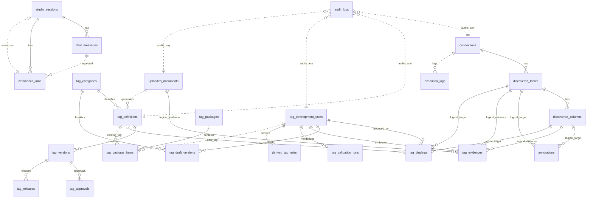
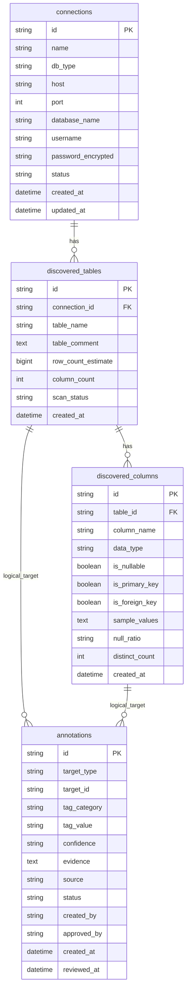
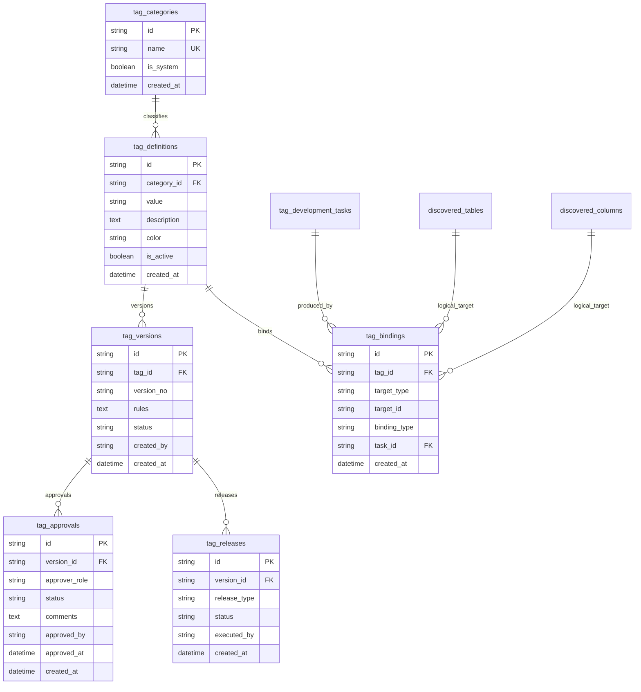
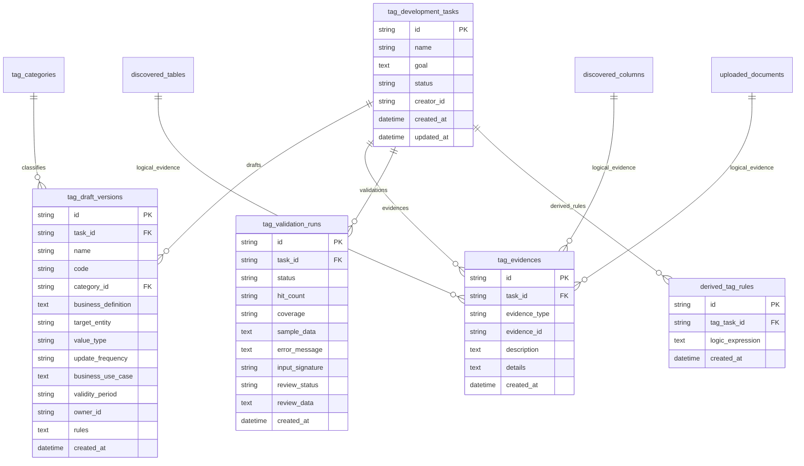
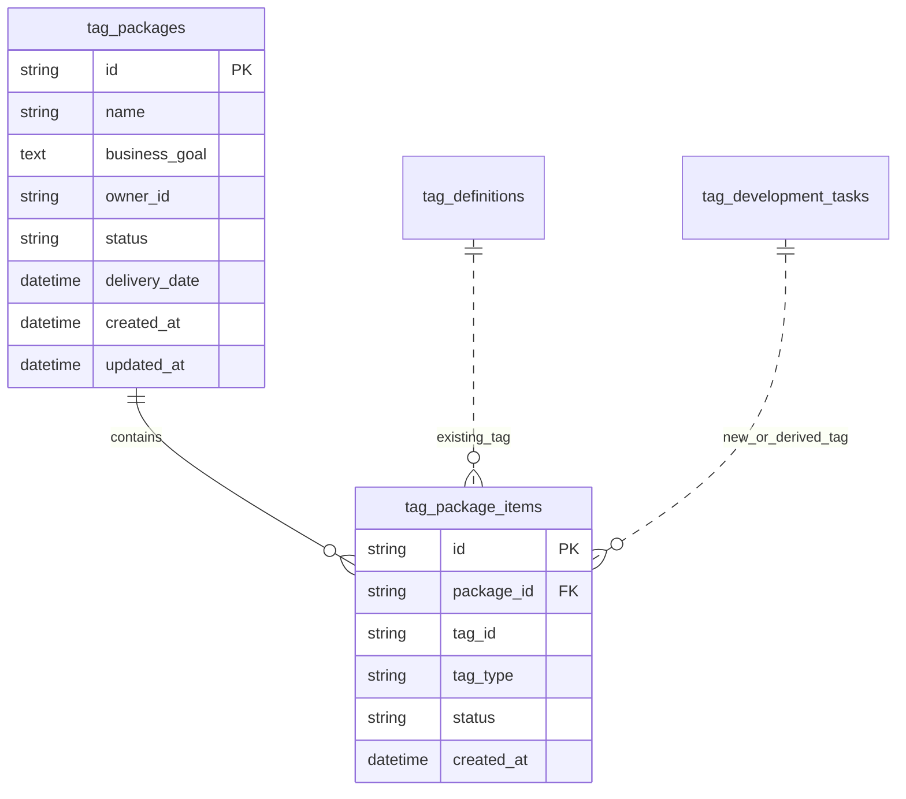
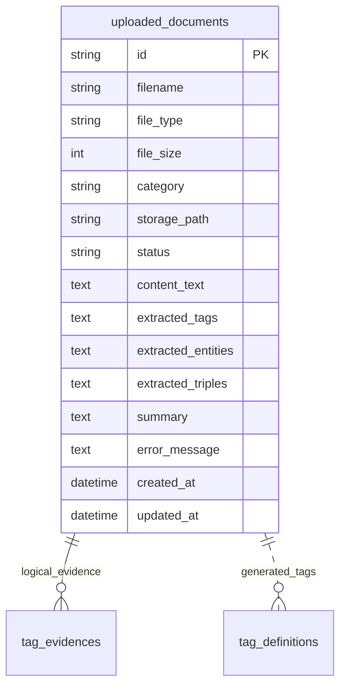
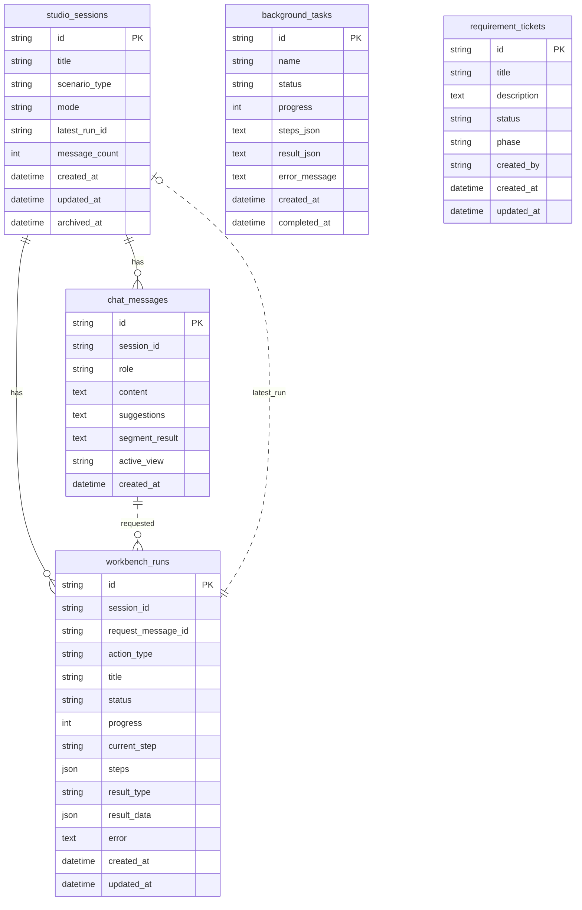
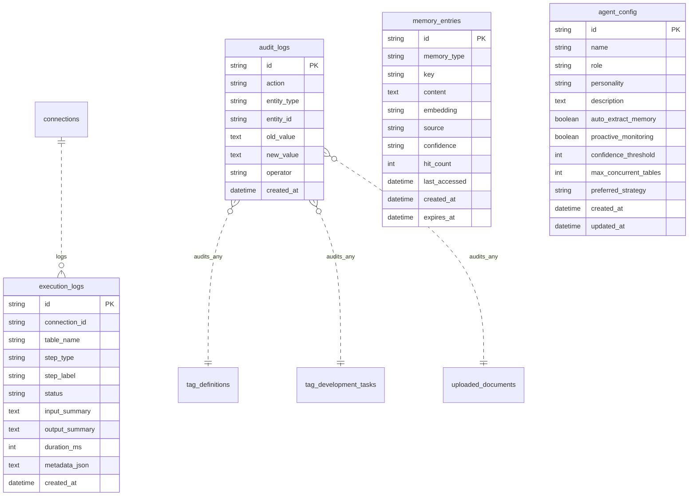

# AI 智能标签平台数据库 ER 图结构

## 1. 文档定位

本文档描述当前 AI 智能标签平台的核心数据库结构，用于产品评审、技术评审和演示数据说明。

结构依据当前 SQLAlchemy 模型和初始化 SQL 整理。实际建表主要由后端启动时的 `Base.metadata.create_all` 完成，部分旧初始化脚本中的历史表会在文末单独说明。

配套技术说明见 [AI 智能标签平台技术架构说明](./product-technical-overview.md)。

## 2. 数据域划分

| 数据域 | 核心表 | 说明 |
| --- | --- | --- |
| 数据资产 | `connections`、`discovered_tables`、`discovered_columns`、`annotations` | 数据源、表、字段和自动/人工标注 |
| 标签资产 | `tag_categories`、`tag_definitions`、`tag_versions`、`tag_approvals`、`tag_releases`、`tag_bindings` | 标签分类、定义、版本、审批、发布和回标 |
| 标签开发 | `tag_development_tasks`、`tag_draft_versions`、`tag_evidences`、`tag_validation_runs`、`derived_tag_rules` | 从需求到发布前的开发流程状态 |
| 标签包 | `tag_packages`、`tag_package_items` | 面向业务目标的一组标签资产 |
| 知识资产 | `uploaded_documents` | 知识正文、摘要、实体、关系三元组和候选标签 |
| 工作台 | `studio_sessions`、`chat_messages`、`workbench_runs`、`background_tasks`、`requirement_tickets` | Chat 会话、消息、结构化运行和需求跟踪 |
| 治理审计 | `audit_logs`、`execution_logs` | 操作审计和执行过程日志 |
| Agent 配置与记忆 | `agent_config`、`memory_entries` | Agent 行为配置和上下文记忆 |

## 3. 总体 ER 图



说明：

- 实线关系表示模型中存在明确外键，或业务上稳定的一对多关系。
- `logical_target`、`logical_evidence`、`audits_any` 表示逻辑引用或多态引用，数据库字段中通常通过 `target_type`、`evidence_type`、`entity_type` 配合 ID 识别目标。
- `uploaded_documents -> tag_definitions` 是业务生成关系，不是数据库外键；候选标签发布后会成为标签市场中的 `TagDefinition`。

## 4. 数据资产域



关键关系：

- `connections.id -> discovered_tables.connection_id`。
- `discovered_tables.id -> discovered_columns.table_id`。
- `annotations.target_type + annotations.target_id` 是多态引用，可指向表或字段。

## 5. 标签资产域



关键关系：

- `tag_definitions.category_id -> tag_categories.id`。
- `tag_versions.tag_id -> tag_definitions.id`。
- `tag_approvals.version_id -> tag_versions.id`。
- `tag_releases.version_id -> tag_versions.id`。
- `tag_bindings.tag_id -> tag_definitions.id`。
- `tag_bindings.task_id -> tag_development_tasks.id`。
- `tag_bindings.target_type + target_id` 可绑定表或字段，当前用于展示标签回标、血缘和复用情况。

## 6. 标签开发域



关键关系：

- `tag_draft_versions.task_id -> tag_development_tasks.id`。
- `tag_draft_versions.category_id -> tag_categories.id`。
- `tag_evidences.task_id -> tag_development_tasks.id`。
- `tag_validation_runs.task_id -> tag_development_tasks.id`。
- `derived_tag_rules.tag_task_id -> tag_development_tasks.id`。
- `tag_evidences.evidence_type + evidence_id` 可引用数据表、字段或知识文档。

## 7. 标签包域



关键关系：

- `tag_package_items.package_id -> tag_packages.id`。
- `tag_package_items.tag_id` 是多态引用：
  - `tag_type = existing` 时指向 `tag_definitions.id`。
  - `tag_type = new` 或 `derived` 时通常指向 `tag_development_tasks.id`。

## 8. 知识资产域



知识表说明：

- `file_type` 支持 `markdown`、`csv`、`excel`、`knowledge`。
- `extracted_tags` 保存 `{name, category, confidence, reason}` 数组。
- `extracted_entities` 保存 `{name, type, mentions}` 数组。
- `extracted_triples` 保存 `{subject, predicate, object}` 数组。
- `uploaded_documents` 与 `tag_definitions` 没有物理外键；发布知识候选标签时会创建新的标签定义。
- `tag_evidences.evidence_type = knowledge` 时，`evidence_id` 指向 `uploaded_documents.id`。

## 9. 工作台与任务域



关键关系：

- `chat_messages.session_id` 逻辑指向 `studio_sessions.id`。
- `workbench_runs.session_id` 逻辑指向 `studio_sessions.id`。
- `workbench_runs.request_message_id` 逻辑指向触发该运行的 `chat_messages.id`。
- `studio_sessions.latest_run_id` 逻辑指向最近一次 `workbench_runs.id`。
- 当前模型没有为这些工作台字段设置数据库外键，主要是为了降低历史会话迁移和 Demo 数据写入的耦合。

## 10. 治理、审计与 Agent 域



关键关系：

- `execution_logs.connection_id` 逻辑指向 `connections.id`。
- `audit_logs.entity_type + entity_id` 可审计任意业务实体，例如标签、标签任务、知识文档、数据连接等。
- `memory_entries` 和 `agent_config` 是 Agent 独立配置与记忆资产，不依赖具体业务表。

## 11. 逻辑外键与多态引用清单

| 表字段 | 类型字段 | 可能指向 | 用途 |
| --- | --- | --- | --- |
| `annotations.target_id` | `annotations.target_type` | `discovered_tables.id`、`discovered_columns.id` | 表/字段级数据标注 |
| `tag_evidences.evidence_id` | `tag_evidences.evidence_type` | `discovered_tables.id`、`discovered_columns.id`、`uploaded_documents.id` | 标签开发证据 |
| `tag_bindings.target_id` | `tag_bindings.target_type` | `discovered_tables.id`、`discovered_columns.id` | 标签发布后的回标绑定 |
| `tag_package_items.tag_id` | `tag_package_items.tag_type` | `tag_definitions.id`、`tag_development_tasks.id` | 标签包中混合已发布和开发中标签 |
| `audit_logs.entity_id` | `audit_logs.entity_type` | 任意业务实体 ID | 统一审计 |
| `workbench_runs.request_message_id` | 无 | `chat_messages.id` | 记录触发运行的用户消息 |
| `studio_sessions.latest_run_id` | 无 | `workbench_runs.id` | 快速定位最近一次运行 |

使用逻辑外键的主要原因是：标签、证据、审计和工作台运行需要覆盖多个业务对象，如果全部写成强外键，会让演示数据导入、历史兼容和跨模块扩展变得笨重。生产环境可以在服务层补充一致性校验、后台巡检和软删除保护。

## 12. 历史初始化脚本说明

`backend/sql/init.sql` 中保留了部分早期设计表，例如 `tag_dependencies`。当前 SQLAlchemy 模型未显式建模该表，核心业务流程也主要通过 `tag_package_items`、`derived_tag_rules`、`tag_bindings` 和 `tag_versions` 表表达标签之间的组合、派生和血缘关系。

如果后续需要恢复显式标签依赖关系，建议新增 ORM 模型，并将关系统一设计为：

```text
source_tag_id -> tag_definitions.id
target_tag_id -> tag_definitions.id
dependency_type -> uses | excludes | derives | replaces
```

这样可以服务标签影响分析、下线前校验和版本升级评估。
