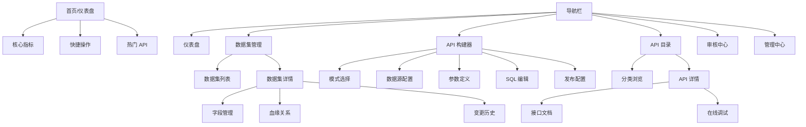

# 产品原型设计文档

| 版本 | 日期 | 修改人 | 说明 |
| :--- | :--- | :--- | :--- |
| v1.0 | 2026-01-01 | Design Team | 初始版本 |

## 1. 设计说明
本文档描述 Data API Platform 的高保真原型结构。实际 UI 设计文件（Figma/Sketch）请见附件链接。

## 2. 页面结构图 (Sitemap)

## 3. 核心页面交互描述

### 3.1 仪表盘 (Dashboard)
*   **布局**: 响应式栅格布局，顶部为 4 个关键指标卡片，中部为快捷入口，底部为图表/列表。
*   **交互**:
    *   Hover 指标卡片显示环比变化趋势。
    *   点击 "快捷操作" 卡片带有微交互动画（放大/阴影加深），平滑跳转至对应模块。

### 3.2 API 构建器 (Wizard)
*   **布局**: 顶部固定步骤条 (Stepper)，主体为表单/编辑器区域，底部固定操作栏。
*   **交互**:
    *   步骤切换时进行表单校验，校验失败输入框标红并提示。
    *   SQL 编辑器支持快捷键 (Cmd+Enter) 执行测试。
    *   右侧提供实时预览面板，展示当前配置生成的 API 结构。

### 3.3 数据集血缘 (Lineage)
*   **布局**: 全屏画布模式。
*   **交互**:
    *   支持鼠标滚轮缩放、拖拽平移。
    *   点击节点高亮显示上下游链路，侧边栏滑出显示节点详情。

## 4. 设计资源
*   **Figma 地址**: `[Internal Link]`
*   **组件库**: Shadcn UI (React)
*   **图标库**: Lucide React
