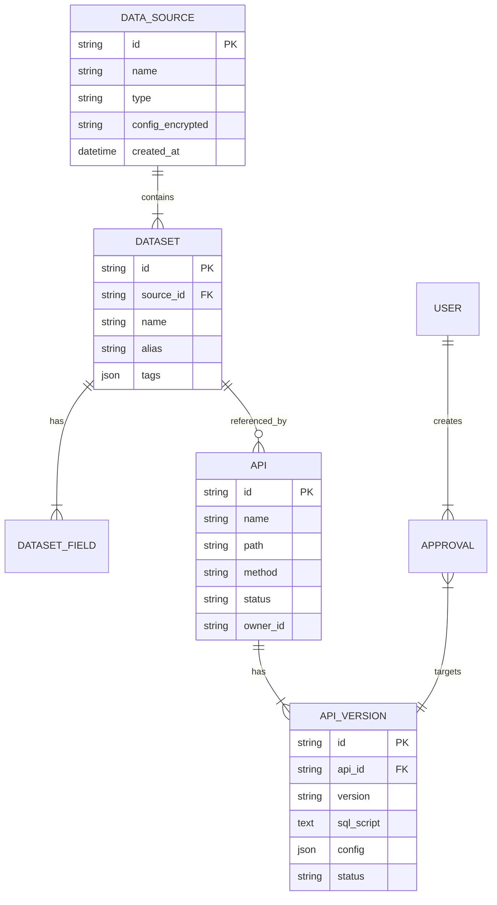

# 数据库设计文档

| 版本 | 日期 | 修改人 | 说明 |
| :--- | :--- | :--- | :--- |
| v1.0 | 2026-01-01 | DBA | 初始版本 |

## 1. 概述
系统配置数据库采用 MySQL 8.0。

## 2. ER 图

## 3. 表结构定义

### 3.1 `sys_data_source` (数据源表)
| 字段名 | 类型 | 必填 | 说明 |
| :--- | :--- | :--- | :--- |
| id | varchar(32) | Y | 主键 |
| name | varchar(100) | Y | 名称 |
| type | varchar(20) | Y | 类型 (mysql/maxcompute) |
| host | varchar(200) | Y | 主机地址 |
| ... | ... | ... | ... |

### 3.2 `sys_dataset` (数据集表)
| 字段名 | 类型 | 必填 | 说明 |
| :--- | :--- | :--- | :--- |
| id | varchar(32) | Y | 主键 |
| source_id | varchar(32) | Y | 关联数据源 |
| name | varchar(100) | Y | 英文名 (表名) |
| alias | varchar(100) | N | 中文别名 |
| schema_snapshot | json | N | 字段元数据快照 |

### 3.3 `sys_api` (API 主表)
| 字段名 | 类型 | 必填 | 说明 |
| :--- | :--- | :--- | :--- |
| id | varchar(32) | Y | 主键 |
| path | varchar(200) | Y | 访问路径 (唯一索引) |
| method | varchar(10) | Y | HTTP 方法 |
| current_version | varchar(20) | N | 当前发布版本 |

### 3.4 `sys_audit_log` (审计日志)
| 字段名 | 类型 | 必填 | 说明 |
| :--- | :--- | :--- | :--- |
| id | bigint | Y | 自增主键 |
| user_id | varchar(32) | Y | 操作人 |
| action | varchar(50) | Y | 动作 |
| resource | varchar(100) | Y | 资源 |
| detail | text | N | 详情 |
| created_at | datetime | Y | 时间 |
