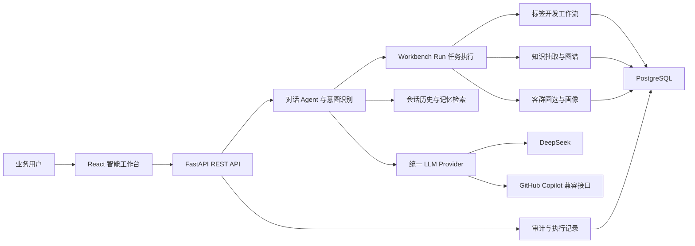
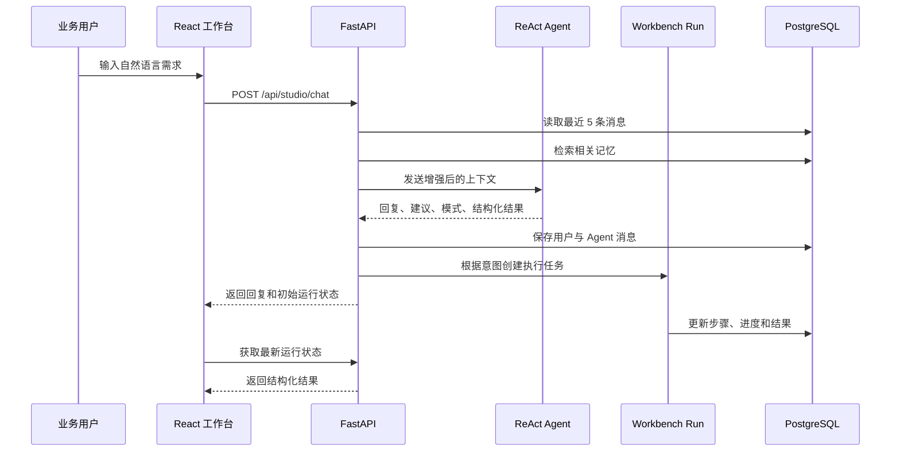

# AI 智能标签平台技术架构说明

## 1. 文档定位

本文档说明 AI 智能标签平台当前代码中已经采用的主要技术、核心数据流和工程实现，并补充从演示环境走向生产环境时需要关注的技术事项。

本文档以当前仓库实现为准，避免将规划能力描述为已经上线的能力。

配套演示逐字稿见 [留学金融标签全流程演示逐字稿](./study-abroad-demo-presentation-script.md)。

## 2. 整体架构



系统采用前后端分离架构：

- 前端负责工作台交互、会话管理和结构化结果展示。
- 后端负责会话上下文、Agent 编排、标签开发、知识抽取、圈选分析和治理 API。
- PostgreSQL 负责保存业务资产、流程状态、版本、证据和审计记录。
- LLM Provider 层负责隔离具体模型供应商。
- Demo Mode 提供可复现的演示数据和结果，正式模式可接入真实数据源与模型。

## 3. 技术栈

## 3.1 前端

| 技术 | 当前版本范围 | 用途 |
| --- | --- | --- |
| React | 18.2 | 页面与组件体系 |
| TypeScript | 5.3 | 类型约束和前端工程开发 |
| Vite | 5.4 | 开发服务器与生产构建 |
| React Router | 6.21 | 页面路由与模块导航 |
| Material UI | 7.x | 组件库、主题和交互控件 |
| Emotion | 11.11 | MUI 样式运行时 |
| Axios | 1.6 | REST API 请求 |
| Recharts | 3.8 | 客群画像和指标图表 |
| Three.js | 0.184 | 三维图形能力 |
| react-force-graph-3d | 1.29 | 知识关系图可视化 |

前端的关键设计不是单纯展示聊天文本，而是根据后端返回的 `result_type` 和 `result_data` 渲染不同的结构化结果。

当前工作台可识别的结果类型包括：

- `search_tags`
- `analyze_segment`
- `create_rule`
- `system_overview`
- `import_knowledge`
- `knowledge_to_tags`
- `run_scenario`

因此，同一个 Chat 界面可以根据任务类型展示标签列表、规则条件、运行步骤、指标卡和客群画像。

## 3.2 后端

| 技术 | 当前版本 | 用途 |
| --- | ---: | --- |
| Python | 3.x | 后端运行环境 |
| FastAPI | 0.110.0 | REST API 与异步服务 |
| Uvicorn | 0.27.0 | ASGI 服务运行 |
| Pydantic | 2.5.0 | 请求、响应和配置校验 |
| SQLAlchemy | 2.0.25 | ORM 与数据库访问 |
| asyncpg | 0.29.0 | PostgreSQL 异步驱动 |
| psycopg2 | 2.9.9 | PostgreSQL 同步访问 |
| Alembic | 1.13.0 | 数据库迁移依赖 |
| Cryptography | 41.0.7 | 数据连接密码加密 |
| HTTPX | 0.26.0 | 异步 HTTP 调用 |
| OpenAI SDK | 1.6.0 | OpenAI 兼容模型接口 |
| Anthropic SDK | 0.31.0 | 模型接入依赖 |
| Pytest | 7.4.3 | 自动化测试 |

FastAPI 启动时会：

1. 加载全部 SQLAlchemy 模型。
2. 创建缺失的数据表。
3. 执行标签工作流字段兼容升级。
4. 在 Demo Mode 下自动补充基础演示数据。
5. 注册工作台、标签、知识、治理、审计和配置等 API Router。

## 3.3 数据库

Docker 环境采用：

- PostgreSQL 16
- `pgvector/pgvector:pg16` 镜像
- `asyncpg` 处理异步业务请求
- `psycopg2` 支持同步脚本和管理操作

本地开发配置同时保留 SQLite 作为轻量级默认数据库，但本次留学场景 SQL 面向 PostgreSQL 16+。

核心数据域包括：

| 数据域 | 主要内容 |
| --- | --- |
| 标签资产 | 标签分类、标签定义、标签版本、发布记录 |
| 标签开发 | 开发任务、草稿、证据、规则、验证运行 |
| 数据资产 | 数据连接、发现表、发现字段、数据标注 |
| 知识资产 | 文档正文、候选标签、实体、关系三元组 |
| 工作台 | 会话、聊天消息、后台运行、执行步骤 |
| 圈选分析 | 圈选规则、结果指标、画像样本 |
| 治理审计 | 数据绑定、执行日志、审批与审计日志 |
| Agent 记忆 | 用户意图、场景经验和命中次数 |

## 4. 工作台技术流程



## 4.1 会话上下文

工作台请求会携带 `session_id`。后端在处理新消息时：

- 读取该会话最近 5 条消息。
- 将历史消息拼接到系统提示词中。
- 对记忆表执行基础关键词检索，最多加载 3 条相关记忆。
- 将会话上下文与记忆一起交给 Agent。
- 保存用户消息和 Agent 回复。
- 更新会话标题、消息数、最近运行和场景类型。

前端将当前会话 ID 保存在浏览器 `localStorage` 中，并支持：

- 新建会话
- 选择历史会话
- 归档会话
- 清空当前会话
- 在 Demo 与 AI 模式之间建立不同会话

## 4.2 Agent 与意图分类

工作台后端通过 `run_react_agent` 处理对话，再通过 `classify_workbench_action` 判断是否需要创建结构化执行任务。

可触发的典型任务包括：

- 标签发现
- 数据价值分析
- 标签规则创建
- 客群圈选
- 系统概览
- 知识导入与标签生成

Agent 返回内容不仅包括自然语言回复，还可以包含：

- 推荐问题 `suggestions`
- 推理或执行模式 `mode`
- 执行步骤 `steps`
- 客群结果 `segment_result`
- 当前工作台视图 `active_view`

## 4.3 Workbench Run

需要执行的请求会创建 `WorkbenchRun`，主要字段包括：

- 请求消息 ID
- 动作类型
- 任务标题
- 状态
- 执行进度
- 当前步骤
- 步骤列表
- 结果类型
- 结构化结果
- 错误信息

状态模型包括：

- `pending`
- `running`
- `succeeded`
- `failed`
- `canceled`

这种设计把“聊天回复”和“后台任务”分开，使耗时操作可以展示进度，并允许前端持续获取任务状态。

## 5. 标签开发工作流

标签开发采用五步流程：

```text
定义标签目标
  -> 选择数据证据
  -> 配置标签规则
  -> 执行样本验证
  -> 确认发布
```

## 5.1 定义标签目标

标签草稿保存以下信息：

- 标签名称与编码
- 标签分类
- 业务定义
- 目标实体
- 值类型
- 更新频率
- 业务使用场景
- 有效期
- 负责人

## 5.2 选择数据证据

证据可以来自：

- 数据表
- 数据字段
- 知识文档

数据证据同时记录：

- 已选择字段
- 是否完成样本检查
- 已确认的数据质量告警
- 数据来源与血缘信息

## 5.3 配置结构化规则

规则节点支持：

- `=`
- `!=`
- `>`
- `>=`
- `<`
- `<=`
- `BETWEEN`
- `IN`
- `CONTAINS`
- `IS_NULL`

节点之间使用 `AND` 或 `OR` 连接。结构化规则比纯 SQL 文本更适合前端编辑、规则校验、差异比较和多执行引擎转换。

## 5.4 样本验证

验证运行会生成：

- 命中人数
- 覆盖率
- 命中样本
- 未命中样本
- 边界样本
- 验证状态
- 审批状态

系统会根据标签草稿和证据计算 `validation_signature`。如果规则或证据发生变化，输入签名也会变化，可用于识别之前的验证结果已经过期，避免使用旧验证结果直接发布新规则。

## 5.5 发布与版本

发布后形成：

- 正式标签定义
- 标签版本
- 发布记录
- 审批记录
- 标签与表、字段、知识的绑定关系
- 标签包中的可复用资产

该机制确保标签不是一次性查询，而是具有生命周期和版本的企业数据资产。

## 6. 知识技术

知识模块支持：

- 手工输入知识
- 上传文档
- 文档分析
- 候选标签抽取
- 实体抽取
- 关系三元组抽取
- 文档摘要
- 从知识发布标签
- 全局或单文档知识图谱查询

知识条目的结构化结果包括：

```json
{
  "extracted_tags": [
    {
      "name": "营销可触达",
      "category": "合规授权",
      "confidence": 99,
      "reason": "规则直接定义可营销触达条件"
    }
  ],
  "extracted_entities": [
    {
      "name": "营销授权",
      "type": "concept",
      "mentions": 3
    }
  ],
  "extracted_triples": [
    {
      "subject": "营销可触达",
      "predicate": "要求",
      "object": "granted 授权状态"
    }
  ]
}
```

前端可将实体和关系转换为知识图谱节点与边，并支持三维关系图展示。

## 7. LLM 接入

后端定义统一的 `LLMProvider` 抽象，主要能力包括：

- 普通对话
- 流式对话
- 模型列表
- 统一响应结构
- Token 使用量记录

当前代码中存在以下 Provider：

- DeepSeek Provider
- GitHub Copilot OpenAI 兼容 Provider

两者都通过 OpenAI SDK 的兼容接口调用。知识分析当前可使用 DeepSeek 配置。

模型配置通过环境变量加载：

```env
LLM={"deepseek":{"api_key":"***","base_url":"https://api.deepseek.com/v1"}}
```

这种抽象的主要价值是：

- 业务逻辑不直接依赖某个模型供应商。
- 可以根据成本、合规和能力切换模型。
- Demo Mode 可以在没有模型服务时稳定复现产品流程。

## 8. Skills 与执行管线

项目提供基础 Skill 抽象：

- `SkillMetadata`
- `SkillContext`
- `SkillResult`
- `BaseSkill`
- `SkillRegistry`
- `PipelineExecutor`

Skill 可以声明：

- 名称与版本
- 类型
- 依赖项
- 最低模型要求
- 输入校验
- 执行逻辑
- 成本估算

Pipeline Executor 根据 `depends_on` 关系顺序执行 Skill。当前内置能力包括 PII 检测等数据处理技能。

该机制为后续扩展数据采样、质量检查、字段语义识别、标签推断和治理策略提供统一接口。

## 9. 数据治理与审计

## 9.1 可追溯关系

标签可以绑定到：

- 数据表
- 数据字段
- 知识文档
- 标签开发任务

因此可以从标签反查来源，也可以从数据资产查看被哪些标签使用。

## 9.2 审计记录

审计记录保存：

- 操作类型
- 实体类型
- 实体 ID
- 变更前内容
- 变更后内容
- 操作人
- 操作时间

留学演示数据中覆盖：

- 知识分析
- 标签包创建
- 合规审批
- 标签发布
- 客群圈选与导出许可

## 9.3 PII 与样本保护

当前代码具备：

- PII 正则检测 Skill
- 身份证、手机号、邮箱模式识别
- 数据字段样本脱敏结构
- 数据连接密码加密

连接密码使用 Fernet 对称加密后保存，密钥通过环境配置提供。

## 10. Demo Mode 与正式模式

## 10.1 Demo Mode

Demo Mode 的用途：

- 产品评审稳定演示
- 无真实客户数据情况下展示完整流程
- 无外部模型服务时复现结构化结果
- 测试标签开发和圈选页面

Demo Mode 可以通过环境变量和运行时设置控制：

```env
DEMO_MODE=true
```

## 10.2 正式模式

正式模式需要：

- 配置真实 PostgreSQL
- 建立真实数据连接
- 扫描数据表和字段
- 配置模型服务及密钥
- 关闭 Demo Mode
- 按企业要求配置身份、权限和审计策略

## 11. 部署架构

当前 Docker Compose 包含三个服务：

| 服务 | 容器能力 | 默认端口 |
| --- | --- | ---: |
| postgres | PostgreSQL 16 与 pgvector | 5432 |
| backend | FastAPI API | 8000 |
| frontend | 前端静态资源与代理 | 80 |

启动命令：

```bash
docker compose up -d
```

开发模式：

```bash
# 后端
cd backend
uvicorn app.main:app --reload --port 8090

# 前端
cd frontend
npx vite --port 5173
```

## 12. 当前安全边界

当前仓库更接近产品原型和 MVP。以下能力已经存在：

- 数据连接密码加密
- PII 基础检测
- 数据样本脱敏字段
- 操作审计模型
- 合规审批与验证记录
- 环境变量配置模型密钥和数据库连接

当前实现中仍需生产化加强的部分：

- CORS 当前允许所有来源，生产环境需要配置可信域名。
- 默认加密密钥必须替换，并接入企业密钥管理系统。
- 需要接入统一身份认证、SSO 和细粒度 RBAC。
- 模型调用需要增加敏感信息过滤、调用审计和数据出境控制。
- 数据库需要配置最小权限账号、网络隔离、备份和容灾。
- Workbench 后台任务可进一步迁移到独立任务队列。
- 需要补充限流、超时、重试、熔断和统一可观测性。

评审时应将以上内容描述为生产化建议，不应表述为当前已经全部完成。

## 13. 技术优势总结

### 对业务人员

- 自然语言驱动，不需要理解底层表结构。
- Chat 与结构化工作台结合，不是纯文本问答。
- 从需求到圈选保持在同一个会话上下文中。

### 对数据开发人员

- 标签规则采用结构化节点。
- 数据表、字段和知识证据可追踪。
- 验证结果与输入签名绑定，规则变化可触发重新验证。

### 对管理与合规人员

- 标签具有版本、审批和发布状态。
- 营销授权可以作为强制准入条件。
- 操作过程、数据绑定和结果导出具有审计记录。

### 对技术团队

- 前后端分离，模块边界清晰。
- LLM Provider 与模型供应商解耦。
- Skill 和 Pipeline 支持扩展。
- Demo 与正式模式分离，兼顾演示稳定性和真实集成。

## 14. 两分钟技术介绍稿

> 产品前端采用 React、TypeScript、Vite 和 Material UI。工作台不是简单的聊天窗口，而是会根据任务类型动态展示标签检索结果、规则条件、执行步骤、客群画像和治理指标。
>
> 后端采用 FastAPI、Pydantic 和 SQLAlchemy。用户发送消息后，系统会加载最近的会话历史和相关记忆，通过 Agent 理解需求，再判断是否需要创建标签发现、标签开发、圈选分析或治理检查任务。
>
> 对于需要执行的操作，系统使用 Workbench Run 持久化状态、进度、步骤和结构化结果，使前端可以持续展示执行过程。
>
> 标签开发采用定义、证据、规则、验证、发布五步流程。知识模块可以从文档中提取标签、实体和关系，再将知识规则映射到真实数据表和字段。验证结果通过输入签名与当前规则和证据绑定，避免规则变化后继续使用过期验证。
>
> 数据层使用 PostgreSQL，Docker 环境采用 PostgreSQL 16 和 pgvector 镜像。标签定义、版本、证据、数据绑定、工作台会话、执行记录和审计日志都会持久化。
>
> 模型层通过统一 Provider 接口与业务逻辑解耦，当前支持 DeepSeek 和 GitHub Copilot 的 OpenAI 兼容接口。Demo Mode 用于稳定评审，正式模式可以切换到真实模型和真实数据源。

## 15. 技术问答参考

### 为什么采用 FastAPI？

FastAPI 支持异步请求、Pydantic 类型校验和自动 API 文档，适合工作台会话、后台运行状态和数据资产 API。

### 为什么结果不是全部由大模型直接生成？

大模型负责需求理解、候选生成和流程编排。标签定义、证据、规则、验证、发布和审计由结构化数据模型保存，避免关键业务资产只存在于模型输出中。

### 如何避免模型幻觉直接影响营销名单？

候选标签和规则必须绑定知识及数据证据，并经过样本验证和审批。最终圈选使用已发布版本，而不是直接执行模型生成的自然语言。

### 如何支持替换模型？

业务层依赖统一 `LLMProvider`，Provider 内部封装不同模型服务。替换模型时主要调整 Provider 和环境配置，不需要重写标签业务流程。

### 为什么使用 PostgreSQL 和 pgvector 镜像？

PostgreSQL 适合保存标签、规则、版本和审计等强结构化数据。pgvector 为后续知识向量检索和语义记忆提供扩展基础。当前工作台记忆检索仍以基础关键词匹配为主。

### 是否已经支持完整的企业权限体系？

当前仓库属于 MVP，已经具备审计、审批和密码加密等基础能力，但统一身份、SSO、细粒度 RBAC 和企业密钥管理仍属于生产化建设内容。
