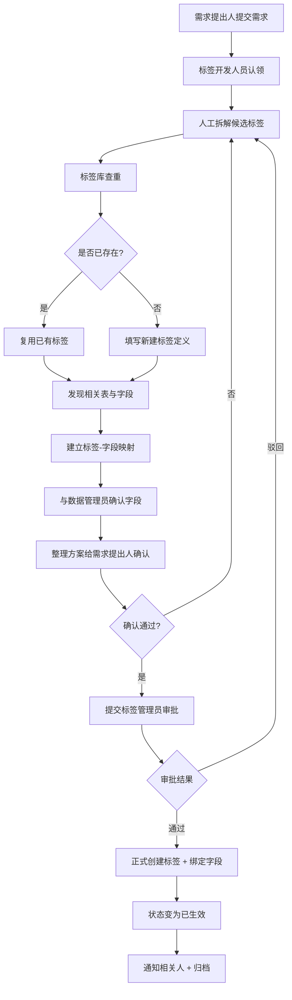

# 手动标签开发完整流程设计文档

**版本**：v1.0  
**日期**：2026-08-15  
**目标**：在引入 AI Agent 之前，先完整实现人工驱动的标签从需求到落地全流程，作为后续自动化的基础和对照标准。

---

## 1. 流程目标与范围

**目标**：业务人员提出需求后，标签开发人员通过标准化步骤完成：
1. 需求理解与标签拆解
2. 标签库查重与新建
3. 数据表/字段发现与关联
4. 标签定义确认与审批
5. 正式创建并生效
6. 结果归档与反馈

**范围**：仅覆盖「标签开发」主流程，不包含标签后续使用（圈人、分析等）。

---

## 2. 角色定义

| 角色           | 职责说明                                                                 | 主要操作权限                     |
|----------------|--------------------------------------------------------------------------|----------------------------------|
| 需求提出人     | 提出业务需求，提供背景与目标                                             | 提交需求、查看进度、验收结果     |
| 标签开发人员   | 主导标签拆解、查重、新建、字段关联、提交审批                             | 全部开发操作 + 提交审批          |
| 数据管理员     | 提供表结构信息、确认字段可用性、协助映射建议                             | 查看元数据、确认字段可用性       |
| 标签管理员     | 审核标签命名规范、冲突检查、最终审批                                     | 审批通过/驳回、强制修改          |
| 系统管理员     | 维护标签库、表元数据、权限配置                                           | 系统配置                         |

---

## 3. 核心状态流转

```
【草稿】 → 【待查重】 → 【待关联】 → 【待确认】 → 【待审批】 → 【已生效】
                ↓           ↓           ↓           ↓
             【已驳回】 ←———————————————←———————————←
```

状态说明：
- **草稿**：刚创建，仅开发人员可见
- **待查重**：已拆解标签，等待与标签库比对
- **待关联**：查重完成，等待字段映射
- **待确认**：映射完成，等待需求提出人或开发人员最终确认
- **待审批**：已提交给标签管理员审批
- **已生效**：审批通过，标签正式可用
- **已驳回**：任意环节被驳回，退回修改

---

## 4. 完整手动流程（分步骤）

### 阶段一：需求接收与拆解

**步骤 1.1 提交需求**
- 需求提出人在系统中填写：
  - 需求标题
  - 需求描述（自然语言，如「在广州举行信用卡推荐活动为留学生」）
  - 业务背景 / 目标
  - 期望完成时间
  - 优先级
- 系统生成唯一需求编号（如 TAG-REQ-20260815-001）

**步骤 1.2 需求认领**
- 标签开发人员认领需求，状态变为「草稿」

**步骤 1.3 标签拆解**
- 开发人员根据需求描述，人工拆解出候选标签
- 建议拆解维度（标准化）：
  | 维度         | 示例                     | 说明                     |
  |--------------|--------------------------|--------------------------|
  | 地点         | 广州                     | 城市/区域                |
  | 人群         | 留学生                   | 目标用户画像             |
  | 产品         | 信用卡                   | 涉及产品                 |
  | 活动类型     | 推荐活动                 | 营销/运营动作            |
  | 时间         | （如有）                 | 活动时间范围             |
  | 渠道         | （如有）                 | 线上/线下等              |
  | 其他属性     | （按业务补充）           | 自定义扩展               |

- 每个标签需填写：
  - 标签名称
  - 标签类型（枚举）
  - 标签值 / 规则描述
  - 业务含义说明

**输出物**：候选标签列表（草稿状态）

---

### 阶段二：标签库查重与新建决策

**步骤 2.1 查重**
- 开发人员在标签库中搜索每个候选标签（支持模糊搜索 + 精确匹配）
- 系统展示：
  - 是否已存在
  - 已存在标签的定义、创建人、使用情况
  - 相似标签列表

**步骤 2.2 决策**
- **已存在且可用** → 直接复用，记录引用关系
- **已存在但定义不符** → 标记为「需修改」或「新建变体」
- **不存在** → 进入新建流程

**步骤 2.3 新建标签（如需要）**
- 填写完整标签定义：
  - 标签编码（系统自动生成或规则生成）
  - 标签名称
  - 标签类型
  - 标签值类型（枚举 / 数值 / 布尔 / 文本 / 规则）
  - 业务描述
  - 适用范围
  - 创建原因（关联需求编号）
- 状态更新为「待关联」

---

### 阶段三：表字段发现与关联

**步骤 3.1 发现相关表与字段**
- 开发人员根据标签含义，在数据字典 / 元数据平台中查找相关表
- 可借助数据管理员协助
- 记录候选表与字段：
  - 库名.表名
  - 字段名
  - 字段类型
  - 字段含义
  - 是否可直接使用 / 需要加工

**步骤 3.2 建立映射关系**
- 为每个标签选择最合适的字段，建立关联：
  | 标签名称   | 表名            | 字段名                      | 映射规则 / 取值逻辑              | 备注         |
  |------------|-----------------|-----------------------------|----------------------------------|--------------|
  | 广州       | user_profile    | city                        | city = '广州'                    | 直接匹配     |
  | 留学生     | user_profile    | is_international_student    | is_international_student = true  | 布尔字段     |
  | 信用卡     | card_info       | card_type                   | card_type = '信用卡'             |              |
  | 推荐活动   | activity        | activity_type               | activity_type = '推荐活动'       | 新建标签     |

- 支持一对多、多对一映射
- 复杂规则可写伪代码或 SQL 条件

**步骤 3.3 映射确认**
- 开发人员与数据管理员共同确认字段可用性、数据质量、更新频率
- 状态更新为「待确认」

---

### 阶段四：确认与审批

**步骤 4.1 内部确认**
- 开发人员整理完整方案，向需求提出人展示：
  - 最终标签列表（新建 + 复用）
  - 每个标签的字段映射
  - 业务规则说明
- 需求提出人确认或提出修改意见

**步骤 4.2 提交审批**
- 确认无误后，提交给标签管理员审批
- 状态变为「待审批」
- 系统自动通知审批人

**步骤 4.3 审批**
- 标签管理员检查：
  - 命名是否规范
  - 是否与现有标签冲突
  - 业务含义是否清晰
  - 映射是否合理
- 操作：通过 / 驳回（需填写原因）

---

### 阶段五：生效与归档

**步骤 5.1 正式创建与绑定**
- 审批通过后，系统（或开发人员）执行：
  - 在标签库中正式创建新标签
  - 写入标签与表字段的绑定关系
  - 记录操作日志与需求关联

**步骤 5.2 状态更新与通知**
- 状态变为「已生效」
- 通知需求提出人与相关方
- 生成标签使用说明文档（可选）

**步骤 5.3 归档**
- 全流程记录归档，包括：
  - 原始需求
  - 拆解过程
  - 查重结果
  - 映射关系
  - 审批意见
  - 最终生效标签

---

## 5. 关键数据对象设计（建议）

### 5.1 需求单（TagRequirement）
- requirement_id
- title
- description
- background
- priority
- status
- creator
- assignee
- created_at / updated_at

### 5.2 标签定义（TagDefinition）
- tag_id
- tag_code
- tag_name
- tag_type
- value_type
- description
- status（草稿/生效/废弃）
- source_requirement_id
- created_by
- created_at

### 5.3 标签-字段映射（TagFieldMapping）
- mapping_id
- tag_id
- database_name
- table_name
- field_name
- mapping_rule（SQL 条件或描述）
- confidence / remark
- status

### 5.4 操作日志（TagOperationLog）
- 记录每一步操作人、时间、动作、前后状态

---

## 6. 系统功能支撑清单（手动阶段需要的最小系统能力）

| 功能模块           | 说明                                                                 |
|--------------------|----------------------------------------------------------------------|
| 需求管理           | 提交、认领、状态跟踪、评论                                           |
| 标签库管理         | 搜索、新建、编辑、查重、查看使用情况                                 |
| 元数据浏览         | 查看库表字段、字段含义、数据样例                                     |
| 映射管理           | 可视化或表格方式建立标签与字段关联                                   |
| 审批流             | 简单的提交-审批-驳回流程                                             |
| 通知               | 站内信 / 邮件 / 企微通知关键节点                                     |
| 日志与审计         | 全流程操作记录                                                       |
| 导出               | 支持导出标签定义与映射关系                                           |

---

## 7. 流程图（手动完整流程）



---

## 8. 关键规范建议（提前定义好，后续 Agent 可直接复用）

1. **标签命名规范**
   - 简洁、业务可读
   - 避免过于宽泛或过于细碎
   - 统一前缀或分类体系（可选）

2. **标签类型枚举**（建议固化）
   - location / audience / product / activity / time / channel / attribute / other

3. **映射规则书写规范**
   - 优先使用简单等值条件
   - 复杂逻辑需写清伪代码或 SQL，并注明数据更新频率

4. **审批标准 checklist**
   - 命名是否规范
   - 是否重复
   - 业务含义是否清晰
   - 字段是否真实可用
   - 是否符合数据安全要求

---

## 9. 实施建议（手动阶段）

1. **先用表格/飞书多维表跑通**（最快验证流程）
   - 需求表、标签定义表、映射表、审批记录表
2. **再做轻量系统**（需求管理 + 标签库 + 简单审批）
3. **数据字典必须先完善**，否则字段发现环节会卡死
4. **每个环节强制写操作日志**，为后续 Agent 训练和审计打基础
5. **定期复盘**：哪些步骤最耗时、最容易出错，这些就是 Agent 优先自动化的点

---

## 10. 与后续 AI Agent 的衔接点

手动流程跑通后，以下环节最适合被 Agent 接管：

| 手动步骤               | Agent 可自动化程度 | 说明                           |
|------------------------|--------------------|--------------------------------|
| 标签拆解               | 高                 | 已有抽取能力                   |
| 标签库查重             | 高                 | 工具化即可                     |
| 字段发现与映射推荐     | 中高               | 需要元数据 + 语义匹配          |
| 命名规范与冲突检查     | 高                 | 规则 + LLM                     |
| 审批决策               | 低（保留人工）     | 关键权限节点建议保留           |
| 正式创建与绑定         | 高（确认后）       | 工具执行即可                   |

---

**文档结束**

此手动流程设计可作为「标准作业程序（SOP）」，后续引入 Agent 时，只需把对应步骤替换为工具调用 + 状态机节点即可，业务规则与审批边界保持不变。
